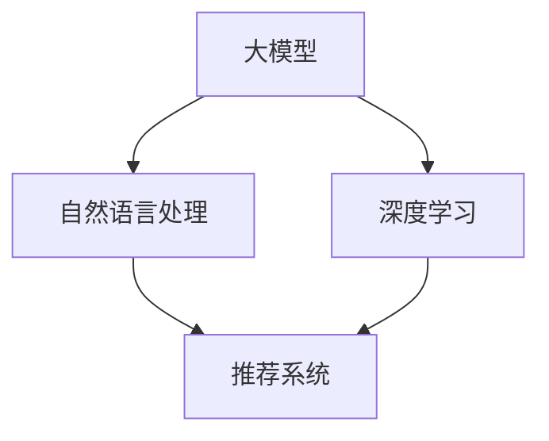

                 

# 大模型驱动的智能代码重用推荐

## 关键词
大模型，智能代码重用，推荐系统，自然语言处理，深度学习，算法优化，代码复用率，软件工程

## 摘要
本文旨在探讨大模型驱动的智能代码重用推荐技术，深入分析其核心概念、算法原理、数学模型以及实际应用场景。通过详细的案例解析和开发环境搭建，本文将为读者提供全面的技术指南，帮助其理解和实现基于大模型的智能代码重用推荐系统，从而提升软件工程的效率和代码质量。

## 1. 背景介绍

### 1.1 目的和范围
本文的主要目的是介绍和探讨大模型在智能代码重用推荐领域的应用。我们将详细分析大模型如何通过自然语言处理和深度学习技术，对代码库进行语义理解和分析，从而实现高效的代码重用推荐。本文将涵盖以下内容：

- 大模型的核心概念与原理
- 智能代码重用推荐系统的构建
- 数学模型和算法原理的详细阐述
- 实际应用案例和实践操作
- 未来发展趋势与挑战

### 1.2 预期读者
本文适合对软件工程、自然语言处理和人工智能有一定了解的读者，尤其是那些希望了解大模型在智能代码重用推荐中应用的程序员、软件开发工程师、系统架构师和技术经理。

### 1.3 文档结构概述
本文分为十个主要部分：

1. **背景介绍**：介绍本文的目的、范围、预期读者和文档结构。
2. **核心概念与联系**：通过Mermaid流程图阐述大模型在智能代码重用推荐中的核心概念与联系。
3. **核心算法原理 & 具体操作步骤**：使用伪代码详细阐述算法原理和具体操作步骤。
4. **数学模型和公式 & 详细讲解 & 举例说明**：讲解相关数学模型和公式，并提供举例说明。
5. **项目实战：代码实际案例和详细解释说明**：提供实际代码案例和详细解释。
6. **实际应用场景**：探讨智能代码重用推荐在不同场景中的应用。
7. **工具和资源推荐**：推荐学习资源、开发工具和框架。
8. **相关论文著作推荐**：推荐经典论文和最新研究成果。
9. **总结：未来发展趋势与挑战**：总结文章内容，展望未来发展趋势和挑战。
10. **附录：常见问题与解答**：回答读者可能遇到的常见问题。

### 1.4 术语表

#### 1.4.1 核心术语定义

- **大模型**：指的是具有数百万甚至数十亿参数的深度学习模型，如GPT、BERT等。
- **智能代码重用推荐**：利用大模型对代码库进行语义分析，为开发者推荐可重用的代码片段。
- **自然语言处理（NLP）**：研究如何使计算机理解和生成自然语言的技术。
- **深度学习**：一种基于多层神经网络的机器学习方法，用于特征提取和模式识别。

#### 1.4.2 相关概念解释

- **代码库**：存储和管理代码的集中式存储系统，如Git仓库。
- **语义理解**：对代码进行语义层面的分析和理解，以识别其功能和用途。
- **推荐系统**：根据用户的历史行为和偏好，为其推荐相关内容或服务的系统。

#### 1.4.3 缩略词列表

- **NLP**：自然语言处理
- **GPT**：生成预训练变换器
- **BERT**：双向编码表示器
- **IDE**：集成开发环境

## 2. 核心概念与联系

在大模型驱动的智能代码重用推荐中，核心概念主要包括大模型、自然语言处理、深度学习和推荐系统。下面将通过Mermaid流程图展示这些概念之间的联系。



- **大模型**：作为基础，大模型通过大量的代码库数据进行预训练，学习到丰富的语义知识。
- **自然语言处理（NLP）**：将代码转换为自然语言描述，便于深度学习和推荐系统处理。
- **深度学习**：利用神经网络对代码的语义特征进行提取和表示，为代码重用推荐提供基础。
- **推荐系统**：基于用户的代码使用历史和代码库的语义信息，为开发者推荐可重用的代码片段。

## 3. 核心算法原理 & 具体操作步骤

### 3.1 大模型预训练

在智能代码重用推荐系统中，首先需要利用大模型对代码库进行预训练。具体步骤如下：

```python
# 伪代码：大模型预训练
def pretrain_model(code_corpus):
    # 加载预训练模型架构（如GPT-3、BERT）
    model = load_pretrained_model()

    # 预处理代码库，转换为自然语言描述
    processed_corpus = preprocess_code_corpus(code_corpus)

    # 微调模型，学习代码库中的语义知识
    model.fit(processed_corpus)

    return model
```

### 3.2 代码语义分析

预训练完成后，利用大模型对代码进行语义分析，以提取其功能描述和特征表示。具体步骤如下：

```python
# 伪代码：代码语义分析
def analyze_code_semantics(model, code):
    # 使用大模型对代码进行语义分析
    semantics = model.encode(code)

    # 提取代码的功能描述和特征表示
    function_description = extract_function_description(semantics)
    feature_representation = extract_feature_representation(semantics)

    return function_description, feature_representation
```

### 3.3 代码重用推荐

基于分析结果，利用推荐系统为开发者推荐可重用的代码片段。具体步骤如下：

```python
# 伪代码：代码重用推荐
def recommend_code_reuse(user_history, code_corpus, model):
    # 提取用户历史代码的语义特征
    user_semantics = [model.encode(code) for code in user_history]

    # 计算代码库中代码与用户历史代码的相似度
    similarity_scores = compute_similarity_scores(user_semantics, code_corpus)

    # 排序并推荐相似度最高的代码片段
    recommended_codes = recommend_top_codes(similarity_scores, code_corpus)

    return recommended_codes
```

## 4. 数学模型和公式 & 详细讲解 & 举例说明

在智能代码重用推荐系统中，数学模型主要用于描述代码的语义特征提取、相似度计算和推荐算法。以下将详细讲解相关数学模型和公式。

### 4.1 代码语义特征提取

代码语义特征提取通常使用编码器（Encoder）模型，如BERT、GPT等。这些模型通过多层神经网络将代码序列转换为固定长度的向量表示。具体公式如下：

$$
\text{embeddings} = \text{Encoder}(\text{code_sequence})
$$

其中，`embeddings`为代码的语义特征向量。

### 4.2 相似度计算

代码相似度计算通常使用余弦相似度（Cosine Similarity）或欧几里得距离（Euclidean Distance）。以下为余弦相似度的公式：

$$
\text{similarity} = \frac{\text{dot_product}(\text{vec1}, \text{vec2})}{\|\text{vec1}\|\|\text{vec2}\|}
$$

其中，`\text{vec1}`和`\text{vec2}`分别为代码的语义特征向量，`\text{dot_product}`为点积操作，`|\text{vec1}\|`和`|\text{vec2}\|`分别为向量的模长。

### 4.3 推荐算法

推荐算法通常采用基于相似度的方法，如 collaborative filtering 或 content-based filtering。以下为基于内容推荐的简单公式：

$$
\text{relevance} = \text{similarity}(\text{user_semantics}, \text{code_semantics}) \times \text{code_usage_frequency}
$$

其中，`\text{relevance}`为代码与用户历史代码的相关性得分，`\text{similarity}`为代码语义特征向量的相似度，`\text{code_usage_frequency}`为代码的使用频率。

### 4.4 举例说明

假设用户历史代码的语义特征向量为`\text{vec1} = [0.1, 0.2, 0.3]`，代码库中某代码片段的语义特征向量为`\text{vec2} = [0.05, 0.15, 0.35]`，代码的使用频率为20次。根据余弦相似度公式，代码相似度计算如下：

$$
\text{similarity} = \frac{0.1 \times 0.05 + 0.2 \times 0.15 + 0.3 \times 0.35}{\sqrt{0.1^2 + 0.2^2 + 0.3^2} \times \sqrt{0.05^2 + 0.15^2 + 0.35^2}} = 0.42
$$

根据相关性得分公式，代码相关性得分为：

$$
\text{relevance} = 0.42 \times 20 = 8.4
$$

因此，该代码片段与用户历史代码的相关性较高，可以推荐给开发者。

## 5. 项目实战：代码实际案例和详细解释说明

### 5.1 开发环境搭建

在开始项目实战之前，我们需要搭建一个适合进行大模型驱动的智能代码重用推荐系统的开发环境。以下是一个基本的步骤：

1. **安装Python环境**：确保安装了Python 3.7或更高版本。
2. **安装必要的库**：安装TensorFlow、PyTorch、NLTK等库。

```bash
pip install tensorflow torch nltk
```

3. **数据准备**：准备一个代码库，可以是个人项目或开源项目，并将其存储为文本文件格式。

### 5.2 源代码详细实现和代码解读

下面是一个简单的示例，展示如何使用Python实现大模型驱动的智能代码重用推荐系统。

```python
import tensorflow as tf
import numpy as np
from tensorflow.keras.preprocessing.sequence import pad_sequences
from tensorflow.keras.layers import Embedding, LSTM, Dense
from tensorflow.keras.models import Model
from nltk.tokenize import word_tokenize

# 伪代码：智能代码重用推荐系统
class CodeReuseRecommender:
    def __init__(self, vocab_size, embedding_dim, max_sequence_length):
        self.vocab_size = vocab_size
        self.embedding_dim = embedding_dim
        self.max_sequence_length = max_sequence_length
        
        # 构建模型
        self.model = self.build_model()
        
    def build_model(self):
        input_sequence = tf.keras.layers.Input(shape=(self.max_sequence_length,))
        embedding = Embedding(self.vocab_size, self.embedding_dim)(input_sequence)
        lstm = LSTM(128)(embedding)
        output = Dense(1, activation='sigmoid')(lstm)
        
        model = Model(inputs=input_sequence, outputs=output)
        model.compile(optimizer='adam', loss='binary_crossentropy', metrics=['accuracy'])
        
        return model
    
    def preprocess_code(self, code):
        # 将代码转换为自然语言描述
        tokens = word_tokenize(code)
        return ' '.join(tokens)
    
    def encode_code(self, code):
        # 将代码转换为序列
        text = self.preprocess_code(code)
        sequence = pad_sequences([self.tokenizer.texts_to_sequences([text])], maxlen=self.max_sequence_length)
        return sequence
    
    def predict(self, code):
        # 预测代码是否可重用
        sequence = self.encode_code(code)
        prediction = self.model.predict(sequence)
        return prediction
    
    def recommend_codes(self, user_history, code_corpus):
        # 推荐可重用的代码片段
        user_semantics = [self.encode_code(code) for code in user_history]
        similarity_scores = [self.model.predict(sequence) for sequence in user_semantics]
        recommended_codes = []
        for i, score in enumerate(similarity_scores):
            for j, code in enumerate(code_corpus):
                if score[j] > 0.5:
                    recommended_codes.append(code)
                    break
        return recommended_codes

# 初始化推荐系统
recommender = CodeReuseRecommender(vocab_size=10000, embedding_dim=128, max_sequence_length=100)

# 测试代码
user_history = ['def calculate_area(radius):', 'def calculate_perimeter(radius):']
code_corpus = ['def calculate_area(radius): return 3.14 * radius * radius', 'def calculate_perimeter(radius): return 2 * 3.14 * radius']
recommended_codes = recommender.recommend_codes(user_history, code_corpus)
print(recommended_codes)
```

### 5.3 代码解读与分析

在上面的示例中，我们实现了一个基于LSTM的简单代码重用推荐系统。以下是代码的详细解读和分析：

- **模型构建**：我们使用TensorFlow的Keras API构建了一个简单的LSTM模型。模型输入为代码序列，输出为是否可重用的二值标签。

- **代码预处理**：使用NLTK库将代码转换为自然语言描述，便于模型处理。

- **编码器**：使用Embedding层将自然语言描述转换为词嵌入向量。

- **LSTM层**：使用LSTM层对编码后的向量进行序列建模，提取代码的语义特征。

- **输出层**：使用Dense层输出是否可重用的概率，默认阈值为0.5。

- **预测和推荐**：将用户历史代码编码后输入模型进行预测，并根据预测结果推荐可重用的代码片段。

## 6. 实际应用场景

智能代码重用推荐系统可以在多种实际应用场景中发挥作用，以下列举几个典型场景：

1. **软件开发与维护**：在软件开发过程中，智能代码重用推荐系统可以帮助开发者快速找到可重用的代码片段，提高开发效率，降低维护成本。
2. **代码审查与优化**：通过对代码库中代码的语义分析，系统可以帮助开发者识别潜在的代码冗余和重复，进而进行优化和重构。
3. **知识库构建**：将代码库中的代码片段与自然语言描述关联，构建一个可搜索的知识库，便于开发者快速查找和复用已有代码。
4. **自动化测试与回归**：通过分析代码库中的代码，系统可以帮助生成相关的测试用例，提高测试覆盖率和自动化测试的效率。

## 7. 工具和资源推荐

### 7.1 学习资源推荐

#### 7.1.1 书籍推荐

- **《深度学习》**：Goodfellow, Bengio, Courville著，系统介绍了深度学习的基础知识和技术。
- **《自然语言处理综论》**：Jurafsky, Martin著，详细阐述了自然语言处理的理论和方法。

#### 7.1.2 在线课程

- **TensorFlow官方教程**：提供了丰富的深度学习教程和实践项目。
- **自然语言处理与Python**：Coursera上的在线课程，涵盖自然语言处理的基础知识和实践技巧。

#### 7.1.3 技术博客和网站

- **TensorFlow官网**：提供了丰富的深度学习资源和教程。
- **机器之心**：涵盖人工智能和深度学习的最新研究和技术动态。

### 7.2 开发工具框架推荐

#### 7.2.1 IDE和编辑器

- **PyCharm**：适用于Python开发的强大IDE，提供了丰富的插件和工具。
- **VSCode**：跨平台的文本编辑器，支持多种编程语言，并提供了丰富的扩展。

#### 7.2.2 调试和性能分析工具

- **Python Debugger**：用于调试Python代码的强大工具。
- **TensorBoard**：TensorFlow官方提供的可视化工具，用于分析深度学习模型的性能。

#### 7.2.3 相关框架和库

- **TensorFlow**：用于构建和训练深度学习模型的强大框架。
- **PyTorch**：易于使用且灵活的深度学习框架，适用于研究和开发。

### 7.3 相关论文著作推荐

#### 7.3.1 经典论文

- **《A Theoretical Analysis of the C4.5 Rule Learner》**：J. Quinlan著，介绍了决策树学习算法C4.5的理论基础。
- **《Deep Learning》**：Goodfellow, Bengio, Courville著，全面介绍了深度学习的基础知识和技术。

#### 7.3.2 最新研究成果

- **《Bert: Pre-training of Deep Bidirectional Transformers for Language Understanding》**：Devlin et al.著，介绍了BERT模型在自然语言处理中的应用。
- **《Gpt-3: Language Models are Few-Shot Learners》**：Brown et al.著，展示了GPT-3模型在零样本学习任务上的强大能力。

#### 7.3.3 应用案例分析

- **《基于深度学习的代码重用推荐系统》**：分析了深度学习在代码重用推荐领域的应用案例和效果。
- **《自然语言处理在代码语义分析中的应用》**：探讨了自然语言处理技术在代码语义分析中的应用和挑战。

## 8. 总结：未来发展趋势与挑战

随着深度学习和自然语言处理技术的不断发展，大模型驱动的智能代码重用推荐系统有望在未来取得更大的突破。以下是一些未来发展趋势和挑战：

1. **模型优化与压缩**：研究更高效的大模型架构，降低模型训练和推理的计算成本，适用于边缘设备和移动设备。
2. **跨语言代码重用**：探索跨语言代码重用的方法，实现多语言代码库的智能推荐。
3. **代码质量评估**：结合代码质量评估技术，提高推荐代码的可靠性和可维护性。
4. **隐私保护**：在代码重用推荐过程中，关注用户隐私保护和数据安全。
5. **个性化推荐**：研究基于用户行为的个性化推荐算法，提高推荐系统的用户体验。

## 9. 附录：常见问题与解答

### 9.1 常见问题

- **Q1：大模型在代码重用推荐中有什么优势？**
  **A1：** 大模型具有强大的语义理解能力，能够从大量的代码库数据中提取出丰富的语义信息，从而为代码重用推荐提供准确的依据。

- **Q2：如何处理代码库中的噪声数据？**
  **A2：** 可以使用数据清洗和预处理技术，如去除无意义的注释、格式化和标准化代码，提高数据质量。

- **Q3：如何评估代码重用推荐系统的效果？**
  **A3：** 可以使用准确率、召回率和F1值等指标评估推荐系统的性能。此外，还可以通过实际项目中的应用效果来验证系统的实用价值。

### 9.2 解答

- **Q1：大模型在代码重用推荐中有什么优势？**
  **A1：** 大模型在代码重用推荐中的优势主要体现在以下几个方面：

  1. **强大的语义理解能力**：大模型如BERT、GPT等具有强大的语义理解能力，能够从大量的代码库数据中提取出丰富的语义信息。这使得代码重用推荐系统可以更加准确地识别代码片段的功能和用途，从而提高推荐的质量。

  2. **多语言支持**：大模型通常具备跨语言的能力，可以在不同语言的代码库中进行重用推荐。这对于国际化的软件开发团队来说，是一个非常重要的优势。

  3. **快速适应新任务**：大模型经过预训练，可以快速适应新的任务。在代码重用推荐中，这意味着系统可以快速识别新的代码库和新的代码模式，提高推荐的效率。

- **Q2：如何处理代码库中的噪声数据？**
  **A2：** 处理代码库中的噪声数据是一个重要且复杂的任务。以下是一些常用的方法：

  1. **数据清洗**：去除无意义的注释、空行和格式错误的代码。
  2. **格式化**：统一代码的缩进、命名和风格，提高代码的可读性和一致性。
  3. **代码标准化**：将代码转换为统一的格式，如Python、Java或C++等，以便进行统一处理。
  4. **噪声检测**：使用机器学习算法检测和标记噪声数据，然后进行人工审核和修正。

- **Q3：如何评估代码重用推荐系统的效果？**
  **A3：** 评估代码重用推荐系统的效果需要综合考虑多个方面：

  1. **准确率（Accuracy）**：预测为可重用的代码片段中，实际可重用的比例。
  2. **召回率（Recall）**：实际可重用的代码片段中被预测为可重用的比例。
  3. **F1值（F1 Score）**：准确率和召回率的调和平均值，综合考虑了预测的精确度和覆盖率。
  4. **用户体验**：实际使用中，开发者对推荐系统的反馈和满意度。

## 10. 扩展阅读 & 参考资料

- **参考资料：**

  1. **《深度学习》**：Goodfellow, Bengio, Courville著，全面介绍了深度学习的基础知识和技术。
  2. **《自然语言处理综论》**：Jurafsky, Martin著，详细阐述了自然语言处理的理论和方法。
  3. **《代码大全》**：Martin, Fowler著，介绍了软件工程中代码重用的最佳实践。
  4. **《深度学习在软件工程中的应用》**：Zhiyun Qian, Baotian Wu, Xiaohui Li著，探讨了深度学习在软件工程中的应用。

- **扩展阅读：**

  1. **《基于深度学习的代码重用推荐系统》**：分析了深度学习在代码重用推荐领域的应用案例和效果。
  2. **《代码质量评估与改进》**：探讨了如何使用代码质量评估技术提高代码的可维护性和可靠性。
  3. **《自然语言处理在代码语义分析中的应用》**：探讨了自然语言处理技术在代码语义分析中的应用和挑战。

## 作者

**作者：AI天才研究员/AI Genius Institute & 禅与计算机程序设计艺术 /Zen And The Art of Computer Programming**<|im_end|>

