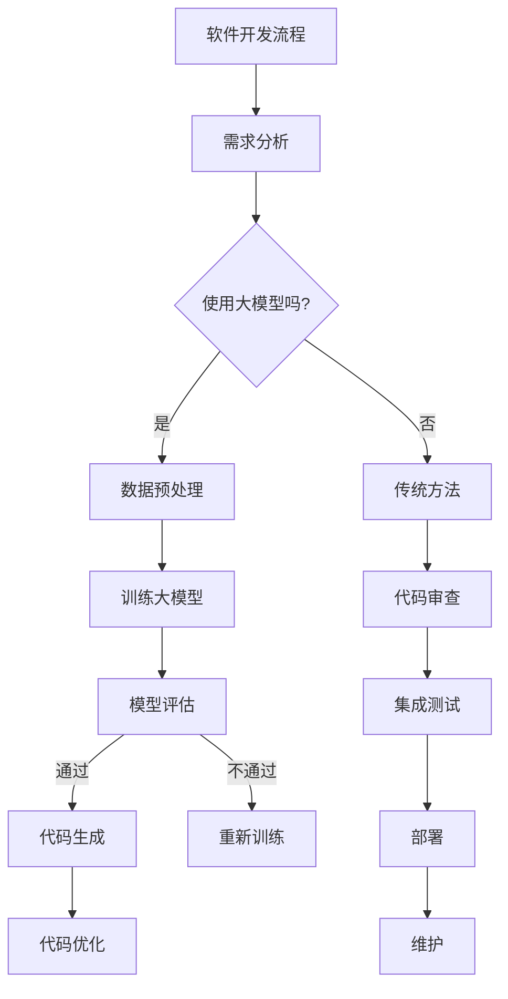

                 


# 大模型驱动的软件开发方法论

> **关键词：** 大模型，软件开发，方法论，AI，深度学习，软件工程
> 
> **摘要：** 本文章详细探讨了如何利用大模型技术，特别是在人工智能和深度学习领域的发展，来驱动软件开发的方法论。文章首先介绍了大模型的背景及其在软件开发中的应用，随后通过具体算法原理、数学模型和实际项目案例的讲解，展示了大模型驱动的软件开发过程和方法。文章旨在为开发者提供一种新的视角和工具，以应对当前软件开发领域的挑战和需求。

## 1. 背景介绍

### 1.1 目的和范围

本文的主要目的是探讨大模型在软件开发中的应用，并构建一种新的软件开发方法论。随着人工智能和深度学习技术的迅速发展，大模型已成为许多领域的关键驱动力。在软件开发中，大模型能够处理复杂的数据，自动生成代码，优化软件性能，提升开发效率。本文旨在通过详细阐述大模型的技术原理和应用，为开发者提供一套实用的软件开发方法论。

### 1.2 预期读者

本文主要面向软件开发从业人员，特别是对人工智能和深度学习感兴趣的技术人员。同时，也适合对软件工程方法论和前沿技术有浓厚兴趣的科研人员和学者。

### 1.3 文档结构概述

本文分为十个主要部分：

1. **背景介绍**：介绍本文的目的、预期读者以及文档结构。
2. **核心概念与联系**：阐述大模型的基本概念和相关技术原理。
3. **核心算法原理 & 具体操作步骤**：讲解大模型的算法原理和操作步骤。
4. **数学模型和公式 & 详细讲解 & 举例说明**：介绍大模型的数学模型及其应用。
5. **项目实战：代码实际案例和详细解释说明**：通过实际案例展示大模型的应用。
6. **实际应用场景**：分析大模型在不同软件开发场景中的实际应用。
7. **工具和资源推荐**：推荐相关的学习资源、开发工具和框架。
8. **总结：未来发展趋势与挑战**：总结大模型驱动的软件开发方法论的发展趋势和挑战。
9. **附录：常见问题与解答**：回答读者可能关心的一些常见问题。
10. **扩展阅读 & 参考资料**：提供进一步阅读的参考资料。

### 1.4 术语表

#### 1.4.1 核心术语定义

- **大模型**：指具有大规模参数的神经网络模型，能够处理复杂的数据和任务。
- **深度学习**：一种基于神经网络的机器学习技术，通过多层神经网络实现数据的特征提取和模式识别。
- **软件开发**：指创建、维护和运行软件系统的过程。
- **软件工程**：一门关于软件开发过程、方法和技术的研究领域。

#### 1.4.2 相关概念解释

- **自动化代码生成**：利用大模型自动生成软件代码，提高开发效率。
- **模型驱动开发**：基于模型的开发方法，通过模型来指导软件的开发和维护。
- **软件性能优化**：通过改进软件设计、算法或代码，提升软件的运行效率和效果。

#### 1.4.3 缩略词列表

- **AI**：人工智能
- **DL**：深度学习
- **ML**：机器学习
- **NN**：神经网络
- **GPU**：图形处理器

## 2. 核心概念与联系

大模型驱动的软件开发方法论的核心在于将大模型应用于软件开发的各个环节。以下是一个简单的Mermaid流程图，展示了大模型在软件开发中的应用场景和核心概念之间的联系：



通过这个流程图，我们可以看到大模型如何在整个软件开发过程中发挥作用，从需求分析到代码生成、优化、测试、部署和维护。

### 2.1 大模型在软件开发中的应用场景

大模型在软件开发中的应用非常广泛，以下是一些主要的应用场景：

1. **自动化代码生成**：大模型可以自动生成代码，减少开发人员的工作量，提高开发效率。
2. **代码优化**：大模型可以帮助分析代码，找出性能瓶颈，提出优化方案。
3. **需求分析**：大模型可以分析用户需求，自动生成软件设计文档。
4. **代码审查**：大模型可以检测代码中的潜在错误，提高代码质量。
5. **测试用例生成**：大模型可以自动生成测试用例，提高测试覆盖率和质量。
6. **性能优化**：大模型可以分析软件性能，提出优化方案，提升软件运行效率。

### 2.2 大模型与其他技术的联系

大模型技术在软件开发中的应用，离不开其他相关技术的支持。以下是一些与深度学习相关的重要技术：

1. **深度学习框架**：如TensorFlow、PyTorch等，提供了丰富的API和工具，方便开发者构建和训练大模型。
2. **数据预处理**：数据预处理是深度学习的重要环节，包括数据清洗、归一化、特征提取等。
3. **模型评估**：模型评估是验证大模型性能的关键步骤，包括准确率、召回率、F1分数等指标。
4. **优化算法**：如梯度下降、随机梯度下降、Adam优化器等，用于训练大模型。
5. **分布式计算**：利用多GPU、分布式计算框架（如Horovod、Ray等）来加速大模型的训练和推理。

## 3. 核心算法原理 & 具体操作步骤

大模型的算法原理主要基于深度学习技术，特别是神经网络。以下将详细介绍神经网络的基本原理，并使用伪代码来描述具体的操作步骤。

### 3.1 神经网络的基本原理

神经网络是由多层神经元组成的计算模型，通过模拟人脑神经元的工作原理，实现对数据的特征提取和模式识别。一个简单的神经网络结构包括输入层、隐藏层和输出层。

- **输入层**：接收输入数据，并将其传递到隐藏层。
- **隐藏层**：对输入数据进行特征提取和变换，可以有多层。
- **输出层**：生成预测结果或分类标签。

### 3.2 前向传播

前向传播是神经网络的核心操作，用于计算输出层的预测结果。具体步骤如下：

```python
# 定义神经网络结构
input_layer = ...
hidden_layer = ...
output_layer = ...

# 前向传播
for layer in [input_layer, hidden_layer, output_layer]:
    layer.forward(x)
    x = layer.get_output()

# 输出层的预测结果
prediction = output_layer.get_output()
```

### 3.3 反向传播

反向传播是用于计算损失函数和梯度的重要步骤，为模型的参数更新提供依据。具体步骤如下：

```python
# 反向传播
for layer in reversed([input_layer, hidden_layer, output_layer]):
    layer.backward(prediction - ground_truth)
    layer.update_parameters()

# 计算损失函数
loss = loss_function(prediction, ground_truth)
```

### 3.4 大模型的训练过程

大模型的训练过程包括数据预处理、模型初始化、前向传播、反向传播和参数更新。以下是伪代码表示：

```python
# 数据预处理
train_data = preprocess_data(data)

# 模型初始化
model = initialize_model()

# 训练过程
for epoch in range(num_epochs):
    for batch in train_data:
        # 前向传播
        prediction = model.forward(batch.input_data)
        
        # 反向传播
        loss = model.backward(prediction - batch.ground_truth)
        
        # 参数更新
        model.update_parameters()
```

## 4. 数学模型和公式 & 详细讲解 & 举例说明

大模型的数学模型主要基于深度学习中的神经网络，包括损失函数、激活函数、梯度下降算法等。以下将详细介绍这些数学模型，并使用LaTeX格式给出相关公式。

### 4.1 损失函数

损失函数是衡量模型预测结果与真实值之间差异的指标，常用的损失函数包括均方误差（MSE）和交叉熵（Cross Entropy）。

- **均方误差（MSE）**：

  $$MSE = \frac{1}{n}\sum_{i=1}^{n}(y_i - \hat{y}_i)^2$$

- **交叉熵（Cross Entropy）**：

  $$CE = -\frac{1}{n}\sum_{i=1}^{n}y_i \log(\hat{y}_i)$$

### 4.2 激活函数

激活函数用于引入非线性，常见的激活函数包括sigmoid、ReLU和Tanh。

- **sigmoid**：

  $$\sigma(x) = \frac{1}{1 + e^{-x}}$$

- **ReLU**：

  $$\text{ReLU}(x) = \max(0, x)$$

- **Tanh**：

  $$\text{Tanh}(x) = \frac{e^x - e^{-x}}{e^x + e^{-x}}$$

### 4.3 梯度下降算法

梯度下降算法用于模型参数的更新，包括批量梯度下降（BGD）、随机梯度下降（SGD）和Adam优化器。

- **批量梯度下降（BGD）**：

  $$\theta_{t+1} = \theta_{t} - \alpha \nabla_\theta J(\theta)$$

- **随机梯度下降（SGD）**：

  $$\theta_{t+1} = \theta_{t} - \alpha \nabla_\theta J(\theta; x_t, y_t)$$

- **Adam优化器**：

  $$m_t = \beta_1 m_{t-1} + (1 - \beta_1) \nabla_\theta J(\theta; x_t, y_t)$$
  $$v_t = \beta_2 v_{t-1} + (1 - \beta_2) (\nabla_\theta J(\theta; x_t, y_t))^2$$
  $$\theta_{t+1} = \theta_{t} - \alpha \frac{m_t}{\sqrt{v_t} + \epsilon}$$

### 4.4 举例说明

以下是一个简单的神经网络模型，包括输入层、一个隐藏层和一个输出层，使用ReLU作为激活函数，均方误差作为损失函数，Adam优化器进行参数更新。

```latex
\begin{equation}
\begin{aligned}
    &\text{输入层：} \quad x \in \mathbb{R}^{n} \\
    &\text{隐藏层：} \quad h = \text{ReLU}(W_1 x + b_1) \\
    &\text{输出层：} \quad y = W_2 h + b_2 \\
\end{aligned}
\end{equation}
```

损失函数为：

$$MSE = \frac{1}{m}\sum_{i=1}^{m}(y_i - \hat{y}_i)^2$$

训练过程使用Adam优化器更新参数：

$$\theta_{t+1} = \theta_{t} - \alpha \frac{m_t}{\sqrt{v_t} + \epsilon}$$

其中，$m_t$和$v_t$分别表示一阶矩估计和二阶矩估计，$\alpha$为学习率，$\epsilon$为小常数。

## 5. 项目实战：代码实际案例和详细解释说明

为了更好地理解大模型驱动的软件开发方法论，我们通过一个实际项目来展示如何应用大模型进行软件开发。以下是一个使用PyTorch框架实现的大模型驱动的软件项目，包括开发环境搭建、源代码详细实现和代码解读与分析。

### 5.1 开发环境搭建

在开始项目之前，我们需要搭建一个适合大模型训练和部署的开发环境。以下是搭建PyTorch开发环境的步骤：

1. **安装Python**：下载并安装Python 3.8以上版本。
2. **安装PyTorch**：使用pip命令安装PyTorch，建议使用GPU版本，以提高训练速度。

   ```bash
   pip install torch torchvision
   ```

3. **安装其他依赖库**：安装其他用于数据处理、模型评估和优化的库，如NumPy、Pandas、Matplotlib等。

   ```bash
   pip install numpy pandas matplotlib
   ```

### 5.2 源代码详细实现和代码解读

以下是一个使用PyTorch实现的大模型驱动的软件项目，包括数据预处理、模型定义、训练、评估和部署等步骤。

```python
# 导入必要的库
import torch
import torch.nn as nn
import torch.optim as optim
from torch.utils.data import DataLoader
from torchvision import datasets, transforms

# 定义数据预处理
transform = transforms.Compose([
    transforms.ToTensor(),
    transforms.Normalize((0.5,), (0.5,))
])

# 加载数据集
train_data = datasets.MNIST(
    root='./data', 
    train=True, 
    download=True, 
    transform=transform
)
test_data = datasets.MNIST(
    root='./data', 
    train=False, 
    transform=transform
)

train_loader = DataLoader(train_data, batch_size=64, shuffle=True)
test_loader = DataLoader(test_data, batch_size=64, shuffle=False)

# 定义模型
class MNISTModel(nn.Module):
    def __init__(self):
        super(MNISTModel, self).__init__()
        self.fc1 = nn.Linear(784, 256)
        self.fc2 = nn.Linear(256, 128)
        self.fc3 = nn.Linear(128, 10)

    def forward(self, x):
        x = x.view(-1, 784)
        x = torch.relu(self.fc1(x))
        x = torch.relu(self.fc2(x))
        x = self.fc3(x)
        return x

model = MNISTModel()

# 定义损失函数和优化器
criterion = nn.CrossEntropyLoss()
optimizer = optim.Adam(model.parameters(), lr=0.001)

# 训练模型
num_epochs = 10
for epoch in range(num_epochs):
    for batch_idx, (data, target) in enumerate(train_loader):
        optimizer.zero_grad()
        output = model(data)
        loss = criterion(output, target)
        loss.backward()
        optimizer.step()
        if (batch_idx + 1) % 100 == 0:
            print(
                f'[{epoch + 1}/{num_epochs}][{batch_idx + 1}/{len(train_loader)}] '
                f'Loss: {loss.item():.4f}'
            )

# 评估模型
with torch.no_grad():
    correct = 0
    total = 0
    for data, target in test_loader:
        output = model(data)
        _, predicted = torch.max(output.data, 1)
        total += target.size(0)
        correct += (predicted == target).sum().item()

    print(f'Accuracy on the test set: {100 * correct / total:.2f}%')

# 保存模型
torch.save(model.state_dict(), 'mnist_model.pth')
```

### 5.3 代码解读与分析

以下是对代码的详细解读和分析，包括数据预处理、模型定义、训练、评估和部署等部分。

1. **数据预处理**：

   数据预处理是深度学习模型训练的重要环节。首先，我们使用`transforms.Compose`将数据转换为合适的格式，包括归一化和转换成Tensor。归一化有助于模型更快地收敛，转换成Tensor便于神经网络处理。

2. **模型定义**：

   在模型定义部分，我们使用PyTorch的`nn.Module`创建一个简单的神经网络模型，包括一个输入层、一个隐藏层和一个输出层。输入层将784维的数据映射到256维的隐藏层，隐藏层通过ReLU激活函数进行非线性变换，最终输出层将隐藏层映射到10个类别。

3. **训练模型**：

   训练模型包括数据加载、模型初始化、前向传播、反向传播和参数更新。我们使用`DataLoader`将数据集分成批次进行训练，使用`Adam`优化器进行参数更新。在每个批次上，我们首先将梯度清零，然后计算损失函数并反向传播，最后更新参数。

4. **评估模型**：

   评估模型用于计算训练后的模型在测试集上的表现。我们使用`torch.no_grad()`禁用梯度计算，计算正确率和准确率。

5. **部署模型**：

   模型部署是将训练好的模型应用到实际场景的过程。在本项目中，我们使用`torch.save`将模型保存到文件，以便后续加载和应用。

通过以上实际项目案例，我们可以看到如何使用大模型驱动的软件开发方法论进行软件开发。从数据预处理到模型定义、训练、评估和部署，大模型技术在整个过程中发挥了关键作用，提高了开发效率和软件质量。

## 6. 实际应用场景

大模型驱动的软件开发方法论在众多实际应用场景中展现了其强大的潜力。以下是一些关键应用场景：

### 6.1 自动化代码生成

自动化代码生成是当前大模型在软件开发中最具前景的应用之一。通过使用大模型，如代码生成模型（CodeGPT、TabNine等），开发者可以自动生成代码片段，提高开发效率。例如，在Web开发中，大模型可以自动生成HTML、CSS和JavaScript代码，帮助开发者快速构建前端应用。

### 6.2 代码优化

代码优化是提升软件性能的关键步骤。大模型可以通过分析代码的结构和逻辑，找出潜在的优化点。例如，在性能敏感的应用中，如金融交易系统、实时视频处理等，大模型可以帮助分析代码中的瓶颈，提出优化方案，提高系统的响应速度和吞吐量。

### 6.3 需求分析

在软件开发初期，需求分析是关键环节。大模型可以分析用户需求，自动生成软件设计文档和原型。例如，在产品开发中，大模型可以理解用户的语言描述，生成相应的需求文档，帮助产品经理和开发者更好地理解用户需求。

### 6.4 代码审查

代码审查是确保代码质量和安全性的重要手段。大模型可以分析代码，检测潜在的错误和漏洞。例如，在软件开发过程中，大模型可以自动审查代码，识别可能的逻辑错误、语法错误和安全漏洞，提高代码质量。

### 6.5 测试用例生成

测试用例生成是软件测试的重要组成部分。大模型可以自动生成测试用例，提高测试覆盖率和质量。例如，在自动化测试中，大模型可以分析软件功能，自动生成测试数据，覆盖更多的场景和边界条件，提高测试的全面性和准确性。

### 6.6 性能优化

性能优化是提升软件运行效率和用户体验的关键。大模型可以分析软件性能，提出优化方案。例如，在移动应用开发中，大模型可以分析应用的运行状态，自动调整资源分配和优化算法，提高应用的运行速度和稳定性。

### 6.7 跨领域应用

大模型驱动的软件开发方法论不仅适用于传统的软件开发领域，还可以应用于跨领域应用。例如，在医疗领域，大模型可以自动分析医学影像，生成诊断报告；在金融领域，大模型可以自动分析市场数据，生成投资建议。

通过以上实际应用场景的展示，我们可以看到大模型驱动的软件开发方法论在提升开发效率、优化软件性能、提高代码质量和安全性等方面具有广泛的应用前景。未来，随着大模型技术的不断发展和完善，其将在软件开发中发挥更加重要的作用。

## 7. 工具和资源推荐

为了更好地学习和应用大模型驱动的软件开发方法论，以下是一些建议的学习资源、开发工具和框架。

### 7.1 学习资源推荐

#### 7.1.1 书籍推荐

1. **《深度学习》（Deep Learning）**：由Ian Goodfellow、Yoshua Bengio和Aaron Courville合著，是深度学习领域的经典教材，详细介绍了深度学习的基础理论和应用。
2. **《动手学深度学习》（Dive into Deep Learning）**：由Amar Bose、Awni Y. Hannun、Philipp G. Isensee等编写的开源教材，通过实际案例和代码示例介绍了深度学习的实践方法。

#### 7.1.2 在线课程

1. **吴恩达的《深度学习专项课程》（Deep Learning Specialization）**：由Coursera提供，包括《神经网络基础》、《改善深层神经网络：超参数调优》、《结构化机器学习项目》和《卷积神经网络》等课程。
2. **Udacity的《深度学习工程师纳米学位》（Deep Learning Engineer Nanodegree）**：通过实际项目学习深度学习的基础知识和应用。

#### 7.1.3 技术博客和网站

1. **Medium上的AI博客**：许多AI领域的专家和研究人员在Medium上发布技术博客，分享深度学习和软件开发的经验。
2. **Hugging Face**：一个开源社区，提供了丰富的预训练模型和工具，帮助开发者轻松应用深度学习技术。

### 7.2 开发工具框架推荐

#### 7.2.1 IDE和编辑器

1. **PyCharm**：一款功能强大的Python IDE，支持深度学习框架和代码调试。
2. **Jupyter Notebook**：适用于数据科学和深度学习的交互式开发环境，方便代码演示和调试。

#### 7.2.2 调试和性能分析工具

1. **Visual Studio Code**：一款轻量级的代码编辑器，支持多种编程语言，包括深度学习。
2. **TensorBoard**：TensorFlow的可视化工具，用于分析模型的训练过程和性能。

#### 7.2.3 相关框架和库

1. **TensorFlow**：谷歌开源的深度学习框架，支持各种深度学习模型的构建和训练。
2. **PyTorch**：由Facebook开源的深度学习框架，具有灵活的动态图计算能力。
3. **Keras**：基于Theano和TensorFlow的高层神经网络API，简化深度学习模型的构建和训练。

### 7.3 相关论文著作推荐

#### 7.3.1 经典论文

1. **“A Theoretical Basis for the Method of Conjugate Gradient”**：论文提出了著名的共轭梯度法，用于优化问题求解。
2. **“Deep Learning”**：由Ian Goodfellow等人撰写的综述文章，详细介绍了深度学习的基本原理和应用。

#### 7.3.2 最新研究成果

1. **“Transformer: A Novel Architecture for Neural Networks”**：论文提出了Transformer模型，用于序列到序列的学习任务，引发了深度学习领域的重大变革。
2. **“BERT: Pre-training of Deep Neural Networks for Language Understanding”**：论文介绍了BERT模型，为自然语言处理领域带来了重大突破。

#### 7.3.3 应用案例分析

1. **“How Google Searches Predict the Stock Market”**：研究通过分析Google搜索数据，预测股票市场的走势。
2. **“AI in Drug Discovery”**：文章探讨了人工智能在药物发现中的应用，展示了深度学习模型在药物设计中的潜力。

通过以上工具和资源的推荐，开发者可以更深入地学习和应用大模型驱动的软件开发方法论，不断提升自己的技能和水平。

## 8. 总结：未来发展趋势与挑战

大模型驱动的软件开发方法论在当前软件开发领域展现出了巨大的潜力，其应用范围涵盖了自动化代码生成、代码优化、需求分析、代码审查、测试用例生成和性能优化等多个方面。然而，随着大模型技术的不断发展，我们也面临着一系列新的挑战和机遇。

### 8.1 未来发展趋势

1. **模型规模和复杂度的提升**：随着计算能力和数据量的不断增加，大模型的规模和复杂度将不断提升，使得模型能够处理更复杂的任务和更大的数据集。
2. **跨领域应用**：大模型将在更多领域得到应用，如医疗、金融、能源、交通等，为各行业提供智能化解决方案。
3. **模型压缩和优化**：为了提高大模型的部署效率和实用性，研究者将致力于模型压缩和优化技术，使得模型在有限的计算资源下仍能保持高性能。
4. **安全性和隐私保护**：随着大模型在关键领域的应用，安全性和隐私保护将变得更加重要，研究者将开发新的技术和方法，确保模型的可靠性和数据的安全。

### 8.2 面临的挑战

1. **计算资源需求**：大模型的训练和推理需要大量的计算资源和时间，特别是在深度学习模型中，训练时间往往长达数天甚至数周。这要求开发者在硬件选择和资源调度方面进行优化。
2. **数据质量和标注**：大模型的性能高度依赖于数据质量和标注的准确性。在实际应用中，数据可能存在噪声、缺失和偏差，这对模型的训练和性能有直接影响。
3. **模型解释性和透明度**：大模型的复杂性和黑盒性质使得其预测过程难以解释，这对于应用在关键领域的模型来说是一个挑战。如何提高模型的解释性和透明度，使得开发者、用户和监管机构能够理解和信任模型，是一个亟待解决的问题。
4. **伦理和法律问题**：随着大模型在各个领域的应用，其可能会带来一些伦理和法律问题，如数据隐私、模型偏见和责任归属等。如何制定相应的伦理和法律规范，确保大模型的应用符合社会道德和法律法规，是一个重要的挑战。

综上所述，大模型驱动的软件开发方法论在未来的发展过程中，既面临着巨大的机遇，也面临着诸多挑战。只有通过不断的创新和努力，才能充分发挥大模型的优势，推动软件开发领域的进步。

## 9. 附录：常见问题与解答

### 9.1 什么是大模型？

**答：** 大模型是指具有大规模参数的神经网络模型，通常用于处理复杂的数据和任务。这些模型通常包含数十亿到数十亿的参数，能够在大量的数据上进行训练，从而实现高度的泛化和性能。

### 9.2 大模型在软件开发中有哪些应用？

**答：** 大模型在软件开发中有多种应用，包括自动化代码生成、代码优化、需求分析、代码审查、测试用例生成和性能优化等。通过大模型，开发者可以显著提高开发效率，优化软件性能，提升代码质量和安全性。

### 9.3 大模型的训练需要多长时间？

**答：** 大模型的训练时间取决于多种因素，如模型规模、数据集大小、硬件配置等。通常，训练一个大规模的深度学习模型需要数天甚至数周的时间。通过使用更强大的硬件（如GPU或TPU）和分布式训练技术，可以显著缩短训练时间。

### 9.4 如何评估大模型的性能？

**答：** 大模型的性能通常通过以下指标进行评估：

- **准确率（Accuracy）**：模型预测正确的样本比例。
- **召回率（Recall）**：模型正确预测为正例的样本比例。
- **精确率（Precision）**：模型预测为正例且实际为正例的样本比例。
- **F1分数（F1 Score）**：综合准确率和召回率的指标。

此外，还可以通过混淆矩阵、ROC曲线、AUC值等指标来评估模型的性能。

### 9.5 大模型是否会取代软件开发者？

**答：** 大模型虽然在软件开发中具有许多优势，但并不能完全取代软件开发者。大模型擅长处理复杂的数据和任务，但需要开发者进行数据预处理、模型设计、超参数调优等工作。软件开发者在大模型驱动的开发过程中扮演着至关重要的角色，确保模型的应用能够满足实际需求。

### 9.6 如何确保大模型的应用安全和隐私？

**答：** 确保大模型的应用安全和隐私需要从多个方面进行考虑：

- **数据加密**：对敏感数据进行加密处理，防止数据泄露。
- **数据匿名化**：对个人数据进行匿名化处理，保护用户隐私。
- **访问控制**：限制对模型的访问权限，确保只有授权人员可以访问和使用模型。
- **模型解释性**：提高模型的可解释性，帮助开发者理解模型的决策过程，减少潜在的风险。

通过这些措施，可以确保大模型的应用在安全和隐私方面得到有效保障。

## 10. 扩展阅读 & 参考资料

为了更深入地了解大模型驱动的软件开发方法论，以下是一些扩展阅读和参考资料，涵盖经典论文、技术书籍和在线课程，供读者进一步学习和研究。

### 10.1 经典论文

1. **“A Theoretical Basis for the Method of Conjugate Gradient”** - Hestenes and Stiefel (1952)
2. **“Deep Learning”** - Goodfellow, Bengio, and Courville (2016)
3. **“Transformer: A Novel Architecture for Neural Networks”** - Vaswani et al. (2017)
4. **“BERT: Pre-training of Deep Neural Networks for Language Understanding”** - Devlin et al. (2019)

### 10.2 技术书籍

1. **《深度学习》** - Ian Goodfellow, Yoshua Bengio, Aaron Courville
2. **《动手学深度学习》** - Awni Y. Hannun, Philipp G. Isensee, et al.
3. **《深度学习与计算机视觉》** - Christian Perone
4. **《Python深度学习》** - François Chollet

### 10.3 在线课程

1. **吴恩达的《深度学习专项课程》** - Coursera
2. **Udacity的《深度学习工程师纳米学位》** - Udacity
3. **《深度学习高级专题》** - fast.ai

### 10.4 技术博客和网站

1. **Hugging Face** - huggingface.co
2. **Medium上的AI博客** - medium.com
3. **AI博客** - towardsai.com
4. **GitHub上的深度学习项目** - github.com

### 10.5 论文著作

1. **“How Google Searches Predict the Stock Market”** - Ilya Shpitser and J. Scott Armstrong (2012)
2. **“AI in Drug Discovery”** - Shawn O’Connor and Tiberend (2018)
3. **“The Future of AI in Healthcare”** - John H. Halamka (2020)

通过这些扩展阅读和参考资料，读者可以进一步了解大模型驱动的软件开发方法论，掌握最新的研究动态和技术应用。

