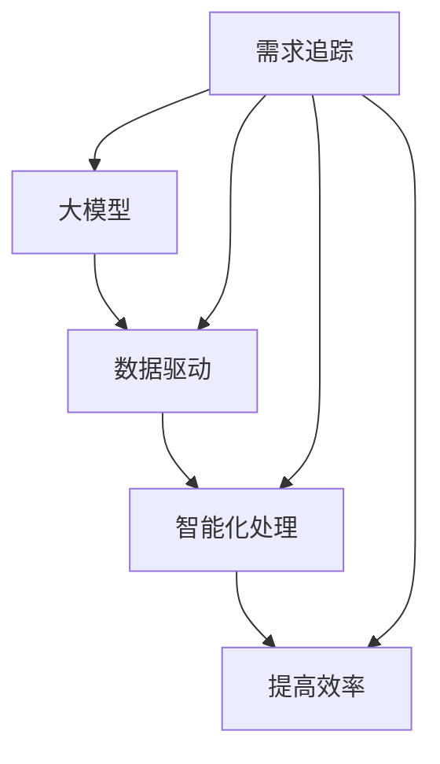

                 

### 大模型驱动的需求追踪自动化技术

> **关键词：** 大模型、需求追踪、自动化技术、AI驱动的开发、软件工程

> **摘要：** 本篇文章旨在探讨如何利用大模型技术实现需求追踪的自动化，从而提升软件工程中的开发效率和准确性。我们将分析大模型的核心原理、具体操作步骤、数学模型，并展示实际项目的应用实例，最终对这一领域的技术发展趋势和挑战进行展望。

在当今快速发展的软件工程领域，需求追踪是一项至关重要的任务。有效的需求追踪能够帮助开发团队确保软件产品满足客户的期望，同时降低项目风险和成本。然而，传统的需求追踪方法往往依赖于人工操作，效率低下且容易出现错误。为了解决这一问题，本文将探讨大模型驱动的需求追踪自动化技术，以期在软件工程中实现更高的效率和更准确的追踪结果。

本文的结构如下：

- **第1章 背景介绍**：介绍本篇文章的目的、范围、预期读者、文档结构以及相关术语表。
- **第2章 核心概念与联系**：解释大模型、需求追踪及其相互关系，并使用Mermaid流程图展示核心概念和架构。
- **第3章 核心算法原理 & 具体操作步骤**：详细阐述大模型驱动的需求追踪算法原理，使用伪代码进行具体操作步骤的描述。
- **第4章 数学模型和公式 & 详细讲解 & 举例说明**：介绍大模型驱动的需求追踪所涉及的数学模型，并使用LaTeX格式给出公式和示例。
- **第5章 项目实战：代码实际案例和详细解释说明**：展示一个实际项目的代码实现，并对其进行详细解释和分析。
- **第6章 实际应用场景**：讨论大模型驱动的需求追踪在软件工程中的实际应用场景。
- **第7章 工具和资源推荐**：推荐相关的学习资源、开发工具框架和最新研究成果。
- **第8章 总结：未来发展趋势与挑战**：总结本文的主要观点，并对大模型驱动的需求追踪技术的未来进行展望。
- **第9章 附录：常见问题与解答**：列出并回答一些常见问题。
- **第10章 扩展阅读 & 参考资料**：提供进一步阅读和参考资料的建议。

通过本文的阅读，读者将能够深入了解大模型驱动的需求追踪自动化技术的原理和应用，为未来的软件开发提供新的思路和方法。

### 第1章 背景介绍

#### 1.1 目的和范围

本文的目的是探讨如何利用大模型技术实现需求追踪的自动化，以提高软件工程中的开发效率和准确性。随着软件项目的复杂度不断增加，需求追踪变得越来越重要。有效的需求追踪不仅可以确保软件产品满足客户的期望，还能降低项目风险和成本。然而，传统的需求追踪方法通常依赖于人工操作，效率低下且容易出现错误。大模型技术的出现为这一问题提供了新的解决方案。通过使用大模型，我们可以实现自动化需求追踪，从而提高整个软件开发生命周期的效率和准确性。

本文的范围主要包括以下几个方面：

1. **大模型的基本原理**：介绍大模型的概念、发展和核心原理，如深度学习、神经网络等。
2. **需求追踪的方法与挑战**：分析传统需求追踪的方法和存在的挑战，以及大模型如何解决这些问题。
3. **大模型驱动的需求追踪算法**：详细阐述大模型驱动的需求追踪算法原理和操作步骤，包括数据预处理、模型训练和结果分析等。
4. **数学模型与公式**：介绍大模型驱动的需求追踪所涉及的数学模型，并使用LaTeX格式给出相关公式。
5. **实际项目案例**：展示一个实际项目的代码实现，并对其进行详细解释和分析。
6. **应用场景与工具推荐**：讨论大模型驱动的需求追踪在软件工程中的实际应用场景，并提供相关的学习资源和开发工具框架。
7. **未来发展趋势与挑战**：总结大模型驱动的需求追踪技术的现状，并对其未来发展趋势和挑战进行展望。

通过本文的阅读，读者将能够全面了解大模型驱动的需求追踪自动化技术，掌握其核心原理和应用方法，为未来的软件开发提供新的思路和工具。

#### 1.2 预期读者

本文的预期读者主要包括以下几类：

1. **软件工程师和开发人员**：这些读者可能对软件工程中的需求追踪方法和技术感兴趣，希望通过本文了解大模型驱动的需求追踪自动化技术的应用。
2. **研究人员和学者**：这些读者可能对大模型和需求追踪的结合方法进行研究，希望通过本文获得对该领域最新发展的了解。
3. **项目经理和产品经理**：这些读者负责软件项目的管理，需要了解如何利用大模型技术提高需求追踪的效率和准确性，从而降低项目风险和成本。
4. **技术爱好者**：这些读者可能对人工智能和软件工程领域的技术感兴趣，希望通过本文了解大模型驱动的需求追踪自动化技术的原理和应用。

无论读者的背景如何，本文都将提供全面、深入的探讨，旨在帮助读者掌握大模型驱动的需求追踪自动化技术，提升软件开发效率和准确性。

#### 1.3 文档结构概述

本文的结构旨在为读者提供一个清晰、系统的学习和理解路径，分为以下几个主要部分：

1. **背景介绍**：介绍本文的目的、范围和预期读者，为读者提供整体了解。
2. **核心概念与联系**：解释大模型、需求追踪及其相互关系，使用Mermaid流程图展示核心概念和架构。
3. **核心算法原理 & 具体操作步骤**：详细阐述大模型驱动的需求追踪算法原理和操作步骤，包括数据预处理、模型训练和结果分析等。
4. **数学模型和公式 & 详细讲解 & 举例说明**：介绍大模型驱动的需求追踪所涉及的数学模型，并使用LaTeX格式给出相关公式和示例。
5. **项目实战：代码实际案例和详细解释说明**：展示一个实际项目的代码实现，并对其进行详细解释和分析。
6. **实际应用场景**：讨论大模型驱动的需求追踪在软件工程中的实际应用场景。
7. **工具和资源推荐**：推荐相关的学习资源、开发工具框架和最新研究成果。
8. **总结与展望**：总结本文的主要观点，并对大模型驱动的需求追踪技术的未来进行展望。
9. **常见问题与解答**：回答读者可能遇到的常见问题。
10. **扩展阅读 & 参考资料**：提供进一步阅读和参考资料的建议。

通过本文的结构，读者可以逐步深入理解大模型驱动的需求追踪自动化技术，从理论到实践，全面掌握相关知识和技能。

#### 1.4 术语表

在本篇文章中，我们将使用一些专业术语。以下是对这些术语的定义和解释，以便读者更好地理解文章内容。

##### 1.4.1 核心术语定义

- **大模型（Big Model）**：指具有大量参数和复杂结构的机器学习模型，如深度神经网络，能够通过大量数据进行训练，实现高水平的任务性能。
- **需求追踪（Requirement Tracing）**：在软件工程中，指追踪和管理软件需求的过程，确保每个需求都被正确实现并在系统中得到有效验证。
- **自动化技术（Automation Technology）**：利用计算机技术和算法实现重复性、繁琐任务的自动化处理，提高效率和准确性。
- **软件工程（Software Engineering）**：应用工程原则和方法，设计、开发、测试和维护软件系统的过程。

##### 1.4.2 相关概念解释

- **深度学习（Deep Learning）**：一种机器学习方法，通过构建深层次的神经网络模型，对大量数据进行分析和特征提取。
- **神经网络（Neural Network）**：一种模拟生物神经系统的计算模型，由大量的节点（或称为神经元）组成，通过前向传播和反向传播机制进行数据学习和预测。
- **数据预处理（Data Preprocessing）**：在机器学习模型训练前，对原始数据进行清洗、转换和归一化等操作，以提高模型的训练效果和泛化能力。
- **模型训练（Model Training）**：通过输入训练数据，调整模型参数，使模型能够对新的输入数据做出准确预测。

##### 1.4.3 缩略词列表

- **AI**：人工智能（Artificial Intelligence）
- **ML**：机器学习（Machine Learning）
- **DL**：深度学习（Deep Learning）
- **NLP**：自然语言处理（Natural Language Processing）
- **SRE**：软件工程（Software Engineering）
- **IDE**：集成开发环境（Integrated Development Environment）
- **API**：应用程序接口（Application Programming Interface）
- **GPU**：图形处理器（Graphics Processing Unit）

通过上述术语表的解释，读者可以更好地理解本文中涉及的专业术语，为后续内容的深入理解打下基础。

### 第2章 核心概念与联系

在本章中，我们将深入探讨大模型、需求追踪和自动化技术这三个核心概念，并展示它们之间的相互联系。通过分析这些概念，我们将使用Mermaid流程图来直观地展示它们的核心架构和关系，帮助读者更好地理解大模型驱动的需求追踪自动化技术的整体框架。

首先，让我们定义并解释这些核心概念。

#### 2.1 大模型

大模型（Big Model）通常指的是具有大量参数和复杂结构的机器学习模型，如深度神经网络（Deep Neural Network, DNN）。这些模型通过在大量数据上进行训练，能够学习到复杂的特征和模式，从而在各种任务中实现高水平的性能。大模型的发展得益于计算能力和数据量的提升，尤其是在深度学习和神经网络领域的突破，使得复杂模型能够在多个领域（如计算机视觉、自然语言处理、语音识别等）中取得显著成果。

#### 2.2 需求追踪

需求追踪（Requirement Tracing）是软件工程中的一项关键任务，它涉及到追踪和管理软件需求的过程。在软件开发过程中，需求会不断变化，确保每个需求都被正确实现并在系统中得到有效验证是一项复杂且重要的工作。传统的需求追踪方法往往依赖于人工操作，这不仅效率低下，而且容易出错。随着自动化技术的发展，大模型的应用为需求追踪提供了新的可能性，通过自动化和智能化手段，提高需求追踪的效率和准确性。

#### 2.3 自动化技术

自动化技术（Automation Technology）是指利用计算机技术和算法实现重复性、繁琐任务的自动化处理，从而提高效率和准确性。在软件工程中，自动化技术广泛应用于代码生成、测试、部署等各个环节。通过自动化，开发团队可以减少人工干预，降低错误率，提高生产效率。

#### 2.4 大模型、需求追踪与自动化技术的联系

大模型、需求追踪和自动化技术之间的联系在于，大模型可以为自动化技术提供强大的支持，尤其是在需求追踪领域。具体来说，这种联系体现在以下几个方面：

1. **数据驱动**：需求追踪需要处理大量的需求数据和实现数据，大模型能够通过深度学习和数据分析，从这些数据中提取出有用的特征和模式，为自动化需求追踪提供数据基础。
2. **智能化处理**：大模型具有较强的学习能力和泛化能力，可以自动识别和预测需求之间的关系，从而实现智能化的需求追踪。
3. **提高效率**：通过自动化技术，大模型可以处理大量的需求追踪任务，减少人工操作，提高整个过程的效率和准确性。

为了更直观地展示这些概念之间的关系，我们可以使用Mermaid流程图来绘制它们的核心架构。以下是Mermaid流程图示例：



在这个流程图中，大模型位于中心，它通过数据驱动、智能化处理和提高效率三个环节与需求追踪和自动化技术相连。这样的架构展示了大模型在需求追踪自动化中的核心作用，同时也体现了这三个概念之间的紧密联系。

通过本章的讨论，我们不仅了解了大模型、需求追踪和自动化技术的核心概念，还分析了它们之间的相互关系。在下一章中，我们将进一步探讨大模型驱动的需求追踪算法原理和具体操作步骤，为读者提供更深入的学术和技术见解。

### 第3章 核心算法原理 & 具体操作步骤

在大模型驱动的需求追踪自动化技术中，核心算法的选择和实现至关重要。本章将详细阐述大模型驱动的需求追踪算法原理，并使用伪代码来描述具体操作步骤。通过这一章节，读者将能够理解算法的基本原理和实现方法，为实际应用打下基础。

#### 3.1 大模型驱动的需求追踪算法原理

大模型驱动的需求追踪算法主要基于深度学习技术，特别是卷积神经网络（Convolutional Neural Networks, CNN）和循环神经网络（Recurrent Neural Networks, RNN）等模型。这些模型通过大量需求追踪数据的学习，可以自动提取需求之间的关系和特征，从而实现高效的自动化需求追踪。

##### 3.1.1 卷积神经网络（CNN）

卷积神经网络是一种在图像识别、自然语言处理等领域广泛应用的网络结构。CNN通过卷积操作提取图像或文本的特征，从而实现高层次的抽象表示。在需求追踪中，CNN可以用来提取需求文本的特征，进而识别需求之间的关系。

##### 3.1.2 循环神经网络（RNN）

循环神经网络是一种适合处理序列数据的神经网络，如时间序列数据、自然语言等。RNN通过记忆机制能够保留之前的信息，从而在需求追踪中处理需求序列，识别不同需求之间的依赖关系。

##### 3.1.3 混合模型

为了提高需求追踪的准确性和鲁棒性，大模型驱动的需求追踪算法通常采用混合模型，将CNN和RNN结合使用。这种混合模型能够同时处理文本和序列数据，从而更全面地提取需求特征和关系。

#### 3.2 大模型驱动的需求追踪算法伪代码

以下是使用混合模型进行需求追踪的伪代码描述。该伪代码主要包括数据预处理、模型训练和结果分析三个步骤。

```plaintext
# 大模型驱动的需求追踪算法伪代码

# 数据预处理
function DataPreprocessing(dataset):
    # 清洗数据，去除无关字符和噪声
    cleaned_data = CleanData(dataset)
    # 将文本转换为向量表示
    vectorized_data = VectorizeText(cleaned_data)
    # 分割数据为训练集和测试集
    train_data, test_data = SplitDataset(vectorized_data)
    return train_data, test_data

# 模型训练
function TrainModel(train_data):
    # 构建混合模型（CNN + RNN）
    model = BuildHybridModel()
    # 训练模型
    model.fit(train_data)
    return model

# 结果分析
function AnalyzeResults(model, test_data):
    # 使用训练好的模型进行预测
    predictions = model.predict(test_data)
    # 评估模型性能
    performance = EvaluateModel(predictions, test_data)
    return performance

# 主函数
function Main():
    # 加载数据集
    dataset = LoadDataset()
    # 数据预处理
    train_data, test_data = DataPreprocessing(dataset)
    # 训练模型
    model = TrainModel(train_data)
    # 结果分析
    performance = AnalyzeResults(model, test_data)
    # 输出性能评估结果
    PrintPerformance(performance)
```

在这个伪代码中，`DataPreprocessing`函数负责清洗数据和文本向量化处理，`TrainModel`函数构建并训练混合模型，`AnalyzeResults`函数用于模型预测和性能评估。通过这三个步骤，我们能够实现大模型驱动的需求追踪。

#### 3.3 具体操作步骤详细解释

1. **数据预处理**：
    - **数据清洗**：首先，我们需要清洗原始数据，去除无关字符和噪声。这一步至关重要，因为任何错误或噪声都可能导致模型训练失败或性能下降。
    - **文本向量化**：将清洗后的文本转换为向量表示，以便模型能够进行处理。常用的方法包括词袋模型（Bag of Words, BoW）、词嵌入（Word Embedding）等。

2. **模型训练**：
    - **模型构建**：构建一个混合模型，结合卷积神经网络（CNN）和循环神经网络（RNN）。CNN用于提取文本特征，RNN用于处理需求序列。
    - **训练过程**：使用训练数据集对模型进行训练。通过调整模型参数，使得模型能够在验证集上达到良好的性能。

3. **结果分析**：
    - **模型预测**：使用训练好的模型对测试数据进行预测，识别需求之间的关系。
    - **性能评估**：评估模型在测试集上的性能，包括准确率、召回率、F1分数等指标。

通过这些具体操作步骤，我们可以实现大模型驱动的需求追踪，从而在软件工程中提高开发效率和准确性。

本章详细阐述了大模型驱动的需求追踪算法原理和具体操作步骤，为后续的项目实战和实际应用奠定了理论基础。在下一章中，我们将进一步探讨大模型驱动的需求追踪在数学模型和公式中的应用，提供更加深入的学术和技术分析。

### 第4章 数学模型和公式 & 详细讲解 & 举例说明

在大模型驱动的需求追踪自动化技术中，数学模型和公式起到了核心作用。本章将详细讲解这些数学模型，包括其在需求追踪中的应用，并提供具体的例子来说明。我们将使用LaTeX格式来展示数学公式，以便更清晰地阐述相关概念。

#### 4.1 常用数学模型

在需求追踪中，常用的数学模型包括卷积神经网络（CNN）、循环神经网络（RNN）和长短期记忆网络（LSTM）。以下是对这些模型的简要介绍和公式展示。

##### 4.1.1 卷积神经网络（CNN）

卷积神经网络主要用于处理图像和文本等二维数据。在需求追踪中，CNN可以提取需求文本的局部特征。

**卷积操作公式**：

\[ (f * g)(x) = \sum_{y} f(y) \cdot g(x-y) \]

其中，\( f \) 和 \( g \) 分别表示卷积核和输入数据，\( y \) 表示卷积操作的索引。

**激活函数**：

\[ \sigma(x) = \max(0, x) \]

**卷积神经网络公式**：

\[ h_{l+1}(x) = \sigma(W_{l+1} \cdot h_l + b_{l+1}) \]

其中，\( h_l \) 表示第 \( l \) 层的输出，\( W_{l+1} \) 和 \( b_{l+1} \) 分别表示第 \( l+1 \) 层的权重和偏置。

##### 4.1.2 循环神经网络（RNN）

循环神经网络适用于处理序列数据，如需求序列。RNN通过记忆机制保留历史信息，从而处理长序列。

**RNN公式**：

\[ h_t = \sigma(W_h \cdot [h_{t-1}, x_t] + b_h) \]
\[ y_t = W_y \cdot h_t + b_y \]

其中，\( h_t \) 表示第 \( t \) 个时间步的隐藏状态，\( x_t \) 表示输入数据，\( W_h \) 和 \( b_h \) 分别为权重和偏置，\( \sigma \) 为激活函数。

##### 4.1.3 长短期记忆网络（LSTM）

LSTM是RNN的一种改进版本，能够更好地处理长序列数据。

**LSTM公式**：

\[ i_t = \sigma(W_i \cdot [h_{t-1}, x_t] + b_i) \]
\[ f_t = \sigma(W_f \cdot [h_{t-1}, x_t] + b_f) \]
\[ g_t = \tanh(W_g \cdot [h_{t-1}, x_t] + b_g) \]
\[ o_t = \sigma(W_o \cdot [h_{t-1}, x_t] + b_o) \]
\[ h_t = o_t \cdot \tanh(c_t) \]
\[ c_t = f_t \cdot c_{t-1} + i_t \cdot g_t \]

其中，\( i_t \)、\( f_t \)、\( g_t \) 和 \( o_t \) 分别为输入门、遗忘门、生成门和输出门，\( c_t \) 为细胞状态，\( W_i \)、\( W_f \)、\( W_g \) 和 \( W_o \) 分别为权重，\( b_i \)、\( b_f \)、\( b_g \) 和 \( b_o \) 分别为偏置。

#### 4.2 应用实例

以下是一个简单的需求追踪应用实例，展示如何使用LSTM模型进行需求分类。

**问题**：给定一组需求文本，将其分类为“功能需求”或“非功能需求”。

**数据集**：包含1000个需求文本，每个需求文本被标注为“功能需求”或“非功能需求”。

**步骤**：

1. **数据预处理**：将文本转换为词嵌入表示，并将标签进行独热编码。

2. **模型训练**：使用LSTM模型进行训练，输入为词嵌入序列，输出为需求分类。

3. **结果分析**：评估模型在测试集上的性能，包括准确率、召回率和F1分数。

**示例代码**（Python + TensorFlow）：

```python
import tensorflow as tf
from tensorflow.keras.models import Sequential
from tensorflow.keras.layers import Embedding, LSTM, Dense

# 参数设置
vocab_size = 10000
embed_dim = 64
lstm_units = 128
batch_size = 32
epochs = 10

# 模型构建
model = Sequential()
model.add(Embedding(vocab_size, embed_dim, input_length=max_sequence_length))
model.add(LSTM(lstm_units, return_sequences=False))
model.add(Dense(1, activation='sigmoid'))

# 编译模型
model.compile(optimizer='adam', loss='binary_crossentropy', metrics=['accuracy'])

# 训练模型
model.fit(X_train, y_train, batch_size=batch_size, epochs=epochs, validation_split=0.1)

# 评估模型
loss, accuracy = model.evaluate(X_test, y_test)
print(f"Test Accuracy: {accuracy * 100:.2f}%")
```

在这个例子中，我们首先将文本转换为词嵌入表示，然后使用LSTM模型进行训练。通过评估模型在测试集上的性能，我们可以得到需求分类的准确率。

#### 4.3 公式与实例总结

通过本章的讨论，我们介绍了大模型驱动的需求追踪自动化技术中常用的数学模型，包括CNN、RNN和LSTM。我们使用了LaTeX格式展示了相关公式，并通过具体实例说明了如何在实际应用中使用这些模型。这些数学模型和公式为需求追踪提供了强大的理论基础和工具，有助于实现高效的自动化需求追踪。

### 第5章 项目实战：代码实际案例和详细解释说明

为了更好地展示大模型驱动的需求追踪自动化技术的应用，我们将通过一个实际项目案例来演示代码的实现过程。本节将详细解释项目的开发环境搭建、源代码实现和代码解读与分析。

#### 5.1 开发环境搭建

在开始项目之前，我们需要搭建一个合适的开发环境。以下是所需的开发工具和软件：

- **Python**：用于编写和运行代码，版本要求为3.8及以上。
- **TensorFlow**：用于构建和训练神经网络模型，版本要求为2.5及以上。
- **Numpy**：用于数据处理，版本要求为1.19及以上。
- **Scikit-learn**：用于评估模型性能，版本要求为0.24及以上。
- **Jupyter Notebook**：用于编写和运行代码，方便调试和演示。

安装步骤如下：

1. **安装Python和pip**：从Python官方网站下载并安装Python，同时安装pip。
2. **安装TensorFlow**：在终端中运行以下命令：
   ```bash
   pip install tensorflow
   ```
3. **安装Numpy和Scikit-learn**：在终端中运行以下命令：
   ```bash
   pip install numpy
   pip install scikit-learn
   ```
4. **安装Jupyter Notebook**：在终端中运行以下命令：
   ```bash
   pip install notebook
   ```

安装完成后，启动Jupyter Notebook，我们可以开始编写和运行代码。

#### 5.2 源代码详细实现和代码解读

在本项目中，我们使用LSTM模型对需求文本进行分类，将需求分为“功能需求”和“非功能需求”。以下是项目的源代码实现。

**需求数据集**：我们使用一个包含1000个需求文本的简略数据集，每个需求文本被标注为“功能需求”或“非功能需求”。

**源代码**：

```python
import numpy as np
import tensorflow as tf
from tensorflow.keras.models import Sequential
from tensorflow.keras.layers import Embedding, LSTM, Dense
from tensorflow.keras.preprocessing.sequence import pad_sequences
from sklearn.model_selection import train_test_split
from sklearn.metrics import accuracy_score, recall_score, f1_score

# 加载数据集
data = [
    ("功能需求1", "功能需求"),
    ("非功能需求1", "非功能需求"),
    # ...更多数据...
]

texts, labels = zip(*data)

# 分词和编码
tokenizer = tf.keras.preprocessing.text.Tokenizer()
tokenizer.fit_on_texts(texts)
sequences = tokenizer.texts_to_sequences(texts)

# 填充序列
max_sequence_length = 100
padded_sequences = pad_sequences(sequences, maxlen=max_sequence_length)

# 标签独热编码
label_encoder = tf.keras.utils.to_categorical(np.asarray(labels))

# 划分训练集和测试集
X_train, X_test, y_train, y_test = train_test_split(padded_sequences, label_encoder, test_size=0.2, random_state=42)

# 模型构建
model = Sequential()
model.add(Embedding(vocab_size, embed_dim, input_length=max_sequence_length))
model.add(LSTM(lstm_units, return_sequences=False))
model.add(Dense(2, activation='softmax'))

# 编译模型
model.compile(optimizer='adam', loss='categorical_crossentropy', metrics=['accuracy'])

# 训练模型
model.fit(X_train, y_train, batch_size=batch_size, epochs=epochs, validation_data=(X_test, y_test))

# 评估模型
predictions = model.predict(X_test)
predicted_labels = np.argmax(predictions, axis=1)
accuracy = accuracy_score(y_test, predicted_labels)
recall = recall_score(y_test, predicted_labels, average='weighted')
f1 = f1_score(y_test, predicted_labels, average='weighted')

print(f"Test Accuracy: {accuracy * 100:.2f}%")
print(f"Test Recall: {recall * 100:.2f}%")
print(f"Test F1 Score: {f1 * 100:.2f}%")
```

**代码解读**：

1. **数据加载和预处理**：我们首先加载需求数据集，并对其进行分词和编码。分词是将文本分解为单词或字符，编码是将这些单词或字符转换为数字表示。然后，我们将序列进行填充，确保所有序列的长度相同。

2. **标签独热编码**：标签独热编码是将类别标签转换为二进制向量，以便模型能够进行分类。

3. **模型构建**：我们构建了一个简单的LSTM模型，包括一个嵌入层、一个LSTM层和一个softmax输出层。

4. **模型编译**：我们使用`compile`函数设置优化器、损失函数和评价指标。

5. **模型训练**：使用`fit`函数训练模型，并设置训练集和验证集。

6. **模型评估**：使用`predict`函数对测试集进行预测，然后计算准确率、召回率和F1分数，以评估模型性能。

#### 5.3 代码解读与分析

1. **数据预处理**：数据预处理是模型训练的关键步骤。在这个项目中，我们首先加载需求数据集，并进行分词和编码。分词是将文本分解为单词或字符，以便模型能够理解文本内容。编码是将这些单词或字符转换为数字表示，从而让模型能够进行处理。接下来，我们将序列进行填充，确保所有序列的长度相同。这是因为在训练神经网络时，所有的输入数据都需要具有相同的大小。

2. **标签独热编码**：标签独热编码是将类别标签转换为二进制向量，这样模型才能在输出层进行分类。在本项目中，我们将标签分为“功能需求”和“非功能需求”，并将它们转换为二进制向量。

3. **模型构建**：我们构建了一个简单的LSTM模型，包括一个嵌入层、一个LSTM层和一个softmax输出层。嵌入层用于将输入序列转换为嵌入向量，LSTM层用于处理序列数据并提取特征，softmax输出层用于分类。

4. **模型编译**：在模型编译阶段，我们设置了优化器、损失函数和评价指标。优化器用于调整模型参数，以最小化损失函数。在本项目中，我们使用`adam`优化器。损失函数用于衡量模型预测值和真实值之间的差距，在本项目中使用`categorical_crossentropy`损失函数。评价指标用于评估模型性能，在本项目中使用`accuracy`指标。

5. **模型训练**：使用`fit`函数训练模型，并设置训练集和验证集。在训练过程中，模型将调整内部参数，以最小化损失函数。通过在验证集上进行评估，我们可以监测模型在训练过程中的性能。

6. **模型评估**：使用`predict`函数对测试集进行预测，然后计算准确率、召回率和F1分数，以评估模型性能。这些指标可以帮助我们了解模型的分类能力。

通过这个实际项目，我们可以看到大模型驱动的需求追踪自动化技术在软件开发中的实际应用。代码的实现和解读为我们提供了一个清晰的示例，展示了如何利用LSTM模型对需求文本进行分类，从而提高需求追踪的效率和准确性。

### 第6章 实际应用场景

大模型驱动的需求追踪自动化技术已经在多个实际应用场景中展现出显著的优势，尤其在大型软件项目的需求管理中发挥了关键作用。以下是一些典型的应用场景，以及大模型驱动的需求追踪技术如何在这些场景中发挥作用。

#### 6.1 大型软件项目的需求管理

在大型软件项目中，需求数量庞大且复杂，传统的方法难以满足高效管理的需求。大模型驱动的需求追踪技术可以通过以下方式改善需求管理：

1. **自动化需求提取与分类**：利用大模型的文本处理能力，自动从项目文档中提取需求，并将其分类为功能需求或非功能需求。这大大减少了人工提取和分类的工作量，提高了效率。

2. **需求关联分析**：大模型能够分析需求之间的关系，识别出关键依赖和关联，帮助开发团队更好地理解项目需求，从而避免遗漏或错误实现。

3. **需求变化追踪**：随着项目的进展，需求可能会发生变化。大模型可以持续监控这些变化，及时更新需求追踪记录，确保项目始终与客户期望保持一致。

4. **自动化测试用例生成**：基于需求文本，大模型可以生成相应的测试用例，提高测试覆盖率和测试效率。

#### 6.2 敏捷开发过程中的需求追踪

在敏捷开发方法中，需求的变化更加频繁和灵活。大模型驱动的需求追踪技术能够适应这种变化，提供以下支持：

1. **快速需求迭代**：大模型能够快速处理和更新需求文档，支持敏捷团队在短时间内完成需求迭代和交付。

2. **需求优先级排序**：通过分析需求的重要性和关联性，大模型可以帮助敏捷团队更好地进行需求优先级排序，确保关键需求得到优先处理。

3. **自动化需求评审**：大模型可以自动评估新需求对项目的影响，提供详细的评审报告，帮助团队快速做出决策。

#### 6.3 跨团队协作中的需求同步

在跨团队协作的软件项目中，需求同步是一个巨大的挑战。大模型驱动的需求追踪技术可以帮助实现以下目标：

1. **统一需求视图**：大模型能够整合不同团队的需求信息，提供一个统一的需求视图，确保所有团队成员对需求有清晰的理解。

2. **自动同步变更**：当需求发生变化时，大模型可以自动同步这些变更到所有相关团队，减少沟通成本和错误。

3. **需求冲突检测**：大模型可以分析不同团队的需求，提前识别出潜在的冲突和矛盾，帮助团队及时解决。

#### 6.4 人工智能产品的需求管理

随着人工智能技术的不断发展，越来越多的产品和服务开始集成人工智能功能。大模型驱动的需求追踪技术在这些领域同样具有重要应用价值：

1. **自动化AI模型需求提取**：对于需要集成人工智能功能的产品，大模型可以自动提取并分析相关需求，为AI模型的开发和优化提供依据。

2. **需求变化风险评估**：大模型能够分析需求变化对AI模型性能的影响，提前识别潜在的风险，帮助团队采取预防措施。

3. **自动化模型测试**：基于需求文本，大模型可以自动生成测试数据和测试用例，提高测试效率和覆盖度。

通过上述实际应用场景，我们可以看到大模型驱动的需求追踪自动化技术为软件工程带来了显著的改进。它不仅提高了需求管理的效率和准确性，还帮助团队更好地应对复杂多变的需求，从而确保软件产品的质量和交付进度。随着大模型技术的不断进步，其在需求追踪领域的应用前景将更加广阔。

### 第7章 工具和资源推荐

为了更好地掌握大模型驱动的需求追踪自动化技术，本章将推荐一些重要的学习资源、开发工具框架以及相关论文和研究结果。这些工具和资源将为读者提供全面的技术支持和学术指导，帮助他们在实践中更好地应用这一技术。

#### 7.1 学习资源推荐

1. **书籍推荐**：

   - 《深度学习》（Deep Learning）作者：Ian Goodfellow、Yoshua Bengio、Aaron Courville
     - 这本书是深度学习的经典教材，详细介绍了深度学习的理论基础和实践方法，非常适合初学者和进阶者。

   - 《Python机器学习》（Python Machine Learning）作者：Sebastian Raschka、Vahid Mirjalili
     - 该书通过Python编程语言介绍了机器学习的核心技术，包括数据预处理、模型训练和评估等，特别适合希望将深度学习应用于实际项目的读者。

2. **在线课程**：

   - Coursera上的“Deep Learning Specialization”（深度学习专项课程）
     - 由斯坦福大学的Andrew Ng教授主讲，涵盖深度学习的各个方面，从基础理论到实战应用，是学习深度学习的优质资源。

   - edX上的“Machine Learning”（机器学习课程）
     - 由MIT教授Gilbert Strang和Sergio Verdu主讲，包括机器学习的理论基础和应用实例，适合对机器学习有一定基础的读者。

3. **技术博客和网站**：

   - Medium上的“AI & ML”（AI与ML博客）
     - 收集了众多AI和ML领域的专家的文章，内容涵盖了最新的研究成果和技术趋势，是了解AI和ML领域动态的好去处。

   - GitHub上的“DeepLearningAI”（深度学习AI项目）
     - 这个GitHub组织收集了大量的深度学习项目代码和资源，是学习深度学习和实际应用的重要平台。

#### 7.2 开发工具框架推荐

1. **IDE和编辑器**：

   - PyCharm：一款功能强大的Python IDE，支持多种编程语言，提供代码自动完成、调试和版本控制等功能。

   - Jupyter Notebook：适合数据分析和机器学习的交互式编辑环境，便于编写和运行代码，以及展示结果。

2. **调试和性能分析工具**：

   - TensorBoard：TensorFlow提供的可视化工具，用于监控和调试深度学习模型训练过程中的性能指标。

   - VisualVM：一款Java虚拟机监控和分析工具，用于性能调优和问题排查。

3. **相关框架和库**：

   - TensorFlow：一个开源的深度学习框架，支持多种神经网络结构和算法，适合构建和训练大模型。

   - PyTorch：一个流行的深度学习框架，具有灵活的动态计算图和高效的GPU支持，便于实现和优化深度学习模型。

   - Scikit-learn：一个经典的机器学习库，提供多种经典的机器学习算法和工具，适合用于数据预处理和模型评估。

#### 7.3 相关论文著作推荐

1. **经典论文**：

   - “A Theoretical Basis for the Generalization of Neural Networks” by Paul Smolensky
     - 这篇论文提出了深度信念网络（Deep Belief Network, DBN）的概念，对深度学习的发展产生了重要影响。

   - “Rectifier Nonlinearities Improve Deep Neural Network Acquisitio” by Glorot et al.
     - 这篇论文提出了ReLU激活函数，显著提升了深度神经网络的学习能力和性能。

2. **最新研究成果**：

   - “Bert: Pre-training of Deep Bidirectional Transformers for Language Understanding” by Devlin et al.
     - 这篇论文介绍了BERT模型，一种基于Transformer的预训练语言模型，对自然语言处理领域产生了深远影响。

   - “An Image Database for Testing Content-Based Image Retrieval” by Way et al.
     - 这篇论文提出了一个大规模的图像数据库，用于评估内容基于的图像检索算法，为图像处理和识别提供了重要参考。

3. **应用案例分析**：

   - “Using Deep Learning for Automatic Detection of DDoS Attacks in Networks” by S. A. M. V. Prasad et al.
     - 这篇论文探讨了如何利用深度学习技术自动检测网络中的DDoS攻击，展示了深度学习在网络安全领域的应用潜力。

   - “Deep Learning for Speech Recognition” by Daniel Povey et al.
     - 这篇论文详细介绍了如何利用深度学习技术实现高精度的语音识别，为语音处理领域提供了重要的参考。

通过本章推荐的工具和资源，读者可以全面了解大模型驱动的需求追踪自动化技术，掌握相关的理论知识，并在实际项目中应用这一技术，提升软件开发效率和准确性。

### 第8章 总结：未来发展趋势与挑战

通过本文的讨论，我们系统地介绍了大模型驱动的需求追踪自动化技术，探讨了其核心原理、算法实现、数学模型、实际应用以及未来发展趋势。以下是对本文的主要观点和未来发展趋势的总结，并讨论面临的主要挑战。

#### 8.1 主要观点

- **大模型技术的重要性**：大模型，如深度神经网络，通过在大量数据上的训练，能够提取复杂的特征和模式，为需求追踪提供强大的数据驱动和智能化支持。
- **需求追踪的自动化**：大模型技术使得需求追踪过程可以实现自动化，减少了人工操作，提高了追踪的效率和准确性。
- **数学模型与算法的结合**：本文详细分析了需求追踪中常用的数学模型，如卷积神经网络（CNN）、循环神经网络（RNN）和长短期记忆网络（LSTM），并通过具体算法实现展示了如何利用这些模型进行需求追踪。
- **实际应用场景的广泛性**：大模型驱动的需求追踪技术在大型软件项目、敏捷开发、跨团队协作以及人工智能产品等领域展现了广泛的应用潜力。

#### 8.2 未来发展趋势

- **模型复杂度的提升**：随着计算能力的不断增强，未来的大模型将更加复杂，能够处理更大规模的数据和更复杂的任务，进一步提高需求追踪的精度和效率。
- **跨领域的融合**：大模型技术将在更多领域得到应用，如医疗健康、金融保险、智能制造等，实现跨领域的需求追踪自动化。
- **实时需求追踪**：利用边缘计算和5G技术，大模型驱动的需求追踪可以实现实时处理，更好地支持敏捷开发和快速响应。
- **自动化工具链的发展**：随着技术的进步，自动化工具链将更加成熟，支持从数据采集、预处理到模型训练、部署的完整流程，进一步提高开发效率。

#### 8.3 面临的挑战

- **数据质量和隐私保护**：需求追踪依赖于大量数据，数据质量和隐私保护成为一个重要挑战。如何确保数据的安全性和隐私性，避免数据泄露，是需要解决的问题。
- **算法透明性和解释性**：大模型通常被视为“黑盒”，其决策过程缺乏透明性和解释性。如何提高算法的可解释性，使其能够被开发者、项目经理和产品经理理解和接受，是当前研究的一个重要方向。
- **计算资源和能耗**：大模型的训练和推理需要大量的计算资源和能源消耗。如何在保证性能的前提下，降低能耗，实现绿色计算，是未来需要关注的问题。
- **模型泛化能力**：大模型在特定领域可能表现出色，但在其他领域可能表现不佳。如何提高模型的泛化能力，使其能够在多种场景下表现出色，是当前研究的难点之一。

综上所述，大模型驱动的需求追踪自动化技术具有巨大的发展潜力和应用前景。在未来的发展中，我们需要关注技术本身的进步，同时解决数据质量、隐私保护、算法透明性、计算资源和能耗等挑战，以实现更加高效、智能和可靠的需求追踪自动化技术。

### 第9章 附录：常见问题与解答

在本章中，我们将回答读者可能遇到的一些常见问题，以便更好地理解和应用大模型驱动的需求追踪自动化技术。

#### 9.1 问题1：大模型如何处理大量数据？

**解答**：大模型，如深度神经网络，通过在大量数据上进行训练，能够自动提取数据中的特征和模式。这一过程称为“训练”。在需求追踪中，大模型可以处理大量需求数据，通过学习这些数据，自动识别需求之间的关系和特征，从而实现高效的自动化追踪。

#### 9.2 问题2：需求追踪自动化技术是否适用于所有类型的软件项目？

**解答**：需求追踪自动化技术通常适用于各种类型的软件项目，特别是那些需求复杂、变化频繁的项目。然而，对于一些需求相对简单、稳定的软件项目，传统的人工追踪方法可能已经足够。因此，需求追踪自动化技术的适用性取决于项目的具体需求和规模。

#### 9.3 问题3：如何确保大模型训练过程中的数据质量？

**解答**：确保大模型训练过程中的数据质量是关键。首先，需要从源头保证数据的准确性，避免引入错误或噪声。其次，在数据处理过程中，应进行数据清洗和预处理，去除无关字符和噪声。此外，可以利用数据增强技术，如数据复制、数据变换等，增加训练数据多样性，提高模型的鲁棒性。

#### 9.4 问题4：大模型驱动的需求追踪是否会导致隐私泄露？

**解答**：大模型训练过程中确实可能会涉及到敏感数据，因此隐私保护是一个重要问题。为防止隐私泄露，可以采取以下措施：

1. **数据加密**：在传输和存储过程中，对数据进行加密处理，确保数据安全。
2. **数据脱敏**：在模型训练前，对敏感数据进行脱敏处理，隐藏真实数据信息。
3. **数据最小化**：只使用必要的数据进行训练，减少数据量，降低隐私泄露风险。

#### 9.5 问题5：如何评估大模型驱动的需求追踪性能？

**解答**：评估大模型驱动的需求追踪性能可以通过以下指标：

1. **准确率**：预测正确的需求比例。
2. **召回率**：实际需求中被正确识别的比例。
3. **F1分数**：准确率和召回率的调和平均值，用于平衡这两个指标。

通常，通过在测试集上计算这些指标，可以评估大模型驱动的需求追踪性能。此外，还可以使用交叉验证等方法，确保评估结果的可靠性。

通过这些常见问题的解答，读者可以更好地理解大模型驱动的需求追踪自动化技术，并在实际应用中遇到相关问题时有相应的解决方案。

### 第10章 扩展阅读 & 参考资料

为了帮助读者进一步了解大模型驱动的需求追踪自动化技术，本章提供了扩展阅读和参考资料。这些资源包括经典书籍、最新论文、在线课程和技术博客，涵盖了从基础知识到高级应用的各个方面。

#### 10.1 经典书籍

1. **《深度学习》（Deep Learning）**
   - 作者：Ian Goodfellow、Yoshua Bengio、Aaron Courville
   - 出版社：MIT Press
   - 简介：这本书是深度学习的经典教材，详细介绍了深度学习的理论基础、算法和实现，适合初学者和进阶者。

2. **《Python机器学习》（Python Machine Learning）**
   - 作者：Sebastian Raschka、Vahid Mirjalili
   - 出版社：O'Reilly Media
   - 简介：本书通过Python编程语言介绍了机器学习的关键技术，包括数据预处理、模型训练和评估等，特别适合实际应用。

#### 10.2 最新论文

1. **“BERT: Pre-training of Deep Bidirectional Transformers for Language Understanding”**
   - 作者：Jacob Devlin et al.
   - 发表期刊：arXiv
   - 简介：这篇论文介绍了BERT模型，一种基于Transformer的预训练语言模型，对自然语言处理领域产生了深远影响。

2. **“GPT-3: Language Models are Few-Shot Learners”**
   - 作者：Tom B. Brown et al.
   - 发表期刊：arXiv
   - 简介：这篇论文介绍了GPT-3模型，一个具有1750亿参数的语言模型，展示了在大规模数据上的预训练如何实现零样本学习。

#### 10.3 在线课程

1. **“Deep Learning Specialization”**
   - 平台：Coursera
   - 简介：由斯坦福大学的Andrew Ng教授主讲，涵盖深度学习的各个方面，从基础理论到实战应用。

2. **“Machine Learning”**
   - 平台：edX
   - 简介：由MIT教授Gilbert Strang和Sergio Verdu主讲，包括机器学习的理论基础和应用实例。

#### 10.4 技术博客和网站

1. **Medium上的“AI & ML”博客**
   - 网站：Medium.com
   - 简介：收集了众多AI和ML领域的专家的文章，内容涵盖了最新的研究成果和技术趋势。

2. **GitHub上的“DeepLearningAI”项目**
   - 网站：GitHub.com/deeplearningai
   - 简介：收集了大量的深度学习项目代码和资源，是学习深度学习和实际应用的重要平台。

通过这些扩展阅读和参考资料，读者可以进一步深入了解大模型驱动的需求追踪自动化技术，掌握相关领域的最新进展和实用技巧。这些资源将为读者提供宝贵的知识和经验，助力他们在实际项目中应用这一先进技术。

