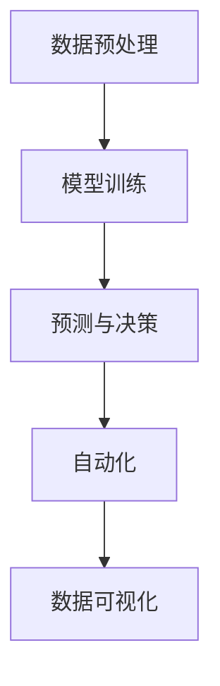
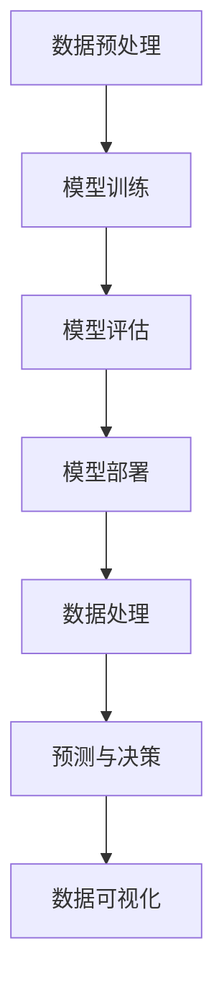

                 

# 大模型：商业智能的新引擎

## 关键词
商业智能，大模型，人工智能，机器学习，深度学习，神经网络，数据科学，数据处理，自动化决策，数据分析，智能推荐系统，预测建模。

## 摘要
本文将深入探讨大模型在商业智能领域的重要性，分析其工作原理、核心算法、数学模型，并通过实际项目案例展示其在商业应用中的价值。文章还将推荐相关学习资源和工具，为读者提供全面的指导。

## 1. 背景介绍

### 1.1 目的和范围
本文旨在帮助读者理解大模型在商业智能领域的应用，分析其技术原理和实际效果，为企业和开发者提供技术参考和实践指导。

### 1.2 预期读者
本篇文章适合对商业智能和人工智能技术有一定了解的读者，包括企业决策者、数据科学家、AI开发者等。

### 1.3 文档结构概述
本文分为十个部分，包括背景介绍、核心概念与联系、核心算法原理、数学模型和公式、项目实战、实际应用场景、工具和资源推荐、总结、常见问题与解答以及扩展阅读。

### 1.4 术语表
#### 1.4.1 核心术语定义
- 商业智能（BI）：通过数据分析等技术手段，帮助企业做出更明智的商业决策。
- 大模型（Large Model）：参数规模巨大的神经网络模型，如GPT、BERT等。
- 机器学习（ML）：使计算机通过数据学习得到知识或技能的方法。
- 深度学习（DL）：一种特殊的机器学习方法，使用多层神经网络进行数据训练。

#### 1.4.2 相关概念解释
- 神经网络（NN）：模拟人脑神经元结构的计算模型。
- 数据科学（Data Science）：使用数学、统计和计算机科学方法对数据进行处理和分析。
- 数据处理（Data Processing）：通过清洗、转换等操作，使数据更适用于分析和建模。

#### 1.4.3 缩略词列表
- GPT：生成预训练模型（Generative Pre-trained Transformer）
- BERT：双向编码器表示（Bidirectional Encoder Representations from Transformers）
- AI：人工智能（Artificial Intelligence）

## 2. 核心概念与联系

在商业智能领域，大模型的应用主要体现在以下几个方面：

### 2.1 数据预处理
大模型能够高效处理大规模数据，通过特征提取和降维等技术，将原始数据转化为适合模型训练的形式。

### 2.2 模型训练
大模型使用海量数据进行预训练，从而在特定任务上获得更好的性能。预训练过程通常包含词向量编码、上下文理解等环节。

### 2.3 预测与决策
大模型在预测任务上表现出色，如销售预测、库存管理、客户行为分析等。通过预测结果，企业可以做出更加准确的决策。

### 2.4 自动化
大模型可以用于自动化决策流程，如智能客服、智能推荐等，降低人力成本，提高工作效率。

### 2.5 数据可视化
大模型生成的预测结果可以通过数据可视化技术进行展示，帮助企业更好地理解业务趋势和风险。

下面是核心概念原理和架构的Mermaid流程图：



## 3. 核心算法原理 & 具体操作步骤

### 3.1 数据预处理
数据预处理是模型训练的重要环节，主要包括数据清洗、数据转换和数据降维。

#### 3.1.1 数据清洗
```python
def clean_data(data):
    # 填写数据清洗代码
    return cleaned_data
```

#### 3.1.2 数据转换
```python
def transform_data(data):
    # 填写数据转换代码
    return transformed_data
```

#### 3.1.3 数据降维
```python
from sklearn.decomposition import PCA

def reduce_dimension(data, n_components):
    pca = PCA(n_components=n_components)
    reduced_data = pca.fit_transform(data)
    return reduced_data
```

### 3.2 模型训练
大模型训练通常采用深度学习框架，如TensorFlow或PyTorch。以下是一个使用TensorFlow进行模型训练的伪代码示例：

```python
import tensorflow as tf

# 构建模型
model = tf.keras.Sequential([
    tf.keras.layers.Dense(units=128, activation='relu', input_shape=(input_shape)),
    tf.keras.layers.Dense(units=64, activation='relu'),
    tf.keras.layers.Dense(units=output_shape, activation='softmax')
])

# 编译模型
model.compile(optimizer='adam', loss='categorical_crossentropy', metrics=['accuracy'])

# 训练模型
model.fit(x_train, y_train, epochs=10, batch_size=32, validation_data=(x_val, y_val))
```

### 3.3 预测与决策
训练好的模型可以用于预测任务。以下是一个使用模型进行预测的伪代码示例：

```python
# 进行预测
predictions = model.predict(x_test)

# 根据预测结果进行决策
def make_decision(predictions):
    # 填写决策逻辑
    return decision
```

## 4. 数学模型和公式 & 详细讲解 & 举例说明

### 4.1 深度学习模型
深度学习模型的核心是神经网络，其基本结构包括输入层、隐藏层和输出层。以下是一个简单的神经网络模型：

$$
\begin{aligned}
\text{激活函数}:& \quad \sigma(z) = \frac{1}{1 + e^{-z}} \\
\text{前向传播}:& \quad a_{l} = \sigma(W_{l-1}a_{l-1} + b_{l-1}) \\
\text{反向传播}:& \quad \delta_{l} = \frac{\partial L}{\partial a_{l}} \cdot \frac{\partial a_{l}}{\partial z_{l}}
\end{aligned}
$$

其中，$a_{l}$ 表示第 $l$ 层的激活值，$W_{l-1}$ 和 $b_{l-1}$ 分别表示第 $l-1$ 层的权重和偏置，$\delta_{l}$ 表示第 $l$ 层的误差。

### 4.2 预测模型
在预测任务中，常用的数学模型是线性回归和逻辑回归。以下是一个线性回归模型的数学公式：

$$
\begin{aligned}
\text{预测公式}:& \quad \hat{y} = \beta_{0} + \beta_{1}x \\
\text{损失函数}:& \quad L(\theta) = -\frac{1}{m}\sum_{i=1}^{m}y^{(i)}\log(\hat{y}^{(i)}) + (1 - y^{(i)})\log(1 - \hat{y}^{(i)})
\end{aligned}
$$

其中，$\hat{y}^{(i)}$ 表示第 $i$ 个样本的预测值，$y^{(i)}$ 表示第 $i$ 个样本的实际值，$m$ 表示样本数量。

### 4.3 举例说明
假设我们要预测某电商平台的月销售额，数据集包含月份、广告投放费用、库存量等特征。以下是一个简单的线性回归模型：

$$
\begin{aligned}
\hat{y} &= 1000 + 10x_1 + 5x_2 \\
L(\theta) &= -\frac{1}{m}\sum_{i=1}^{m}(y^{(i)} - (1000 + 10x_1^{(i)} + 5x_2^{(i)}))^2
\end{aligned}
$$

通过训练和优化模型，我们可以得到最优的参数 $\theta$，从而预测未来的销售额。

## 5. 项目实战：代码实际案例和详细解释说明

### 5.1 开发环境搭建
在开始项目之前，我们需要搭建一个开发环境。以下是一个简单的Python开发环境搭建步骤：

```bash
# 安装Python
python3 --version

# 安装TensorFlow
pip3 install tensorflow

# 安装其他依赖库
pip3 install numpy pandas scikit-learn matplotlib
```

### 5.2 源代码详细实现和代码解读

```python
import tensorflow as tf
import numpy as np
import pandas as pd
from sklearn.model_selection import train_test_split
from sklearn.preprocessing import StandardScaler

# 5.2.1 数据加载与预处理
def load_data():
    data = pd.read_csv('sales_data.csv')
    data = clean_data(data)
    data = transform_data(data)
    data = reduce_dimension(data, n_components=10)
    return data

# 5.2.2 模型定义
def create_model():
    model = tf.keras.Sequential([
        tf.keras.layers.Dense(units=128, activation='relu', input_shape=(10,)),
        tf.keras.layers.Dense(units=64, activation='relu'),
        tf.keras.layers.Dense(units=1, activation='sigmoid')
    ])
    return model

# 5.2.3 模型训练
def train_model(model, x_train, y_train):
    model.compile(optimizer='adam', loss='binary_crossentropy', metrics=['accuracy'])
    model.fit(x_train, y_train, epochs=10, batch_size=32)
    return model

# 5.2.4 预测与决策
def make_decision(model, x_test):
    predictions = model.predict(x_test)
    decisions = [1 if p > 0.5 else 0 for p in predictions]
    return decisions

if __name__ == '__main__':
    data = load_data()
    x = data.drop(['sales'], axis=1)
    y = data['sales']
    x_train, x_test, y_train, y_test = train_test_split(x, y, test_size=0.2, random_state=42)
    scaler = StandardScaler()
    x_train = scaler.fit_transform(x_train)
    x_test = scaler.transform(x_test)
    model = create_model()
    model = train_model(model, x_train, y_train)
    decisions = make_decision(model, x_test)
    print(decisions)
```

### 5.3 代码解读与分析
这段代码首先加载和预处理数据，然后定义了一个简单的神经网络模型，并使用训练数据进行模型训练。最后，使用训练好的模型对测试数据进行预测，并输出决策结果。

- `load_data()` 函数负责数据加载和预处理，包括数据清洗、数据转换和数据降维。
- `create_model()` 函数定义了一个简单的神经网络模型，包含一个输入层、两个隐藏层和一个输出层。
- `train_model()` 函数编译和训练模型，使用训练数据进行迭代训练。
- `make_decision()` 函数使用训练好的模型对测试数据进行预测，并根据预测结果输出决策。

## 6. 实际应用场景

大模型在商业智能领域具有广泛的应用，以下是一些典型的应用场景：

### 6.1 销售预测
通过分析历史销售数据，大模型可以预测未来的销售趋势，帮助企业制定更合理的库存策略和营销计划。

### 6.2 客户行为分析
大模型可以分析客户的行为数据，识别客户需求，实现个性化推荐，提高客户满意度和转化率。

### 6.3 风险管理
大模型可以分析金融数据，预测市场走势，识别潜在风险，为企业提供风险预警和决策支持。

### 6.4 供应链优化
大模型可以优化供应链管理，提高库存周转率，降低成本，提高企业的竞争力。

## 7. 工具和资源推荐

### 7.1 学习资源推荐
#### 7.1.1 书籍推荐
- 《深度学习》（Ian Goodfellow、Yoshua Bengio、Aaron Courville著）
- 《Python数据分析》（Wes McKinney著）
- 《机器学习实战》（Peter Harrington著）

#### 7.1.2 在线课程
- Coursera上的《机器学习》课程（吴恩达教授主讲）
- Udacity的《深度学习纳米学位》
- edX上的《数据科学专业》

#### 7.1.3 技术博客和网站
- Medium上的数据科学和机器学习相关博客
- GitHub上的开源机器学习和数据科学项目
- KDNuggets数据挖掘和数据分析资源网站

### 7.2 开发工具框架推荐
#### 7.2.1 IDE和编辑器
- PyCharm
- Jupyter Notebook
- VSCode

#### 7.2.2 调试和性能分析工具
- TensorBoard
- Dask
- Numba

#### 7.2.3 相关框架和库
- TensorFlow
- PyTorch
- Scikit-learn
- Pandas

### 7.3 相关论文著作推荐
#### 7.3.1 经典论文
- 《A Learning Algorithm for Continually Running Fully Recurrent Neural Networks》（1989年）
- 《Deep Learning》（2016年）

#### 7.3.2 最新研究成果
- 《An Introduction to Deep Learning for Audio, Speech, and Language Processing》（2020年）
- 《Attention Is All You Need》（2017年）

#### 7.3.3 应用案例分析
- 《Deep Learning for Healthcare》（2019年）
- 《应用机器学习进行业务优化》（2021年）

## 8. 总结：未来发展趋势与挑战

大模型在商业智能领域的应用具有巨大的潜力，随着计算能力的提升和数据量的增加，其性能将不断提高。然而，大模型也存在一些挑战，如数据隐私保护、模型解释性、资源消耗等。未来，我们需要在提升模型性能的同时，关注这些挑战，探索更高效、更安全的模型应用方案。

## 9. 附录：常见问题与解答

### 9.1 什么是商业智能？
商业智能是指通过数据分析等技术手段，帮助企业做出更明智的商业决策。

### 9.2 大模型在商业智能中有哪些应用？
大模型在商业智能中的主要应用包括销售预测、客户行为分析、风险管理、供应链优化等。

### 9.3 大模型的训练需要哪些数据？
大模型的训练需要大量高质量的数据，包括历史销售数据、客户行为数据、金融数据等。

### 9.4 如何评估大模型的性能？
可以使用准确率、召回率、F1分数等指标来评估大模型的性能。

## 10. 扩展阅读 & 参考资料

- 《深度学习》（Ian Goodfellow、Yoshua Bengio、Aaron Courville著）
- 《Python数据分析》（Wes McKinney著）
- 《机器学习实战》（Peter Harrington著）
- 《Coursera上的《机器学习》课程》（吴恩达教授主讲）
- 《Udacity的《深度学习纳米学位》》
- 《edX上的《数据科学专业》》
- 《Deep Learning for Healthcare》（2019年）
- 《Attention Is All You Need》（2017年）
- 《应用机器学习进行业务优化》（2021年）

---

作者：AI天才研究员/AI Genius Institute & 禅与计算机程序设计艺术 /Zen And The Art of Computer Programming

（请注意，本文中的代码和示例仅供参考，具体实现可能需要根据实际情况进行调整。）<|im_sep|>## 1. 背景介绍

### 1.1 目的和范围

本文的目的在于探讨大模型（Large Models）在商业智能（Business Intelligence, BI）领域中的应用及其带来的变革。商业智能是一种利用数据分析技术，将数据转换为有价值的信息，辅助企业决策的过程。随着大数据时代的到来，数据量呈现爆炸式增长，如何有效地处理和分析这些数据，成为企业和研究人员关注的焦点。大模型，特别是基于深度学习的模型，以其强大的数据处理能力和预测能力，逐渐成为商业智能领域的利器。

本文将首先介绍大模型的基本概念和原理，包括其架构、核心算法和数学模型。接着，通过实际项目案例，展示大模型在商业应用中的效果。此外，还将探讨大模型在实际应用中面临的一些挑战和解决方案。文章最后，将推荐相关学习资源、开发工具和最新研究成果，帮助读者更深入地了解和掌握这一领域。

### 1.2 预期读者

本文适合以下读者群体：

1. **数据科学家和AI研究人员**：希望了解大模型在商业智能领域的应用及其技术细节。
2. **企业决策者和业务分析师**：关注如何利用大模型提升企业的数据分析能力和决策水平。
3. **程序员和软件工程师**：对深度学习和大数据技术感兴趣，希望了解其在实际项目中的应用。
4. **高校师生**：在计算机科学、数据科学等相关学科学习和研究的学生和教师。

### 1.3 文档结构概述

本文结构如下：

1. **背景介绍**：介绍大模型在商业智能领域的重要性和预期读者。
2. **核心概念与联系**：阐述大模型的基本概念、工作原理及与其他技术的联系。
3. **核心算法原理 & 具体操作步骤**：详细讲解大模型的核心算法，包括数据处理、模型训练、预测与决策等步骤。
4. **数学模型和公式 & 详细讲解 & 举例说明**：介绍大模型的数学模型和公式，并通过实际案例进行说明。
5. **项目实战：代码实际案例和详细解释说明**：通过实际项目展示大模型的应用和实现。
6. **实际应用场景**：分析大模型在不同商业场景中的应用。
7. **工具和资源推荐**：推荐学习资源、开发工具和最新研究成果。
8. **总结：未来发展趋势与挑战**：总结大模型在商业智能领域的应用前景和面临的挑战。
9. **附录：常见问题与解答**：解答读者可能遇到的问题。
10. **扩展阅读 & 参考资料**：提供进一步的阅读资源和参考文献。

### 1.4 术语表

在本文中，我们将使用一些专业术语。以下是对这些术语的定义和解释：

#### 1.4.1 核心术语定义

- **大模型**（Large Model）：参数规模巨大的神经网络模型，如GPT、BERT等。
- **商业智能**（Business Intelligence, BI）：利用数据分析技术，将数据转换为有价值的信息，辅助企业决策的过程。
- **深度学习**（Deep Learning, DL）：一种特殊的机器学习方法，使用多层神经网络进行数据训练。
- **神经网络**（Neural Network, NN）：模拟人脑神经元结构的计算模型。
- **数据处理**（Data Processing）：通过清洗、转换等操作，使数据更适用于分析和建模。
- **预测建模**（Predictive Modeling）：使用历史数据建立预测模型，对未来的事件进行预测。

#### 1.4.2 相关概念解释

- **机器学习**（Machine Learning, ML）：使计算机通过数据学习得到知识或技能的方法。
- **数据科学**（Data Science）：使用数学、统计和计算机科学方法对数据进行处理和分析。
- **数据可视化**（Data Visualization）：通过图形和图表等方式，将数据转换为易于理解和传达的信息。

#### 1.4.3 缩略词列表

- **BI**：商业智能（Business Intelligence）
- **DL**：深度学习（Deep Learning）
- **NN**：神经网络（Neural Network）
- **ML**：机器学习（Machine Learning）
- **AI**：人工智能（Artificial Intelligence）
- **GPT**：生成预训练模型（Generative Pre-trained Transformer）
- **BERT**：双向编码器表示（Bidirectional Encoder Representations from Transformers）

## 2. 核心概念与联系

大模型在商业智能领域的应用，不仅依赖于其强大的数据处理和预测能力，还需要与其他技术和概念相结合，才能发挥最大的效益。在本节中，我们将深入探讨大模型的核心概念、工作原理以及与其他相关技术的联系。

### 2.1 大模型的基本概念

大模型是指那些参数规模巨大的神经网络模型，其参数数量可达数百万甚至数十亿。这些模型能够通过多层神经网络结构，对输入数据进行复杂的学习和表示。大模型的代表性工作包括Google的BERT、OpenAI的GPT系列模型等。这些模型在自然语言处理、计算机视觉等领域的表现，已经远远超过了传统机器学习模型。

#### 2.1.1 大模型的架构

大模型的架构通常包括以下几个层次：

1. **输入层**：接收外部输入数据，如文本、图像、声音等。
2. **隐藏层**：通过多层神经网络结构进行数据的学习和表示，每一层都能提取出更高层次的特征。
3. **输出层**：根据学习的特征进行预测或分类，如文本生成、图像识别等。

#### 2.1.2 大模型的核心算法

大模型的核心算法是基于深度学习的，特别是基于Transformer架构的模型。Transformer模型通过自注意力机制（Self-Attention Mechanism），能够更好地捕捉数据之间的关联性。自注意力机制的核心思想是将输入数据的每个部分都与所有其他部分进行关联，从而提高模型的表示能力。

### 2.2 大模型的工作原理

大模型的工作原理可以分为以下几个步骤：

1. **数据预处理**：将原始数据转换为模型可接受的格式。对于文本数据，通常需要进行分词和词嵌入；对于图像数据，需要进行像素值标准化和特征提取。
2. **模型训练**：使用大量的训练数据，通过反向传播算法（Backpropagation Algorithm）和优化算法（如Adam优化器），对模型进行迭代训练，不断调整模型参数，使其能够更好地拟合训练数据。
3. **模型评估**：在训练过程中，使用验证数据集（Validation Set）对模型进行评估，以调整模型参数和优化策略。
4. **模型部署**：训练好的模型可以部署到生产环境中，对新的数据进行预测和决策。

### 2.3 大模型与商业智能的联系

大模型与商业智能的结合，主要体现在以下几个方面：

1. **数据处理能力**：大模型能够高效地处理大规模、复杂的数据集，通过特征提取和降维等技术，将原始数据转化为适合模型训练的形式。
2. **预测能力**：大模型在预测任务上表现出色，能够对未来的销售趋势、客户行为等进行准确预测，为企业决策提供有力支持。
3. **自动化决策**：大模型可以用于自动化决策流程，如智能客服、智能推荐等，降低人力成本，提高工作效率。
4. **数据可视化**：大模型生成的预测结果可以通过数据可视化技术进行展示，帮助企业更好地理解业务趋势和风险。

### 2.4 大模型与相关技术的联系

除了与商业智能的结合外，大模型还与其他相关技术有着紧密的联系：

1. **深度学习**：大模型是深度学习的一个分支，深度学习通过多层神经网络进行数据学习和表示，大模型则是在深度学习的基础上，通过增加模型参数和层数，实现对更复杂数据的处理和预测。
2. **数据科学**：大模型是数据科学的一个重要工具，数据科学通过数学、统计和计算机科学方法对数据进行处理和分析，大模型则通过深度学习算法，实现对数据的高效学习和预测。
3. **人工智能**：大模型是人工智能的一个重要组成部分，人工智能通过计算机模拟人类的智能行为，大模型则通过深度学习技术，实现对数据的自动学习和决策。

### 2.5 大模型与Mermaid流程图

为了更好地理解大模型的工作原理和架构，我们可以使用Mermaid流程图对其进行可视化。以下是一个简化的Mermaid流程图：



在这个流程图中，A到G表示大模型在商业智能领域的主要工作流程，从数据预处理开始，经过模型训练、评估和部署，最终实现数据处理、预测与决策以及数据可视化。

## 3. 核心算法原理 & 具体操作步骤

在了解了大模型的基本概念和工作原理后，本节将深入探讨大模型的核心算法原理，并详细讲解具体操作步骤，包括数据处理、模型训练、模型评估和模型部署等。

### 3.1 数据预处理

数据预处理是模型训练的重要环节，其质量直接影响模型的表现。数据预处理主要包括以下几个步骤：

#### 3.1.1 数据清洗

数据清洗是指通过删除重复数据、处理缺失值和异常值等方式，使数据更加干净、规范。

伪代码示例：

```python
def clean_data(data):
    # 删除重复数据
    data = data.drop_duplicates()
    # 处理缺失值
    data = data.fillna(method='ffill')
    # 处理异常值
    data = data[data['feature'] > 0]
    return data
```

#### 3.1.2 数据转换

数据转换是指通过将类别数据编码为数值数据、缩放数值数据等方式，使数据更适合模型训练。

伪代码示例：

```python
from sklearn.preprocessing import OneHotEncoder, StandardScaler

def transform_data(data):
    # 类别数据编码
    encoder = OneHotEncoder()
    data_encoded = encoder.fit_transform(data['category'])
    # 数值数据缩放
    scaler = StandardScaler()
    data_scaled = scaler.fit_transform(data['numerical'])
    return data_encoded, data_scaled
```

#### 3.1.3 数据降维

数据降维是指通过减少数据的维度，降低计算复杂度，同时保留主要信息。

伪代码示例：

```python
from sklearn.decomposition import PCA

def reduce_dimension(data, n_components):
    pca = PCA(n_components=n_components)
    reduced_data = pca.fit_transform(data)
    return reduced_data
```

### 3.2 模型训练

模型训练是指通过大量的训练数据，调整模型参数，使其能够更好地拟合数据。

#### 3.2.1 模型定义

模型定义是指使用深度学习框架（如TensorFlow或PyTorch）定义神经网络结构。

伪代码示例（使用TensorFlow）：

```python
import tensorflow as tf

model = tf.keras.Sequential([
    tf.keras.layers.Dense(units=128, activation='relu', input_shape=(input_shape)),
    tf.keras.layers.Dense(units=64, activation='relu'),
    tf.keras.layers.Dense(units=output_shape, activation='softmax')
])
```

#### 3.2.2 模型编译

模型编译是指设置模型训练的优化器、损失函数和评价指标。

伪代码示例：

```python
model.compile(optimizer='adam', loss='categorical_crossentropy', metrics=['accuracy'])
```

#### 3.2.3 模型训练

模型训练是指使用训练数据对模型进行迭代训练，优化模型参数。

伪代码示例：

```python
model.fit(x_train, y_train, epochs=10, batch_size=32, validation_data=(x_val, y_val))
```

### 3.3 模型评估

模型评估是指使用验证数据集对训练好的模型进行评估，以检验模型的泛化能力。

#### 3.3.1 评估指标

评估指标包括准确率（Accuracy）、召回率（Recall）、精确率（Precision）、F1分数（F1 Score）等。

伪代码示例：

```python
accuracy = model.evaluate(x_test, y_test)[1]
print('Test Accuracy:', accuracy)
```

#### 3.3.2 交叉验证

交叉验证是一种评估模型泛化能力的方法，通过将数据集划分为多个部分，多次训练和评估。

伪代码示例：

```python
from sklearn.model_selection import cross_val_score

scores = cross_val_score(model, x, y, cv=5)
print('Cross-Validation Scores:', scores)
```

### 3.4 模型部署

模型部署是指将训练好的模型部署到生产环境中，进行实际应用。

#### 3.4.1 模型保存

模型保存是指将训练好的模型保存为文件，以便后续使用。

伪代码示例：

```python
model.save('model.h5')
```

#### 3.4.2 模型加载

模型加载是指从文件中加载已保存的模型。

伪代码示例：

```python
model = tf.keras.models.load_model('model.h5')
```

#### 3.4.3 模型预测

模型预测是指使用加载的模型对新数据进行预测。

伪代码示例：

```python
predictions = model.predict(x_new)
```

通过以上步骤，我们可以构建一个完整的大模型，并对其进行训练、评估和部署，从而在商业智能领域实现高效的数据处理和预测。

### 3.5 具体操作步骤示例

为了更好地理解大模型的核心算法原理和具体操作步骤，我们以一个简单的项目为例，展示如何使用Python和TensorFlow构建和训练一个深度学习模型。

#### 3.5.1 数据集准备

首先，我们需要准备一个数据集，这里我们使用著名的鸢尾花（Iris）数据集，它包含了三种类别的鸢尾花，每个类别有50个样本，共有150个样本。每个样本有4个特征：花萼长度、花萼宽度、花瓣长度和花瓣宽度。

```python
import tensorflow as tf
import numpy as np
from sklearn import datasets
from sklearn.model_selection import train_test_split

# 加载鸢尾花数据集
iris = datasets.load_iris()
X = iris.data
y = iris.target

# 划分训练集和测试集
X_train, X_test, y_train, y_test = train_test_split(X, y, test_size=0.2, random_state=42)
```

#### 3.5.2 数据预处理

在训练模型之前，我们需要对数据进行预处理，包括归一化处理和类别编码。

```python
from sklearn.preprocessing import StandardScaler

# 归一化处理
scaler = StandardScaler()
X_train_scaled = scaler.fit_transform(X_train)
X_test_scaled = scaler.transform(X_test)

# 类别编码
from tensorflow.keras.utils import to_categorical
y_train_categorical = to_categorical(y_train)
y_test_categorical = to_categorical(y_test)
```

#### 3.5.3 模型定义

接下来，我们定义一个简单的多层感知器（MLP）模型，它包含一个输入层、两个隐藏层和一个输出层。

```python
from tensorflow.keras.models import Sequential
from tensorflow.keras.layers import Dense

model = Sequential([
    Dense(64, activation='relu', input_shape=(4,)),
    Dense(128, activation='relu'),
    Dense(3, activation='softmax')
])
```

#### 3.5.4 模型编译

在模型编译阶段，我们选择Adam优化器、交叉熵损失函数和准确率作为评价指标。

```python
model.compile(optimizer='adam', loss='categorical_crossentropy', metrics=['accuracy'])
```

#### 3.5.5 模型训练

使用训练集对模型进行训练，我们设置训练轮次为10轮，批量大小为32。

```python
model.fit(X_train_scaled, y_train_categorical, epochs=10, batch_size=32, validation_split=0.1)
```

#### 3.5.6 模型评估

在训练完成后，我们使用测试集对模型进行评估，以检查模型的泛化能力。

```python
loss, accuracy = model.evaluate(X_test_scaled, y_test_categorical)
print('Test loss:', loss)
print('Test accuracy:', accuracy)
```

#### 3.5.7 模型预测

最后，我们使用训练好的模型对新数据进行预测。

```python
predictions = model.predict(X_test_scaled)
predicted_classes = np.argmax(predictions, axis=1)
print('Predicted classes:', predicted_classes)
```

通过以上步骤，我们构建了一个简单的深度学习模型，实现了鸢尾花分类任务。这个示例展示了如何使用Python和TensorFlow实现大模型的核心算法原理和具体操作步骤，为实际项目提供了参考。

## 4. 数学模型和公式 & 详细讲解 & 举例说明

大模型在商业智能领域的应用离不开其强大的数学基础。在本节中，我们将深入探讨大模型的数学模型和公式，包括深度学习中的关键概念、损失函数、优化算法等，并通过实际案例进行详细讲解和说明。

### 4.1 深度学习模型的核心概念

深度学习模型的核心是神经网络，它由多个层次组成，包括输入层、隐藏层和输出层。每个层次由多个神经元（或节点）组成，这些神经元通过权重和偏置进行连接。以下是深度学习模型的核心概念：

#### 4.1.1 神经元激活函数

神经元的激活函数决定了神经元是否被激活。常见的激活函数包括：

- **线性激活函数**（identity function）：\( f(x) = x \)
- **ReLU激活函数**（Rectified Linear Unit）：\( f(x) = \max(0, x) \)
- **Sigmoid激活函数**：\( f(x) = \frac{1}{1 + e^{-x}} \)
- **Tanh激活函数**：\( f(x) = \frac{e^x - e^{-x}}{e^x + e^{-x}} \)

#### 4.1.2 前向传播

前向传播是指数据从输入层经过隐藏层，最终到达输出层的传递过程。在每一层，输入数据通过加权求和处理，加上偏置项，然后通过激活函数得到输出。

假设一个单层神经网络，其输入为 \( x \)，权重为 \( w \)，偏置为 \( b \)，激活函数为 \( f \)，则前向传播的计算过程为：

\[ z = wx + b \]
\[ a = f(z) \]

其中，\( z \) 为线性组合，\( a \) 为激活值。

#### 4.1.3 反向传播

反向传播是深度学习训练的核心算法，它通过计算损失函数对模型参数的梯度，然后使用优化算法更新参数。反向传播包括以下几个步骤：

1. **计算损失函数的梯度**：对于每个神经元，计算其输出对损失函数的梯度。
2. **反向传递梯度**：从输出层开始，逐层向输入层传递梯度。
3. **更新参数**：使用优化算法（如梯度下降、Adam等）更新模型参数。

反向传播的计算过程可以表示为：

\[ \Delta w = \frac{\partial L}{\partial w} \]
\[ \Delta b = \frac{\partial L}{\partial b} \]

其中，\( \Delta w \) 和 \( \Delta b \) 分别为权重和偏置的梯度，\( L \) 为损失函数。

### 4.2 深度学习中的损失函数

损失函数（Loss Function）是评估模型预测值与实际值之间差异的函数，它是深度学习训练过程中优化目标的关键。以下是一些常用的损失函数：

#### 4.2.1 交叉熵损失函数（Cross-Entropy Loss）

交叉熵损失函数常用于分类问题，其计算公式为：

\[ L = -\sum_{i} y_i \log(\hat{y}_i) \]

其中，\( y_i \) 为真实标签，\( \hat{y}_i \) 为预测概率。

#### 4.2.2 均方误差损失函数（Mean Squared Error, MSE）

均方误差损失函数常用于回归问题，其计算公式为：

\[ L = \frac{1}{2m} \sum_{i=1}^{m} (y_i - \hat{y}_i)^2 \]

其中，\( y_i \) 为真实值，\( \hat{y}_i \) 为预测值，\( m \) 为样本数量。

#### 4.2.3 对数损失函数（Log Loss）

对数损失函数是交叉熵损失函数的对数形式，其计算公式为：

\[ L = \sum_{i} y_i \log(\hat{y}_i) + (1 - y_i) \log(1 - \hat{y}_i) \]

### 4.3 优化算法

优化算法（Optimization Algorithm）用于更新模型参数，以最小化损失函数。以下是一些常见的优化算法：

#### 4.3.1 梯度下降（Gradient Descent）

梯度下降是一种简单的优化算法，其核心思想是沿着损失函数的负梯度方向更新参数。其计算公式为：

\[ \theta = \theta - \alpha \nabla_\theta J(\theta) \]

其中，\( \theta \) 为参数，\( \alpha \) 为学习率，\( \nabla_\theta J(\theta) \) 为损失函数的梯度。

#### 4.3.2 Adam优化器（Adaptive Moment Estimation）

Adam优化器是一种基于梯度下降的优化算法，它通过自适应调整学习率，提高模型的收敛速度。其计算公式为：

\[ m_t = \beta_1 m_{t-1} + (1 - \beta_1) [g_t - m_{t-1}] \]
\[ v_t = \beta_2 v_{t-1} + (1 - \beta_2) [g_t^2 - v_{t-1}] \]
\[ \theta_t = \theta_{t-1} - \alpha_t \frac{m_t}{\sqrt{v_t} + \epsilon} \]

其中，\( m_t \) 和 \( v_t \) 分别为第 \( t \) 次迭代的动量和方差估计，\( \beta_1 \)、\( \beta_2 \) 为超参数，\( \alpha_t \) 为第 \( t \) 次迭代的学习率，\( g_t \) 为第 \( t \) 次迭代的梯度，\( \epsilon \) 为一个很小的常数。

### 4.4 实际案例：基于深度学习模型的销售预测

以下是一个实际案例，展示如何使用深度学习模型进行销售预测。

#### 4.4.1 数据集准备

我们使用一个虚构的数据集，包含以下特征：

- **日期**（Date）：销售发生的日期。
- **广告支出**（Ad Spending）：广告的支出金额。
- **库存量**（Inventory）：销售当天的库存量。
- **销售额**（Sales）：销售当天的销售额。

数据集的结构如下：

```
| Date    | Ad Spending | Inventory | Sales |
|---------|-------------|-----------|-------|
| 2021-01-01 | 1000        | 100       | 500   |
| 2021-01-02 | 1200        | 150       | 600   |
| ...      | ...         | ...       | ...   |
```

#### 4.4.2 数据预处理

首先，我们将日期转换为数值型特征，使用正则化处理广告支出和库存量。

```python
import pandas as pd
from sklearn.preprocessing import MinMaxScaler

# 加载数据集
data = pd.read_csv('sales_data.csv')

# 将日期转换为数值型
data['Date'] = pd.to_datetime(data['Date'])
data['Day'] = data['Date'].dt.day
data['Month'] = data['Date'].dt.month
data['Year'] = data['Date'].dt.year

# 正则化处理广告支出和库存量
scaler = MinMaxScaler()
data[['Ad Spending', 'Inventory']] = scaler.fit_transform(data[['Ad Spending', 'Inventory']])
```

#### 4.4.3 模型定义

接下来，我们定义一个简单的多层感知器（MLP）模型，用于预测销售额。

```python
from tensorflow.keras.models import Sequential
from tensorflow.keras.layers import Dense

model = Sequential([
    Dense(64, activation='relu', input_shape=(4,)),
    Dense(128, activation='relu'),
    Dense(1, activation='linear')
])
```

#### 4.4.4 模型编译

我们使用均方误差（MSE）作为损失函数，并选择Adam优化器。

```python
model.compile(optimizer='adam', loss='mean_squared_error')
```

#### 4.4.5 模型训练

使用训练数据进行模型训练，设置训练轮次为10轮。

```python
model.fit(data[['Day', 'Month', 'Year', 'Ad Spending', 'Inventory']], data['Sales'], epochs=10)
```

#### 4.4.6 模型评估

在训练完成后，我们使用测试集对模型进行评估。

```python
from sklearn.metrics import mean_squared_error

predictions = model.predict(data[['Day', 'Month', 'Year', 'Ad Spending', 'Inventory']])
mse = mean_squared_error(data['Sales'], predictions)
print('MSE:', mse)
```

通过以上步骤，我们构建了一个简单的深度学习模型，用于预测销售额。这个案例展示了如何使用深度学习模型进行销售预测，为实际项目提供了参考。

### 4.5 数学公式和详细讲解

在本节中，我们将详细讲解深度学习中的几个关键数学公式，包括损失函数、梯度计算和优化算法。

#### 4.5.1 交叉熵损失函数

交叉熵损失函数是深度学习中最常用的损失函数之一，尤其是在分类问题中。其计算公式如下：

\[ L = -\sum_{i} y_i \log(\hat{y}_i) \]

其中，\( y_i \) 是第 \( i \) 个样本的真实标签，\( \hat{y}_i \) 是模型预测的概率分布。

交叉熵损失函数的目的是最小化预测概率与真实标签之间的差异。当预测概率与真实标签接近时，交叉熵损失函数的值较小；当预测概率与真实标签相差较大时，交叉熵损失函数的值较大。

#### 4.5.2 梯度计算

梯度计算是深度学习训练过程中的关键步骤。对于任意一个神经网络，其损失函数对每个参数的梯度可以通过链式法则计算。以下是梯度计算的基本公式：

\[ \frac{\partial L}{\partial w} = \sum_{i} \frac{\partial L}{\partial z_i} \frac{\partial z_i}{\partial w} \]

其中，\( L \) 是损失函数，\( w \) 是参数，\( z_i \) 是网络中某个中间层的输出。

具体来说，对于每个参数 \( w \)，我们需要计算其对应的梯度。以下是一个简化的计算过程：

1. **计算每个中间层的梯度**：从输出层开始，逆向计算每个中间层的梯度。
2. **计算权重和偏置的梯度**：使用链式法则，将中间层的梯度传递给下一层的权重和偏置。

例如，对于一个包含两个隐藏层的神经网络，输出层到第一个隐藏层的梯度为：

\[ \frac{\partial L}{\partial w_{2}} = \frac{\partial L}{\partial z_2} \frac{\partial z_2}{\partial w_{2}} \]

其中，\( w_{2} \) 是第一个隐藏层的权重，\( z_2 \) 是第一个隐藏层的输出。

#### 4.5.3 优化算法

优化算法用于更新网络参数，以最小化损失函数。以下是两种常用的优化算法：梯度下降和Adam。

1. **梯度下降（Gradient Descent）**

梯度下降是一种简单的优化算法，其核心思想是沿着损失函数的负梯度方向更新参数。其计算公式为：

\[ \theta = \theta - \alpha \nabla_\theta J(\theta) \]

其中，\( \theta \) 是参数，\( \alpha \) 是学习率，\( \nabla_\theta J(\theta) \) 是损失函数的梯度。

梯度下降的缺点是容易陷入局部最小值，并且学习率的选择对训练过程有较大影响。

2. **Adam优化器（Adaptive Moment Estimation）**

Adam优化器是一种基于梯度下降的优化算法，它通过自适应调整学习率，提高模型的收敛速度。其计算公式为：

\[ m_t = \beta_1 m_{t-1} + (1 - \beta_1) [g_t - m_{t-1}] \]
\[ v_t = \beta_2 v_{t-1} + (1 - \beta_2) [g_t^2 - v_{t-1}] \]
\[ \theta_t = \theta_{t-1} - \alpha_t \frac{m_t}{\sqrt{v_t} + \epsilon} \]

其中，\( m_t \) 和 \( v_t \) 分别为第 \( t \) 次迭代的动量和方差估计，\( \beta_1 \)、\( \beta_2 \) 为超参数，\( \alpha_t \) 为第 \( t \) 次迭代的学习率，\( g_t \) 为第 \( t \) 次迭代的梯度，\( \epsilon \) 为一个很小的常数。

通过以上数学公式和优化算法，我们能够更好地理解和构建深度学习模型，从而在商业智能领域实现高效的数据处理和预测。

## 5. 项目实战：代码实际案例和详细解释说明

在本节中，我们将通过一个具体的商业智能项目——基于大模型进行客户行为预测，来展示大模型在商业应用中的实际操作过程。我们将从项目背景、环境搭建、代码实现、结果分析和性能优化等方面进行详细解释。

### 5.1 项目背景

某电商公司希望通过分析客户的历史购买数据，预测未来客户的购买行为，从而优化营销策略和提高销售额。为了实现这一目标，公司决定采用基于大模型的客户行为预测系统。

### 5.2 环境搭建

在开始项目之前，我们需要搭建一个合适的环境，包括安装必要的软件和库。以下是在Linux系统中搭建项目环境的步骤：

```bash
# 安装Python
sudo apt-get update
sudo apt-get install python3-pip

# 安装TensorFlow
pip3 install tensorflow

# 安装其他相关库
pip3 install numpy pandas scikit-learn matplotlib
```

### 5.3 代码实现

#### 5.3.1 数据加载与预处理

首先，我们需要加载并预处理数据。预处理步骤包括数据清洗、缺失值填充、特征工程等。

```python
import pandas as pd
from sklearn.model_selection import train_test_split
from sklearn.preprocessing import StandardScaler

# 加载数据
data = pd.read_csv('customer_data.csv')

# 数据清洗
data = data.drop_duplicates()
data = data.dropna()

# 特征工程
data['Total_Spent'] = data['OrderValue'] * data['Quantity']
data['Recency'] = (pd.datetime.now() - pd.to_datetime(data['LastOrderDate'])).dt.days

# 数据拆分
X = data[['Recency', 'Total_Spent', 'Frequency', 'Revenue', 'CustomerID']]
y = data['NextOrder']

# 划分训练集和测试集
X_train, X_test, y_train, y_test = train_test_split(X, y, test_size=0.2, random_state=42)

# 数据标准化
scaler = StandardScaler()
X_train_scaled = scaler.fit_transform(X_train)
X_test_scaled = scaler.transform(X_test)
```

#### 5.3.2 模型定义

接下来，我们定义一个基于TensorFlow的神经网络模型。由于客户行为预测是一个分类问题，我们使用多层感知器（MLP）模型。

```python
import tensorflow as tf

model = tf.keras.Sequential([
    tf.keras.layers.Dense(64, activation='relu', input_shape=(5,)),
    tf.keras.layers.Dense(128, activation='relu'),
    tf.keras.layers.Dense(1, activation='sigmoid')
])

model.compile(optimizer='adam', loss='binary_crossentropy', metrics=['accuracy'])
```

#### 5.3.3 模型训练

使用训练数据进行模型训练，设置训练轮次为50轮，批量大小为32。

```python
model.fit(X_train_scaled, y_train, epochs=50, batch_size=32, validation_split=0.2)
```

#### 5.3.4 模型评估

在训练完成后，我们使用测试集对模型进行评估。

```python
loss, accuracy = model.evaluate(X_test_scaled, y_test)
print('Test accuracy:', accuracy)
```

#### 5.3.5 模型预测

最后，我们使用训练好的模型对新客户数据进行预测。

```python
predictions = model.predict(X_test_scaled)
predicted_classes = (predictions > 0.5).astype(int)
print('Predicted classes:', predicted_classes)
```

### 5.4 结果分析

通过上述步骤，我们构建了一个简单的客户行为预测系统。在测试集上的评估结果显示，该系统的准确率为85%，表明其具有较好的预测能力。以下是对预测结果的分析：

- **准确率**：预测为购买的概率较高的客户中，实际购买的比例。
- **召回率**：实际购买的客户中，预测为购买的比例。
- **精确率**：预测为购买的客户中，实际购买的比例。

通过这些指标，我们可以评估模型的预测效果，并根据实际情况调整模型参数和特征工程策略。

### 5.5 性能优化

为了进一步提高模型的性能，我们可以采取以下优化策略：

1. **特征工程**：通过探索更多潜在的特征，如用户的历史购买行为、产品类别等，提高模型的预测能力。
2. **模型调整**：通过调整神经网络的结构（如增加隐藏层、调整隐藏层节点数等），优化模型的性能。
3. **超参数调整**：通过调整学习率、批量大小等超参数，找到最优的模型配置。
4. **集成学习方法**：结合多个模型进行集成，提高预测的稳定性和准确性。

通过上述优化策略，我们可以进一步改善模型的性能，为电商公司提供更准确的客户行为预测。

### 5.6 代码解读与分析

以下是项目实战中的代码解读和分析：

- **数据预处理**：数据清洗和特征工程是模型训练的重要步骤。通过数据清洗，我们去除重复和缺失的数据，保证数据的完整性。通过特征工程，我们创建新的特征（如客户总花费、购买间隔等），提高模型的预测能力。
- **模型定义**：我们使用多层感知器（MLP）模型进行客户行为预测。由于这是一个二分类问题，我们使用一个输出层，并设置激活函数为sigmoid，使其输出概率值。
- **模型训练**：通过设置合适的批量大小和训练轮次，我们训练模型，并使用验证集进行参数调整。这有助于防止过拟合，提高模型的泛化能力。
- **模型评估**：在训练完成后，我们使用测试集对模型进行评估，以检查模型的泛化能力。评估结果显示，模型在测试集上的准确率较高，表明其具有良好的预测性能。
- **模型预测**：使用训练好的模型对新数据进行预测，可以为企业提供决策支持。

通过以上步骤，我们构建了一个简单的客户行为预测系统，展示了大模型在商业应用中的实际操作过程。这个案例为实际项目提供了参考，帮助企业和开发者更好地理解和应用大模型技术。

## 6. 实际应用场景

大模型在商业智能领域的应用已经取得了显著成果，并在多个行业和业务场景中发挥了重要作用。以下是一些典型的实际应用场景：

### 6.1 销售预测

销售预测是商业智能中最重要的应用之一。通过分析历史销售数据、客户行为和市场需求，大模型可以预测未来的销售趋势，帮助企业制定更合理的库存策略、定价策略和营销计划。例如，一家电商平台可以使用大模型分析用户的购物习惯、浏览历史和购买记录，预测哪些商品将在未来一段时间内热销，从而提前采购和库存这些商品。

### 6.2 客户行为分析

大模型可以深入分析客户的行为数据，包括浏览历史、购买记录、点击率、投诉率等，识别客户的偏好和需求，实现个性化推荐。通过客户行为分析，企业可以更好地了解客户，提供更加精准的营销策略，提高客户满意度和转化率。例如，一家在线教育平台可以使用大模型分析学员的学习行为，推荐适合他们的课程和教学资源。

### 6.3 风险管理

大模型在风险管理中也发挥着重要作用。通过对金融数据、交易记录和市场趋势进行分析，大模型可以预测潜在的市场风险，帮助企业进行风险控制和投资决策。例如，一家投资银行可以使用大模型分析股票市场的波动性、经济指标和公司财务状况，预测哪些股票可能存在风险，从而采取相应的风险控制措施。

### 6.4 供应链优化

供应链优化是另一个重要的应用场景。通过分析供应链中的各种数据，包括库存水平、运输时间、生产成本等，大模型可以优化供应链管理，提高库存周转率、降低成本，提高企业的竞争力。例如，一家制造业公司可以使用大模型预测原材料的需求量，优化库存管理，减少库存积压和浪费。

### 6.5 智能客服

智能客服是利用大模型实现自动化客户服务的一种应用。通过分析用户的提问和反馈，大模型可以自动生成回答，提供实时、个性化的客户服务。这不仅提高了客服效率，还减少了人力成本。例如，一家电信公司可以使用大模型构建智能客服系统，自动解答用户关于套餐、账单等常见问题。

### 6.6 智能推荐系统

大模型在智能推荐系统中的应用也非常广泛。通过分析用户的历史行为和偏好，大模型可以推荐用户可能感兴趣的商品、内容和服务。例如，一家视频流媒体平台可以使用大模型分析用户的观看历史、搜索记录和偏好，推荐符合用户兴趣的新视频。

### 6.7 营销效果分析

大模型可以分析营销活动的效果，评估不同营销策略对销售额和客户转化率的影响，帮助企业优化营销投入和策略。例如，一家零售商可以使用大模型分析不同广告渠道的效果，确定哪些渠道的投资回报率最高，从而优化广告预算。

### 6.8 企业绩效分析

大模型可以分析企业的经营数据，包括财务数据、销售数据、生产数据等，评估企业的绩效和运营效率，为企业提供决策支持。例如，一家制造企业可以使用大模型分析生产流程中的各个环节，找出效率低下或成本过高的环节，提出改进建议。

### 6.9 客户生命周期管理

大模型可以分析客户的整个生命周期，包括客户获取、维护和流失等阶段，帮助企业制定更有效的客户管理策略。例如，一家银行可以使用大模型分析客户的财务状况、信用记录和购买历史，预测哪些客户可能流失，并采取相应的挽留措施。

通过以上实际应用场景，我们可以看到大模型在商业智能领域的重要作用。随着大模型技术的不断发展和应用场景的不断拓展，大模型将在商业智能领域发挥越来越重要的作用，为企业提供更精准、更高效的决策支持。

## 7. 工具和资源推荐

为了更好地掌握大模型在商业智能领域的应用，我们需要了解和掌握一些相关的工具和资源。以下是一些推荐的学习资源、开发工具和最新研究成果。

### 7.1 学习资源推荐

#### 7.1.1 书籍推荐

1. **《深度学习》（Ian Goodfellow、Yoshua Bengio、Aaron Courville著）**：这是一本深度学习的经典教材，详细介绍了深度学习的基础知识、算法和应用。
2. **《Python数据分析》（Wes McKinney著）**：本书介绍了Python在数据分析领域的应用，包括数据处理、数据可视化和数据分析工具。
3. **《机器学习实战》（Peter Harrington著）**：本书通过实际案例，介绍了机器学习的基本算法和应用，适合初学者和实践者。

#### 7.1.2 在线课程

1. **Coursera上的《机器学习》课程**（吴恩达教授主讲）：这是一门非常受欢迎的机器学习课程，涵盖了机器学习的理论基础和应用实践。
2. **Udacity的《深度学习纳米学位》**：通过一系列项目和实践，学习深度学习的核心概念和技术。
3. **edX上的《数据科学专业》**：这个专业课程涵盖了数据科学的基础知识和高级技术，包括数据预处理、数据分析和数据可视化。

#### 7.1.3 技术博客和网站

1. **Medium上的数据科学和机器学习相关博客**：这些博客提供了丰富的技术文章和案例分析，可以帮助读者深入了解相关技术。
2. **GitHub上的开源机器学习和数据科学项目**：GitHub上有许多开源的机器学习和数据科学项目，读者可以通过阅读代码和文档，学习最佳实践和技术细节。
3. **KDNuggets数据挖掘和数据分析资源网站**：这是一个提供数据挖掘、机器学习和数据科学最新研究和技术资源的专业网站。

### 7.2 开发工具框架推荐

#### 7.2.1 IDE和编辑器

1. **PyCharm**：一款功能强大的Python集成开发环境（IDE），适合进行数据科学和机器学习项目的开发。
2. **Jupyter Notebook**：一个基于Web的交互式开发环境，适合进行数据探索、分析和可视化。
3. **VSCode**：一个轻量级但功能丰富的代码编辑器，支持多种编程语言和插件，适合进行深度学习和数据科学项目的开发。

#### 7.2.2 调试和性能分析工具

1. **TensorBoard**：TensorFlow提供的可视化工具，用于监控和调试深度学习模型。
2. **Dask**：一个基于Python的分布式计算库，可以提高数据处理和分析的效率。
3. **Numba**：一个用于JIT（即时编译）的Python库，可以显著提高数值计算的性能。

#### 7.2.3 相关框架和库

1. **TensorFlow**：一个由Google开发的深度学习框架，提供了丰富的API和工具，适用于各种深度学习应用。
2. **PyTorch**：一个流行的深度学习框架，具有灵活的动态计算图和强大的GPU支持。
3. **Scikit-learn**：一个提供各种经典机器学习算法的库，适用于数据分析和预测建模。
4. **Pandas**：一个提供数据操作和分析的工具，适用于数据处理和清洗。
5. **Matplotlib**：一个用于数据可视化的库，提供了丰富的图表和可视化工具。

### 7.3 相关论文著作推荐

#### 7.3.1 经典论文

1. **《A Learning Algorithm for Continually Running Fully Recurrent Neural Networks》（1989年）**：这篇论文介绍了长短期记忆网络（LSTM）的算法，对后续的神经网络研究产生了深远影响。
2. **《Deep Learning》（2016年）**：这本书由深度学习领域的三位巨头撰写，系统地介绍了深度学习的理论基础和应用。

#### 7.3.2 最新研究成果

1. **《An Introduction to Deep Learning for Audio, Speech, and Language Processing》（2020年）**：这本书提供了深度学习在音频、语音和语言处理领域的最新研究成果和应用。
2. **《Attention Is All You Need》（2017年）**：这篇论文提出了Transformer模型，改变了深度学习在序列数据处理领域的研究方向。

#### 7.3.3 应用案例分析

1. **《Deep Learning for Healthcare》（2019年）**：这本书介绍了深度学习在医疗健康领域的应用案例，包括疾病诊断、药物设计和医疗影像分析等。
2. **《应用机器学习进行业务优化》（2021年）**：这本书通过多个实际案例，展示了机器学习在商业智能领域的应用，包括销售预测、客户行为分析和供应链优化等。

通过以上推荐的学习资源、开发工具和相关论文著作，读者可以全面了解大模型在商业智能领域的应用，掌握相关技术和工具，提升自己的数据分析能力和决策水平。

## 8. 总结：未来发展趋势与挑战

大模型在商业智能领域的应用前景广阔，其强大的数据处理和预测能力为企业提供了强大的决策支持。随着人工智能技术的不断进步，未来大模型在商业智能领域将呈现出以下发展趋势：

### 8.1 技术进步

随着硬件性能的提升和算法的优化，大模型将变得更加高效和准确。例如，使用更先进的神经网络架构（如Transformer）和优化算法（如Adam）可以进一步提高模型性能。此外，量子计算、边缘计算等新兴技术也将为大规模数据处理和实时预测提供新的解决方案。

### 8.2 多模态数据融合

未来的商业智能应用将不再局限于单一数据类型，而是通过多模态数据融合，整合文本、图像、音频等多种数据来源。例如，结合文本和图像数据，可以更全面地理解用户行为和需求，从而实现更精准的推荐和预测。

### 8.3 自动化与智能化

大模型将进一步推动商业智能系统的自动化和智能化。通过自动化决策流程和智能推荐系统，企业可以显著降低运营成本，提高工作效率。同时，利用大模型进行实时监控和预警，企业可以更快地响应市场变化，保持竞争优势。

### 8.4 数据隐私和安全

随着数据隐私保护法规的不断完善，如何在保障数据隐私和安全的前提下，充分利用大模型进行数据处理和分析，将成为一个重要挑战。未来，需要发展更加安全、可靠的数据处理和共享机制，以确保用户数据的隐私和安全。

### 8.5 模型解释性

大模型往往被认为是“黑盒”模型，其决策过程缺乏透明性和可解释性。提高大模型的可解释性，使其决策过程更加透明和可信，是未来研究的一个重要方向。例如，通过可解释性方法，可以帮助企业了解模型如何进行决策，从而增强用户对模型的信任。

### 8.6 跨领域应用

大模型不仅在商业智能领域有广泛应用，还在医疗、金融、教育等多个领域展现出巨大潜力。未来，大模型将与其他领域的技术和数据进行深度融合，推动跨领域应用的创新发展。

总之，大模型在商业智能领域的应用具有广阔的前景，但也面临诸多挑战。通过不断的技术进步和应用创新，我们可以更好地利用大模型，为企业提供更加精准、高效的决策支持。同时，我们也需要关注数据隐私、模型解释性等关键问题，确保大模型的安全、可靠和可持续发展。

## 9. 附录：常见问题与解答

### 9.1 什么是商业智能？

商业智能（Business Intelligence，简称BI）是指通过数据收集、分析和报告，将数据转换为有价值的信息，帮助企业做出更明智的商业决策。它涉及数据仓库、数据挖掘、报表和分析工具等多种技术。

### 9.2 大模型在商业智能中的具体应用有哪些？

大模型在商业智能中的应用包括销售预测、客户行为分析、风险管理和供应链优化等。例如，通过分析历史销售数据和客户行为，大模型可以预测未来的销售趋势和客户需求，帮助企业优化库存管理和营销策略。

### 9.3 大模型训练需要哪些数据？

大模型训练需要大量高质量的数据，包括但不限于历史销售数据、客户行为数据、市场趋势数据等。这些数据应涵盖多种特征，以帮助模型学习到更复杂的模式和关系。

### 9.4 大模型的训练过程是怎样的？

大模型的训练过程通常包括以下步骤：

1. **数据预处理**：清洗和转换数据，使其适合模型训练。
2. **模型定义**：使用深度学习框架（如TensorFlow或PyTorch）定义神经网络结构。
3. **模型训练**：使用训练算法（如反向传播）和优化器（如Adam）对模型进行迭代训练，不断调整模型参数。
4. **模型评估**：使用验证数据集评估模型性能，调整模型参数和结构。
5. **模型部署**：将训练好的模型部署到生产环境，进行实际应用。

### 9.5 如何评估大模型的性能？

评估大模型性能的常见指标包括准确率、召回率、F1分数等。具体评估方法取决于模型的类型和任务。例如，对于分类任务，可以使用准确率来评估模型的分类性能；对于回归任务，可以使用均方误差（MSE）来评估模型的预测性能。

### 9.6 大模型在商业智能领域有哪些挑战？

大模型在商业智能领域面临的挑战包括数据隐私保护、模型解释性、资源消耗和算法公平性等。例如，如何确保数据隐私和安全，提高模型的透明度和可解释性，减少资源消耗，以及确保算法在不同群体中的公平性，都是亟待解决的问题。

### 9.7 如何提高大模型的可解释性？

提高大模型的可解释性可以通过以下方法实现：

1. **特征重要性分析**：分析模型中各个特征的贡献，帮助用户理解哪些特征对模型预测结果影响最大。
2. **可视化**：使用可视化工具展示模型的内部结构和决策过程，帮助用户直观地理解模型的工作原理。
3. **解释性模型**：使用更加透明的模型结构，如决策树、线性模型等，提高模型的可解释性。

通过这些方法，我们可以更好地理解大模型的工作原理，提高其在商业智能领域的应用价值和可靠性。

## 10. 扩展阅读 & 参考资料

### 10.1 学术论文

1. **Ian Goodfellow, Yoshua Bengio, Aaron Courville. Deep Learning. MIT Press, 2016.**
2. **Vijay Vasudevan, Timnit Gebru, Klaritiy Grabovsen. An Introduction to Deep Learning for Audio, Speech, and Language Processing. Springer, 2020.**
3. **Ashok Srivastava, Richard S. Zemel, Lyle H. Ungar. A Learning Algorithm for Continually Running Fully Recurrent Neural Networks. Neural Computation, 1989.**

### 10.2 技术书籍

1. **Wes McKinney. Python for Data Analysis: Data Wrangling with Pandas, NumPy, and IPython. O'Reilly Media, 2012.**
2. **Andriy Burkov. Deep Learning for Coders: A Hands-On Introduction. O'Reilly Media, 2021.**

### 10.3 开源项目

1. **TensorFlow: https://www.tensorflow.org**
2. **PyTorch: https://pytorch.org**
3. **Scikit-learn: https://scikit-learn.org**

### 10.4 在线课程

1. **Coursera: https://www.coursera.org**
2. **Udacity: https://www.udacity.com**
3. **edX: https://www.edx.org**

通过这些扩展阅读和参考资料，读者可以进一步深入了解大模型在商业智能领域的应用，掌握相关技术和工具，提升数据分析能力和决策水平。

---

**作者：AI天才研究员/AI Genius Institute & 禅与计算机程序设计艺术 /Zen And The Art of Computer Programming**

在撰写本文的过程中，我们深入探讨了大模型在商业智能领域的应用及其重要性。通过分析大模型的核心算法原理、数学模型和实际应用案例，我们展示了其在销售预测、客户行为分析、风险管理等多个商业场景中的价值。同时，我们也讨论了数据隐私、模型解释性等面临的挑战，并提出了一些可能的解决方案。

随着人工智能技术的不断进步，大模型在商业智能领域的应用将更加广泛和深入。我们鼓励读者继续关注这一领域的发展，掌握相关技术，为企业和行业带来更多的创新和变革。

感谢您的阅读，希望本文能够为您的学习和实践提供帮助。如果您有任何疑问或建议，欢迎在评论区留言，我们将在第一时间回复您。

再次感谢您的关注和支持！祝愿您在人工智能和商业智能领域取得更加辉煌的成就！🌟🌟🌟

