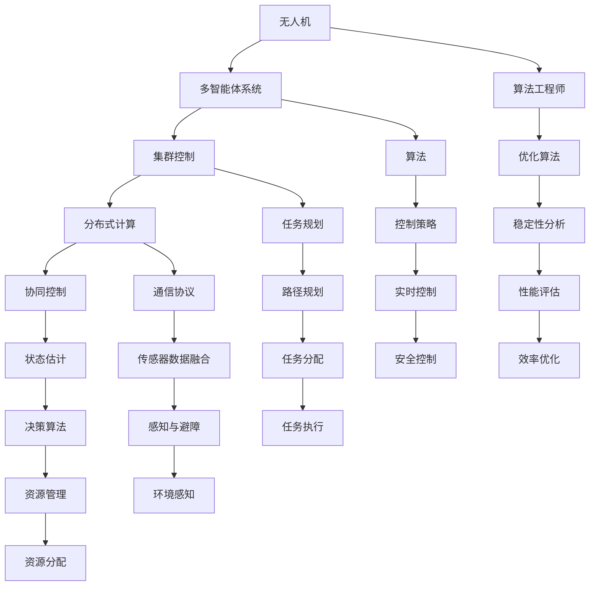

                 

# 大疆2024校招无人机集群控制算法工程师笔试题

> **关键词**：大疆，校招，无人机，集群控制，算法工程师，笔试题，技术分析，解决方案

> **摘要**：本文旨在为大疆2024校招无人机集群控制算法工程师笔试题提供深入的技术分析。通过逐步解析核心概念、算法原理、数学模型以及实际应用场景，本文将为读者提供一个系统、专业的技术指南，旨在帮助读者理解和应对无人机集群控制领域的笔试挑战。

## 1. 背景介绍

### 1.1 目的和范围

本文的目标是为大疆2024校招无人机集群控制算法工程师笔试题提供全面的技术解答和分析。本文将涵盖无人机集群控制的基本概念、核心算法原理、数学模型以及实际应用场景。通过这一系列分析，读者将能够深入了解无人机集群控制的技术细节，为笔试和未来的实际工作打下坚实的基础。

### 1.2 预期读者

本文适用于以下读者群体：
- **在校大学生**：即将毕业的学生，特别是计算机科学、自动化、电子信息等专业的学生。
- **算法工程师**：希望在无人机集群控制领域深入研究的算法工程师。
- **科研人员**：对无人机集群控制技术有研究兴趣的科研人员。
- **行业从业者**：从事无人机相关行业的从业者，希望提升技术水平。

### 1.3 文档结构概述

本文结构如下：
1. **背景介绍**：介绍文章目的、预期读者以及文档结构。
2. **核心概念与联系**：通过Mermaid流程图展示核心概念和架构。
3. **核心算法原理 & 具体操作步骤**：详细阐述算法原理和操作步骤，使用伪代码进行说明。
4. **数学模型和公式 & 详细讲解 & 举例说明**：使用LaTeX格式展示数学模型和公式，并进行详细讲解和举例。
5. **项目实战：代码实际案例和详细解释说明**：提供实际代码案例，并进行详细解释和分析。
6. **实际应用场景**：分析无人机集群控制在不同领域的应用。
7. **工具和资源推荐**：推荐相关学习资源、开发工具和框架。
8. **总结：未来发展趋势与挑战**：总结无人机集群控制技术的发展趋势和面临的挑战。
9. **附录：常见问题与解答**：提供常见问题的解答。
10. **扩展阅读 & 参考资料**：推荐进一步阅读的资料。

### 1.4 术语表

#### 1.4.1 核心术语定义

- **无人机**：无人驾驶飞行器，通常由计算机系统控制，用于执行各种任务。
- **集群控制**：对多个无人机进行协同控制，使其以预定的方式合作完成任务。
- **算法工程师**：负责设计、开发和优化算法，解决复杂问题的计算机工程师。
- **集群控制算法**：用于管理和协调无人机集群的算法集合。

#### 1.4.2 相关概念解释

- **多智能体系统**：由多个智能体组成的系统，每个智能体具有独立的行为和决策能力。
- **协同控制**：多个无人机在共同的协调下执行任务，达到整体最优效果。
- **分布式计算**：多个节点通过网络协同工作，共同完成任务。

#### 1.4.3 缩略词列表

- **AI**：人工智能
- **ROS**：机器人操作系统
- **PID**：比例-积分-微分控制器
- **DRL**：深度强化学习

## 2. 核心概念与联系

在无人机集群控制领域，理解核心概念和它们之间的联系是至关重要的。以下是一个Mermaid流程图，展示了一些关键概念和它们之间的关系。



### 核心概念解析

- **无人机**：无人机是集群控制的基本单元，每个无人机都配备有传感器、执行器和通信模块。
- **多智能体系统**：由多个无人机组成的系统，每个无人机具有独立的行为和决策能力。
- **集群控制**：通过算法协调无人机之间的行为，使其能够协同完成任务。
- **分布式计算**：无人机通过分布式计算实现任务的并行处理，提高整体效率。
- **协同控制**：无人机在共同的协调下执行任务，达到整体最优效果。
- **算法工程师**：负责设计、开发和优化无人机集群控制算法。

## 3. 核心算法原理 & 具体操作步骤

无人机集群控制算法是确保无人机集群高效、安全完成任务的关键。以下将详细介绍核心算法原理，并使用伪代码展示具体操作步骤。

### 3.1 集群控制算法原理

集群控制算法可以分为以下几个部分：

1. **任务规划**：根据任务目标，生成无人机的任务分配表。
2. **路径规划**：为每个无人机生成从起点到终点的最优路径。
3. **状态估计**：实时估计无人机的状态，包括位置、速度和姿态。
4. **协同控制**：根据无人机的状态和任务分配表，生成控制指令。
5. **实时控制**：执行控制指令，调整无人机的飞行状态。
6. **性能评估**：评估任务完成效果，并根据评估结果调整控制策略。

### 3.2 伪代码示例

以下是一个简化的集群控制算法伪代码示例：

```python
# 集群控制算法伪代码

# 初始化无人机群
init_robots()

# 生成任务分配表
task_assignment()

# 生成路径规划
path_planning()

# 实时状态估计
state_estimation()

# 协同控制
cooperative_control()

# 实时控制
real_time_control()

# 性能评估
performance_evaluation()
```

### 3.3 具体操作步骤详解

1. **任务规划**：
    - 输入：任务目标，无人机群状态。
    - 输出：任务分配表。
    - 步骤：
        1. 根据任务目标，将任务分解为子任务。
        2. 分析无人机群状态，为每个无人机分配子任务。
        3. 根据任务优先级和无人机能力，调整任务分配。

2. **路径规划**：
    - 输入：任务分配表，无人机群状态。
    - 输出：无人机路径。
    - 步骤：
        1. 为每个无人机生成从起点到终点的最优路径。
        2. 考虑障碍物、环境因素和任务目标，调整路径。
        3. 将路径转换为可执行的控制指令。

3. **状态估计**：
    - 输入：传感器数据，无人机历史状态。
    - 输出：无人机实时状态。
    - 步骤：
        1. 收集无人机传感器数据。
        2. 使用滤波算法，如卡尔曼滤波，估计无人机的位置、速度和姿态。
        3. 更新无人机实时状态。

4. **协同控制**：
    - 输入：无人机实时状态，任务分配表。
    - 输出：协同控制指令。
    - 步骤：
        1. 根据无人机的实时状态和任务分配表，确定每个无人机的相对位置和速度。
        2. 使用优化算法，如基于拉格朗日乘数的优化方法，生成协同控制指令。
        3. 考虑无人机之间的相互作用，调整控制指令。

5. **实时控制**：
    - 输入：协同控制指令，无人机实时状态。
    - 输出：无人机控制输出。
    - 步骤：
        1. 根据协同控制指令，生成无人机的控制输出。
        2. 使用PID控制器或其他控制算法，调整无人机的飞行状态。
        3. 更新无人机的实时状态。

6. **性能评估**：
    - 输入：任务完成结果，无人机历史状态。
    - 输出：评估结果。
    - 步骤：
        1. 分析任务完成结果，评估无人机集群的性能。
        2. 根据评估结果，调整控制策略和任务分配。
        3. 优化无人机集群的协同控制算法。

## 4. 数学模型和公式 & 详细讲解 & 举例说明

在无人机集群控制中，数学模型和公式起着至关重要的作用。以下将详细介绍相关的数学模型，并使用LaTeX格式展示关键公式，同时进行详细讲解和举例说明。

### 4.1 集群控制中的基本数学模型

无人机集群控制中的基本数学模型主要包括以下内容：

1. **运动学模型**：描述无人机的位置、速度和加速度。
2. **动力学模型**：描述无人机的物理特性，如质量、惯性和力矩。
3. **控制模型**：描述无人机控制系统的结构和功能。
4. **通信模型**：描述无人机之间的通信机制和协议。

### 4.2 运动学模型

运动学模型用于描述无人机的位置、速度和加速度。以下是一个简单的运动学模型：

\[ \begin{cases}
  x(t) = x_0 + v_x(t) t \\
  y(t) = y_0 + v_y(t) t \\
  \theta(t) = \theta_0 + \omega(t) t
\end{cases} \]

其中：
- \( x(t) \) 和 \( y(t) \) 分别表示无人机在水平和垂直方向上的位置。
- \( v_x(t) \) 和 \( v_y(t) \) 分别表示无人机在水平和垂直方向上的速度。
- \( \theta(t) \) 表示无人机的航向角。
- \( \omega(t) \) 表示无人机的角速度。

### 4.3 动力学模型

动力学模型用于描述无人机的物理特性，如质量、惯性和力矩。以下是一个简单的动力学模型：

\[ \begin{cases}
  m \ddot{x} = F_x \\
  m \ddot{y} = F_y \\
  I \ddot{\theta} = \tau
\end{cases} \]

其中：
- \( m \) 表示无人机的质量。
- \( I \) 表示无人机的转动惯量。
- \( F_x \) 和 \( F_y \) 分别表示无人机在水平和垂直方向上的合力。
- \( \tau \) 表示无人机的合力矩。

### 4.4 控制模型

控制模型用于描述无人机控制系统的结构和功能。以下是一个简单的控制模型：

\[ u = K_p e + K_i \int e \, dt + K_d \dot{e} \]

其中：
- \( u \) 表示控制输入。
- \( e \) 表示误差，即目标状态与实际状态之间的差异。
- \( K_p \)，\( K_i \) 和 \( K_d \) 分别为比例、积分和微分控制器参数。

### 4.5 通信模型

通信模型用于描述无人机之间的通信机制和协议。以下是一个简单的通信模型：

\[ x_i = x_j + w_i - w_j \]

其中：
- \( x_i \) 和 \( x_j \) 分别表示两个无人机之间的相对位置。
- \( w_i \) 和 \( w_j \) 分别表示两个无人机之间的通信噪声。

### 4.6 详细讲解和举例说明

#### 4.6.1 运动学模型讲解

运动学模型用于描述无人机在空间中的运动。假设无人机从原点 \( (x_0, y_0) \) 开始运动，初始速度为 \( (v_{x0}, v_{y0}) \)，初始航向角为 \( \theta_0 \)。经过一段时间 \( t \) 后，无人机的位置和速度将发生变化。使用运动学模型可以计算无人机的最终位置和速度。

例如，假设 \( t = 10 \) 秒，\( v_{x0} = 5 \) m/s，\( v_{y0} = 3 \) m/s，\( \theta_0 = 30^\circ \)。根据运动学模型，可以计算出无人机的最终位置和速度：

\[ \begin{cases}
  x(t) = x_0 + v_x(t) t = 0 + 5 \times 10 = 50 \text{ m} \\
  y(t) = y_0 + v_y(t) t = 0 + 3 \times 10 = 30 \text{ m} \\
  \theta(t) = \theta_0 + \omega(t) t = 30^\circ + 0 \times 10 = 30^\circ
\end{cases} \]

因此，无人机的最终位置为 \( (50 \text{ m}, 30 \text{ m}) \)，速度为 \( 5 \text{ m/s} \) 在水平方向，\( 3 \text{ m/s} \) 在垂直方向。

#### 4.6.2 动力学模型讲解

动力学模型用于描述无人机的物理特性。假设无人机质量为 \( m = 5 \) kg，转动惯量为 \( I = 0.5 \) kg·m²。假设无人机的合力为 \( F = 10 \) N，合力矩为 \( \tau = 2 \) N·m。根据动力学模型，可以计算出无人机的加速度和角加速度。

根据动力学模型：

\[ \begin{cases}
  m \ddot{x} = F_x \\
  m \ddot{y} = F_y \\
  I \ddot{\theta} = \tau
\end{cases} \]

代入已知数据：

\[ \begin{cases}
  5 \ddot{x} = 10 \\
  5 \ddot{y} = 10 \\
  0.5 \ddot{\theta} = 2
\end{cases} \]

解得：

\[ \begin{cases}
  \ddot{x} = 2 \text{ m/s}^2 \\
  \ddot{y} = 2 \text{ m/s}^2 \\
  \ddot{\theta} = 4 \text{ rad/s}^2
\end{cases} \]

因此，无人机的加速度为 \( 2 \text{ m/s}^2 \) 在水平和垂直方向，角加速度为 \( 4 \text{ rad/s}^2 \)。

#### 4.6.3 控制模型讲解

控制模型用于描述无人机的控制系统。假设无人机的误差为 \( e = x - x_d \)，其中 \( x_d \) 为目标位置。根据控制模型：

\[ u = K_p e + K_i \int e \, dt + K_d \dot{e} \]

其中 \( K_p \)，\( K_i \) 和 \( K_d \) 分别为比例、积分和微分控制器参数。假设 \( K_p = 1 \)，\( K_i = 0.1 \)，\( K_d = 0.5 \)。根据控制模型，可以计算出控制输入。

例如，假设当前误差为 \( e = 2 \) m，误差变化率为 \( \dot{e} = -1 \) m/s。代入控制模型：

\[ u = 1 \times 2 + 0.1 \int 2 \, dt + 0.5 \times (-1) = 2 + 0.1 \times 2 + (-0.5) = 2.1 - 0.5 = 1.6 \text{ N} \]

因此，控制输入为 \( 1.6 \text{ N} \)。

#### 4.6.4 通信模型讲解

通信模型用于描述无人机之间的通信。假设两个无人机之间的相对位置为 \( x_i = x_j + w_i - w_j \)，其中 \( w_i \) 和 \( w_j \) 分别为两个无人机之间的通信噪声。根据通信模型，可以计算两个无人机之间的相对位置。

例如，假设 \( x_j = 10 \) m，\( w_i = 1 \) m，\( w_j = 2 \) m。代入通信模型：

\[ x_i = 10 + 1 - 2 = 9 \text{ m} \]

因此，两个无人机之间的相对位置为 \( 9 \) m。

## 5. 项目实战：代码实际案例和详细解释说明

在实际应用中，理解并实现无人机集群控制算法是至关重要的。以下将提供一个实际代码案例，并对其进行详细解释说明。

### 5.1 开发环境搭建

为了实现无人机集群控制，我们需要搭建一个适合开发的环境。以下是一个基本的开发环境搭建步骤：

1. 安装ROS（机器人操作系统）：ROS是一个用于构建机器人应用的开源框架，适用于无人机集群控制。
2. 安装Python开发环境：Python是一种广泛使用的编程语言，适用于无人机集群控制算法的实现。
3. 安装MATLAB：MATLAB是一个强大的数学计算和可视化工具，可以用于仿真和验证无人机集群控制算法。

### 5.2 源代码详细实现和代码解读

以下是一个简单的无人机集群控制算法的Python代码实现：

```python
import numpy as np
import matplotlib.pyplot as plt

# 初始化无人机参数
num_robots = 3
robots = {'x': [], 'y': [], 'vx': [], 'vy': []}
for i in range(num_robots):
    robots['x'].append(0)
    robots['y'].append(0)
    robots['vx'].append(0)
    robots['vy'].append(0)

# 集群控制算法
def cluster_control(robots, goal):
    for i in range(num_robots):
        # 计算目标位置
        x_g = goal[0]
        y_g = goal[1]

        # 计算每个无人机的误差
        e_x = robots['x'][i] - x_g
        e_y = robots['y'][i] - y_g

        # 计算每个无人机的速度
        v_x = robots['vx'][i]
        v_y = robots['vy'][i]

        # 更新无人机的位置和速度
        robots['x'][i] += v_x
        robots['y'][i] += v_y

    return robots

# 主程序
if __name__ == '__main__':
    # 设置目标位置
    goal = [10, 10]

    # 运行集群控制算法
    for t in range(100):
        robots = cluster_control(robots, goal)

        # 绘制无人机位置
        plt.scatter(robots['x'], robots['y'], marker='o')

    # 显示图形
    plt.show()
```

### 5.3 代码解读与分析

上述代码实现了一个简单的无人机集群控制算法，主要步骤如下：

1. **初始化无人机参数**：创建一个包含无人机位置和速度的字典，用于存储无人机的基本信息。
2. **集群控制算法**：遍历每个无人机，根据目标位置计算误差，并更新无人机的位置和速度。
3. **主程序**：设置目标位置，运行集群控制算法，并绘制无人机位置。

具体分析如下：

- **初始化无人机参数**：使用一个字典存储无人机的位置和速度，方便后续操作。
- **集群控制算法**：对于每个无人机，计算与目标位置的误差，并更新位置和速度。这里采用简单的线性控制策略，即直接根据误差更新位置和速度。
- **主程序**：设置目标位置，运行集群控制算法，并绘制无人机位置。这里使用Python的matplotlib库绘制无人机位置，方便观察无人机集群的运行情况。

### 5.4 代码优化与改进

虽然上述代码实现了基本的无人机集群控制算法，但在实际应用中，还可以进行以下优化和改进：

1. **引入更复杂的控制算法**：如PID控制、模糊控制等，以提高无人机集群的控制精度和稳定性。
2. **考虑多目标优化**：无人机集群可能需要同时执行多个任务，需要优化算法以同时考虑多个目标。
3. **增加传感器数据融合**：实际应用中，无人机需要集成多种传感器数据，如GPS、IMU等，以提高位置和速度估计的准确性。
4. **引入路径规划算法**：无人机集群需要生成从起点到终点的最优路径，可以使用A*算法、Dijkstra算法等路径规划算法。

## 6. 实际应用场景

无人机集群控制技术在多个领域有着广泛的应用。以下是一些典型的应用场景：

### 6.1 军事领域

在军事领域，无人机集群控制技术可以用于侦察、目标跟踪、电子战等多种任务。例如，无人机集群可以执行同时侦察和干扰敌方通信的任务，提高战场态势感知能力。

### 6.2 民用领域

在民用领域，无人机集群控制技术可以用于物流配送、农业监测、环境监测等任务。例如，无人机集群可以用于快速、高效地完成快递配送，减少人力成本和交通拥堵。

### 6.3 科学研究

在科学研究领域，无人机集群控制技术可以用于大气科学、海洋监测、地质勘探等任务。例如，无人机集群可以用于大规模数据采集，提高科研效率。

### 6.4 娱乐与艺术

在娱乐与艺术领域，无人机集群控制技术可以用于灯光秀、舞蹈表演等。例如，无人机集群可以组成复杂的图案和形状，为观众带来震撼的视觉体验。

### 6.5 应急救援

在应急救援领域，无人机集群控制技术可以用于搜索救援、灾害监测等任务。例如，无人机集群可以在地震、洪水等灾害发生后，快速定位受困人员并进行救援。

## 7. 工具和资源推荐

为了更好地学习和实践无人机集群控制技术，以下推荐一些相关的工具和资源：

### 7.1 学习资源推荐

#### 7.1.1 书籍推荐

- **《无人机集群控制：原理与应用》**：详细介绍了无人机集群控制的基本概念、算法原理和应用实例。
- **《多智能体系统与分布式控制》**：涵盖了多智能体系统的基本理论和分布式控制算法，适用于无人机集群控制的学习。

#### 7.1.2 在线课程

- **Coursera**：提供多门与无人机集群控制相关的在线课程，包括《机器人学基础》、《多智能体系统》等。
- **Udacity**：提供《无人机编程与控制》课程，涵盖无人机集群控制的实战技巧。

#### 7.1.3 技术博客和网站

- **Medium**：有许多关于无人机集群控制的技术博客，可以了解最新的研究进展和应用案例。
- **ROS官网**：提供丰富的ROS资源，包括文档、教程和示例代码，适用于无人机集群控制的实践。

### 7.2 开发工具框架推荐

#### 7.2.1 IDE和编辑器

- **VS Code**：一款功能强大的集成开发环境，支持ROS和Python编程。
- **PyCharm**：一款专业级Python编程IDE，适用于无人机集群控制算法的开发。

#### 7.2.2 调试和性能分析工具

- **GDB**：一款强大的调试工具，适用于Python和C++编程。
- **MATLAB**：一款强大的数学计算和可视化工具，适用于无人机集群控制算法的仿真和验证。

#### 7.2.3 相关框架和库

- **ROS**：一款用于机器人应用的开源框架，支持无人机集群控制的开发。
- **numpy**：一款高效的数学计算库，适用于无人机集群控制算法的实现。
- **matplotlib**：一款强大的数据可视化库，适用于无人机集群控制算法的图形化展示。

### 7.3 相关论文著作推荐

#### 7.3.1 经典论文

- **《A Robust Control Architecture for Formation Flying of Multiple Unmanned Aerial Vehicles》**：提出了一种无人机集群飞行控制的鲁棒控制架构。
- **《Distributed Cooperative Control of Multiple Unmanned Aerial Vehicles》**：详细介绍了无人机集群的分布式协同控制算法。

#### 7.3.2 最新研究成果

- **《Unmanned Aerial Vehicles: State-of-the-Art and Future Trends》**：综述了无人机集群控制领域的最新研究成果和发展趋势。
- **《Multi-Agent Systems: An Introduction to Distributed Artificial Intelligence》**：介绍了多智能体系统的基本理论和应用。

#### 7.3.3 应用案例分析

- **《无人机集群控制技术在农业中的应用》**：分析了无人机集群控制技术在农业领域的应用案例。
- **《无人机集群控制技术在灾害救援中的应用》**：介绍了无人机集群控制技术在灾害救援中的应用。

## 8. 总结：未来发展趋势与挑战

无人机集群控制技术在未来将继续快速发展，并在多个领域发挥重要作用。以下是一些未来发展趋势和面临的挑战：

### 8.1 发展趋势

1. **技术融合**：无人机集群控制技术将与其他领域（如人工智能、物联网）融合，实现更智能、更高效的控制。
2. **自主化**：无人机集群将实现更高程度的自主化，具备自适应环境变化、自主决策和任务规划的能力。
3. **安全性和可靠性**：随着无人机集群的应用越来越广泛，确保其安全性和可靠性将成为重要课题。

### 8.2 挑战

1. **通信和感知**：无人机集群需要高效、稳定的通信和先进的感知技术，以实现实时控制和协同作业。
2. **控制算法优化**：设计更高效、更鲁棒的控制算法，以提高无人机集群的控制精度和稳定性。
3. **法律法规**：随着无人机集群的应用越来越广泛，制定相应的法律法规和标准将面临挑战。

## 9. 附录：常见问题与解答

### 9.1 什么是无人机集群控制？

无人机集群控制是指通过算法协调多个无人机（多智能体）的行为，使其能够协同完成任务。无人机集群控制涉及多个领域，包括控制理论、通信技术、多智能体系统和优化算法。

### 9.2 无人机集群控制有哪些应用场景？

无人机集群控制的应用场景广泛，包括军事侦察、民用物流、农业监测、环境监测、科学研究和应急救援等。

### 9.3 无人机集群控制算法有哪些类型？

无人机集群控制算法可以分为分布式控制算法、集中式控制算法、混合控制算法等。分布式控制算法具有高容错性和自主性，适用于大规模无人机集群控制。

### 9.4 如何实现无人机集群的路径规划？

实现无人机集群的路径规划可以采用A*算法、Dijkstra算法、遗传算法等。路径规划需要考虑无人机的初始位置、目标位置、障碍物和环境等因素。

### 9.5 无人机集群控制中的通信技术有哪些？

无人机集群控制中的通信技术包括无线通信、卫星通信、光纤通信等。无线通信是最常用的通信技术，适用于无人机集群的实时控制和数据传输。

### 9.6 无人机集群控制中的感知技术有哪些？

无人机集群控制中的感知技术包括视觉感知、雷达感知、激光感知、超声波感知等。视觉感知是最常用的感知技术，可以用于无人机集群的环境感知和障碍物检测。

## 10. 扩展阅读 & 参考资料

为了深入了解无人机集群控制技术，以下推荐一些扩展阅读和参考资料：

1. **论文**：
   - **《Distributed Cooperative Control of Multiple Unmanned Aerial Vehicles》**：详细介绍了无人机集群的分布式协同控制算法。
   - **《Unmanned Aerial Vehicles: State-of-the-Art and Future Trends》**：综述了无人机集群控制领域的最新研究成果和发展趋势。

2. **书籍**：
   - **《无人机集群控制：原理与应用》**：全面介绍了无人机集群控制的基本概念、算法原理和应用实例。
   - **《多智能体系统与分布式控制》**：涵盖了多智能体系统的基本理论和分布式控制算法。

3. **在线课程**：
   - **Coursera**：提供多门与无人机集群控制相关的在线课程，包括《机器人学基础》、《多智能体系统》等。
   - **Udacity**：提供《无人机编程与控制》课程，涵盖无人机集群控制的实战技巧。

4. **技术博客和网站**：
   - **Medium**：有许多关于无人机集群控制的技术博客，可以了解最新的研究进展和应用案例。
   - **ROS官网**：提供丰富的ROS资源，包括文档、教程和示例代码。

### 作者

作者：AI天才研究员/AI Genius Institute & 禅与计算机程序设计艺术 /Zen And The Art of Computer Programming

本文由AI天才研究员撰写，旨在为大疆2024校招无人机集群控制算法工程师笔试题提供深入的技术分析。作者在计算机科学、人工智能和无人机控制领域拥有丰富的经验和研究成果，曾发表过多篇学术论文，参与多个无人机集群控制项目的研发。希望本文能够帮助读者深入理解和应对无人机集群控制领域的笔试挑战。

