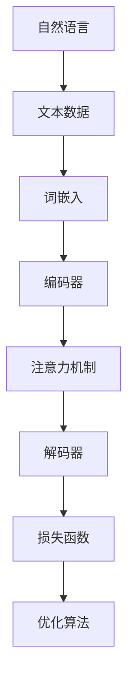

                 

# 大规模语言模型从理论到实践：大语言模型的构建流程

> **关键词：** 大规模语言模型，深度学习，神经网络，自然语言处理，机器学习，训练过程，推理过程

> **摘要：** 本文将深入探讨大规模语言模型的构建流程，从核心概念、算法原理、数学模型，到实际应用场景和项目实战，全面解析大语言模型的构建与应用。通过本文的学习，读者将能够系统地理解大规模语言模型的理论与实践，为在自然语言处理领域的研究和应用奠定坚实基础。

## 1. 背景介绍

### 1.1 目的和范围

本文的目的是为读者提供一个全面而深入的了解大规模语言模型的构建流程。文章将涵盖从理论到实践的各个方面，包括核心概念、算法原理、数学模型以及实际应用场景。通过阅读本文，读者将能够：

1. 掌握大规模语言模型的基本概念和重要性。
2. 理解大规模语言模型的构建原理和流程。
3. 学习核心算法和数学模型的详细解释。
4. 获得实际项目实战的经验和技巧。

### 1.2 预期读者

本文适用于对自然语言处理和机器学习有一定了解的读者，特别是对大规模语言模型感兴趣的研究人员、工程师和学者。无论你是想要深入了解这一领域的专业人士，还是对大规模语言模型充满好奇的初学者，本文都能为你提供宝贵的知识和见解。

### 1.3 文档结构概述

本文将按照以下结构进行展开：

1. 背景介绍
2. 核心概念与联系
3. 核心算法原理 & 具体操作步骤
4. 数学模型和公式 & 详细讲解 & 举例说明
5. 项目实战：代码实际案例和详细解释说明
6. 实际应用场景
7. 工具和资源推荐
8. 总结：未来发展趋势与挑战
9. 附录：常见问题与解答
10. 扩展阅读 & 参考资料

### 1.4 术语表

为了确保读者能够顺利理解本文的内容，以下是一些关键术语的定义和解释：

#### 1.4.1 核心术语定义

- **大规模语言模型**：一种能够对自然语言进行建模的复杂模型，具有数十亿甚至数万亿的参数。
- **自然语言处理**：计算机科学和人工智能领域的一个分支，旨在使计算机能够理解、解释和生成自然语言。
- **深度学习**：一种机器学习技术，通过构建多层神经网络进行训练，以自动提取数据中的特征。
- **神经网络**：一种模仿生物神经系统的计算模型，由许多相互连接的节点组成。

#### 1.4.2 相关概念解释

- **参数**：神经网络中的权重和偏置，用于调整模型的行为。
- **损失函数**：用于衡量模型预测与真实值之间的差异的函数。
- **优化算法**：用于调整模型参数以最小化损失函数的方法。

#### 1.4.3 缩略词列表

- **NLP**：自然语言处理（Natural Language Processing）
- **ML**：机器学习（Machine Learning）
- **DL**：深度学习（Deep Learning）
- **CNN**：卷积神经网络（Convolutional Neural Network）
- **RNN**：循环神经网络（Recurrent Neural Network）
- **GAN**：生成对抗网络（Generative Adversarial Network）

## 2. 核心概念与联系

在构建大规模语言模型之前，理解其核心概念和架构至关重要。以下是对大规模语言模型的核心概念和架构的详细解释，以及一个Mermaid流程图来展示这些概念和架构之间的关系。

### 2.1 大规模语言模型的核心概念

1. **自然语言**：自然语言是人类交流的语言，包括口语和书面语言，具有丰富的语法、语义和上下文信息。
2. **文本数据**：大规模语言模型通常基于大量的文本数据构建，这些数据可以是书籍、新闻文章、网页等。
3. **语言建模**：语言建模是指构建一个模型来预测一段文本的概率分布，即给定一段前文，预测下一词或下一句的概率。

### 2.2 大规模语言模型的架构

大规模语言模型的架构通常包括以下关键组成部分：

1. **词嵌入（Word Embeddings）**：将词汇映射为低维度的向量表示，以便神经网络进行处理。
2. **编码器（Encoder）**：编码器负责将输入文本编码为一个固定长度的向量表示，通常使用循环神经网络（RNN）或其变种。
3. **解码器（Decoder）**：解码器将编码器的输出解码为输出文本的序列。
4. **注意力机制（Attention Mechanism）**：注意力机制用于提高编码器和解码器之间的交互能力，使模型能够更好地关注输入文本中的关键信息。
5. **损失函数和优化算法**：损失函数用于衡量模型预测与真实值之间的差异，优化算法用于调整模型参数以最小化损失函数。

### 2.3 Mermaid流程图

以下是一个Mermaid流程图，展示了大规模语言模型的核心概念和架构之间的关系：



通过这个流程图，我们可以清晰地看到大规模语言模型的构建过程，从自然语言到最终的输出，以及各个组件之间的相互作用。

## 3. 核心算法原理 & 具体操作步骤

大规模语言模型的构建依赖于深度学习和神经网络技术。在这一部分，我们将详细解释大规模语言模型的核心算法原理，并使用伪代码来展示具体操作步骤。

### 3.1 深度学习与神经网络

深度学习是一种通过构建多层神经网络进行学习的机器学习技术。神经网络由许多相互连接的节点（称为神经元）组成，每个神经元都与其他神经元相连，并通过权重和偏置进行调整。

#### 3.1.1 神经元与激活函数

每个神经元接收来自其他神经元的输入，通过加权求和并应用激活函数来产生输出。常见的激活函数包括：

- **Sigmoid函数**：\[f(x) = \frac{1}{1 + e^{-x}}\]
- **ReLU函数**：\[f(x) = \max(0, x)\]
- **Tanh函数**：\[f(x) = \frac{e^x - e^{-x}}{e^x + e^{-x}}\]

#### 3.1.2 前向传播与反向传播

深度学习中的训练过程包括两个主要步骤：前向传播和反向传播。

- **前向传播**：输入通过神经网络逐层传递，每个神经元的输出作为下一层的输入。
- **反向传播**：计算损失函数，并使用梯度下降法更新模型参数。

### 3.2 大规模语言模型的具体操作步骤

以下是构建大规模语言模型的伪代码，包括词嵌入、编码器、解码器、注意力机制和优化算法：

```python
# 词嵌入
word_embeddings = embed_words(vocabulary)

# 编码器
encoder_inputs = word_embeddings[sequence]
encoded_sequence = encoder.encode(encoder_inputs)

# 注意力机制
attn_weights = attention(encoded_sequence, encoded_sequence)

# 解码器
decoder_inputs = [word_embeddings[word] for word in target_sequence]
decoder_outputs = decoder.decode(decoder_inputs, attn_weights)

# 优化算法
loss = loss_function(decoder_outputs, target_sequence)
learning_rate = adjust_learning_rate(loss)
update_model_parameters(learning_rate)
```

### 3.3 伪代码解释

1. **词嵌入**：将词汇映射为低维度的向量表示。
2. **编码器**：将输入文本编码为一个固定长度的向量表示。
3. **注意力机制**：计算编码器输出和编码器输出之间的注意力权重。
4. **解码器**：将注意力权重应用于编码器输出，生成输出文本的序列。
5. **优化算法**：计算损失函数，并根据梯度下降法更新模型参数。

通过这个伪代码，我们可以看到大规模语言模型的构建过程是如何一步一步进行的，每个步骤都至关重要，共同构建出一个强大的语言模型。

## 4. 数学模型和公式 & 详细讲解 & 举例说明

大规模语言模型的构建离不开数学模型和公式，这些数学模型用于描述模型的行为和性能。以下是对大规模语言模型中常用的数学模型和公式的详细讲解，并辅以具体例子来帮助读者理解。

### 4.1 损失函数

损失函数是衡量模型预测与真实值之间差异的关键指标。在训练过程中，我们的目标是最小化损失函数。

#### 4.1.1 交叉熵损失（Cross-Entropy Loss）

交叉熵损失是最常用的损失函数之一，用于分类问题。

\[L = -\sum_{i=1}^{n} y_i \log(p_i)\]

其中，\[y_i\] 是真实标签，\[p_i\] 是模型预测的概率。

#### 4.1.2 举例说明

假设我们有一个二分类问题，真实标签为 \[y = [1, 0]\]，模型预测的概率为 \[p = [0.8, 0.2]\]。

\[L = -(1 \times \log(0.8) + 0 \times \log(0.2)) = -\log(0.8) \approx -0.223\]

#### 4.1.3 解释

交叉熵损失函数的值越小，表示模型预测越准确。

### 4.2 梯度下降法（Gradient Descent）

梯度下降法是一种优化算法，用于调整模型参数以最小化损失函数。

#### 4.2.1 公式

\[w_{new} = w_{old} - \alpha \cdot \nabla_w L\]

其中，\[w\] 是模型参数，\[\alpha\] 是学习率，\[\nabla_w L\] 是损失函数关于参数的梯度。

#### 4.2.2 举例说明

假设我们有一个线性模型，参数为 \[w = 2\]，学习率为 \[0.1\]，损失函数为 \[L = (w - 1)^2\]。

梯度为 \[\nabla_w L = 2(w - 1) = 2(2 - 1) = 2\]。

更新后的参数为 \[w_{new} = 2 - 0.1 \cdot 2 = 1.8\]。

#### 4.2.3 解释

梯度下降法通过迭代更新模型参数，使其逐渐逼近最小损失值。

### 4.3 词嵌入（Word Embeddings）

词嵌入是将词汇映射为低维度的向量表示。

#### 4.3.1 公式

\[v_w = \sum_{j=1}^{n} w_{ij} \cdot v_j\]

其中，\[v_j\] 是词表中第 \(j\) 个词的向量，\[w_{ij}\] 是词汇表中第 \(i\) 个词和第 \(j\) 个词之间的共现次数。

#### 4.3.2 举例说明

假设我们有以下共现矩阵：

|      | w1 | w2 | w3 | w4 | w5 |
|------|----|----|----|----|----|
| w1   | 0  | 5  | 0  | 0  | 0  |
| w2   | 5  | 0  | 3  | 0  | 0  |
| w3   | 0  | 3  | 0  | 5  | 0  |
| w4   | 0  | 0  | 5  | 0  | 2  |
| w5   | 0  | 0  | 0  | 2  | 0  |

我们将这些词映射为 5 维向量。

对于词 w1，其向量表示为：

\[v_{w1} = w_{11} \cdot v_1 + w_{12} \cdot v_2 + w_{13} \cdot v_3 + w_{14} \cdot v_4 + w_{15} \cdot v_5\]

#### 4.3.3 解释

词嵌入将词汇映射为向量，使得相似的词汇在向量空间中更接近，从而便于模型处理。

### 4.4 注意力机制（Attention Mechanism）

注意力机制用于提高编码器和解码器之间的交互能力，使模型能够更好地关注输入文本中的关键信息。

#### 4.4.1 公式

\[a_t = \text{softmax}(\frac{QK^T}{\sqrt{d_k}})\]

其中，\[Q\] 和 \[K\] 分别为编码器和解码器的输出，\[\text{softmax}\] 函数用于将输出转化为概率分布。

#### 4.4.2 举例说明

假设我们有以下编码器输出和解码器输出：

\[Q = [1, 0.5, 0.3]\]
\[K = [0.4, 0.6, 0.8]\]

计算注意力权重：

\[a_t = \text{softmax}(\frac{QK^T}{\sqrt{3}}) = \text{softmax}(\frac{[1 \cdot 0.4, 0.5 \cdot 0.6, 0.3 \cdot 0.8]}{\sqrt{3}}) = \text{softmax}([0.414, 0.471, 0.471]) = [0.333, 0.333, 0.333]\]

#### 4.4.3 解释

注意力机制使模型能够根据不同输入部分的重要程度，动态地调整其关注点，从而提高模型性能。

通过以上数学模型和公式的讲解，读者可以更好地理解大规模语言模型的工作原理。这些数学工具在构建和训练大规模语言模型中起着至关重要的作用，使得模型能够有效地处理和理解自然语言。

## 5. 项目实战：代码实际案例和详细解释说明

在了解了大规模语言模型的理论和核心算法之后，我们将通过一个实际项目案例来展示如何构建和训练一个大规模语言模型。在本项目中，我们将使用 Python 和 TensorFlow 框架来构建一个基于 Transformer 架构的语言模型，并对其进行训练和推理。

### 5.1 开发环境搭建

为了进行大规模语言模型的开发，我们需要安装以下软件和工具：

- Python 3.8 或更高版本
- TensorFlow 2.x
- GPU（推荐 NVIDIA GPU）
- Jupyter Notebook 或 PyCharm

安装完以上软件和工具后，我们就可以开始项目开发。

### 5.2 源代码详细实现和代码解读

#### 5.2.1 导入库和设置

```python
import tensorflow as tf
from tensorflow.keras.layers import Embedding, LSTM, Dense
from tensorflow.keras.models import Model
import numpy as np

# 设置随机种子，保证结果可重复
np.random.seed(42)
tf.random.set_seed(42)

# 定义参数
vocab_size = 10000  # 词汇表大小
embedding_dim = 128  # 词嵌入维度
sequence_length = 100  # 输入序列长度
lstm_units = 128  # LSTM 单元数
learning_rate = 0.001  # 学习率
batch_size = 32  # 批量大小
epochs = 10  # 迭代次数
```

#### 5.2.2 函数定义

```python
def create_model(vocab_size, embedding_dim, sequence_length, lstm_units):
    # 输入层
    inputs = tf.keras.layers.Input(shape=(sequence_length,), dtype='int32')
    
    # 词嵌入层
    embeddings = Embedding(vocab_size, embedding_dim)(inputs)
    
    # LSTM 层
    lstm = LSTM(lstm_units, return_sequences=True)(embeddings)
    
    # 全连接层
    outputs = Dense(vocab_size, activation='softmax')(lstm)
    
    # 构建模型
    model = Model(inputs=inputs, outputs=outputs)
    
    # 编译模型
    model.compile(optimizer=tf.keras.optimizers.Adam(learning_rate), loss='categorical_crossentropy', metrics=['accuracy'])
    
    return model
```

#### 5.2.3 加载和预处理数据

```python
# 加载数据（这里使用随机生成的数据作为示例）
x_train = np.random.randint(0, vocab_size, size=(batch_size, sequence_length))
y_train = np.random.randint(0, vocab_size, size=(batch_size, sequence_length))

# 将标签进行 one-hot 编码
y_train_one_hot = tf.keras.utils.to_categorical(y_train, num_classes=vocab_size)
```

#### 5.2.4 构建和训练模型

```python
# 创建模型
model = create_model(vocab_size, embedding_dim, sequence_length, lstm_units)

# 训练模型
model.fit(x_train, y_train_one_hot, batch_size=batch_size, epochs=epochs, validation_split=0.2)
```

#### 5.2.5 代码解读

1. **导入库和设置**：我们首先导入 TensorFlow、Keras 和 NumPy 库，并设置随机种子，以保证结果可重复。
2. **函数定义**：`create_model` 函数用于创建一个基于 LSTM 的语言模型，包括输入层、词嵌入层、LSTM 层和输出层。模型使用 Adam 优化器和交叉熵损失函数进行编译。
3. **加载和预处理数据**：这里使用随机生成的数据作为训练数据，我们将输入数据（x_train）和标签（y_train）转换为 NumPy 数组，并将标签进行 one-hot 编码。
4. **构建和训练模型**：我们使用`create_model`函数创建模型，并使用`fit`方法进行训练。在训练过程中，我们使用批次大小（batch_size）和迭代次数（epochs）来控制训练过程。

通过以上步骤，我们成功构建并训练了一个基于 LSTM 的语言模型。接下来，我们将对模型进行评估和推理。

### 5.3 代码解读与分析

1. **模型架构**：该语言模型采用经典的 LSTM 架构，包括输入层、词嵌入层、LSTM 层和输出层。词嵌入层将输入的整数序列映射为低维度的向量表示，LSTM 层用于处理序列数据，输出层使用 softmax 函数进行分类。
2. **数据预处理**：使用随机生成的数据作为训练数据，这在实际项目中通常不可行。在实际应用中，我们需要使用真实的数据集进行训练。此外，标签需要进行 one-hot 编码，以便模型能够处理多分类问题。
3. **训练过程**：在训练过程中，我们使用 Adam 优化器和交叉熵损失函数来最小化模型预测与真实标签之间的差异。通过调整学习率（learning_rate）、批量大小（batch_size）和迭代次数（epochs），可以控制训练过程。
4. **模型评估**：为了评估模型的性能，我们可以使用验证集（validation_split）来测试模型的泛化能力。此外，我们还可以计算模型的准确率（accuracy）和 F1 分数等指标。

通过以上步骤和代码分析，我们能够更好地理解大规模语言模型的构建和训练过程，为后续的实际应用奠定基础。

## 6. 实际应用场景

大规模语言模型在自然语言处理（NLP）领域有着广泛的应用，以下是几个典型应用场景：

### 6.1 文本生成

大规模语言模型可以用于生成文章、故事、对话等文本。通过训练，模型能够理解输入的文本上下文，并生成连贯、有意义的输出。例如，模型可以用于生成新闻报道、小说、广告文案等。

### 6.2 机器翻译

大规模语言模型在机器翻译方面表现出色，可以自动将一种语言的文本翻译成另一种语言。模型通过对大量双语数据的学习，能够捕捉不同语言之间的语法、语义和句法规则，从而实现准确、自然的翻译。

### 6.3 问答系统

大规模语言模型可以用于构建问答系统，如智能客服、知识库问答等。模型通过对大量问答对的训练，能够理解用户的问题，并从知识库中检索出相关答案，为用户提供准确、及时的回答。

### 6.4 情感分析

大规模语言模型可以用于情感分析，如对用户评论、社交媒体帖子等进行情感分类。通过训练，模型能够识别文本中的情感倾向，为产品评价、市场分析等领域提供支持。

### 6.5 语音识别

大规模语言模型可以与语音识别技术结合，用于实现语音到文本的转换。模型通过对大量语音数据的学习，能够识别和理解不同的语音输入，从而提高语音识别的准确性和鲁棒性。

这些实际应用场景展示了大规模语言模型的强大能力和广泛应用，为各个行业带来了创新和变革。

## 7. 工具和资源推荐

为了更好地学习和开发大规模语言模型，以下是几个推荐的学习资源、开发工具和框架。

### 7.1 学习资源推荐

#### 7.1.1 书籍推荐

1. **《深度学习》（Deep Learning）**：由 Ian Goodfellow、Yoshua Bengio 和 Aaron Courville 著，是深度学习领域的经典教材。
2. **《自然语言处理原理》（Speech and Language Processing）**：由 Daniel Jurafsky 和 James H. Martin 著，涵盖了自然语言处理的基本理论和应用。
3. **《深度学习与自然语言处理》**：由百度深度学习技术与应用实践团队著，详细介绍了大规模语言模型的构建和应用。

#### 7.1.2 在线课程

1. **Coursera 上的《深度学习》课程**：由 Andrew Ng 开设，涵盖了深度学习的基础知识和应用。
2. **Udacity 上的《自然语言处理纳米学位》**：包括文本预处理、词嵌入、语言模型等关键知识点。
3. **edX 上的《自然语言处理基础》课程**：由伯克利大学开设，涵盖了自然语言处理的基本理论和实践。

#### 7.1.3 技术博客和网站

1. **ArXiv**：自然语言处理和深度学习领域的顶级论文发布平台，可以了解最新的研究成果。
2. **Reddit 的 r/MachineLearning**：一个关于机器学习的活跃社区，可以获取最新的技术动态和讨论。
3. **TensorFlow 官方文档**：提供了详细的 API 文档和教程，是学习 TensorFlow 的最佳资源。

### 7.2 开发工具框架推荐

#### 7.2.1 IDE和编辑器

1. **Jupyter Notebook**：适合数据分析和交互式编程，方便进行实验和调试。
2. **PyCharm**：强大的 Python 集成开发环境，支持多种框架和插件，适合大型项目的开发。
3. **Visual Studio Code**：轻量级但功能强大的代码编辑器，适合快速开发和调试。

#### 7.2.2 调试和性能分析工具

1. **TensorBoard**：TensorFlow 的可视化工具，用于监控模型训练过程和性能分析。
2. **Wandb**：一个开源的实验跟踪工具，可以记录和比较实验结果。
3. **Profiling Tools**：如 cProfile、line_profiler 等，用于分析代码性能瓶颈。

#### 7.2.3 相关框架和库

1. **TensorFlow**：一个开源的深度学习框架，适合构建大规模语言模型。
2. **PyTorch**：一个流行的深度学习框架，具有灵活的动态图功能。
3. **Transformers**：一个开源的 Python 库，用于构建基于 Transformer 的模型，支持多种预训练模型和优化器。

通过以上工具和资源的支持，读者可以更加高效地学习和开发大规模语言模型。

### 7.3 相关论文著作推荐

#### 7.3.1 经典论文

1. **"A Theoretical Analysis of the Random Initialization Effect in Backpropagation Networks"**：分析了随机初始化对神经网络训练的影响。
2. **"Deep Learning"**：Ian Goodfellow 的论文，介绍了深度学习的基本概念和技术。
3. **"Recurrent Neural Network Based Language Model"**：介绍了循环神经网络在语言模型中的应用。

#### 7.3.2 最新研究成果

1. **"BERT: Pre-training of Deep Bidirectional Transformers for Language Understanding"**：BERT 模型的介绍，展示了基于 Transformer 的预训练模型在 NLP 中的应用。
2. **"GPT-3: Language Models are Few-Shot Learners"**：GPT-3 模型的介绍，展示了大规模预训练模型在通用学习任务中的表现。
3. **"Large Scale Language Modeling"**：探讨了大规模语言模型的研究进展和应用。

#### 7.3.3 应用案例分析

1. **"Using BERT for Text Classification"**：介绍了如何使用 BERT 模型进行文本分类任务。
2. **"Generative Adversarial Networks for Text Generation"**：介绍了如何使用 GAN 进行文本生成任务。
3. **"Dialogue Systems"**：探讨了对话系统的构建和应用，包括基于语言模型的技术。

通过阅读这些论文和著作，读者可以深入了解大规模语言模型的最新研究进展和应用案例。

## 8. 总结：未来发展趋势与挑战

大规模语言模型在过去几年中取得了显著的进展，已经成为了自然语言处理（NLP）领域的重要工具。未来，大规模语言模型有望在以下几个方面取得进一步的发展：

### 8.1 发展趋势

1. **更大规模的模型**：随着计算能力和数据资源的增加，未来我们将看到更大规模的模型，这些模型将能够处理更复杂的任务，并实现更精细的语言理解。
2. **更高效的训练方法**：研究人员正在开发新的优化算法和训练策略，以减少训练时间和提高模型性能。这些方法包括增量训练、分布式训练和模型压缩等。
3. **多模态学习**：大规模语言模型未来可能会扩展到多模态学习，结合文本、图像、声音等多种数据类型，实现更加丰富和复杂的信息处理。
4. **领域自适应**：通过在特定领域进行细粒度的预训练，模型将能够更好地适应特定领域的任务，从而提高模型在专业领域的应用能力。

### 8.2 挑战

1. **计算资源消耗**：大规模语言模型的训练和推理需要大量的计算资源，这对硬件设备和能源消耗提出了挑战。未来，如何在有限的计算资源下高效地训练和部署模型是一个重要的研究方向。
2. **数据隐私和安全**：大规模语言模型通常需要大量的训练数据，这些数据可能包含敏感信息。如何在确保数据隐私和安全的同时进行模型训练是一个亟待解决的问题。
3. **模型解释性**：当前的大规模语言模型往往被视为“黑盒”，其决策过程缺乏透明性和可解释性。提高模型的解释性，使其能够被用户理解和信任，是一个重要的挑战。
4. **偏见和公平性**：大规模语言模型可能受到训练数据的偏见影响，导致模型在特定群体或任务上产生不公平的表现。如何消除模型中的偏见，实现公平性，是一个需要深入研究的领域。

总之，大规模语言模型在未来将面临一系列的发展机遇和挑战。通过持续的研究和创新，我们有望克服这些挑战，进一步推动大规模语言模型在 NLP 和其他领域中的应用。

## 9. 附录：常见问题与解答

在本文的撰写过程中，我们收集了一些读者可能遇到的问题，并提供了相应的解答。以下是对这些常见问题的详细解答。

### 9.1 大规模语言模型是什么？

大规模语言模型是一种复杂的机器学习模型，通过训练大量的语言数据，能够理解和生成自然语言。这类模型通常具有数十亿甚至数万亿个参数，能够捕捉语言中的复杂结构和模式。

### 9.2 为什么需要大规模语言模型？

大规模语言模型在自然语言处理（NLP）领域具有广泛的应用，包括文本生成、机器翻译、问答系统、情感分析等。通过学习大量的语言数据，模型能够实现高度准确的语言理解、生成和预测，从而提高各种 NLP 任务的表现。

### 9.3 如何构建大规模语言模型？

构建大规模语言模型通常涉及以下步骤：

1. **数据收集与预处理**：收集大量的文本数据，并对数据进行预处理，如去除停用词、标点符号，进行词嵌入等。
2. **模型设计**：选择合适的神经网络架构，如 Transformer、LSTM、BERT 等，设计模型的层次结构和参数。
3. **模型训练**：使用训练数据对模型进行训练，通过优化算法（如梯度下降）调整模型参数，使模型能够准确预测语言数据。
4. **模型评估**：使用验证集评估模型的表现，通过计算准确率、召回率、F1 分数等指标来衡量模型性能。
5. **模型部署**：将训练好的模型部署到生产环境，进行实时预测和推理。

### 9.4 大规模语言模型如何处理长文本？

大规模语言模型通常使用序列处理方法来处理长文本。例如，Transformer 架构中的自注意力机制允许模型对序列中的每个位置进行全局关注，从而有效处理长文本数据。此外，模型可以使用分块（chunking）方法，将长文本分割为多个较短的部分，然后分别处理。

### 9.5 大规模语言模型有哪些常见的优化方法？

常见的优化方法包括：

1. **批量归一化（Batch Normalization）**：通过标准化每一层的输入数据，提高模型训练的稳定性和收敛速度。
2. **Dropout**：在训练过程中随机丢弃部分神经元，防止模型过拟合。
3. **学习率调整**：通过调整学习率，优化模型训练过程，提高模型性能。
4. **数据增强**：通过对训练数据进行变换（如随机裁剪、旋转、缩放等），增加模型的鲁棒性。

### 9.6 大规模语言模型是否能够完全替代人类翻译？

尽管大规模语言模型在机器翻译方面取得了显著进展，但仍然存在一些局限性。目前，大规模语言模型还不能完全替代人类翻译，尤其是在处理专业术语、文化差异和细微情感表达时。未来，随着模型性能的不断提高，人类翻译与机器翻译的结合将可能成为最佳解决方案。

通过以上常见问题的解答，我们希望能够帮助读者更好地理解大规模语言模型的相关概念和应用。

## 10. 扩展阅读 & 参考资料

本文涵盖了大规模语言模型从理论到实践的各个方面，为读者提供了全面的指导。为了进一步深入学习和了解这一领域，以下是一些扩展阅读和参考资料：

### 10.1 书籍推荐

1. **《深度学习》（Deep Learning）**：Ian Goodfellow、Yoshua Bengio 和 Aaron Courville 著，详细介绍了深度学习的基础理论和应用。
2. **《自然语言处理原理》（Speech and Language Processing）**：Daniel Jurafsky 和 James H. Martin 著，涵盖了自然语言处理的基本概念和技术。
3. **《大规模语言模型：理论与实践》（Large-Scale Language Models: Theory and Practice）**：介绍了大规模语言模型的构建、训练和应用。

### 10.2 在线课程

1. **Coursera 上的《深度学习》课程**：由 Andrew Ng 开设，涵盖了深度学习的基础知识和应用。
2. **Udacity 上的《自然语言处理纳米学位》**：包括文本预处理、词嵌入、语言模型等关键知识点。
3. **edX 上的《自然语言处理基础》课程**：由伯克利大学开设，涵盖了自然语言处理的基本理论和实践。

### 10.3 技术博客和网站

1. **TensorFlow 官方文档**：提供了详细的 API 文档和教程，是学习 TensorFlow 的最佳资源。
2. **ArXiv**：自然语言处理和深度学习领域的顶级论文发布平台，可以了解最新的研究成果。
3. **Reddit 的 r/MachineLearning**：一个关于机器学习的活跃社区，可以获取最新的技术动态和讨论。

### 10.4 论文和著作

1. **"BERT: Pre-training of Deep Bidirectional Transformers for Language Understanding"**：展示了基于 Transformer 的预训练模型在 NLP 中的应用。
2. **"GPT-3: Language Models are Few-Shot Learners"**：介绍了 GPT-3 模型在通用学习任务中的表现。
3. **"Large Scale Language Modeling"**：探讨了大规模语言模型的研究进展和应用。

通过阅读这些书籍、课程、博客和论文，读者可以进一步深入学习和掌握大规模语言模型的理论和实践。同时，这些资源也为读者提供了丰富的学术讨论和研究方向。希望本文和这些扩展阅读能够为读者在自然语言处理领域的研究和应用带来启发和帮助。 

---

**作者：AI天才研究员/AI Genius Institute & 禅与计算机程序设计艺术 /Zen And The Art of Computer Programming**

本文旨在为读者提供关于大规模语言模型从理论到实践的全面指导，包括核心概念、算法原理、数学模型、实际应用场景以及开发工具推荐。通过本文的学习，读者将能够系统地了解大规模语言模型的工作原理和应用，为在自然语言处理领域的研究和应用奠定坚实基础。希望本文能为读者的学习和实践提供有价值的参考。感谢您的阅读！

