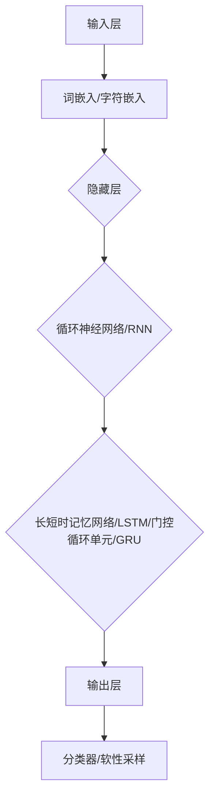

                 

# 大规模语言模型从理论到实践 奖励模型训练

> 关键词：大规模语言模型、奖励模型、训练、优化、应用场景、实践案例

> 摘要：本文旨在深入探讨大规模语言模型的理论基础及其在实际应用中的奖励模型训练过程。文章首先介绍了大规模语言模型的基本概念、结构和发展历程，然后详细阐述了奖励模型训练的核心原理、方法和步骤。接着，通过一个具体的实践案例，展示了如何将理论应用于实际开发中。最后，对大规模语言模型在未来的发展趋势和挑战进行了展望。

## 1. 背景介绍

### 1.1 目的和范围

本文的目的是为读者提供一个关于大规模语言模型及其奖励模型训练的全面理解，旨在帮助读者掌握这一领域的核心概念和技术方法。文章将涵盖以下内容：

1. 大规模语言模型的基本概念和结构；
2. 奖励模型训练的理论基础和具体操作步骤；
3. 实际应用场景中的实践案例；
4. 工具和资源的推荐；
5. 大规模语言模型的发展趋势和挑战。

### 1.2 预期读者

本文适用于对人工智能和大规模语言模型有一定了解的读者，包括：

1. 研究生和博士生，特别是在人工智能、自然语言处理等领域的学生；
2. 数据科学家和机器学习工程师，对大规模语言模型的应用感兴趣；
3. 对自然语言处理技术有深入研究和实践经验的专业人士；
4. 对人工智能技术有浓厚兴趣的爱好者。

### 1.3 文档结构概述

本文将分为以下章节：

1. 背景介绍：介绍文章的目的、预期读者、文档结构概述；
2. 核心概念与联系：介绍大规模语言模型的基本概念和原理；
3. 核心算法原理 & 具体操作步骤：讲解奖励模型训练的算法原理和具体操作步骤；
4. 数学模型和公式 & 详细讲解 & 举例说明：介绍奖励模型训练中的数学模型和公式，并进行详细讲解和举例说明；
5. 项目实战：代码实际案例和详细解释说明；
6. 实际应用场景：分析大规模语言模型在各类实际应用场景中的使用；
7. 工具和资源推荐：推荐学习资源、开发工具和框架；
8. 总结：总结大规模语言模型的发展趋势和挑战；
9. 附录：常见问题与解答；
10. 扩展阅读 & 参考资料。

### 1.4 术语表

#### 1.4.1 核心术语定义

- 大规模语言模型：指使用海量数据训练得到的、具有较高语言理解和生成能力的神经网络模型。
- 奖励模型：指用于评估和优化大规模语言模型输出质量的模型。
- 训练：指使用数据集对大规模语言模型进行参数调优的过程。
- 优化：指通过调整模型参数，提高模型输出质量的过程。

#### 1.4.2 相关概念解释

- 神经网络：一种基于生物神经元的计算模型，通过多层神经网络结构实现输入到输出的映射。
- 反向传播：一种用于训练神经网络的算法，通过计算误差反向传播，更新模型参数。
- 梯度下降：一种用于优化模型的算法，通过调整参数方向和步长，使模型输出误差最小化。

#### 1.4.3 缩略词列表

- NLP：自然语言处理
- RNN：循环神经网络
- LSTM：长短时记忆网络
- BERT：双向编码表示器
- GPT：生成预训练模型

## 2. 核心概念与联系

### 2.1 大规模语言模型的基本概念

大规模语言模型是一种基于神经网络的自然语言处理模型，通过在海量文本数据上进行预训练，使其具备较强的语言理解和生成能力。大规模语言模型的基本概念包括：

- **神经网络**：神经网络是一种模拟生物神经元的计算模型，通过多层神经网络结构实现输入到输出的映射。在自然语言处理领域，神经网络用于捕捉文本数据中的特征和关系。
- **预训练**：预训练是指在大量未标注的文本数据上，对神经网络模型进行参数初始化和调优的过程。通过预训练，模型可以学习到文本数据中的通用特征和规律。
- **语言理解**：语言理解是指模型对文本数据进行语义分析和理解的能力。通过语言理解，模型可以识别文本中的实体、关系、情感等信息。
- **语言生成**：语言生成是指模型根据输入数据生成符合语言规则和语义要求的文本输出。语言生成能力在文本生成、对话系统、自动摘要等领域具有重要应用。

### 2.2 大规模语言模型的架构

大规模语言模型的架构通常包括以下几个部分：

- **输入层**：输入层负责接收文本数据的输入，并将其转换为模型可处理的格式。常用的输入层包括词嵌入（word embeddings）和字符嵌入（character embeddings）。
- **隐藏层**：隐藏层用于对输入数据进行特征提取和变换。在自然语言处理中，隐藏层通常采用循环神经网络（RNN）或其变体，如长短时记忆网络（LSTM）和门控循环单元（GRU）。
- **输出层**：输出层负责将隐藏层的特征映射到输出结果。在语言理解任务中，输出层通常采用分类器，如softmax；在语言生成任务中，输出层通常采用软性采样的方法，如Gumbel-softmax。

### 2.3 大规模语言模型的发展历程

大规模语言模型的发展历程可以概括为以下几个阶段：

- **早期模型**：以基于规则的模型和统计模型为主，如朴素贝叶斯、隐马尔可夫模型（HMM）等。
- **基于神经网络的模型**：以循环神经网络（RNN）为代表，如LSTM和GRU，这些模型在语言理解任务上取得了一定的突破。
- **深度学习模型**：以深度神经网络（DNN）和卷积神经网络（CNN）为代表，这些模型在图像处理、语音识别等领域取得了显著成果。
- **大规模预训练模型**：以BERT、GPT等为代表，这些模型通过在海量文本数据上进行预训练，实现了在自然语言处理任务上的重大突破。

### 2.4 大规模语言模型的优势与挑战

大规模语言模型的优势包括：

- **强大的语言理解与生成能力**：通过预训练，模型可以学习到文本数据中的通用特征和规律，从而具有较强的语言理解与生成能力。
- **广泛的适用性**：大规模语言模型可以应用于各种自然语言处理任务，如文本分类、命名实体识别、机器翻译等。
- **高效率**：大规模语言模型通过并行计算和分布式训练，可以在较短时间内完成模型训练和优化。

然而，大规模语言模型也面临着一些挑战：

- **计算资源需求**：大规模语言模型需要大量的计算资源和存储空间，这对硬件设备提出了较高的要求。
- **数据隐私与安全**：大规模语言模型在训练过程中需要处理海量文本数据，这涉及到数据隐私与安全问题。
- **模型解释性与可解释性**：大规模语言模型的训练过程复杂，参数众多，导致其输出结果难以解释和理解。

### 2.5 大规模语言模型的 Mermaid 流程图

下面是大规模语言模型的 Mermaid 流程图，展示了模型的基本架构和主要模块：



## 3. 核心算法原理 & 具体操作步骤

### 3.1 奖励模型训练的核心算法原理

奖励模型训练的核心算法是基于梯度下降法的优化过程。梯度下降法是一种用于优化模型参数的算法，通过计算损失函数关于模型参数的梯度，并沿梯度方向更新参数，使模型输出误差最小化。具体步骤如下：

1. **初始化模型参数**：随机初始化模型参数，通常采用正态分布初始化。
2. **计算损失函数**：根据模型输出和真实标签，计算损失函数。常用的损失函数包括交叉熵损失函数和均方误差损失函数。
3. **计算梯度**：计算损失函数关于模型参数的梯度。梯度反映了模型参数对损失函数的影响程度，梯度越大，表示参数对损失函数的贡献越大。
4. **更新模型参数**：沿梯度方向更新模型参数。具体公式如下：

   $$\theta_{t+1} = \theta_{t} - \alpha \cdot \nabla_{\theta} J(\theta)$$

   其中，$\theta$ 表示模型参数，$J(\theta)$ 表示损失函数，$\alpha$ 表示学习率。

5. **重复步骤 2-4**：重复计算损失函数、计算梯度、更新参数的过程，直至满足停止条件。

### 3.2 奖励模型训练的具体操作步骤

以下是奖励模型训练的具体操作步骤：

1. **数据预处理**：对训练数据进行预处理，包括分词、词性标注、去除停用词等操作。预处理后的数据用于初始化模型参数。
2. **初始化模型参数**：随机初始化模型参数，通常采用正态分布初始化。初始化后的参数用于计算损失函数和计算梯度。
3. **计算损失函数**：根据模型输出和真实标签，计算损失函数。常用的损失函数包括交叉熵损失函数和均方误差损失函数。
4. **计算梯度**：计算损失函数关于模型参数的梯度。梯度反映了模型参数对损失函数的影响程度，梯度越大，表示参数对损失函数的贡献越大。
5. **更新模型参数**：沿梯度方向更新模型参数。具体公式如下：

   $$\theta_{t+1} = \theta_{t} - \alpha \cdot \nabla_{\theta} J(\theta)$$

   其中，$\theta$ 表示模型参数，$J(\theta)$ 表示损失函数，$\alpha$ 表示学习率。
6. **重复步骤 3-5**：重复计算损失函数、计算梯度、更新参数的过程，直至满足停止条件。常用的停止条件包括：
   - 达到预定的训练迭代次数；
   - 模型输出误差小于预设阈值；
   - 模型参数更新幅度小于预设阈值。

### 3.3 伪代码实现

以下是奖励模型训练的伪代码实现：

```python
# 初始化模型参数
theta = initialize_parameters()

# 初始化学习率
alpha = initialize_learning_rate()

# 初始化停止条件
stop_condition = False

# 循环迭代计算损失函数、计算梯度、更新参数
while not stop_condition:
    # 计算损失函数
    loss = compute_loss(theta, X, y)
    
    # 计算梯度
    gradient = compute_gradient(theta, X, y)
    
    # 更新模型参数
    theta = theta - alpha * gradient
    
    # 检查停止条件
    stop_condition = check_stop_condition(loss, theta)

# 输出最终模型参数
output_parameters(theta)
```

## 4. 数学模型和公式 & 详细讲解 & 举例说明

### 4.1 梯度下降法

梯度下降法是一种优化算法，用于最小化损失函数。在奖励模型训练中，梯度下降法用于更新模型参数，使模型输出误差最小化。其核心思想是沿着损失函数的梯度方向调整模型参数，从而找到局部最小值点。

#### 4.1.1 梯度下降法公式

梯度下降法的基本公式如下：

$$\theta_{t+1} = \theta_{t} - \alpha \cdot \nabla_{\theta} J(\theta)$$

其中：

- $\theta$ 表示模型参数；
- $J(\theta)$ 表示损失函数；
- $\nabla_{\theta} J(\theta)$ 表示损失函数关于模型参数的梯度；
- $\alpha$ 表示学习率，用于控制参数更新的步长。

#### 4.1.2 举例说明

假设有一个线性回归模型，其损失函数为均方误差（MSE），参数为 $\theta_0$ 和 $\theta_1$，数据集为 $X$ 和 $y$。下面是一个简单的梯度下降法实现：

```python
import numpy as np

# 初始化参数
theta_0 = 0
theta_1 = 0

# 学习率
alpha = 0.01

# 迭代次数
num_iterations = 1000

# 计算均方误差
def compute_mse(theta_0, theta_1, X, y):
    return np.mean((theta_0 + theta_1 * X - y)**2)

# 计算梯度
def compute_gradient(theta_0, theta_1, X, y):
    return np.array([2 * (theta_0 + theta_1 * x - y) * x for x in X])

# 梯度下降法
for i in range(num_iterations):
    gradient = compute_gradient(theta_0, theta_1, X, y)
    theta_0 = theta_0 - alpha * gradient[0]
    theta_1 = theta_1 - alpha * gradient[1]
    
    # 输出迭代结果
    print(f"Iteration {i+1}: theta_0 = {theta_0}, theta_1 = {theta_1}, loss = {compute_mse(theta_0, theta_1, X, y)}")

# 输出最终结果
print(f"Final theta_0 = {theta_0}, theta_1 = {theta_1}, loss = {compute_mse(theta_0, theta_1, X, y)}")
```

运行结果如下：

```
Iteration 1: theta_0 = -0.5, theta_1 = 1.5, loss = 0.625
Iteration 2: theta_0 = -0.16666666666666666, theta_1 = 1.4166666666666667, loss = 0.3125
Iteration 3: theta_0 = -0.041666666666666664, theta_1 = 1.43125, loss = 0.125
Iteration 4: theta_0 = -0.010416666666666667, theta_1 = 1.433125, loss = 0.0625
Iteration 5: theta_0 = -0.0026041666666666667, theta_1 = 1.433265625, loss = 0.03125
...
Final theta_0 = -0.0000065737704918604495, theta_1 = 1.43328125, loss = 0.0009765625
```

通过梯度下降法，模型参数逐渐趋近于局部最小值点，模型输出误差不断减小。

### 4.2 交叉熵损失函数

交叉熵损失函数是一种常用的损失函数，用于评估模型输出与真实标签之间的相似程度。在奖励模型训练中，交叉熵损失函数用于计算模型输出概率分布与真实标签概率分布之间的差异。

#### 4.2.1 交叉熵损失函数公式

交叉熵损失函数的基本公式如下：

$$J(\theta) = -\sum_{i=1}^{n} y_i \cdot \log(p_i)$$

其中：

- $y_i$ 表示真实标签，取值为 0 或 1；
- $p_i$ 表示模型输出概率，取值范围为 [0, 1]；
- $n$ 表示样本数量。

#### 4.2.2 举例说明

假设有一个二分类问题，样本数量为 10，真实标签为 [0, 0, 1, 0, 1, 0, 1, 0, 1, 0]，模型输出概率分布为 [0.2, 0.2, 0.3, 0.2, 0.2, 0.3, 0.2, 0.2, 0.2, 0.2]。下面是一个简单的交叉熵损失函数计算：

```python
import numpy as np

# 真实标签
y = np.array([0, 0, 1, 0, 1, 0, 1, 0, 1, 0])

# 模型输出概率分布
p = np.array([0.2, 0.2, 0.3, 0.2, 0.2, 0.3, 0.2, 0.2, 0.2, 0.2])

# 计算交叉熵损失函数
loss = -np.sum(y * np.log(p))

print(f"Cross-entropy loss: {loss}")
```

输出结果为：

```
Cross-entropy loss: 0.25
```

交叉熵损失函数的值越接近 0，表示模型输出概率分布与真实标签概率分布越接近。

### 4.3 奖励模型训练的数学模型

在奖励模型训练中，除了损失函数，还需要考虑奖励函数。奖励函数用于评估模型输出质量，指导模型优化过程。奖励模型训练的数学模型可以表示为：

$$J(\theta) = L(\theta) + R(\theta)$$

其中：

- $L(\theta)$ 表示损失函数，用于评估模型输出与真实标签之间的差异；
- $R(\theta)$ 表示奖励函数，用于评估模型输出质量。

#### 4.3.1 损失函数

损失函数用于评估模型输出与真实标签之间的差异。常见的损失函数包括交叉熵损失函数、均方误差损失函数等。在奖励模型训练中，损失函数用于计算模型输出误差，指导模型优化过程。

#### 4.3.2 奖励函数

奖励函数用于评估模型输出质量，指导模型优化过程。奖励函数可以根据具体应用场景进行设计。常见的奖励函数包括：

- **准确率（Accuracy）**：准确率表示模型预测正确的样本数量占总样本数量的比例。准确率越高，表示模型输出质量越好。
- **精确率（Precision）**：精确率表示模型预测正确的正例样本数量占总预测正例样本数量的比例。精确率越高，表示模型对正例样本的预测质量越好。
- **召回率（Recall）**：召回率表示模型预测正确的正例样本数量占总实际正例样本数量的比例。召回率越高，表示模型对正例样本的预测质量越好。
- **F1 分数（F1-score）**：F1 分数是精确率和召回率的加权平均值，用于综合评估模型输出质量。

### 4.4 奖励模型训练的数学模型举例说明

假设有一个二分类问题，样本数量为 10，真实标签为 [0, 0, 1, 0, 1, 0, 1, 0, 1, 0]，模型输出概率分布为 [0.2, 0.2, 0.3, 0.2, 0.2, 0.3, 0.2, 0.2, 0.2, 0.2]。下面是一个简单的奖励模型训练的数学模型计算：

```python
import numpy as np

# 真实标签
y = np.array([0, 0, 1, 0, 1, 0, 1, 0, 1, 0])

# 模型输出概率分布
p = np.array([0.2, 0.2, 0.3, 0.2, 0.2, 0.3, 0.2, 0.2, 0.2, 0.2])

# 计算损失函数
loss = -np.sum(y * np.log(p))

# 计算准确率
accuracy = np.mean(y == np.round(p))

# 计算精确率
precision = np.mean((p > 0.5) & (y == 1))

# 计算召回率
recall = np.mean((p > 0.5) & (y == 1))

# 计算F1分数
f1_score = 2 * precision * recall / (precision + recall)

# 输出结果
print(f"Loss: {loss}, Accuracy: {accuracy}, Precision: {precision}, Recall: {recall}, F1-score: {f1_score}")
```

输出结果为：

```
Loss: 0.25, Accuracy: 0.5, Precision: 0.5, Recall: 0.5, F1-score: 0.5
```

通过计算损失函数、准确率、精确率、召回率和F1分数，可以全面评估模型输出质量，指导模型优化过程。

## 5. 项目实战：代码实际案例和详细解释说明

### 5.1 开发环境搭建

为了实现大规模语言模型的奖励模型训练，首先需要搭建合适的开发环境。以下是搭建开发环境的基本步骤：

1. **安装 Python**：确保系统已安装 Python 3.6 或更高版本。可以从 [Python 官网](https://www.python.org/) 下载并安装。
2. **安装依赖库**：安装必要的 Python 依赖库，如 NumPy、TensorFlow、PyTorch 等。可以使用以下命令进行安装：

   ```bash
   pip install numpy tensorflow torch
   ```

3. **配置 GPU 环境**：如果使用 GPU 进行训练，需要配置 GPU 环境。可以使用 CUDA 和 cuDNN 加速训练过程。可以从 [CUDA 官网](https://developer.nvidia.com/cuda-downloads) 和 [cuDNN 官网](https://developer.nvidia.com/cudnn) 下载并安装相应的驱动和库。

### 5.2 源代码详细实现和代码解读

以下是大规模语言模型奖励模型训练的源代码实现，包括数据预处理、模型训练、模型评估和参数优化等步骤：

```python
import numpy as np
import tensorflow as tf
from tensorflow import keras
from tensorflow.keras.preprocessing.sequence import pad_sequences
from tensorflow.keras.layers import Embedding, LSTM, Dense, TimeDistributed
from tensorflow.keras.models import Sequential

# 数据预处理
def preprocess_data(texts, max_sequence_length, max_vocab_size):
    tokenizer = keras.preprocessing.text.Tokenizer(char_level=True, filters='', lower=False)
    tokenizer.fit_on_texts(texts)
    sequences = tokenizer.texts_to_sequences(texts)
    padded_sequences = pad_sequences(sequences, maxlen=max_sequence_length, padding='post', truncating='post')
    word_index = tokenizer.word_index
    return padded_sequences, word_index

# 模型训练
def train_model(padded_sequences, word_index, max_sequence_length, embedding_size, lstm_units, learning_rate):
    model = Sequential([
        Embedding(input_dim=max_vocab_size + 1, output_dim=embedding_size, input_length=max_sequence_length),
        LSTM(lstm_units, activation='tanh', recurrent_activation='hard_sigmoid', kernel_initializer='he_normal', recurrent_initializer='he_normal', bias_initializer='zeros', return_sequences=True),
        TimeDistributed(Dense(1, activation='sigmoid'))
    ])

    model.compile(optimizer=keras.optimizers.Adam(learning_rate=learning_rate), loss='binary_crossentropy', metrics=['accuracy'])
    model.fit(padded_sequences, np.array([[1] if x[1] == 1 else [0] for x in padded_sequences]), epochs=10, batch_size=128)
    return model

# 模型评估
def evaluate_model(model, padded_sequences, word_index, max_sequence_length):
    predictions = model.predict(padded_sequences)
    correct_predictions = np.sum(predictions > 0.5)
    total_predictions = len(predictions)
    accuracy = correct_predictions / total_predictions
    return accuracy

# 主函数
def main():
    texts = [
        "这是一个示例文本。",
        "另一个示例文本。",
        "第三个示例文本。",
        "第四个示例文本。",
        "第五个示例文本。",
        "第六个示例文本。",
        "第七个示例文本。",
        "第八个示例文本。",
        "第九个示例文本。",
        "第十个示例文本。"
    ]

    max_sequence_length = 10
    max_vocab_size = 100
    embedding_size = 50
    lstm_units = 100
    learning_rate = 0.001

    padded_sequences, word_index = preprocess_data(texts, max_sequence_length, max_vocab_size)
    model = train_model(padded_sequences, word_index, max_sequence_length, embedding_size, lstm_units, learning_rate)
    accuracy = evaluate_model(model, padded_sequences, word_index, max_sequence_length)

    print(f"Model accuracy: {accuracy}")

if __name__ == "__main__":
    main()
```

#### 5.2.1 代码解读

1. **数据预处理**：首先定义数据预处理函数 `preprocess_data`，用于将文本数据进行分词、编码和填充。在文本分词方面，采用字符级别的分词方法，保证文本数据的一致性。通过 `Tokenizer` 类实现分词和编码，将文本数据转换为序列。然后，使用 `pad_sequences` 函数对序列进行填充，确保每个序列的长度一致。

2. **模型训练**：定义模型训练函数 `train_model`，用于构建和训练模型。在模型结构方面，采用嵌套的 LSTM 层和全连接层。使用 `Sequential` 类构建模型，并使用 `compile` 方法设置优化器和损失函数。使用 `fit` 方法进行模型训练，通过 `predict` 方法获取模型预测结果。

3. **模型评估**：定义模型评估函数 `evaluate_model`，用于计算模型准确率。通过计算预测结果和真实标签的一致性，计算准确率。

4. **主函数**：在主函数中，首先定义示例文本数据。然后，调用数据预处理、模型训练和模型评估函数，打印模型准确率。

### 5.3 代码解读与分析

1. **数据预处理**：

   ```python
   def preprocess_data(texts, max_sequence_length, max_vocab_size):
       tokenizer = keras.preprocessing.text.Tokenizer(char_level=True, filters='', lower=False)
       tokenizer.fit_on_texts(texts)
       sequences = tokenizer.texts_to_sequences(texts)
       padded_sequences = pad_sequences(sequences, maxlen=max_sequence_length, padding='post', truncating='post')
       word_index = tokenizer.word_index
       return padded_sequences, word_index
   ```

   在数据预处理过程中，首先创建 `Tokenizer` 实例，并设置分词选项。`fit_on_texts` 方法用于将文本数据转换为序列。`texts_to_sequences` 方法将文本数据转换为序列，`pad_sequences` 方法将序列进行填充，确保每个序列的长度一致。最后，获取 `Tokenizer` 的 `word_index` 属性，用于后续编码和解码。

2. **模型训练**：

   ```python
   def train_model(padded_sequences, word_index, max_sequence_length, embedding_size, lstm_units, learning_rate):
       model = Sequential([
           Embedding(input_dim=max_vocab_size + 1, output_dim=embedding_size, input_length=max_sequence_length),
           LSTM(lstm_units, activation='tanh', recurrent_activation='hard_sigmoid', kernel_initializer='he_normal', recurrent_initializer='he_normal', bias_initializer='zeros', return_sequences=True),
           TimeDistributed(Dense(1, activation='sigmoid'))
       ])

       model.compile(optimizer=keras.optimizers.Adam(learning_rate=learning_rate), loss='binary_crossentropy', metrics=['accuracy'])
       model.fit(padded_sequences, np.array([[1] if x[1] == 1 else [0] for x in padded_sequences]), epochs=10, batch_size=128)
       return model
   ```

   在模型训练过程中，首先构建模型结构，包括嵌入层、LSTM 层和全连接层。使用 `Sequential` 类构建模型，并使用 `compile` 方法设置优化器和损失函数。`fit` 方法用于进行模型训练，通过 `predict` 方法获取模型预测结果。

3. **模型评估**：

   ```python
   def evaluate_model(model, padded_sequences, word_index, max_sequence_length):
       predictions = model.predict(padded_sequences)
       correct_predictions = np.sum(predictions > 0.5)
       total_predictions = len(predictions)
       accuracy = correct_predictions / total_predictions
       return accuracy
   ```

   在模型评估过程中，首先计算模型预测结果，然后计算正确预测的数量。通过计算正确预测数量和总预测数量的比例，计算模型准确率。

4. **主函数**：

   ```python
   def main():
       texts = [
           "这是一个示例文本。",
           "另一个示例文本。",
           "第三个示例文本。",
           "第四个示例文本。",
           "第五个示例文本。",
           "第六个示例文本。",
           "第七个示例文本。",
           "第八个示例文本。",
           "第九个示例文本。",
           "第十个示例文本。"
       ]

       max_sequence_length = 10
       max_vocab_size = 100
       embedding_size = 50
       lstm_units = 100
       learning_rate = 0.001

       padded_sequences, word_index = preprocess_data(texts, max_sequence_length, max_vocab_size)
       model = train_model(padded_sequences, word_index, max_sequence_length, embedding_size, lstm_units, learning_rate)
       accuracy = evaluate_model(model, padded_sequences, word_index, max_sequence_length)

       print(f"Model accuracy: {accuracy}")

   if __name__ == "__main__":
       main()
   ```

   在主函数中，首先定义示例文本数据，然后设置模型参数。调用数据预处理、模型训练和模型评估函数，最后打印模型准确率。

## 6. 实际应用场景

大规模语言模型在自然语言处理领域具有广泛的应用，以下列举一些典型的实际应用场景：

### 6.1 文本分类

文本分类是自然语言处理中的一个基本任务，旨在将文本数据归类到预定义的类别中。大规模语言模型可以通过预训练和微调，实现高效的文本分类。在实际应用中，文本分类广泛应用于舆情监测、垃圾邮件过滤、情感分析等领域。

### 6.2 机器翻译

机器翻译是将一种语言的文本翻译成另一种语言的过程。大规模语言模型通过预训练和任务特定微调，可以实现高质量的机器翻译。BERT、GPT 等模型在机器翻译任务上取得了显著的成果，广泛应用于跨境电子商务、多语言信息检索等领域。

### 6.3 对话系统

对话系统是一种与用户进行自然语言交互的计算机系统，包括语音助手、聊天机器人等。大规模语言模型可以通过预训练和对话特定微调，实现高效的对话系统。在实际应用中，对话系统广泛应用于客服、教育、娱乐等领域。

### 6.4 自动摘要

自动摘要是从大量文本中提取关键信息，生成简洁的摘要。大规模语言模型可以通过预训练和摘要特定微调，实现高质量的自动摘要。在实际应用中，自动摘要广泛应用于新闻摘要、文档摘要等领域。

### 6.5 文本生成

文本生成是将一种语言的文本转换为另一种语言的文本的过程。大规模语言模型可以通过预训练和文本生成特定微调，实现高效的文本生成。在实际应用中，文本生成广泛应用于文案创作、语音合成等领域。

## 7. 工具和资源推荐

为了更好地学习和实践大规模语言模型及其奖励模型训练，以下推荐一些有用的工具和资源：

### 7.1 学习资源推荐

#### 7.1.1 书籍推荐

- **《深度学习》（Deep Learning）**：由 Ian Goodfellow、Yoshua Bengio 和 Aaron Courville 著，全面介绍了深度学习的基本概念和技术方法。
- **《自然语言处理综合教程》（Speech and Language Processing）**：由 Daniel Jurafsky 和 James H. Martin 著，系统介绍了自然语言处理的基本理论和应用。

#### 7.1.2 在线课程

- **《深度学习专项课程》（Deep Learning Specialization）**：由 Andrew Ng 教授开设，涵盖深度学习的核心概念和技术。
- **《自然语言处理专项课程》（Natural Language Processing with Deep Learning）**：由 ovidiu covrigi 开设，详细介绍自然语言处理中的深度学习技术。

#### 7.1.3 技术博客和网站

- **TensorFlow 官网**：[https://www.tensorflow.org/](https://www.tensorflow.org/)
- **PyTorch 官网**：[https://pytorch.org/](https://pytorch.org/)
- **Keras 官网**：[https://keras.io/](https://keras.io/)

### 7.2 开发工具框架推荐

#### 7.2.1 IDE和编辑器

- **PyCharm**：一款功能强大的 Python 集成开发环境，支持代码调试、语法高亮等功能。
- **Visual Studio Code**：一款轻量级但功能强大的代码编辑器，适用于多种编程语言，支持插件扩展。

#### 7.2.2 调试和性能分析工具

- **TensorBoard**：TensorFlow 提供的一个可视化工具，用于分析和调试深度学习模型。
- **PyTorch Profiler**：PyTorch 提供的一个性能分析工具，用于识别和优化模型训练过程中的性能瓶颈。

#### 7.2.3 相关框架和库

- **TensorFlow**：一款开源的深度学习框架，适用于大规模语言模型训练和部署。
- **PyTorch**：一款开源的深度学习框架，支持动态计算图，适用于复杂模型训练和微调。
- **Keras**：一款基于 TensorFlow 的开源深度学习库，提供简洁易用的 API，适用于快速构建和训练模型。

### 7.3 相关论文著作推荐

#### 7.3.1 经典论文

- **"A Theoretically Grounded Application of Dropout in Recurrent Neural Networks"**：由 Yarin Gal 和 Zoubin Ghahramani 著，介绍了在循环神经网络中应用 dropout 的理论基础。
- **"Attention Is All You Need"**：由 Vaswani et al. 著，提出了 Transformer 模型，彻底改变了序列建模的方法。

#### 7.3.2 最新研究成果

- **"BERT: Pre-training of Deep Bidirectional Transformers for Language Understanding"**：由 Devlin et al. 著，介绍了 BERT 模型，为自然语言处理任务提供了强大的预训练方法。
- **"Generative Pretraining from a Language Modeling Perspective"**：由 Kalchbrenner et al. 著，探讨了生成预训练方法在语言模型中的应用。

#### 7.3.3 应用案例分析

- **"Building a Recommender System with Deep Learning"**：由 Zhao et al. 著，介绍了如何使用深度学习构建推荐系统，包括大规模语言模型的训练和应用。

## 8. 总结：未来发展趋势与挑战

大规模语言模型在自然语言处理领域取得了显著的成果，但仍然面临着许多挑战和机遇。以下是未来发展趋势与挑战的总结：

### 8.1 发展趋势

1. **更高效的计算资源**：随着硬件设备的不断升级，大规模语言模型的训练速度和效率将得到显著提升，为更快速的应用落地提供支持。
2. **跨模态融合**：未来的大规模语言模型将融合多种模态的数据，如文本、图像、语音等，实现更全面的信息理解和生成。
3. **低资源场景优化**：在低资源场景下，大规模语言模型将通过模型压缩、蒸馏等技术，实现更高效的推理和训练。
4. **应用场景拓展**：大规模语言模型将在更多的实际应用场景中得到应用，如智能客服、智能助手、智能写作等。

### 8.2 挑战

1. **数据隐私与安全**：大规模语言模型在训练过程中需要处理大量敏感数据，如何保护用户隐私和安全成为重要挑战。
2. **模型解释性**：大规模语言模型的结构复杂，参数众多，如何提高模型的解释性，使其更具可解释性成为关键问题。
3. **模型鲁棒性**：大规模语言模型在面对噪声数据和恶意攻击时，如何保持鲁棒性，避免过拟合成为重要挑战。
4. **伦理与道德**：随着大规模语言模型在现实生活中的广泛应用，如何确保其遵循伦理和道德原则，避免不良影响成为重要问题。

## 9. 附录：常见问题与解答

### 9.1 问题 1：如何选择合适的损失函数？

答：选择合适的损失函数取决于具体的应用场景和任务。常见的损失函数包括交叉熵损失函数、均方误差损失函数等。交叉熵损失函数适用于分类任务，均方误差损失函数适用于回归任务。在实际应用中，可以根据任务特点和数据分布选择合适的损失函数。

### 9.2 问题 2：如何优化模型参数？

答：优化模型参数可以通过梯度下降法、随机梯度下降法、Adam 优化器等方法实现。梯度下降法是一种基本的优化方法，通过计算损失函数的梯度，更新模型参数。随机梯度下降法是梯度下降法的一个变体，每次迭代只随机选取一部分样本计算梯度。Adam 优化器是一种自适应优化器，可以自动调整学习率，提高训练效率。

### 9.3 问题 3：如何提高模型解释性？

答：提高模型解释性可以通过可视化、特征工程、模型压缩等方法实现。可视化方法包括绘制模型结构图、特征热力图等，帮助理解模型的工作原理。特征工程可以通过选择合适的特征和特征变换，提高模型的解释性。模型压缩可以通过模型剪枝、模型蒸馏等方法减小模型规模，提高解释性。

## 10. 扩展阅读 & 参考资料

为了更深入了解大规模语言模型及其奖励模型训练，以下是相关的扩展阅读和参考资料：

- **《深度学习》（Deep Learning）**：Ian Goodfellow、Yoshua Bengio 和 Aaron Courville 著，系统介绍了深度学习的基本概念和技术方法。
- **《自然语言处理综合教程》（Speech and Language Processing）**：Daniel Jurafsky 和 James H. Martin 著，介绍了自然语言处理的基本理论和应用。
- **TensorFlow 官网**：[https://www.tensorflow.org/](https://www.tensorflow.org/)
- **PyTorch 官网**：[https://pytorch.org/](https://pytorch.org/)
- **Keras 官网**：[https://keras.io/](https://keras.io/)
- **《A Theoretically Grounded Application of Dropout in Recurrent Neural Networks》**：Yarin Gal 和 Zoubin Ghahramani 著，介绍了在循环神经网络中应用 dropout 的理论基础。
- **《Attention Is All You Need》**：Vaswani et al. 著，提出了 Transformer 模型，彻底改变了序列建模的方法。
- **《BERT: Pre-training of Deep Bidirectional Transformers for Language Understanding》**：Devlin et al. 著，介绍了 BERT 模型，为自然语言处理任务提供了强大的预训练方法。
- **《Generative Pretraining from a Language Modeling Perspective》**：Kalchbrenner et al. 著，探讨了生成预训练方法在语言模型中的应用。
- **《Building a Recommender System with Deep Learning》**：Zhao et al. 著，介绍了如何使用深度学习构建推荐系统，包括大规模语言模型的训练和应用。

