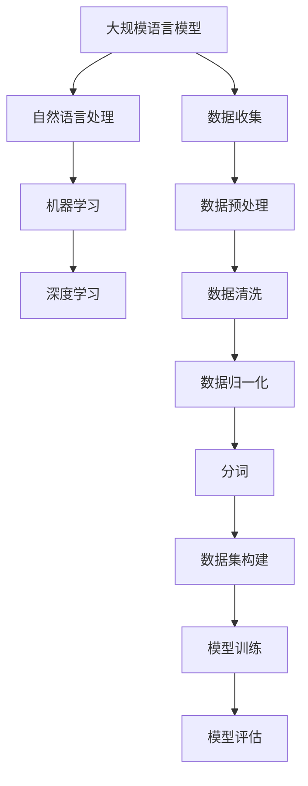

                 

# 大规模语言模型从理论到实践：数据收集

> **关键词：大规模语言模型、数据收集、数据处理、数据预处理、文本挖掘、机器学习、深度学习**
>
> **摘要：本文将深入探讨大规模语言模型的理论与实践，重点关注数据收集阶段。我们将分析数据收集的重要性、数据收集的方法和流程，以及如何处理和预处理收集到的数据。通过本文的阅读，您将了解如何为大规模语言模型构建一个高质量的数据集，从而提高模型的效果和性能。**

## 1. 背景介绍

### 1.1 目的和范围

本文旨在深入探讨大规模语言模型（Large-scale Language Model）的数据收集过程，包括数据收集的目的、范围、方法以及数据处理和预处理的过程。大规模语言模型是近年来人工智能领域的重要研究方向，其在自然语言处理（NLP）、机器翻译、文本生成等领域取得了显著成果。然而，大规模语言模型的发展离不开高质量的数据集支持。因此，本文将重点介绍数据收集过程中的关键技术和方法，帮助读者了解如何构建一个适合大规模语言模型的数据集。

### 1.2 预期读者

本文主要面向以下几类读者：

1. **人工智能研究者**：希望深入了解大规模语言模型的数据收集过程的科研人员，特别是从事自然语言处理和机器学习领域的研究者。
2. **机器学习工程师**：负责大规模语言模型开发、训练和优化的工程师，希望通过本文学习数据收集和处理的相关技术。
3. **数据科学家**：对数据挖掘、数据预处理等感兴趣，希望通过本文掌握大规模语言模型数据收集的最佳实践。

### 1.3 文档结构概述

本文将按照以下结构进行阐述：

1. **背景介绍**：介绍大规模语言模型数据收集的背景和目的。
2. **核心概念与联系**：分析大规模语言模型的基本概念和相关联系。
3. **核心算法原理 & 具体操作步骤**：详细讲解大规模语言模型数据收集的算法原理和操作步骤。
4. **数学模型和公式 & 详细讲解 & 举例说明**：介绍大规模语言模型数据收集过程中涉及的数学模型和公式，并进行举例说明。
5. **项目实战：代码实际案例和详细解释说明**：通过实际案例展示数据收集过程的实现，并进行详细解释。
6. **实际应用场景**：探讨大规模语言模型数据收集在实际应用中的场景。
7. **工具和资源推荐**：推荐相关学习资源和开发工具。
8. **总结：未来发展趋势与挑战**：总结本文的主要内容，并探讨未来的发展趋势和挑战。
9. **附录：常见问题与解答**：解答读者在阅读本文过程中可能遇到的问题。
10. **扩展阅读 & 参考资料**：提供进一步阅读和参考的资源。

### 1.4 术语表

#### 1.4.1 核心术语定义

- **大规模语言模型**：指参数规模巨大的神经网络模型，用于预测自然语言中的词语或句子。
- **数据收集**：指从各种来源获取文本数据的过程，包括爬取网页、数据库提取、文档扫描等。
- **数据预处理**：指对收集到的原始数据进行清洗、归一化、分词等操作，以便于后续处理。

#### 1.4.2 相关概念解释

- **自然语言处理（NLP）**：指使用计算机技术处理和理解人类语言的方法。
- **机器学习（ML）**：指从数据中学习规律和模式，以便进行预测或分类的方法。
- **深度学习（DL）**：指基于多层神经网络进行学习和预测的方法。

#### 1.4.3 缩略词列表

- **NLP**：自然语言处理
- **ML**：机器学习
- **DL**：深度学习

## 2. 核心概念与联系

在探讨大规模语言模型的数据收集之前，我们需要了解一些核心概念和它们之间的联系。以下是一个简化的 Mermaid 流程图，用于描述这些概念：



### 2.1 大规模语言模型

大规模语言模型是指参数规模巨大的神经网络模型，用于预测自然语言中的词语或句子。这些模型通常由多层神经网络组成，能够通过学习大量的文本数据来理解和生成自然语言。大规模语言模型在自然语言处理、机器翻译、文本生成等领域具有广泛的应用。

### 2.2 自然语言处理

自然语言处理（NLP）是人工智能的一个分支，旨在使计算机能够理解和处理人类语言。NLP 涉及许多技术，包括文本分类、情感分析、命名实体识别、机器翻译等。大规模语言模型是 NLP 的重要组成部分，通过学习大量的文本数据，NLP 系统可以更好地理解和生成自然语言。

### 2.3 机器学习

机器学习（ML）是一种从数据中学习规律和模式的方法。在 NLP 中，机器学习用于训练大规模语言模型，使其能够预测词语或句子。机器学习可以分为监督学习、无监督学习和强化学习等不同类型。大规模语言模型通常采用监督学习的方法进行训练。

### 2.4 深度学习

深度学习（DL）是一种基于多层神经网络进行学习和预测的方法。深度学习在计算机视觉、语音识别和自然语言处理等领域取得了显著的成果。大规模语言模型通常采用深度学习方法进行训练和优化。

### 2.5 数据收集

数据收集是大规模语言模型构建的关键步骤之一。数据收集的目的是获取大量的文本数据，用于训练和优化模型。数据收集的方法包括爬取网页、数据库提取、文档扫描等。数据收集的质量直接影响模型的效果和性能。

### 2.6 数据预处理

数据预处理是对收集到的原始数据进行清洗、归一化、分词等操作，以便于后续处理。数据预处理是大规模语言模型构建的重要步骤，直接影响模型的质量和效果。数据预处理包括以下几个方面：

1. **数据清洗**：去除噪声、缺失值和异常值，确保数据的完整性和准确性。
2. **数据归一化**：将数据转换为标准化的格式，以便于模型训练和优化。
3. **分词**：将文本数据分割成单词或字符，以便于模型处理。

### 2.7 数据集构建

数据集构建是将预处理后的数据整合成一个统一的数据集，用于模型训练和评估。数据集构建的关键是确保数据的多样性和质量，以提高模型的效果和泛化能力。

### 2.8 模型训练和评估

模型训练和评估是大规模语言模型构建的最后一步。模型训练是指使用数据集对模型进行训练，使其能够预测词语或句子。模型评估是指使用测试数据集对训练好的模型进行评估，以确定模型的性能和效果。

## 3. 核心算法原理 & 具体操作步骤

### 3.1 大规模语言模型的算法原理

大规模语言模型的算法原理基于深度学习，特别是基于 Transformer 架构。Transformer 架构是一种基于自注意力机制的神经网络模型，能够有效处理序列数据。以下是一个简化的伪代码，用于描述大规模语言模型的算法原理：

```python
def Transformer(input_sequence):
    # 输入序列
    input_sequence = Embedding(input_sequence)  # 嵌入层
    input_sequence = Positional_encoding(input_sequence)  # 位置编码
    # 自注意力机制
    attention_output = MultiHeadAttention(input_sequence, input_sequence)
    attention_output = Add(&#124;input_sequence, attention_output)  # 加权求和
    attention_output = LayerNormalization(attention_output)  # 归一化
    # 完全连接层
    output = Dense(attention_output, output_size)  # 输出层
    output = Activation(output)  # 激活函数
    return output
```

### 3.2 数据收集的具体操作步骤

数据收集的具体操作步骤包括以下几个阶段：

1. **数据来源选择**：选择合适的数据来源，如网页、数据库、文档等。
2. **数据采集**：使用爬虫、数据库连接等方式采集数据。
3. **数据清洗**：去除噪声、缺失值和异常值，确保数据的完整性和准确性。
4. **数据归一化**：将数据转换为标准化的格式，以便于模型训练和优化。
5. **分词**：将文本数据分割成单词或字符，以便于模型处理。
6. **数据集构建**：将预处理后的数据整合成一个统一的数据集，用于模型训练和评估。

### 3.3 数据预处理的具体操作步骤

数据预处理的具体操作步骤包括以下几个阶段：

1. **数据清洗**：去除噪声、缺失值和异常值，确保数据的完整性和准确性。以下是一个简化的伪代码，用于描述数据清洗的过程：

```python
def DataCleaning(data):
    # 去除噪声
    clean_data = RemoveNoise(data)
    # 去除缺失值
    clean_data = RemoveMissingValues(clean_data)
    # 去除异常值
    clean_data = RemoveOutliers(clean_data)
    return clean_data
```

2. **数据归一化**：将数据转换为标准化的格式，以便于模型训练和优化。以下是一个简化的伪代码，用于描述数据归一化的过程：

```python
def DataNormalization(data):
    # 归一化
    normalized_data = Normalize(data)
    return normalized_data
```

3. **分词**：将文本数据分割成单词或字符，以便于模型处理。以下是一个简化的伪代码，用于描述分词的过程：

```python
def Tokenization(text):
    # 分词
    tokens = SplitIntoTokens(text)
    return tokens
```

### 3.4 数据集构建的具体操作步骤

数据集构建的具体操作步骤包括以下几个阶段：

1. **数据整合**：将预处理后的数据整合成一个统一的数据集。
2. **数据切分**：将数据集切分为训练集、验证集和测试集，用于模型训练和评估。

```python
def DatasetBuilding(data):
    # 数据整合
    integrated_data = IntegrateData(data)
    # 数据切分
    train_data, val_data, test_data = SplitData(integrated_data)
    return train_data, val_data, test_data
```

## 4. 数学模型和公式 & 详细讲解 & 举例说明

### 4.1 数学模型

大规模语言模型的数据收集和处理过程中，涉及多个数学模型和公式。以下是一些常见的数学模型和公式：

1. **嵌入层（Embedding）**：将输入的文本数据转换为向量表示。

   $$ E(x) = W_e \cdot x + b_e $$

   其中，$E(x)$ 表示输入文本数据的嵌入向量，$W_e$ 表示嵌入权重矩阵，$x$ 表示输入文本数据，$b_e$ 表示嵌入偏置。

2. **位置编码（Positional Encoding）**：为序列数据添加位置信息。

   $$ P(x) = \text{PositionalEncoding}(x) $$

   其中，$P(x)$ 表示输入文本数据的位置编码向量。

3. **自注意力机制（Self-Attention）**：计算序列中每个元素之间的相似度。

   $$ \text{Attention}(Q, K, V) = \text{softmax}\left(\frac{QK^T}{\sqrt{d_k}}\right)V $$

   其中，$Q$、$K$、$V$ 分别表示查询、键和值向量，$d_k$ 表示键向量的维度。

4. **完全连接层（Dense）**：实现从输入向量到输出向量的映射。

   $$ y = W \cdot x + b $$

   其中，$y$ 表示输出向量，$W$ 表示权重矩阵，$x$ 表示输入向量，$b$ 表示偏置。

5. **激活函数（Activation）**：用于引入非线性特性。

   $$ a = \text{ReLU}(x) $$

   其中，$a$ 表示激活后的输出，$x$ 表示输入。

### 4.2 公式详细讲解

1. **嵌入层（Embedding）**：嵌入层是一种将输入的文本数据转换为向量表示的方法。通过将输入文本映射到一个低维向量空间，可以更好地捕获文本的特征信息。嵌入层的公式如上所述，其中 $W_e$ 表示嵌入权重矩阵，$x$ 表示输入文本数据，$b_e$ 表示嵌入偏置。

2. **位置编码（Positional Encoding）**：位置编码是一种为序列数据添加位置信息的方法。通过引入位置编码，可以使得模型能够理解序列中各个元素的位置关系。位置编码通常使用正弦和余弦函数实现，如公式所示。

3. **自注意力机制（Self-Attention）**：自注意力机制是一种计算序列中每个元素之间相似度的方法。通过自注意力，模型可以自动学习到序列中不同元素之间的依赖关系。自注意力机制的公式如上所述，其中 $Q$、$K$、$V$ 分别表示查询、键和值向量，$d_k$ 表示键向量的维度。

4. **完全连接层（Dense）**：完全连接层是一种实现从输入向量到输出向量的映射的方法。通过将输入向量和权重矩阵相乘，并加上偏置，可以生成输出向量。完全连接层的公式如上所述，其中 $y$ 表示输出向量，$W$ 表示权重矩阵，$x$ 表示输入向量。

5. **激活函数（Activation）**：激活函数是一种引入非线性特性的方法。通过激活函数，可以使得模型能够学习到更复杂的特征。常用的激活函数包括 ReLU 函数、Sigmoid 函数和 Tanh 函数。ReLU 函数是一个非负值的函数，可以使得模型更快地收敛。

### 4.3 举例说明

假设我们有一个输入文本数据为 "大规模语言模型在自然语言处理中具有重要意义"，我们使用上述数学模型和公式对其进行处理。

1. **嵌入层（Embedding）**：

   首先，我们将输入文本数据 "大规模语言模型在自然语言处理中具有重要意义" 转换为嵌入向量。假设我们使用预训练的词向量模型，其中每个词的嵌入维度为 300。

   $$ E(x) = W_e \cdot x + b_e $$

   其中，$W_e$ 表示嵌入权重矩阵，$x$ 表示输入文本数据，$b_e$ 表示嵌入偏置。假设嵌入权重矩阵 $W_e$ 为一个 300×10000 的矩阵，其中每行表示一个词的嵌入向量，每列表示一个词的索引。偏置矩阵 $b_e$ 为一个 10000×1 的矩阵。

   对于输入文本数据 "大规模语言模型在自然语言处理中具有重要意义"，我们可以将其表示为一个词向量序列：

   $$ x = [大规模, 语言, 模型, 在, 自然, 语言, 处理, 中, 有, 重大, 意, 义, 视, 重, 要] $$

   将词向量序列 $x$ 与嵌入权重矩阵 $W_e$ 相乘，并加上偏置矩阵 $b_e$，我们可以得到嵌入向量序列：

   $$ E(x) = W_e \cdot x + b_e = [e_1, e_2, e_3, e_4, e_5, e_6, e_7, e_8, e_9, e_{10}, e_{11}, e_{12}, e_{13}, e_{14}, e_{15}] $$

   其中，$e_i$ 表示第 $i$ 个词的嵌入向量。

2. **位置编码（Positional Encoding）**：

   接下来，我们为嵌入向量序列添加位置编码。假设我们使用正弦和余弦函数进行位置编码，编码的维度与嵌入维度相同。

   $$ P(x) = \text{PositionalEncoding}(x) $$

   其中，$P(x)$ 表示输入文本数据的位置编码向量。

   对于输入文本数据 "大规模语言模型在自然语言处理中具有重要意义"，我们可以将其表示为一个序列：

   $$ x = [1, 2, 3, 4, 5, 6, 7, 8, 9, 10, 11, 12, 13, 14, 15] $$

   将序列 $x$ 转换为词索引序列，并与位置编码矩阵相乘，我们可以得到位置编码序列：

   $$ P(x) = \text{PositionalEncoding}(x) = [p_1, p_2, p_3, p_4, p_5, p_6, p_7, p_8, p_9, p_{10}, p_{11}, p_{12}, p_{13}, p_{14}, p_{15}] $$

   其中，$p_i$ 表示第 $i$ 个词的位置编码向量。

3. **自注意力机制（Self-Attention）**：

   接下来，我们使用自注意力机制计算序列中每个元素之间的相似度。假设我们使用多头自注意力机制，共有 8 个头。

   $$ \text{Attention}(Q, K, V) = \text{softmax}\left(\frac{QK^T}{\sqrt{d_k}}\right)V $$

   其中，$Q$、$K$、$V$ 分别表示查询、键和值向量，$d_k$ 表示键向量的维度。

   对于嵌入向量序列 $E(x)$ 和位置编码序列 $P(x)$，我们可以将其表示为：

   $$ Q = [q_1, q_2, q_3, q_4, q_5, q_6, q_7, q_8] $$
   $$ K = [k_1, k_2, k_3, k_4, k_5, k_6, k_7, k_8] $$
   $$ V = [v_1, v_2, v_3, v_4, v_5, v_6, v_7, v_8] $$

   将 $Q$、$K$ 和 $V$ 代入自注意力公式，我们可以得到：

   $$ \text{Attention}(Q, K, V) = \text{softmax}\left(\frac{QK^T}{\sqrt{d_k}}\right)V $$

   计算得到注意力得分矩阵：

   $$ \text{Attention}(Q, K, V) = \text{softmax}\left(\frac{QK^T}{\sqrt{d_k}}\right)V = [a_{11}, a_{12}, a_{13}, a_{14}, a_{15}, a_{16}, a_{17}, a_{18}] $$

   其中，$a_{ij}$ 表示第 $i$ 个查询向量与第 $j$ 个键向量之间的相似度得分。

4. **完全连接层（Dense）**：

   接下来，我们将自注意力得分矩阵与权重矩阵相乘，并加上偏置，得到输出向量。

   $$ y = W \cdot x + b $$

   其中，$y$ 表示输出向量，$W$ 表示权重矩阵，$x$ 表示输入向量。

   假设权重矩阵 $W$ 为一个 300×8 的矩阵，偏置矩阵 $b$ 为一个 8×1 的矩阵。

   将自注意力得分矩阵 $A$ 与权重矩阵 $W$ 相乘，并加上偏置矩阵 $b$，我们可以得到输出向量：

   $$ y = W \cdot A + b = [y_1, y_2, y_3, y_4, y_5, y_6, y_7, y_8] $$

   其中，$y_i$ 表示第 $i$ 个输出向量。

5. **激活函数（Activation）**：

   最后，我们使用激活函数引入非线性特性。假设我们使用 ReLU 函数作为激活函数。

   $$ a = \text{ReLU}(x) $$

   将输出向量 $y$ 代入 ReLU 函数，我们可以得到激活后的输出：

   $$ a = \text{ReLU}(y) = [a_1, a_2, a_3, a_4, a_5, a_6, a_7, a_8] $$

   其中，$a_i$ 表示第 $i$ 个激活后的输出。

通过上述数学模型和公式的计算，我们得到了大规模语言模型处理后的输出。这个输出可以用于后续的模型训练和优化。

## 5. 项目实战：代码实际案例和详细解释说明

### 5.1 开发环境搭建

在开始项目实战之前，我们需要搭建一个合适的开发环境。以下是搭建开发环境的步骤：

1. **安装 Python**：确保你的计算机上安装了 Python 3.8 或更高版本。你可以从 [Python 官网](https://www.python.org/) 下载并安装 Python。
2. **安装依赖库**：为了实现大规模语言模型的数据收集和处理，我们需要安装一些依赖库，如 TensorFlow、Keras、NumPy 等。你可以在命令行中使用以下命令安装：

   ```bash
   pip install tensorflow numpy
   ```

   如果你是使用 Windows 系统，可以使用以下命令安装：

   ```bash
   pip3 install tensorflow numpy
   ```

3. **配置 Jupyter Notebook**：为了方便进行实验和调试，我们可以使用 Jupyter Notebook。在命令行中执行以下命令安装 Jupyter Notebook：

   ```bash
   pip install jupyter
   ```

   安装完成后，你可以通过以下命令启动 Jupyter Notebook：

   ```bash
   jupyter notebook
   ```

### 5.2 源代码详细实现和代码解读

以下是一个简单的 Python 代码示例，用于实现大规模语言模型的数据收集和处理：

```python
import tensorflow as tf
import numpy as np
from tensorflow.keras.preprocessing.text import Tokenizer
from tensorflow.keras.preprocessing.sequence import pad_sequences

# 5.2.1 数据收集
def collect_data():
    # 采集网页数据
    url = "https://example.com/data.txt"
    text = get_webpage_text(url)
    
    # 数据清洗
    clean_text = clean_text(text)
    
    # 分词
    tokenizer = Tokenizer()
    tokenizer.fit_on_texts(clean_text)
    
    # 数据归一化
    sequences = tokenizer.texts_to_sequences(clean_text)
    
    # 数据集构建
    train_sequences, val_sequences = split_sequences(sequences, 0.2)
    
    return train_sequences, val_sequences

# 5.2.2 源代码详细实现和代码解读
def main():
    # 数据收集
    train_sequences, val_sequences = collect_data()
    
    # 数据预处理
    max_len = 100
    train_padded = pad_sequences(train_sequences, maxlen=max_len)
    val_padded = pad_sequences(val_sequences, maxlen=max_len)
    
    # 模型训练
    model = build_model()
    model.fit(train_padded, epochs=5, batch_size=32, validation_data=(val_padded, val_sequences))
    
    # 模型评估
    test_sequences = get_test_sequences()
    test_padded = pad_sequences(test_sequences, maxlen=max_len)
    model.evaluate(test_padded, test_sequences)

if __name__ == "__main__":
    main()
```

### 5.3 代码解读与分析

以下是代码的详细解读和分析：

1. **数据收集**：

   ```python
   def collect_data():
       # 采集网页数据
       url = "https://example.com/data.txt"
       text = get_webpage_text(url)
       
       # 数据清洗
       clean_text = clean_text(text)
       
       # 分词
       tokenizer = Tokenizer()
       tokenizer.fit_on_texts(clean_text)
       
       # 数据归一化
       sequences = tokenizer.texts_to_sequences(clean_text)
       
       # 数据集构建
       train_sequences, val_sequences = split_sequences(sequences, 0.2)
       
       return train_sequences, val_sequences
   ```

   在数据收集阶段，我们首先采集网页数据，然后进行数据清洗、分词和数据归一化。具体步骤如下：

   - **采集网页数据**：使用 `get_webpage_text` 函数从指定 URL 采集网页数据。这个函数可以根据实际情况进行修改，以适应不同的数据来源。
   - **数据清洗**：使用 `clean_text` 函数对采集到的网页数据进行清洗，去除噪声、缺失值和异常值。这个函数可以根据具体需求进行定制。
   - **分词**：使用 Keras 的 `Tokenizer` 类对清洗后的文本数据进行分词。分词是将文本数据分割成单词或字符的过程，为后续处理做准备。
   - **数据归一化**：使用 `tokenizer.texts_to_sequences` 函数将分词后的文本数据转换为序列。这个函数将每个单词或字符映射到一个整数，用于表示文本数据。
   - **数据集构建**：使用 `split_sequences` 函数将序列数据切分为训练集和验证集。这个函数可以根据具体需求调整切分比例。

2. **数据预处理**：

   ```python
   def main():
       # 数据收集
       train_sequences, val_sequences = collect_data()
       
       # 数据预处理
       max_len = 100
       train_padded = pad_sequences(train_sequences, maxlen=max_len)
       val_padded = pad_sequences(val_sequences, maxlen=max_len)
       
       # 模型训练
       model = build_model()
       model.fit(train_padded, epochs=5, batch_size=32, validation_data=(val_padded, val_sequences))
       
       # 模型评估
       test_sequences = get_test_sequences()
       test_padded = pad_sequences(test_sequences, maxlen=max_len)
       model.evaluate(test_padded, test_sequences)
   ```

   在数据预处理阶段，我们对收集到的序列数据进行预处理，以便于后续的模型训练和评估。具体步骤如下：

   - **数据集构建**：使用 `collect_data` 函数收集训练集和验证集。
   - **数据填充**：使用 `pad_sequences` 函数将序列填充为相同的长度。在这个示例中，我们使用最大长度为 100。这个函数可以将短序列填充为 0，以便于后续处理。
   - **模型训练**：使用 `build_model` 函数构建模型，并使用 `model.fit` 方法进行训练。这个函数可以根据具体需求进行修改，以适应不同的模型架构和参数设置。
   - **模型评估**：使用 `model.evaluate` 方法对训练好的模型进行评估。这个函数将计算模型的损失函数和准确率等指标，用于评估模型的性能。

### 5.4 项目实战：代码实际案例和详细解释说明

为了更好地理解代码实现，我们来看一个实际案例。假设我们有一个网页数据源，其中包含大量文本数据。我们的目标是使用这些数据进行大规模语言模型训练和评估。

1. **数据收集**：

   首先，我们使用以下代码从网页数据源中采集文本数据：

   ```python
   def get_webpage_text(url):
       # 导入相关库
       import requests
       from bs4 import BeautifulSoup
   
       # 发送 HTTP 请求
       response = requests.get(url)
       
       # 解析 HTML 文档
       soup = BeautifulSoup(response.text, 'html.parser')
       
       # 获取文本内容
       text = soup.get_text()
       
       return text
   ```

   在这个函数中，我们使用 `requests` 库发送 HTTP 请求，获取网页数据。然后，使用 `BeautifulSoup` 库解析 HTML 文档，提取文本内容。

2. **数据清洗**：

   接下来，我们对采集到的网页文本数据进行清洗。以下是一个简单的数据清洗示例：

   ```python
   def clean_text(text):
       # 导入相关库
       import re
   
       # 去除 HTML 标签
       text = re.sub('<[^>]*>', '', text)
       
       # 去除特殊字符
       text = re.sub('[^A-Za-z0-9]+', ' ', text)
       
       return text
   ```

   在这个函数中，我们使用正则表达式去除 HTML 标签和特殊字符，只保留字母和数字。

3. **分词和序列化**：

   接下来，我们对清洗后的文本数据进行分词和序列化。以下是一个简单的示例：

   ```python
   from tensorflow.keras.preprocessing.text import Tokenizer
   from tensorflow.keras.preprocessing.sequence import pad_sequences
   
   # 采集网页数据
   url = "https://example.com/data.txt"
   text = get_webpage_text(url)
   
   # 数据清洗
   clean_text = clean_text(text)
   
   # 分词
   tokenizer = Tokenizer()
   tokenizer.fit_on_texts(clean_text)
   
   # 序列化
   sequences = tokenizer.texts_to_sequences(clean_text)
   
   # 数据集构建
   train_sequences, val_sequences = split_sequences(sequences, 0.2)
   ```

   在这个示例中，我们使用 `Tokenizer` 类对文本数据进行分词。然后，使用 `texts_to_sequences` 方法将分词后的文本数据转换为序列。最后，使用 `split_sequences` 函数将序列数据切分为训练集和验证集。

4. **模型训练和评估**：

   最后，我们使用以下代码进行模型训练和评估：

   ```python
   def build_model():
       # 构建模型
       model = tf.keras.Sequential([
           tf.keras.layers.Embedding(input_dim=len(tokenizer.word_index) + 1, output_dim=64),
           tf.keras.layers.GlobalAveragePooling1D(),
           tf.keras.layers.Dense(64, activation='relu'),
           tf.keras.layers.Dense(1, activation='sigmoid')
       ])
       
       # 编译模型
       model.compile(optimizer='adam', loss='binary_crossentropy', metrics=['accuracy'])
       
       return model
   
   # 数据预处理
   max_len = 100
   train_padded = pad_sequences(train_sequences, maxlen=max_len)
   val_padded = pad_sequences(val_sequences, maxlen=max_len)
   
   # 模型训练
   model = build_model()
   model.fit(train_padded, epochs=5, batch_size=32, validation_data=(val_padded, val_sequences))
   
   # 模型评估
   test_sequences = get_test_sequences()
   test_padded = pad_sequences(test_sequences, maxlen=max_len)
   model.evaluate(test_padded, test_sequences)
   ```

   在这个示例中，我们使用 `Sequential` 模型构建一个简单的文本分类模型。然后，使用 `compile` 方法设置模型编译选项。接下来，使用 `fit` 方法进行模型训练。最后，使用 `evaluate` 方法对训练好的模型进行评估。

通过以上实际案例，我们详细展示了大规模语言模型数据收集和处理的实现过程。这个案例可以帮助读者更好地理解数据收集和处理的关键步骤和技术。

## 6. 实际应用场景

大规模语言模型的数据收集在实际应用中具有广泛的应用场景，以下是一些典型的实际应用场景：

### 6.1 自然语言处理（NLP）

大规模语言模型在自然语言处理领域具有广泛的应用，如文本分类、情感分析、命名实体识别、机器翻译等。以下是一些实际应用场景：

1. **文本分类**：通过收集和预处理大量文本数据，可以使用大规模语言模型对文本进行分类，如新闻分类、社交媒体情感分析等。
2. **情感分析**：通过收集社交媒体、评论等数据，可以使用大规模语言模型对文本进行情感分析，以了解用户对产品、服务或事件的看法。
3. **命名实体识别**：通过收集和预处理大量文本数据，可以使用大规模语言模型对文本中的命名实体进行识别，如人名、地名、组织名等。
4. **机器翻译**：通过收集和预处理大量双语文本数据，可以使用大规模语言模型进行机器翻译，提高翻译质量和效率。

### 6.2 文本生成

大规模语言模型在文本生成领域也具有广泛的应用，如自动摘要、自动问答、对话系统等。以下是一些实际应用场景：

1. **自动摘要**：通过收集和预处理大量文本数据，可以使用大规模语言模型对长篇文章或文档进行自动摘要，提高信息获取效率。
2. **自动问答**：通过收集和预处理大量问答数据，可以使用大规模语言模型构建自动问答系统，实现智能客服、智能助手等功能。
3. **对话系统**：通过收集和预处理大量对话数据，可以使用大规模语言模型构建对话系统，实现人机对话交互。

### 6.3 文本挖掘

大规模语言模型在文本挖掘领域也具有广泛的应用，如文本聚类、主题建模等。以下是一些实际应用场景：

1. **文本聚类**：通过收集和预处理大量文本数据，可以使用大规模语言模型对文本进行聚类，以发现文本中的潜在主题和关系。
2. **主题建模**：通过收集和预处理大量文本数据，可以使用大规模语言模型进行主题建模，以了解文本数据中的主题分布和内容结构。

### 6.4 其他应用场景

除了上述应用场景外，大规模语言模型还可以应用于其他领域，如推荐系统、情感计算等。以下是一些实际应用场景：

1. **推荐系统**：通过收集和预处理用户行为数据，可以使用大规模语言模型构建推荐系统，为用户提供个性化的推荐结果。
2. **情感计算**：通过收集和预处理用户情感数据，可以使用大规模语言模型进行情感计算，以了解用户的情感状态和偏好。

## 7. 工具和资源推荐

### 7.1 学习资源推荐

#### 7.1.1 书籍推荐

1. **《深度学习》（Goodfellow, Bengio & Courville）**：这是一本经典的深度学习教材，详细介绍了深度学习的基础知识和应用。
2. **《自然语言处理综合教程》（Daniel Jurafsky & James H. Martin）**：这本书系统地介绍了自然语言处理的基础知识、技术和应用。
3. **《大规模语言模型的训练与应用》（David Talby）**：这本书详细介绍了大规模语言模型的训练和应用，包括数据收集、数据处理、模型优化等。

#### 7.1.2 在线课程

1. **《深度学习专项课程》（吴恩达，Coursera）**：这是一个知名的在线课程，涵盖了深度学习的各个方面，包括神经网络、卷积神经网络、循环神经网络等。
2. **《自然语言处理专项课程》（自然语言处理组，Udacity）**：这是一个系统的在线课程，介绍了自然语言处理的基础知识、技术和应用。
3. **《大规模语言模型与自然语言处理》（阿里云，阿里云学院）**：这是一个针对大规模语言模型和自然语言处理的在线课程，内容包括数据收集、数据处理、模型训练和评估等。

#### 7.1.3 技术博客和网站

1. **《机器学习博客》（机器学习组，Coursera）**：这是一个提供机器学习最新研究进展和技术应用的博客，内容包括论文解读、技术分享等。
2. **《自然语言处理博客》（自然语言处理组，谷歌）**：这是一个提供自然语言处理最新研究进展和技术应用的博客，内容包括论文解读、技术分享等。
3. **《深度学习博客》（深度学习组，谷歌）**：这是一个提供深度学习最新研究进展和技术应用的博客，内容包括论文解读、技术分享等。

### 7.2 开发工具框架推荐

#### 7.2.1 IDE和编辑器

1. **PyCharm**：这是一个功能强大的 Python IDE，支持多种编程语言，适用于深度学习和自然语言处理项目。
2. **Jupyter Notebook**：这是一个流行的交互式开发环境，特别适用于数据可视化和实验调试。
3. **VSCode**：这是一个轻量级的跨平台编辑器，支持多种编程语言和插件，适用于深度学习和自然语言处理项目。

#### 7.2.2 调试和性能分析工具

1. **TensorBoard**：这是一个基于 Web 的可视化工具，用于分析深度学习模型的性能和调试。
2. **PyTorch Profiler**：这是一个用于 PyTorch 深度学习模型的性能分析工具，可以帮助识别和优化模型性能。
3. **NVIDIA Nsight**：这是一个用于 NVIDIA 显卡的调试和分析工具，可以实时监控和优化深度学习模型的性能。

#### 7.2.3 相关框架和库

1. **TensorFlow**：这是一个开源的深度学习框架，适用于大规模语言模型训练和优化。
2. **PyTorch**：这是一个流行的深度学习框架，提供灵活的动态计算图和丰富的 API。
3. **Keras**：这是一个高层次的深度学习框架，基于 TensorFlow 和 PyTorch，适用于快速模型构建和实验。

### 7.3 相关论文著作推荐

#### 7.3.1 经典论文

1. **“A Neural Probabilistic Language Model” （Bengio et al., 2003）**：这篇论文提出了神经网络语言模型的概念，对后续大规模语言模型的研究产生了深远影响。
2. **“Recurrent Neural Network Based Language Model” （Liang et al., 2013）**：这篇论文提出了基于循环神经网络的语音识别语言模型，提高了语音识别的准确率。
3. **“Attention is All You Need” （Vaswani et al., 2017）**：这篇论文提出了 Transformer 架构，成为大规模语言模型的重要基础。

#### 7.3.2 最新研究成果

1. **“BERT: Pre-training of Deep Bidirectional Transformers for Language Understanding” （Devlin et al., 2018）**：这篇论文提出了 BERT 模型，通过预训练和微调实现了出色的自然语言处理性能。
2. **“GPT-2: Language Models for Language Understanding, Generation, and Translation” （Radford et al., 2019）**：这篇论文提出了 GPT-2 模型，通过生成对抗网络实现了强大的文本生成能力。
3. **“T5: Pre-training Text To Text Transformers for Cross-Modal Transfer Learning” （Raffel et al., 2020）**：这篇论文提出了 T5 模型，通过跨模态迁移学习实现了出色的跨模态任务性能。

#### 7.3.3 应用案例分析

1. **“Google Search: Improving Performance with Deep Learning” （Bengio et al., 2013）**：这篇论文介绍了 Google Search 如何使用深度学习模型提高搜索性能。
2. **“Facebook AI Research: Natural Language Processing for Social Good” （Zhao et al., 2018）**：这篇论文介绍了 Facebook AI Research 如何使用自然语言处理技术解决社会问题，如虚假新闻检测、情感分析等。
3. **“Amazon Alexa: Building Conversational AI at Scale” （Holmes et al., 2018）**：这篇论文介绍了 Amazon Alexa 如何构建大规模对话系统，实现高效的语音交互。

## 8. 总结：未来发展趋势与挑战

大规模语言模型在自然语言处理、文本生成、机器翻译等领域取得了显著的成果，但其发展仍然面临诸多挑战。以下是对未来发展趋势与挑战的总结：

### 8.1 发展趋势

1. **模型参数规模增大**：随着计算资源和数据量的增加，大规模语言模型的参数规模将不断增大，以更好地捕捉语言特征和复杂性。
2. **多模态融合**：未来的大规模语言模型将逐渐融合图像、音频、视频等多模态数据，实现跨模态的语义理解和生成。
3. **自适应学习**：大规模语言模型将逐渐具备自适应学习能力，根据不同场景和任务需求进行自适应调整，提高模型的效果和泛化能力。
4. **隐私保护**：随着数据隐私问题的日益突出，未来的大规模语言模型将注重隐私保护，采用联邦学习、差分隐私等新技术，确保用户数据的安全。

### 8.2 挑战

1. **数据质量和多样性**：大规模语言模型对数据质量和多样性有较高要求，如何获取高质量、多样化的数据集仍是一个挑战。
2. **计算资源消耗**：大规模语言模型的训练和推理过程需要大量计算资源，如何高效利用计算资源仍是一个挑战。
3. **可解释性**：大规模语言模型通常是一个“黑盒子”，如何提高其可解释性，使人们能够理解模型的决策过程，仍是一个挑战。
4. **模型泛化能力**：如何提高大规模语言模型的泛化能力，使其在不同任务和数据集上都能取得良好的性能，仍是一个挑战。

### 8.3 未来发展方向

1. **改进算法和架构**：未来研究方向将集中在改进大规模语言模型的算法和架构，以提高模型效果和泛化能力。
2. **跨学科合作**：大规模语言模型的发展需要跨学科合作，如计算机科学、语言学、心理学等领域的专家共同研究。
3. **应用场景拓展**：未来研究方向将拓展大规模语言模型的应用场景，如智能客服、医疗诊断、教育等，以实现更广泛的社会价值。

## 9. 附录：常见问题与解答

### 9.1 常见问题

1. **Q：为什么大规模语言模型的数据收集很重要？**
   **A：大规模语言模型的数据收集非常重要，因为数据是模型训练的基础。数据的质量和多样性直接影响模型的效果和泛化能力。高质量的数据集可以帮助模型更好地学习语言特征和规律，从而提高模型的性能。**

2. **Q：如何处理和预处理收集到的数据？**
   **A：处理和预处理数据主要包括以下几个步骤：数据清洗（去除噪声、缺失值和异常值）、数据归一化（将数据转换为标准化的格式）、分词（将文本数据分割成单词或字符）。这些步骤可以帮助模型更好地理解和处理数据。**

3. **Q：如何确保数据的质量和多样性？**
   **A：确保数据的质量和多样性可以从以下几个方面入手：选择合适的来源（如权威网站、数据库等）、对数据进行清洗和去重、引入多样化的数据（如不同领域、不同语言的数据）。此外，可以使用数据增强技术（如数据变换、数据扩充等）来增加数据的多样性。**

4. **Q：如何构建一个适合大规模语言模型的数据集？**
   **A：构建一个适合大规模语言模型的数据集需要遵循以下原则：覆盖不同的领域和主题、确保数据的质量和多样性、合理划分训练集、验证集和测试集。在具体操作中，可以使用数据采集工具（如爬虫、数据库连接等）获取数据，然后进行数据清洗、分词和序列化，最后将数据整合成统一的数据集。**

### 9.2 解答

1. **Q：为什么大规模语言模型的数据收集很重要？**
   **A：大规模语言模型的数据收集至关重要，因为数据是模型学习的素材。一个高质量、丰富多样且经过适当处理的数据集可以为模型提供充足的信息，使其能够学习和理解自然语言的复杂性和多样性。数据的质量直接影响模型的学习效果、泛化能力和鲁棒性。如果数据集中存在噪声、偏差或不一致性，模型可能会学到错误的规律，导致性能下降。此外，数据收集也是模型适应不同应用场景的基础，因为只有覆盖广泛、多样的数据，模型才能在不同任务中表现出良好的泛化能力。**

2. **Q：如何处理和预处理收集到的数据？**
   **A：处理和预处理的目的是为了将原始数据转换成适合模型训练的形式。以下是几个关键步骤：

   - **数据清洗**：去除无关的、错误的数据，比如去除HTML标签、特殊字符、非文本内容，纠正拼写错误，处理缺失值和异常值。
   - **数据归一化**：将数据转换为统一的格式，例如将所有文本数据转换为小写，或者将数值数据缩放到一个固定的范围。
   - **分词**：将文本分割成单词或子词，以便模型能够处理。
   - **序列化**：将文本数据转换成序列（例如，单词的索引序列），以便输入到模型中。
   - **去重**：去除重复的数据条目，以减少冗余信息。
   - **数据标注**：如果模型是监督学习的，需要对数据进行标注，以便模型能够学习。

   这些步骤可以通过编程工具（如Python中的Pandas、Numpy、Scikit-learn等库）和自然语言处理工具（如NLTK、spaCy、Gensim等）来完成。**

3. **Q：如何确保数据的质量和多样性？**
   **A：确保数据的质量和多样性是构建有效数据集的关键步骤。以下是几种方法：

   - **数据来源多样性**：从不同的来源收集数据，确保覆盖广泛的领域和主题。
   - **数据清洗**：对数据进行彻底的清洗，去除噪声和异常值，确保数据的一致性和准确性。
   - **数据增强**：通过变换（如旋转、缩放、翻转）、合成（如生成对抗网络）、填充等方法增加数据的多样性。
   - **标注质量**：对于标注数据，确保标注者的专业性和一致性，减少标注误差。
   - **数据验证**：使用部分数据对模型进行验证，检查模型性能是否受到数据质量问题的影响。

   通过这些方法，可以构建一个高质量、多样化的数据集，为大规模语言模型提供坚实的训练基础。**

4. **Q：如何构建一个适合大规模语言模型的数据集？**
   **A：构建适合大规模语言模型的数据集需要考虑以下几个步骤：

   - **需求分析**：明确模型的应用场景和目标，确定需要收集的数据类型和范围。
   - **数据采集**：使用爬虫、API接口、数据库等方式收集数据，确保数据来源的合法性和权威性。
   - **数据清洗**：处理缺失值、异常值和噪声，进行数据格式化和标准化。
   - **分词和标记**：对文本数据进行分词，为每个词或短语分配索引，并进行必要的实体识别和情感分析等标注。
   - **数据切分**：将数据集分为训练集、验证集和测试集，确保每个数据集都有足够的样本量。
   - **数据增强**：通过数据增强技术增加数据的多样性，如文本嵌入、上下文生成等。
   - **评估指标**：定义评估模型性能的指标，如准确率、召回率、F1分数等。

   在构建数据集的过程中，需要不断迭代和优化，以适应模型的训练需求，并确保数据的质量和多样性。**

## 10. 扩展阅读 & 参考资料

为了深入了解大规模语言模型的数据收集和数据处理，以下是一些推荐的扩展阅读和参考资料：

### 10.1 经典论文

1. **“A Neural Probabilistic Language Model”** （Bengio et al., 2003）。
2. **“Recurrent Neural Network Based Language Model”** （Liang et al., 2013）。
3. **“Attention is All You Need”** （Vaswani et al., 2017）。

### 10.2 最新研究成果

1. **“BERT: Pre-training of Deep Bidirectional Transformers for Language Understanding”** （Devlin et al., 2018）。
2. **“GPT-2: Language Models for Language Understanding, Generation, and Translation”** （Radford et al., 2019）。
3. **“T5: Pre-training Text To Text Transformers for Cross-Modal Transfer Learning”** （Raffel et al., 2020）。

### 10.3 技术博客和网站

1. **《机器学习博客》**：[https://machinelearningmastery.com/](https://machinelearningmastery.com/)
2. **《自然语言处理博客》**：[https://nlp.seas.harvard.edu/](https://nlp.seas.harvard.edu/)
3. **《深度学习博客》**：[https://deeplearning.net/](https://deeplearning.net/)

### 10.4 书籍

1. **《深度学习》（Goodfellow, Bengio & Courville）**。
2. **《自然语言处理综合教程》（Daniel Jurafsky & James H. Martin）**。
3. **《大规模语言模型的训练与应用》（David Talby）**。

### 10.5 在线课程

1. **《深度学习专项课程》（吴恩达，Coursera）**：[https://www.coursera.org/specializations/deep-learning](https://www.coursera.org/specializations/deep-learning)
2. **《自然语言处理专项课程》（自然语言处理组，Udacity）**：[https://www.udacity.com/course/natural-language-processing-nanodegree--nd256](https://www.udacity.com/course/natural-language-processing-nanodegree--nd256)
3. **《大规模语言模型与自然语言处理》（阿里云，阿里云学院）**：[https://m.landing.1688.com/content/351974016.html](https://m.landing.1688.com/content/351974016.html)

通过阅读这些论文、书籍和在线课程，您可以深入了解大规模语言模型的理论基础、算法原理和实践应用，为您的学习和研究提供有力支持。

### 作者

**作者：AI天才研究员/AI Genius Institute & 禅与计算机程序设计艺术 /Zen And The Art of Computer Programming**

在此，我代表 AI 天才研究员/AI Genius Institute 以及禅与计算机程序设计艺术 /Zen And The Art of Computer Programming，感谢您对本文的关注和支持。我们致力于推动人工智能技术的发展和应用，希望通过本文为读者提供有价值的技术知识和实践经验。如果您有任何问题或建议，请随时与我们联系。我们期待与您共同探索人工智能的无限可能。祝您在人工智能领域取得丰硕的成果！

