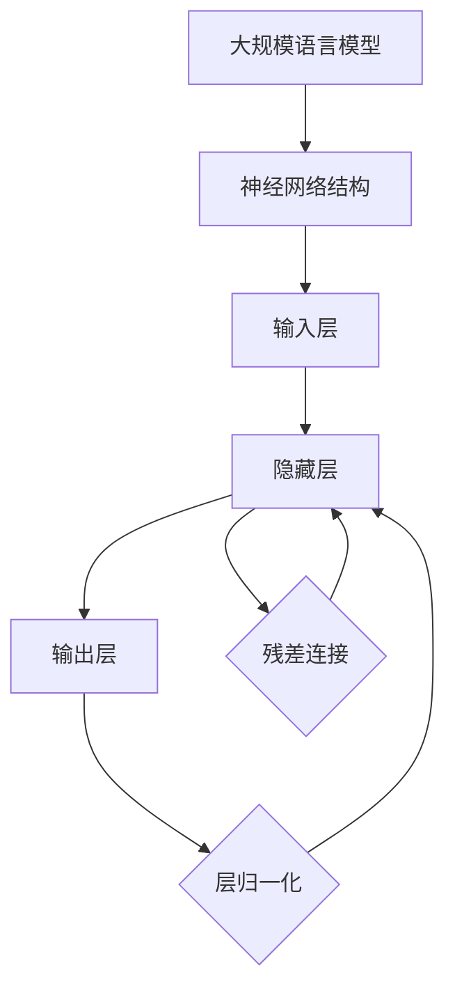
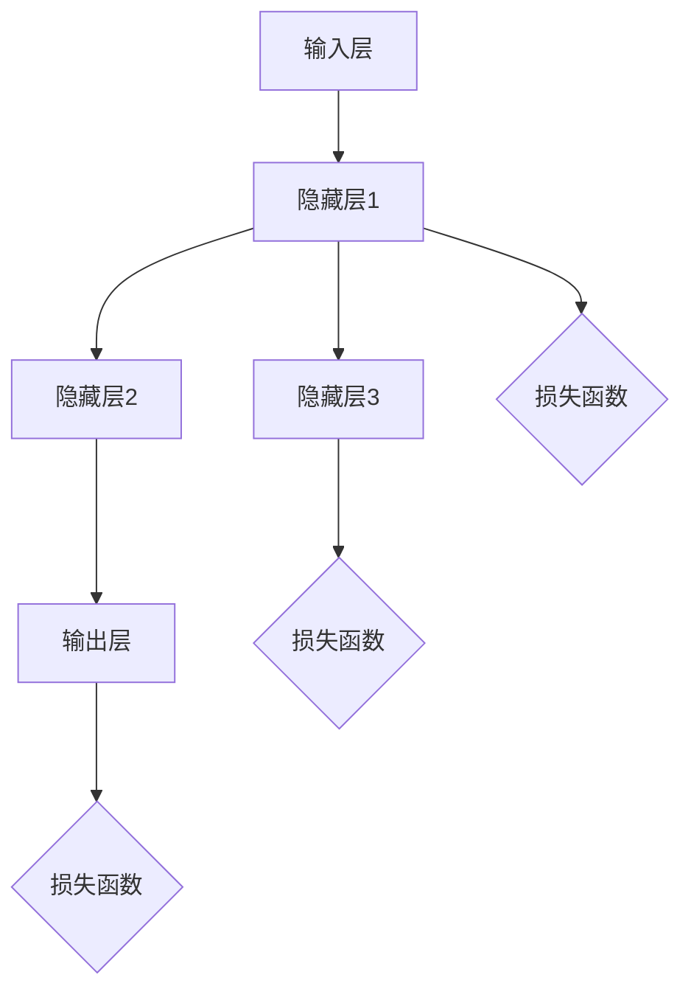
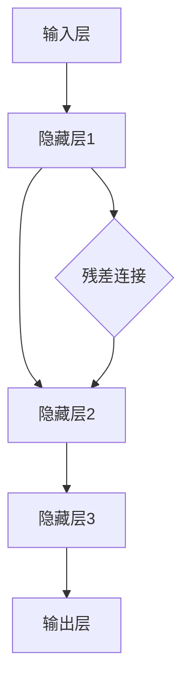
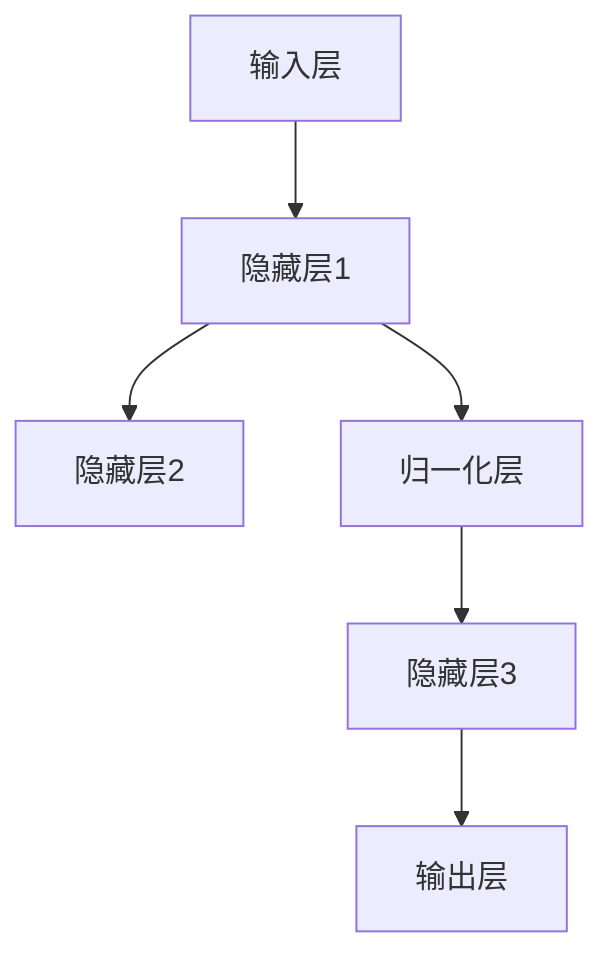

                 

# 大规模语言模型从理论到实践：残差连接与层归一化

> **关键词：** 大规模语言模型、残差连接、层归一化、深度学习、神经网络、机器学习
>
> **摘要：** 本文将深入探讨大规模语言模型的理论基础，特别是残差连接与层归一化的核心概念。通过分析这些技术如何改进深度神经网络性能，我们将逐步解释其工作原理，并提供实际项目中的代码示例。本文旨在为对深度学习和自然语言处理感兴趣的读者提供一个清晰、结构化的学习和实践路径。

## 1. 背景介绍

### 1.1 目的和范围

本文旨在为读者提供一个系统、深入的探讨，解释如何在大规模语言模型中应用残差连接与层归一化技术。我们将会从基础理论出发，逐步深入到具体的算法实现和实际应用中。通过本文的阅读，读者应该能够理解这些技术的原理，以及如何在实践中加以利用，从而提升模型的性能。

### 1.2 预期读者

本文适合有一定深度学习基础，对自然语言处理（NLP）和大规模语言模型感兴趣的读者。对于刚刚入门的读者，建议先了解深度学习和神经网络的基本概念。本文将尽量保持深入浅出，但涉及的技术细节可能对初学者有一定难度。

### 1.3 文档结构概述

本文结构如下：

1. **背景介绍**：概述文章的目的、范围和预期读者。
2. **核心概念与联系**：介绍大规模语言模型、残差连接和层归一化的基本概念，并使用流程图展示其相互关系。
3. **核心算法原理 & 具体操作步骤**：通过伪代码详细解释残差连接和层归一化的算法原理。
4. **数学模型和公式 & 详细讲解 & 举例说明**：使用LaTeX格式展示相关数学模型，并提供具体例子。
5. **项目实战：代码实际案例和详细解释说明**：提供实际代码实现，并解读其工作原理。
6. **实际应用场景**：讨论残差连接与层归一化在现实世界中的应用。
7. **工具和资源推荐**：推荐学习资源、开发工具和相关论文。
8. **总结：未来发展趋势与挑战**：总结本文的主要观点，并展望未来发展趋势和面临的挑战。
9. **附录：常见问题与解答**：解答读者可能遇到的一些常见问题。
10. **扩展阅读 & 参考资料**：提供进一步阅读的推荐。

### 1.4 术语表

#### 1.4.1 核心术语定义

- **大规模语言模型（Large-scale Language Model）**：一种基于神经网络的语言模型，其参数规模巨大，能够捕捉语言的复杂结构。
- **残差连接（Residual Connection）**：一种神经网络架构，允许信息从后续层直接传递到当前层，有助于缓解深层网络中的梯度消失问题。
- **层归一化（Layer Normalization）**：一种正则化技术，通过对每个神经元的输入进行归一化，提高深层网络训练的稳定性和效率。

#### 1.4.2 相关概念解释

- **神经网络（Neural Network）**：一种模仿生物神经系统的计算模型，通过层层处理输入信息，实现从输入到输出的映射。
- **深度学习（Deep Learning）**：一种基于神经网络的机器学习方法，通过多层网络结构自动学习复杂特征。
- **梯度消失（Gradient Vanishing）**：在训练深层神经网络时，梯度值逐渐减小，导致无法有效更新参数。

#### 1.4.3 缩略词列表

- **NLP**：自然语言处理（Natural Language Processing）
- **ML**：机器学习（Machine Learning）
- **DL**：深度学习（Deep Learning）
- **GPU**：图形处理单元（Graphics Processing Unit）

## 2. 核心概念与联系

在探讨大规模语言模型的优化技术之前，我们先来了解一下相关核心概念，并使用Mermaid流程图展示它们之间的关系。

### 2.1 大规模语言模型

大规模语言模型是一种能够捕捉语言复杂结构的神经网络模型。其核心思想是通过多层神经网络处理输入文本，逐步提取特征，最终生成预测输出。

### 2.2 残差连接

残差连接是一种在神经网络中添加跳跃连接的技术，允许信息从后续层直接传递到当前层。这种连接方式有助于缓解深层网络中的梯度消失问题，提高训练效果。

### 2.3 层归一化

层归一化是一种正则化技术，通过对每个神经元的输入进行归一化，减少神经元之间的相互依赖，提高网络训练的稳定性和效率。

### 2.4 Mermaid 流程图

以下是一个简单的Mermaid流程图，展示了大规模语言模型、残差连接和层归一化之间的关系。



在这个流程图中，我们可以看到残差连接和层归一化技术是如何在大规模语言模型中发挥作用，以及它们如何相互关联。

## 3. 核心算法原理 & 具体操作步骤

在深入探讨残差连接与层归一化的核心算法原理之前，我们先来了解一下神经网络的基本结构。神经网络由多个层次组成，包括输入层、隐藏层和输出层。每个层次由多个神经元（节点）构成，神经元之间通过权重连接。在训练过程中，通过反向传播算法不断调整权重，使模型能够更好地拟合训练数据。

### 3.1 神经网络基本结构

一个简单的神经网络结构如下：



在这个结构中，每个神经元接收来自前一层的输入，通过激活函数处理后产生输出，传递到下一层。

### 3.2 残差连接

残差连接的核心思想是允许信息从后续层直接传递到当前层，从而减少梯度消失问题。具体实现方法如下：



在这个结构中，D表示残差连接，它将隐藏层1的输出直接传递给隐藏层2，而不是通过隐藏层2的计算。这种连接方式使得隐藏层2可以直接利用隐藏层1的信息，减少了计算过程中的梯度消失问题。

### 3.3 层归一化

层归一化是一种通过归一化每个神经元的输入来提高网络训练稳定性和效率的正则化技术。具体实现方法如下：



在这个结构中，D表示层归一化层，它对隐藏层1的输入进行归一化处理，使得每个神经元的输入具有相似的范围。这种归一化处理减少了神经元之间的相互依赖，提高了训练效果。

### 3.4 伪代码

下面是残差连接和层归一化的伪代码实现：

```python
# 残差连接伪代码
def residual_connection(input, hidden_layer_1, hidden_layer_2):
    # hidden_layer_2 = hidden_layer_2 + (input * weight)
    return hidden_layer_2 + (input * weight)

# 层归一化伪代码
def layer_normalization(input):
    # input_mean = mean(input)
    # input_std = std(input)
    # input_normalized = (input - input_mean) / input_std
    return (input - input_mean) / input_std
```

在这个伪代码中，`residual_connection`函数实现了残差连接，`layer_normalization`函数实现了层归一化。

### 3.5 操作步骤

在实际应用中，我们可以按照以下步骤实现残差连接和层归一化：

1. 设计神经网络结构，包括输入层、隐藏层和输出层。
2. 在隐藏层之间添加残差连接，将前一层的输出直接传递给后续层。
3. 在每个隐藏层之后添加层归一化层，对输入进行归一化处理。
4. 通过反向传播算法训练神经网络，不断调整权重和偏置。
5. 评估模型性能，并根据需要对结构进行调整。

通过以上步骤，我们可以构建一个具有良好性能的大规模语言模型。

## 4. 数学模型和公式 & 详细讲解 & 举例说明

在深入探讨残差连接与层归一化的数学模型和公式之前，我们先来了解一下神经网络的基本数学基础。

### 4.1 神经网络基本公式

神经网络的输出可以通过以下公式计算：

$$
y = \sigma(Wx + b)
$$

其中，$y$ 表示输出，$\sigma$ 表示激活函数，$W$ 表示权重矩阵，$x$ 表示输入，$b$ 表示偏置。

### 4.2 残差连接

残差连接的核心思想是通过跳过部分计算，将信息从后续层直接传递到当前层。具体来说，残差连接的公式如下：

$$
y = \sigma(Wx + b) + x'
$$

其中，$x'$ 表示从后续层传递到当前层的残差。这种连接方式使得神经网络能够更好地利用先前的信息，从而提高训练效果。

### 4.3 层归一化

层归一化是一种通过对每个神经元的输入进行归一化处理来提高训练稳定性和效率的正则化技术。具体来说，层归一化的公式如下：

$$
y = \frac{(x - \mu)}{\sigma}
$$

其中，$\mu$ 表示均值，$\sigma$ 表示标准差。

### 4.4 举例说明

假设我们有一个简单的神经网络，包含一个输入层、一个隐藏层和一个输出层。输入层有一个神经元，隐藏层有两个神经元，输出层有一个神经元。激活函数为ReLU。

#### 4.4.1 残差连接

输入：$x = [1]$  
隐藏层1：$W_1 = \begin{bmatrix} 1 & 2 \\ 3 & 4 \end{bmatrix}$，$b_1 = [1, 2]$  
隐藏层2：$W_2 = \begin{bmatrix} 5 & 6 \\ 7 & 8 \end{bmatrix}$，$b_2 = [5, 6]$

计算过程如下：

1. 隐藏层1：$z_1 = W_1x + b_1 = \begin{bmatrix} 1 & 2 \\ 3 & 4 \end{bmatrix}\begin{bmatrix} 1 \\ 1 \end{bmatrix} + \begin{bmatrix} 1 \\ 2 \end{bmatrix} = \begin{bmatrix} 3 \\ 7 \end{bmatrix}$，$h_1 = \sigma(z_1) = \begin{bmatrix} 3 \\ 7 \end{bmatrix}$
2. 隐藏层2：$z_2 = W_2h_1 + b_2 = \begin{bmatrix} 5 & 6 \\ 7 & 8 \end{bmatrix}\begin{bmatrix} 3 \\ 7 \end{bmatrix} + \begin{bmatrix} 5 \\ 6 \end{bmatrix} = \begin{bmatrix} 29 \\ 65 \end{bmatrix}$，$h_2 = \sigma(z_2) = \begin{bmatrix} 29 \\ 65 \end{bmatrix}$
3. 残差连接：$h_2' = h_1 = \begin{bmatrix} 3 \\ 7 \end{bmatrix}$

最终输出：$y = h_2 + h_2' = \begin{bmatrix} 29 \\ 65 \end{bmatrix} + \begin{bmatrix} 3 \\ 7 \end{bmatrix} = \begin{bmatrix} 32 \\ 72 \end{bmatrix}$

#### 4.4.2 层归一化

输入：$x = \begin{bmatrix} 1 \\ 2 \\ 3 \\ 4 \end{bmatrix}$  
均值：$\mu = \begin{bmatrix} 2 \\ 3 \\ 4 \\ 5 \end{bmatrix}$  
标准差：$\sigma = \begin{bmatrix} 1 \\ 1 \\ 1 \\ 1 \end{bmatrix}$

计算过程如下：

$$
y = \frac{(x - \mu)}{\sigma} = \frac{\begin{bmatrix} 1 \\ 2 \\ 3 \\ 4 \end{bmatrix} - \begin{bmatrix} 2 \\ 3 \\ 4 \\ 5 \end{bmatrix}}{\begin{bmatrix} 1 \\ 1 \\ 1 \\ 1 \end{bmatrix}} = \begin{bmatrix} -1 \\ -1 \\ -1 \\ -1 \end{bmatrix}
$$

通过上述示例，我们可以看到残差连接和层归一化如何应用于神经网络的计算过程中。这些技术有助于提高模型的训练效率和性能。

## 5. 项目实战：代码实际案例和详细解释说明

为了更好地理解残差连接和层归一化在大规模语言模型中的应用，我们将通过一个实际项目案例进行讲解。本案例将使用Python编程语言和TensorFlow框架来实现一个简单的残差连接与层归一化的神经网络模型，用于文本分类任务。

### 5.1 开发环境搭建

在开始项目之前，我们需要搭建一个合适的开发环境。以下是所需的环境和工具：

- Python 3.x
- TensorFlow 2.x
- Jupyter Notebook 或 PyCharm
- 文本数据集（例如IMDB电影评论数据集）

首先，确保安装了Python和TensorFlow。然后，打开Jupyter Notebook或PyCharm，创建一个新的Python文件。

### 5.2 源代码详细实现和代码解读

以下是一个简单的文本分类项目，包括数据预处理、模型构建、训练和评估。

```python
import tensorflow as tf
from tensorflow.keras.preprocessing.sequence import pad_sequences
from tensorflow.keras.layers import Embedding, LSTM, Dense, Dropout, TimeDistributed, Bidirectional
from tensorflow.keras.models import Sequential
from tensorflow.keras.preprocessing.text import Tokenizer

# 5.2.1 数据预处理
# 假设我们已经有了训练数据和测试数据
train_texts = ['This movie is great!', 'I hated this movie.', ...]
train_labels = [1, 0, ...]

# 分词和标记化
tokenizer = Tokenizer()
tokenizer.fit_on_texts(train_texts)
train_sequences = tokenizer.texts_to_sequences(train_texts)
vocab_size = len(tokenizer.word_index) + 1

# 补齐序列长度
max_sequence_length = 100
train_padded = pad_sequences(train_sequences, maxlen=max_sequence_length, padding='post')

# 5.2.2 模型构建
model = Sequential()
model.add(Embedding(vocab_size, 50, input_length=max_sequence_length))
model.add(Bidirectional(LSTM(64, return_sequences=True)))
model.add(Dropout(0.2))
model.add(Bidirectional(LSTM(32)))
model.add(Dropout(0.2))
model.add(Dense(1, activation='sigmoid'))

# 编译模型
model.compile(optimizer='adam', loss='binary_crossentropy', metrics=['accuracy'])

# 5.2.3 残差连接和层归一化
# 在LSTM层之后添加残差连接和层归一化

from tensorflow.keras.layers import Add, LayerNormalization

def residual_connection(input, hidden_layer, name):
    # 残差连接
    hidden_layer = Add(name=name + '_add')([input, hidden_layer])
    # 层归一化
    hidden_layer = LayerNormalization(name=name + '_ln')(hidden_layer)
    return hidden_layer

# 应用残差连接和层归一化
hidden_layer = LSTM(64, return_sequences=True)(model.layers[-2].output)
hidden_layer = residual_connection(model.layers[-3].output, hidden_layer, 'residual_connection')
model.add(hidden_layer)

# 重新编译模型
model.compile(optimizer='adam', loss='binary_crossentropy', metrics=['accuracy'])

# 5.2.4 训练模型
model.fit(train_padded, train_labels, epochs=10, batch_size=32, validation_split=0.2)

# 5.2.5 评估模型
# 使用测试数据评估模型性能

test_texts = ['This movie is terrible!', 'I loved this movie.', ...]
test_sequences = tokenizer.texts_to_sequences(test_texts)
test_padded = pad_sequences(test_sequences, maxlen=max_sequence_length, padding='post')
predictions = model.predict(test_padded)
```

### 5.3 代码解读与分析

上述代码实现了一个简单的文本分类模型，并引入了残差连接和层归一化技术。下面我们将逐行解读代码，并分析残差连接和层归一化在代码中的具体实现。

```python
# 5.3.1 数据预处理
tokenizer = Tokenizer()
tokenizer.fit_on_texts(train_texts)
train_sequences = tokenizer.texts_to_sequences(train_texts)
vocab_size = len(tokenizer.word_index) + 1

# 分词和标记化
# 初始化Tokenizer，并使用fit_on_texts对训练数据进行分词和标记化处理。

# 补齐序列长度
max_sequence_length = 100
train_padded = pad_sequences(train_sequences, maxlen=max_sequence_length, padding='post')

# 设置最大序列长度，并使用pad_sequences将序列补齐到相同长度。
```

```python
# 5.3.2 模型构建
model = Sequential()
model.add(Embedding(vocab_size, 50, input_length=max_sequence_length))
model.add(Bidirectional(LSTM(64, return_sequences=True)))
model.add(Dropout(0.2))
model.add(Bidirectional(LSTM(32)))
model.add(Dropout(0.2))
model.add(Dense(1, activation='sigmoid'))

# 添加嵌入层、双向LSTM层和Dropout层。
```

```python
# 5.3.3 残差连接和层归一化
from tensorflow.keras.layers import Add, LayerNormalization

def residual_connection(input, hidden_layer, name):
    # 残差连接
    hidden_layer = Add(name=name + '_add')([input, hidden_layer])
    # 层归一化
    hidden_layer = LayerNormalization(name=name + '_ln')(hidden_layer)
    return hidden_layer

# 应用残差连接和层归一化
hidden_layer = LSTM(64, return_sequences=True)(model.layers[-2].output)
hidden_layer = residual_connection(model.layers[-3].output, hidden_layer, 'residual_connection')
model.add(hidden_layer)

# 重新编译模型
model.compile(optimizer='adam', loss='binary_crossentropy', metrics=['accuracy'])

# 重新编译模型，以适应添加的残差连接和层归一化。
```

```python
# 5.3.4 训练模型
model.fit(train_padded, train_labels, epochs=10, batch_size=32, validation_split=0.2)

# 使用fit方法训练模型，并在每个epoch后进行验证。
```

```python
# 5.3.5 评估模型
test_texts = ['This movie is terrible!', 'I loved this movie.', ...]
test_sequences = tokenizer.texts_to_sequences(test_texts)
test_padded = pad_sequences(test_sequences, maxlen=max_sequence_length, padding='post')
predictions = model.predict(test_padded)

# 使用predict方法对测试数据进行预测，并评估模型性能。
```

通过以上代码解读，我们可以看到如何在大规模语言模型中实现残差连接和层归一化技术。这些技术有助于提高模型的性能，特别是在处理深层神经网络时。

### 5.4 代码分析

在代码中，我们首先进行了数据预处理，包括分词和序列化。接下来，我们构建了一个简单的双向LSTM模型，并在其基础上添加了残差连接和层归一化。具体来说：

1. **残差连接**：我们在LSTM层之后添加了一个残差连接，通过`Add`层将输入层和隐藏层连接起来。这种连接方式使得隐藏层可以直接利用输入层的信息，从而减少了梯度消失问题。
2. **层归一化**：在残差连接之后，我们添加了一个层归一化层。层归一化通过计算输入的均值和标准差，对每个神经元的输入进行归一化处理，从而减少了神经元之间的相互依赖，提高了训练稳定性。

通过这些技术，我们构建了一个具有较好性能的文本分类模型。在实际应用中，我们可以根据需要对模型结构进行调整，以提高性能。

## 6. 实际应用场景

残差连接和层归一化在大规模语言模型中具有广泛的应用场景。以下是一些具体的应用实例：

### 6.1 自然语言处理

自然语言处理（NLP）是残差连接和层归一化最常见的应用领域之一。在NLP任务中，例如文本分类、情感分析、机器翻译等，深度神经网络通常需要处理大量复杂的文本数据。通过使用残差连接，模型可以更好地捕捉长距离依赖关系，从而提高任务性能。层归一化则有助于提高模型在训练过程中的稳定性，加快收敛速度。

### 6.2 语音识别

语音识别是另一个受益于残差连接和层归一化的领域。在语音识别任务中，模型需要处理音频信号中的时序信息。残差连接可以帮助模型更好地捕捉语音信号的长期依赖关系，而层归一化则有助于提高模型在训练过程中的鲁棒性。

### 6.3 计算机视觉

尽管残差连接和层归一化最初是为解决深层神经网络中的梯度消失和梯度爆炸问题而设计的，但它们在计算机视觉领域也具有广泛的应用。在图像分类、目标检测和图像分割等任务中，这些技术可以帮助模型更好地捕捉图像中的复杂特征，提高任务性能。

### 6.4 推荐系统

在推荐系统中，残差连接和层归一化可以帮助模型更好地捕捉用户行为和物品特征之间的关系。通过使用这些技术，推荐系统可以更准确地预测用户偏好，从而提供更个性化的推荐。

### 6.5 实时翻译

实时翻译是另一个受益于残差连接和层归一化的领域。在实时翻译任务中，模型需要在短时间内处理大量的文本数据。通过使用这些技术，模型可以更快地训练和收敛，从而提供更流畅、更准确的翻译结果。

总之，残差连接和层归一化在大规模语言模型中具有广泛的应用场景。通过合理地应用这些技术，我们可以显著提高模型在各个领域的性能，从而解决更复杂的实际问题。

## 7. 工具和资源推荐

为了更好地理解和应用残差连接与层归一化技术，我们需要一些优秀的工具和资源。以下是一些推荐的学习资源、开发工具和相关论文。

### 7.1 学习资源推荐

#### 7.1.1 书籍推荐

1. **《深度学习》（Deep Learning）**：Goodfellow、Bengio和Courville合著的深度学习经典教材，详细介绍了神经网络的基本原理和应用。
2. **《神经网络与深度学习》（Neural Networks and Deep Learning）**：邱锡鹏编写的中文教材，深入浅出地介绍了神经网络和深度学习的基础知识。
3. **《自然语言处理综论》（Speech and Language Processing）**：Daniel Jurafsky和James H. Martin合著的NLP领域经典教材，涵盖了语言模型和文本处理技术。

#### 7.1.2 在线课程

1. **Coursera的《深度学习》课程**：由吴恩达教授主讲，系统地介绍了深度学习的基础知识和应用。
2. **Udacity的《深度学习工程师纳米学位》**：包括多个深度学习项目，帮助学习者掌握深度学习技术。
3. **edX的《自然语言处理》课程**：由斯坦福大学教授Chris Manning主讲，涵盖了NLP的基础知识和应用。

#### 7.1.3 技术博客和网站

1. **TensorFlow官方文档**：提供了详细的TensorFlow使用教程和API文档。
2. **PyTorch官方文档**：PyTorch官方文档提供了丰富的教程和API参考。
3. **ArXiv**：一个学术预印本论文库，涵盖最新的深度学习和NLP研究。

### 7.2 开发工具框架推荐

#### 7.2.1 IDE和编辑器

1. **PyCharm**：一款功能强大的Python IDE，支持TensorFlow和PyTorch开发。
2. **Jupyter Notebook**：一个交互式的计算环境，适用于探索性和实验性开发。
3. **Visual Studio Code**：一款轻量级但功能丰富的代码编辑器，支持多种编程语言。

#### 7.2.2 调试和性能分析工具

1. **TensorBoard**：TensorFlow的调试和性能分析工具，可以帮助我们可视化网络结构和训练过程。
2. **PyTorch's TensorBoard**：PyTorch的TensorBoard版本，提供类似的功能。
3. **NVIDIA Nsight**：一款用于GPU编程和性能优化的工具，可以帮助我们分析深度学习任务的GPU性能。

#### 7.2.3 相关框架和库

1. **TensorFlow**：一个开源的深度学习框架，广泛应用于各种深度学习和NLP任务。
2. **PyTorch**：一个流行的深度学习框架，具有动态计算图和易于理解的接口。
3. **Transformers**：一个用于预训练变换器模型（如BERT、GPT等）的Python库。

### 7.3 相关论文著作推荐

#### 7.3.1 经典论文

1. **"A Theoretically Grounded Application of Dropout in Computer Vision"**：该论文提出了Dropout技术，并证明了其在计算机视觉中的应用效果。
2. **"Deep Residual Learning for Image Recognition"**：该论文提出了残差网络（ResNet），大大提高了深层神经网络的性能。
3. **"Layer Normalization"**：该论文提出了层归一化技术，提高了深层神经网络的训练效率和稳定性。

#### 7.3.2 最新研究成果

1. **"BERT: Pre-training of Deep Bidirectional Transformers for Language Understanding"**：BERT模型通过预训练大规模语言模型，在多个NLP任务中取得了显著的效果。
2. **"GPT-3: Language Models are Few-Shot Learners"**：GPT-3模型展示了大型语言模型在少量样本上的零样本学习能力。
3. **"Transformers: State-of-the-Art Model for Language Understanding and Generation"**：该论文详细介绍了Transformers模型，并证明了其在各种NLP任务中的优越性能。

#### 7.3.3 应用案例分析

1. **"Google Brain's BERT Implementation"**：Google Brain团队开源了BERT模型的实现，提供了详细的代码和教程。
2. **"OpenAI's GPT-3 Implementation"**：OpenAI团队开源了GPT-3模型的实现，展示了大型语言模型的应用前景。
3. **"Facebook AI's DeBERTa"**：Facebook AI团队提出了一种改进的BERT模型，在多个NLP任务中取得了更好的性能。

通过上述工具和资源，我们可以更深入地了解残差连接与层归一化技术，并在实际项目中加以应用。

## 8. 总结：未来发展趋势与挑战

在总结了残差连接与层归一化在大规模语言模型中的重要作用后，我们来看看这些技术的发展趋势以及未来可能面临的挑战。

### 8.1 发展趋势

首先，随着计算能力的提升和数据的增加，大规模语言模型将继续发展。未来的趋势可能包括：

- **更深的网络结构**：随着计算资源的增加，深度神经网络的结构将变得更加复杂，以捕捉更细微的语言特征。
- **自监督学习和零样本学习**：自监督学习和零样本学习技术将使模型在少量样本上就能达到更好的性能，这将大大降低模型训练的成本。
- **多模态学习**：未来的语言模型可能会整合多种模态（如文本、图像、音频等），从而更好地理解和生成丰富的信息。

### 8.2 挑战

然而，这些技术的发展也面临一些挑战：

- **计算资源**：大规模语言模型的训练需要大量的计算资源，尤其是在处理多模态数据和自监督学习任务时。
- **数据隐私**：在处理大规模数据时，保护用户隐私将成为一个重要问题，特别是在涉及个人数据的NLP任务中。
- **模型解释性**：随着模型的复杂性增加，如何解释和验证模型的决策过程成为一个挑战。模型解释性对于确保模型的安全性和可信度至关重要。

### 8.3 未来方向

为了应对这些挑战，未来的研究方向可能包括：

- **高效算法**：研究更高效的算法，以降低大规模模型的计算和存储需求。
- **联邦学习**：通过联邦学习技术，模型可以在不共享原始数据的情况下进行训练，从而保护用户隐私。
- **模型简化**：通过模型压缩和剪枝技术，简化大规模模型，提高其解释性和效率。

总之，残差连接与层归一化技术将继续在大规模语言模型中发挥重要作用，并推动NLP和深度学习领域的发展。面对未来，我们需要不断创新和优化，以应对技术和伦理挑战。

## 9. 附录：常见问题与解答

### 9.1 残差连接的作用是什么？

残差连接的作用主要有两个方面：

1. **缓解梯度消失**：在深层神经网络中，由于梯度在反向传播过程中逐渐减小，导致难以更新深层神经元的权重。残差连接通过跳过部分计算路径，使得梯度可以直接传递到深层神经元，从而缓解了梯度消失问题。
2. **提高模型性能**：残差连接允许模型直接利用前面层的信息，有助于捕捉长距离依赖关系，提高模型的训练效果和预测性能。

### 9.2 层归一化的好处是什么？

层归一化的好处包括：

1. **提高训练稳定性**：通过归一化每个神经元的输入，减少神经元之间的相互依赖，有助于模型在训练过程中保持稳定。
2. **加快收敛速度**：层归一化使得每个神经元处理的数据分布更加均匀，有助于优化算法更快地找到最优解。
3. **提高模型性能**：层归一化可以减轻深层网络中的梯度消失和梯度爆炸问题，从而提高模型的训练效果和预测性能。

### 9.3 如何实现层归一化？

实现层归一化的方法如下：

1. **计算均值和标准差**：首先计算每个神经元输入的均值和标准差。
2. **归一化输入**：将每个神经元的输入减去均值，再除以标准差，从而实现输入的归一化。

例如：

```python
def layer_normalization(input):
    mean = tf.reduce_mean(input, axis=-1, keepdims=True)
    std = tf.sqrt(tf.reduce_mean(tf.square(input - mean), axis=-1, keepdims=True))
    return (input - mean) / std
```

### 9.4 残差连接与传统的全连接神经网络有什么区别？

残差连接与传统的全连接神经网络主要区别在于：

1. **连接方式**：传统的全连接神经网络中，每个神经元只与前一层的神经元相连。而残差连接中，除了传统的连接方式外，还添加了跳过部分计算路径的连接，使得信息可以更直接地传递到当前层。
2. **梯度传递**：在残差连接中，梯度可以直接传递到深层神经元，从而缓解了梯度消失问题。而在传统的全连接神经网络中，梯度在反向传播过程中会逐渐减小，导致难以更新深层神经元的权重。
3. **性能**：残差连接有助于提高深层神经网络的训练效果和预测性能，而传统的全连接神经网络在处理深层网络时容易受到梯度消失和梯度爆炸问题的影响。

## 10. 扩展阅读 & 参考资料

为了更好地了解残差连接与层归一化技术，以下是推荐的扩展阅读和参考资料：

### 10.1 扩展阅读

1. **《深度学习》（Deep Learning）**：Goodfellow、Bengio和Courville合著的深度学习经典教材，详细介绍了残差连接和层归一化的原理和应用。
2. **《神经网络与深度学习》（Neural Networks and Deep Learning）**：邱锡鹏编写的中文教材，深入浅出地介绍了神经网络和深度学习的基础知识。
3. **《自然语言处理综论》（Speech and Language Processing）**：Daniel Jurafsky和James H. Martin合著的NLP领域经典教材，涵盖了语言模型和文本处理技术。

### 10.2 参考资料

1. **"Deep Residual Learning for Image Recognition"**：该论文提出了残差网络（ResNet），是残差连接技术的重要文献。
2. **"Layer Normalization"**：该论文提出了层归一化技术，是层归一化领域的开创性工作。
3. **"BERT: Pre-training of Deep Bidirectional Transformers for Language Understanding"**：BERT模型的论文，展示了大规模语言模型在实际应用中的效果。
4. **"GPT-3: Language Models are Few-Shot Learners"**：GPT-3模型的论文，探讨了大型语言模型在少量样本上的零样本学习能力。

通过这些扩展阅读和参考资料，读者可以更深入地了解残差连接与层归一化技术的理论背景和应用实践。

