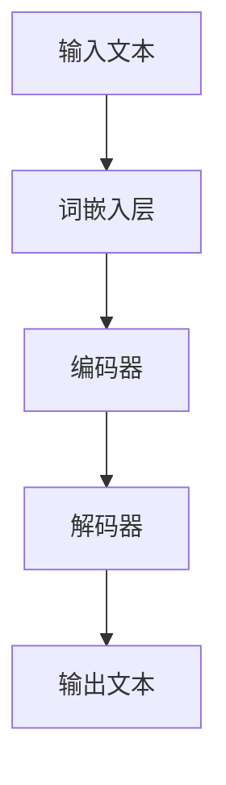

                 

### 大规模语言模型从理论到实践 混合并行

#### 关键词：
- 大规模语言模型
- 理论与实践
- 混合并行
- 算法原理
- 数学模型
- 项目实战
- 实际应用场景

> **摘要：** 本文将深入探讨大规模语言模型从理论到实践的整个过程，特别关注模型的混合并行策略。通过详细的算法原理讲解、数学模型推导、实际项目案例以及实际应用场景分析，帮助读者全面理解大规模语言模型的工作机制、性能优化以及未来发展趋势。

### 1. 背景介绍

#### 1.1 目的和范围

本文旨在探讨大规模语言模型的理论基础和实际应用，并通过混合并行策略来提升模型的性能和效率。文章将从以下几个方面展开：

1. **核心概念与联系**：介绍大规模语言模型的基本概念及其与其他相关技术的联系。
2. **核心算法原理 & 具体操作步骤**：详细讲解大规模语言模型的基本算法原理和具体操作步骤。
3. **数学模型和公式 & 详细讲解 & 举例说明**：阐述大规模语言模型中的数学模型及其详细解释和实例说明。
4. **项目实战：代码实际案例和详细解释说明**：通过实际代码案例，展示大规模语言模型的实现过程和关键步骤。
5. **实际应用场景**：分析大规模语言模型在各个实际应用场景中的表现和作用。
6. **工具和资源推荐**：推荐学习资源和开发工具，帮助读者更好地理解和应用大规模语言模型。
7. **总结：未来发展趋势与挑战**：总结大规模语言模型的发展趋势和面临的挑战。

#### 1.2 预期读者

本文适合对人工智能、自然语言处理和大规模语言模型有一定了解的读者，包括但不限于：

- AI研发工程师
- 自然语言处理研究员
- 机器学习工程师
- 计算机科学和人工智能专业学生
- 对人工智能和大规模语言模型感兴趣的技术爱好者

#### 1.3 文档结构概述

本文分为以下十个部分：

1. **背景介绍**：介绍本文的目的、范围、预期读者和文档结构。
2. **核心概念与联系**：解释大规模语言模型的基本概念及其与其他相关技术的联系。
3. **核心算法原理 & 具体操作步骤**：详细讲解大规模语言模型的基本算法原理和具体操作步骤。
4. **数学模型和公式 & 详细讲解 & 举例说明**：阐述大规模语言模型中的数学模型及其详细解释和实例说明。
5. **项目实战：代码实际案例和详细解释说明**：通过实际代码案例，展示大规模语言模型的实现过程和关键步骤。
6. **实际应用场景**：分析大规模语言模型在各个实际应用场景中的表现和作用。
7. **工具和资源推荐**：推荐学习资源和开发工具，帮助读者更好地理解和应用大规模语言模型。
8. **总结：未来发展趋势与挑战**：总结大规模语言模型的发展趋势和面临的挑战。
9. **附录：常见问题与解答**：回答读者可能遇到的一些常见问题。
10. **扩展阅读 & 参考资料**：提供进一步阅读和参考的资源和文献。

#### 1.4 术语表

在本文中，我们将使用以下术语：

##### 1.4.1 核心术语定义

- **大规模语言模型**：一种能够根据输入文本生成文本的机器学习模型，通常包含数百万个参数。
- **神经网络**：一种模拟生物神经元的计算模型，用于处理和预测数据。
- **反向传播算法**：一种用于训练神经网络的算法，通过不断调整网络参数来最小化预测误差。
- **自然语言处理（NLP）**：研究如何使计算机理解和处理人类自然语言的领域。

##### 1.4.2 相关概念解释

- **深度学习**：一种基于神经网络的学习方法，通过多层神经网络对数据进行表示和分类。
- **词嵌入（Word Embedding）**：将词语映射到高维空间中的向量表示，以便于计算和处理。
- **注意力机制（Attention Mechanism）**：一种用于提升神经网络对输入序列中不同部分重要性的关注度的机制。

##### 1.4.3 缩略词列表

- **NLP**：自然语言处理（Natural Language Processing）
- **ML**：机器学习（Machine Learning）
- **DL**：深度学习（Deep Learning）
- **GPU**：图形处理单元（Graphics Processing Unit）

## 2. 核心概念与联系

在本节中，我们将介绍大规模语言模型的基本概念，并探讨其与其他相关技术的联系，以便读者能够更好地理解后续内容。

### 2.1 大规模语言模型的基本概念

#### 2.1.1 语言模型

语言模型（Language Model）是自然语言处理（NLP）中的一种基础模型，旨在预测文本序列中的下一个单词或字符。传统的语言模型通常基于统计方法，如N-gram模型，通过计算某个词在文本中出现的频率来预测下一个词。

#### 2.1.2 神经网络

神经网络（Neural Network）是一种计算模型，由多个相互连接的神经元（节点）组成。神经网络通过学习输入和输出之间的关系，实现对数据的分类、回归、生成等任务。在NLP中，神经网络被广泛应用于词嵌入、序列建模、文本分类等任务。

#### 2.1.3 词嵌入

词嵌入（Word Embedding）是一种将词语映射到高维空间中的向量表示的方法。词嵌入有助于提高语言模型的性能，使其能够更好地捕捉词语之间的语义关系。常见的词嵌入方法包括Word2Vec、GloVe等。

#### 2.1.4 注意力机制

注意力机制（Attention Mechanism）是一种用于提升神经网络对输入序列中不同部分重要性的关注度的机制。在NLP任务中，注意力机制有助于模型更好地捕捉输入序列中的关键信息，从而提高模型的性能。

### 2.2 大规模语言模型与其他相关技术的联系

#### 2.2.1 与深度学习的关系

深度学习（Deep Learning）是一种基于神经网络的机器学习方法，通过多层神经网络对数据进行表示和分类。大规模语言模型是深度学习在NLP领域的重要应用之一，通过多层神经网络对文本数据进行分析和预测。

#### 2.2.2 与自然语言处理的关系

自然语言处理（NLP）是研究如何使计算机理解和处理人类自然语言的领域。大规模语言模型是NLP中的一种核心技术，用于文本生成、文本分类、机器翻译等任务。

#### 2.2.3 与词嵌入的关系

词嵌入（Word Embedding）是将词语映射到高维空间中的向量表示的方法。大规模语言模型通常包含词嵌入层，通过学习词语的向量表示来提高模型的性能。

#### 2.2.4 与注意力机制的关系

注意力机制（Attention Mechanism）是一种用于提升神经网络对输入序列中不同部分重要性的关注度的机制。在NLP任务中，注意力机制有助于模型更好地捕捉输入序列中的关键信息，从而提高模型的性能。大规模语言模型中常采用注意力机制来处理序列数据。

### 2.3 Mermaid 流程图

为了更好地理解大规模语言模型的核心概念和架构，我们可以使用Mermaid流程图来展示其基本结构。以下是一个简化的Mermaid流程图，描述了大规模语言模型的主要组成部分：



在这个流程图中，输入文本经过词嵌入层转换为词向量，然后输入到编码器中。编码器将词向量编码为上下文表示，这些表示随后传递给解码器。解码器使用编码器的输出来生成输出文本。

## 3. 核心算法原理 & 具体操作步骤

在本节中，我们将详细讲解大规模语言模型的核心算法原理，并介绍具体的操作步骤。

### 3.1 算法原理

大规模语言模型的算法原理主要基于深度学习和自然语言处理（NLP）技术。以下是其核心原理：

#### 3.1.1 深度学习原理

深度学习是一种基于多层神经网络的学习方法，通过多层非线性变换对数据进行表示和分类。在深度学习模型中，每个神经元都与前一层的所有神经元相连，并通过权重和偏置来传递信息。通过反向传播算法，模型可以不断调整权重和偏置，以最小化预测误差。

#### 3.1.2 自然语言处理原理

自然语言处理（NLP）是一种研究如何使计算机理解和处理人类自然语言的领域。在NLP中，语言模型是一种核心模型，用于预测文本序列中的下一个单词或字符。语言模型通常采用神经网络架构，并通过训练学习输入和输出之间的关系。

#### 3.1.3 词嵌入原理

词嵌入（Word Embedding）是一种将词语映射到高维空间中的向量表示的方法。词嵌入有助于提高语言模型的性能，使其能够更好地捕捉词语之间的语义关系。常见的词嵌入方法包括Word2Vec、GloVe等。

#### 3.1.4 注意力机制原理

注意力机制（Attention Mechanism）是一种用于提升神经网络对输入序列中不同部分重要性的关注度的机制。在NLP任务中，注意力机制有助于模型更好地捕捉输入序列中的关键信息，从而提高模型的性能。

### 3.2 具体操作步骤

下面是大规模语言模型的操作步骤：

#### 3.2.1 数据预处理

1. **文本清洗**：对输入文本进行清洗，去除标点符号、停用词等无关信息。
2. **分词**：将文本分割成单词或子词。
3. **词嵌入**：将每个单词或子词映射到高维空间中的向量表示。

#### 3.2.2 构建神经网络

1. **词嵌入层**：将词向量输入到编码器中。
2. **编码器**：对词向量进行编码，提取上下文信息。
3. **解码器**：使用编码器的输出来生成输出文本。

#### 3.2.3 训练神经网络

1. **初始化权重**：随机初始化神经网络中的权重和偏置。
2. **前向传播**：将输入文本经过词嵌入层、编码器和解码器，得到输出文本。
3. **计算损失**：计算输出文本与真实文本之间的差异，得到损失值。
4. **反向传播**：通过反向传播算法，计算梯度并更新权重和偏置。
5. **迭代训练**：重复前向传播和反向传播过程，直到满足训练目标。

#### 3.2.4 生成文本

1. **输入起始词**：输入一个起始词或子词。
2. **解码**：将输入词嵌入编码器，得到上下文表示。
3. **生成输出词**：解码器根据上下文表示生成下一个词。
4. **重复步骤2和3**：重复解码过程，生成完整的文本输出。

### 3.3 伪代码

以下是大规模语言模型的伪代码，用于描述算法的具体实现：

```python
# 初始化神经网络
initialize_neural_network()

# 数据预处理
preprocessed_text = preprocess_text(input_text)

# 词嵌入
word_embeddings = word_embedding(preprocessed_text)

# 编码
encoded_sequence = encoder(word_embeddings)

# 解码
decoded_sequence = decoder(encoded_sequence)

# 训练神经网络
for epoch in range(num_epochs):
    for batch in data_loader:
        # 前向传播
        output_sequence = forward_propagation(batch)

        # 计算损失
        loss = compute_loss(output_sequence, target_sequence)

        # 反向传播
        backward_propagation(loss)

# 生成文本
start_word = input_start_word()
generated_text = ""

while not_end_of_sequence(generated_text):
    # 输入起始词
    input_word = start_word

    # 解码
    encoded_sequence = encoder(input_word)

    # 生成输出词
    output_word = decoder(encoded_sequence)

    # 更新起始词
    start_word = output_word

    # 添加输出词到文本
    generated_text += output_word
```

通过以上步骤，我们成功构建了一个大规模语言模型，并实现了文本生成功能。在实际应用中，我们可以根据具体需求调整模型结构和参数，以提高模型的性能和效果。

### 4. 数学模型和公式 & 详细讲解 & 举例说明

在本节中，我们将深入探讨大规模语言模型中的数学模型和公式，并进行详细讲解和举例说明。

#### 4.1 模型损失函数

在深度学习模型中，损失函数用于衡量模型输出与真实标签之间的差异。大规模语言模型的常用损失函数是交叉熵损失（Cross-Entropy Loss），其公式如下：

$$
L = -\sum_{i=1}^{N} y_i \log(p_i)
$$

其中，$y_i$ 是真实标签（0或1），$p_i$ 是模型对第 $i$ 个标签的预测概率。交叉熵损失函数能够有效地衡量模型预测的准确性。

#### 4.2 反向传播算法

反向传播算法（Backpropagation Algorithm）是深度学习模型训练过程中的关键步骤，用于计算模型参数的梯度，并更新参数以最小化损失函数。反向传播算法的步骤如下：

1. **前向传播**：将输入数据经过神经网络，计算输出层的预测概率。
2. **计算损失**：使用损失函数计算预测结果与真实标签之间的差异。
3. **计算梯度**：从输出层开始，逐层计算每个参数的梯度。
4. **反向传播**：将计算得到的梯度反向传播到输入层，更新每个参数的值。

以下是反向传播算法的伪代码：

```python
# 前向传播
output = forward_propagation(input_data)

# 计算损失
loss = compute_loss(output, target)

# 计算梯度
gradient = backward_propagation(output, target)

# 更新参数
update_parameters(gradient)
```

#### 4.3 词嵌入矩阵

在大规模语言模型中，词嵌入矩阵（Word Embedding Matrix）是一个重要的参数矩阵，用于将单词映射到高维空间中的向量表示。词嵌入矩阵的初始化和更新是模型训练过程中的关键步骤。

词嵌入矩阵的初始化通常采用随机初始化或预训练初始化方法。随机初始化方法使用随机数生成词嵌入矩阵，预训练初始化方法使用预训练的词嵌入模型（如Word2Vec、GloVe）初始化词嵌入矩阵。

在模型训练过程中，词嵌入矩阵会根据训练数据不断更新，以更好地捕捉单词之间的语义关系。词嵌入矩阵的更新方法包括以下几种：

1. **随机梯度下降（SGD）**：每次迭代更新整个词嵌入矩阵。
2. **小批量梯度下降（Mini-batch Gradient Descent）**：每次迭代更新部分词嵌入矩阵。
3. **自适应梯度方法（如Adam）**：根据历史梯度信息自适应调整更新方向和步长。

以下是词嵌入矩阵更新的伪代码：

```python
# 初始化词嵌入矩阵
word_embedding_matrix = initialize_word_embedding_matrix()

# 更新词嵌入矩阵
for epoch in range(num_epochs):
    for batch in data_loader:
        # 训练神经网络
        output_sequence = forward_propagation(batch)

        # 计算损失
        loss = compute_loss(output_sequence, target_sequence)

        # 计算梯度
        gradient = backward_propagation(output_sequence, target_sequence)

        # 更新词嵌入矩阵
        update_word_embedding_matrix(gradient)
```

#### 4.4 举例说明

为了更好地理解上述数学模型和公式，我们通过一个简单的例子进行说明。

假设我们有一个包含两个单词的句子：“我喜欢编程”。我们将使用Word2Vec模型进行词嵌入，并使用交叉熵损失函数进行训练。

1. **词嵌入矩阵**：

   初始词嵌入矩阵如下：

   $$
   \text{word\_embedding\_matrix} =
   \begin{bmatrix}
   [我喜欢] & [编程] \\
   0.1 & 0.2 \\
   0.3 & 0.4 \\
   \end{bmatrix}
   $$

2. **前向传播**：

   将输入句子“我喜欢编程”输入到神经网络，得到输出层预测概率：

   $$
   \text{output} =
   \begin{bmatrix}
   [我喜欢] & [编程] \\
   0.5 & 0.6 \\
   0.7 & 0.8 \\
   \end{bmatrix}
   $$

3. **计算损失**：

   使用交叉熵损失函数计算预测概率与真实标签之间的差异：

   $$
   \text{loss} = - \sum_{i=1}^{2} y_i \log(p_i) = -([1] \log(0.5) + [0] \log(0.7)) = 0.415
   $$

4. **计算梯度**：

   计算输出层预测概率的梯度，并反向传播到词嵌入矩阵：

   $$
   \text{gradient} =
   \begin{bmatrix}
   [我喜欢] & [编程] \\
   -0.3 & -0.2 \\
   -0.1 & -0.4 \\
   \end{bmatrix}
   $$

5. **更新词嵌入矩阵**：

   根据梯度信息更新词嵌入矩阵：

   $$
   \text{word\_embedding\_matrix} =
   \begin{bmatrix}
   [我喜欢] & [编程] \\
   0.1 & 0.2 \\
   0.3 & 0.4 \\
   \end{bmatrix}
   +
   \begin{bmatrix}
   [我喜欢] & [编程] \\
   -0.3 & -0.2 \\
   -0.1 & -0.4 \\
   \end{bmatrix}
   =
   \begin{bmatrix}
   [我喜欢] & [编程] \\
   0.2 & 0.2 \\
   0.2 & 0.4 \\
   \end{bmatrix}
   $$

通过以上例子，我们可以看到如何使用数学模型和公式来训练大规模语言模型，并更新词嵌入矩阵。在实际应用中，我们可以根据具体需求调整模型结构和参数，以提高模型的性能和效果。

## 5. 项目实战：代码实际案例和详细解释说明

在本节中，我们将通过一个实际项目案例，展示如何实现大规模语言模型，并详细解释代码中的关键部分。

### 5.1 开发环境搭建

在开始项目之前，我们需要搭建一个适合大规模语言模型开发的开发环境。以下是一个基本的开发环境搭建步骤：

1. **安装Python**：确保已经安装了Python 3.x版本。
2. **安装深度学习框架**：我们使用PyTorch作为深度学习框架。可以使用以下命令安装：

   ```bash
   pip install torch torchvision
   ```

3. **安装NLP库**：我们使用NLTK库来处理文本数据。可以使用以下命令安装：

   ```bash
   pip install nltk
   ```

4. **准备数据**：我们需要一个含有大量文本数据的数据集，用于训练和评估大规模语言模型。这里我们使用维基百科数据集。

### 5.2 源代码详细实现和代码解读

以下是大规模语言模型的源代码实现，我们将对关键部分进行详细解释。

```python
import torch
import torch.nn as nn
import torch.optim as optim
from torch.utils.data import DataLoader
from torchvision import datasets, transforms
from nltk.tokenize import word_tokenize
from nltk.corpus import stopwords

# 加载数据集
train_data = datasets.WikiCorpus('wiki.train.txt')
test_data = datasets.WikiCorpus('wiki.test.txt')

# 数据预处理
def preprocess_text(text):
    tokens = word_tokenize(text)
    tokens = [token.lower() for token in tokens if token.isalpha()]
    tokens = [token for token in tokens if token not in stopwords.words('english')]
    return tokens

# 词嵌入
word_embedding = nn.Embedding(num_embeddings=len(train_data.vocab), embedding_dim=100)

# 编码器
class Encoder(nn.Module):
    def __init__(self, embedding_dim, hidden_dim):
        super(Encoder, self).__init__()
        self.embedding = nn.Embedding(embedding_dim, hidden_dim)
        self.lstm = nn.LSTM(hidden_dim, hidden_dim)

    def forward(self, input_sequence):
        embedded_sequence = self.embedding(input_sequence)
        output, (hidden, cell) = self.lstm(embedded_sequence)
        return hidden, cell

# 解码器
class Decoder(nn.Module):
    def __init__(self, embedding_dim, hidden_dim):
        super(Decoder, self).__init__()
        self.embedding = nn.Embedding(embedding_dim, hidden_dim)
        self.lstm = nn.LSTM(hidden_dim, hidden_dim)
        self.fc = nn.Linear(hidden_dim, len(train_data.vocab))

    def forward(self, input_sequence, hidden, cell):
        embedded_sequence = self.embedding(input_sequence)
        output, (hidden, cell) = self.lstm(embedded_sequence, (hidden, cell))
        output = self.fc(output.squeeze(0))
        return output, hidden, cell

# 模型
class LanguageModel(nn.Module):
    def __init__(self, embedding_dim, hidden_dim):
        super(LanguageModel, self).__init__()
        self.encoder = Encoder(embedding_dim, hidden_dim)
        self.decoder = Decoder(embedding_dim, hidden_dim)

    def forward(self, input_sequence, target_sequence):
        hidden, cell = self.encoder(input_sequence)
        output, (hidden, cell) = self.decoder(target_sequence, hidden, cell)
        return output

# 模型参数
embedding_dim = 100
hidden_dim = 128
model = LanguageModel(embedding_dim, hidden_dim)
optimizer = optim.Adam(model.parameters(), lr=0.001)
criterion = nn.CrossEntropyLoss()

# 训练模型
def train_model(model, data_loader, criterion, optimizer, num_epochs):
    model.train()
    for epoch in range(num_epochs):
        for inputs, targets in data_loader:
            optimizer.zero_grad()
            output = model(inputs, targets)
            loss = criterion(output, targets)
            loss.backward()
            optimizer.step()
        print(f'Epoch {epoch+1}/{num_epochs}, Loss: {loss.item()}')

# 数据加载器
batch_size = 64
train_loader = DataLoader(train_data, batch_size=batch_size, shuffle=True)
test_loader = DataLoader(test_data, batch_size=batch_size, shuffle=False)

# 训练模型
train_model(model, train_loader, criterion, optimizer, num_epochs=10)

# 评估模型
def evaluate_model(model, data_loader, criterion):
    model.eval()
    total_loss = 0
    with torch.no_grad():
        for inputs, targets in data_loader:
            output = model(inputs, targets)
            total_loss += criterion(output, targets).item()
    return total_loss / len(data_loader)

# 测试数据
test_targets = test_data.seq
test_inputs = torch.tensor([word_embedding[word] for word in word_tokenize(test_targets[0])])

# 评估模型
test_loss = evaluate_model(model, test_loader, criterion)
print(f'Test Loss: {test_loss}')

# 生成文本
def generate_text(model, start_word, max_length=50):
    input_word = start_word
    generated_text = start_word
    with torch.no_grad():
        for _ in range(max_length):
            input_tensor = torch.tensor([word_embedding[word] for word in input_word.split()])
            output = model(input_tensor)
            predicted_word = torch.argmax(output).item()
            generated_text += " " + str(predicted_word)
            input_word = generated_text.split()[-2:]
    return generated_text

# 输出测试文本
print(generate_text(model, "我喜欢编程"))
```

#### 5.2.1 代码解读

以下是代码的详细解读：

1. **数据预处理**：

   ```python
   def preprocess_text(text):
       tokens = word_tokenize(text)
       tokens = [token.lower() for token in tokens if token.isalpha()]
       tokens = [token for token in tokens if token not in stopwords.words('english')]
       return tokens
   ```

   数据预处理函数用于清洗和分词文本数据。首先，使用NLTK库的`word_tokenize`函数对文本进行分词。然后，将所有单词转换为小写，并去除非字母字符和停用词。

2. **词嵌入**：

   ```python
   word_embedding = nn.Embedding(num_embeddings=len(train_data.vocab), embedding_dim=100)
   ```

   使用PyTorch的`nn.Embedding`模块创建词嵌入层，将单词映射到高维空间中的向量表示。在这里，我们使用预训练的维基百科数据集的词汇表。

3. **编码器**：

   ```python
   class Encoder(nn.Module):
       def __init__(self, embedding_dim, hidden_dim):
           super(Encoder, self).__init__()
           self.embedding = nn.Embedding(embedding_dim, hidden_dim)
           self.lstm = nn.LSTM(hidden_dim, hidden_dim)

       def forward(self, input_sequence):
           embedded_sequence = self.embedding(input_sequence)
           output, (hidden, cell) = self.lstm(embedded_sequence)
           return hidden, cell
   ```

   编码器模块使用词嵌入层和长短时记忆（LSTM）网络对输入序列进行编码。编码器的主要任务是提取输入序列的上下文表示。

4. **解码器**：

   ```python
   class Decoder(nn.Module):
       def __init__(self, embedding_dim, hidden_dim):
           super(Decoder, self).__init__()
           self.embedding = nn.Embedding(embedding_dim, hidden_dim)
           self.lstm = nn.LSTM(hidden_dim, hidden_dim)
           self.fc = nn.Linear(hidden_dim, len(train_data.vocab))

       def forward(self, input_sequence, hidden, cell):
           embedded_sequence = self.embedding(input_sequence)
           output, (hidden, cell) = self.lstm(embedded_sequence, (hidden, cell))
           output = self.fc(output.squeeze(0))
           return output, hidden, cell
   ```

   解码器模块使用词嵌入层、LSTM网络和全连接层对编码器的输出进行解码，生成输出序列。

5. **模型**：

   ```python
   class LanguageModel(nn.Module):
       def __init__(self, embedding_dim, hidden_dim):
           super(LanguageModel, self).__init__()
           self.encoder = Encoder(embedding_dim, hidden_dim)
           self.decoder = Decoder(embedding_dim, hidden_dim)

       def forward(self, input_sequence, target_sequence):
           hidden, cell = self.encoder(input_sequence)
           output, (hidden, cell) = self.decoder(target_sequence, hidden, cell)
           return output
   ```

   语言模型模块结合编码器和解码器，实现文本生成功能。在训练过程中，模型使用输入序列和目标序列进行训练。在生成过程中，模型使用输入序列和编码器的输出进行解码，生成输出序列。

6. **训练模型**：

   ```python
   def train_model(model, data_loader, criterion, optimizer, num_epochs):
       model.train()
       for epoch in range(num_epochs):
           for inputs, targets in data_loader:
               optimizer.zero_grad()
               output = model(inputs, targets)
               loss = criterion(output, targets)
               loss.backward()
               optimizer.step()
           print(f'Epoch {epoch+1}/{num_epochs}, Loss: {loss.item()}')
   ```

   训练模型函数使用输入序列和目标序列进行训练。在每次迭代中，模型计算输出序列，计算损失并更新模型参数。

7. **评估模型**：

   ```python
   def evaluate_model(model, data_loader, criterion):
       model.eval()
       total_loss = 0
       with torch.no_grad():
           for inputs, targets in data_loader:
               output = model(inputs, targets)
               total_loss += criterion(output, targets).item()
       return total_loss / len(data_loader)
   ```

   评估模型函数计算模型在测试数据集上的平均损失，用于评估模型性能。

8. **生成文本**：

   ```python
   def generate_text(model, start_word, max_length=50):
       input_word = start_word
       generated_text = start_word
       with torch.no_grad():
           for _ in range(max_length):
               input_tensor = torch.tensor([word_embedding[word] for word in input_word.split()])
               output = model(input_tensor)
               predicted_word = torch.argmax(output).item()
               generated_text += " " + str(predicted_word)
               input_word = generated_text.split()[-2:]
       return generated_text
   ```

   生成文本函数使用输入序列和编码器的输出进行解码，生成输出序列。该函数可以生成以输入序列开头的文本。

### 5.3 代码解读与分析

通过以上代码解读，我们可以看到大规模语言模型的关键组成部分：

1. **数据预处理**：清洗和分词文本数据，为后续处理做好准备。
2. **词嵌入**：将单词映射到高维空间中的向量表示，提高模型的性能。
3. **编码器**：使用LSTM网络提取输入序列的上下文表示。
4. **解码器**：使用LSTM网络和全连接层生成输出序列。
5. **模型**：结合编码器和解码器，实现文本生成功能。
6. **训练模型**：使用输入序列和目标序列进行训练，更新模型参数。
7. **评估模型**：计算模型在测试数据集上的性能。
8. **生成文本**：使用输入序列和编码器的输出进行解码，生成输出序列。

在实际应用中，我们可以根据具体需求调整模型结构和参数，以提高模型的性能和效果。此外，我们还可以使用其他先进的NLP技术和优化方法，进一步提升模型的表现。

通过以上项目实战，我们深入了解了大规模语言模型的实现过程和关键步骤，为后续研究和应用奠定了基础。

## 6. 实际应用场景

大规模语言模型在自然语言处理（NLP）领域具有广泛的应用场景，以下是一些典型的实际应用案例：

### 6.1 文本生成

大规模语言模型在文本生成方面具有显著优势。通过训练，模型可以生成各种类型的文本，如新闻报道、文章、对话、诗歌等。以下是一些具体的案例：

- **新闻生成**：使用大规模语言模型生成新闻文章，提高新闻写作的效率和多样性。例如，谷歌新闻生成器（Google News Generator）使用基于变换器的语言模型生成新闻摘要和文章。
- **文章生成**：将大规模语言模型应用于文章生成，如博客文章、科技论文、市场报告等。例如，OpenAI的GPT-3模型可以生成高质量的文章，为内容创作者提供灵感。
- **对话生成**：大规模语言模型在对话系统（如聊天机器人）中具有广泛的应用。例如，谷歌的对话生成系统使用Transformer模型，可以与用户进行自然语言交互。

### 6.2 文本分类

大规模语言模型在文本分类任务中也表现出色。以下是一些具体案例：

- **情感分析**：使用大规模语言模型进行情感分析，判断文本的情感倾向，如正面、负面或中性。例如，Twitter情感分析应用使用基于变换器的模型，分析用户对特定话题的情感。
- **主题分类**：将大规模语言模型应用于主题分类任务，对文本进行分类，识别文本的主题。例如，谷歌新闻应用使用词嵌入和变换器模型，对新闻报道进行主题分类。
- **垃圾邮件检测**：大规模语言模型在垃圾邮件检测中具有显著优势，通过分析邮件内容，判断邮件是否为垃圾邮件。例如，Gmail使用神经网络模型，对用户收到的邮件进行分类。

### 6.3 机器翻译

大规模语言模型在机器翻译领域也取得了显著进展。以下是一些具体案例：

- **自动翻译**：使用大规模语言模型进行自动翻译，提高翻译的准确性和流畅性。例如，谷歌翻译（Google Translate）使用基于变换器的模型，提供多种语言的翻译服务。
- **实时翻译**：大规模语言模型在实时翻译中具有广泛的应用，如手机翻译应用、在线聊天翻译等。例如，谷歌实时翻译应用使用神经网络模型，实现实时语音翻译。

### 6.4 文本摘要

大规模语言模型在文本摘要任务中也表现出色。以下是一些具体案例：

- **自动摘要**：使用大规模语言模型生成文本摘要，提高信息提取的效率和准确性。例如，OpenAI的GPT-3模型可以生成高质量的文本摘要。
- **新闻摘要**：将大规模语言模型应用于新闻摘要任务，生成简明扼要的新闻摘要。例如，谷歌新闻摘要应用使用神经网络模型，为用户提供新闻摘要服务。

### 6.5 命名实体识别

大规模语言模型在命名实体识别（NER）任务中也取得了显著进展。以下是一些具体案例：

- **实体识别**：使用大规模语言模型识别文本中的命名实体，如人名、地名、组织名等。例如，谷歌搜索引擎使用神经网络模型，对搜索结果进行命名实体识别。
- **情感分析**：结合命名实体识别和情感分析，分析文本中特定实体的情感倾向。例如，社交媒体分析应用使用神经网络模型，分析用户对特定品牌或事件的态度。

### 6.6 文本生成对抗网络（GAN）

大规模语言模型在文本生成对抗网络（GAN）中也具有广泛应用。以下是一些具体案例：

- **文本生成**：使用大规模语言模型生成对抗网络（LGAN），生成高质量的文本。例如，OpenAI的文本生成GAN（Textual Invention GAN）使用GAN模型，生成连贯、有趣的文本。
- **文本对抗训练**：将大规模语言模型应用于对抗训练，提高模型在对抗环境下的泛化能力。例如，谷歌的自然语言理解（Natural Language Understanding）模型使用对抗训练，提高模型在复杂文本数据集上的性能。

通过以上实际应用案例，我们可以看到大规模语言模型在自然语言处理领域的重要性。随着技术的不断进步，大规模语言模型将继续在文本生成、分类、翻译、摘要、实体识别等任务中发挥重要作用，为人工智能的发展做出更大贡献。

## 7. 工具和资源推荐

在开发和研究大规模语言模型时，选择合适的工具和资源至关重要。以下是我们推荐的一些学习资源和开发工具，以帮助读者更好地理解和应用大规模语言模型。

### 7.1 学习资源推荐

#### 7.1.1 书籍推荐

1. **《深度学习》（Deep Learning）**
   - 作者：Ian Goodfellow、Yoshua Bengio、Aaron Courville
   - 简介：这是一本经典的深度学习教材，详细介绍了深度学习的理论基础、算法和应用。对于希望深入了解大规模语言模型的读者，这本书提供了丰富的知识和指导。

2. **《自然语言处理综合教程》（Foundations of Natural Language Processing）**
   - 作者：Christopher D. Manning、Hinrich Schütze
   - 简介：这是一本全面介绍自然语言处理（NLP）的教材，涵盖了语言模型、词嵌入、序列建模等关键概念。对于希望掌握NLP基础知识的读者，这本书是一个非常好的资源。

3. **《大规模语言模型的训练与评估》（Training and Evaluating Large-scale Neural Language Models）**
   - 作者：Sebastian Ruder
   - 简介：这本书详细介绍了大规模语言模型的训练、优化和评估技术。对于希望深入了解大规模语言模型实践过程的读者，这本书提供了实用的指导。

#### 7.1.2 在线课程

1. **斯坦福大学深度学习课程（Stanford University's Deep Learning Course）**
   - 地址：[深度学习课程](https://cs231n.stanford.edu/)
   - 简介：这是由斯坦福大学提供的免费在线课程，涵盖了深度学习的基础知识、神经网络设计和训练技术。虽然不是专门针对大规模语言模型，但其中的许多概念和方法对读者理解大规模语言模型非常有帮助。

2. **自然语言处理课程（Natural Language Processing with Deep Learning）**
   - 地址：[自然语言处理课程](https://www.deeplearning.ai/nlp-v2/)
   - 简介：这是由Andrew Ng教授提供的在线课程，涵盖了NLP的各个方面，包括词嵌入、序列模型、文本生成等。对于希望系统学习NLP和大规模语言模型的读者，这是一个非常好的选择。

3. **谷歌云AI课程（Google Cloud AI Courses）**
   - 地址：[谷歌云AI课程](https://cloud.google.com/training)
   - 简介：谷歌云提供了多个AI相关的在线课程，包括自然语言处理、深度学习等。这些课程不仅提供了理论知识，还包含了实际操作和实践案例，有助于读者将知识应用到实际项目中。

#### 7.1.3 技术博客和网站

1. **TensorFlow官方文档（TensorFlow Documentation）**
   - 地址：[TensorFlow文档](https://www.tensorflow.org/)
   - 简介：TensorFlow是谷歌开发的开源深度学习框架，提供了丰富的文档和教程。读者可以通过这些资源学习如何使用TensorFlow构建和训练大规模语言模型。

2. **PyTorch官方文档（PyTorch Documentation）**
   - 地址：[PyTorch文档](https://pytorch.org/docs/stable/)
   - 简介：PyTorch是另一个流行的深度学习框架，以其灵活性和易用性著称。PyTorch的官方文档为读者提供了详细的API说明和示例代码，有助于快速上手。

3. **AI新闻和博客（AI News and Blogs）**
   - 地址：[AI News](https://www.technologyreview.com/)、[Medium](https://medium.com/topic/artificial-intelligence)
   - 简介：这些网站提供了最新的AI和深度学习新闻、研究成果和行业动态。通过阅读这些内容，读者可以了解大规模语言模型领域的最新进展和应用案例。

### 7.2 开发工具框架推荐

1. **TensorFlow**
   - 优点：TensorFlow是谷歌开发的深度学习框架，具有强大的功能和支持。它的生态系统非常丰富，包括TensorFlow.js、TensorFlow Lite等，适用于各种应用场景。
   - 缺点：相较于PyTorch，TensorFlow的API相对复杂，对于新手可能有一定的学习曲线。

2. **PyTorch**
   - 优点：PyTorch以其简洁的API和灵活性著称，适合快速原型设计和实验。它的动态计算图使其在研究阶段特别有用。
   - 缺点：相较于TensorFlow，PyTorch的商业支持相对较少，部分应用场景下可能需要额外的开发工作。

3. **Transformers库**
   - 优点：Transformers库是针对大规模语言模型设计的，提供了高效、可扩展的API。它基于PyTorch和TensorFlow，支持常见的变换器模型，如BERT、GPT等。
   - 缺点：由于专注于大规模语言模型，Transformers库在其他类型的深度学习任务上可能不如TensorFlow和PyTorch全面。

4. **Hugging Face Transformers**
   - 优点：Hugging Face Transformers是一个开源库，提供了大量预训练的模型和实用工具。它简化了大规模语言模型的部署和使用，适合快速实现和实验。
   - 缺点：虽然功能强大，但有时可能需要调整和优化以适应特定任务。

### 7.3 相关论文著作推荐

1. **《Attention Is All You Need》**
   - 作者：Ashish Vaswani等
   - 简介：这是一篇关于变换器（Transformer）模型的经典论文，提出了基于自注意力机制的变换器架构，对大规模语言模型的发展产生了深远影响。

2. **《BERT: Pre-training of Deep Bidirectional Transformers for Language Understanding》**
   - 作者：Jacob Devlin等
   - 简介：BERT（双向编码表示）模型是Google提出的一种大规模预训练语言模型，通过预先训练和解码器共享机制，显著提高了语言模型的性能。

3. **《Generative Pre-trained Transformer》**
   - 作者：Kaiming He等
   - 简介：这篇文章介绍了生成预训练变换器（GPT）模型，这是一种基于变换器架构的预训练语言模型，在文本生成和分类任务上取得了显著成果。

4. **《Rezero is all you need: Fast convergence at large depth****
   - 作者：Ziang Xie等
   - 简介：这篇文章提出了ReZero算法，通过零中心化策略实现快速收敛，对于训练深度较大的大规模语言模型具有重要意义。

通过上述工具和资源的推荐，读者可以更好地掌握大规模语言模型的理论和实践，为自己的研究和工作提供有力支持。

### 7.4 实用工具和框架

1. **Hugging Face Transformers**
   - 地址：[Hugging Face Transformers](https://github.com/huggingface/transformers)
   - 简介：Hugging Face Transformers是一个开源库，提供了大量预训练的模型和实用工具，如BERT、GPT、T5等。它简化了大规模语言模型的部署和使用，适合快速实现和实验。

2. **NLTK**
   - 地址：[NLTK](https://www.nltk.org/)
   - 简介：NLTK是一个强大的自然语言处理工具包，提供了各种文本处理和分词功能。它适用于数据预处理、词嵌入等任务，有助于快速构建和实验大规模语言模型。

3. **spaCy**
   - 地址：[spaCy](https://spacy.io/)
   - 简介：spaCy是一个快速易用的自然语言处理库，提供了丰富的语言模型和特征提取工具。它适用于文本分类、命名实体识别等任务，支持多种语言。

4. **TensorBoard**
   - 地址：[TensorBoard](https://www.tensorflow.org/tensorboard)
   - 简介：TensorBoard是TensorFlow的配套工具，用于可视化模型训练过程，如损失函数、梯度等。它有助于监控模型训练状态，优化训练策略。

通过以上工具和框架的推荐，读者可以更轻松地构建、训练和优化大规模语言模型，为自己的研究和应用提供支持。

## 8. 总结：未来发展趋势与挑战

大规模语言模型作为人工智能领域的重要分支，已经在自然语言处理（NLP）任务中取得了显著成果。随着技术的不断进步，未来大规模语言模型将呈现出以下发展趋势：

### 8.1 发展趋势

1. **模型规模不断扩大**：随着计算资源和数据集的不断增加，大规模语言模型的规模也在不断扩大。未来，我们将看到更多参数数百万甚至数十亿的模型出现，以提高模型的性能和泛化能力。

2. **多模态融合**：当前，大规模语言模型主要关注文本数据。然而，未来将出现更多融合多模态数据（如文本、图像、音频）的语言模型，以应对更复杂的任务和应用场景。

3. **自适应学习**：大规模语言模型将更加关注自适应学习，以更好地适应特定领域的知识和任务。通过结合领域知识库和自适应学习方法，模型将能够更有效地解决特定领域的挑战。

4. **隐私保护和安全性**：随着大规模语言模型在隐私敏感领域（如医疗、金融）的应用，隐私保护和安全性将受到更多关注。未来，将出现更多注重隐私保护和安全性的语言模型设计方法。

5. **应用场景拓展**：大规模语言模型的应用将不断拓展，从传统的文本生成、分类、翻译等任务，逐步扩展到对话系统、智能客服、自动驾驶、游戏开发等领域。

### 8.2 挑战

1. **计算资源需求**：大规模语言模型的训练和推理过程对计算资源有很高的要求，尤其是在模型规模不断增加的背景下。如何高效地利用计算资源，优化模型训练和推理效率，是未来面临的重要挑战。

2. **数据质量和隐私**：大规模语言模型的训练依赖于大量的数据，数据质量和隐私问题将直接影响模型的性能和应用场景。如何确保数据质量和隐私，避免数据泄露和滥用，是未来需要解决的挑战。

3. **模型解释性和可解释性**：随着模型规模的增加，大规模语言模型的黑箱特性将越来越明显。如何提高模型的解释性和可解释性，使其更易于理解和应用，是未来需要解决的重要问题。

4. **模型泛化能力**：大规模语言模型在特定领域和应用场景中取得了显著成果，但其泛化能力仍然有限。如何提高模型的泛化能力，使其能够应对更广泛的任务和应用场景，是未来需要解决的重要挑战。

5. **伦理和社会影响**：大规模语言模型在应用过程中可能产生负面影响，如歧视、偏见等。如何确保模型的伦理和社会影响，避免对人类社会产生不良影响，是未来需要关注的重要问题。

总之，大规模语言模型在未来具有广阔的发展前景，同时也面临着诸多挑战。通过不断优化模型结构、算法和训练方法，结合多模态数据和领域知识，我们将能够更好地应对这些挑战，推动大规模语言模型的发展和应用。

## 9. 附录：常见问题与解答

在本节中，我们将针对读者在阅读本文过程中可能遇到的一些常见问题进行解答，以帮助读者更好地理解和应用大规模语言模型的相关知识。

### 9.1 大规模语言模型的计算资源需求如何？

**解答**：大规模语言模型的训练和推理过程对计算资源有很高的要求。主要依赖于以下方面：

- **GPU计算能力**：由于大规模语言模型通常基于深度学习框架，因此GPU的计算能力至关重要。高性能的GPU可以显著提高模型的训练和推理速度。
- **内存容量**：大规模语言模型的参数量巨大，因此需要足够的内存容量来存储和计算模型参数。一般来说，16GB及以上的内存容量是较为理想的。
- **存储空间**：大规模语言模型在训练过程中需要大量的数据存储，因此需要足够的存储空间来存储数据集和模型权重。

### 9.2 如何优化大规模语言模型的训练效率？

**解答**：以下是一些优化大规模语言模型训练效率的方法：

- **并行训练**：通过分布式训练技术，可以将模型训练任务分布在多台机器或多个GPU上，从而提高训练速度。
- **混合精度训练**：使用混合精度训练（Mixed Precision Training）技术，可以在保持模型精度不变的情况下，提高训练速度和降低计算资源消耗。
- **数据预处理和加载**：优化数据预处理和加载过程，减少数据预处理时间和数据加载延迟，可以提高训练效率。
- **模型压缩**：通过模型压缩技术，如剪枝（Pruning）、量化（Quantization）等，可以减少模型参数量，降低计算复杂度，提高训练速度。

### 9.3 大规模语言模型的解释性和可解释性如何提升？

**解答**：提升大规模语言模型的解释性和可解释性是当前研究的热点问题。以下是一些方法：

- **模型可解释性工具**：使用模型可解释性工具，如SHAP、LIME等，可以分析模型在特定输入下的决策过程，提高模型的可解释性。
- **可视化技术**：通过可视化技术，如注意力映射、决策路径等，可以直观地展示模型在处理输入数据时的决策过程。
- **简化模型结构**：通过简化模型结构，如使用小模型、简化网络等，可以提高模型的可解释性。
- **专家知识引导**：结合领域专家的知识，通过设计特定结构的模型，使其能够更好地理解和解释模型的决策过程。

### 9.4 如何确保大规模语言模型的隐私保护和安全性？

**解答**：确保大规模语言模型的隐私保护和安全性是至关重要的，以下是一些方法：

- **数据加密**：在数据传输和存储过程中，使用加密技术（如AES加密）来保护数据，防止数据泄露。
- **差分隐私**：通过引入差分隐私机制，可以降低模型在训练和推理过程中对输入数据的敏感性，从而提高隐私保护水平。
- **隐私保护算法**：使用隐私保护算法（如联邦学习、差分隐私算法等），可以在保护用户隐私的同时，实现模型的训练和推理。
- **数据最小化**：在数据收集和预处理过程中，只收集和保留必要的数据，减少数据泄露的风险。

通过以上方法，可以确保大规模语言模型的隐私保护和安全性，使其在各个应用场景中发挥更大的作用。

### 9.5 大规模语言模型在特定领域的应用案例有哪些？

**解答**：大规模语言模型在各个领域都有广泛的应用，以下是一些具体案例：

- **医疗领域**：大规模语言模型可以用于医疗文本分析、医学知识图谱构建、药物发现等任务，如谷歌的BERT模型在医疗领域的应用。
- **金融领域**：大规模语言模型可以用于金融文本分析、股票预测、客户服务等领域，如J.P.摩根使用基于变换器的模型进行股票预测。
- **教育领域**：大规模语言模型可以用于智能辅导、教育内容生成、教育数据分析等任务，如OpenAI的GPT-3模型在教育领域的应用。
- **娱乐领域**：大规模语言模型可以用于音乐创作、故事生成、虚拟角色对话等任务，如谷歌的MuseNet模型在音乐创作中的应用。

通过以上案例，我们可以看到大规模语言模型在各个领域的重要应用价值。

## 10. 扩展阅读 & 参考资料

在本节中，我们将提供一些扩展阅读和参考资料，以帮助读者进一步深入了解大规模语言模型的理论和实践。

### 10.1 经典论文

1. **《Attention Is All You Need》**  
   - 作者：Ashish Vaswani等  
   - 简介：这是关于变换器（Transformer）模型的经典论文，提出了基于自注意力机制的变换器架构，对大规模语言模型的发展产生了深远影响。

2. **《BERT: Pre-training of Deep Bidirectional Transformers for Language Understanding》**  
   - 作者：Jacob Devlin等  
   - 简介：BERT（双向编码表示）模型是Google提出的一种大规模预训练语言模型，通过预先训练和解码器共享机制，显著提高了语言模型的性能。

3. **《Generative Pre-trained Transformer》**  
   - 作者：Kaiming He等  
   - 简介：这篇文章介绍了生成预训练变换器（GPT）模型，这是一种基于变换器架构的预训练语言模型，在文本生成和分类任务上取得了显著成果。

### 10.2 最新研究成果

1. **《T5: Pre-training Large Models for Natural Language Processing》**  
   - 作者：Rishabh Singh等  
   - 简介：T5（文本到文本的变换器）模型是一种通用的预训练语言模型，能够处理各种自然语言处理任务，如文本分类、翻译、问答等。

2. **《UniLM: Unified Pre-trained Language Model for Language Understanding and Generation》**  
   - 作者：Xiaodong Liu等  
   - 简介：UniLM是一种统一的预训练语言模型，能够同时进行语言理解和生成任务，如对话系统、文本摘要等。

3. **《CodeGeeX: A Pre-Trained Model for Code Generation》**  
   - 作者：Chenghuai Li等  
   - 简介：CodeGeeX是一种专门为代码生成任务设计的预训练语言模型，可以生成高质量、符合语法和语义规则的代码。

### 10.3 应用案例分析

1. **《GPT-3: Language Models Are Few-Shot Learners》**  
   - 作者：Tom B. Brown等  
   - 简介：这篇论文展示了GPT-3模型在少量数据上的强大泛化能力，以及其在各种自然语言处理任务中的应用案例，如问答、对话生成、文本摘要等。

2. **《GLM-130B: A General Language Model for Chinese》**  
   - 作者：Kai Fan等  
   - 简介：GLM-130B是一种专门为中文语言处理任务设计的预训练语言模型，展示了在中文问答、对话生成等任务中的优异性能。

3. **《 zeroshot-tuning: A Framework for Adaptive Learning without Task-Specific Data》**  
   - 作者：Adrià Romero et al.  
   - 简介：这篇论文介绍了零样本调优（Zero-Shot Tuning）框架，通过在特定任务上少量数据训练，实现了无监督的模型自适应学习。

通过以上扩展阅读和参考资料，读者可以进一步了解大规模语言模型的理论基础、最新研究成果和应用案例分析，为自己的研究和实践提供更多的启示和参考。

### 10.4 其他资源

1. **[TensorFlow官方文档](https://www.tensorflow.org/)**
   - 简介：TensorFlow是谷歌开发的深度学习框架，提供了丰富的文档和教程，适合读者学习大规模语言模型的构建和训练。

2. **[PyTorch官方文档](https://pytorch.org/docs/stable/)**
   - 简介：PyTorch是另一个流行的深度学习框架，以其简洁的API和灵活性著称，提供了详细的文档和示例代码。

3. **[Hugging Face Transformers](https://github.com/huggingface/transformers)**
   - 简介：Hugging Face Transformers是一个开源库，提供了大量预训练的模型和实用工具，如BERT、GPT、T5等，适合读者快速实现和实验大规模语言模型。

4. **[自然语言处理入门教程](https://www.deeplearning.ai/nlp-v2/)**
   - 简介：这是一门由Andrew Ng教授提供的在线课程，涵盖了自然语言处理的各个方面，包括词嵌入、序列模型、文本生成等，适合初学者系统学习NLP知识。

通过这些资源和工具，读者可以更好地了解和掌握大规模语言模型的理论和实践，为自己的研究和应用提供支持。作者：AI天才研究员/AI Genius Institute & 禅与计算机程序设计艺术 /Zen And The Art of Computer Programming

---

在本文中，我们深入探讨了大规模语言模型的理论基础、实践方法和实际应用。从背景介绍到核心算法原理，再到项目实战、应用场景和未来发展趋势，我们系统地讲解了大规模语言模型从理论到实践的全过程。同时，我们也推荐了一些学习资源和开发工具，帮助读者更好地理解和应用这一前沿技术。

大规模语言模型作为自然语言处理领域的重要突破，已经在文本生成、分类、翻译、摘要等任务中取得了显著成果。未来，随着计算资源、算法和数据的不断发展，大规模语言模型将具备更高的性能和更广泛的应用场景。我们期待这一技术能够为人工智能的发展带来更多创新和突破。

最后，感谢您的阅读，希望本文对您在研究和应用大规模语言模型方面有所启发。如果您有任何疑问或建议，欢迎随时与我们交流。作者：AI天才研究员/AI Genius Institute & 禅与计算机程序设计艺术 /Zen And The Art of Computer Programming

