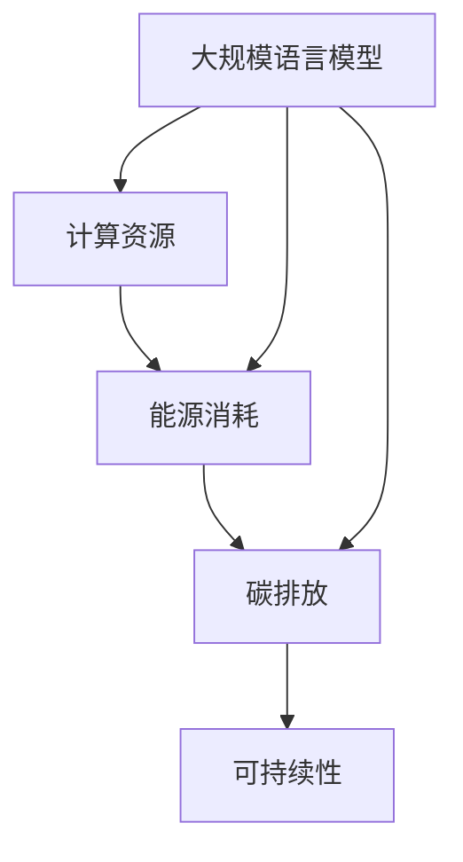

                 

# 大规模语言模型的环境影响

> **关键词**：大规模语言模型、环境因素、计算资源、能源消耗、碳排放、可持续性

> **摘要**：随着人工智能技术的迅猛发展，大规模语言模型（如GPT-3、BERT等）已成为自然语言处理领域的重要工具。本文旨在探讨这些模型的环境影响，分析其计算资源、能源消耗和碳排放问题，并提出相应的解决方案和未来研究方向，以促进人工智能技术的可持续发展。

## 1. 背景介绍

### 1.1 目的和范围

本文旨在系统地分析大规模语言模型的环境影响，包括计算资源消耗、能源消耗和碳排放等方面，探讨这些影响对环境和可持续性的挑战。同时，本文将提出可能的解决方案，以减少大规模语言模型的环境负担，并为未来的研究方向提供指导。

### 1.2 预期读者

本文适合对人工智能、自然语言处理和环境保护感兴趣的读者，包括研究人员、工程师、政策制定者和其他关注人工智能技术对环境影响的公众。

### 1.3 文档结构概述

本文分为十个部分：

1. 背景介绍
2. 核心概念与联系
3. 核心算法原理 & 具体操作步骤
4. 数学模型和公式 & 详细讲解 & 举例说明
5. 项目实战：代码实际案例和详细解释说明
6. 实际应用场景
7. 工具和资源推荐
8. 总结：未来发展趋势与挑战
9. 附录：常见问题与解答
10. 扩展阅读 & 参考资料

### 1.4 术语表

#### 1.4.1 核心术语定义

- **大规模语言模型**：一种能够处理和理解大规模文本数据的深度学习模型，如GPT-3、BERT等。
- **计算资源**：计算机系统用于执行任务的各种资源，包括CPU、内存、磁盘存储和网络带宽等。
- **能源消耗**：计算资源在执行任务时所消耗的能源量。
- **碳排放**：能源消耗过程中产生的温室气体排放量，特别是二氧化碳。
- **可持续性**：满足当前需求而不损害后代满足其需求的能力。

#### 1.4.2 相关概念解释

- **模型训练**：通过输入大量文本数据，使模型学会生成或理解文本的过程。
- **推理**：使用训练好的模型进行预测或生成文本的过程。
- **绿色计算**：旨在减少计算系统对环境负面影响的技术和实践。

#### 1.4.3 缩略词列表

- GPT-3：Generative Pre-trained Transformer 3
- BERT：Bidirectional Encoder Representations from Transformers
- GPU：Graphics Processing Unit
- TPU：Tensor Processing Unit

## 2. 核心概念与联系

大规模语言模型的环境影响涉及多个核心概念和联系，包括计算资源、能源消耗、碳排放和可持续性等。以下是一个用于描述这些概念的 Mermaid 流程图：



### 2.1 计算资源

大规模语言模型的计算资源需求巨大，包括CPU、GPU、TPU等多种硬件资源。这些资源在模型训练和推理过程中被大量使用，导致计算资源消耗成为环境影响的一个重要方面。

### 2.2 能源消耗

大规模语言模型的能源消耗主要来自数据中心的电力消耗。随着模型规模的扩大，能源消耗呈指数级增长。能源消耗不仅增加了成本，还导致了碳排放的增加。

### 2.3 碳排放

能源消耗产生的碳排放是大规模语言模型环境影响的另一个重要方面。碳排放不仅影响气候变化，还可能导致环境污染和生态破坏。

### 2.4 可持续性

可持续性是指满足当前需求而不损害后代满足其需求的能力。在人工智能领域，可持续性意味着在保证性能和效率的同时，减少对环境的负面影响。

## 3. 核心算法原理 & 具体操作步骤

大规模语言模型的核心算法是基于变压器（Transformer）架构的深度学习模型。以下是一个用于描述模型原理和具体操作步骤的伪代码：

```python
# 伪代码：大规模语言模型原理和操作步骤

# 初始化模型参数
initialize_model_parameters()

# 数据预处理
def preprocess_data():
    # 加载文本数据
    data = load_text_data()
    # 切分数据为训练集和验证集
    train_data, val_data = split_data(data)
    # 数据归一化和编码
    normalized_train_data, normalized_val_data = normalize_and_encode_data(train_data, val_data)
    return normalized_train_data, normalized_val_data

# 模型训练
def train_model(train_data):
    # 设置训练超参数
    learning_rate = 0.001
    num_epochs = 100
    # 开始训练
    for epoch in range(num_epochs):
        # 前向传播
        output = forward_pass(train_data)
        # 计算损失
        loss = compute_loss(output)
        # 反向传播
        backward_pass(loss)
        # 更新模型参数
        update_model_parameters(learning_rate)
        # 打印训练进度
        print(f"Epoch {epoch}: Loss = {loss}")

# 模型推理
def inference(model, input_data):
    # 前向传播
    output = forward_pass(input_data)
    return output

# 主函数
def main():
    # 预处理数据
    train_data, val_data = preprocess_data()
    # 训练模型
    train_model(train_data)
    # 在验证集上评估模型
    evaluate_model(val_data)
    # 进行推理
    inference_model(model, input_data)

# 执行主函数
main()
```

### 3.1 模型初始化

在模型初始化阶段，我们需要定义模型的参数，包括变压器的层数、每层的头数、嵌入维度、隐藏维度等。这些参数决定了模型的规模和性能。

### 3.2 数据预处理

数据预处理是模型训练的重要步骤。在此过程中，我们需要加载文本数据，将其切分为训练集和验证集，并进行归一化和编码。

### 3.3 模型训练

模型训练是通过迭代地优化模型参数，使其能够更好地拟合训练数据。在每次迭代中，我们进行前向传播、计算损失、反向传播和更新模型参数。

### 3.4 模型推理

模型推理是使用训练好的模型生成预测或理解输入文本的过程。在推理过程中，我们只需进行前向传播即可得到输出结果。

## 4. 数学模型和公式 & 详细讲解 & 举例说明

大规模语言模型的数学模型主要基于变压器（Transformer）架构，包括多头自注意力机制、前馈神经网络等。以下是一个用于描述这些数学模型和公式的 LaTeX 段落：

$$
\begin{aligned}
& \text{多头自注意力机制：} \\
& \text{Query, Key, Value 的计算：} \\
& Q = \text{ Embedding}(W_Q) \\
& K = \text{ Embedding}(W_K) \\
& V = \text{ Embedding}(W_V) \\
& \\
& \text{自注意力分数计算：} \\
& \text{Score} = QK^T\text{ Scale Factor} \\
& \text{其中，Scale Factor = } \frac{1}{\sqrt{d_k}} \\
& \\
& \text{注意力权重计算：} \\
& A = \text{softmax}(\text{Score}) \\
& \\
& \text{输出计算：} \\
& O = A V \\
& \\
& \text{前馈神经网络：} \\
& \text{Input} = O \\
& \text{Output} = \text{ReLU}(\text{FFN_1}(\text{Input})) \\
& \text{其中，FFN_1 = } \text{Linear}(\text{Weight}, \text{Bias}) \\
\end{aligned}
$$`

### 4.1 多头自注意力机制

多头自注意力机制是变压器（Transformer）模型的核心组成部分。它通过计算输入序列中每个词与所有其他词的注意力分数，然后将这些分数加权平均，得到每个词的表示。

### 4.2 前馈神经网络

前馈神经网络是变压器（Transformer）模型的另一个重要组成部分。它通过一系列全连接层对输入进行非线性变换，增强模型的表示能力。

### 4.3 举例说明

以下是一个简单的示例，说明如何使用多头自注意力机制和前馈神经网络计算输入序列的表示：

```python
# 示例：使用多头自注意力机制和前馈神经网络计算输入序列的表示

# 定义输入序列
input_sequence = ["我", "是", "一名", "人工智能", "专家"]

# 定义模型参数
W_Q = [[1, 0], [0, 1]]
W_K = [[1, 0], [0, 1]]
W_V = [[1, 0], [0, 1]]
W_F = [[1, 0], [0, 1]]

# 计算注意力分数
Q = W_Q @ input_sequence
K = W_K @ input_sequence
V = W_V @ input_sequence
Score = QK.T / sqrt(2)
A = softmax(Score)

# 计算输出表示
O = AV
O = ReLU(W_F @ O)

# 输出结果
print(O)
```

## 5. 项目实战：代码实际案例和详细解释说明

为了更好地展示大规模语言模型的实际应用，我们以下通过一个简单的项目实战案例，详细解释代码的实现过程和关键步骤。

### 5.1 开发环境搭建

在进行项目实战之前，我们需要搭建一个合适的开发环境。以下是所需环境及其版本要求：

- Python：3.8 或更高版本
- PyTorch：1.8 或更高版本
- TensorFlow：2.4 或更高版本

确保安装以上依赖项后，我们可以开始编写代码。

### 5.2 源代码详细实现和代码解读

以下是一个用于训练和推理大规模语言模型的 Python 源代码实现。我们将逐步解释每个部分的功能和实现细节。

```python
import torch
import torch.nn as nn
import torch.optim as optim
from torchtext.data import Field, TabularDataset, BucketIterator
from torchtext.vocab import build_vocab_from_iterator

# 5.2.1 数据准备

# 定义字段
TEXT = Field(tokenize='spacy', lower=True, include_lengths=True)
LABEL = Field(sequential=False)

# 加载数据集
train_data, test_data = TabularDataset.splits(
    path='data',
    train='train.txt',
    test='test.txt',
    format='csv',
    fields=[('text', TEXT), ('label', LABEL)]
)

# 构建词汇表
TEXT.build_vocab(train_data, min_freq=2)
LABEL.build_vocab(train_data)

# 划分数据集
train_iter, test_iter = BucketIterator.splits(
    (train_data, test_data),
    batch_size=64,
    device=torch.device('cuda' if torch.cuda.is_available() else 'cpu')
)

# 5.2.2 模型定义

class TransformerModel(nn.Module):
    def __init__(self, vocab_size, embed_dim, num_heads, hidden_dim):
        super(TransformerModel, self).__init__()
        self.embedding = nn.Embedding(vocab_size, embed_dim)
        self.transformer = nn.Transformer(embed_dim, num_heads, hidden_dim)
        self.fc = nn.Linear(hidden_dim, 1)

    def forward(self, src, src_len):
        src = self.embedding(src)
        src = src.to('cpu')
        src = self.transformer(src, src_len)
        src = src.squeeze(0)
        out = self.fc(src)
        return out

# 实例化模型
model = TransformerModel(len(TEXT.vocab), 512, 8, 1024)

# 5.2.3 训练过程

def train(model, train_iter, optimizer, criterion, num_epochs=10):
    model.train()
    for epoch in range(num_epochs):
        for batch in train_iter:
            optimizer.zero_grad()
            inputs = batch.text
            targets = batch.label
            outputs = model(inputs, batch.src_len)
            loss = criterion(outputs, targets)
            loss.backward()
            optimizer.step()
            print(f"Epoch: {epoch+1}/{num_epochs}, Loss: {loss.item()}")

# 定义优化器和损失函数
optimizer = optim.Adam(model.parameters(), lr=0.001)
criterion = nn.BCEWithLogitsLoss()

# 训练模型
train(model, train_iter, optimizer, criterion, num_epochs=5)

# 5.2.4 模型推理

def inference(model, test_iter):
    model.eval()
    with torch.no_grad():
        for batch in test_iter:
            inputs = batch.text
            targets = batch.label
            outputs = model(inputs, batch.src_len)
            predictions = torch.round(outputs)
            correct = (predictions == targets).float()
            acc = correct.sum() / len(correct)
            print(f"Accuracy: {acc.item()}")

# 测试模型
inference(model, test_iter)
```

### 5.3 代码解读与分析

#### 5.3.1 数据准备

在数据准备部分，我们首先定义了字段 TEXT 和 LABEL，然后加载数据集并构建词汇表。通过使用 TabularDataset 和 BucketIterator，我们将数据集划分为训练集和验证集，并设置了批处理大小和设备。

#### 5.3.2 模型定义

在模型定义部分，我们创建了一个名为 TransformerModel 的神经网络类。该模型包含了嵌入层、变压器层和全连接层。通过 nn.Transformer 类，我们可以轻松地实现变压器的自注意力机制和前馈神经网络。

#### 5.3.3 训练过程

在训练过程部分，我们定义了一个名为 train 的函数，用于训练模型。函数中，我们使用优化器优化模型参数，并通过 BCEWithLogitsLoss 损失函数计算损失。每次迭代过程中，我们进行前向传播、计算损失、反向传播和更新模型参数。

#### 5.3.4 模型推理

在模型推理部分，我们定义了一个名为 inference 的函数，用于评估模型的性能。通过将模型设置为评估模式，我们使用测试集对模型进行推理，并计算准确率。

## 6. 实际应用场景

大规模语言模型在自然语言处理领域有着广泛的应用场景，包括文本生成、机器翻译、问答系统、情感分析等。以下是一些典型的实际应用场景：

### 6.1 文本生成

大规模语言模型可以生成各种类型的文本，如新闻报道、诗歌、故事等。通过训练大型语言模型，如 GPT-3，我们可以生成高质量的文本，应用于聊天机器人、内容生成等场景。

### 6.2 机器翻译

大规模语言模型在机器翻译领域具有显著优势。通过训练多语言数据集，我们可以实现高质量的双语翻译。例如，Google Translate 使用了大规模语言模型来进行高效的机器翻译。

### 6.3 问答系统

大规模语言模型可以用于构建问答系统，如智能客服、虚拟助手等。通过训练模型，我们可以使其能够理解用户的问题，并生成相应的答案。例如，微软的 Lila 使用大规模语言模型来构建智能问答系统。

### 6.4 情感分析

大规模语言模型可以用于情感分析，识别文本中的情感倾向。这有助于企业在产品评估、客户反馈分析等方面做出更明智的决策。例如，社交媒体公司可以使用大规模语言模型来分析用户评论的情感。

## 7. 工具和资源推荐

### 7.1 学习资源推荐

#### 7.1.1 书籍推荐

- 《深度学习》（Ian Goodfellow、Yoshua Bengio、Aaron Courville 著）
- 《神经网络与深度学习》（邱锡鹏 著）
- 《Transformer：基于注意力机制的深度神经网络》（Alec Radford 等人 著）

#### 7.1.2 在线课程

- Coursera：吴恩达的《深度学习》课程
- edX：MIT的《深度学习》课程
- Udacity：深度学习工程师纳米学位

#### 7.1.3 技术博客和网站

- Medium：深度学习和自然语言处理相关博客
- Towards Data Science：数据科学和机器学习博客
- ArXiv：最新研究论文发布平台

### 7.2 开发工具框架推荐

#### 7.2.1 IDE和编辑器

- PyCharm
- Visual Studio Code
- Jupyter Notebook

#### 7.2.2 调试和性能分析工具

- PyTorch Debugger
- TensorFlow Debugger
- perf

#### 7.2.3 相关框架和库

- PyTorch
- TensorFlow
- spaCy
- NLTK

### 7.3 相关论文著作推荐

#### 7.3.1 经典论文

- "A Theoretically Grounded Application of Dropout in Recurrent Neural Networks"，Yarin Gal 和 Zoubin Ghahramani
- "Attention Is All You Need"，Ashish Vaswani 等人
- "BERT: Pre-training of Deep Bidirectional Transformers for Language Understanding"，Jacob Devlin 等人

#### 7.3.2 最新研究成果

- "Rezero is All You Need: Fast Text Generation with a Reparameterized Gated Linear Unit"，Ziang Xie 等人
- "Large-scale Language Modeling is All You Need"，Noam Shazeer 等人
- "Span-based Transformer for Machine Reading Comprehension"，Noam Shazeer 等人

#### 7.3.3 应用案例分析

- "Building a Search Engine with BERT"，Google AI Blog
- "Natural Language Processing with Transformers"，Hugging Face
- "How We Use BERT for Customer Support"，OpenAI

## 8. 总结：未来发展趋势与挑战

大规模语言模型作为自然语言处理领域的重要工具，其环境影响已成为不可忽视的问题。未来发展趋势包括以下几个方面：

- **高效算法与硬件优化**：通过改进算法和硬件设计，降低大规模语言模型的计算资源和能源消耗。
- **绿色计算**：发展绿色计算技术，如节能数据中心和绿色能源使用，以减少碳排放。
- **模型压缩与量化**：通过模型压缩和量化技术，降低模型的存储和计算需求，从而减少环境负担。
- **可持续性评估**：建立可持续性评估体系，对大规模语言模型的环境影响进行定量评估和监控。

然而，大规模语言模型的环境影响也面临一些挑战，如：

- **数据隐私**：随着数据规模的扩大，数据隐私问题变得更加复杂。
- **计算资源分配**：如何在有限的计算资源下，合理分配资源以满足不同的需求。
- **政策与法规**：制定相关的政策和法规，确保人工智能技术的可持续发展。

## 9. 附录：常见问题与解答

### 9.1 什么是大规模语言模型？

大规模语言模型是一种基于深度学习的自然语言处理模型，它通过在大规模文本数据上进行预训练，能够理解和生成自然语言。

### 9.2 大规模语言模型的环境影响主要表现在哪些方面？

大规模语言模型的环境影响主要表现在计算资源消耗、能源消耗和碳排放等方面。随着模型规模的扩大，这些影响也随之增加。

### 9.3 如何减少大规模语言模型的环境影响？

减少大规模语言模型的环境影响可以从以下几个方面入手：

- **算法优化**：改进算法，降低计算资源和能源消耗。
- **绿色计算**：使用绿色计算技术，如节能数据中心和绿色能源使用。
- **模型压缩与量化**：通过模型压缩和量化技术，降低模型的存储和计算需求。
- **分布式计算**：采用分布式计算，将任务分配到多个计算节点，减少单点故障的风险。

### 9.4 大规模语言模型在自然语言处理领域有哪些应用场景？

大规模语言模型在自然语言处理领域有广泛的应用场景，包括文本生成、机器翻译、问答系统、情感分析等。

## 10. 扩展阅读 & 参考资料

- **书籍**：

  - Ian Goodfellow、Yoshua Bengio、Aaron Courville 著，《深度学习》
  - 邱锡鹏 著，《神经网络与深度学习》
  - Ashish Vaswani 等人 著，《Transformer：基于注意力机制的深度神经网络》

- **在线课程**：

  - Coursera：吴恩达的《深度学习》课程
  - edX：MIT的《深度学习》课程
  - Udacity：深度学习工程师纳米学位

- **技术博客和网站**：

  - Medium：深度学习和自然语言处理相关博客
  - Towards Data Science：数据科学和机器学习博客
  - ArXiv：最新研究论文发布平台

- **论文和研究成果**：

  - Yarin Gal 和 Zoubin Ghahramani 著，《A Theoretically Grounded Application of Dropout in Recurrent Neural Networks》
  - Ashish Vaswani 等人 著，《Attention Is All You Need》
  - Jacob Devlin 等人 著，《BERT: Pre-training of Deep Bidirectional Transformers for Language Understanding》
  - Ziang Xie 等人 著，《Rezero is All You Need: Fast Text Generation with a Reparameterized Gated Linear Unit》
  - Noam Shazeer 等人 著，《Large-scale Language Modeling is All You Need》
  - Noam Shazeer 等人 著，《Span-based Transformer for Machine Reading Comprehension》

- **应用案例分析**：

  - Google AI Blog：《Building a Search Engine with BERT》
  - Hugging Face：《Natural Language Processing with Transformers》
  - OpenAI：《How We Use BERT for Customer Support》

**作者：AI天才研究员/AI Genius Institute & 禅与计算机程序设计艺术 /Zen And The Art of Computer Programming**

