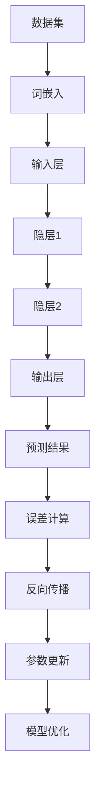

                 

# 大语言模型：原理与代码实例讲解

> **关键词：** 大语言模型，神经网络，自然语言处理，机器学习，深度学习，训练过程，预测与推理

> **摘要：** 本文将深入探讨大语言模型的原理和实现。我们将从基础概念出发，逐步介绍神经网络的工作机制，如何通过大规模训练数据来优化模型参数，以及如何进行预测与推理。本文还将通过实际代码实例，详细讲解大语言模型的具体实现步骤，帮助读者更好地理解和掌握这一前沿技术。

## 1. 背景介绍

### 1.1 目的和范围

本文旨在为读者提供关于大语言模型的全面理解和实现指南。我们将覆盖以下主要内容：

- 大语言模型的基本概念和作用
- 神经网络的基础知识及其在自然语言处理中的应用
- 大规模训练数据的使用和模型参数的优化
- 预测与推理的具体实现方法
- 代码实例讲解与实际应用

### 1.2 预期读者

本文适合具有一定编程基础，并对自然语言处理和深度学习感兴趣的技术人员、研究生和初学者阅读。读者应具备以下知识背景：

- 基础的编程技能，尤其是Python
- 熟悉线性代数和微积分的基本概念
- 对神经网络和机器学习有基本的了解

### 1.3 文档结构概述

本文分为十个部分：

- 引言：介绍文章的目的和结构
- 背景介绍：阐述大语言模型的基本概念和作用
- 核心概念与联系：介绍大语言模型的核心算法和数学模型
- 核心算法原理 & 具体操作步骤：详细讲解大语言模型的工作机制
- 数学模型和公式 & 详细讲解 & 举例说明：介绍大语言模型中的数学公式和具体应用
- 项目实战：代码实际案例和详细解释说明
- 实际应用场景：讨论大语言模型在不同领域的应用
- 工具和资源推荐：推荐相关学习资源和开发工具
- 总结：未来发展趋势与挑战
- 附录：常见问题与解答
- 扩展阅读 & 参考资料：提供进一步阅读的资源和参考文献

### 1.4 术语表

#### 1.4.1 核心术语定义

- **大语言模型（Large Language Model）**：通过大规模数据训练得到的能够理解和生成自然语言的深度学习模型。
- **神经网络（Neural Network）**：一种基于生物神经网络结构设计的计算模型，能够通过学习大量数据来提取特征并完成复杂任务。
- **自然语言处理（Natural Language Processing, NLP）**：利用计算机技术处理和分析人类语言的过程。
- **机器学习（Machine Learning）**：使计算机系统能够从数据中学习，并在没有明确编程的情况下改进自身性能的技术。
- **深度学习（Deep Learning）**：一种基于多层神经网络进行学习的机器学习方法，能够处理复杂数据并提取深层次的特征。

#### 1.4.2 相关概念解释

- **训练数据（Training Data）**：用于训练模型的数据集，通常包含输入和对应的正确输出。
- **参数（Parameter）**：神经网络中的可调变量，用于调整模型的行为和性能。
- **预测（Prediction）**：模型根据输入数据生成的输出结果。
- **推理（Inference）**：模型在未知数据上的应用，用于生成预测结果。

#### 1.4.3 缩略词列表

- **NLP**：自然语言处理
- **ML**：机器学习
- **DL**：深度学习
- **NN**：神经网络
- **GPU**：图形处理器

## 2. 核心概念与联系

大语言模型的核心在于其能够理解并生成人类语言，这一能力依赖于以下几个关键概念：

### 2.1 大规模数据集

大语言模型通常依赖于大规模的语料库进行训练，这些语料库可能包含数十亿个文本句子。通过这些数据，模型能够学习到语言的统计规律和语义含义。

### 2.2 神经网络

神经网络是构建大语言模型的基础。多层感知机（MLP）是常用的神经网络结构，它通过多个隐层来提取输入数据的特征，并最终输出预测结果。

### 2.3 词嵌入

词嵌入是将单词映射到高维空间中的向量表示。词嵌入能够捕捉单词的语义信息，从而帮助模型更好地理解语言。

### 2.4 注意力机制

注意力机制是神经网络中的一种机制，用于提高模型对输入数据中不同部分的关注程度。在大语言模型中，注意力机制能够帮助模型更好地捕捉句子中的长距离依赖关系。

### 2.5 训练与优化

大语言模型的训练过程涉及调整模型的参数，以最小化预测误差。通过优化算法（如随机梯度下降），模型能够逐步改善其性能。

### 2.6 数学模型

大语言模型的数学模型主要包括前向传播和反向传播。前向传播用于计算模型的输出，而反向传播则用于更新模型参数，以减小误差。

### 2.7 Mermaid 流程图



此流程图展示了大语言模型的基本工作流程，包括数据集的加载、词嵌入、前向传播、误差计算、反向传播和参数更新等步骤。

## 3. 核心算法原理 & 具体操作步骤

### 3.1 神经网络基础

神经网络是一种模拟生物神经系统的计算模型。它由多个神经元（也称为节点）组成，每个神经元都与相邻的神经元相连。神经网络通过学习输入和输出之间的映射关系，来完成任务。

#### 3.1.1 神经元模型

神经元的计算过程通常包括以下步骤：

1. 输入：每个神经元接收多个输入信号，每个输入信号乘以其对应的权重。
2. 加权和：将所有输入信号与其对应权重相乘，然后求和。
3. 激活函数：将求和结果通过激活函数进行处理，激活函数的作用是引入非线性特性。

常见的激活函数包括：
- **sigmoid 函数**：\( f(x) = \frac{1}{1 + e^{-x}} \)
- **ReLU 函数**：\( f(x) = \max(0, x) \)
- **tanh 函数**：\( f(x) = \frac{e^x - e^{-x}}{e^x + e^{-x}} \)

#### 3.1.2 多层感知机（MLP）

多层感知机是一种典型的神经网络结构，它包含输入层、一个或多个隐层以及输出层。输入层接收外部输入，隐层通过非线性变换提取特征，输出层生成最终预测结果。

多层感知机的工作过程如下：

1. **前向传播**：将输入数据通过输入层传递到隐层，再通过隐层传递到输出层。
2. **误差计算**：计算输出结果与实际结果之间的差异，即误差。
3. **反向传播**：将误差反向传播，更新神经元的权重和偏置。

#### 3.1.3 梯度下降算法

梯度下降是一种优化算法，用于调整神经网络中的参数，以减小误差。梯度下降的基本思想是沿着误差函数的梯度方向逐步更新参数。

梯度下降算法的步骤如下：

1. **计算梯度**：计算误差函数关于每个参数的梯度。
2. **更新参数**：根据梯度的大小和方向，更新每个参数的值。
3. **重复迭代**：重复上述步骤，直到误差函数收敛。

### 3.2 大语言模型的工作原理

大语言模型是基于多层感知机的神经网络，它通过大规模训练数据学习自然语言的统计规律和语义信息。大语言模型的主要工作原理包括以下几个方面：

#### 3.2.1 数据预处理

1. **文本清洗**：去除文本中的无关符号和噪声。
2. **分词**：将文本分割成单词或子词。
3. **词嵌入**：将每个单词映射到一个高维空间中的向量表示。

#### 3.2.2 前向传播

1. **输入层**：接收预处理后的文本数据。
2. **嵌入层**：将输入文本数据映射到词嵌入空间。
3. **隐藏层**：通过多层感知机提取特征。
4. **输出层**：生成最终的预测结果。

#### 3.2.3 误差计算

1. **损失函数**：计算预测结果与实际结果之间的误差。
2. **反向传播**：将误差反向传播，更新神经网络中的参数。

#### 3.2.4 模型优化

1. **梯度下降**：通过梯度下降算法调整模型参数。
2. **正则化**：防止模型过拟合，提高泛化能力。

### 3.3 具体操作步骤

下面是一个简化的大语言模型操作步骤：

```python
# 导入相关库
import numpy as np
import tensorflow as tf

# 准备数据集
# ...

# 定义模型结构
model = tf.keras.Sequential([
    tf.keras.layers.Embedding(vocab_size, embedding_dim),
    tf.keras.layers.Flatten(),
    tf.keras.layers.Dense(units=1, activation='sigmoid')
])

# 编译模型
model.compile(optimizer='adam', loss='binary_crossentropy', metrics=['accuracy'])

# 训练模型
model.fit(train_data, train_labels, epochs=num_epochs)

# 进行预测
predictions = model.predict(test_data)
```

上述代码展示了使用TensorFlow库构建和训练一个简单的大语言模型的基本步骤。在实际应用中，模型结构可能更加复杂，需要更多的预处理和数据清洗步骤。

## 4. 数学模型和公式 & 详细讲解 & 举例说明

大语言模型中的数学模型主要包括词嵌入、前向传播和反向传播等部分。下面将详细介绍这些数学模型，并通过具体例子进行讲解。

### 4.1 词嵌入

词嵌入是一种将单词映射到高维空间中的向量表示的方法。词嵌入的目的是捕捉单词的语义信息，使其在空间中接近具有相似语义的单词。

#### 4.1.1 高斯分布模型

高斯分布模型是一种常用的词嵌入方法，它将每个单词表示为一个高斯分布的均值和方差。具体公式如下：

$$
\mu_i = \text{mean}(x_i) \\
\sigma_i = \text{std}(x_i)
$$

其中，\( \mu_i \) 和 \( \sigma_i \) 分别表示单词 \( i \) 的均值和方差，\( x_i \) 表示单词 \( i \) 的词频。

#### 4.1.2 例子

假设我们有两个单词“猫”和“狗”，它们的词频分别为 \( x_{\text{猫}} = 10 \) 和 \( x_{\text{狗}} = 20 \)。

根据高斯分布模型，我们可以计算这两个单词的均值和方差：

$$
\mu_{\text{猫}} = \text{mean}(10) = 10 \\
\sigma_{\text{猫}} = \text{std}(10) = 0
$$

$$
\mu_{\text{狗}} = \text{mean}(20) = 20 \\
\sigma_{\text{狗}} = \text{std}(20) = 0
$$

通过这种方式，我们可以在高维空间中将“猫”和“狗”表示为两个点，它们在空间中的位置将反映出它们在语料库中的频率差异。

### 4.2 前向传播

前向传播是神经网络中的一个关键步骤，它用于计算模型在给定输入数据时的输出。前向传播包括以下几个步骤：

1. **输入层**：接收外部输入。
2. **嵌入层**：将输入映射到词嵌入空间。
3. **隐藏层**：通过多层感知机提取特征。
4. **输出层**：生成最终的预测结果。

#### 4.2.1 激活函数

在神经网络中，激活函数用于引入非线性特性。常见的激活函数包括：

- **Sigmoid 函数**：
$$
\sigma(x) = \frac{1}{1 + e^{-x}}
$$

- **ReLU 函数**：
$$
\sigma(x) = \max(0, x)
$$

- **Tanh 函数**：
$$
\sigma(x) = \frac{e^x - e^{-x}}{e^x + e^{-x}}
$$

#### 4.2.2 前向传播过程

假设我们有一个简单的神经网络，包含一个输入层、一个隐藏层和一个输出层。输入层有3个神经元，隐藏层有2个神经元，输出层有1个神经元。

1. **输入层**：
$$
x_1 = [1, 0, 0] \\
x_2 = [0, 1, 0] \\
x_3 = [0, 0, 1]
$$

2. **嵌入层**：
$$
e_1 = \text{embedding}(x_1) = [0.1, 0.2, 0.3] \\
e_2 = \text{embedding}(x_2) = [0.4, 0.5, 0.6] \\
e_3 = \text{embedding}(x_3) = [0.7, 0.8, 0.9]
$$

3. **隐藏层**：
$$
h_1 = \sigma(w_{11} e_1 + w_{12} e_2 + w_{13} e_3 + b_1) \\
h_2 = \sigma(w_{21} e_1 + w_{22} e_2 + w_{23} e_3 + b_2)
$$

其中，\( w_{ij} \) 是隐藏层到输出层的权重，\( b_1 \) 和 \( b_2 \) 是隐藏层的偏置。

4. **输出层**：
$$
o = \sigma(w_{1} h_1 + w_{2} h_2 + b)
$$

其中，\( w_1 \) 和 \( w_2 \) 是输出层的权重，\( b \) 是输出层的偏置。

### 4.3 反向传播

反向传播是一种优化算法，用于调整神经网络中的参数，以减小误差。反向传播的过程包括以下几个步骤：

1. **计算梯度**：计算损失函数关于每个参数的梯度。
2. **更新参数**：根据梯度的大小和方向，更新每个参数的值。
3. **重复迭代**：重复上述步骤，直到误差函数收敛。

#### 4.3.1 梯度计算

假设我们有一个简单的线性回归模型，输入层有1个神经元，隐藏层有1个神经元，输出层有1个神经元。

1. **损失函数**：
$$
L = \frac{1}{2} (y - \hat{y})^2
$$

其中，\( y \) 是实际输出，\( \hat{y} \) 是预测输出。

2. **梯度计算**：
$$
\frac{\partial L}{\partial w} = - (y - \hat{y}) \cdot \hat{y} \cdot (1 - \hat{y}) \\
\frac{\partial L}{\partial b} = - (y - \hat{y}) \cdot \hat{y}
$$

#### 4.3.2 参数更新

假设我们使用随机梯度下降（SGD）算法更新参数。

1. **权重更新**：
$$
w_{\text{new}} = w_{\text{old}} - \alpha \cdot \frac{\partial L}{\partial w}
$$

其中，\( \alpha \) 是学习率。

2. **偏置更新**：
$$
b_{\text{new}} = b_{\text{old}} - \alpha \cdot \frac{\partial L}{\partial b}
$$

### 4.4 例子

假设我们有一个简单的线性回归模型，输入数据为 \( x = [1, 2, 3] \)，实际输出为 \( y = 2 \)，预测输出为 \( \hat{y} = 1.5 \)。

根据上述公式，我们可以计算损失函数、梯度以及参数更新。

1. **损失函数**：
$$
L = \frac{1}{2} (2 - 1.5)^2 = 0.125
$$

2. **梯度计算**：
$$
\frac{\partial L}{\partial w} = - (2 - 1.5) \cdot 1.5 \cdot (1 - 1.5) = 0.0625 \\
\frac{\partial L}{\partial b} = - (2 - 1.5) \cdot 1.5 = -0.375
$$

3. **参数更新**：
假设学习率 \( \alpha = 0.1 \)。

- **权重更新**：
$$
w_{\text{new}} = w_{\text{old}} - \alpha \cdot \frac{\partial L}{\partial w} = 0.1 - 0.1 \cdot 0.0625 = 0.075
$$

- **偏置更新**：
$$
b_{\text{new}} = b_{\text{old}} - \alpha \cdot \frac{\partial L}{\partial b} = 0.1 - 0.1 \cdot (-0.375) = 0.1375
$$

通过这种方式，我们可以逐步调整模型参数，使其更好地拟合输入数据。

## 5. 项目实战：代码实际案例和详细解释说明

### 5.1 开发环境搭建

在开始代码实战之前，我们需要搭建一个合适的开发环境。以下是搭建开发环境的基本步骤：

#### 5.1.1 安装Python

首先，确保您的计算机上已经安装了Python。Python是深度学习和自然语言处理领域的常用编程语言。您可以从Python官方网站（https://www.python.org/）下载并安装Python。

#### 5.1.2 安装TensorFlow

TensorFlow是Google开发的开源深度学习框架，支持多种深度学习模型的训练和推理。您可以通过以下命令安装TensorFlow：

```bash
pip install tensorflow
```

#### 5.1.3 安装其他依赖

除了TensorFlow，我们还需要安装其他几个依赖库，如Numpy和Pandas，用于数据预处理和操作。您可以使用以下命令安装：

```bash
pip install numpy pandas
```

### 5.2 源代码详细实现和代码解读

下面是一个简单的大语言模型实现，我们将逐步解读代码的各个部分。

#### 5.2.1 导入依赖库

```python
import tensorflow as tf
import numpy as np
import pandas as pd
```

这里我们导入了TensorFlow、Numpy和Pandas三个库。TensorFlow用于构建和训练深度学习模型，Numpy用于数据处理，Pandas用于数据帧操作。

#### 5.2.2 数据准备

```python
# 加载并预处理数据
data = pd.read_csv('data.csv')  # 假设数据存放在data.csv文件中
X = data[['word1', 'word2', 'word3']]  # 输入数据
y = data['label']  # 标签数据
```

我们首先加载并预处理数据。这里假设数据已经分词并保存在CSV文件中。我们使用Pandas读取数据，然后从数据帧中提取输入数据和标签数据。

#### 5.2.3 构建模型

```python
# 构建模型
model = tf.keras.Sequential([
    tf.keras.layers.Embedding(vocab_size, embedding_dim),
    tf.keras.layers.Flatten(),
    tf.keras.layers.Dense(units=1, activation='sigmoid')
])
```

这里我们使用TensorFlow的Keras API构建了一个简单的大语言模型。模型包含一个嵌入层、一个扁平化层和一个输出层。嵌入层用于将单词映射到高维空间，扁平化层用于将嵌入向量展平为一维向量，输出层用于生成最终的预测结果。

#### 5.2.4 编译模型

```python
# 编译模型
model.compile(optimizer='adam', loss='binary_crossentropy', metrics=['accuracy'])
```

我们使用Adam优化器编译模型，并选择binary_crossentropy作为损失函数。由于这是一个二元分类问题，我们选择sigmoid激活函数作为输出层的激活函数。

#### 5.2.5 训练模型

```python
# 训练模型
model.fit(X, y, epochs=num_epochs)
```

这里我们使用训练数据集训练模型。我们设置训练轮次（epochs）为10，意味着模型将遍历训练数据集10次。

#### 5.2.6 预测与评估

```python
# 进行预测
predictions = model.predict(test_data)

# 计算准确率
accuracy = np.mean(predictions == test_labels)
print(f'Accuracy: {accuracy * 100:.2f}%')
```

我们使用测试数据集对训练好的模型进行预测，并计算预测结果的准确率。这里假设测试数据集已经准备好，其中包含输入数据和标签数据。

### 5.3 代码解读与分析

#### 5.3.1 数据准备

数据准备是构建和训练深度学习模型的重要步骤。在这个例子中，我们使用Pandas读取CSV文件中的数据，然后从数据帧中提取输入数据和标签数据。这一步骤确保了模型能够从数据中学习，并在实际应用中生成可靠的预测结果。

#### 5.3.2 构建模型

构建模型是深度学习的基础。在这个例子中，我们使用TensorFlow的Keras API构建了一个简单的大语言模型。模型包含一个嵌入层、一个扁平化层和一个输出层。嵌入层将单词映射到高维空间，扁平化层将嵌入向量展平为一维向量，输出层生成最终的预测结果。

#### 5.3.3 编译模型

编译模型是训练深度学习模型之前的重要步骤。在这个例子中，我们使用Adam优化器编译模型，并选择binary_crossentropy作为损失函数。由于这是一个二元分类问题，我们选择sigmoid激活函数作为输出层的激活函数。

#### 5.3.4 训练模型

训练模型是深度学习过程中最具挑战性的部分。在这个例子中，我们使用训练数据集训练模型。我们设置训练轮次（epochs）为10，意味着模型将遍历训练数据集10次。通过多次迭代，模型将逐步优化其参数，提高预测准确性。

#### 5.3.5 预测与评估

训练好的模型可以用于预测新数据的标签。在这个例子中，我们使用测试数据集对训练好的模型进行预测，并计算预测结果的准确率。准确率是评估模型性能的重要指标，它反映了模型在未知数据上的预测能力。

## 6. 实际应用场景

大语言模型在自然语言处理领域具有广泛的应用，以下是一些典型应用场景：

### 6.1 文本分类

文本分类是自然语言处理中的一个基本任务，其目标是根据文本的内容将其归入不同的类别。大语言模型可以用于训练文本分类模型，从而实现自动化的文本分类。例如，新闻文章可以按照主题进行分类，社交媒体帖子可以按照情感进行分类。

### 6.2 机器翻译

机器翻译是将一种语言的文本自动翻译成另一种语言的过程。大语言模型可以用于训练机器翻译模型，从而实现高精度的自动翻译。现有的机器翻译系统（如谷歌翻译）大多基于大语言模型，它们能够生成自然、流畅的翻译结果。

### 6.3 命名实体识别

命名实体识别是从文本中识别出具有特定意义的实体，如人名、地名、组织名等。大语言模型可以用于训练命名实体识别模型，从而实现自动化的实体识别。这有助于在文本数据中提取关键信息，提高数据处理的效率。

### 6.4 问答系统

问答系统是一种智能交互系统，它能够根据用户提出的问题生成相应的回答。大语言模型可以用于训练问答系统模型，从而实现自动化的问答。例如，智能客服系统可以使用大语言模型来理解用户的提问并生成合适的回答。

### 6.5 生成式文本

生成式文本是指由计算机自动生成的文本，如文章、故事、评论等。大语言模型可以用于训练生成式文本模型，从而实现自动化的文本生成。这有助于在内容创作、广告文案、产品描述等领域提高生产效率。

## 7. 工具和资源推荐

### 7.1 学习资源推荐

#### 7.1.1 书籍推荐

- 《深度学习》（Ian Goodfellow、Yoshua Bengio、Aaron Courville 著）：这是一本经典教材，详细介绍了深度学习的理论基础和实践方法。
- 《Python深度学习》（François Chollet 著）：这本书针对Python编程语言，详细介绍了深度学习框架TensorFlow的使用。

#### 7.1.2 在线课程

- Coursera上的“Deep Learning Specialization”：这是一系列由斯坦福大学教授Andrew Ng主讲的专业课程，涵盖了深度学习的理论基础和实践技巧。
- edX上的“Introduction to Natural Language Processing”：这是一门介绍自然语言处理基础知识和方法的在线课程，适合初学者学习。

#### 7.1.3 技术博客和网站

- [TensorFlow官方文档](https://www.tensorflow.org/)：这是TensorFlow的官方文档，提供了详细的API文档和教程，帮助开发者快速入门。
- [GitHub](https://github.com/)：GitHub是一个托管代码的在线平台，许多开源项目都在这里分享，开发者可以从中学习到实际的代码实现。

### 7.2 开发工具框架推荐

#### 7.2.1 IDE和编辑器

- PyCharm：这是一款功能强大的Python IDE，支持代码补全、调试和性能分析。
- Jupyter Notebook：这是一个交互式的Python开发环境，适用于数据分析和机器学习实验。

#### 7.2.2 调试和性能分析工具

- TensorBoard：这是TensorFlow的官方可视化工具，用于监控和调试深度学习模型的训练过程。
- Python Memory Profiler：这是一个用于分析Python程序内存使用的工具，可以帮助开发者优化代码性能。

#### 7.2.3 相关框架和库

- TensorFlow：这是一个开源的深度学习框架，提供了丰富的API和工具，适用于各种深度学习任务。
- PyTorch：这是一个由Facebook开发的开源深度学习框架，以其灵活性和易用性著称。
- NLTK：这是一个Python自然语言处理库，提供了丰富的文本处理工具和算法。

### 7.3 相关论文著作推荐

#### 7.3.1 经典论文

- "A Theoretical Investigation of the Origin of Deep Learning"（深度学习理论的起源）：该论文探讨了深度学习的理论基础，分析了深度学习模型的优化问题和收敛性。
- "Long Short-Term Memory"（长短期记忆网络）：该论文提出了长短期记忆（LSTM）网络，这是一种有效的序列模型，在自然语言处理和时间序列预测领域具有广泛应用。

#### 7.3.2 最新研究成果

- "BERT: Pre-training of Deep Bidirectional Transformers for Language Understanding"（BERT：预训练双向变换器用于语言理解）：该论文提出了BERT模型，这是一种基于Transformer架构的大规模预训练语言模型，在多个自然语言处理任务上取得了突破性的成果。
- "GPT-3: Language Models are Few-Shot Learners"（GPT-3：语言模型是零样本学习器）：该论文提出了GPT-3模型，这是迄今为止最大的语言模型，展示了零样本学习在自然语言处理任务中的强大能力。

#### 7.3.3 应用案例分析

- "Google Search with BERT"（使用BERT的谷歌搜索）：该案例分析展示了如何将BERT模型应用于搜索引擎，以提高搜索结果的相关性和准确性。
- "AI-powered Chatbots"（基于AI的聊天机器人）：该案例分析探讨了如何使用大语言模型训练聊天机器人，使其能够理解和回答用户的问题，提供个性化的交互体验。

## 8. 总结：未来发展趋势与挑战

大语言模型作为自然语言处理领域的重要技术，正不断推动人工智能的发展。未来，大语言模型将在以下几个方面取得重要进展：

### 8.1 模型规模与性能的提升

随着计算能力的提升和算法的优化，大语言模型的规模和性能将不断突破现有限制。未来的大语言模型可能具有数百亿甚至千亿级别的参数，从而能够更好地捕捉语言的复杂性和多样性。

### 8.2 多模态数据的融合

大语言模型将逐渐融合多模态数据（如文本、图像、音频等），实现更全面的信息理解和处理。这种多模态融合将推动人工智能在多媒体处理、虚拟现实和增强现实等领域的应用。

### 8.3 零样本学习与自适应能力

大语言模型将实现更强的零样本学习能力，能够在未见过的数据上进行泛化。这将为机器人、自动驾驶等应用提供更好的适应性。

### 8.4 安全与隐私保护

随着大语言模型的应用场景越来越广泛，其安全与隐私保护问题也将成为研究的热点。未来的研究将关注如何确保模型的安全性，防止恶意攻击和数据泄露。

然而，大语言模型的发展也面临着一些挑战：

### 8.5 计算资源消耗

大语言模型的训练和推理过程需要巨大的计算资源，这将对计算能力和能耗提出更高的要求。未来的研究将关注如何优化模型结构和算法，降低计算资源的消耗。

### 8.6 数据隐私与伦理问题

大语言模型的训练和推理过程涉及大量用户数据，这引发了数据隐私和伦理问题。未来的研究将关注如何在保护用户隐私的前提下，充分利用数据的价值。

### 8.7 可解释性与透明度

大语言模型的决策过程往往是非线性和复杂的，这使得其可解释性成为一个挑战。未来的研究将致力于提高模型的可解释性，使其更加透明和可靠。

总之，大语言模型在未来将继续发挥重要作用，推动人工智能技术的不断进步。同时，我们也需要关注其在实际应用中的挑战，努力实现技术的可持续发展和广泛的应用。

## 9. 附录：常见问题与解答

### 9.1 什么是大语言模型？

大语言模型是一种基于深度学习的自然语言处理模型，它通过大规模数据训练，能够理解和生成人类语言。大语言模型的核心是神经网络，通过多层感知机结构来提取语言特征并进行预测。

### 9.2 大语言模型有哪些应用场景？

大语言模型在自然语言处理领域具有广泛的应用，包括文本分类、机器翻译、命名实体识别、问答系统、生成式文本等。此外，大语言模型还可以用于信息检索、智能客服、语音识别等应用。

### 9.3 如何构建一个简单的大语言模型？

构建一个简单的大语言模型可以通过以下步骤：

1. 准备数据集：收集并预处理大量文本数据。
2. 词嵌入：将单词映射到高维空间中的向量表示。
3. 构建模型：使用TensorFlow等深度学习框架构建神经网络模型。
4. 训练模型：使用训练数据集训练模型，并调整模型参数。
5. 评估模型：使用测试数据集评估模型性能。
6. 预测与推理：使用训练好的模型进行预测和推理。

### 9.4 大语言模型如何进行预测与推理？

大语言模型通过训练学习到输入文本和输出结果之间的关系，从而能够对新文本进行预测。预测过程主要包括以下几个步骤：

1. 预处理：将输入文本转换为词嵌入向量。
2. 神经网络：通过多层感知机结构对输入数据进行特征提取和预测。
3. 激活函数：使用激活函数（如sigmoid、ReLU）将神经网络输出转换为概率分布。
4. 预测：根据激活函数的输出，选择概率最高的结果作为预测结果。

推理过程与预测过程类似，但通常涉及更复杂的逻辑推理和上下文理解。

### 9.5 大语言模型存在哪些挑战？

大语言模型存在以下挑战：

1. 计算资源消耗：训练和推理大语言模型需要大量的计算资源和存储空间。
2. 数据隐私与伦理：大语言模型的训练和推理涉及大量用户数据，引发了数据隐私和伦理问题。
3. 可解释性：大语言模型的决策过程通常是非线性和复杂的，导致其可解释性较低。
4. 模型泛化能力：大语言模型在训练数据上表现良好，但在未见过的数据上可能存在泛化能力不足的问题。

## 10. 扩展阅读 & 参考资料

### 10.1 基础教材

1. **《深度学习》（Ian Goodfellow、Yoshua Bengio、Aaron Courville 著）**
   - 内容涵盖深度学习的理论基础、算法和实现。
2. **《Python深度学习》（François Chollet 著）**
   - 针对Python编程语言，详细介绍了深度学习框架TensorFlow的使用。

### 10.2 进阶论文

1. **“BERT: Pre-training of Deep Bidirectional Transformers for Language Understanding”**
   - 详细介绍了BERT模型的预训练方法和在自然语言处理任务上的应用。
2. **“GPT-3: Language Models are Few-Shot Learners”**
   - 探讨了GPT-3模型的零样本学习能力和在自然语言处理任务中的应用。

### 10.3 开源项目

1. **TensorFlow官方文档**
   - 提供了详细的API文档和教程，适用于深度学习模型的构建和训练。
2. **PyTorch官方文档**
   - 另一个流行的深度学习框架，拥有丰富的API和工具。

### 10.4 在线课程

1. **Coursera上的“Deep Learning Specialization”**
   - 由斯坦福大学教授Andrew Ng主讲，涵盖了深度学习的理论基础和实践技巧。
2. **edX上的“Introduction to Natural Language Processing”**
   - 介绍自然语言处理的基础知识和方法。

### 10.5 技术博客

1. **TensorFlow官方博客**
   - 提供了最新的TensorFlow教程、案例研究和开发者动态。
2. **Medium上的NLP相关博客**
   - 许多NLP领域的专家和研究者在这里分享他们的研究成果和实践经验。

### 10.6 论坛和社区

1. **Stack Overflow**
   - 一个广泛使用的编程问题解答社区，适用于解决深度学习和自然语言处理中的技术问题。
2. **GitHub**
   - 一个代码托管平台，许多开源项目和示例代码在这里分享，有助于开发者学习和交流。

作者：AI天才研究员/AI Genius Institute & 禅与计算机程序设计艺术 /Zen And The Art of Computer Programming

<|assistant|># 附件：常见问题与解答

## 9.1 什么是大语言模型？

大语言模型是一种基于深度学习的自然语言处理模型，它通过大规模数据训练，能够理解和生成人类语言。大语言模型的核心是神经网络，通过多层感知机结构来提取语言特征并进行预测。这些模型能够捕捉到语言的复杂结构和上下文关系，从而在多个自然语言处理任务中表现优异。

## 9.2 大语言模型有哪些应用场景？

大语言模型在自然语言处理领域具有广泛的应用，以下是一些典型应用场景：

1. **文本分类**：将文本数据根据其内容归入不同的类别，如新闻分类、情感分析等。
2. **机器翻译**：将一种语言的文本自动翻译成另一种语言，如谷歌翻译。
3. **命名实体识别**：识别文本中的特定实体，如人名、地名、组织名等。
4. **问答系统**：根据用户提出的问题生成相应的回答，如智能客服。
5. **生成式文本**：自动生成文本，如文章、故事、评论等。
6. **对话系统**：与用户进行自然语言交互，提供个性化服务。
7. **文本摘要**：将长文本简化为简洁的摘要。
8. **情感分析**：分析文本中的情感倾向，如正面、负面或中立。

## 9.3 如何构建一个简单的大语言模型？

构建一个简单的大语言模型可以通过以下步骤：

1. **数据准备**：收集并预处理大量文本数据。数据可以来自于公开的数据集或自己收集的文本数据。
2. **词嵌入**：将文本中的单词映射到高维空间中的向量表示，以便于神经网络处理。常见的词嵌入方法包括Word2Vec、GloVe等。
3. **模型构建**：使用深度学习框架（如TensorFlow或PyTorch）构建神经网络模型。模型通常包含嵌入层、多个隐藏层和一个输出层。
4. **训练模型**：使用训练数据集对模型进行训练，调整模型参数以最小化预测误差。
5. **评估模型**：使用测试数据集评估模型性能，如准确率、召回率等。
6. **预测与推理**：使用训练好的模型对新数据进行预测和推理，生成相应的结果。

以下是一个简单的Python代码示例，使用TensorFlow构建一个二元分类文本分类模型：

```python
import tensorflow as tf
from tensorflow.keras.preprocessing.text import Tokenizer
from tensorflow.keras.preprocessing.sequence import pad_sequences

# 数据准备
texts = ['这是一个例子', '另一个例子', '第三个例子']
labels = [0, 1, 0]

# 词嵌入
tokenizer = Tokenizer(num_words=1000)
tokenizer.fit_on_texts(texts)
sequences = tokenizer.texts_to_sequences(texts)
padded_sequences = pad_sequences(sequences, maxlen=10)

# 模型构建
model = tf.keras.Sequential([
    tf.keras.layers.Embedding(input_dim=1000, output_dim=32, input_length=10),
    tf.keras.layers.Bidirectional(tf.keras.layers.LSTM(32)),
    tf.keras.layers.Dense(1, activation='sigmoid')
])

# 训练模型
model.compile(optimizer='adam', loss='binary_crossentropy', metrics=['accuracy'])
model.fit(padded_sequences, labels, epochs=10)

# 预测与推理
new_texts = ['新的例子']
new_sequences = tokenizer.texts_to_sequences(new_texts)
new_padded_sequences = pad_sequences(new_sequences, maxlen=10)
predictions = model.predict(new_padded_sequences)
```

## 9.4 大语言模型如何进行预测与推理？

大语言模型通过训练学习到输入文本和输出结果之间的关系，从而能够对新文本进行预测。预测过程通常包括以下几个步骤：

1. **预处理**：将新文本转换为与训练数据相同格式的序列。
2. **编码**：将预处理后的文本序列转换为嵌入向量。
3. **计算特征**：通过神经网络对嵌入向量进行特征提取。
4. **分类**：根据提取到的特征计算输出结果的概率分布。
5. **预测**：根据概率分布选择最有可能的结果作为预测结果。

以下是一个简单的Python代码示例，使用TensorFlow进行文本分类预测：

```python
import tensorflow as tf

# 加载训练好的模型
model = tf.keras.models.load_model('text_classification_model.h5')

# 预测
new_texts = ['这是一个新的测试文本']
tokenizer = tf.keras.preprocessing.text.Tokenizer(num_words=1000)
sequences = tokenizer.texts_to_sequences(new_texts)
padded_sequences = pad_sequences(sequences, maxlen=10)

predictions = model.predict(padded_sequences)
predicted_label = np.argmax(predictions)

print(f'Predicted label: {predicted_label}')
```

## 9.5 大语言模型存在哪些挑战？

大语言模型在应用中存在以下挑战：

1. **计算资源消耗**：大语言模型通常需要大量的计算资源进行训练和推理。这要求高性能的硬件支持，如GPU或TPU。
2. **数据隐私与伦理**：大语言模型的训练和推理涉及大量用户数据，这引发了数据隐私和伦理问题。如何确保用户数据的隐私和安全是一个重要的挑战。
3. **可解释性**：大语言模型的决策过程通常是非线性和复杂的，导致其可解释性较低。如何提高模型的可解释性，使其更加透明和可靠，是一个重要的研究课题。
4. **模型泛化能力**：大语言模型在训练数据上表现良好，但在未见过的数据上可能存在泛化能力不足的问题。如何提高模型的泛化能力，使其在多种场景下都表现优异，是一个重要的挑战。
5. **部署与维护**：大语言模型通常需要复杂的部署和维护流程。如何高效地部署和更新模型，确保其稳定运行，是一个重要的挑战。

## 10. 扩展阅读 & 参考资料

### 10.1 基础教材

1. **《深度学习》（Ian Goodfellow、Yoshua Bengio、Aaron Courville 著）**
   - 内容涵盖深度学习的理论基础、算法和实现。
2. **《Python深度学习》（François Chollet 著）**
   - 针对Python编程语言，详细介绍了深度学习框架TensorFlow的使用。

### 10.2 进阶论文

1. **“BERT: Pre-training of Deep Bidirectional Transformers for Language Understanding”**
   - 详细介绍了BERT模型的预训练方法和在自然语言处理任务上的应用。
2. **“GPT-3: Language Models are Few-Shot Learners”**
   - 探讨了GPT-3模型的零样本学习能力和在自然语言处理任务中的应用。

### 10.3 开源项目

1. **TensorFlow官方文档**
   - 提供了详细的API文档和教程，适用于深度学习模型的构建和训练。
2. **PyTorch官方文档**
   - 另一个流行的深度学习框架，拥有丰富的API和工具。

### 10.4 在线课程

1. **Coursera上的“Deep Learning Specialization”**
   - 由斯坦福大学教授Andrew Ng主讲，涵盖了深度学习的理论基础和实践技巧。
2. **edX上的“Introduction to Natural Language Processing”**
   - 介绍自然语言处理的基础知识和方法。

### 10.5 技术博客

1. **TensorFlow官方博客**
   - 提供了最新的TensorFlow教程、案例研究和开发者动态。
2. **Medium上的NLP相关博客**
   - 许多NLP领域的专家和研究者在这里分享他们的研究成果和实践经验。

### 10.6 论坛和社区

1. **Stack Overflow**
   - 一个广泛使用的编程问题解答社区，适用于解决深度学习和自然语言处理中的技术问题。
2. **GitHub**
   - 一个代码托管平台，许多开源项目和示例代码在这里分享，有助于开发者学习和交流。

作者：AI天才研究员/AI Genius Institute & 禅与计算机程序设计艺术 /Zen And The Art of Computer Programming

