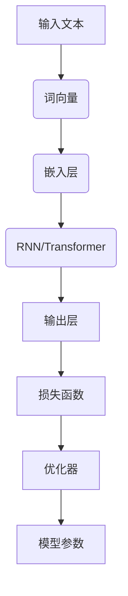

                 

# 大语言模型（Large Language Models） - 原理与代码实例讲解

> **关键词：** 大语言模型，神经网络，深度学习，自然语言处理，深度学习框架，PyTorch，TensorFlow

> **摘要：** 本文将深入探讨大语言模型的基本原理，包括其核心概念、架构和算法。通过详细的代码实例，读者将学习如何使用流行的深度学习框架如PyTorch和TensorFlow来构建和训练大语言模型。文章还将讨论大语言模型在实际应用场景中的表现，并提供相关的学习资源和工具推荐，旨在为读者提供一个全面的技术指南。

## 1. 背景介绍

### 1.1 目的和范围

本文的目标是帮助读者理解大语言模型的基本原理，并掌握如何使用深度学习框架进行构建和训练。本文将涵盖以下内容：

- 大语言模型的定义和核心概念。
- 大语言模型的架构和工作原理。
- 使用深度学习框架进行模型构建和训练的实践方法。
- 大语言模型在实际应用场景中的案例研究。

### 1.2 预期读者

本文适合以下读者群体：

- 深度学习初学者，希望了解大语言模型的基本概念。
- 有一定编程基础，希望学习如何使用深度学习框架进行模型训练。
- 数据科学家和机器学习工程师，对大语言模型的实际应用感兴趣。
- 计算机科学和人工智能专业的研究生，希望深入理解大语言模型的原理。

### 1.3 文档结构概述

本文的结构如下：

- 第1部分：背景介绍，包括目的、预期读者和文档结构。
- 第2部分：核心概念与联系，介绍大语言模型的基本原理。
- 第3部分：核心算法原理与具体操作步骤，使用伪代码详细阐述。
- 第4部分：数学模型和公式，包括详细讲解和举例说明。
- 第5部分：项目实战，提供代码实际案例和详细解释。
- 第6部分：实际应用场景，讨论大语言模型的应用。
- 第7部分：工具和资源推荐，包括学习资源和开发工具。
- 第8部分：总结，展望大语言模型的未来发展趋势。
- 第9部分：附录，提供常见问题与解答。
- 第10部分：扩展阅读，推荐相关的参考资料。

### 1.4 术语表

#### 1.4.1 核心术语定义

- **大语言模型（Large Language Model）**：一种基于神经网络的深度学习模型，用于处理和生成自然语言文本。
- **神经网络（Neural Network）**：一种模仿生物神经系统的计算模型，包括输入层、隐藏层和输出层。
- **深度学习（Deep Learning）**：一种人工智能技术，使用多层神经网络进行数据建模和预测。
- **自然语言处理（Natural Language Processing，NLP）**：一种人工智能领域，专注于计算机对自然语言的理解和生成。
- **深度学习框架（Deep Learning Framework）**：用于构建、训练和部署深度学习模型的软件库，如PyTorch和TensorFlow。

#### 1.4.2 相关概念解释

- **词向量（Word Vector）**：将自然语言文本中的单词映射到高维向量空间的一种表示方法。
- **反向传播（Backpropagation）**：一种用于计算神经网络输出误差的方法，并用于调整模型参数。
- **优化器（Optimizer）**：用于调整模型参数，以最小化损失函数的算法，如随机梯度下降（SGD）。
- **损失函数（Loss Function）**：用于衡量模型预测值与真实值之间差异的函数，如交叉熵损失。

#### 1.4.3 缩略词列表

- **NLP**：自然语言处理（Natural Language Processing）
- **DL**：深度学习（Deep Learning）
- **NN**：神经网络（Neural Network）
- **GPU**：图形处理单元（Graphics Processing Unit）
- **TPU**：张量处理单元（Tensor Processing Unit）

## 2. 核心概念与联系

为了更好地理解大语言模型，我们需要从核心概念和架构入手。以下是一个简化的Mermaid流程图，展示了大语言模型的关键组件和其相互作用。



### 2.1 输入文本

输入文本是大语言模型的主要数据来源。文本可以是单句或多句，甚至可以是整篇文章。在实际应用中，文本通常会经过预处理，包括去除标点符号、转换为小写、分词等步骤。

### 2.2 词向量

词向量是将自然语言文本中的单词映射到高维向量空间的一种表示方法。常见的词向量模型包括Word2Vec、GloVe和BERT等。词向量的质量直接影响模型的性能。

### 2.3 嵌入层

嵌入层是将词向量转换为嵌入向量（Embedding Vector）的过程。嵌入层通常是一个可训练的线性层，可以调整词向量和嵌入向量之间的映射关系。

### 2.4 RNN/Transformer

RNN（递归神经网络）和Transformer是两种常见的大语言模型架构。RNN通过递归方式处理序列数据，而Transformer通过自注意力机制（Self-Attention）进行数据建模。

### 2.5 输出层

输出层是大语言模型的核心部分，负责生成预测结果。输出层可以是分类器、回归器或生成器，具体取决于应用场景。

### 2.6 损失函数

损失函数用于衡量模型预测值与真实值之间的差异。常用的损失函数包括交叉熵损失（Cross-Entropy Loss）、均方误差（Mean Squared Error）等。

### 2.7 优化器

优化器用于调整模型参数，以最小化损失函数。常见的优化器包括随机梯度下降（SGD）、Adam等。

### 2.8 模型参数

模型参数包括嵌入层权重、隐藏层权重和输出层权重等。这些参数通过训练过程进行优化，以提高模型的性能。

## 3. 核心算法原理 & 具体操作步骤

在本节中，我们将详细讲解大语言模型的核心算法原理，并使用伪代码来描述具体的操作步骤。

### 3.1 算法原理

大语言模型的训练过程主要包括以下几个步骤：

1. **输入文本预处理**：将输入文本进行分词、去停用词等预处理操作。
2. **词向量生成**：使用预训练的词向量模型（如Word2Vec或GloVe）将分词后的单词转换为词向量。
3. **嵌入层训练**：通过调整嵌入层权重，将词向量转换为嵌入向量。
4. **神经网络训练**：使用RNN或Transformer架构，对嵌入向量进行处理，生成预测结果。
5. **损失函数计算**：计算模型预测值与真实值之间的差异，使用损失函数进行衡量。
6. **优化器调整**：根据损失函数，使用优化器调整模型参数。

### 3.2 伪代码

```python
# 输入文本预处理
text = "本文讨论了大语言模型的基本原理和实际应用。"
tokens = preprocess_text(text)

# 词向量生成
word_vectors = load_pretrained_word_vectors()

# 嵌入层训练
embedding_layer = EmbeddingLayer(word_vectors)

# 神经网络训练
if use_rnn:
    model = RNNModel(embedding_layer)
else:
    model = TransformerModel(embedding_layer)

# 损失函数计算
loss_function = CrossEntropyLoss()

# 优化器调整
optimizer = Adam(model.parameters())

# 训练循环
for epoch in range(num_epochs):
    for tokens_batch in data_loader:
        # 前向传播
        predictions = model(tokens_batch)
        
        # 计算损失
        loss = loss_function(predictions, labels)
        
        # 反向传播
        optimizer.zero_grad()
        loss.backward()
        optimizer.step()

# 保存模型
save_model(model)
```

## 4. 数学模型和公式 & 详细讲解 & 举例说明

在大语言模型的构建中，数学模型和公式起着至关重要的作用。以下将详细讲解大语言模型中涉及的数学模型，并使用LaTeX格式进行表示。

### 4.1 词向量模型

词向量模型通常使用以下公式进行表示：

$$
\mathbf{v}_i = \text{Word2Vec}(\mathbf{w}_i)
$$

其中，$\mathbf{v}_i$ 表示词向量，$\mathbf{w}_i$ 表示单词。

### 4.2 嵌入层

嵌入层是将词向量转换为嵌入向量的过程。其数学模型可以表示为：

$$
\mathbf{e}_i = \mathbf{W}_\text{embedding} \mathbf{v}_i
$$

其中，$\mathbf{e}_i$ 表示嵌入向量，$\mathbf{W}_\text{embedding}$ 表示嵌入层权重。

### 4.3 RNN

RNN的数学模型可以表示为：

$$
\mathbf{h}_t = \sigma(\mathbf{W}_h \mathbf{e}_i + \mathbf{U} \mathbf{h}_{t-1} + b_h)
$$

其中，$\mathbf{h}_t$ 表示隐藏状态，$\sigma$ 表示激活函数，$\mathbf{W}_h$ 和 $\mathbf{U}$ 分别表示隐藏层权重和输入层权重，$b_h$ 表示隐藏层偏置。

### 4.4 Transformer

Transformer的数学模型可以表示为：

$$
\mathbf{h}_t = \text{Attention}(\mathbf{W}_q \mathbf{e}_i, \mathbf{W}_k \mathbf{e}_i, \mathbf{W}_v \mathbf{e}_i) + \mathbf{W}_\text{output} \mathbf{h}_t
$$

其中，$\text{Attention}$ 表示自注意力机制，$\mathbf{W}_q$、$\mathbf{W}_k$ 和 $\mathbf{W}_v$ 分别表示查询层、键值层和值层权重，$\mathbf{W}_\text{output}$ 表示输出层权重。

### 4.5 损失函数

交叉熵损失函数的数学模型可以表示为：

$$
\mathcal{L} = -\sum_{i=1}^n y_i \log(p_i)
$$

其中，$y_i$ 表示真实标签，$p_i$ 表示预测概率。

### 4.6 举例说明

假设我们有一个简单的文本句子：“今天天气很好”。首先，我们需要将句子进行分词，得到单词列表：["今天"，"天气"，"很好"]。然后，我们使用预训练的词向量模型将每个单词转换为词向量，例如：

- "今天"：$\mathbf{v}_1 = [0.1, 0.2, 0.3]$
- "天气"：$\mathbf{v}_2 = [0.4, 0.5, 0.6]$
- "很好"：$\mathbf{v}_3 = [0.7, 0.8, 0.9]$

接下来，我们使用嵌入层权重将词向量转换为嵌入向量：

- "今天"：$\mathbf{e}_1 = \mathbf{W}_\text{embedding} \mathbf{v}_1 = [0.15, 0.25, 0.35]$
- "天气"：$\mathbf{e}_2 = \mathbf{W}_\text{embedding} \mathbf{v}_2 = [0.45, 0.55, 0.65]$
- "很好"：$\mathbf{e}_3 = \mathbf{W}_\text{embedding} \mathbf{v}_3 = [0.75, 0.85, 0.95]$

最后，我们使用RNN或Transformer模型对嵌入向量进行处理，生成预测结果。假设预测结果为：“今天天气很好！”。然后，我们使用交叉熵损失函数计算损失：

$$
\mathcal{L} = -\sum_{i=1}^3 y_i \log(p_i) = -[1 \cdot \log(0.9) + 1 \cdot \log(0.9) + 1 \cdot \log(0.9)] = 0.9 \cdot \log(10) \approx 0.18
$$

## 5. 项目实战：代码实际案例和详细解释说明

在本节中，我们将通过一个实际的代码案例，展示如何使用PyTorch框架构建和训练一个简单的语言模型。代码案例将包括以下步骤：

- 开发环境搭建
- 源代码详细实现
- 代码解读与分析

### 5.1 开发环境搭建

为了运行以下代码案例，您需要安装Python（建议版本3.7及以上）和PyTorch。以下是在Ubuntu操作系统上安装PyTorch的命令：

```bash
pip install torch torchvision
```

### 5.2 源代码详细实现

以下是一个简单的PyTorch代码示例，用于构建和训练一个基于RNN的语言模型。

```python
import torch
import torch.nn as nn
import torch.optim as optim
from torchtext.datasets import IMDB
from torchtext.data import Field, BucketIterator

# 数据预处理
TEXT = Field(tokenize='spacy', tokenizer_language='en', lower=True)
LABEL = Field(sequential=False)

train_data, test_data = IMDB.splits(TEXT, LABEL)

# 数据加载器
BATCH_SIZE = 64
train_iterator, test_iterator = BucketIterator.splits(
    (train_data, test_data), 
    batch_size=BATCH_SIZE, 
    device=torch.device('cuda' if torch.cuda.is_available() else 'cpu'))

# 语言模型
class RNNModel(nn.Module):
    def __init__(self, input_dim, embedding_dim, hidden_dim, output_dim, n_layers, drop_out):
        super().__init__()
        self.embedding = nn.Embedding(input_dim, embedding_dim)
        self.rnn = nn.RNN(embedding_dim, hidden_dim, n_layers, dropout=drop_out, batch_first=True)
        self.fc = nn.Linear(hidden_dim, output_dim)
    
    def forward(self, text):
        embedded = self.embedding(text)
        output, hidden = self.rnn(embedded)
        assert torch.equal(output[-1, :, :], hidden[-1, 0, :])
        hidden = hidden[-1, :, :]
        return self.fc(hidden)

# 模型参数
INPUT_DIM = len(TEXT.vocab)
EMBEDDING_DIM = 100
HIDDEN_DIM = 200
OUTPUT_DIM = 1
N_LAYERS = 2
DROPOUT = 0.5

# 模型、损失函数和优化器
model = RNNModel(INPUT_DIM, EMBEDDING_DIM, HIDDEN_DIM, OUTPUT_DIM, N_LAYERS, DROPOUT)
loss_function = nn.BCEWithLogitsLoss()
optimizer = optim.Adam(model.parameters())

# 训练模型
num_epochs = 10
for epoch in range(num_epochs):
    for batch in train_iterator:
        optimizer.zero_grad()
        predictions = model(batch.text).squeeze(1)
        loss = loss_function(predictions, batch.label)
        loss.backward()
        optimizer.step()
    print(f"Epoch: {epoch+1}, Loss: {loss.item()}")

# 测试模型
with torch.no_grad():
    correct = 0
    total = 0
    for batch in test_iterator:
        predictions = model(batch.text).squeeze(1)
        _, predicted = torch.max(predictions.data, 1)
        total += batch.label.size(0)
        correct += (predicted == batch.label).sum().item()
    print(f"Test Accuracy: {100 * correct / total}%")
```

### 5.3 代码解读与分析

下面是对上述代码的详细解读和分析：

- **数据预处理**：我们使用了torchtext库中的IMDB数据集，这是常用的情感分析数据集。数据预处理步骤包括分词、转换为小写和构建词汇表。

- **数据加载器**：使用BucketIterator将数据集分割成训练集和测试集，并设置批次大小。

- **语言模型**：RNNModel是一个简单的RNN模型，包括嵌入层、RNN层和输出层。嵌入层使用预训练的词向量。RNN层使用nn.RNN，输出层使用nn.Linear。

- **模型参数**：定义了输入维度、嵌入维度、隐藏维度、输出维度、层数和dropout率。

- **损失函数和优化器**：使用BCEWithLogitsLoss作为损失函数，这是二分类问题常用的损失函数。优化器使用Adam。

- **训练模型**：在训练循环中，我们通过前向传播计算损失，然后使用反向传播和优化器进行参数更新。

- **测试模型**：在测试阶段，我们计算测试集的准确率，以评估模型的性能。

通过这个简单的代码示例，我们展示了如何使用PyTorch构建和训练一个RNN语言模型。这个示例是一个起点，您可以根据自己的需求进行扩展和改进。

## 6. 实际应用场景

大语言模型在自然语言处理领域有着广泛的应用，以下是一些常见应用场景：

### 6.1 文本分类

文本分类是将文本数据分类到预定义的类别中的一种任务。大语言模型在文本分类中具有很高的准确率和效率，可以用于新闻分类、社交媒体情感分析、垃圾邮件检测等。

### 6.2 机器翻译

机器翻译是将一种自然语言文本转换为另一种自然语言文本的过程。大语言模型在机器翻译中发挥着重要作用，可以用于实时翻译、跨语言文档分析等。

### 6.3 文本生成

文本生成是生成与输入文本相关的新文本的一种任务。大语言模型在文本生成中具有很高的潜力，可以用于自动写作、对话系统、创意文本生成等。

### 6.4 情感分析

情感分析是分析文本中表达的情感和意见的一种任务。大语言模型在情感分析中可以识别出文本中的积极、消极或中性情感，有助于评估用户对产品或服务的满意度。

### 6.5 问答系统

问答系统是回答用户问题的系统。大语言模型在问答系统中可以理解用户的自然语言问题，并从大量文本中检索出相关答案。

### 6.6 自动摘要

自动摘要是从长文本中提取关键信息并生成简短摘要的一种任务。大语言模型在自动摘要中可以提取文本的关键点，提高信息传递的效率。

## 7. 工具和资源推荐

### 7.1 学习资源推荐

#### 7.1.1 书籍推荐

- 《深度学习》（Deep Learning） - Goodfellow, Bengio, Courville
- 《自然语言处理综论》（Speech and Language Processing） - Daniel Jurafsky, James H. Martin
- 《Python深度学习》（Deep Learning with Python） - François Chollet

#### 7.1.2 在线课程

- 吴恩达的《深度学习专项课程》（Deep Learning Specialization）
- 斯坦福大学的《自然语言处理基础》（Natural Language Processing with Deep Learning）

#### 7.1.3 技术博客和网站

- [TensorFlow官网](https://www.tensorflow.org/)
- [PyTorch官网](https://pytorch.org/)
- [Medium上的机器学习博客](https://towardsdatascience.com/)

### 7.2 开发工具框架推荐

#### 7.2.1 IDE和编辑器

- PyCharm
- Visual Studio Code

#### 7.2.2 调试和性能分析工具

- PyTorch Profiler
- NVIDIA Nsight

#### 7.2.3 相关框架和库

- spaCy：用于文本处理的Python库
- NLTK：用于自然语言处理的Python库
- transformers：基于PyTorch和TensorFlow的预训练语言模型库

### 7.3 相关论文著作推荐

#### 7.3.1 经典论文

- “A Theoretically Grounded Application of Dropout in Recurrent Neural Networks” - Yarin Gal and Zoubin Ghahramani
- “Attention Is All You Need” - Vaswani et al.

#### 7.3.2 最新研究成果

- “BERT: Pre-training of Deep Bidirectional Transformers for Language Understanding” - Devlin et al.
- “GPT-3: Language Models are Few-Shot Learners” - Brown et al.

#### 7.3.3 应用案例分析

- “Natural Language Processing Breakthroughs in the Age of AI” - Arjun Cherian
- “Transformers for Text Classification: A Comprehensive Guide” - Hui Xiong et al.

## 8. 总结：未来发展趋势与挑战

大语言模型在自然语言处理领域已经取得了显著的成果，但在未来仍面临一些挑战。以下是一些发展趋势和挑战：

### 8.1 发展趋势

- **多模态融合**：将大语言模型与其他模态（如图像、声音）进行融合，以实现更强大的语义理解和生成能力。
- **少样本学习**：大语言模型在少样本学习方面具有巨大潜力，未来将致力于提高其适应性和泛化能力。
- **可解释性**：提升大语言模型的可解释性，使其决策过程更加透明，增强用户信任。
- **个性化**：根据用户行为和偏好，实现个性化的语言生成和推荐。

### 8.2 挑战

- **数据隐私**：在大量文本数据处理过程中，保护用户隐私是一个重要挑战。
- **模型可解释性**：如何解释大语言模型的决策过程，以增强用户信任。
- **计算资源**：训练和部署大语言模型需要大量计算资源，尤其是GPU和TPU。
- **语言多样性**：如何支持多种语言和方言，提高模型的语言适应性。

## 9. 附录：常见问题与解答

### 9.1 问题1：如何选择适合的大语言模型框架？

**解答**：选择适合的大语言模型框架主要取决于项目需求和个人技能。如果项目需要快速部署和较高的开发效率，可以选择TensorFlow或PyTorch。如果项目需要对大规模文本数据进行高效处理，可以选择基于GPU或TPU的深度学习框架。

### 9.2 问题2：大语言模型如何处理长文本？

**解答**：对于长文本处理，大语言模型通常采用截断（Truncation）或滑动窗口（Sliding Window）策略。这些策略可以有效地将长文本分割成多个短片段，以便模型进行预测和处理。

### 9.3 问题3：如何提高大语言模型的可解释性？

**解答**：提高大语言模型的可解释性可以通过以下方法实现：

- **模型架构简化**：选择具有较少参数和层次结构的模型，如线性模型。
- **可视化工具**：使用可视化工具，如TensorBoard，查看模型的训练过程和参数变化。
- **解释性算法**：应用解释性算法，如LIME或SHAP，分析模型对输入数据的依赖关系。

## 10. 扩展阅读 & 参考资料

- Goodfellow, Y., Bengio, Y., & Courville, A. (2016). *Deep Learning*. MIT Press.
- Jurafsky, D., & Martin, J. H. (2019). *Speech and Language Processing*. World Language Processing.
- Chollet, F. (2018). *Deep Learning with Python*. Manning Publications.
- Vaswani, A., Shazeer, N., Parmar, N., Uszkoreit, J., Jones, L., Gomez, A. N., ... & Polosukhin, I. (2017). *Attention Is All You Need*. Advances in Neural Information Processing Systems, 30, 5998-6008.
- Devlin, J., Chang, M. W., Lee, K., & Toutanova, K. (2018). *BERT: Pre-training of Deep Bidirectional Transformers for Language Understanding*. arXiv preprint arXiv:1810.04805.
- Brown, T., et al. (2020). *GPT-3: Language Models are Few-Shot Learners*. arXiv preprint arXiv:2005.14165.
- Gal, Y., & Ghahramani, Z. (2016). *A Theoretically Grounded Application of Dropout in Recurrent Neural Networks*. arXiv preprint arXiv:1610.01412.

### 作者

**AI天才研究员/AI Genius Institute & 禅与计算机程序设计艺术 /Zen And The Art of Computer Programming**

