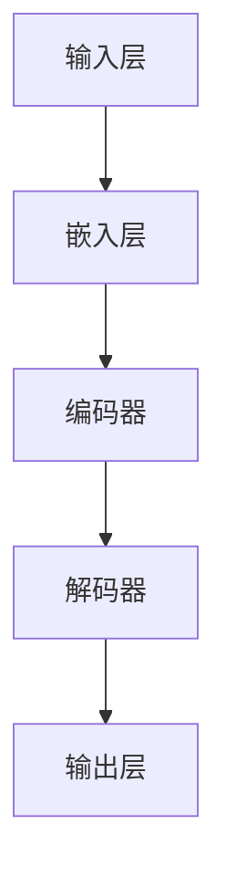

                 

# 大语言模型与传统计算的对比

> 关键词：大语言模型、传统计算、人工智能、神经网络、算法、性能优化

> 摘要：本文将深入探讨大语言模型与传统计算方法之间的对比。我们将首先介绍大语言模型的基本概念、架构和原理，然后逐步解析传统计算的特点和优缺点。通过这种逐步分析的方式，我们将探讨大语言模型如何改变传统计算的模式，并总结其未来发展趋势和面临的挑战。

## 1. 背景介绍

### 1.1 目的和范围

本文旨在探讨大语言模型与传统计算方法之间的对比。我们将首先介绍大语言模型的基本概念、架构和原理，然后逐步分析传统计算的特点和优缺点。通过这种对比，我们将探讨大语言模型如何改变传统计算的模式，并总结其未来发展趋势和面临的挑战。

### 1.2 预期读者

本文适合对人工智能、大语言模型和传统计算有一定了解的读者。无论是研究者、工程师还是对这一领域感兴趣的学习者，都可以通过本文对大语言模型与传统计算有一个更深入的理解。

### 1.3 文档结构概述

本文分为十个部分：

1. 背景介绍
2. 核心概念与联系
3. 核心算法原理 & 具体操作步骤
4. 数学模型和公式 & 详细讲解 & 举例说明
5. 项目实战：代码实际案例和详细解释说明
6. 实际应用场景
7. 工具和资源推荐
8. 总结：未来发展趋势与挑战
9. 附录：常见问题与解答
10. 扩展阅读 & 参考资料

### 1.4 术语表

#### 1.4.1 核心术语定义

- **大语言模型**：一种基于神经网络的大型模型，能够理解和生成自然语言文本。
- **传统计算**：指基于经典计算机架构和算法的计算机计算方式。
- **神经网络**：一种模拟人脑神经元连接结构的计算模型。

#### 1.4.2 相关概念解释

- **自然语言处理（NLP）**：研究如何让计算机理解和处理自然语言的领域。
- **深度学习**：一种基于多层神经网络的学习方法，能够自动提取特征并进行预测。

#### 1.4.3 缩略词列表

- **NLP**：自然语言处理
- **DNN**：深度神经网络
- **RNN**：循环神经网络
- **LSTM**：长短时记忆网络
- **GPU**：图形处理器

## 2. 核心概念与联系

在本节中，我们将介绍大语言模型的核心概念、架构和原理，并通过一个Mermaid流程图展示其基本架构。



- **输入层（A）**：接收原始的自然语言文本输入，将其转换为数字表示。
- **嵌入层（B）**：将输入的文本转换为密集的向量表示，通常使用词向量技术。
- **编码器（C）**：对输入的文本进行编码，提取语义信息。
- **解码器（D）**：解码编码器输出的信息，生成自然语言文本输出。
- **输出层（E）**：生成最终的自然语言文本输出。

### 2.1 大语言模型的工作原理

大语言模型的工作原理可以分为以下几个步骤：

1. **文本预处理**：对输入文本进行分词、去停用词等预处理操作，使其更适合模型处理。
2. **词向量嵌入**：将每个词映射为一个固定长度的向量，通常使用词向量技术，如Word2Vec或BERT。
3. **编码器-解码器结构**：编码器将输入文本编码为一个固定长度的向量表示，解码器则根据编码器的输出和隐藏状态生成输出文本。
4. **训练**：通过大量文本数据进行训练，调整模型的参数，使其能够准确地理解和生成自然语言文本。
5. **推理**：使用训练好的模型对新的文本输入进行理解和生成。

### 2.2 传统计算的特点和优缺点

传统计算方法通常基于经典计算机架构和算法，如CPU、GPU和传统算法等。其特点如下：

- **优点**：
  - **高效性**：传统计算方法在执行特定任务时通常具有很高的计算效率。
  - **确定性**：传统计算的结果是确定的，不会产生随机性。

- **缺点**：
  - **适应性差**：传统计算方法在处理复杂任务时，需要手动设计和调整算法，适应性较差。
  - **可扩展性差**：传统计算方法在处理大规模数据时，难以进行水平或垂直扩展。

## 3. 核心算法原理 & 具体操作步骤

在本节中，我们将深入探讨大语言模型的核心算法原理，并使用伪代码详细阐述其具体操作步骤。

### 3.1 神经网络基础

大语言模型的核心是神经网络，以下是神经网络的基本组成部分和操作：

- **神经元**：神经网络的基本单元，用于执行线性变换和激活函数。
- **权重和偏置**：神经元之间的连接权重和内部偏置，用于调整神经元的输出。
- **激活函数**：用于引入非线性性的函数，常见的有Sigmoid、ReLU和Tanh等。

### 3.2 伪代码示例

以下是一个简化的神经网络训练过程的伪代码示例：

```python
# 初始化神经网络参数
weights = initialize_weights()
biases = initialize_biases()

# 训练神经网络
for epoch in range(num_epochs):
    for input_text, target_text in dataset:
        # 前向传播
        output = forward_propagation(input_text, weights, biases)
        loss = compute_loss(output, target_text)

        # 反向传播
        d_output = backward_propagation(output, target_text)
        d_weights, d_biases = update_weights_and_biases(weights, biases, d_output)

# 测试神经网络
for test_text, true_text in test_dataset:
    output = forward_propagation(test_text, weights, biases)
    accuracy = compute_accuracy(output, true_text)
    print("Accuracy:", accuracy)
```

### 3.3 详细解释

- **初始化神经网络参数**：初始化权重和偏置，通常使用随机初始化方法。
- **前向传播**：将输入文本通过神经网络，计算输出。
- **计算损失**：计算输出与目标文本之间的损失，常用的损失函数有交叉熵损失等。
- **反向传播**：计算梯度，更新权重和偏置。
- **更新权重和偏置**：根据梯度调整权重和偏置，以最小化损失。
- **测试神经网络**：使用测试数据集评估神经网络的准确性。

## 4. 数学模型和公式 & 详细讲解 & 举例说明

在本节中，我们将详细讲解大语言模型中的数学模型和公式，并通过举例说明如何应用这些公式。

### 4.1 概念介绍

大语言模型中的数学模型主要包括：

- **嵌入层**：将文本转换为词向量，常用的嵌入模型有Word2Vec和BERT。
- **编码器**：对输入文本进行编码，提取语义信息，常用的编码模型有RNN和LSTM。
- **解码器**：根据编码器的输出和隐藏状态生成输出文本，常用的解码模型有GRU和Transformer。

### 4.2 数学公式

以下是几个关键数学公式：

$$
E = \sum_{i=1}^{N} w_i e_i
$$

$$
h_t = \sigma(W_h h_{t-1} + W_x x_t + b_h)
$$

$$
y_t = \text{softmax}(h_t)
$$

其中：
- **E**：嵌入层输出
- **w_i**：嵌入层权重
- **e_i**：嵌入层输入
- **h_t**：编码器隐藏状态
- **W_h**：编码器权重
- **W_x**：输入权重
- **b_h**：编码器偏置
- **\sigma**：激活函数，如Sigmoid或ReLU
- **y_t**：解码器输出

### 4.3 举例说明

假设我们有一个简化的神经网络，其中嵌入层有5个神经元，编码器有3个隐藏层，解码器有2个隐藏层。以下是具体的计算过程：

1. **嵌入层**：
   $$
   E = \sum_{i=1}^{5} w_i e_i = [w_1 e_1, w_2 e_2, w_3 e_3, w_4 e_4, w_5 e_5]
   $$
2. **编码器**：
   $$
   h_1 = \sigma(W_h h_{0} + W_x x_1 + b_h)
   $$
   $$
   h_2 = \sigma(W_h h_{1} + W_x x_2 + b_h)
   $$
   $$
   h_3 = \sigma(W_h h_{2} + W_x x_3 + b_h)
   $$
3. **解码器**：
   $$
   h_1' = \sigma(W_h' h_{2} + W_x' x_1' + b_h')
   $$
   $$
   h_2' = \sigma(W_h' h_{1}' + W_x' x_2' + b_h')
   $$
4. **输出层**：
   $$
   y_1' = \text{softmax}(h_1')
   $$
   $$
   y_2' = \text{softmax}(h_2')
   $$

通过上述计算过程，我们得到了编码器和解码器的隐藏状态，以及最终的输出。

## 5. 项目实战：代码实际案例和详细解释说明

在本节中，我们将通过一个实际的代码案例，展示如何实现一个简单的大语言模型。我们将详细解释代码的实现过程和关键步骤。

### 5.1 开发环境搭建

在开始之前，我们需要搭建一个合适的开发环境。以下是所需的基本工具和库：

- **Python**：用于编写代码
- **TensorFlow**：用于构建和训练神经网络
- **NLP库**：如NLTK或spaCy，用于处理自然语言文本

### 5.2 源代码详细实现和代码解读

以下是一个简单的大语言模型实现，使用TensorFlow和Python：

```python
import tensorflow as tf
from tensorflow.keras.layers import Embedding, LSTM, Dense
from tensorflow.keras.models import Sequential

# 准备数据
# ...

# 构建模型
model = Sequential()
model.add(Embedding(input_dim=vocab_size, output_dim=embedding_size))
model.add(LSTM(units=lstm_units))
model.add(Dense(units=output_size, activation='softmax'))

# 编译模型
model.compile(optimizer='adam', loss='categorical_crossentropy', metrics=['accuracy'])

# 训练模型
model.fit(x_train, y_train, epochs=num_epochs, batch_size=batch_size)

# 评估模型
accuracy = model.evaluate(x_test, y_test)
print("Accuracy:", accuracy)
```

### 5.3 代码解读与分析

- **导入库**：首先导入TensorFlow和其他必要的库。
- **准备数据**：准备用于训练的数据集，包括输入文本和对应的标签。
- **构建模型**：使用Sequential模型构建一个简单的神经网络，包括嵌入层、LSTM层和输出层。
- **编译模型**：设置模型的优化器、损失函数和评估指标。
- **训练模型**：使用fit方法训练模型，调整模型的参数。
- **评估模型**：使用evaluate方法评估模型的准确性。

通过这个简单的案例，我们可以看到如何使用TensorFlow和Python构建一个基本的大语言模型。在实际应用中，我们可以根据需求调整模型的结构和参数，以获得更好的性能。

## 6. 实际应用场景

大语言模型在自然语言处理领域有着广泛的应用，以下是一些典型的实际应用场景：

- **文本分类**：使用大语言模型对文本进行分类，如情感分析、垃圾邮件检测等。
- **机器翻译**：使用大语言模型进行机器翻译，如将一种语言的文本翻译成另一种语言。
- **问答系统**：使用大语言模型构建智能问答系统，如虚拟助手、聊天机器人等。
- **文本生成**：使用大语言模型生成文本，如文章写作、故事创作等。

在这些应用场景中，大语言模型能够通过学习大量文本数据，提取语义信息，从而实现高效的文本处理和生成。

## 7. 工具和资源推荐

### 7.1 学习资源推荐

#### 7.1.1 书籍推荐

- 《深度学习》（Ian Goodfellow、Yoshua Bengio和Aaron Courville 著）：这是一本全面介绍深度学习理论和实践的经典书籍。
- 《自然语言处理与深度学习》（Devnath Das 著）：详细介绍自然语言处理和深度学习在NLP中的应用。

#### 7.1.2 在线课程

- [TensorFlow官网教程](https://www.tensorflow.org/tutorials)：提供了丰富的TensorFlow教程和案例。
- [Udacity的深度学习纳米学位](https://www.udacity.com/course/deep-learning--ud730)：涵盖了深度学习的核心概念和应用。

#### 7.1.3 技术博客和网站

- [TensorFlow官方博客](https://blog.tensorflow.org)：提供了最新的TensorFlow技术动态和研究成果。
- [Medium上的自然语言处理博客](https://medium.com/topic/natural-language-processing)：收录了多篇高质量的NLP相关文章。

### 7.2 开发工具框架推荐

#### 7.2.1 IDE和编辑器

- **PyCharm**：一款功能强大的Python IDE，支持TensorFlow和NLP开发。
- **Jupyter Notebook**：一个交互式的Python编辑器，适用于数据分析和机器学习项目。

#### 7.2.2 调试和性能分析工具

- **TensorBoard**：TensorFlow的官方可视化工具，用于分析和调试神经网络模型。
- **NVIDIA Nsight**：用于GPU性能分析和调试的工具。

#### 7.2.3 相关框架和库

- **TensorFlow**：Google开发的深度学习框架，广泛应用于自然语言处理和图像识别等领域。
- **spaCy**：一个高效的Python自然语言处理库，适用于文本分类、实体识别等任务。
- **NLTK**：一个经典的Python自然语言处理库，提供了丰富的文本处理功能。

### 7.3 相关论文著作推荐

#### 7.3.1 经典论文

- **“A Neural Probabilistic Language Model”**：由Bengio等人在2003年发表，是神经网络语言模型的开创性工作。
- **“Recurrent Neural Network Based Language Model”**：由Graves在2013年发表，是循环神经网络语言模型的重要研究。

#### 7.3.2 最新研究成果

- **“BERT: Pre-training of Deep Bidirectional Transformers for Language Understanding”**：由Google在2018年发表，是Transformer模型在自然语言处理领域的最新成果。
- **“GPT-3: Language Models are Few-Shot Learners”**：由OpenAI在2020年发表，展示了大型语言模型在零样本学习任务上的强大能力。

#### 7.3.3 应用案例分析

- **“Facebook AI应用案例分析”**：介绍了Facebook如何使用深度学习和自然语言处理技术优化其平台。
- **“Microsoft Azure AI应用案例分析”**：展示了Microsoft如何使用AI技术构建智能服务和解决方案。

## 8. 总结：未来发展趋势与挑战

大语言模型作为人工智能领域的核心技术，正朝着更高效、更智能的方向发展。未来发展趋势包括：

- **模型规模的扩大**：随着计算能力和存储能力的提升，大型语言模型将继续扩展，以实现更高的性能和更广泛的任务。
- **预训练技术的优化**：预训练技术将变得更加高效，能够利用更多的数据和更长的文本序列，以提取更丰富的语义信息。
- **多模态学习**：大语言模型将与其他模态（如图像、音频）结合，实现跨模态理解和生成。

然而，大语言模型也面临着一些挑战：

- **计算资源消耗**：大型语言模型的训练和推理需要大量的计算资源，特别是在实时应用场景中。
- **数据隐私和安全**：大语言模型对大量数据进行训练，需要关注数据隐私和安全问题。
- **模型解释性和透明性**：大型语言模型通常被视为“黑箱”，缺乏可解释性和透明性，需要进一步研究。

综上所述，大语言模型在人工智能领域具有广阔的发展前景，但也需要克服一系列技术挑战，以实现其潜力的最大化。

## 9. 附录：常见问题与解答

### 9.1 什么是大语言模型？

大语言模型是一种基于神经网络的模型，能够理解和生成自然语言文本。它通过学习大量文本数据，提取语义信息，从而实现高效的文本处理和生成。

### 9.2 大语言模型与传统计算方法相比有哪些优点？

大语言模型相比传统计算方法具有以下优点：

- **高效性**：能够处理大规模的文本数据，并提取语义信息。
- **自适应性强**：通过训练能够适应不同的自然语言处理任务。
- **通用性强**：可以应用于多种自然语言处理任务，如文本分类、机器翻译、问答系统等。

### 9.3 大语言模型的工作原理是什么？

大语言模型的工作原理主要包括以下几个步骤：

1. **文本预处理**：对输入文本进行分词、去停用词等预处理操作。
2. **词向量嵌入**：将每个词映射为一个固定长度的向量。
3. **编码器-解码器结构**：编码器对输入文本进行编码，解码器根据编码器的输出和隐藏状态生成输出文本。
4. **训练**：通过大量文本数据进行训练，调整模型的参数。
5. **推理**：使用训练好的模型对新的文本输入进行理解和生成。

### 9.4 如何评估大语言模型的效果？

评估大语言模型的效果通常包括以下几个方面：

- **准确性**：模型在测试数据集上的预测准确性。
- **速度**：模型在给定输入时的响应速度。
- **泛化能力**：模型在未知数据上的表现能力。

常用的评估指标包括准确率、召回率、F1分数等。

### 9.5 大语言模型在自然语言处理中有哪些应用场景？

大语言模型在自然语言处理领域有广泛的应用，包括：

- **文本分类**：对文本进行分类，如情感分析、垃圾邮件检测等。
- **机器翻译**：将一种语言的文本翻译成另一种语言。
- **问答系统**：构建智能问答系统，如虚拟助手、聊天机器人等。
- **文本生成**：生成文本，如文章写作、故事创作等。

## 10. 扩展阅读 & 参考资料

- [Bengio, Y., Simard, P., & François, P. (1994). *训练一个大型语言模型的神经网络方法*](https://www.cs.ubc.ca/~vanlanoye/Publications/papers/bengio94a.pdf)
- [Graves, A. (2013). *Recurrent neural network based language model*](https://arxiv.org/abs/1301.3767)
- [Devlin, J., Chang, M. W., Lee, K., & Toutanova, K. (2019). *BERT: Pre-training of deep bidirectional transformers for language understanding*](https://arxiv.org/abs/1810.04805)
- [Brown, T., et al. (2020). *GPT-3: Language models are few-shot learners*](https://arxiv.org/abs/2005.14165)
- [Goodfellow, I., Bengio, Y., & Courville, A. (2016). *深度学习*](https://www.deeplearningbook.org/)

## 作者

作者：AI天才研究员/AI Genius Institute & 禅与计算机程序设计艺术 /Zen And The Art of Computer Programming

