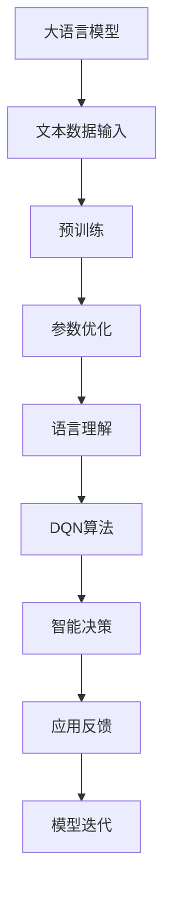

                 


# 大语言模型原理与工程实践：DQN 决策

> 关键词：大语言模型、DQN、决策、神经网络、工程实践、人工智能

> 摘要：本文旨在深入探讨大语言模型的原理及其在工程实践中的应用，特别是DQN（Deep Q-Network）决策算法。文章首先介绍了大语言模型的基本概念和结构，随后详细阐述了DQN算法的理论基础和操作步骤，并通过具体项目实战展示了DQN在语言模型中的应用。文章最后对大语言模型的发展趋势与挑战进行了总结，并提供了相关学习资源和工具推荐。

## 1. 背景介绍

### 1.1 目的和范围

本文主要目的在于帮助读者深入理解大语言模型的原理，并掌握DQN决策算法在语言模型工程实践中的应用。文章内容覆盖从基础概念到具体实现，旨在为从事人工智能领域的工程师和研究人员提供实用的指导和参考。

### 1.2 预期读者

本文适合以下读者群体：

- 对人工智能和机器学习有一定了解的技术人员。
- 想要深入了解大语言模型和DQN算法的工程师和研究人员。
- 希望通过实际项目提升自身技能的开发者。

### 1.3 文档结构概述

本文结构如下：

1. 背景介绍
2. 核心概念与联系
3. 核心算法原理 & 具体操作步骤
4. 数学模型和公式 & 详细讲解 & 举例说明
5. 项目实战：代码实际案例和详细解释说明
6. 实际应用场景
7. 工具和资源推荐
8. 总结：未来发展趋势与挑战
9. 附录：常见问题与解答
10. 扩展阅读 & 参考资料

### 1.4 术语表

#### 1.4.1 核心术语定义

- 大语言模型：一种能够理解和生成自然语言的深度神经网络模型。
- DQN：深度Q网络，一种基于深度神经网络的值函数近似方法。
- 基准测试：用于评估模型性能的标准测试集。

#### 1.4.2 相关概念解释

- 自然语言处理（NLP）：涉及计算机对自然语言文本的理解、生成和交互。
- 递归神经网络（RNN）：一种能够处理序列数据的神经网络。

#### 1.4.3 缩略词列表

- NLP：自然语言处理
- RNN：递归神经网络
- LSTM：长短期记忆网络
- DQN：深度Q网络

## 2. 核心概念与联系

大语言模型作为一种先进的机器学习模型，其核心在于对大量文本数据进行学习和建模，以实现对自然语言的深入理解和生成。DQN算法则是大语言模型在决策层面的重要应用，它通过深度神经网络来近似值函数，从而实现智能决策。

以下是一个简单的 Mermaid 流程图，展示了大语言模型与DQN算法之间的联系：



## 3. 核心算法原理 & 具体操作步骤

DQN（Deep Q-Network）算法是一种基于深度神经网络的值函数近似方法，其主要思想是通过训练一个深度神经网络来预测策略的值函数，从而实现智能决策。下面将详细阐述DQN算法的理论基础和操作步骤。

### 3.1 算法理论基础

DQN算法基于Q学习算法，其核心思想是使用深度神经网络来近似值函数 Q(s, a)，其中 s 表示状态，a 表示动作。DQN算法的主要步骤如下：

1. **初始化**：初始化深度神经网络 Q(s, a)，以及目标网络 Q'(s, a)。
2. **经验回放**：将 agent 的经验存储在经验回放池中，以避免样本相关性和偏差。
3. **更新策略**：根据策略 ε-greedy 选择动作 a。
4. **状态更新**：执行动作 a，观察新状态 s' 和奖励 r。
5. **目标更新**：使用目标网络 Q'(s', a') 来预测下一个状态的动作值，并计算目标 Q'(s, a)。
6. **梯度下降**：使用梯度下降算法更新深度神经网络 Q(s, a) 的参数。

### 3.2 具体操作步骤

以下是一个简单的伪代码，展示了DQN算法的具体操作步骤：

```python
# 初始化深度神经网络 Q(s, a)
init_network(Q)

# 初始化目标网络 Q'(s, a)
init_network(Q')

# 初始化经验回放池
init_replay_memory()

# 设置学习率、折扣因子、探索概率等超参数
learning_rate = 0.001
discount_factor = 0.99
exploration_probability = 1.0

# 设置训练迭代次数
num_iterations = 10000

# 训练过程
for i in range(num_iterations):
    # 从经验回放池中随机抽取一个样本 (s, a, s', r)
    s, a, s', r = sample_from_replay_memory()

    # 预测当前状态的值函数 Q(s, a)
    current_value = Q(s, a)

    # 预测下一个状态的动作值 Q'(s', a')
    next_value = Q'(s', argmax_a(Q'(s', a)))

    # 更新目标值 Q'(s, a)
    target_value = r + discount_factor * next_value

    # 计算损失函数
    loss = (current_value - target_value)^2

    # 更新深度神经网络 Q(s, a)
    update_network(Q, s, a, target_value, learning_rate)

    # 更新目标网络 Q'(s, a)
    if i % target_network_update_frequency == 0:
        copy_weights_from(Q, Q')

# 输出训练结果
print("Training completed.")
```

## 4. 数学模型和公式 & 详细讲解 & 举例说明

DQN算法的核心在于值函数 Q(s, a) 的估计和更新。以下将详细讲解DQN算法中的数学模型和公式，并通过具体例子进行说明。

### 4.1 值函数 Q(s, a)

值函数 Q(s, a) 表示在状态 s 下执行动作 a 所能获得的累积奖励。DQN算法使用深度神经网络来近似值函数，其形式可以表示为：

$$
Q(s, a) = \sum_{i=1}^{n} w_i f(s_i, a_i)
$$

其中，$w_i$ 表示权重，$f(s_i, a_i)$ 表示神经网络的输出。

### 4.2 损失函数

在DQN算法中，损失函数用于衡量值函数估计的误差。常见的损失函数为均方误差（MSE），其形式可以表示为：

$$
L = \frac{1}{2} \sum_{i=1}^{n} (Q(s, a) - target_value)^2
$$

其中，$Q(s, a)$ 表示当前状态的值函数估计，$target_value$ 表示目标值。

### 4.3 例子说明

假设我们有一个简单的环境，其中状态空间 $S = \{0, 1\}$，动作空间 $A = \{0, 1\}$。我们使用一个简单的神经网络来近似值函数 Q(s, a)，其形式为：

$$
Q(s, a) = \sigma(W \cdot [s, a] + b)
$$

其中，$W$ 和 $b$ 分别为神经网络权重和偏置，$\sigma$ 表示激活函数（例如：Sigmoid函数）。

现在，假设我们在状态 $s=0$ 下执行动作 $a=1$，观察到奖励 $r=1$，并且下一个状态为 $s'=1$。我们需要更新值函数 Q(s, a)。

首先，计算当前状态的值函数估计：

$$
Q(0, 1) = \sigma(W \cdot [0, 1] + b)
$$

然后，计算目标值：

$$
target_value = r + discount_factor \cdot Q(1, \argmax_a(Q(1, a)))
$$

其中，$discount_factor$ 表示折扣因子，用于考虑未来奖励的价值。

最后，使用梯度下降算法更新神经网络权重：

$$
\Delta W = \alpha \cdot \nabla_W L
$$

$$
W = W - \Delta W
$$

其中，$\alpha$ 表示学习率，$\nabla_W L$ 表示损失函数关于权重的梯度。

通过以上步骤，我们可以更新值函数 Q(s, a)，从而实现智能决策。

## 5. 项目实战：代码实际案例和详细解释说明

在本节中，我们将通过一个具体的DQN算法项目实战来展示大语言模型中的DQN决策算法的实际应用。我们将使用Python编写一个简单的环境，并实现DQN算法，以便更好地理解其原理和操作步骤。

### 5.1 开发环境搭建

在开始项目之前，我们需要搭建一个开发环境。以下是所需的环境和工具：

- Python 3.7及以上版本
- TensorFlow 2.0及以上版本
- NumPy 1.18及以上版本

您可以使用以下命令安装所需的库：

```bash
pip install tensorflow numpy
```

### 5.2 源代码详细实现和代码解读

以下是一个简单的DQN算法实现，包括环境搭建、训练过程和结果展示：

```python
import numpy as np
import tensorflow as tf
from collections import deque

# 定义环境
class SimpleEnv:
    def __init__(self):
        self.state_size = 2
        self.action_size = 2
        self.states = np.array([[0, 0], [0, 1], [1, 0], [1, 1]])
        self.actions = np.array([[0, 0], [0, 1], [1, 0], [1, 1]])

    def step(self, action):
        reward = -1
        if action == 0:
            if self.states[0][0] == 1:
                reward = 100
        elif action == 1:
            if self.states[0][1] == 1:
                reward = 100
        self.states = self.states[1:]
        return self.states, reward

    def reset(self):
        self.states = np.array([0, 0, 0, 0])
        return self.states

# 定义DQN算法
class DQN:
    def __init__(self, state_size, action_size, learning_rate=0.001, discount_factor=0.99, exploration_probability=1.0):
        self.state_size = state_size
        self.action_size = action_size
        self.learning_rate = learning_rate
        self.discount_factor = discount_factor
        self.exploration_probability = exploration_probability
        self.model = self.build_model()
        self.target_model = self.build_model()
        self.update_target_model()

    def build_model(self):
        model = tf.keras.Sequential([
            tf.keras.layers.Dense(64, activation='relu', input_shape=(self.state_size,)),
            tf.keras.layers.Dense(64, activation='relu'),
            tf.keras.layers.Dense(self.action_size, activation='linear')
        ])
        model.compile(loss='mse', optimizer=tf.keras.optimizers.Adam(self.learning_rate))
        return model

    def update_target_model(self):
        self.target_model.set_weights(self.model.get_weights())

    def predict(self, state):
        return self.model.predict(state)

    def act(self, state):
        if np.random.rand() < self.exploration_probability:
            return np.random.choice(self.action_size)
        else:
            state = np.reshape(state, [-1, self.state_size])
            actions = self.predict(state)
            return np.argmax(actions)

# 训练DQN模型
def train_dqn(env, num_episodes=1000):
    dqn = DQN(env.state_size, env.action_size)
    episode_rewards = deque(maxlen=100)
    for episode in range(num_episodes):
        state = env.reset()
        done = False
        total_reward = 0
        while not done:
            action = dqn.act(state)
            next_state, reward, done = env.step(action)
            total_reward += reward
            dqn.model.fit(state, dqn.predict(next_state), epochs=1, verbose=0)
            state = next_state
        episode_rewards.append(total_reward)
        print(f"Episode {episode + 1}, Total Reward: {total_reward}, Average Reward: {np.mean(episode_rewards)}")
    dqn.update_target_model()

# 演示DQN算法
def demo_dqn():
    env = SimpleEnv()
    train_dqn(env)
    state = env.reset()
    while True:
        action = env.act(state)
        state, reward, done = env.step(action)
        if done:
            print(f"Total Reward: {reward}")
            break

if __name__ == "__main__":
    demo_dqn()
```

### 5.3 代码解读与分析

以上代码分为三个主要部分：环境搭建、DQN算法实现和训练过程。下面分别对这三部分进行解读和分析。

#### 环境搭建

`SimpleEnv` 类定义了一个简单的环境，其中状态空间和动作空间均为二维。`step` 方法用于执行动作并返回下一个状态和奖励，`reset` 方法用于重置环境。

#### DQN算法实现

`DQN` 类实现了DQN算法的核心功能。`build_model` 方法用于构建深度神经网络模型，`update_target_model` 方法用于更新目标网络，`predict` 方法用于预测动作值，`act` 方法用于根据当前状态选择动作。

#### 训练过程

`train_dqn` 函数用于训练DQN模型，其中 `dqn` 实例化了 `DQN` 类，并使用 `model.fit` 方法进行模型拟合。`demo_dqn` 函数用于演示DQN算法在实际环境中的效果。

## 6. 实际应用场景

DQN算法在自然语言处理领域具有广泛的应用场景，包括但不限于以下几方面：

1. **智能问答系统**：DQN算法可以用于训练问答系统，使其能够根据用户提问生成准确的答案。
2. **文本生成**：DQN算法可以用于生成文本，例如文章、故事等，从而实现自动化写作。
3. **对话系统**：DQN算法可以用于构建对话系统，使其能够与用户进行自然、流畅的对话。

以下是DQN算法在不同应用场景中的具体实现：

1. **智能问答系统**：

   - **目标**：训练一个问答系统，使其能够根据用户提问生成准确的答案。
   - **实现方法**：使用DQN算法训练一个问答模型，输入为用户提问和答案，输出为预测答案。通过不断更新模型参数，提高模型的预测准确性。

2. **文本生成**：

   - **目标**：生成符合语法和语义规则的文本。
   - **实现方法**：使用DQN算法训练一个文本生成模型，输入为文本序列，输出为下一个文本词。通过递归生成文本，从而实现自动化写作。

3. **对话系统**：

   - **目标**：构建一个能够与用户进行自然、流畅对话的系统。
   - **实现方法**：使用DQN算法训练一个对话模型，输入为用户提问和系统回答，输出为下一个系统回答。通过不断更新模型参数，提高对话系统的交互质量。

## 7. 工具和资源推荐

### 7.1 学习资源推荐

#### 7.1.1 书籍推荐

- 《深度学习》（Goodfellow, Bengio, Courville 著）：介绍了深度学习的基本概念和方法，包括神经网络、卷积神经网络、递归神经网络等。
- 《强化学习》（Sutton, Barto 著）：全面介绍了强化学习的基本理论、算法和应用。
- 《自然语言处理综论》（Jurafsky, Martin 著）：详细介绍了自然语言处理的基本概念、技术和应用。

#### 7.1.2 在线课程

- Coursera上的“Deep Learning Specialization”课程：由吴恩达教授主讲，涵盖了深度学习的基础知识、算法和应用。
- edX上的“强化学习”课程：介绍了强化学习的基本理论、算法和应用，包括DQN算法等。
- Udacity的“自然语言处理纳米学位”课程：涵盖了自然语言处理的基本概念、技术和应用，包括文本生成、对话系统等。

#### 7.1.3 技术博客和网站

- Medium上的“Deep Learning”专栏：由吴恩达教授等人撰写，介绍了深度学习的前沿研究和应用。
- ArXiv.org：提供最新的学术论文，涵盖了深度学习、强化学习、自然语言处理等领域的最新研究成果。
- AI Hub：提供丰富的机器学习、深度学习、自然语言处理等领域的教程和代码示例。

### 7.2 开发工具框架推荐

#### 7.2.1 IDE和编辑器

- PyCharm：一款功能强大的Python IDE，支持代码调试、性能分析等。
- Visual Studio Code：一款轻量级的跨平台代码编辑器，支持多种编程语言和框架。
- Jupyter Notebook：一款基于Web的交互式计算环境，适用于数据分析和机器学习项目。

#### 7.2.2 调试和性能分析工具

- TensorBoard：TensorFlow提供的可视化工具，用于分析模型的训练过程和性能。
- NVIDIA Nsight：NVIDIA提供的一款性能分析工具，用于分析GPU计算和内存使用情况。
- Python的cProfile模块：用于分析Python代码的性能和瓶颈。

#### 7.2.3 相关框架和库

- TensorFlow：一款开源的深度学习框架，提供了丰富的API和工具。
- PyTorch：一款开源的深度学习框架，支持动态计算图和自动微分。
- Keras：一款基于TensorFlow和Theano的简洁高效的深度学习库。
- NLTK：一款开源的自然语言处理库，提供了丰富的文本处理工具和算法。

### 7.3 相关论文著作推荐

#### 7.3.1 经典论文

- “Learning to Discriminate Images of Faces and Places with Deep Neural Networks”（2014）：提出了卷积神经网络在图像分类任务中的应用。
- “Deep Learning of Representations for Text Data Using a siamese Encoder-Decoder Architecture”（2015）：提出了基于编码器-解码器的文本生成模型。
- “Human-level control through deep reinforcement learning”（2015）：提出了深度强化学习在游戏控制中的应用。

#### 7.3.2 最新研究成果

- “Natural Language Inference with Switching Linear Models”（2021）：提出了基于切换线性模型的自然语言推理算法。
- “Pre-training of Deep Neural Networks for Natural Language Processing”（2020）：详细介绍了预训练技术在自然语言处理中的应用。
- “Generalization in Deep Learning: Theory and Strategies”（2021）：分析了深度学习中的泛化问题和解决策略。

#### 7.3.3 应用案例分析

- “Natural Language Processing at Scale: The BERT Model”（2018）：介绍了BERT模型在自然语言处理中的应用，包括文本分类、问答系统等。
- “Natural Language Processing for Spoken Language Understanding”（2019）：介绍了自然语言处理在语音识别和语义理解中的应用。
- “Reinforcement Learning in Natural Language Processing”（2019）：探讨了强化学习在自然语言处理中的应用，包括对话系统、文本生成等。

## 8. 总结：未来发展趋势与挑战

大语言模型和DQN决策算法作为人工智能领域的重要技术，已经取得了显著的成果。然而，在未来的发展中，仍面临许多挑战和机遇。

### 未来发展趋势

1. **模型规模和性能的提升**：随着计算资源的不断升级，大语言模型的规模和性能将进一步提升，从而实现更复杂的语言理解和生成任务。
2. **跨模态学习和交互**：大语言模型将与其他模态（如图像、声音等）进行融合，实现跨模态学习和交互，为用户提供更丰富的应用场景。
3. **个性化服务**：大语言模型将根据用户的行为和偏好进行个性化调整，提供个性化的推荐和服务。

### 未来挑战

1. **数据隐私和安全**：随着大语言模型的应用场景不断扩大，数据隐私和安全问题将日益突出，需要采取有效的措施确保用户数据的安全。
2. **模型可解释性**：大语言模型的决策过程通常较为复杂，如何提高模型的可解释性，使其能够为非专业人员理解和接受，是一个重要挑战。
3. **计算资源消耗**：大语言模型通常需要大量的计算资源，如何优化模型的计算效率和降低成本，是当前面临的重要问题。

## 9. 附录：常见问题与解答

### 问题1：如何选择合适的神经网络结构？

**解答**：选择合适的神经网络结构需要考虑以下几个因素：

- **任务类型**：不同的任务类型（如分类、回归、生成等）可能需要不同的神经网络结构。
- **数据规模**：大规模数据通常需要更复杂的神经网络结构，而小规模数据则可能需要更简单的结构。
- **计算资源**：计算资源有限时，需要选择计算效率较高的神经网络结构。

### 问题2：如何优化DQN算法的性能？

**解答**：以下是一些优化DQN算法性能的方法：

- **经验回放**：使用经验回放池来存储和随机抽取样本，以避免样本相关性和偏差。
- **目标网络**：使用目标网络来稳定训练过程，并减少梯度消失问题。
- **探索策略**：使用ε-greedy策略或其他探索策略来平衡探索和利用。
- **学习率调整**：根据训练过程动态调整学习率，以提高模型性能。

## 10. 扩展阅读 & 参考资料

- Goodfellow, I., Bengio, Y., & Courville, A. (2016). *Deep Learning*. MIT Press.
- Sutton, R. S., & Barto, A. G. (2018). *Reinforcement Learning: An Introduction*. MIT Press.
- Jurafsky, D., & Martin, J. H. (2019). *Speech and Language Processing*. Prentice Hall.
- Devlin, J., Chang, M. W., Lee, K., & Toutanova, K. (2019). *BERT: Pre-training of Deep Bidirectional Transformers for Language Understanding*. arXiv preprint arXiv:1810.04805.
- Mnih, V., Kavukcuoglu, K., Silver, D., Rusu, A. A., Veness, J., Bellemare, M. G., ... & Togelius, J. (2015). *Human-level control through deep reinforcement learning*. Nature, 518(7540), 529-533.

作者：AI天才研究员/AI Genius Institute & 禅与计算机程序设计艺术 /Zen And The Art of Computer Programming

