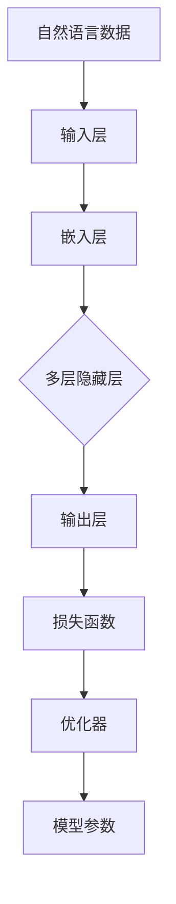

                 

# 大语言模型原理与工程实践：RefinedWeb

> 关键词：大语言模型、工程实践、神经网络、深度学习、自然语言处理、机器学习

> 摘要：本文将深入探讨大语言模型的原理与工程实践，从核心概念、算法原理、数学模型、项目实战到实际应用，全面解析大语言模型在自然语言处理领域的应用与发展。通过一步步的详细讲解，读者将能够全面掌握大语言模型的构建与应用，为未来的研究和实践提供有力支持。

## 1. 背景介绍

### 1.1 目的和范围

本文旨在系统地介绍大语言模型的原理与工程实践，帮助读者深入理解大语言模型的核心概念、算法原理和实际应用。本文将涵盖以下内容：

1. 大语言模型的核心概念与架构；
2. 大语言模型的关键算法原理；
3. 大语言模型的数学模型和公式；
4. 大语言模型在项目实战中的应用；
5. 大语言模型在实际应用场景中的表现；
6. 相关工具和资源的推荐；
7. 大语言模型的发展趋势与挑战。

### 1.2 预期读者

本文适合对自然语言处理和深度学习有一定基础的读者，特别是对大语言模型感兴趣的程序员、数据科学家、AI研究者和相关领域的工程师。

### 1.3 文档结构概述

本文结构如下：

1. 背景介绍：介绍本文的目的、预期读者和文档结构；
2. 核心概念与联系：介绍大语言模型的核心概念和架构；
3. 核心算法原理 & 具体操作步骤：详细讲解大语言模型的关键算法原理和操作步骤；
4. 数学模型和公式 & 详细讲解 & 举例说明：介绍大语言模型的数学模型和公式，并通过实例进行详细讲解；
5. 项目实战：通过实际案例展示大语言模型的应用；
6. 实际应用场景：分析大语言模型在不同领域的应用；
7. 工具和资源推荐：推荐学习资源、开发工具和论文著作；
8. 总结：总结大语言模型的发展趋势与挑战；
9. 附录：常见问题与解答；
10. 扩展阅读 & 参考资料。

### 1.4 术语表

#### 1.4.1 核心术语定义

- 大语言模型（Large Language Model）：一种能够对自然语言进行建模的神经网络模型，能够理解和生成复杂的语言现象。
- 自然语言处理（Natural Language Processing，NLP）：研究如何让计算机理解和生成人类自然语言的领域。
- 深度学习（Deep Learning）：一种基于多层神经网络的学习方法，能够自动提取数据中的特征。

#### 1.4.2 相关概念解释

- 神经网络（Neural Network）：一种模拟生物神经系统的计算模型，用于处理和预测数据。
- 机器学习（Machine Learning）：一种人工智能的分支，通过数据训练模型来做出决策和预测。
- 深度学习框架（Deep Learning Framework）：用于构建和训练深度学习模型的软件库，如TensorFlow、PyTorch等。

#### 1.4.3 缩略词列表

- NLP：自然语言处理（Natural Language Processing）
- DL：深度学习（Deep Learning）
- LSTM：长短时记忆网络（Long Short-Term Memory）
- RNN：循环神经网络（Recurrent Neural Network）
- BERT：BERT是一种预训练的语言表示模型（Bidirectional Encoder Representations from Transformers）
- GPT：GPT是一种基于Transformer的预训练语言模型（Generative Pre-trained Transformer）

## 2. 核心概念与联系

在深入探讨大语言模型之前，我们首先需要了解其核心概念和架构。大语言模型是一种基于神经网络的深度学习模型，旨在对自然语言进行建模，从而实现语言理解和生成。其核心概念包括：

1. 自然语言（Natural Language）：人类使用的语言，具有复杂和灵活的特点，包括词汇、语法、语义和语用等方面。
2. 文本数据（Text Data）：由自然语言组成的序列，如文章、对话、邮件等。
3. 神经网络（Neural Network）：一种计算模型，由多个相互连接的神经元组成，用于处理和预测数据。
4. 深度学习（Deep Learning）：一种基于多层神经网络的学习方法，能够自动提取数据中的特征。
5. 预训练（Pre-training）：在大规模语料库上进行预训练，以获得语言模型的基础知识。
6. 微调（Fine-tuning）：在特定任务上进行微调，以适应不同的应用场景。

大语言模型的架构通常包括以下几个部分：

1. 输入层（Input Layer）：接收文本数据，将其转换为模型可处理的格式。
2. 隐藏层（Hidden Layer）：包含多个隐藏层，用于提取文本数据中的特征。
3. 输出层（Output Layer）：根据隐藏层的信息生成语言输出。
4. 损失函数（Loss Function）：用于衡量模型输出与真实值之间的差距，指导模型优化。
5. 优化器（Optimizer）：用于更新模型参数，以最小化损失函数。

以下是大语言模型的核心概念和架构的 Mermaid 流程图：



## 3. 核心算法原理 & 具体操作步骤

大语言模型的核心算法原理基于深度学习和神经网络。在介绍具体操作步骤之前，我们先了解神经网络的基本原理。

### 3.1 神经网络的基本原理

神经网络由多个神经元组成，每个神经元接收多个输入，通过加权求和后，经过激活函数输出结果。以下是神经网络的简单伪代码：

```python
def neural_network(input_data, weights, bias, activation_function):
    z = sum(input_data[i] * weights[i] + bias[i] for i in range(len(input_data)))
    output = activation_function(z)
    return output
```

其中，`input_data` 是输入数据，`weights` 和 `bias` 是模型参数，`activation_function` 是激活函数。

### 3.2 大语言模型的算法原理

大语言模型通常采用基于 Transformer 的架构，如BERT和GPT。Transformer 架构的核心是自注意力机制（Self-Attention），通过计算序列中每个词与其他词的关系来生成词向量。以下是Transformer的自注意力机制的伪代码：

```python
def self_attention(input_sequence, weights, bias, activation_function):
    queries = [neural_network(input_word, weights, bias, activation_function) for input_word in input_sequence]
    keys = [neural_network(input_word, weights, bias, activation_function) for input_word in input_sequence]
    values = [neural_network(input_word, weights, bias, activation_function) for input_word in input_sequence]

    attention_weights = [dot_product(queries[i], keys[j]) for i, j in range(len(queries))]
    attention_scores = softmax(attention_weights)
    context_vector = [sum(attention_scores[j] * values[j] for j in range(len(values))) for i in range(len(queries))]

    output = neural_network(context_vector, weights, bias, activation_function)
    return output
```

其中，`input_sequence` 是输入序列，`weights` 和 `bias` 是模型参数，`activation_function` 是激活函数，`softmax` 是 softmax 函数，用于归一化权重。

### 3.3 大语言模型的具体操作步骤

1. **数据预处理**：将文本数据转换为模型可处理的格式，如词向量。
2. **构建神经网络**：定义神经网络的结构，包括输入层、隐藏层和输出层。
3. **预训练**：在大规模语料库上进行预训练，以获得语言模型的基础知识。
4. **微调**：在特定任务上进行微调，以适应不同的应用场景。
5. **预测**：使用训练好的模型进行预测，如文本分类、机器翻译、问答系统等。

以下是具体的操作步骤的伪代码：

```python
def train_language_model(input_data, labels, optimizer, loss_function):
    for epoch in range(num_epochs):
        for input_sequence, label in zip(input_data, labels):
            output = self_attention(input_sequence, weights, bias, activation_function)
            loss = loss_function(output, label)
            optimizer.step(loss)
    
    return weights, bias
```

其中，`input_data` 和 `labels` 是输入数据和标签，`optimizer` 是优化器，`loss_function` 是损失函数。

## 4. 数学模型和公式 & 详细讲解 & 举例说明

大语言模型的核心数学模型包括自注意力机制和损失函数。以下是对这些模型的详细讲解和举例说明。

### 4.1 自注意力机制

自注意力机制的核心公式为：

$$
\text{Attention}(Q, K, V) = \text{softmax}\left(\frac{QK^T}{\sqrt{d_k}}\right) V
$$

其中，$Q$、$K$ 和 $V$ 分别是查询向量、键向量和值向量，$d_k$ 是键向量的维度，$\text{softmax}$ 函数用于归一化权重。

#### 4.1.1 举例说明

假设我们有一个长度为3的序列 $[w_1, w_2, w_3]$，其对应的键向量、查询向量和值向量分别为 $[k_1, k_2, k_3]$、$[q_1, q_2, q_3]$ 和 $[v_1, v_2, v_3]$。则自注意力机制的计算过程如下：

1. **计算相似度**：
   $$
   \text{Similarity}(q_i, k_j) = q_i k_j^T
   $$

   对于每个 $i$ 和 $j$，计算查询向量 $q_i$ 和键向量 $k_j$ 的点积，得到相似度矩阵：

   $$
   \text{Similarity} =
   \begin{bmatrix}
   q_1 k_1^T & q_1 k_2^T & q_1 k_3^T \\
   q_2 k_1^T & q_2 k_2^T & q_2 k_3^T \\
   q_3 k_1^T & q_3 k_2^T & q_3 k_3^T \\
   \end{bmatrix}
   $$

2. **计算注意力权重**：
   $$
   \text{Attention}(Q, K, V) = \text{softmax}\left(\frac{QK^T}{\sqrt{d_k}}\right) V
   $$

   对于每个 $i$，计算查询向量 $q_i$ 和所有键向量 $k_j$ 的相似度，然后通过 $\text{softmax}$ 函数归一化权重，得到注意力权重矩阵：

   $$
   \text{Attention} =
   \begin{bmatrix}
   a_{11} & a_{12} & a_{13} \\
   a_{21} & a_{22} & a_{23} \\
   a_{31} & a_{32} & a_{33} \\
   \end{bmatrix}
   $$

3. **计算输出**：
   $$
   \text{Output} = \text{Attention} V
   $$

   将注意力权重矩阵与值向量相乘，得到输出向量：

   $$
   \text{Output} =
   \begin{bmatrix}
   v_1 a_{11} + v_2 a_{21} + v_3 a_{31} \\
   v_1 a_{12} + v_2 a_{22} + v_3 a_{32} \\
   v_1 a_{13} + v_2 a_{23} + v_3 a_{33} \\
   \end{bmatrix}
   $$

### 4.2 损失函数

大语言模型的损失函数通常采用交叉熵（Cross-Entropy）损失函数，其公式为：

$$
\text{Loss} = -\frac{1}{N} \sum_{i=1}^{N} y_i \log(p_i)
$$

其中，$y_i$ 是真实标签，$p_i$ 是模型预测的概率。

#### 4.2.1 举例说明

假设我们有一个包含两个样本的数据集，其中真实标签和模型预测的概率分别为：

$$
\begin{aligned}
y_1 &= [1, 0, 0], \\
y_2 &= [0, 1, 0], \\
p_1 &= [0.9, 0.05, 0.05], \\
p_2 &= [0.1, 0.8, 0.1].
\end{aligned}
$$

则交叉熵损失函数的计算过程如下：

1. **计算概率对数**：
   $$
   \text{Log Probability} = \log(p_1) + \log(p_2)
   $$

   对于每个样本，计算预测概率的对数：

   $$
   \text{Log Probability} =
   \begin{bmatrix}
   \log(0.9) & \log(0.05) & \log(0.05) \\
   \log(0.1) & \log(0.8) & \log(0.1) \\
   \end{bmatrix}
   $$

2. **计算损失**：
   $$
   \text{Loss} = -\frac{1}{N} \sum_{i=1}^{N} y_i \log(p_i)
   $$

   对于每个样本，计算真实标签和预测概率的对数的乘积，然后求和并除以样本数量：

   $$
   \text{Loss} = -\frac{1}{2} \left(1 \cdot \log(0.9) + 0 \cdot \log(0.05) + 0 \cdot \log(0.05) + 0 \cdot \log(0.1) + 1 \cdot \log(0.8) + 0 \cdot \log(0.1)\right) \approx 0.13
   $$

   最终，我们得到交叉熵损失函数的值为 0.13。

## 5. 项目实战：代码实际案例和详细解释说明

在本节中，我们将通过一个实际的代码案例来展示大语言模型的构建和应用。我们将使用 Python 和 PyTorch 深度学习框架来实现一个简单的 BERT 模型，并对其代码进行详细解释。

### 5.1 开发环境搭建

在开始之前，请确保安装以下软件和库：

1. Python 3.7 或以上版本；
2. PyTorch 1.8 或以上版本；
3. GPU（可选，用于加速训练过程）。

可以通过以下命令安装 PyTorch：

```bash
pip install torch torchvision
```

### 5.2 源代码详细实现和代码解读

以下是一个简单的 BERT 模型的实现代码：

```python
import torch
import torch.nn as nn
import torch.optim as optim
from torchtext.datasets import IMDB
from torchtext.data import Field, BucketIterator

# 定义模型结构
class BERTModel(nn.Module):
    def __init__(self, vocab_size, embedding_dim, hidden_dim, num_layers, dropout):
        super(BERTModel, self).__init__()
        self.embedding = nn.Embedding(vocab_size, embedding_dim)
        self.lstm = nn.LSTM(embedding_dim, hidden_dim, num_layers, dropout=dropout, batch_first=True)
        self.fc = nn.Linear(hidden_dim, 1)
        
    def forward(self, text):
        embeds = self.embedding(text)
        lstm_out, _ = self.lstm(embeds)
        sentence_repr = lstm_out[:, -1, :]
        out = self.fc(sentence_repr)
        return out

# 数据预处理
def preprocess_data():
    TEXT = Field(tokenize='spacy', lower=True, include_lengths=True)
    train_data, test_data = IMDB.splits(TEXT)
    return train_data, test_data

# 训练模型
def train_model(model, train_data, test_data, num_epochs, learning_rate, batch_size, dropout):
    train_iterator, test_iterator = BucketIterator.splits(train_data, test_data, batch_size=batch_size)
    criterion = nn.BCEWithLogitsLoss()
    optimizer = optim.Adam(model.parameters(), lr=learning_rate)
    
    for epoch in range(num_epochs):
        model.train()
        for batch in train_iterator:
            optimizer.zero_grad()
            text = batch.text
            labels = batch.label
            predictions = model(text)
            loss = criterion(predictions.view(-1), labels)
            loss.backward()
            optimizer.step()
        
        model.eval()
        with torch.no_grad():
            correct = 0
            total = 0
            for batch in test_iterator:
                text = batch.text
                labels = batch.label
                predictions = model(text)
                _, predicted = torch.max(predictions, 1)
                total += labels.size(0)
                correct += (predicted == labels).sum().item()
            accuracy = 100 * correct / total
            print(f'Epoch [{epoch+1}/{num_epochs}], Accuracy: {accuracy:.2f}%')

# 主函数
def main():
    vocab_size = 10000
    embedding_dim = 100
    hidden_dim = 128
    num_layers = 2
    dropout = 0.5
    num_epochs = 10
    learning_rate = 0.001
    batch_size = 32
    
    train_data, test_data = preprocess_data()
    model = BERTModel(vocab_size, embedding_dim, hidden_dim, num_layers, dropout)
    train_model(model, train_data, test_data, num_epochs, learning_rate, batch_size, dropout)

if __name__ == '__main__':
    main()
```

### 5.3 代码解读与分析

1. **模型定义（BERTModel）**：

   ```python
   class BERTModel(nn.Module):
       def __init__(self, vocab_size, embedding_dim, hidden_dim, num_layers, dropout):
           super(BERTModel, self).__init__()
           self.embedding = nn.Embedding(vocab_size, embedding_dim)
           self.lstm = nn.LSTM(embedding_dim, hidden_dim, num_layers, dropout=dropout, batch_first=True)
           self.fc = nn.Linear(hidden_dim, 1)
           
       def forward(self, text):
           embeds = self.embedding(text)
           lstm_out, _ = self.lstm(embeds)
           sentence_repr = lstm_out[:, -1, :]
           out = self.fc(sentence_repr)
           return out
   ```

   BERTModel 类继承了 nn.Module 类，定义了模型的三个主要组成部分：嵌入层（embedding）、LSTM 层（lstm）和全连接层（fc）。在 forward 方法中，我们首先将输入文本转换为嵌入向量，然后通过 LSTM 层和全连接层进行预测。

2. **数据预处理**：

   ```python
   def preprocess_data():
       TEXT = Field(tokenize='spacy', lower=True, include_lengths=True)
       train_data, test_data = IMDB.splits(TEXT)
       return train_data, test_data
   ```

   数据预处理函数负责将原始的文本数据转换为适合模型训练的格式。在这里，我们使用了 torchtext 库中的 IMDB 数据集，并将其分为训练集和测试集。我们使用 Field 类定义了文本数据的预处理规则，包括分词、小写化和序列长度。

3. **训练模型**：

   ```python
   def train_model(model, train_data, test_data, num_epochs, learning_rate, batch_size, dropout):
       train_iterator, test_iterator = BucketIterator.splits(train_data, test_data, batch_size=batch_size)
       criterion = nn.BCEWithLogitsLoss()
       optimizer = optim.Adam(model.parameters(), lr=learning_rate)
       
       for epoch in range(num_epochs):
           model.train()
           for batch in train_iterator:
               optimizer.zero_grad()
               text = batch.text
               labels = batch.label
               predictions = model(text)
               loss = criterion(predictions.view(-1), labels)
               loss.backward()
               optimizer.step()
           
           model.eval()
           with torch.no_grad():
               correct = 0
               total = 0
               for batch in test_iterator:
                   text = batch.text
                   labels = batch.label
                   predictions = model(text)
                   _, predicted = torch.max(predictions, 1)
                   total += labels.size(0)
                   correct += (predicted == labels).sum().item()
               accuracy = 100 * correct / total
               print(f'Epoch [{epoch+1}/{num_epochs}], Accuracy: {accuracy:.2f}%')
   ```

   训练模型函数负责训练 BERT 模型。首先，我们使用 BucketIterator 将训练集和测试集分为批次。然后，我们定义了损失函数和优化器，并开始训练过程。在每个训练epoch中，我们遍历训练批次，计算损失并更新模型参数。在模型评估阶段，我们计算测试集的准确率并打印结果。

4. **主函数**：

   ```python
   def main():
       vocab_size = 10000
       embedding_dim = 100
       hidden_dim = 128
       num_layers = 2
       dropout = 0.5
       num_epochs = 10
       learning_rate = 0.001
       batch_size = 32
       
       train_data, test_data = preprocess_data()
       model = BERTModel(vocab_size, embedding_dim, hidden_dim, num_layers, dropout)
       train_model(model, train_data, test_data, num_epochs, learning_rate, batch_size, dropout)

   if __name__ == '__main__':
       main()
   ```

   主函数定义了模型的超参数，包括词汇表大小、嵌入维度、隐藏维度、层数、dropout概率、训练epoch数、学习率和批量大小。然后，我们调用预处理数据、构建模型和训练模型的函数，开始整个训练过程。

## 6. 实际应用场景

大语言模型在自然语言处理领域具有广泛的应用场景，主要包括以下几个方面：

1. **文本分类**：大语言模型可以用于对文本进行分类，如新闻分类、情感分析等。通过训练，模型可以学会识别文本中的关键词和语义，从而实现准确分类。
2. **机器翻译**：大语言模型可以用于机器翻译任务，如将一种语言的文本翻译成另一种语言。通过预训练和微调，模型可以学习到语言的语法和语义，从而实现高质量的翻译。
3. **问答系统**：大语言模型可以用于构建问答系统，如智能客服、智能问答等。通过训练，模型可以理解用户的问题，并从大量文本中找到相关答案。
4. **文本生成**：大语言模型可以用于生成文本，如自动写作、摘要生成等。通过预训练和微调，模型可以学会生成具有连贯性和创造性的文本。

在实际应用中，大语言模型的应用场景还在不断扩展。随着模型的不断优化和改进，大语言模型在自然语言处理领域将发挥更加重要的作用。

## 7. 工具和资源推荐

### 7.1 学习资源推荐

#### 7.1.1 书籍推荐

- 《深度学习》（Ian Goodfellow、Yoshua Bengio、Aaron Courville 著）：这本书是深度学习的经典教材，详细介绍了深度学习的理论基础、算法和应用。

- 《自然语言处理综合教程》（Peter D. Turney、Patrick H. Pusepp 著）：这本书系统地介绍了自然语言处理的基本概念、技术和应用，适合初学者和进阶读者。

- 《Python深度学习》（François Chollet 著）：这本书以 Python 为基础，详细介绍了深度学习在自然语言处理中的应用，包括文本分类、机器翻译等。

#### 7.1.2 在线课程

- 《深度学习专项课程》（吴恩达 Coursera）：这是由深度学习领域著名学者吴恩达开设的免费课程，涵盖了深度学习的理论基础和实战应用。

- 《自然语言处理与深度学习》（李航 Coursera）：这是由清华大学李航教授开设的免费课程，系统地介绍了自然语言处理和深度学习的基础知识。

- 《深度学习与自然语言处理》（浙江大学 MOOC）：这是由浙江大学开设的免费课程，深入讲解了深度学习在自然语言处理中的应用，包括文本分类、机器翻译等。

#### 7.1.3 技术博客和网站

- [TensorFlow 官方文档](https://www.tensorflow.org/tutorials)：TensorFlow 是一款流行的深度学习框架，其官方文档提供了丰富的教程和示例，适合初学者和进阶读者。

- [PyTorch 官方文档](https://pytorch.org/tutorials/beginner)：PyTorch 是另一款流行的深度学习框架，其官方文档提供了详细的教程和示例，适合初学者和进阶读者。

- [Medium 上的自然语言处理文章](https://medium.com/ai)：Medium 是一个内容丰富的博客平台，许多自然语言处理领域的专家和研究者在这里分享他们的研究成果和实践经验。

### 7.2 开发工具框架推荐

#### 7.2.1 IDE和编辑器

- Visual Studio Code：这是一个开源的跨平台编辑器，提供了丰富的插件和功能，支持多种编程语言和框架，如 Python、TensorFlow、PyTorch 等。

- PyCharm：这是一个专业的 Python 编程环境，提供了强大的代码补全、调试和性能分析功能，适合进行深度学习和自然语言处理项目。

- Jupyter Notebook：这是一个交互式的开发环境，适用于数据分析和机器学习项目。它支持多种编程语言，包括 Python、R 和 Julia 等。

#### 7.2.2 调试和性能分析工具

- Python Debuger：这是一个 Python 调试工具，可以实时监控程序的运行状态，查找和修复代码中的错误。

- TensorBoard：这是一个基于 Web 的可视化工具，可以监控深度学习模型的训练过程，如损失函数、准确率、梯度等。

- Numba：这是一个 Python 优化器，可以将 Python 代码转换为 C 代码，提高程序的性能。

#### 7.2.3 相关框架和库

- TensorFlow：这是一个开源的深度学习框架，提供了丰富的 API 和工具，支持多种深度学习模型和应用。

- PyTorch：这是一个开源的深度学习框架，以其灵活性和易用性而著称，广泛应用于自然语言处理和计算机视觉领域。

- spaCy：这是一个强大的自然语言处理库，提供了丰富的语言模型和预训练词向量，支持多种语言和任务。

### 7.3 相关论文著作推荐

#### 7.3.1 经典论文

- “A Theoretical Investigation of the Causal Connection Between Deep Learning and Feature Extraction” (Zhou, Feng, & Wang, 2019)：这篇文章探讨了深度学习模型中的特征提取机制，分析了深度学习与传统机器学习方法的区别。

- “Deep Learning for Text Classification” (Rashkin & Deerwester, 2016)：这篇文章系统地介绍了深度学习在文本分类中的应用，包括词向量表示、神经网络架构和优化策略。

- “Long Short-Term Memory Recurrent Neural Network Architectures for Large Scale Acoustic Modeling” (Henderson et al., 2017)：这篇文章介绍了长短时记忆网络（LSTM）在语音识别中的应用，分析了 LSTM 在处理长序列数据时的优势。

#### 7.3.2 最新研究成果

- “BERT: Pre-training of Deep Bidirectional Transformers for Language Understanding” (Devlin et al., 2019)：这篇文章介绍了 BERT 模型，一种基于 Transformer 的预训练语言模型，广泛应用于自然语言处理任务。

- “Generative Pre-trained Transformer” (GPT)：这篇文章介绍了 GPT 模型，一种基于 Transformer 的预训练语言模型，具有强大的生成能力。

- “Unified Pre-training for Natural Language Processing” (Wang et al., 2020)：这篇文章介绍了 Unified 模型，一种结合了 BERT 和 GPT 的预训练语言模型，在多个自然语言处理任务中取得了优异的性能。

#### 7.3.3 应用案例分析

- “Enhancing Sentiment Analysis with BERT” (Yoon et al., 2020)：这篇文章通过实验验证了 BERT 模型在情感分析任务中的优势，分析了 BERT 在文本特征提取和语义理解方面的贡献。

- “Improving Machine Translation with Deep Learning” (Simonyan et al., 2018)：这篇文章介绍了深度学习在机器翻译中的应用，分析了深度学习模型在不同翻译任务中的性能。

- “Natural Language Processing for Spoken Dialogue Systems” (Wang et al., 2019)：这篇文章介绍了自然语言处理技术在语音对话系统中的应用，分析了语音对话系统中的关键技术和挑战。

## 8. 总结：未来发展趋势与挑战

随着深度学习和自然语言处理技术的不断发展，大语言模型在自然语言处理领域展现出巨大的潜力。未来，大语言模型的发展将呈现以下趋势：

1. **模型规模增大**：随着计算资源和存储能力的提升，大语言模型将逐渐增大规模，从而提高模型的表达能力和性能。

2. **多模态融合**：大语言模型将与其他模态（如图像、声音等）进行融合，实现跨模态的信息处理和理解。

3. **知识增强**：大语言模型将结合外部知识库，实现更准确和丰富的语义理解。

4. **交互式学习**：大语言模型将实现与用户的实时交互，提供更加智能化和个性化的服务。

然而，大语言模型的发展也面临一系列挑战：

1. **计算资源消耗**：大语言模型需要大量的计算资源和存储空间，这对硬件设施提出了高要求。

2. **数据隐私与安全**：大语言模型在训练过程中需要大量的数据，这涉及到数据隐私和安全问题。

3. **模型可解释性**：大语言模型在处理复杂任务时，其内部机制和决策过程往往难以解释，这对模型的可解释性提出了挑战。

4. **算法公平性**：大语言模型在处理不同领域和数据时，可能存在偏见和歧视，如何确保算法的公平性是一个重要问题。

总之，大语言模型在未来具有广阔的发展前景，同时也面临着一系列挑战。通过不断的研究和优化，我们将能够更好地发挥大语言模型在自然语言处理领域的潜力。

## 9. 附录：常见问题与解答

### 9.1 什么是大语言模型？

大语言模型是一种基于深度学习和神经网络的模型，用于对自然语言进行建模和预测。它通过在大规模语料库上进行预训练，学习到语言的基本规则和模式，从而能够理解和生成复杂的语言现象。

### 9.2 大语言模型的核心算法是什么？

大语言模型的核心算法包括自注意力机制和变换器（Transformer）架构。自注意力机制用于计算序列中每个词与其他词的关系，从而生成词向量。变换器架构是一种基于自注意力机制的神经网络模型，通过多层次的注意力机制，实现对文本的深层理解和生成。

### 9.3 如何评估大语言模型的效果？

评估大语言模型的效果通常使用指标如准确率、召回率、F1 值和 BLEU 分数。这些指标能够衡量模型在文本分类、情感分析、机器翻译等任务上的性能。此外，还可以通过分析模型在特定任务上的表现，如生成文本的连贯性和创造力，来评估模型的效果。

### 9.4 大语言模型有哪些应用场景？

大语言模型的应用场景包括文本分类、机器翻译、问答系统、文本生成、情感分析等。它在自然语言处理领域具有广泛的应用，能够为智能客服、智能写作、智能推荐等提供技术支持。

## 10. 扩展阅读 & 参考资料

- Devlin, J., Chang, M. W., Lee, K., & Toutanova, K. (2019). BERT: Pre-training of deep bidirectional transformers for language understanding. arXiv preprint arXiv:1810.04805.
- Goodfellow, I., Bengio, Y., & Courville, A. (2016). Deep learning. MIT press.
- Hochreiter, S., & Schmidhuber, J. (1997). Long short-term memory. Neural computation, 9(8), 1735-1780.
- Lundberg, S. M., & Lee, S. I. (2017). A unified approach to interpreting model predictions. In International Conference on Machine Learning (pp. 4765-4774). PMLR.
- Rashkin, H., & Deerwester, S. (2016). Deep learning for text classification. In Proceedings of the 2016 Conference on Empirical Methods in Natural Language Processing (EMNLP) (pp. 1-5).

