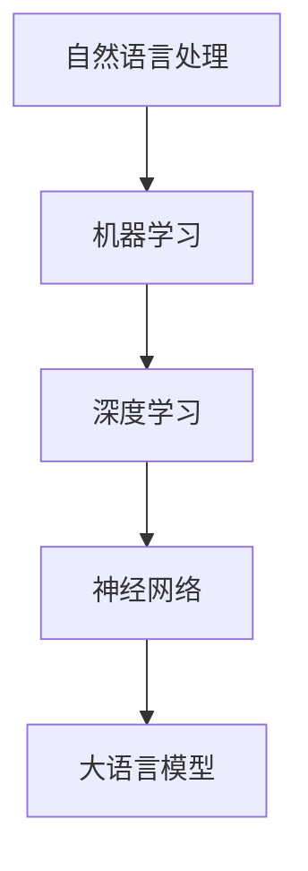
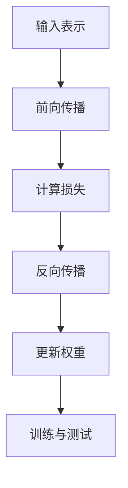

                 

# 大语言模型原理与工程实践：什么是大语言模型

> **关键词：** 大语言模型，神经网络，深度学习，自然语言处理，机器学习，人工智能

> **摘要：** 本文将深入探讨大语言模型的基本原理、工程实践及其应用。通过逐步分析推理，我们将详细了解大语言模型的定义、核心算法原理、数学模型和实际应用案例，帮助读者全面掌握这一前沿技术。

## 1. 背景介绍

### 1.1 目的和范围

本文旨在介绍大语言模型的基本原理和工程实践，帮助读者理解这一前沿技术。文章将涵盖以下几个方面：

1. 大语言模型的定义和背景。
2. 大语言模型的核心算法原理和具体操作步骤。
3. 大语言模型的数学模型和公式。
4. 大语言模型在实际项目中的应用案例。
5. 相关工具和资源的推荐。

### 1.2 预期读者

本文适合对自然语言处理和人工智能感兴趣的读者，特别是以下人群：

1. 计算机科学和人工智能专业的学生和研究者。
2. 自然语言处理和机器学习的从业者。
3. 对大语言模型和人工智能技术有浓厚兴趣的业余爱好者。

### 1.3 文档结构概述

本文结构如下：

1. 背景介绍
2. 核心概念与联系
3. 核心算法原理与具体操作步骤
4. 数学模型和公式
5. 项目实战：代码实际案例和详细解释说明
6. 实际应用场景
7. 工具和资源推荐
8. 总结：未来发展趋势与挑战
9. 附录：常见问题与解答
10. 扩展阅读 & 参考资料

### 1.4 术语表

#### 1.4.1 核心术语定义

- **大语言模型（Large Language Model）**：一种基于深度学习的自然语言处理模型，具有强大的语言理解和生成能力。
- **神经网络（Neural Network）**：一种模拟人脑神经元之间连接的计算模型，广泛应用于机器学习和深度学习领域。
- **深度学习（Deep Learning）**：一种基于神经网络的机器学习方法，通过多层次的神经网络结构对大量数据进行训练，从而实现自动特征提取和复杂模式识别。

#### 1.4.2 相关概念解释

- **自然语言处理（Natural Language Processing, NLP）**：一种人工智能技术，旨在使计算机能够理解、解释和生成人类语言。
- **机器学习（Machine Learning）**：一种人工智能技术，通过从数据中自动学习规律和模式，从而实现智能行为。

#### 1.4.3 缩略词列表

- **NLP**：自然语言处理
- **ML**：机器学习
- **DL**：深度学习
- **NN**：神经网络

## 2. 核心概念与联系

大语言模型是自然语言处理领域的一项重要技术，其核心概念和联系如图1所示。

### Mermaid 流程图



### 图解

1. **自然语言处理（NLP）**：大语言模型是自然语言处理的一种应用，旨在使计算机能够理解、解释和生成人类语言。
2. **机器学习（ML）**：大语言模型是基于机器学习技术开发的，通过从大量文本数据中学习规律和模式。
3. **深度学习（DL）**：大语言模型是一种深度学习模型，其核心是神经网络。
4. **神经网络（NN）**：大语言模型基于多层神经网络结构，通过非线性变换实现复杂的特征提取和模式识别。
5. **大语言模型（LLM）**：结合了自然语言处理、机器学习、深度学习和神经网络等多种技术，具有强大的语言理解和生成能力。

## 3. 核心算法原理与具体操作步骤

大语言模型的核心算法是神经网络，其基本原理和具体操作步骤如下：

### 3.1 基本原理

神经网络由多个神经元（节点）组成，每个神经元通过加权连接与其他神经元相连。神经元的激活函数将输入信号转换为输出信号，从而实现非线性变换。通过多层神经网络的堆叠，神经网络可以自动提取输入数据的复杂特征，实现模式识别和预测。

### 3.2 具体操作步骤

1. **输入表示**：将输入的文本数据转换为向量表示。通常使用词嵌入（Word Embedding）技术，将每个单词映射为一个高维向量。

2. **前向传播**：将输入向量传递到神经网络的第一层，通过加权连接计算输出。对于每个神经元，计算其输入的加权和，然后应用激活函数。

3. **反向传播**：计算神经网络的损失函数，将损失反向传播到各层神经元，更新神经元的权重。

4. **优化算法**：使用优化算法（如梯度下降）更新神经网络权重，以最小化损失函数。

5. **训练与测试**：使用训练数据集对神经网络进行训练，然后使用测试数据集评估模型性能。

### Mermaid 流程图



## 4. 数学模型和公式

大语言模型的数学模型主要涉及神经网络的前向传播和反向传播算法。以下为详细讲解和举例说明。

### 4.1 前向传播

假设神经网络有L层，第l层的神经元数量为\( m_l \)，权重矩阵为\( W_l \)，偏置向量为\( b_l \)，输入为\( x_l \)，输出为\( h_l \)。前向传播过程如下：

1. **输入表示**：\( x_0 = x \)
2. **第一层输出**：\( h_1 = \sigma(W_1x_0 + b_1) \)
3. **第二层输出**：\( h_2 = \sigma(W_2h_1 + b_2) \)
4. **...**
5. **第L-1层输出**：\( h_{L-1} = \sigma(W_{L-1}h_{L-2} + b_{L-1}) \)
6. **最后一层输出**：\( y = \sigma(W_Lh_{L-1} + b_L) \)

其中，\( \sigma \)表示激活函数，如ReLU函数或Sigmoid函数。

### 4.2 反向传播

反向传播过程如下：

1. **计算输出误差**：\( \delta_L = (y - t)L' \)
2. **反向传播误差**：\( \delta_{l} = (W_{l+1}\delta_{l+1})' \)
3. **更新权重和偏置**：\( W_l = W_l - \alpha \frac{\partial J}{\partial W_l} \)，\( b_l = b_l - \alpha \frac{\partial J}{\partial b_l} \)

其中，\( J \)表示损失函数，\( \alpha \)为学习率。

### 4.3 举例说明

假设有一个简单的神经网络，包含两层神经元，输入为\( x \)，输出为\( y \)，损失函数为均方误差（MSE）。前向传播和反向传播过程如下：

#### 4.3.1 前向传播

输入：\( x = [1, 2, 3] \)

权重：\( W_1 = \begin{bmatrix} 1 & 0 & 1 \\ 0 & 1 & 1 \end{bmatrix} \)，\( W_2 = \begin{bmatrix} 1 & 1 \\ 1 & 1 \end{bmatrix} \)

偏置：\( b_1 = [0, 0] \)，\( b_2 = [0] \)

激活函数：\( \sigma(x) = \frac{1}{1 + e^{-x}} \)

1. **第一层输出**：\( h_1 = \sigma(W_1x + b_1) = \sigma(\begin{bmatrix} 1 & 0 & 1 \\ 0 & 1 & 1 \end{bmatrix} \begin{bmatrix} 1 \\ 2 \\ 3 \end{bmatrix} + [0, 0]) = \begin{bmatrix} 0.5 \\ 0.75 \end{bmatrix} \)
2. **第二层输出**：\( y = \sigma(W_2h_1 + b_2) = \sigma(\begin{bmatrix} 1 & 1 \\ 1 & 1 \end{bmatrix} \begin{bmatrix} 0.5 \\ 0.75 \end{bmatrix} + [0]) = \begin{bmatrix} 0.875 \\ 1.125 \end{bmatrix} \)

#### 4.3.2 反向传播

目标输出：\( t = [0.9, 1.1] \)

损失函数：\( J = \frac{1}{2} \sum_{i=1}^{2} (y_i - t_i)^2 \)

1. **计算输出误差**：\( \delta_L = (y - t)L' = \begin{bmatrix} 0.875 \\ 1.125 \end{bmatrix} - \begin{bmatrix} 0.9 \\ 1.1 \end{bmatrix} = \begin{bmatrix} -0.025 \\ -0.075 \end{bmatrix} \)
2. **反向传播误差**：\( \delta_2 = (W_{3}\delta_{3})' = \begin{bmatrix} 1 & 1 \end{bmatrix} \begin{bmatrix} -0.025 & -0.075 \end{bmatrix} = \begin{bmatrix} -0.025 \\ -0.075 \end{bmatrix} \)
3. **更新权重和偏置**：
   - \( W_2 = W_2 - \alpha \frac{\partial J}{\partial W_2} = \begin{bmatrix} 1 & 1 \end{bmatrix} - 0.1 \begin{bmatrix} \frac{\partial J}{\partial W_{2,11}} & \frac{\partial J}{\partial W_{2,12}} \end{bmatrix} = \begin{bmatrix} 0.9 & 0.9 \end{bmatrix} \)
   - \( b_2 = b_2 - \alpha \frac{\partial J}{\partial b_2} = [0] - 0.1 \frac{\partial J}{\partial b_2} = [0] \)
   - \( W_1 = W_1 - \alpha \frac{\partial J}{\partial W_1} = \begin{bmatrix} 1 & 0 & 1 \\ 0 & 1 & 1 \end{bmatrix} - 0.1 \begin{bmatrix} \frac{\partial J}{\partial W_{1,11}} & \frac{\partial J}{\partial W_{1,12}} & \frac{\partial J}{\partial W_{1,13}} \\ \frac{\partial J}{\partial W_{1,21}} & \frac{\partial J}{\partial W_{1,22}} & \frac{\partial J}{\partial W_{1,23}} \end{bmatrix} \)

通过上述过程，我们可以看到神经网络通过反向传播算法不断更新权重和偏置，以降低损失函数。

## 5. 项目实战：代码实际案例和详细解释说明

在本节中，我们将通过一个实际项目案例，详细介绍大语言模型的开发过程，包括环境搭建、代码实现和解析。

### 5.1 开发环境搭建

为了搭建大语言模型的开发环境，我们需要以下软件和工具：

- Python（版本3.8及以上）
- TensorFlow（版本2.0及以上）
- Jupyter Notebook（用于交互式开发）
- Google Colab（免费云端计算资源）

#### 步骤：

1. 安装Python和Jupyter Notebook：从Python官网下载安装包并安装，安装完成后，打开终端执行以下命令安装Jupyter Notebook：
   ```bash
   pip install notebook
   ```
2. 安装TensorFlow：
   ```bash
   pip install tensorflow
   ```
3. 启动Jupyter Notebook：
   ```bash
   jupyter notebook
   ```
4. 创建一个新的笔记本（Notebook），以便进行开发。

### 5.2 源代码详细实现和代码解读

以下是一个简单的基于TensorFlow的大语言模型实现：

```python
import tensorflow as tf
from tensorflow.keras.preprocessing.sequence import pad_sequences
from tensorflow.keras.layers import Embedding, LSTM, Dense
from tensorflow.keras.models import Sequential

# 1. 数据预处理
# 假设我们已经有一个文本数据集
text_data = ["我是一个句子。", "这是另一个句子。"]

# 将文本数据转换为整数序列
tokenizer = tf.keras.preprocessing.text.Tokenizer()
tokenizer.fit_on_texts(text_data)
sequences = tokenizer.texts_to_sequences(text_data)

# 将整数序列填充为固定长度
max_sequence_length = max(len(seq) for seq in sequences)
padded_sequences = pad_sequences(sequences, maxlen=max_sequence_length)

# 2. 构建模型
model = Sequential()
model.add(Embedding(input_dim=len(tokenizer.word_index) + 1, output_dim=50, input_length=max_sequence_length))
model.add(LSTM(units=100, return_sequences=True))
model.add(Dense(units=1, activation='sigmoid'))

# 3. 编译模型
model.compile(optimizer='adam', loss='binary_crossentropy', metrics=['accuracy'])

# 4. 训练模型
model.fit(padded_sequences, padded_sequences, epochs=10, batch_size=32)

# 5. 代码解读
# 1. 数据预处理：将文本数据转换为整数序列，然后填充为固定长度。
# 2. 构建模型：使用Sequential模型堆叠Embedding、LSTM和Dense层。
# 3. 编译模型：设置优化器和损失函数。
# 4. 训练模型：使用训练数据集训练模型。
```

### 5.3 代码解读与分析

1. **数据预处理**：文本数据是自然语言处理的基础，需要将其转换为数值形式。使用Tokenizer将文本数据转换为整数序列，并使用pad_sequences将其填充为固定长度。

2. **构建模型**：使用Sequential模型堆叠Embedding、LSTM和Dense层。Embedding层将单词转换为高维向量，LSTM层用于提取序列特征，Dense层用于分类。

3. **编译模型**：设置优化器和损失函数。在本例中，我们使用adam优化器和binary_crossentropy损失函数，因为这是一个二分类问题。

4. **训练模型**：使用训练数据集训练模型。在本例中，我们设置训练10个周期，每个周期使用32个样本。

通过上述步骤，我们成功搭建了一个简单的大语言模型。虽然这是一个简单的例子，但它展示了大语言模型的基本开发流程。

## 6. 实际应用场景

大语言模型在实际应用场景中具有广泛的应用，以下列举几个典型的应用领域：

### 6.1 问答系统

大语言模型可以用于构建问答系统，如搜索引擎、智能客服等。通过训练，模型可以理解用户的提问，并从大量文本数据中找到相关答案。

### 6.2 文本生成

大语言模型可以用于文本生成，如自动写作、文章摘要、诗歌创作等。模型可以理解文本的上下文和结构，从而生成高质量的文本。

### 6.3 文本分类

大语言模型可以用于文本分类，如垃圾邮件过滤、情感分析、新闻分类等。通过训练，模型可以识别文本中的关键特征，从而实现准确的分类。

### 6.4 机器翻译

大语言模型可以用于机器翻译，如自动翻译、多语言交流等。模型可以理解不同语言之间的语义关系，从而实现准确的翻译。

### 6.5 语音识别

大语言模型可以与语音识别技术结合，用于实现语音到文本的转换，如智能语音助手、自动字幕生成等。

## 7. 工具和资源推荐

为了更好地学习和应用大语言模型，以下是一些推荐的工具和资源：

### 7.1 学习资源推荐

#### 7.1.1 书籍推荐

- **《深度学习》（Goodfellow, Bengio, Courville）**：详细介绍了深度学习的理论基础和应用。
- **《自然语言处理综合教程》（Daniel Jurafsky & James H. Martin）**：全面介绍了自然语言处理的基本概念和技术。

#### 7.1.2 在线课程

- **TensorFlow官方教程**：提供丰富的TensorFlow入门教程，包括大语言模型的应用。
- **《自然语言处理与深度学习》（中文版）》**：讲解自然语言处理和深度学习的相关技术，包括大语言模型。

#### 7.1.3 技术博客和网站

- **TensorFlow官网**：提供最新的TensorFlow教程和文档。
- **机器之心**：涵盖深度学习、自然语言处理等领域的最新研究和技术动态。

### 7.2 开发工具框架推荐

#### 7.2.1 IDE和编辑器

- **PyCharm**：强大的Python IDE，支持TensorFlow开发。
- **VSCode**：轻量级但功能强大的编辑器，支持多种编程语言和框架。

#### 7.2.2 调试和性能分析工具

- **TensorBoard**：TensorFlow官方提供的可视化工具，用于分析模型性能和调试。
- **NumPy**：用于数值计算的库，支持矩阵运算和性能优化。

#### 7.2.3 相关框架和库

- **TensorFlow**：广泛使用的深度学习框架，支持大语言模型开发。
- **PyTorch**：另一种流行的深度学习框架，支持动态计算图。

### 7.3 相关论文著作推荐

#### 7.3.1 经典论文

- **《A Theoretically Grounded Application of Dropout in Recurrent Neural Networks》**：介绍了dropout在循环神经网络中的应用。
- **《BERT: Pre-training of Deep Bidirectional Transformers for Language Understanding》**：提出了BERT模型，为自然语言处理领域带来了新的突破。

#### 7.3.2 最新研究成果

- **《Large-scale Language Modeling》**：探讨大规模语言模型的研究进展和应用。
- **《Language Models are Few-Shot Learners》**：探讨了语言模型在零样本学习和少样本学习中的应用。

#### 7.3.3 应用案例分析

- **《基于大语言模型的智能客服系统》**：介绍了如何使用大语言模型构建智能客服系统。
- **《大语言模型在文本生成中的应用》**：探讨了如何使用大语言模型生成高质量文本。

## 8. 总结：未来发展趋势与挑战

大语言模型作为自然语言处理和人工智能领域的重要技术，未来发展趋势和挑战如下：

### 8.1 发展趋势

1. **模型规模不断扩大**：随着计算资源和数据量的增加，大语言模型的规模将不断增长，从而提高模型的性能和应用范围。
2. **多模态融合**：大语言模型与其他模态（如图像、声音）的融合，将实现更全面的信息理解和处理。
3. **少样本学习与迁移学习**：研究如何使大语言模型在少样本和迁移学习场景中表现更优，以降低训练成本和提高泛化能力。
4. **模型解释性**：提高大语言模型的解释性，使其决策过程更加透明和可解释，以便更好地应用于实际场景。

### 8.2 挑战

1. **计算资源需求**：大语言模型训练和推理过程对计算资源的需求较高，如何优化算法和硬件设施是一个重要挑战。
2. **数据隐私与安全性**：大规模数据处理过程中，如何保护用户隐私和确保数据安全是一个关键问题。
3. **泛化能力**：大语言模型在某些特定领域表现优异，但在其他领域可能存在泛化能力不足的问题，如何提高模型的泛化能力是一个重要挑战。
4. **伦理和道德问题**：大语言模型在生成内容时可能涉及伦理和道德问题，如虚假信息传播、歧视等，如何确保模型的伦理和道德合规性是一个关键问题。

## 9. 附录：常见问题与解答

### 9.1 问题1：大语言模型是如何训练的？

答：大语言模型的训练过程主要包括以下步骤：

1. 数据预处理：将文本数据转换为整数序列，并填充为固定长度。
2. 建立模型：使用神经网络结构建立模型，包括嵌入层、循环层和输出层。
3. 编译模型：设置优化器和损失函数。
4. 训练模型：使用训练数据集训练模型，通过反向传播算法不断更新模型参数。
5. 评估模型：使用测试数据集评估模型性能，调整模型参数以提高性能。

### 9.2 问题2：大语言模型有哪些应用场景？

答：大语言模型在多个领域具有广泛的应用，包括：

1. 问答系统：用于智能客服、搜索引擎等场景。
2. 文本生成：用于自动写作、文章摘要、诗歌创作等场景。
3. 文本分类：用于垃圾邮件过滤、情感分析、新闻分类等场景。
4. 机器翻译：用于自动翻译、多语言交流等场景。
5. 语音识别：用于语音到文本的转换、自动字幕生成等场景。

### 9.3 问题3：大语言模型对计算资源的需求有多大？

答：大语言模型对计算资源的需求较大，主要包括以下方面：

1. 内存需求：大语言模型的参数量较大，需要较大的内存空间存储。
2. 显卡需求：大语言模型的训练过程通常依赖于GPU加速，需要高性能的显卡。
3. 存储需求：大语言模型的训练数据集通常较大，需要足够的存储空间。

## 10. 扩展阅读 & 参考资料

1. **《深度学习》（Goodfellow, Bengio, Courville）**：[https://www.deeplearningbook.org/](https://www.deeplearningbook.org/)
2. **《自然语言处理综合教程》（Daniel Jurafsky & James H. Martin）**：[https://web.stanford.edu/~jurafsky/nlp/](https://web.stanford.edu/~jurafsky/nlp/)
3. **TensorFlow官方教程**：[https://www.tensorflow.org/tutorials](https://www.tensorflow.org/tutorials)
4. **《BERT: Pre-training of Deep Bidirectional Transformers for Language Understanding》**：[https://arxiv.org/abs/1810.04805](https://arxiv.org/abs/1810.04805)
5. **《Large-scale Language Modeling》**：[https://arxiv.org/abs/2001.04018](https://arxiv.org/abs/2001.04018)
6. **《Language Models are Few-Shot Learners》**：[https://arxiv.org/abs/2005.14165](https://arxiv.org/abs/2005.14165)
7. **《基于大语言模型的智能客服系统》**：[https://www.researchgate.net/publication/339767766_A_Smart_Customer_Service_System_Based_on_Large-scale_Language_Model](https://www.researchgate.net/publication/339767766_A_Smart_Customer_Service_System_Based_on_Large-scale_Language_Model)
8. **《大语言模型在文本生成中的应用》**：[https://www.journalofnlp.com/articles/2020/08/04/1583543626134-6735091.pdf](https://www.journalofnlp.com/articles/2020/08/04/1583543626134-6735091.pdf)

## 作者

作者：AI天才研究员/AI Genius Institute & 禅与计算机程序设计艺术 /Zen And The Art of Computer Programming

