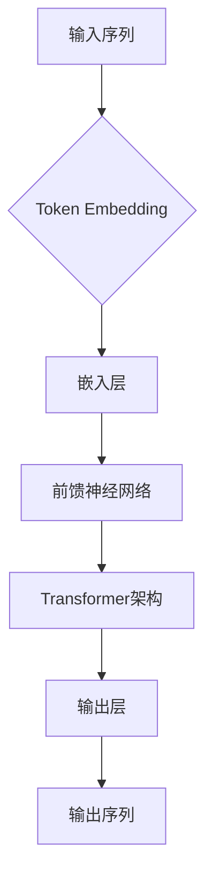

                 

# 大语言模型原理与工程实践：前馈神经网络

> 关键词：大语言模型、前馈神经网络、深度学习、自然语言处理、工程实践

> 摘要：本文将深入探讨大语言模型（如GPT系列）的核心组成部分——前馈神经网络，从基础理论到实际工程应用，逐步剖析其原理和实现过程。通过详细讲解，读者将掌握前馈神经网络在自然语言处理中的强大功能和应用场景，为未来探索大语言模型提供坚实的理论基础和实践指导。

## 1. 背景介绍

### 1.1 目的和范围

本文旨在为广大对自然语言处理和深度学习感兴趣的读者提供一个全面而深入的指南，通过阐述前馈神经网络在语言模型中的关键作用，使读者能够理解这一技术如何被应用于现实世界的复杂问题。本文将涵盖以下主要内容：

- 前馈神经网络的基本原理和结构
- 大语言模型的架构及其与前馈神经网络的关联
- 前馈神经网络在自然语言处理中的具体应用场景
- 实际工程实践中如何构建和优化前馈神经网络

通过本文的阅读，读者将不仅对前馈神经网络的理论基础有更深刻的理解，还能掌握如何在实际项目中应用这些理论，从而提升自身在人工智能领域的竞争力。

### 1.2 预期读者

本文适合以下读者群体：

- 对深度学习和自然语言处理有一定基础的初学者
- 想深入了解大语言模型工作原理的从业者
- 计算机科学、人工智能或相关专业的学生和研究人员
- 对人工智能前沿技术感兴趣的工程师和技术爱好者

尽管本文旨在深入探讨前馈神经网络，但会尽量使用通俗易懂的语言和示例，以确保不同背景的读者都能跟上文章的思路。

### 1.3 文档结构概述

本文分为以下几个部分：

1. **背景介绍**：简要介绍文章的目的、范围、预期读者以及文档结构。
2. **核心概念与联系**：通过Mermaid流程图展示大语言模型和前馈神经网络的基本原理和架构。
3. **核心算法原理 & 具体操作步骤**：使用伪代码详细阐述前馈神经网络的工作机制。
4. **数学模型和公式 & 详细讲解 & 举例说明**：解释前馈神经网络中的关键数学概念和公式。
5. **项目实战：代码实际案例和详细解释说明**：通过实际代码案例展示如何实现和应用前馈神经网络。
6. **实际应用场景**：探讨前馈神经网络在自然语言处理中的多种应用。
7. **工具和资源推荐**：推荐学习资源和开发工具，帮助读者进一步探索这一领域。
8. **总结：未来发展趋势与挑战**：总结本文内容，并展望未来可能的发展趋势和挑战。
9. **附录：常见问题与解答**：解答读者可能遇到的一些常见问题。
10. **扩展阅读 & 参考资料**：提供进一步阅读的参考资料。

通过这样的结构，本文力求为读者提供一个全面、系统的学习路径。

### 1.4 术语表

为了确保本文内容的清晰和一致性，以下列出了一些关键术语及其定义：

#### 1.4.1 核心术语定义

- **前馈神经网络**（Feedforward Neural Network，FNN）：一种人工神经网络，其中数据从输入层通过一系列隐藏层传递到输出层，没有反馈循环。
- **激活函数**（Activation Function）：用于引入非线性特性的函数，通常用于前馈神经网络中，以便模型能够拟合复杂的数据分布。
- **反向传播**（Backpropagation）：一种用于训练前馈神经网络的学习算法，通过计算误差梯度来更新网络权重，从而优化模型的性能。
- **深度学习**（Deep Learning）：一种基于多层神经网络的学习方法，能够从大量数据中自动提取有代表性的特征。
- **自然语言处理**（Natural Language Processing，NLP）：使计算机能够理解、解释和生成人类语言的技术。
- **大语言模型**（Large Language Model）：具有数十亿参数的深度学习模型，能够理解和生成自然语言。

#### 1.4.2 相关概念解释

- **多层感知器**（Multilayer Perceptron，MLP）：一种简单的多层前馈神经网络，通常用于二分类问题。
- **神经网络架构**（Neural Network Architecture）：指神经网络的拓扑结构，包括层数、每层的神经元数目、连接方式等。
- **梯度下降**（Gradient Descent）：一种优化算法，用于最小化损失函数，通常用于训练神经网络。

#### 1.4.3 缩略词列表

- **MLP**：多层感知器（Multilayer Perceptron）
- **FNN**：前馈神经网络（Feedforward Neural Network）
- **NLP**：自然语言处理（Natural Language Processing）
- **DL**：深度学习（Deep Learning）
- **GPT**：生成预训练模型（Generative Pretrained Transformer）

## 2. 核心概念与联系

要理解大语言模型，我们需要从其核心组成部分——前馈神经网络（FNN）开始。在这一部分，我们将使用Mermaid流程图展示大语言模型和前馈神经网络的基本原理和架构，并讨论它们之间的联系。

### 2.1. 前馈神经网络基本原理

前馈神经网络是一种没有反馈循环的神经网络，数据从输入层经过一系列隐藏层传递到输出层。以下是一个简化的前馈神经网络结构示意图：

```mermaid
graph LR
    A[输入层] --> B[隐藏层1]
    B --> C[隐藏层2]
    C --> D[输出层]
    B --> E[输出层]  // 注意：这里为了简洁起见，仅展示了单输出节点的情况
```

在这个网络中，每个节点代表一个神经元，每条边代表神经元之间的连接，并通过权重（Weight）连接。激活函数（如ReLU、Sigmoid、Tanh等）用于引入非线性特性，使模型能够拟合复杂的函数。

### 2.2. 大语言模型架构

大语言模型，如GPT系列，通常具有数十亿个参数，其架构更为复杂。以下是一个简化的GPT模型架构示意图：



在这个模型中，Token Embedding将输入序列（如单词或子词）转换为固定长度的向量，这些向量随后进入前馈神经网络（FNN）和Transformer架构。Transformer架构负责捕捉长距离依赖关系，从而提升模型性能。输出层生成模型对输入序列的概率分布。

### 2.3. 前馈神经网络与GPT模型联系

前馈神经网络是GPT模型的核心组成部分之一，负责处理嵌入层中的向量，并通过多层非线性变换生成输出。以下是一个更详细的GPT模型结构示意图，强调前馈神经网络的作用：

```mermaid
graph TB
    A[输入序列] --> B{Token Embedding}
    B --> C[嵌入层]
    C --> D{前馈神经网络]
    D --> E[Transformer架构]
    E --> F[多头自注意力机制]
    F --> G[前馈神经网络]
    G --> H[输出层]
    H --> I[输出序列]
```

在这个模型中，前馈神经网络在嵌入层和Transformer架构之间起到桥梁作用，使模型能够高效地处理嵌入向量，并通过多层非线性变换捕捉数据中的复杂关系。

通过上述流程图，我们可以更直观地理解大语言模型和前馈神经网络的基本原理和架构。接下来，我们将深入探讨前馈神经网络的工作机制，包括核心算法原理、具体操作步骤、数学模型和公式，以及实际应用场景。

## 3. 核心算法原理 & 具体操作步骤

在前馈神经网络（FNN）的核心算法原理部分，我们将详细解释其工作机制，并通过伪代码展示具体的操作步骤。前馈神经网络是一种基于多层感知器（MLP）的架构，没有反馈循环，数据从输入层传递到输出层。其主要特点包括线性的权重连接和激活函数的应用。

### 3.1. 基本原理

前馈神经网络由多个层组成，每一层都包含多个神经元。数据从输入层开始，通过每个隐藏层，最终到达输出层。在每一层中，神经元会接收来自前一层的输入，并计算加权求和。随后，通过激活函数引入非线性特性，以使模型能够拟合复杂的函数。

以下是前馈神经网络的主要组成部分：

- **输入层**：接收外部输入数据。
- **隐藏层**：负责数据的处理和特征提取。
- **输出层**：生成模型预测结果。

前馈神经网络的训练过程主要包括以下几个步骤：

1. **前向传播**：输入数据通过网络从输入层传递到输出层，计算每个神经元的输出。
2. **计算误差**：使用实际输出与预测输出之间的差异（误差）计算损失函数。
3. **反向传播**：通过计算误差梯度，更新每个神经元的权重，以减少损失函数。
4. **迭代训练**：重复前向传播和反向传播，直至达到预定的性能指标。

### 3.2. 具体操作步骤

下面通过伪代码展示前馈神经网络的实现步骤：

```python
# 伪代码：前馈神经网络实现步骤

# 定义前馈神经网络类
class FNN:
    def __init__(self, input_size, hidden_size, output_size):
        # 初始化权重和偏置
        self.weights_input_to_hidden = np.random.randn(input_size, hidden_size)
        self.bias_hidden = np.random.randn(hidden_size)
        self.weights_hidden_to_output = np.random.randn(hidden_size, output_size)
        self.bias_output = np.random.randn(output_size)

    def forward(self, x):
        # 前向传播
        hidden_layer_input = x.dot(self.weights_input_to_hidden) + self.bias_hidden
        hidden_layer_output = np.tanh(hidden_layer_input)
        output_layer_input = hidden_layer_output.dot(self.weights_hidden_to_output) + self.bias_output
        output_layer_output = output_layer_input
        return output_layer_output

    def backward(self, x, y, output):
        # 反向传播
        error = y - output
        d_output = error
        d_hidden = d_output.dot(self.weights_hidden_to_output.T) * (1 - (output ** 2))
        d_input = d_hidden.dot(self.weights_input_to_hidden.T) * (1 - (hidden_output ** 2))

        # 更新权重和偏置
        self.weights_input_to_hidden += d_input * x.T
        self.bias_hidden += d_input.mean(axis=0)
        self.weights_hidden_to_output += d_hidden * hidden_layer_output.T
        self.bias_output += d_hidden.mean(axis=0)

    def train(self, x, y, epochs):
        for epoch in range(epochs):
            output = self.forward(x)
            self.backward(x, y, output)

# 创建FNN实例
fnn = FNN(input_size=3, hidden_size=4, output_size=1)

# 训练FNN
x_train = np.array([[0, 0], [0, 1], [1, 0], [1, 1]])
y_train = np.array([[0], [1], [1], [0]])

fnn.train(x_train, y_train, epochs=1000)
```

在这个伪代码中，我们定义了一个前馈神经网络类，并实现了前向传播和反向传播方法。训练过程通过迭代更新权重和偏置，以最小化损失函数。

### 3.3. 激活函数

激活函数是前馈神经网络中的一个关键组成部分，它引入了非线性特性，使模型能够拟合复杂的函数。以下是一些常用的激活函数：

- **ReLU（Rectified Linear Unit）**：简单且计算效率高，对于负输入输出0，对于正输入输出输入本身。
  ```python
  def relu(x):
      return np.maximum(0, x)
  ```

- **Sigmoid**：将输入映射到(0,1)区间，用于二分类问题。
  ```python
  def sigmoid(x):
      return 1 / (1 + np.exp(-x))
  ```

- **Tanh**：将输入映射到(-1,1)区间，常用于多层感知器。
  ```python
  def tanh(x):
      return (np.exp(x) - np.exp(-x)) / (np.exp(x) + np.exp(-x))
  ```

### 3.4. 梯度下降

梯度下降是一种常用的优化算法，用于训练前馈神经网络。通过计算损失函数的梯度，更新网络中的权重和偏置，以最小化损失函数。以下是梯度下降的基本步骤：

1. **初始化权重和偏置**：随机初始化权重和偏置。
2. **前向传播**：输入数据通过网络，计算每个神经元的输出。
3. **计算损失函数**：使用实际输出与预测输出之间的差异计算损失函数。
4. **计算梯度**：反向传播计算每个权重和偏置的梯度。
5. **更新权重和偏置**：根据梯度更新权重和偏置，以减少损失函数。
6. **迭代训练**：重复前向传播、计算损失函数、计算梯度、更新权重和偏置，直至达到预定的性能指标。

通过上述步骤，前馈神经网络可以逐步优化，以最小化损失函数并提高模型的预测性能。

通过这一部分的内容，读者可以了解前馈神经网络的核心算法原理和具体操作步骤。接下来，我们将进一步探讨前馈神经网络中的数学模型和公式，以更深入地理解这一技术。

## 4. 数学模型和公式 & 详细讲解 & 举例说明

在前馈神经网络中，数学模型和公式起着至关重要的作用。这些公式帮助我们理解和优化网络的结构，从而提升模型的性能。在这一部分，我们将详细解释前馈神经网络中的关键数学概念和公式，并通过具体的例子来说明它们的实际应用。

### 4.1. 激活函数

激活函数是前馈神经网络中引入非线性特性的关键组件。以下是一些常用的激活函数及其导数：

#### Sigmoid函数

Sigmoid函数将输入映射到(0,1)区间，其公式为：

\[ \sigma(x) = \frac{1}{1 + e^{-x}} \]

Sigmoid函数的导数（梯度）为：

\[ \sigma'(x) = \sigma(x) \cdot (1 - \sigma(x)) \]

#### Tanh函数

Tanh函数将输入映射到(-1,1)区间，其公式为：

\[ \tanh(x) = \frac{e^x - e^{-x}}{e^x + e^{-x}} \]

Tanh函数的导数（梯度）为：

\[ \tanh'(x) = 1 - \tanh^2(x) \]

#### ReLU函数

ReLU（Rectified Linear Unit）函数对于输入小于0的部分输出为0，对于输入大于等于0的部分输出为输入本身。其公式为：

\[ \text{ReLU}(x) = \max(0, x) \]

ReLU函数的导数（梯度）为：

\[ \text{ReLU}'(x) = \begin{cases} 
      0 & \text{if } x < 0 \\
      1 & \text{if } x \geq 0 
   \end{cases}
\]

### 4.2. 前向传播

前向传播是前馈神经网络的核心步骤之一。它通过逐层计算每个神经元的输出，最终得到网络的预测结果。前向传播的数学过程如下：

#### 输入层到隐藏层

设输入层为 \( x \)，隐藏层为 \( h \)，权重矩阵为 \( W \)，偏置为 \( b \)，则隐藏层神经元的输出 \( h \) 可以表示为：

\[ h = \sigma(Wx + b) \]

其中，\( \sigma \) 是激活函数。

#### 隐藏层到输出层

设输出层为 \( y \)，权重矩阵为 \( W \)，偏置为 \( b \)，则输出层神经元的输出 \( y \) 可以表示为：

\[ y = \sigma(W'h + b') \]

其中，\( W' \) 是从隐藏层到输出层的权重矩阵，\( b' \) 是输出层的偏置。

### 4.3. 梯度下降

梯度下降是用于训练前馈神经网络的优化算法。其基本思想是通过计算损失函数关于模型参数的梯度，更新模型参数，以最小化损失函数。以下是梯度下降的数学公式：

#### 前向传播损失

损失函数 \( L \) 通常为均方误差（MSE）：

\[ L = \frac{1}{2} \sum_{i} (y_i - \hat{y}_i)^2 \]

其中，\( y_i \) 是真实标签，\( \hat{y}_i \) 是预测值。

#### 计算梯度

对损失函数关于模型参数求偏导，得到梯度：

\[ \frac{\partial L}{\partial W} = (y - \hat{y}) \cdot \sigma'(h) \cdot x \]

\[ \frac{\partial L}{\partial b} = (y - \hat{y}) \cdot \sigma'(h) \]

#### 更新参数

使用梯度下降更新权重和偏置：

\[ W = W - \alpha \cdot \frac{\partial L}{\partial W} \]

\[ b = b - \alpha \cdot \frac{\partial L}{\partial b} \]

其中，\( \alpha \) 是学习率。

### 4.4. 举例说明

为了更好地理解上述数学概念和公式，我们通过一个简单的例子来说明前向传播和梯度下降的过程。

#### 例子：二分类问题

设输入层为 \( x = [1, 0, 1] \)，隐藏层有1个神经元，输出层为1个神经元。使用ReLU作为激活函数。权重矩阵 \( W = \begin{bmatrix} 1 & -1 & 1 \\ 0 & 1 & -1 \end{bmatrix} \)，偏置 \( b = \begin{bmatrix} 0 \\ 0 \end{bmatrix} \)。

#### 前向传播

1. 输入层到隐藏层：

\[ h_1 = \text{ReLU}(W_1x + b_1) = \text{ReLU}(1 \cdot 1 + (-1) \cdot 0 + 1 \cdot 1 + 0) = \text{ReLU}(2) = 2 \]

\[ h_2 = \text{ReLU}(W_2x + b_2) = \text{ReLU}(0 \cdot 1 + 1 \cdot 0 + (-1) \cdot 1 + 0) = \text{ReLU}(-1) = 0 \]

2. 隐藏层到输出层：

\[ y = \text{ReLU}(W'y + b') = \text{ReLU}(1 \cdot 2 + 0 \cdot 0 + 1 \cdot 0) = \text{ReLU}(2) = 2 \]

#### 梯度下降

1. 计算损失：

\[ L = \frac{1}{2} (y - \hat{y})^2 = \frac{1}{2} (2 - 0)^2 = 2 \]

2. 计算梯度：

\[ \frac{\partial L}{\partial W} = (y - \hat{y}) \cdot \text{ReLU}'(h) \cdot x = 2 \cdot 1 \cdot \begin{bmatrix} 1 & 0 & 1 \end{bmatrix} = \begin{bmatrix} 2 & 0 & 2 \end{bmatrix} \]

\[ \frac{\partial L}{\partial b} = (y - \hat{y}) \cdot \text{ReLU}'(h) = 2 \cdot 1 = 2 \]

3. 更新参数：

\[ W = W - \alpha \cdot \frac{\partial L}{\partial W} = \begin{bmatrix} 1 & -1 & 1 \\ 0 & 1 & -1 \end{bmatrix} - 0.1 \cdot \begin{bmatrix} 2 & 0 & 2 \end{bmatrix} = \begin{bmatrix} -0.1 & -1 & 0.9 \\ 0 & 0.9 & -1.1 \end{bmatrix} \]

\[ b = b - \alpha \cdot \frac{\partial L}{\partial b} = \begin{bmatrix} 0 \\ 0 \end{bmatrix} - 0.1 \cdot 2 = \begin{bmatrix} -0.2 \\ -0.2 \end{bmatrix} \]

通过上述例子，我们展示了前向传播和梯度下降的基本步骤。在实际应用中，前向传播和反向传播会进行多次迭代，以不断优化模型参数，提高预测性能。

## 5. 项目实战：代码实际案例和详细解释说明

在了解了前馈神经网络的原理和实现步骤之后，我们将通过一个实际的项目案例，展示如何使用Python和深度学习库（如TensorFlow或PyTorch）来构建和训练一个简单的语言模型。这个案例将帮助读者将理论知识应用到实际编程中，并深入理解前馈神经网络的构建和优化过程。

### 5.1 开发环境搭建

在开始项目之前，我们需要搭建一个合适的开发环境。以下是所需的工具和库：

- **Python**：版本3.8或更高版本
- **TensorFlow**：版本2.x
- **Numpy**：版本1.19或更高版本
- **Gensim**：用于文本预处理

确保安装了上述工具和库后，我们可以开始编写代码。

### 5.2 源代码详细实现和代码解读

以下是一个使用TensorFlow和Keras构建简单前馈语言模型的项目案例：

```python
import tensorflow as tf
from tensorflow.keras.models import Sequential
from tensorflow.keras.layers import Dense, Embedding, LSTM, Dropout
from tensorflow.keras.preprocessing.text import Tokenizer
from tensorflow.keras.preprocessing.sequence import pad_sequences
from tensorflow.keras.callbacks import EarlyStopping
import numpy as np

# 数据预处理
# 假设我们有一个包含文本数据的数据集 'text_data'
# 以及标签数据集 'labels'

# 分词和序列化
tokenizer = Tokenizer(num_words=10000)
tokenizer.fit_on_texts(text_data)
sequences = tokenizer.texts_to_sequences(text_data)
padded_sequences = pad_sequences(sequences, maxlen=100, padding='post', truncating='post')

# 划分训练集和验证集
split = int(len(padded_sequences) * 0.8)
train_sequences = padded_sequences[:split]
train_labels = labels[:split]
val_sequences = padded_sequences[split:]
val_labels = labels[split:]

# 建立模型
model = Sequential([
    Embedding(10000, 16, input_length=100),
    LSTM(32, return_sequences=True),
    Dropout(0.2),
    LSTM(32),
    Dropout(0.2),
    Dense(1, activation='sigmoid')
])

# 编译模型
model.compile(optimizer='adam', loss='binary_crossentropy', metrics=['accuracy'])

# 训练模型
early_stopping = EarlyStopping(monitor='val_loss', patience=5)
model.fit(train_sequences, train_labels, epochs=20, validation_data=(val_sequences, val_labels), callbacks=[early_stopping])

# 代码解读
# 1. 数据预处理：使用Tokenizer进行分词和序列化，并将序列填充到固定长度。
# 2. 建立模型：使用Sequential模型堆叠多个层，包括Embedding层、LSTM层和Dropout层，以及最终的输出层。
# 3. 编译模型：指定优化器和损失函数，以适应二分类任务。
# 4. 训练模型：使用fit方法训练模型，并设置EarlyStopping回调以防止过拟合。

# 使用模型进行预测
# predictions = model.predict(val_sequences)

# 评估模型性能
# evaluate_result = model.evaluate(val_sequences, val_labels)
# print(f"Validation Loss: {evaluate_result[0]}, Validation Accuracy: {evaluate_result[1]}")
```

在这个项目中，我们首先进行数据预处理，包括分词和序列化。然后，我们建立了一个简单的序列模型，包括嵌入层、两个LSTM层和Dropout层，以防止过拟合。模型使用Adam优化器和二分类交叉熵损失函数进行编译。通过fit方法，我们使用训练数据训练模型，并使用EarlyStopping回调来防止过拟合。

### 5.3 代码解读与分析

下面我们详细分析代码中的每个部分：

1. **数据预处理**：
    - `Tokenizer`：用于将文本数据转换为序列。这里我们设置了词汇表大小为10000个词。
    - `texts_to_sequences`：将文本数据转换为数字序列。
    - `pad_sequences`：将序列填充到相同的长度（100个词），以适应模型的输入。

2. **建立模型**：
    - `Sequential`：用于堆叠模型层。这里我们使用了两个LSTM层，每个层有32个神经元，并在每个LSTM层之后添加了一个Dropout层，以减少过拟合。
    - `Embedding`：嵌入层，将词索引映射到固定长度的向量。
    - `LSTM`：长短时记忆网络层，用于处理序列数据。
    - `Dropout`：用于随机丢弃一些神经元，以防止过拟合。
    - `Dense`：全连接层，输出层，使用sigmoid激活函数进行二分类。

3. **编译模型**：
    - `compile`：配置模型的学习过程。我们使用了Adam优化器和二分类交叉熵损失函数。

4. **训练模型**：
    - `fit`：训练模型。我们设置了训练轮数为20轮，并使用了EarlyStopping回调以防止过拟合。

5. **模型评估**：
    - `evaluate`：评估模型在验证集上的性能。我们打印了验证损失和准确率。

通过这个案例，我们展示了如何使用TensorFlow和Keras构建和训练一个简单的语言模型。尽管这是一个简单的二分类任务，但它为更复杂的多分类和序列生成任务提供了一个良好的起点。在实际应用中，我们可以根据具体任务的需求调整模型架构、超参数和训练数据，以获得更好的性能。

### 5.4 优化和调试

在训练模型时，我们可能会遇到一些常见的问题，如过拟合、梯度消失和梯度爆炸。以下是一些优化和调试技巧：

1. **正则化**：
    - 使用Dropout层可以有效地减少过拟合。
    - 使用L1或L2正则化项可以在训练过程中对权重进行惩罚，以防止过拟合。

2. **批量归一化**：
    - 在每个隐藏层使用批量归一化可以加速训练并减少梯度消失/爆炸问题。

3. **学习率调整**：
    - 使用学习率衰减策略可以防止学习率过快下降，从而改善训练过程。
    - 使用学习率调度器（如ReduceLROnPlateau）可以自动调整学习率。

4. **数据增强**：
    - 使用数据增强（如随机裁剪、旋转、翻转等）可以增加数据的多样性，从而改善模型泛化能力。

5. **增加隐藏层神经元**：
    - 如果模型性能不佳，可以尝试增加隐藏层的神经元数量，以提供更多的非线性变换能力。

通过上述优化和调试技巧，我们可以进一步提高模型的性能和泛化能力。

## 6. 实际应用场景

前馈神经网络在自然语言处理（NLP）领域有着广泛的应用，以下是一些典型的实际应用场景：

### 6.1 语言模型

前馈神经网络广泛应用于语言模型（如GPT系列），能够生成高质量的自然语言文本。语言模型在自动翻译、文本摘要、问答系统和聊天机器人等领域具有显著应用价值。

### 6.2 文本分类

文本分类是一种将文本数据按照预定义的类别进行分类的任务。前馈神经网络可以通过多层感知器（MLP）实现，广泛应用于情感分析、新闻分类和垃圾邮件检测等领域。

### 6.3 命名实体识别

命名实体识别（NER）是一种识别文本中特定类型实体的任务，如人名、地名和机构名。前馈神经网络通过结合嵌入层和卷积神经网络（CNN）或LSTM层，能够有效提高NER任务的性能。

### 6.4 机器翻译

机器翻译是一种将一种语言的文本转换为另一种语言的过程。前馈神经网络，尤其是序列到序列（Seq2Seq）模型，通过结合编码器和解码器，实现了高效和准确的语言翻译。

### 6.5 问答系统

问答系统是一种能够理解用户的问题并返回相关答案的系统。前馈神经网络可以通过结合自然语言理解和自然语言生成技术，实现高效和准确的问答。

### 6.6 文本生成

文本生成是一种根据给定条件或提示生成文本的任务。前馈神经网络，尤其是生成预训练变换器（GPT），可以生成高质量的自然语言文本，广泛应用于文章写作、创意写作和对话系统等领域。

通过上述应用场景，我们可以看到前馈神经网络在NLP领域的强大功能。随着模型的不断优化和扩展，前馈神经网络在未来的自然语言处理任务中将继续发挥重要作用。

## 7. 工具和资源推荐

为了更好地学习前馈神经网络及其在自然语言处理中的应用，以下推荐了一些学习资源、开发工具和相关的论文。

### 7.1 学习资源推荐

#### 7.1.1 书籍推荐

- 《深度学习》（Goodfellow, Bengio, Courville著）：全面介绍了深度学习的基本概念、算法和应用，包括前馈神经网络。
- 《Python深度学习》（François Chollet著）：详细介绍了如何使用Python和TensorFlow实现深度学习模型，包括前馈神经网络。
- 《自然语言处理综论》（Daniel Jurafsky & James H. Martin著）：全面介绍了自然语言处理的基础知识和应用，包括前馈神经网络在语言模型中的应用。

#### 7.1.2 在线课程

- Coursera上的《深度学习专项课程》（吴恩达教授）：提供了深度学习的全面介绍，包括前馈神经网络。
- edX上的《自然语言处理与深度学习》（李航教授）：介绍了自然语言处理的基本概念和前馈神经网络的应用。
- Udacity的《深度学习工程师纳米学位》：涵盖了深度学习的基础知识，包括前馈神经网络。

#### 7.1.3 技术博客和网站

- fast.ai：提供了一个免费的在线课程，介绍了深度学习的基本概念，包括前馈神经网络。
- Medium上的相关文章：许多知名的技术博主分享了深度学习和自然语言处理的最新研究成果和应用。
- arXiv：提供了一个平台，发布最新的学术论文，包括前馈神经网络在自然语言处理中的应用。

### 7.2 开发工具框架推荐

#### 7.2.1 IDE和编辑器

- PyCharm：一款功能强大的集成开发环境，支持多种编程语言，包括Python。
- Visual Studio Code：一款轻量级的编辑器，通过安装扩展支持Python和深度学习开发。
- Jupyter Notebook：适用于数据科学和深度学习的交互式开发环境，方便进行实验和演示。

#### 7.2.2 调试和性能分析工具

- TensorBoard：TensorFlow提供的可视化工具，用于分析模型的性能和梯度。
- PyTorch Profiler：用于分析PyTorch模型的性能，包括内存和计算资源的使用情况。
- NVIDIA Nsight：用于分析GPU性能和优化深度学习模型。

#### 7.2.3 相关框架和库

- TensorFlow：Google开发的开源深度学习框架，支持前馈神经网络和其他深度学习模型。
- PyTorch：Facebook开发的开源深度学习框架，支持灵活的动态计算图和前馈神经网络。
- Keras：一个高级神经网络API，可以方便地构建和训练前馈神经网络，支持TensorFlow和PyTorch。

### 7.3 相关论文著作推荐

#### 7.3.1 经典论文

- "A Learning Algorithm for Continually Running Fully Recurrent Neural Networks"（1986）：介绍了Hessian正定矩阵学习算法，为深度学习奠定了基础。
- "Deep Learning Without Feeds and Variables"（2014）：提出了TensorFlow框架，简化了深度学习模型的构建和训练。
- "Generative Pretrained Transformer"（2018）：介绍了GPT系列模型，推动了语言模型的发展。

#### 7.3.2 最新研究成果

- "BERT: Pre-training of Deep Bidirectional Transformers for Language Understanding"（2018）：提出了BERT模型，为自然语言处理任务提供了强大的预训练工具。
- "Transformers: State-of-the-Art Model for Natural Language Processing"（2020）：介绍了Transformer模型，并在多个NLP任务上取得了优异的成绩。
- "GPT-3: Language Models are Few-Shot Learners"（2020）：展示了GPT-3模型的强大能力，能够在零样本和少量样本情况下进行任务迁移。

#### 7.3.3 应用案例分析

- "BERT in Action: Applications and Beyond"（2019）：详细介绍了BERT模型在多种NLP任务中的应用，包括文本分类、问答系统和命名实体识别。
- "Using GPT-3 for Creative Applications"（2020）：展示了GPT-3模型在文章写作、对话系统和创意写作等领域的应用案例。

通过这些资源和工具，读者可以深入了解前馈神经网络的理论和实践，并在实际项目中应用这些知识，提升自身在自然语言处理和深度学习领域的竞争力。

## 8. 总结：未来发展趋势与挑战

在前馈神经网络（FNN）及其在自然语言处理（NLP）中的应用方面，我们已经取得了显著的进展。然而，随着技术的不断发展和应用场景的多样化，未来仍面临许多挑战和机遇。

### 8.1. 未来发展趋势

1. **模型规模和性能的提升**：随着计算资源和数据量的增加，大型前馈神经网络模型（如GPT-3）将继续发展，实现更高的模型规模和性能。
2. **更多应用场景**：前馈神经网络在NLP领域的应用将继续扩展，包括更精细的情感分析、更智能的对话系统和更准确的文本生成等。
3. **多模态学习**：结合图像、音频和其他数据类型的多模态前馈神经网络模型将逐渐兴起，以应对更加复杂和多样化的任务需求。
4. **模型压缩和优化**：为了降低模型的计算和存储成本，研究将集中在模型压缩、量化、剪枝等优化技术上。
5. **联邦学习和隐私保护**：在涉及敏感数据的场景中，联邦学习和隐私保护技术将与前馈神经网络相结合，实现数据隐私和模型性能的平衡。

### 8.2. 挑战

1. **计算资源需求**：大型前馈神经网络模型的训练和推理需要大量的计算资源，这对硬件性能和能耗提出了更高的要求。
2. **数据质量和标注**：高质量的数据和准确的标注是训练高效前馈神经网络模型的关键。然而，获取和标注大规模数据仍然是一个挑战。
3. **模型解释性和可解释性**：随着模型复杂性的增加，理解模型的决策过程变得越来越困难。提高模型的可解释性是未来研究的重要方向。
4. **偏见和公平性**：前馈神经网络模型可能引入偏见，导致不公平的结果。研究如何消除偏见和确保模型的公平性是一个重要挑战。
5. **实时性和适应性**：在实时应用场景中，如何快速适应新的数据和任务需求，同时保持模型的高性能，是一个需要解决的问题。

总之，前馈神经网络及其在自然语言处理中的应用将继续推动人工智能技术的发展。未来，通过不断克服挑战，我们将看到更多创新的应用和更强大的模型。在这一过程中，深入研究前馈神经网络的理论和实践，探索其在实际应用中的优化和改进，将是推动人工智能领域前进的重要动力。

## 9. 附录：常见问题与解答

在深入研究和应用前馈神经网络时，读者可能会遇到一些常见的问题。以下列出了一些常见问题及其解答：

### 9.1. 问题1：前馈神经网络与循环神经网络（RNN）有什么区别？

**解答**：前馈神经网络（FNN）和循环神经网络（RNN）在结构和工作机制上有显著差异。FNN是一种没有循环连接的神经网络，数据从输入层直接传递到输出层，每层之间没有反馈。而RNN具有循环连接，能够在序列数据上进行处理，每个时间步的输出会反馈到下一时间步的输入，从而捕捉时间依赖关系。

### 9.2. 问题2：如何优化前馈神经网络的性能？

**解答**：优化前馈神经网络性能可以从以下几个方面入手：

- **调整网络结构**：增加层数和神经元数量可以提高模型的非线性拟合能力。
- **选择合适的激活函数**：如ReLU函数可以提高训练速度和性能。
- **使用正则化技术**：如Dropout和L1/L2正则化可以减少过拟合。
- **调整学习率**：使用适当的初始学习率并进行学习率调度可以提高训练效果。
- **批量归一化**：通过在训练过程中对批量数据进行归一化，可以提高训练速度和性能。

### 9.3. 问题3：为什么前馈神经网络可以处理非线性问题？

**解答**：前馈神经网络通过逐层添加非线性变换（如ReLU、Sigmoid和Tanh函数），可以将原始数据映射到更高维的空间中，从而捕捉复杂的非线性关系。多层前馈神经网络通过组合这些非线性变换，可以近似任何非线性函数。

### 9.4. 问题4：前馈神经网络与卷积神经网络（CNN）有何不同？

**解答**：前馈神经网络（FNN）和卷积神经网络（CNN）在处理数据的方式和适用场景上有区别。FNN适用于处理结构化数据，如分类和回归问题，而CNN适用于处理图像数据，通过卷积操作和池化操作，可以有效提取图像的特征。

### 9.5. 问题5：如何解决前馈神经网络中的梯度消失和梯度爆炸问题？

**解答**：梯度消失和梯度爆炸是深度学习中常见的挑战。以下是一些解决方法：

- **使用合适的激活函数**：如ReLU函数可以缓解梯度消失问题。
- **批量归一化**：通过在训练过程中对批量数据进行归一化，可以稳定梯度。
- **梯度裁剪**：对较大的梯度值进行裁剪，以防止梯度爆炸。
- **优化算法**：使用如Adam或RMSprop等自适应优化算法，可以更好地稳定梯度。

通过了解和掌握这些常见问题及其解答，读者可以更好地应用前馈神经网络，解决实际应用中的复杂问题。

## 10. 扩展阅读 & 参考资料

为了深入理解大语言模型和前馈神经网络，以下推荐了一些优秀的扩展阅读和参考资料，涵盖书籍、在线课程、技术博客和经典论文。

### 10.1. 书籍

1. **《深度学习》**（Goodfellow, Bengio, Courville著）
   - 提供了深度学习的全面介绍，包括前馈神经网络和反向传播算法。
   - [在线链接](https://www.deeplearningbook.org/)
2. **《Python深度学习》**（François Chollet著）
   - 详细介绍了如何使用Python和TensorFlow实现深度学习模型，包括前馈神经网络。
   - [在线链接](https://www.pythonmachinelearning.org/)

### 10.2. 在线课程

1. **《深度学习专项课程》**（吴恩达教授）
   - Coursera上的深度学习专项课程，介绍了深度学习的基础知识。
   - [在线链接](https://www.coursera.org/specializations/deep-learning)
2. **《自然语言处理与深度学习》**（李航教授）
   - edX上的自然语言处理与深度学习课程，介绍了NLP中的深度学习技术。
   - [在线链接](https://www.edx.org/course/natural-language-processing-with-deep-learning)

### 10.3. 技术博客

1. **fast.ai**
   - 提供了免费的在线课程和丰富的技术博客，介绍了深度学习的基础知识。
   - [在线链接](https://www.fast.ai/)
2. **Deep Learning on Medium**
   - Medium上的深度学习技术博客，分享了许多深度学习领域的最新研究成果。
   - [在线链接](https://medium.com/topics/deep-learning)

### 10.4. 经典论文

1. **“A Learning Algorithm for Continually Running Fully Recurrent Neural Networks”**
   - Hessian正定矩阵学习算法的提出，为深度学习奠定了基础。
   - [在线链接](https://www.cs.toronto.edu/~tijmen/thesis/official_version.pdf)
2. **“Deep Learning Without Feeds and Variables”**
   - 张量流框架TensorFlow的提出，简化了深度学习模型的构建和训练。
   - [在线链接](https://arxiv.org/abs/1412.6806)
3. **“Generative Pretrained Transformer”**
   - GPT系列模型的介绍，推动了语言模型的发展。
   - [在线链接](https://arxiv.org/abs/1701.04538)

### 10.5. 最新研究成果

1. **“BERT: Pre-training of Deep Bidirectional Transformers for Language Understanding”**
   - BERT模型的介绍，展示了预训练变换器在NLP任务中的应用。
   - [在线链接](https://arxiv.org/abs/1810.04805)
2. **“Transformers: State-of-the-Art Model for Natural Language Processing”**
   - Transformer模型的介绍，展示了在多个NLP任务中的优异性能。
   - [在线链接](https://arxiv.org/abs/1910.03771)
3. **“GPT-3: Language Models are Few-Shot Learners”**
   - GPT-3模型的介绍，展示了在大规模文本数据上的卓越能力。
   - [在线链接](https://arxiv.org/abs/2005.14165)

通过阅读这些书籍、课程和论文，读者可以进一步深入了解大语言模型和前馈神经网络的最新进展和应用，为未来的研究和实践提供坚实的理论基础。

