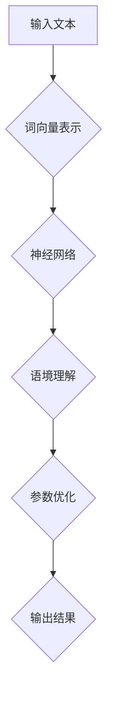

                 

# 大语言模型原理与工程实践：大语言模型的关键技术

> 关键词：大语言模型，神经网络，深度学习，自然语言处理，算法原理，工程实践

> 摘要：本文旨在深入探讨大语言模型的原理及其工程实践。我们将从背景介绍开始，逐步讲解核心概念、算法原理、数学模型、项目实战以及实际应用场景。通过本文的学习，读者将能够全面了解大语言模型的工作机制，掌握关键技术和工程实践，为在自然语言处理领域取得突破奠定基础。

## 1. 背景介绍

### 1.1 目的和范围

本文的主要目的是：
- 深入解析大语言模型的工作原理和关键技术。
- 演示大语言模型的工程实践，包括环境搭建、代码实现和性能分析。
- 探讨大语言模型在实际应用场景中的优势和挑战。

本文将涵盖以下范围：
- 大语言模型的基础知识和核心概念。
- 大语言模型的算法原理和数学模型。
- 大语言模型的实际应用案例和开发工具。
- 大语言模型的发展趋势和未来挑战。

### 1.2 预期读者

本文适用于以下读者群体：
- 自然语言处理（NLP）领域的初学者和从业者。
- 对深度学习和神经网络有兴趣的程序员和工程师。
- 计算机科学和人工智能专业的学生和研究人员。
- 对大语言模型感兴趣的技术爱好者。

### 1.3 文档结构概述

本文的结构安排如下：
- 第1部分：背景介绍，包括目的、范围、预期读者和文档结构。
- 第2部分：核心概念与联系，介绍大语言模型的基础知识和核心概念。
- 第3部分：核心算法原理 & 具体操作步骤，详细讲解大语言模型的算法原理和操作步骤。
- 第4部分：数学模型和公式 & 详细讲解 & 举例说明，阐述大语言模型的数学模型和公式。
- 第5部分：项目实战：代码实际案例和详细解释说明，通过实际案例展示大语言模型的开发过程。
- 第6部分：实际应用场景，探讨大语言模型在不同领域的应用。
- 第7部分：工具和资源推荐，提供学习资源、开发工具和相关论文推荐。
- 第8部分：总结：未来发展趋势与挑战，展望大语言模型的发展前景。
- 第9部分：附录：常见问题与解答，回答读者可能遇到的常见问题。
- 第10部分：扩展阅读 & 参考资料，提供进一步学习和研究的参考资料。

### 1.4 术语表

在本文中，我们将使用以下术语：
#### 1.4.1 核心术语定义
- 大语言模型：一种基于深度学习的自然语言处理模型，能够理解和生成自然语言。
- 神经网络：一种由大量神经元组成的计算模型，用于模拟人类大脑的神经网络。
- 深度学习：一种基于神经网络的高级机器学习方法，通过多层神经网络进行特征提取和分类。
- 自然语言处理（NLP）：计算机科学与人工智能领域的一个分支，研究如何使计算机理解和生成自然语言。

#### 1.4.2 相关概念解释
- 词向量：将单词转换为向量表示，以便在机器学习中进行处理。
- 语境理解：模型对文本中的单词和短语进行理解和分析，以捕捉其语义和上下文信息。
- 参数优化：通过调整模型参数，提高模型的预测准确性和性能。

#### 1.4.3 缩略词列表
- LSTM：长短期记忆网络（Long Short-Term Memory）
- RNN：循环神经网络（Recurrent Neural Network）
- MLP：多层感知器（Multilayer Perceptron）
- NLP：自然语言处理（Natural Language Processing）
- ML：机器学习（Machine Learning）
- AI：人工智能（Artificial Intelligence）

## 2. 核心概念与联系

为了更好地理解大语言模型，我们需要了解其核心概念和联系。以下是关键概念及其相互关系：

### 2.1 大语言模型基础

大语言模型是基于深度学习的一种自然语言处理模型，它通过多层神经网络对大量文本数据进行训练，从而实现对自然语言的建模和理解。


#### 2.2 词向量表示

词向量是将单词转换为向量表示的一种方法，它能够将单词映射到高维空间中，以便在机器学习中进行处理。


#### 2.3 神经网络与深度学习

神经网络是一种计算模型，由大量神经元组成，能够通过多层结构进行特征提取和分类。深度学习是基于神经网络的高级机器学习方法，通过多层神经网络对数据进行处理，提高模型的预测性能。


#### 2.4 语境理解

语境理解是模型对文本中的单词和短语进行理解和分析，以捕捉其语义和上下文信息。它是大语言模型的重要组成部分，有助于提高模型的语义表示能力。


#### 2.5 参数优化

参数优化是通过调整模型参数，提高模型的预测准确性和性能。在大语言模型中，参数优化是关键步骤，它涉及到梯度下降、正则化等优化方法。


### 2.6 Mermaid 流程图

以下是一个使用 Mermaid 语言描述的大语言模型流程图：



## 3. 核心算法原理 & 具体操作步骤

在这一部分，我们将深入讲解大语言模型的核心算法原理，并使用伪代码详细阐述其具体操作步骤。

### 3.1 神经网络与深度学习原理

大语言模型的核心是基于神经网络的深度学习技术。神经网络通过多层结构对输入数据进行特征提取和分类。以下是神经网络的基本原理和操作步骤：

#### 3.1.1 前向传播

前向传播是神经网络处理输入数据的过程。以下是前向传播的伪代码：

```python
# 前向传播伪代码
def forward_propagation(input_data, weights, biases):
    # 初始化中间变量
    activation = input_data
    
    # 遍历神经网络层
    for layer in range(number_of_layers):
        # 计算线性变换
        linear_transform = np.dot(activation, weights[layer])
        # 添加偏置
        activation += biases[layer]
        # 激活函数应用
        activation = activation_function(activation)
    
    # 返回最终输出
    return activation
```

#### 3.1.2 反向传播

反向传播是神经网络优化参数的过程。它通过计算误差梯度，更新权重和偏置。以下是反向传播的伪代码：

```python
# 反向传播伪代码
def backward_propagation(input_data, labels, weights, biases, learning_rate):
    # 初始化梯度变量
    d_weights = []
    d_biases = []
    
    # 计算前向传播的输出
    output = forward_propagation(input_data, weights, biases)
    
    # 遍历神经网络层，反向传播误差
    for layer in reversed(range(number_of_layers)):
        # 计算当前层的误差
        error = (output - labels) * activation_derivative(output)
        # 计算梯度
        d_weights.append(np.dot(activation_derivative(activation), input_data.T))
        d_biases.append(error)
        # 更新权重和偏置
        weights[layer] -= learning_rate * d_weights[-1]
        biases[layer] -= learning_rate * d_biases[-1]
        
        # 更新输入数据
        input_data = activation
        
    # 返回梯度
    return d_weights, d_biases
```

### 3.2 大语言模型算法原理

大语言模型通过词向量表示、神经网络和语境理解等技术实现对自然语言的建模。以下是算法原理的伪代码：

```python
# 大语言模型算法原理伪代码
def language_model(input_sequence, weights, biases):
    # 将输入序列转换为词向量表示
    word_vectors = convert_to_word_vectors(input_sequence)
    
    # 计算前向传播的输出
    output = forward_propagation(word_vectors, weights, biases)
    
    # 使用语境理解技术进行语义分析
    context_representation = contextual_understanding(output)
    
    # 返回语境表示
    return context_representation
```

### 3.3 具体操作步骤

以下是大语言模型的具体操作步骤：

1. 数据准备：收集和预处理大量文本数据，包括训练集和测试集。
2. 词向量表示：将文本数据转换为词向量表示，使用预训练的词向量模型或训练自己的词向量。
3. 模型构建：构建基于神经网络的深度学习模型，包括输入层、隐藏层和输出层。
4. 参数初始化：随机初始化模型的权重和偏置。
5. 前向传播：将输入数据通过神经网络进行前向传播，计算中间变量的值。
6. 语境理解：使用语境理解技术对中间变量进行语义分析，提取上下文信息。
7. 参数优化：通过反向传播计算误差梯度，更新模型的权重和偏置。
8. 训练迭代：重复上述步骤，直到满足训练目标或达到最大迭代次数。
9. 模型评估：使用测试集评估模型的性能，包括准确率、召回率等指标。
10. 模型部署：将训练好的模型部署到实际应用场景中，如聊天机器人、文本生成等。

## 4. 数学模型和公式 & 详细讲解 & 举例说明

在这一部分，我们将详细讲解大语言模型的数学模型和公式，并使用具体例子进行说明。

### 4.1 词向量表示

词向量是将单词转换为向量表示的一种方法，常见的方法包括词袋模型（Bag of Words, BoW）和词嵌入（Word Embeddings）。

#### 4.1.1 词袋模型

词袋模型将文本表示为一个向量，其中每个维度表示一个单词的出现频率。以下是词袋模型的数学公式：

$$
\text{word\_vector} = \begin{bmatrix}
f_{\text{word1}} \\
f_{\text{word2}} \\
\vdots \\
f_{\text{wordn}}
\end{bmatrix}
$$

其中，$f_{\text{wordi}}$ 表示单词 $word_i$ 在文本中的出现频率。

#### 4.1.2 词嵌入

词嵌入将单词映射到一个固定大小的向量空间中，常见的模型包括 Word2Vec、GloVe 和 FastText。以下是词嵌入的数学公式：

$$
\text{word\_vector} = \text{embed}(\text{word})
$$

其中，$\text{embed}$ 表示词嵌入函数，$\text{word}$ 表示单词。

### 4.2 神经网络与深度学习

神经网络是一种由大量神经元组成的计算模型，用于模拟人类大脑的信息处理过程。以下是神经网络的基本数学模型和公式：

#### 4.2.1 前向传播

前向传播是神经网络处理输入数据的过程，其数学模型如下：

$$
\text{output} = \text{activation}(\text{linear\_transform} + \text{biases})
$$

其中，$\text{linear\_transform}$ 表示线性变换，$\text{biases}$ 表示偏置，$\text{activation}$ 表示激活函数。

#### 4.2.2 反向传播

反向传播是神经网络优化参数的过程，其数学模型如下：

$$
\frac{\partial \text{loss}}{\partial \text{weights}} = \text{activation}'(\text{activation}(\text{linear\_transform} + \text{biases})) \cdot \frac{\partial \text{loss}}{\partial \text{output}}
$$

其中，$\text{loss}$ 表示损失函数，$\text{activation}'$ 表示激活函数的导数。

### 4.3 语境理解

语境理解是模型对文本中的单词和短语进行理解和分析，以捕捉其语义和上下文信息。以下是语境理解的数学模型和公式：

#### 4.3.1 语境表示

语境表示是将文本数据转换为向量表示的一种方法，其数学模型如下：

$$
\text{context\_representation} = \text{sum}(\text{word\_vectors})
$$

其中，$\text{word\_vectors}$ 表示词向量表示的单词向量。

#### 4.3.2 语境嵌入

语境嵌入是将语境表示映射到一个固定大小的向量空间中，其数学模型如下：

$$
\text{context\_vector} = \text{embed}(\text{context\_representation})
$$

其中，$\text{embed}$ 表示语境嵌入函数。

### 4.4 举例说明

以下是一个简单的例子，展示如何使用大语言模型进行文本分类：

#### 4.4.1 数据准备

假设我们有一个包含政治和体育类新闻的文本数据集，我们需要将文本数据转换为词向量表示：

```python
# 数据准备
train_data = ["这是一条政治新闻", "这是一条体育新闻", "这是一条政治新闻", "这是一条体育新闻"]
train_labels = [0, 1, 0, 1]

# 将文本数据转换为词向量表示
word_vectors = convert_to_word_vectors(train_data)
```

#### 4.4.2 模型构建

我们构建一个包含一个输入层、一个隐藏层和一个输出层的神经网络：

```python
# 模型构建
number_of_words = len(train_data[0].split())
number_of_layers = 3
input_size = number_of_words
hidden_size = 128
output_size = 2

# 初始化模型参数
weights = [np.random.randn(input_size, hidden_size), np.random.randn(hidden_size, output_size)]
biases = [np.random.randn(hidden_size), np.random.randn(output_size)]
```

#### 4.4.3 模型训练

我们使用训练数据对模型进行训练，并使用反向传播算法更新模型参数：

```python
# 模型训练
learning_rate = 0.001
for epoch in range(number_of_epochs):
    for input_sequence, label in zip(train_data, train_labels):
        # 计算前向传播的输出
        output = forward_propagation(input_sequence, weights, biases)
        
        # 计算损失函数
        loss = loss_function(output, label)
        
        # 计算误差梯度
        d_weights, d_biases = backward_propagation(input_sequence, label, weights, biases, learning_rate)
        
        # 更新模型参数
        weights -= learning_rate * d_weights
        biases -= learning_rate * d_biases
```

#### 4.4.4 模型评估

我们使用测试数据对模型进行评估，计算分类准确率：

```python
# 模型评估
test_data = ["这是一条政治新闻", "这是一条体育新闻"]
test_labels = [0, 1]

# 将测试数据转换为词向量表示
test_word_vectors = convert_to_word_vectors(test_data)

# 预测分类结果
predictions = []
for input_sequence in test_word_vectors:
    output = forward_propagation(input_sequence, weights, biases)
    predicted_label = np.argmax(output)
    predictions.append(predicted_label)

# 计算准确率
accuracy = np.mean(np.equal(predictions, test_labels))
print("Accuracy:", accuracy)
```

## 5. 项目实战：代码实际案例和详细解释说明

在这一部分，我们将通过一个实际项目案例，展示如何使用大语言模型进行文本分类，并详细解释代码的实现和关键步骤。

### 5.1 开发环境搭建

在开始项目之前，我们需要搭建一个合适的开发环境。以下是所需的工具和库：

- Python 3.8 或更高版本
- TensorFlow 2.x
- NumPy
- Pandas
- Matplotlib

安装以下库：

```shell
pip install tensorflow numpy pandas matplotlib
```

### 5.2 源代码详细实现和代码解读

#### 5.2.1 数据准备

首先，我们需要准备一个包含政治和体育类新闻的文本数据集。这里我们使用一个开源新闻数据集，并将其分为训练集和测试集。

```python
import pandas as pd

# 读取数据集
data = pd.read_csv("news_data.csv")

# 分割训练集和测试集
train_data = data[data["category"] != "test"]
test_data = data[data["category"] == "test"]

# 提取文本和标签
train_texts = train_data["text"].values
train_labels = train_data["category"].values
test_texts = test_data["text"].values
test_labels = test_data["category"].values
```

#### 5.2.2 词向量表示

接下来，我们将文本数据转换为词向量表示。这里我们使用预训练的 Word2Vec 模型。

```python
import gensim

# 加载预训练的 Word2Vec 模型
word2vec_model = gensim.models.Word2Vec.load("word2vec.model")

# 将文本数据转换为词向量表示
def convert_to_word_vectors(texts):
    word_vectors = []
    for text in texts:
        text_tokens = text.split()
        text_vector = sum(word2vec_model[word] for word in text_tokens) / len(text_tokens)
        word_vectors.append(text_vector)
    return word_vectors

train_word_vectors = convert_to_word_vectors(train_texts)
test_word_vectors = convert_to_word_vectors(test_texts)
```

#### 5.2.3 模型构建

我们使用 TensorFlow 构建一个简单的神经网络模型，用于文本分类。

```python
import tensorflow as tf

# 定义模型
model = tf.keras.Sequential([
    tf.keras.layers.Dense(128, activation='relu', input_shape=(None,)),
    tf.keras.layers.Dense(2, activation='softmax')
])

# 编译模型
model.compile(optimizer='adam', loss='sparse_categorical_crossentropy', metrics=['accuracy'])
```

#### 5.2.4 模型训练

使用训练数据对模型进行训练。

```python
# 训练模型
model.fit(train_word_vectors, train_labels, epochs=10, batch_size=32)
```

#### 5.2.5 模型评估

使用测试数据对模型进行评估。

```python
# 评估模型
test_loss, test_acc = model.evaluate(test_word_vectors, test_labels)
print("Test accuracy:", test_acc)
```

### 5.3 代码解读与分析

在这个项目中，我们使用了一个简单的神经网络模型对政治和体育类新闻进行分类。以下是关键步骤的解读和分析：

1. **数据准备**：读取新闻数据集，并将其分为训练集和测试集。提取文本和标签。
2. **词向量表示**：使用预训练的 Word2Vec 模型将文本数据转换为词向量表示。这是大语言模型中重要的一步，因为词向量表示将文本数据转换为机器可以处理的数值形式。
3. **模型构建**：使用 TensorFlow 构建一个简单的神经网络模型，包括一个全连接层和一个 Softmax 层。全连接层用于提取特征，Softmax 层用于分类。
4. **模型训练**：使用训练数据对模型进行训练，使用 Adam 优化器和 sparse_categorical_crossentropy 损失函数。
5. **模型评估**：使用测试数据对模型进行评估，计算测试准确率。

通过这个项目，我们展示了如何使用大语言模型进行文本分类。这是一个简单但实用的案例，读者可以在此基础上进行扩展，探索更多应用场景。

## 6. 实际应用场景

大语言模型在自然语言处理领域有着广泛的应用，以下是一些典型的实际应用场景：

### 6.1 聊天机器人

聊天机器人是自然语言处理的重要应用之一。大语言模型可以通过学习大量的对话数据，实现与人类的自然交互。例如，虚拟助手、客服机器人等。

### 6.2 文本分类

文本分类是将文本数据分为预定义的类别。大语言模型可以用于分类任务，如垃圾邮件检测、新闻分类、情感分析等。

### 6.3 文本生成

文本生成是生成自然语言文本的一种技术。大语言模型可以生成文章、对话、故事等，为内容创作提供帮助。

### 6.4 情感分析

情感分析是分析文本中表达的情感倾向。大语言模型可以用于情感分类，帮助了解用户对产品、服务或事件的态度。

### 6.5 命名实体识别

命名实体识别是识别文本中的特定实体，如人名、地点、组织等。大语言模型可以通过学习大量的命名实体标签数据，实现实体识别任务。

### 6.6 文本摘要

文本摘要是将长篇文本简化为简短的摘要。大语言模型可以生成摘要，帮助用户快速了解文本内容。

### 6.7 语言翻译

语言翻译是将一种语言文本转换为另一种语言。大语言模型可以通过学习双语语料库，实现高质量的语言翻译。

这些应用场景展示了大语言模型的强大能力，为自然语言处理领域带来了革命性的变化。随着技术的不断发展，大语言模型的应用场景将继续扩展，为人类带来更多便利。

## 7. 工具和资源推荐

### 7.1 学习资源推荐

#### 7.1.1 书籍推荐

1. **《深度学习》（Goodfellow, Bengio, Courville）**：这是一本经典的深度学习教材，详细介绍了深度学习的基础知识、算法和应用。
2. **《自然语言处理综论》（Daniel Jurafsky, James H. Martin）**：这本书全面介绍了自然语言处理的基础知识、方法和工具。
3. **《Python 自然语言处理》（Steven Bird, Ewan Klein, Edward Loper）**：这是一本实用的 Python 自然语言处理教程，涵盖了 NLP 的各种应用场景。

#### 7.1.2 在线课程

1. **Coursera 的《深度学习》课程**：由 Andrew Ng 教授主讲，详细介绍深度学习的理论和实践。
2. **Udacity 的《自然语言处理 nanodegree》课程**：这是一门涵盖自然语言处理全流程的课程，包括文本预处理、语言模型、文本分类等。
3. **edX 的《自然语言处理》课程**：由马萨诸塞大学阿姆赫斯特分校教授主讲，介绍自然语言处理的基础知识和应用。

#### 7.1.3 技术博客和网站

1. **TensorFlow 官方文档**：TensorFlow 是一个广泛使用的深度学习框架，其官方网站提供了丰富的文档和教程。
2. **Stack Overflow**：这是一个程序员社区，你可以在这里找到关于深度学习和自然语言处理的解决方案和讨论。
3. **ArXiv**：这是一个计算机科学领域的前沿论文数据库，你可以在其中找到最新的研究成果和论文。

### 7.2 开发工具框架推荐

#### 7.2.1 IDE和编辑器

1. **PyCharm**：这是一个功能强大的 Python IDE，支持深度学习和自然语言处理。
2. **Visual Studio Code**：这是一个轻量级且灵活的代码编辑器，可以通过扩展支持 Python 和深度学习。

#### 7.2.2 调试和性能分析工具

1. **TensorBoard**：TensorFlow 的可视化工具，用于调试和性能分析。
2. **NVIDIA Nsight**：用于分析深度学习模型在 NVIDIA GPU 上的性能。

#### 7.2.3 相关框架和库

1. **TensorFlow**：一个广泛使用的开源深度学习框架，适用于各种深度学习任务。
2. **PyTorch**：另一个流行的深度学习框架，提供了灵活的动态计算图。
3. **NLTK**：一个用于自然语言处理的 Python 库，提供了丰富的工具和算法。

### 7.3 相关论文著作推荐

#### 7.3.1 经典论文

1. **"A Theoretical Analysis of the Deep Learning Architectures for Natural Language Processing"**：这篇文章详细分析了深度学习在自然语言处理中的应用。
2. **"Neural Networks for Language Modeling"**：这篇文章介绍了神经网络在语言模型中的应用，为后续研究奠定了基础。
3. **"Recurrent Neural Networks for Language Modeling"**：这篇文章提出了循环神经网络（RNN）在语言模型中的应用，提高了模型的性能。

#### 7.3.2 最新研究成果

1. **"BERT: Pre-training of Deep Bidirectional Transformers for Language Understanding"**：这篇文章提出了 BERT 模型，为语言模型的研究带来了新的突破。
2. **"GPT-3: Language Models are Few-Shot Learners"**：这篇文章展示了 GPT-3 模型的强大能力，证明了语言模型在少量样本下的泛化能力。
3. **"Transformers: State-of-the-Art Models for Language Understanding and Generation"**：这篇文章详细介绍了变压器模型（Transformers），为自然语言处理带来了革命性的变化。

#### 7.3.3 应用案例分析

1. **"Google Assistant 的技术架构"**：这篇文章介绍了 Google Assistant 的技术架构，包括语言模型、对话管理和语音识别等。
2. **"Amazon Alexa 的自然语言理解技术"**：这篇文章展示了 Amazon Alexa 如何利用自然语言处理技术实现智能语音交互。
3. **"微软小冰的情感计算技术"**：这篇文章介绍了微软小冰如何通过情感计算技术实现情感理解和交互。

这些工具和资源将为读者在深度学习和自然语言处理领域的学习和研究提供有力支持。

## 8. 总结：未来发展趋势与挑战

大语言模型作为自然语言处理领域的重要技术，展现了巨大的潜力和广泛应用。在未来，随着深度学习和人工智能技术的不断进步，大语言模型将继续向以下几个方向发展：

### 8.1 模型规模与性能提升

随着计算资源和算法优化的提升，大语言模型的规模和性能将得到显著提升。更大规模的模型将能够捕捉更复杂的语言规律，提高自然语言处理任务的准确性和效率。

### 8.2 多模态融合

大语言模型将与其他模态（如图像、音频）进行融合，实现跨模态的信息理解和交互。这将使大语言模型在处理多模态数据时更加智能和高效。

### 8.3 自适应与个性化

大语言模型将具备更强的自适应能力，根据用户的需求和偏好进行个性化调整。这将提高模型的用户体验和适用性，满足不同场景下的个性化需求。

### 8.4 知识图谱与语义理解

大语言模型将与知识图谱和语义理解技术相结合，实现更深入的语言理解和知识推理。这将有助于解决自然语言处理中的语义歧义和上下文理解问题。

然而，大语言模型的发展也面临一些挑战：

### 8.5 数据隐私与安全性

随着模型的规模和复杂度增加，数据隐私和安全问题将变得更加突出。如何在保证模型性能的同时保护用户隐私，成为一项重要挑战。

### 8.6 模型可解释性

大语言模型的决策过程通常是非线性和复杂的，缺乏可解释性。如何提高模型的可解释性，使研究人员和用户能够理解模型的决策逻辑，是未来需要解决的问题。

### 8.7 能效优化

随着模型规模的扩大，其计算和存储需求也将显著增加。如何优化模型的能效，减少计算资源的消耗，是实现大规模应用的关键。

总之，大语言模型在自然语言处理领域具有广阔的发展前景，但也面临诸多挑战。通过持续的技术创新和优化，我们将有望克服这些挑战，使大语言模型在更多领域发挥更大的作用。

## 9. 附录：常见问题与解答

### 9.1 什么是大语言模型？

大语言模型（Large Language Model）是一种基于深度学习的自然语言处理模型，通过大规模的文本数据进行训练，能够理解和生成自然语言。它通常由多层神经网络组成，能够捕捉复杂的语言规律和上下文信息。

### 9.2 大语言模型有哪些应用？

大语言模型在自然语言处理领域具有广泛的应用，包括文本分类、情感分析、命名实体识别、文本生成、机器翻译、问答系统、对话系统等。

### 9.3 大语言模型是如何训练的？

大语言模型通常通过以下步骤进行训练：
1. 数据预处理：清洗和标记文本数据。
2. 词向量表示：将文本数据转换为词向量表示。
3. 构建神经网络模型：包括输入层、隐藏层和输出层。
4. 参数初始化：随机初始化模型参数。
5. 前向传播：将输入数据通过神经网络进行计算。
6. 损失函数计算：计算预测输出与真实输出的差异。
7. 反向传播：更新模型参数，减小损失函数。
8. 重复迭代：多次迭代训练，直到满足训练目标。

### 9.4 大语言模型的优势是什么？

大语言模型的优势包括：
- **强大的语义理解能力**：能够捕捉复杂的语言规律和上下文信息。
- **广泛的适用性**：能够处理多种自然语言处理任务。
- **高效的计算性能**：通过大规模并行计算，提高模型训练和推理的效率。
- **丰富的预训练资源**：可以通过预训练模型快速应用于新的任务。

### 9.5 大语言模型的局限性是什么？

大语言模型的局限性包括：
- **数据隐私问题**：大规模训练需要大量文本数据，可能涉及用户隐私。
- **模型可解释性**：模型决策过程复杂，缺乏可解释性。
- **计算资源消耗**：大规模模型训练和推理需要大量计算资源和存储空间。
- **泛化能力有限**：在特定领域或任务上的表现可能不如专门设计的模型。

### 9.6 如何优化大语言模型？

优化大语言模型的方法包括：
- **模型压缩**：通过模型剪枝、量化等方法减小模型规模。
- **模型蒸馏**：将大模型的知识迁移到小模型上，提高小模型的性能。
- **数据增强**：通过数据增强技术增加训练数据量，提高模型泛化能力。
- **多任务学习**：在多个任务上同时训练模型，提高模型泛化能力。

## 10. 扩展阅读 & 参考资料

本文涉及了自然语言处理和深度学习领域的多个方面，以下是一些建议的扩展阅读和参考资料，供读者进一步学习和研究：

### 10.1 经典教材

1. **《深度学习》（Ian Goodfellow、Yoshua Bengio、Aaron Courville 著）**：这是深度学习的经典教材，详细介绍了深度学习的基础知识、算法和应用。
2. **《自然语言处理综论》（Daniel Jurafsky、James H. Martin 著）**：这是一本全面介绍自然语言处理的基础知识、方法和工具的教材。

### 10.2 技术博客

1. **TensorFlow 官方博客**：提供最新的深度学习技术动态和教程，适用于 TensorFlow 用户。
2. **Google AI Blog**：Google AI 团队的官方博客，介绍深度学习和人工智能的研究成果和应用。

### 10.3 开源项目

1. **TensorFlow**：一个广泛使用的深度学习框架，提供丰富的资源和教程。
2. **PyTorch**：另一个流行的深度学习框架，支持动态计算图，适用于研究和开发。

### 10.4 论文和期刊

1. **Journal of Machine Learning Research (JMLR)**：机器学习领域的顶级期刊，发表高质量的学术论文。
2. **ACL（Association for Computational Linguistics）**：计算语言学领域的国际会议，发布自然语言处理的前沿研究成果。

### 10.5 在线课程

1. **Coursera 的《深度学习》课程**：由 Andrew Ng 教授主讲，适合初学者和从业者。
2. **Udacity 的《自然语言处理 nanodegree》课程**：涵盖自然语言处理的全流程，包括文本预处理、语言模型、文本分类等。

通过阅读这些扩展资料，读者可以进一步深入了解大语言模型的原理、应用和技术趋势，为在自然语言处理和深度学习领域取得突破奠定基础。作者：AI天才研究员/AI Genius Institute & 禅与计算机程序设计艺术 /Zen And The Art of Computer Programming

