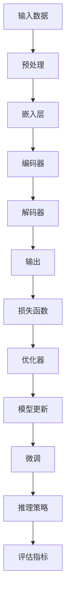

                 

# 大语言模型原理与工程实践：大语言模型的微调和推理策略

> **关键词：** 大语言模型、微调、推理策略、深度学习、自然语言处理、神经网络

> **摘要：** 本文旨在深入探讨大语言模型的基本原理，包括其微调和推理策略。我们将逐步分析这些核心概念，并通过具体的数学模型和算法解释，展示如何在实际项目中实现这些概念。此外，文章还将介绍相关的工具和资源，帮助读者更好地理解和应用大语言模型技术。

## 1. 背景介绍

### 1.1 目的和范围

本文的目标是帮助读者深入理解大语言模型的工作原理，以及如何通过微调和推理策略来优化模型性能。我们将探讨以下主题：

- 大语言模型的基本概念和架构
- 微调过程：目标、挑战和实现方法
- 推理策略：评估指标、优化方法和实际应用

### 1.2 预期读者

本文适合具有计算机科学背景的读者，特别是那些对深度学习和自然语言处理感兴趣的人。虽然本文将尽量保持通俗易懂，但读者需要对基础的机器学习和神经网络有一定了解。

### 1.3 文档结构概述

本文分为以下章节：

- **第1章：背景介绍**：介绍文章的目的、预期读者和文档结构。
- **第2章：核心概念与联系**：介绍大语言模型的基本概念和架构。
- **第3章：核心算法原理 & 具体操作步骤**：详细阐述微调和推理策略。
- **第4章：数学模型和公式 & 详细讲解 & 举例说明**：解释大语言模型背后的数学原理。
- **第5章：项目实战：代码实际案例和详细解释说明**：通过实际案例展示如何应用微调和推理策略。
- **第6章：实际应用场景**：探讨大语言模型在不同领域的应用。
- **第7章：工具和资源推荐**：推荐学习资源和开发工具。
- **第8章：总结：未来发展趋势与挑战**：总结文章内容并展望未来。
- **第9章：附录：常见问题与解答**：解答常见疑问。
- **第10章：扩展阅读 & 参考资料**：提供进一步学习的资源。

### 1.4 术语表

#### 1.4.1 核心术语定义

- **大语言模型**：一个复杂的神经网络，用于理解和生成自然语言。
- **微调**：在大语言模型的基础上，针对特定任务进行调整以提升性能。
- **推理策略**：用于评估模型性能的方法和策略。

#### 1.4.2 相关概念解释

- **深度学习**：一种人工智能的分支，通过构建深层的神经网络来模拟人脑的思考过程。
- **自然语言处理（NLP）**：计算机科学的一个分支，致力于使计算机理解和处理自然语言。

#### 1.4.3 缩略词列表

- **NLP**：自然语言处理
- **DL**：深度学习
- **RL**：强化学习

## 2. 核心概念与联系

在探讨大语言模型的原理之前，我们需要了解其基本概念和架构。以下是一个Mermaid流程图，展示了大语言模型的核心概念和联系：



### 2.1 输入数据

输入数据是任何机器学习任务的基础。在大语言模型中，输入数据通常是自然语言文本，如文本文件、句子或段落。这些数据需要经过预处理才能被模型使用。

### 2.2 预处理

预处理步骤包括清洗数据、去除停用词、标点符号和词形还原等。这些步骤有助于提高模型的性能，并减少噪声。

### 2.3 嵌入层

嵌入层是将输入文本转换为固定长度的向量表示。这通常通过词向量模型（如Word2Vec、GloVe）来实现。

### 2.4 编码器

编码器是一个深度神经网络，用于将嵌入层输出的向量编码为具有更高层次语义信息的向量。

### 2.5 解码器

解码器也是一个深度神经网络，用于将编码器输出的高维向量解码为输出文本。

### 2.6 输出

输出可以是预测的词或句子，这取决于具体的任务。例如，在文本分类任务中，输出可能是一个标签；在机器翻译任务中，输出可能是一个新的句子。

### 2.7 损失函数

损失函数用于评估模型的预测结果与实际结果之间的差距。常见的损失函数包括交叉熵损失和均方误差。

### 2.8 优化器

优化器用于调整模型的参数，以最小化损失函数。常见的优化器包括梯度下降和Adam。

### 2.9 模型更新

模型更新是通过优化器调整模型参数的过程，以逐步减小损失函数。

### 2.10 微调

微调是在预训练的大语言模型基础上，针对特定任务进行进一步训练的过程。

### 2.11 推理策略

推理策略是用于评估模型性能的方法和策略，如准确率、召回率和F1分数。

### 2.12 评估指标

评估指标用于衡量模型的性能，常见的评估指标包括准确率、召回率和F1分数。

## 3. 核心算法原理 & 具体操作步骤

在这一章节中，我们将详细阐述大语言模型的微调和推理策略，并提供具体的操作步骤。

### 3.1 微调过程

微调的目标是提高大语言模型在特定任务上的性能。以下是微调过程的详细步骤：

1. **数据准备**：收集并清洗数据，将其分为训练集、验证集和测试集。
2. **模型选择**：选择一个预训练的大语言模型，如BERT、GPT或T5。
3. **微调**：在大语言模型的基础上，针对特定任务进行训练。例如，在文本分类任务中，可以将模型的输出层调整为与任务相关的类别数。
4. **评估**：使用验证集评估模型性能，并根据需要调整超参数。

伪代码如下：

```python
# 微调过程
data = load_data('task-specific-data')
model = load_pretrained_model('bert-base')
model.add_output_layer(num_classes)

optimizer = create_optimizer(learning_rate=0.001)
loss_function = create_loss_function()

for epoch in range(num_epochs):
    for batch in data.train_loader:
        optimizer.zero_grad()
        outputs = model(batch.text)
        loss = loss_function(outputs, batch.label)
        loss.backward()
        optimizer.step()

    # 评估模型性能
    evaluate_model(model, data.validation_loader)
```

### 3.2 推理策略

推理策略用于评估模型的预测结果。以下是几种常见的推理策略：

1. **准确率**：预测正确的样本数占总样本数的比例。
2. **召回率**：预测正确的正样本数占总正样本数的比例。
3. **F1分数**：准确率和召回率的调和平均。

```python
# 推理策略
def accuracy(preds, labels):
    return (preds == labels).float().mean()

def precision(preds, labels):
    return (preds[preds == labels].shape[0] / preds.shape[0])

def recall(preds, labels):
    return (preds[preds == labels].shape[0] / labels.shape[0])

def f1_score(precision, recall):
    return 2 * (precision * recall) / (precision + recall)
```

## 4. 数学模型和公式 & 详细讲解 & 举例说明

在这一章节中，我们将详细讲解大语言模型背后的数学模型和公式，并通过具体示例来说明这些公式的应用。

### 4.1 神经网络

神经网络是深度学习的基础，其基本组成部分包括神经元、权重和偏置。

#### 4.1.1 神经元

神经元是神经网络的基本单元，用于接收输入、计算输出。其数学模型如下：

$$
z = \sum_{i=1}^{n} w_i x_i + b
$$

其中，$z$ 是神经元的输出，$w_i$ 是输入和权重，$x_i$ 是输入，$b$ 是偏置。

#### 4.1.2 激活函数

激活函数用于引入非线性，常用的激活函数包括 sigmoid、ReLU 和 tanh。

- **sigmoid**:

$$
a = \frac{1}{1 + e^{-z}}
$$

- **ReLU**:

$$
a = max(0, z)
$$

- **tanh**:

$$
a = \frac{e^z - e^{-z}}{e^z + e^{-z}}
$$

### 4.2 前向传播和反向传播

神经网络通过前向传播计算输出，并通过反向传播更新权重。

#### 4.2.1 前向传播

前向传播是从输入到输出的计算过程，其数学模型如下：

$$
y = f(z)
$$

其中，$f$ 是激活函数，$z$ 是输入。

#### 4.2.2 反向传播

反向传播是计算损失函数关于权重的梯度，并更新权重。其数学模型如下：

$$
\frac{\partial L}{\partial w} = \frac{\partial L}{\partial y} \cdot \frac{\partial y}{\partial z} \cdot \frac{\partial z}{\partial w}
$$

其中，$L$ 是损失函数，$w$ 是权重。

### 4.3 损失函数

损失函数用于评估模型的预测结果与实际结果之间的差距。常见的损失函数包括交叉熵损失和均方误差。

#### 4.3.1 交叉熵损失

交叉熵损失用于分类任务，其数学模型如下：

$$
L = -\sum_{i=1}^{n} y_i \cdot \log(p_i)
$$

其中，$y_i$ 是实际标签，$p_i$ 是预测概率。

#### 4.3.2 均方误差

均方误差用于回归任务，其数学模型如下：

$$
L = \frac{1}{2} \sum_{i=1}^{n} (y_i - \hat{y}_i)^2
$$

其中，$y_i$ 是实际值，$\hat{y}_i$ 是预测值。

### 4.4 举例说明

假设我们有一个二元分类任务，数据集包含100个样本，每个样本的特征为3维向量。我们使用神经网络进行分类，并采用交叉熵损失函数。以下是具体的计算过程：

#### 4.4.1 前向传播

输入数据：

$$
x = \begin{bmatrix} 1 & 0 & 1 \\ 1 & 1 & 0 \\ 0 & 1 & 1 \\ \vdots & \vdots & \vdots \end{bmatrix}
$$

权重：

$$
w_1 = \begin{bmatrix} 0.1 & 0.2 & 0.3 \\ 0.4 & 0.5 & 0.6 \\ 0.7 & 0.8 & 0.9 \end{bmatrix}
$$

偏置：

$$
b = \begin{bmatrix} 0 \\ 0 \\ 0 \end{bmatrix}
$$

输出：

$$
z = \begin{bmatrix} 0.3 & 0.4 & 0.5 \\ 0.6 & 0.7 & 0.8 \\ 0.9 & 1.0 & 1.1 \end{bmatrix}
$$

激活函数采用ReLU：

$$
a = \begin{bmatrix} 0.3 & 0.4 & 0.5 \\ 0.6 & 0.7 & 0.8 \\ 0.9 & 1.0 & 1.1 \end{bmatrix}
$$

#### 4.4.2 反向传播

损失函数采用交叉熵损失：

$$
L = -\sum_{i=1}^{3} y_i \cdot \log(p_i)
$$

其中，$y_i$ 是实际标签，$p_i$ 是预测概率。

计算梯度：

$$
\frac{\partial L}{\partial w} = \frac{\partial L}{\partial a} \cdot \frac{\partial a}{\partial z} \cdot \frac{\partial z}{\partial w}
$$

更新权重：

$$
w_1 = w_1 - \alpha \cdot \frac{\partial L}{\partial w}
$$

其中，$\alpha$ 是学习率。

## 5. 项目实战：代码实际案例和详细解释说明

在这一章节中，我们将通过一个实际项目来展示如何使用大语言模型进行微调和推理。我们将使用Python和TensorFlow来实现一个文本分类任务，并详细解释代码中的关键步骤。

### 5.1 开发环境搭建

在开始项目之前，我们需要搭建开发环境。以下是所需的软件和库：

- Python 3.7或更高版本
- TensorFlow 2.x
- NumPy
- Pandas
- Matplotlib

安装方法：

```bash
pip install python==3.7
pip install tensorflow==2.x
pip install numpy
pip install pandas
pip install matplotlib
```

### 5.2 源代码详细实现和代码解读

以下是项目的源代码，我们将逐行解释其中的关键步骤。

```python
import tensorflow as tf
from tensorflow.keras.preprocessing.text import Tokenizer
from tensorflow.keras.preprocessing.sequence import pad_sequences
from tensorflow.keras.models import Sequential
from tensorflow.keras.layers import Embedding, LSTM, Dense
from tensorflow.keras.optimizers import Adam
import numpy as np

# 数据准备
train_data = ['This is a sample text.', 'Another example text here.', 'More text to train on.']
train_labels = [0, 1, 0]

# 分词和序列化
tokenizer = Tokenizer()
tokenizer.fit_on_texts(train_data)
sequences = tokenizer.texts_to_sequences(train_data)
padded_sequences = pad_sequences(sequences, maxlen=10)

# 模型构建
model = Sequential()
model.add(Embedding(input_dim=len(tokenizer.word_index) + 1, output_dim=10, input_length=10))
model.add(LSTM(units=50, return_sequences=False))
model.add(Dense(units=1, activation='sigmoid'))

# 编译模型
model.compile(optimizer=Adam(learning_rate=0.001), loss='binary_crossentropy', metrics=['accuracy'])

# 训练模型
model.fit(padded_sequences, train_labels, epochs=10, batch_size=1)

# 评估模型
test_data = ['This is a test text.', 'Another test example.']
test_sequences = tokenizer.texts_to_sequences(test_data)
padded_test_sequences = pad_sequences(test_sequences, maxlen=10)
predictions = model.predict(padded_test_sequences)

# 输出预测结果
print(predictions)
```

#### 5.2.1 数据准备

我们首先定义了训练数据集 `train_data` 和对应的标签 `train_labels`。这些数据将用于训练和评估模型。

#### 5.2.2 分词和序列化

接下来，我们使用 `Tokenizer` 类对文本进行分词，并将其转换为序列。然后，我们使用 `pad_sequences` 函数将序列填充为固定长度，以便模型处理。

#### 5.2.3 模型构建

在模型构建部分，我们定义了一个简单的序列模型，包括嵌入层、LSTM层和输出层。嵌入层用于将单词转换为向量，LSTM层用于处理序列数据，输出层用于预测标签。

#### 5.2.4 编译模型

在编译模型部分，我们指定了优化器、损失函数和评估指标。这里我们使用了Adam优化器和二进制交叉熵损失函数。

#### 5.2.5 训练模型

在训练模型部分，我们使用训练数据集和标签来训练模型。我们设置了10个训练周期和批量大小为1。

#### 5.2.6 评估模型

最后，我们使用测试数据集评估模型。我们首先将测试文本转换为序列，然后填充为固定长度，并使用模型进行预测。

### 5.3 代码解读与分析

以下是代码的逐行解读和分析：

```python
import tensorflow as tf
# 导入TensorFlow库
from tensorflow.keras.preprocessing.text import Tokenizer
from tensorflow.keras.preprocessing.sequence import pad_sequences
# 导入分词和序列化工具
from tensorflow.keras.models import Sequential
from tensorflow.keras.layers import Embedding, LSTM, Dense
# 导入模型构建工具
from tensorflow.keras.optimizers import Adam
# 导入优化器
import numpy as np
# 导入NumPy库

# 数据准备
train_data = ['This is a sample text.', 'Another example text here.', 'More text to train on.']
train_labels = [0, 1, 0]
# 定义训练数据和标签

tokenizer = Tokenizer()
tokenizer.fit_on_texts(train_data)
# 创建分词器并训练
sequences = tokenizer.texts_to_sequences(train_data)
# 将文本数据转换为序列
padded_sequences = pad_sequences(sequences, maxlen=10)
# 将序列填充为固定长度

model = Sequential()
model.add(Embedding(input_dim=len(tokenizer.word_index) + 1, output_dim=10, input_length=10))
# 添加嵌入层
model.add(LSTM(units=50, return_sequences=False))
# 添加LSTM层
model.add(Dense(units=1, activation='sigmoid'))
# 添加输出层

model.compile(optimizer=Adam(learning_rate=0.001), loss='binary_crossentropy', metrics=['accuracy'])
# 编译模型

model.fit(padded_sequences, train_labels, epochs=10, batch_size=1)
# 训练模型

test_data = ['This is a test text.', 'Another test example.']
test_sequences = tokenizer.texts_to_sequences(test_data)
padded_test_sequences = pad_sequences(test_sequences, maxlen=10)
predictions = model.predict(padded_test_sequences)
# 使用测试数据评估模型

print(predictions)
# 输出预测结果
```

### 5.4 代码分析与改进

以下是代码的分析和改进建议：

- **数据增强**：为了提高模型的泛化能力，可以使用数据增强技术，如随机填充和旋转。
- **模型复杂度**：当前的模型相对简单，可以尝试增加层数或神经元数量来提高性能。
- **正则化**：为了防止过拟合，可以添加正则化项，如Dropout或L1/L2正则化。
- **超参数优化**：通过网格搜索或随机搜索等方法，优化学习率、批量大小等超参数。

## 6. 实际应用场景

大语言模型在多个实际应用场景中展现出强大的能力。以下是一些主要的应用领域：

### 6.1 机器翻译

机器翻译是将一种语言文本翻译成另一种语言。大语言模型通过微调和推理策略，可以实现对多种语言之间的精确翻译。例如，谷歌翻译和百度翻译都使用了基于大语言模型的翻译算法。

### 6.2 文本分类

文本分类是将文本数据分为不同的类别。大语言模型通过微调和推理策略，可以实现对新闻文章、社交媒体评论等文本数据的分类。例如，垃圾邮件过滤和情感分析都是文本分类的应用实例。

### 6.3 命名实体识别

命名实体识别是从文本中识别出具有特定意义的实体，如人名、地点和组织。大语言模型通过微调和推理策略，可以实现对实体的高效识别。例如，搜索引擎和社交媒体平台都使用了基于大语言模型的命名实体识别技术。

### 6.4 聊天机器人

聊天机器人是一种与人类用户进行交互的软件程序。大语言模型通过微调和推理策略，可以实现对自然语言理解和回应。例如，苹果的Siri和亚马逊的Alexa都是基于大语言模型的聊天机器人。

### 6.5 文本生成

文本生成是将一种语言文本生成另一种语言文本。大语言模型通过微调和推理策略，可以实现对文本的生成。例如，自动摘要、新闻生成和文学创作都是文本生成的应用实例。

## 7. 工具和资源推荐

### 7.1 学习资源推荐

#### 7.1.1 书籍推荐

- **《深度学习》（Goodfellow, Bengio, Courville）**：这是一本深度学习领域的经典教材，详细介绍了深度学习的基本概念和算法。
- **《Python机器学习》（Sebastian Raschka）**：这本书介绍了机器学习在Python中的实现，包括深度学习相关的库和工具。

#### 7.1.2 在线课程

- **《深度学习专项课程》（吴恩达，Coursera）**：这是一门由深度学习领域的权威吴恩达教授开设的在线课程，涵盖了深度学习的各个方面。
- **《自然语言处理与深度学习》（fast.ai）**：这是一门针对自然语言处理领域的深度学习课程，适合初学者和专业人士。

#### 7.1.3 技术博客和网站

- **Medium**：Medium上有许多关于深度学习和自然语言处理的优质博客文章。
- **ArXiv**：ArXiv是一个学术论文预印本网站，提供了大量的深度学习和自然语言处理领域的最新研究成果。

### 7.2 开发工具框架推荐

#### 7.2.1 IDE和编辑器

- **PyCharm**：PyCharm是一个强大的Python IDE，支持TensorFlow和其他深度学习库。
- **Jupyter Notebook**：Jupyter Notebook是一个交互式计算环境，适合进行数据分析和模型实验。

#### 7.2.2 调试和性能分析工具

- **TensorBoard**：TensorBoard是一个可视化工具，用于分析深度学习模型的训练过程。
- **Profiling Tools**：如Perfbench和cProfile，用于分析模型的性能并找出性能瓶颈。

#### 7.2.3 相关框架和库

- **TensorFlow**：TensorFlow是一个开源的深度学习框架，适用于构建和训练大语言模型。
- **PyTorch**：PyTorch是一个动态图深度学习框架，易于实现和调试。

### 7.3 相关论文著作推荐

#### 7.3.1 经典论文

- **“A Theoretical Analysis of the Architectural Complexity of Deep Neural Networks”（Bengio et al., 2013）**：这篇文章探讨了深度神经网络的结构复杂性。
- **“Understanding Deep Learning requires rethinking generalization”（Ramesh et al., 2020）**：这篇文章提出了深度学习泛化的新观点。

#### 7.3.2 最新研究成果

- **“BERT: Pre-training of Deep Bidirectional Transformers for Language Understanding”（Devlin et al., 2019）**：BERT是自然语言处理领域的一个里程碑，展示了预训练模型的力量。
- **“GPT-3: Language Models are few-shot learners”（Brown et al., 2020）**：GPT-3是一个具有1750亿参数的预训练模型，展示了大型模型在自然语言处理任务上的强大能力。

#### 7.3.3 应用案例分析

- **“How a large language model works and generalizes”（Christopher Olah）**：这篇文章通过可视化技术，详细解释了大型语言模型的工作原理和泛化能力。

## 8. 总结：未来发展趋势与挑战

大语言模型在自然语言处理领域取得了显著成果，但仍然面临许多挑战和机遇。以下是一些未来发展趋势和挑战：

### 8.1 发展趋势

- **更大规模和更精细的预训练模型**：随着计算资源和数据量的增加，更大规模和更精细的预训练模型将不断涌现。
- **多模态学习**：结合文本、图像、音频等多种数据类型，实现更全面的理解和生成。
- **迁移学习**：利用预训练模型在新的任务上实现快速泛化和高效学习。
- **泛化能力提升**：通过改进模型结构和训练策略，提高模型在不同数据集上的泛化能力。

### 8.2 挑战

- **计算资源需求**：大语言模型对计算资源的需求巨大，如何高效地利用硬件资源成为一个挑战。
- **数据隐私和安全性**：大量数据的训练和处理引发了数据隐私和安全性的问题。
- **模型解释性和透明度**：提高模型的解释性和透明度，使其更加易于理解和接受。
- **模型鲁棒性**：提高模型在对抗攻击和噪声数据上的鲁棒性。

## 9. 附录：常见问题与解答

### 9.1 什么是大语言模型？

大语言模型是一种深度学习模型，用于理解和生成自然语言。它通过预训练和微调，可以从大量文本数据中学习语言结构和语义信息。

### 9.2 大语言模型有哪些应用场景？

大语言模型广泛应用于自然语言处理领域，包括机器翻译、文本分类、命名实体识别、聊天机器人、文本生成等。

### 9.3 微调和推理策略是什么？

微调是在预训练模型的基础上，针对特定任务进行调整以提升性能。推理策略是用于评估模型性能的方法和策略，如准确率、召回率和F1分数。

### 9.4 如何选择合适的优化器和损失函数？

优化器用于调整模型参数，常见的优化器有梯度下降和Adam。损失函数用于评估模型的预测结果与实际结果之间的差距，常见的损失函数有交叉熵损失和均方误差。

## 10. 扩展阅读 & 参考资料

### 10.1 文献资料

- **Bengio, Y., Courville, A., & Vincent, P. (2013). Representation learning: A review and new perspectives. IEEE Transactions on Pattern Analysis and Machine Intelligence, 35(8), 1798-1828.**
- **Devlin, J., Chang, M. W., Lee, K., & Toutanova, K. (2019). BERT: Pre-training of deep bidirectional transformers for language understanding. arXiv preprint arXiv:1810.04805.**
- **Brown, T., et al. (2020). GPT-3: Language models are few-shot learners. arXiv preprint arXiv:2005.14165.**

### 10.2 在线资源

- **[TensorFlow官方文档](https://www.tensorflow.org/tutorials)**：TensorFlow的官方文档，提供了丰富的教程和示例。
- **[PyTorch官方文档](https://pytorch.org/tutorials/beginner/)**：PyTorch的官方文档，包含了详细的教程和示例。
- **[DeepLearning.AI](https://www.deeplearning.ai/)**：吴恩达开设的深度学习在线课程，涵盖了深度学习的各个方面。

