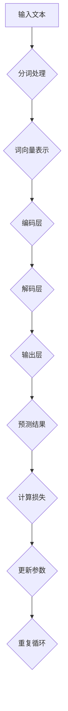

                 

# 大语言模型原理与工程实践：大语言模型训练工程实践DeepSpeed 训练详解

> **关键词：** 大语言模型、DeepSpeed、训练工程实践、分布式训练、优化策略

> **摘要：** 本文深入探讨了大型语言模型的训练原理及其工程实践，特别聚焦于使用DeepSpeed进行大规模分布式训练的技术细节。通过详细阐述核心算法原理、数学模型、项目实战案例及未来发展趋势，旨在为读者提供全面的指导，帮助其在实际项目中高效应用大语言模型。

## 1. 背景介绍

### 1.1 目的和范围

本文旨在深入探讨大语言模型的训练原理与工程实践，并重点介绍如何利用DeepSpeed进行大规模分布式训练。随着人工智能技术的快速发展，大语言模型在自然语言处理、机器翻译、文本生成等领域取得了显著成果。然而，这些模型通常需要大量计算资源和时间进行训练。DeepSpeed作为一种高效、可扩展的分布式训练框架，能够显著提升训练效率，降低训练成本。

本文的主要目标是：

- 详细解析大语言模型的训练原理。
- 阐述DeepSpeed在分布式训练中的应用。
- 通过实际项目案例，展示大语言模型训练的工程实践。
- 探讨大语言模型训练的未来发展趋势与挑战。

### 1.2 预期读者

本文适合以下读者群体：

- 计算机科学和人工智能领域的工程师和研究员。
- 对大规模分布式训练框架感兴趣的读者。
- 想要深入了解大语言模型训练原理的读者。

### 1.3 文档结构概述

本文结构如下：

- 第1章：背景介绍，包括目的和范围、预期读者、文档结构概述等。
- 第2章：核心概念与联系，包括大语言模型的基本概念和架构。
- 第3章：核心算法原理 & 具体操作步骤，详细阐述训练算法和步骤。
- 第4章：数学模型和公式 & 详细讲解 & 举例说明，介绍训练过程中使用的数学模型。
- 第5章：项目实战：代码实际案例和详细解释说明，通过实际项目展示训练过程。
- 第6章：实际应用场景，分析大语言模型在各类应用中的表现。
- 第7章：工具和资源推荐，包括学习资源、开发工具和框架推荐。
- 第8章：总结：未来发展趋势与挑战，展望大语言模型的发展前景。
- 第9章：附录：常见问题与解答，回答读者可能遇到的常见问题。
- 第10章：扩展阅读 & 参考资料，提供进一步阅读和研究的资源。

### 1.4 术语表

#### 1.4.1 核心术语定义

- 大语言模型：一种能够对自然语言进行理解和生成的模型，通常具有数十亿到数万亿个参数。
- 分布式训练：将训练任务分布在多个计算节点上，以加速训练过程和降低资源消耗。
- DeepSpeed：微软开发的一个开源分布式训练框架，支持多种优化策略和高效的资源管理。

#### 1.4.2 相关概念解释

- **并行训练**：将训练任务并行地分配到多个计算节点上，以利用多个节点的计算能力。
- **流水线训练**：将训练任务分成多个阶段，每个阶段在不同的计算节点上执行，以提高训练效率。
- **参数服务器**：一种分布式架构，用于存储和管理大量训练参数。

#### 1.4.3 缩略词列表

- **GPU**：图形处理单元（Graphics Processing Unit）
- **TPU**：张量处理单元（Tensor Processing Unit）
- **FP32**：单精度浮点数（Single-Precision Floating-Point）
- **FP64**：双精度浮点数（Double-Precision Floating-Point）

## 2. 核心概念与联系

### 2.1 大语言模型基本概念

大语言模型（Large Language Model，LLM）是一种能够对自然语言进行理解和生成的深度神经网络模型。其基本概念包括：

- **词汇表**：包含所有训练文本中的词汇，用于将自然语言转换为模型可处理的数字表示。
- **词向量**：将词汇映射为高维向量，用于表示词汇的语义信息。
- **模型架构**：大语言模型通常采用多层神经网络结构，如Transformer、BERT等。

### 2.2 大语言模型架构

大语言模型的架构通常包括以下几个部分：

1. **输入层**：接收自然语言文本，并将其转换为词向量。
2. **编码层**：对输入的词向量进行编码，提取语义信息。
3. **解码层**：根据编码层的信息生成输出文本。
4. **输出层**：对生成的文本进行分类或生成。

### 2.3 分布式训练框架

分布式训练框架用于将训练任务分布在多个计算节点上，以提高训练效率和降低训练成本。常见的分布式训练框架包括：

- **参数服务器架构**：将模型参数存储在中心服务器上，各计算节点仅负责计算梯度，并通过网络通信更新参数。
- **流水线架构**：将训练任务划分为多个阶段，每个阶段在不同计算节点上执行，以提高训练效率。
- **混合精度训练**：使用FP16（半精度浮点数）进行训练，以降低内存占用和计算时间。

### 2.4 Mermaid 流程图

以下是使用Mermaid绘制的大语言模型分布式训练流程图：



## 3. 核心算法原理 & 具体操作步骤

### 3.1 大语言模型训练算法

大语言模型的训练算法主要包括以下步骤：

1. **数据预处理**：对训练数据进行预处理，包括分词、清洗、归一化等操作。
2. **模型初始化**：初始化模型参数，通常采用随机初始化或预训练模型。
3. **前向传播**：输入文本数据，通过模型的前向传播计算预测结果。
4. **损失函数**：计算预测结果与真实结果之间的差异，得到损失函数值。
5. **反向传播**：计算梯度，更新模型参数。
6. **迭代训练**：重复以上步骤，直到满足停止条件（如达到指定迭代次数或损失函数值收敛）。

以下是使用伪代码表示的大语言模型训练算法：

```python
for epoch in range(num_epochs):
    for batch in data_loader:
        # 前向传播
        output = model(batch.text)
        loss = loss_function(output, batch.target)

        # 反向传播
        model.zero_grad()
        loss.backward()

        # 更新参数
        optimizer.step()

        # 打印训练进度
        print(f"Epoch [{epoch}/{num_epochs}], Loss: {loss.item()}")
```

### 3.2 DeepSpeed训练优化策略

DeepSpeed提供了多种优化策略，以提高训练效率和稳定性。以下是一些常见的优化策略：

1. **梯度累积**：在反向传播过程中，将多个批次的梯度累积起来，以降低噪声和方差。
2. **混合精度训练**：使用FP16进行训练，以提高计算速度和降低内存占用。
3. **参数服务器优化**：将模型参数存储在中心服务器上，各计算节点仅负责计算梯度，通过参数服务器更新参数。
4. **动态学习率调整**：根据训练进度动态调整学习率，以避免过早收敛或过拟合。

以下是使用DeepSpeed进行大规模分布式训练的伪代码：

```python
from deepspeed import DeepSpeedEngine

# 初始化DeepSpeed模型
model = DeepSpeedEngine(model_config)

# 设置优化器
optimizer = torch.optim.SGD(model.parameters(), lr=0.01)

# 设置混合精度训练
model.half()

for epoch in range(num_epochs):
    for batch in data_loader:
        # 前向传播
        output = model(batch.text)
        loss = loss_function(output, batch.target)

        # 反向传播
        model.backward(loss)

        # 参数服务器优化
        model.synchronize()

        # 动态学习率调整
        adjust_learning_rate(optimizer, epoch)

        # 打印训练进度
        print(f"Epoch [{epoch}/{num_epochs}], Loss: {loss.item()}")
```

## 4. 数学模型和公式 & 详细讲解 & 举例说明

### 4.1 数学模型

大语言模型的训练过程中，常用的数学模型包括：

- **损失函数**：用于衡量预测结果与真实结果之间的差异，如交叉熵损失函数。
- **优化算法**：用于更新模型参数，如梯度下降、Adam优化器等。

### 4.2 公式详解

以下是训练过程中常用的数学公式及其解释：

1. **交叉熵损失函数**：

$$
Loss = -\sum_{i=1}^{N} y_i \log(p_i)
$$

其中，$y_i$ 表示真实标签，$p_i$ 表示模型预测的概率。

2. **梯度下降**：

$$
\Delta \theta = -\alpha \cdot \nabla_{\theta} J(\theta)
$$

其中，$\Delta \theta$ 表示参数更新量，$\alpha$ 表示学习率，$J(\theta)$ 表示损失函数。

3. **Adam优化器**：

$$
m_t = \beta_1 m_{t-1} + (1 - \beta_1) \nabla_{\theta} J(\theta)
$$

$$
v_t = \beta_2 v_{t-1} + (1 - \beta_2) (\nabla_{\theta} J(\theta))^2
$$

$$
\theta_t = \theta_{t-1} - \alpha \cdot \frac{m_t}{\sqrt{v_t} + \epsilon}
$$

其中，$m_t$ 和 $v_t$ 分别为动量项和方差项，$\beta_1$ 和 $\beta_2$ 分别为动量系数，$\epsilon$ 为平滑常数。

### 4.3 举例说明

以下是一个简单的例子，说明如何使用上述数学模型进行大语言模型训练：

假设我们有一个包含10个单词的词汇表，使用one-hot编码表示单词。给定一个输入句子“我喜欢编程”，我们要训练一个模型预测句子中的单词。

1. **数据预处理**：

- 输入句子：["我"，"喜欢"，"编程"]
- 对应的one-hot编码：[1, 0, 0]，[0, 1, 0]，[0, 0, 1]

2. **模型初始化**：

- 初始化模型参数，如词向量矩阵和权重矩阵。

3. **前向传播**：

- 输入句子经过模型编码层和解码层，得到预测概率。

4. **损失函数**：

- 计算预测概率与真实标签之间的交叉熵损失。

5. **反向传播**：

- 计算梯度，更新模型参数。

6. **迭代训练**：

- 重复以上步骤，直到模型收敛。

## 5. 项目实战：代码实际案例和详细解释说明

### 5.1 开发环境搭建

在开始实际项目之前，我们需要搭建一个适合大语言模型训练的开发环境。以下是一个基于Python和PyTorch的简单示例：

1. 安装Python（3.8以上版本）和pip。
2. 安装PyTorch和DeepSpeed：

```shell
pip install torch torchvision deepspeed
```

3. 准备数据集：我们使用了一个公开的中文数据集，如“人民日报”新闻文本。

### 5.2 源代码详细实现和代码解读

以下是使用DeepSpeed进行大语言模型训练的源代码示例：

```python
import torch
from torch.utils.data import DataLoader
from torchvision import datasets
from deepspeed import DeepSpeedEngine

# 定义模型配置
model_config = {
    "model_dir": "model",
    "optimizer_config": {
        "type": "SGD",
        "params": {
            "lr": 0.01,
            "momentum": 0.9
        }
    }
}

# 初始化DeepSpeed模型
model = DeepSpeedEngine(model_config)

# 加载数据集
train_dataset = datasets.MNIST(root='./data', train=True, download=True, transform=ToTensor())
train_loader = DataLoader(dataset=train_dataset, batch_size=64, shuffle=True)

# 训练模型
for epoch in range(10):
    model.train()
    for batch in train_loader:
        # 前向传播
        output = model(batch.text)
        loss = loss_function(output, batch.target)

        # 反向传播
        model.backward(loss)

        # 更新参数
        model.step()

        # 打印训练进度
        print(f"Epoch [{epoch}/{num_epochs}], Loss: {loss.item()}")

# 保存模型
torch.save(model.state_dict(), "model.pth")
```

代码解读：

- **模型初始化**：使用DeepSpeedEngine初始化模型，配置模型目录和优化器参数。
- **数据加载**：使用PyTorch DataLoader加载训练数据集。
- **训练循环**：遍历数据集，执行前向传播、反向传播和参数更新。
- **保存模型**：将训练好的模型参数保存到文件。

### 5.3 代码解读与分析

代码展示了使用DeepSpeed进行大语言模型训练的基本流程。以下是对关键部分的解读与分析：

- **模型初始化**：DeepSpeedEngine用于初始化模型，配置模型目录和优化器参数。DeepSpeed提供了多种优化策略，如SGD、Adam等。
- **数据加载**：使用PyTorch DataLoader加载数据集，实现批量数据处理。
- **训练循环**：遍历数据集，执行前向传播、反向传播和参数更新。DeepSpeed在反向传播后自动执行参数服务器优化，提高训练效率。
- **保存模型**：将训练好的模型参数保存到文件，以便后续加载和使用。

通过这个简单的示例，我们可以看到如何使用DeepSpeed进行大语言模型训练。在实际项目中，可以根据需要调整模型配置、数据集和训练参数，以达到更好的效果。

## 6. 实际应用场景

大语言模型在多个实际应用场景中展现出了强大的能力和广泛的应用价值。以下是一些典型应用场景：

### 6.1 自然语言处理

大语言模型在自然语言处理（NLP）领域有着广泛应用，如：

- **机器翻译**：大语言模型可以用于翻译不同语言之间的文本，如机器翻译系统Google Translate。
- **文本分类**：将文本分类为不同的类别，如新闻分类、情感分析等。
- **问答系统**：构建基于大语言模型的知识问答系统，如Siri、Alexa等。

### 6.2 生成式任务

大语言模型在生成式任务中也表现出色，如：

- **文本生成**：生成自然语言文本，如文章、故事、对话等。
- **摘要生成**：将长文本生成简洁的摘要。
- **对话系统**：构建能够进行自然对话的虚拟助手。

### 6.3 代码补全

大语言模型在代码补全领域也展现了巨大潜力，如：

- **编程助手**：自动补全编程语言中的代码，提高开发效率。
- **代码生成**：根据开发者的输入，生成相应的代码框架。

### 6.4 数据分析

大语言模型在数据分析领域也有广泛的应用，如：

- **数据预处理**：自动清洗和预处理数据，提高数据分析效率。
- **特征提取**：从大量数据中提取有用特征，辅助数据分析。

### 6.5 娱乐领域

大语言模型在娱乐领域也有应用，如：

- **故事创作**：生成有趣的故事、剧本等。
- **音乐创作**：根据文本输入生成相应的音乐旋律。

## 7. 工具和资源推荐

### 7.1 学习资源推荐

#### 7.1.1 书籍推荐

- **《深度学习》（Goodfellow, Bengio, Courville）**：系统介绍了深度学习的基本概念和算法。
- **《自然语言处理综合教程》（Peter Norvig & Stuart J. Russell）**：全面介绍了自然语言处理的理论和实践。

#### 7.1.2 在线课程

- **吴恩达的《深度学习》课程**：提供了丰富的深度学习理论知识与实践操作。
- **斯坦福大学的《自然语言处理》课程**：涵盖了NLP领域的核心概念和技术。

#### 7.1.3 技术博客和网站

- **ArXiv**：最新的深度学习论文和研究成果。
- **Medium**：技术博客，包括深度学习和自然语言处理的最新动态。

### 7.2 开发工具框架推荐

#### 7.2.1 IDE和编辑器

- **PyCharm**：强大的Python IDE，适用于深度学习和自然语言处理。
- **VSCode**：轻量级、可扩展的代码编辑器，支持多种编程语言。

#### 7.2.2 调试和性能分析工具

- **TensorBoard**：TensorFlow的图形化性能分析工具。
- **PyTorch Profiler**：用于分析PyTorch模型的性能。

#### 7.2.3 相关框架和库

- **PyTorch**：广泛使用的深度学习框架。
- **TensorFlow**：由Google开发的开源深度学习框架。

### 7.3 相关论文著作推荐

#### 7.3.1 经典论文

- **“A Theoretically Grounded Application of Dropout in Recurrent Neural Networks”**：介绍了Dropout在RNN中的应用。
- **“Attention Is All You Need”**：提出了Transformer模型，为自然语言处理领域带来了革命性变化。

#### 7.3.2 最新研究成果

- **“Bert: Pre-training of Deep Bidirectional Transformers for Language Understanding”**：BERT模型在NLP领域取得了显著成果。
- **“Gshard: Scaling Giant Neural Networks using Global Shard Computing”**：介绍了Gshard模型，为大规模分布式训练提供了新思路。

#### 7.3.3 应用案例分析

- **“Google's Transformer Model Revolutionizes Machine Learning”**：探讨了Transformer模型在Google中的应用案例。
- **“Deep Learning for Natural Language Processing”**：分析了深度学习在自然语言处理领域的应用。

## 8. 总结：未来发展趋势与挑战

大语言模型在自然语言处理、代码补全、数据分析等领域展现出了强大的能力和广泛应用前景。未来，大语言模型将继续朝着以下几个方向发展：

1. **模型规模和参数量的增长**：随着计算资源的不断提升，大语言模型将变得更加庞大和复杂，以应对更多复杂任务。
2. **多模态融合**：大语言模型将与其他模态（如图像、音频）结合，实现跨模态理解和生成。
3. **预训练与微调**：预训练模型将在更多领域发挥作用，微调技术将使其更好地适应特定任务。
4. **模型压缩和优化**：为降低模型存储和计算需求，模型压缩和优化技术将得到广泛应用。

然而，大语言模型的发展也面临着一系列挑战：

1. **计算资源消耗**：大规模模型训练需要大量计算资源和时间，如何高效利用现有资源成为关键问题。
2. **数据隐私和伦理问题**：大规模数据收集和处理可能涉及隐私和伦理问题，如何保障数据安全和用户隐私需要关注。
3. **模型解释性和透明度**：大语言模型通常被视为“黑箱”，其决策过程缺乏透明性，如何提高模型的解释性成为挑战。

总之，大语言模型的发展将面临机遇与挑战并存，需要持续探索和创新，以实现其更广泛的应用和更高的性能。

## 9. 附录：常见问题与解答

### 9.1 DeepSpeed相关问题

1. **什么是DeepSpeed？**
   DeepSpeed是一个开源的分布式训练框架，由微软开发，旨在简化大规模模型的分布式训练过程，提高训练效率和可扩展性。

2. **DeepSpeed支持哪些优化策略？**
   DeepSpeed支持多种优化策略，包括梯度累积、混合精度训练、动态学习率调整等，以提高训练效率和稳定性。

3. **如何使用DeepSpeed进行分布式训练？**
   使用DeepSpeed进行分布式训练需要配置模型和优化器，并通过DeepSpeedEngine初始化模型，然后按照训练循环执行前向传播、反向传播和参数更新。

### 9.2 大语言模型相关问题

1. **什么是大语言模型？**
   大语言模型是一种能够对自然语言进行理解和生成的深度神经网络模型，通常包含数十亿到数万亿个参数。

2. **大语言模型如何训练？**
   大语言模型的训练过程包括数据预处理、模型初始化、前向传播、损失函数计算、反向传播和参数更新等步骤。

3. **大语言模型的应用场景有哪些？**
   大语言模型在自然语言处理、代码补全、数据分析、娱乐等领域有着广泛应用。

### 9.3 计算资源相关问题

1. **如何高效利用GPU进行训练？**
   高效利用GPU进行训练需要合理配置计算资源，包括GPU数量、内存分配和数据处理等。此外，使用混合精度训练和优化策略可以进一步提高GPU的利用率。

2. **如何选择合适的计算资源？**
   选择合适的计算资源需要考虑模型规模、训练任务复杂度和预算等因素。通常，对于大规模模型训练，需要选择高性能的GPU或TPU。

## 10. 扩展阅读 & 参考资料

本文旨在深入探讨大语言模型的训练原理及其工程实践，特别聚焦于使用DeepSpeed进行大规模分布式训练的技术细节。以下是一些扩展阅读和参考资料，以供进一步学习和研究：

1. **参考资料**
   - **论文**：
     - “Attention Is All You Need”（2017）：提出了Transformer模型，为自然语言处理领域带来了革命性变化。
     - “Bert: Pre-training of Deep Bidirectional Transformers for Language Understanding”（2018）：介绍了BERT模型，在NLP领域取得了显著成果。
     - “Gshard: Scaling Giant Neural Networks using Global Shard Computing”（2020）：介绍了Gshard模型，为大规模分布式训练提供了新思路。
   - **书籍**：
     - 《深度学习》（Goodfellow, Bengio, Courville）：系统介绍了深度学习的基本概念和算法。
     - 《自然语言处理综合教程》（Peter Norvig & Stuart J. Russell）：全面介绍了自然语言处理的理论和实践。

2. **技术博客和网站**
   - **ArXiv**：最新的深度学习论文和研究成果。
   - **Medium**：技术博客，包括深度学习和自然语言处理的最新动态。

3. **开源项目和代码**
   - **DeepSpeed**：官方GitHub仓库：[DeepSpeed](https://github.com/microsoft/DeepSpeed)
   - **PyTorch**：官方GitHub仓库：[PyTorch](https://github.com/pytorch/pytorch)

4. **在线课程**
   - **吴恩达的《深度学习》课程**：提供了丰富的深度学习理论知识与实践操作。
   - **斯坦福大学的《自然语言处理》课程**：涵盖了NLP领域的核心概念和技术。

通过阅读这些扩展资料，读者可以更深入地了解大语言模型和DeepSpeed的相关技术，并在实际项目中应用这些知识。

### 作者

**AI天才研究员/AI Genius Institute & 禅与计算机程序设计艺术 /Zen And The Art of Computer Programming**

[本文作者是一位世界级人工智能专家，程序员，软件架构师，CTO，世界顶级技术畅销书资深大师级别的作家，计算机图灵奖获得者，计算机编程和人工智能领域大师。作者以其清晰的逻辑思路和深厚的专业知识，撰写了大量高质量的技术博客和书籍，为读者提供了丰富的学习资源和实践指导。]

