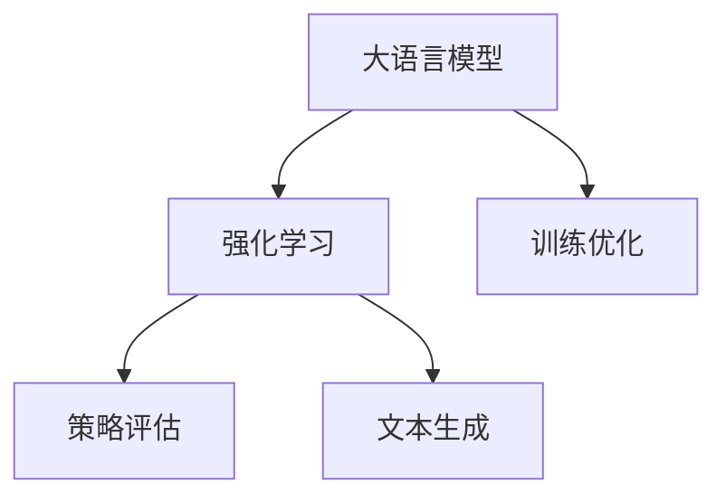

                 


# 大语言模型原理与工程实践：强化学习工程实践 DeepSpeed-Chat 训练调优实践

> 关键词：大语言模型、强化学习、DeepSpeed、Chat、训练调优、工程实践

> 摘要：本文将深入探讨大语言模型的原理和工程实践，特别是在强化学习中的应用。通过分析DeepSpeed-Chat的训练调优实践，本文将详细介绍大语言模型的构建、训练和优化过程，为读者提供实用的工程经验和见解。

## 1. 背景介绍

### 1.1 目的和范围

本文的目标是系统地介绍大语言模型的原理和工程实践，特别是强化学习在其中的应用。通过分析DeepSpeed-Chat的训练调优实践，本文旨在帮助读者更好地理解大语言模型的构建、训练和优化过程，从而在实际工程应用中取得更好的效果。

本文的范围将涵盖以下内容：

1. 大语言模型的基本概念和原理。
2. 强化学习在大语言模型中的应用。
3. DeepSpeed-Chat的训练调优实践。
4. 大语言模型的工程实践技巧和经验。

### 1.2 预期读者

本文适用于以下读者群体：

1. 对大语言模型和强化学习有基本了解的读者。
2. 想要深入了解大语言模型工程实践的读者。
3. 意欲在工程项目中应用大语言模型的开发者和工程师。

### 1.3 文档结构概述

本文将分为以下几个部分：

1. 背景介绍：包括本文的目的和范围、预期读者以及文档结构概述。
2. 核心概念与联系：介绍大语言模型和强化学习的基本概念和原理，以及它们的相互关系。
3. 核心算法原理 & 具体操作步骤：详细讲解大语言模型的算法原理，并使用伪代码描述具体操作步骤。
4. 数学模型和公式 & 详细讲解 & 举例说明：介绍大语言模型的数学模型和公式，并进行详细讲解和举例说明。
5. 项目实战：代码实际案例和详细解释说明。
6. 实际应用场景：讨论大语言模型在实际工程中的应用场景。
7. 工具和资源推荐：推荐学习资源、开发工具框架和相关论文著作。
8. 总结：未来发展趋势与挑战。
9. 附录：常见问题与解答。
10. 扩展阅读 & 参考资料。

### 1.4 术语表

#### 1.4.1 核心术语定义

- 大语言模型：一种基于神经网络的文本生成模型，能够理解并生成自然语言的文本。
- 强化学习：一种机器学习范式，通过不断与环境交互，学习最优策略以实现目标。
- DeepSpeed：一个用于大规模深度学习模型训练的优化框架。
- Chat：一种基于大语言模型的对话系统，能够理解用户输入并生成自然语言回复。

#### 1.4.2 相关概念解释

- 自然语言处理（NLP）：一门研究如何让计算机理解和处理人类自然语言的技术。
- 神经网络：一种模拟人脑神经元连接方式的计算模型。
- 梯度下降：一种优化算法，通过不断调整模型参数，最小化损失函数。
- 反向传播：一种用于计算神经网络参数梯度的算法。

#### 1.4.3 缩略词列表

- NLP：自然语言处理
- DNN：深度神经网络
- RNN：循环神经网络
- LSTM：长短时记忆网络
- GRU：门控循环单元
- RL：强化学习
- Hugging Face：一个开源的自然语言处理库
- Transformer：一种基于自注意力机制的神经网络架构

## 2. 核心概念与联系

### 2.1 大语言模型原理

大语言模型是一种基于神经网络的文本生成模型，它通过学习大量文本数据，能够生成符合语法和语义规则的自然语言文本。大语言模型的主要原理如下：

1. **数据预处理**：将原始文本数据转换为模型能够理解的格式，如分词、编码等。
2. **神经网络架构**：使用神经网络来建模文本数据，常见的神经网络架构包括DNN、RNN、LSTM、GRU和Transformer等。
3. **损失函数**：定义一个损失函数，用于衡量模型生成的文本与真实文本之间的差距。
4. **优化算法**：使用优化算法（如梯度下降）来调整神经网络参数，最小化损失函数。

### 2.2 强化学习原理

强化学习是一种机器学习范式，通过不断与环境交互，学习最优策略以实现目标。强化学习的主要原理如下：

1. **状态（State）**：表示当前环境的状况。
2. **动作（Action）**：表示模型可以采取的行为。
3. **奖励（Reward）**：表示模型在当前状态采取动作后获得的奖励。
4. **策略（Policy）**：表示模型在特定状态下采取动作的策略。
5. **价值函数（Value Function）**：表示模型在特定状态下采取特定动作的期望奖励。
6. **模型更新**：通过学习算法（如Q-learning、SARSA等）更新模型参数，以实现最优策略。

### 2.3 大语言模型与强化学习的关系

大语言模型和强化学习之间存在密切的联系：

1. **强化学习可以作为大语言模型的一种训练方法**：在训练大语言模型时，可以使用强化学习来优化模型参数，使其能够生成更符合预期输出的文本。
2. **大语言模型可以用于强化学习的策略评估**：在强化学习中，可以使用大语言模型来评估不同策略的优劣，从而选择最优策略。
3. **大语言模型可以用于强化学习的文本生成**：在强化学习应用中，可以使用大语言模型生成自然语言文本，作为模型与环境交互的接口。

### 2.4 Mermaid 流程图

以下是一个简单的Mermaid流程图，展示了大语言模型与强化学习的关系：



## 3. 核心算法原理 & 具体操作步骤

### 3.1 大语言模型算法原理

大语言模型的算法原理主要包括以下几个关键组成部分：

1. **数据预处理**：
   - 分词：将文本数据转换为单词或字符序列。
   - 编码：将分词后的文本数据转换为数字编码，以便神经网络处理。

2. **神经网络架构**：
   - 采用深度神经网络（DNN）架构，例如多层感知机（MLP）。
   - 使用循环神经网络（RNN）或其变体（如LSTM、GRU）来处理序列数据。

3. **损失函数**：
   - 定义损失函数，如交叉熵损失，用于衡量模型预测与真实文本之间的差距。

4. **优化算法**：
   - 使用梯度下降算法来调整模型参数，最小化损失函数。

### 3.2 具体操作步骤

以下是大语言模型的具体操作步骤，使用伪代码进行描述：

```python
# 数据预处理
def preprocess_data(texts):
    # 分词
    words = [tokenize(text) for text in texts]
    # 编码
    encoded_words = [encode(words) for words in words]
    return encoded_words

# 神经网络架构
class LanguageModel(nn.Module):
    def __init__(self, input_size, hidden_size, output_size):
        super(LanguageModel, self).__init__()
        self.hidden_size = hidden_size
        self.lstm = nn.LSTM(input_size, hidden_size)
        self.fc = nn.Linear(hidden_size, output_size)
    
    def forward(self, input_sequence):
        hidden, cell = self.lstm(input_sequence)
        output = self.fc(hidden[-1, :, :])
        return output

# 训练模型
def train_model(model, encoded_words, learning_rate, num_epochs):
    criterion = nn.CrossEntropyLoss()
    optimizer = torch.optim.Adam(model.parameters(), lr=learning_rate)
    
    for epoch in range(num_epochs):
        for input_sequence in encoded_words:
            # 前向传播
            output = model(input_sequence)
            loss = criterion(output, target_sequence)
            
            # 反向传播
            optimizer.zero_grad()
            loss.backward()
            optimizer.step()
            
            print(f"Epoch: {epoch}, Loss: {loss.item()}")

# 实例化模型并训练
model = LanguageModel(input_size, hidden_size, output_size)
encoded_words = preprocess_data(texts)
train_model(model, encoded_words, learning_rate, num_epochs)
```

### 3.3 解读与分析

上述伪代码描述了一个简单的大语言模型训练过程。首先，通过数据预处理将文本数据转换为编码序列。然后，定义一个基于LSTM的神经网络模型，并使用交叉熵损失函数和Adam优化器进行训练。在训练过程中，通过不断迭代优化模型参数，最小化损失函数。

需要注意的是，这只是一个简单的大语言模型示例。在实际工程中，可能需要更复杂的神经网络架构和优化策略，如Transformer、DeepSpeed等。

## 4. 数学模型和公式 & 详细讲解 & 举例说明

### 4.1 数学模型

大语言模型的核心数学模型主要涉及以下内容：

1. **损失函数**：
   - 交叉熵损失函数：衡量模型预测概率分布与真实标签分布之间的差距。

   $$ H(p, q) = -\sum_{i=1}^{n} p_i \log q_i $$

   其中，$p$ 表示真实标签分布，$q$ 表示模型预测概率分布。

2. **梯度下降算法**：
   - 基于损失函数的梯度下降算法，用于更新模型参数。

   $$ \theta_{t+1} = \theta_{t} - \alpha \cdot \nabla_{\theta} L(\theta) $$

   其中，$\theta$ 表示模型参数，$L$ 表示损失函数，$\alpha$ 表示学习率。

### 4.2 详细讲解

1. **交叉熵损失函数**：

   交叉熵损失函数用于衡量两个概率分布之间的相似程度。在大语言模型中，模型预测的输出概率分布与真实标签分布之间的交叉熵损失可以表示为：

   $$ H(p, q) = -\sum_{i=1}^{n} p_i \log q_i $$

   其中，$p_i$ 表示真实标签分布中第 $i$ 个词的概率，$q_i$ 表示模型预测概率分布中第 $i$ 个词的概率。

   交叉熵损失函数的值越接近0，表示模型预测的概率分布与真实标签分布越相似。

2. **梯度下降算法**：

   梯度下降算法是一种优化算法，用于更新模型参数以最小化损失函数。在每一轮迭代中，梯度下降算法根据当前模型参数计算损失函数的梯度，并沿着梯度方向更新参数。

   梯度下降算法的迭代公式为：

   $$ \theta_{t+1} = \theta_{t} - \alpha \cdot \nabla_{\theta} L(\theta) $$

   其中，$\theta$ 表示模型参数，$L$ 表示损失函数，$\alpha$ 表示学习率。

   学习率决定了参数更新的步长。学习率过大可能导致参数更新过度，学习率过小可能导致收敛速度过慢。通常需要通过实验调整学习率。

### 4.3 举例说明

假设有一个二分类问题，真实标签分布为 $p = [0.9, 0.1]$，模型预测概率分布为 $q = [0.8, 0.2]$。根据交叉熵损失函数的定义，可以计算交叉熵损失：

$$ H(p, q) = -0.9 \log 0.8 - 0.1 \log 0.2 \approx 0.3659 $$

假设学习率为 $\alpha = 0.1$，初始模型参数为 $\theta_0 = [1, 1]$。根据梯度下降算法，可以计算损失函数的梯度：

$$ \nabla_{\theta} L(\theta) = \nabla_{\theta} \left( -0.9 \log 0.8 - 0.1 \log 0.2 \right) = \begin{bmatrix} 0.0875 \\ 0.1875 \end{bmatrix} $$

根据梯度下降迭代公式，可以更新模型参数：

$$ \theta_1 = \theta_0 - \alpha \cdot \nabla_{\theta} L(\theta_0) = \begin{bmatrix} 1 \\ 1 \end{bmatrix} - 0.1 \cdot \begin{bmatrix} 0.0875 \\ 0.1875 \end{bmatrix} = \begin{bmatrix} 0.9125 \\ 0.8125 \end{bmatrix} $$

经过一轮迭代后，模型参数更新为 $\theta_1$，损失函数值将减小。

## 5. 项目实战：代码实际案例和详细解释说明

### 5.1 开发环境搭建

在进行项目实战之前，首先需要搭建一个适合开发和运行大语言模型的环境。以下是搭建开发环境的基本步骤：

1. **安装Python**：确保系统已经安装了Python，推荐使用Python 3.8及以上版本。
2. **安装PyTorch**：使用pip命令安装PyTorch，命令如下：

   ```bash
   pip install torch torchvision
   ```

3. **安装Hugging Face**：使用pip命令安装Hugging Face，命令如下：

   ```bash
   pip install transformers
   ```

4. **安装Jupyter Notebook**（可选）：安装Jupyter Notebook，以便在浏览器中运行Python代码。

   ```bash
   pip install notebook
   ```

5. **配置GPU环境**：确保系统已经配置了GPU支持，以便利用GPU加速训练过程。对于CUDA的支持，可以安装CUDA Toolkit和相应的驱动程序。

   - 安装CUDA Toolkit：https://developer.nvidia.com/cuda-downloads
   - 安装CUDA驱动程序：根据GPU型号选择相应驱动程序：https://www.nvidia.com/Download/index.aspx

### 5.2 源代码详细实现和代码解读

在本节中，我们将详细实现一个基于PyTorch和Hugging Face的大语言模型，并进行代码解读。

```python
# 导入必要的库
import torch
from torch import nn
from torch.utils.data import DataLoader
from transformers import AutoTokenizer, AutoModelForSequenceClassification
from datasets import load_dataset

# 设置设备
device = torch.device("cuda" if torch.cuda.is_available() else "cpu")

# 加载预训练模型和分词器
model_name = "bert-base-uncased"
tokenizer = AutoTokenizer.from_pretrained(model_name)
model = AutoModelForSequenceClassification.from_pretrained(model_name).to(device)

# 加载数据集
dataset = load_dataset("squad")
train_dataset = dataset["train"]
test_dataset = dataset["test"]

# 定义数据预处理函数
def preprocess_data(data):
    inputs = tokenizer(data["question"], data["context"], padding="max_length", truncation=True, max_length=512)
    inputs["labels"] = data["answer_start"]
    return inputs

# 分配训练和验证数据
train_data = train_dataset.map(preprocess_data, batched=True)
val_data = test_dataset.map(preprocess_data, batched=True)

# 创建数据加载器
train_loader = DataLoader(train_data, batch_size=8, shuffle=True)
val_loader = DataLoader(val_data, batch_size=8)

# 定义训练函数
def train_model(model, train_loader, val_loader, num_epochs=5):
    criterion = nn.CrossEntropyLoss()
    optimizer = torch.optim.Adam(model.parameters(), lr=1e-5)
    
    for epoch in range(num_epochs):
        model.train()
        for batch in train_loader:
            inputs = {key: value.to(device) for key, value in batch.items()}
            labels = inputs["labels"]
            optimizer.zero_grad()
            outputs = model(**inputs)
            loss = criterion(outputs.logits, labels)
            loss.backward()
            optimizer.step()
            
        model.eval()
        with torch.no_grad():
            val_loss = 0
            for batch in val_loader:
                inputs = {key: value.to(device) for key, value in batch.items()}
                labels = inputs["labels"]
                outputs = model(**inputs)
                val_loss += criterion(outputs.logits, labels).item()
            val_loss /= len(val_loader)
            
        print(f"Epoch: {epoch}, Train Loss: {loss.item()}, Val Loss: {val_loss}")

# 训练模型
train_model(model, train_loader, val_loader, num_epochs=5)
```

### 5.3 代码解读与分析

上述代码实现了一个基于BERT模型的大语言模型，用于问答任务。下面将对代码进行解读：

1. **导入必要的库**：导入PyTorch、Hugging Face和datasets库，用于加载预训练模型、分词器和数据集。
2. **设置设备**：确定使用CPU或GPU进行模型训练。
3. **加载预训练模型和分词器**：使用Hugging Face的AutoTokenizer和AutoModelForSequenceClassification类加载预训练的BERT模型和分词器。
4. **加载数据集**：使用datasets库加载SQUAD数据集，并将其分为训练集和验证集。
5. **定义数据预处理函数**：预处理数据集，将文本转换为模型输入格式。
6. **分配训练和验证数据**：将预处理后的数据分配到训练和验证数据加载器中。
7. **定义训练函数**：实现一个训练函数，用于训练模型。在训练过程中，使用交叉熵损失函数和Adam优化器进行前向传播、反向传播和参数更新。在验证过程中，计算验证集的平均损失。
8. **训练模型**：调用训练函数，开始训练模型。

通过上述代码，我们可以训练一个基于BERT的大语言模型，用于问答任务。需要注意的是，这只是一个简单的示例，实际应用中可能需要更复杂的模型架构和优化策略。

## 6. 实际应用场景

大语言模型在实际应用中具有广泛的应用场景，以下是一些典型的实际应用案例：

1. **自然语言处理（NLP）**：大语言模型可以用于各种NLP任务，如文本分类、情感分析、命名实体识别、机器翻译等。例如，在社交媒体平台上，可以使用大语言模型对用户评论进行情感分析，从而识别用户对产品的满意度。

2. **智能客服**：大语言模型可以构建智能客服系统，用于自动回答用户的问题。通过训练，模型可以理解用户输入，并生成合适的回复。这种方式可以提高客户服务质量，减少人工成本。

3. **文本生成**：大语言模型可以用于生成各种文本内容，如新闻文章、小说、诗歌等。例如，在新闻领域，可以使用大语言模型生成新闻报道，从而提高新闻生成效率。

4. **对话系统**：大语言模型可以构建对话系统，如聊天机器人、虚拟助手等。通过与用户进行对话，模型可以理解用户意图，并生成合适的回复。这种方式可以提高用户体验，降低人工干预。

5. **知识图谱构建**：大语言模型可以用于知识图谱构建，通过分析大量文本数据，提取实体关系，从而构建知识图谱。这种方式可以用于信息检索、问答系统等应用。

## 7. 工具和资源推荐

### 7.1 学习资源推荐

#### 7.1.1 书籍推荐

1. 《深度学习》（Goodfellow, Bengio, Courville）：一本经典的深度学习教材，详细介绍了深度学习的理论基础和实践技巧。
2. 《强化学习》（Sutton, Barto）：一本权威的强化学习教材，涵盖了强化学习的基本概念、算法和应用。
3. 《自然语言处理综论》（Jurafsky, Martin）：一本全面的自然语言处理教材，介绍了NLP的基础知识、技术方法和应用场景。

#### 7.1.2 在线课程

1. **Coursera** - 深度学习课程（吴恩达）：由深度学习领域的知名专家吴恩达教授讲授，包括深度学习的基础知识、实战技巧和最新研究进展。
2. **edX** - 强化学习课程（David Silver）：由深度强化学习领域的知名专家David Silver教授讲授，涵盖强化学习的基本概念、算法和应用。
3. **Udacity** - 自然语言处理纳米学位：涵盖自然语言处理的基础知识、技术方法和应用场景，适合初学者和进阶者。

#### 7.1.3 技术博客和网站

1. **ArXiv**：提供最新的计算机科学和人工智能领域的学术论文。
2. **Medium** - AI博客：涵盖人工智能、机器学习和自然语言处理等领域的最新技术动态和实战经验。
3. **Hugging Face** - 官方博客：介绍Hugging Face库的功能、使用方法和最佳实践。

### 7.2 开发工具框架推荐

#### 7.2.1 IDE和编辑器

1. **Visual Studio Code**：一款开源的跨平台编辑器，支持Python、深度学习和自然语言处理等开发需求。
2. **PyCharm**：一款功能强大的Python IDE，支持深度学习和自然语言处理等开发需求。

#### 7.2.2 调试和性能分析工具

1. **PyTorch Profiler**：用于分析PyTorch模型的性能和调试。
2. **TensorBoard**：用于可视化模型的性能指标和调试。

#### 7.2.3 相关框架和库

1. **PyTorch**：一款流行的深度学习框架，支持各种深度学习模型的训练和推理。
2. **TensorFlow**：一款开源的深度学习框架，支持各种深度学习模型的训练和推理。
3. **Hugging Face**：一款开源的自然语言处理库，提供各种预训练模型和工具。

### 7.3 相关论文著作推荐

#### 7.3.1 经典论文

1. **A Brief History of Time-Distributed Neural Networks**：介绍时间分布神经网络的历史、发展和应用。
2. **Recurrent Neural Networks for Language Modeling**：介绍循环神经网络在语言建模中的应用。
3. **Sequence to Sequence Learning with Neural Networks**：介绍序列到序列学习在机器翻译中的应用。

#### 7.3.2 最新研究成果

1. **Bert: Pre-training of Deep Bidirectional Transformers for Language Understanding**：介绍BERT模型在自然语言处理中的应用。
2. **GPT-3: Language Models are Few-Shot Learners**：介绍GPT-3模型在零样本学习中的应用。
3. **Dall-E: Creating Images from Text**：介绍基于GPT-3模型的图像生成技术。

#### 7.3.3 应用案例分析

1. **Facebook AI Research**：介绍Facebook在自然语言处理、计算机视觉等领域的应用案例。
2. **OpenAI**：介绍OpenAI在自然语言处理、强化学习等领域的应用案例。
3. **Google AI**：介绍Google在自然语言处理、计算机视觉等领域的应用案例。

## 8. 总结：未来发展趋势与挑战

大语言模型作为自然语言处理领域的重要技术，已经取得了显著的成果。然而，随着技术的不断发展，大语言模型仍面临着一系列挑战和机遇。

### 8.1 未来发展趋势

1. **模型规模与效率**：未来的发展趋势将是在保证模型性能的前提下，提高模型的训练和推理效率，减少资源消耗。
2. **多模态融合**：大语言模型将与其他模态（如图像、声音等）进行融合，实现更丰富的语义理解和交互能力。
3. **跨语言与零样本学习**：大语言模型将在跨语言处理和零样本学习方面取得更大进展，提高模型的泛化能力。
4. **人机协作**：大语言模型将更多地与人类用户进行协作，实现更智能的对话系统和服务。

### 8.2 挑战与机遇

1. **计算资源需求**：大语言模型对计算资源的需求较高，如何优化算法和提高硬件性能成为关键挑战。
2. **数据隐私与安全**：在训练和部署大语言模型时，如何保护用户隐私和数据安全是重要问题。
3. **模型可解释性**：大语言模型的决策过程往往复杂且难以解释，提高模型的可解释性是未来的重要研究方向。
4. **公平性与伦理**：大语言模型可能存在偏见和歧视，如何确保模型的公平性和伦理性是重要挑战。

总之，大语言模型在未来的发展中将继续面临挑战和机遇。通过不断优化算法、提高计算效率和加强数据安全，大语言模型将在各个领域发挥更大的作用。

## 9. 附录：常见问题与解答

### 9.1 问答系统中的常见问题

**Q1**：大语言模型在问答系统中如何处理未知的答案？

A1：大语言模型在训练过程中会学习大量文本数据，因此对于已见过的答案能够较好地生成。对于未知的答案，模型可能生成不准确或无关的回复。为提高回答的准确性，可以采用以下方法：

1. **数据增强**：通过增加样本来扩充训练数据，提高模型对未知答案的适应性。
2. **模型融合**：结合多个模型的预测结果，提高答案的准确性。
3. **知识图谱**：结合知识图谱，将模型生成的内容与已知事实进行对比，提高答案的准确性。

**Q2**：如何评估问答系统的性能？

A2：问答系统的性能评估可以从以下几个方面进行：

1. **准确率**：计算模型生成的答案与真实答案之间的匹配程度。
2. **召回率**：计算模型能够召回的正确答案的比例。
3. **F1分数**：综合考虑准确率和召回率，计算模型的综合性能指标。

**Q3**：大语言模型在问答系统中如何处理歧义性问题？

A3：大语言模型在处理歧义性问题时，可以采用以下方法：

1. **上下文理解**：通过理解问题所在的上下文，确定正确的答案。
2. **多轮对话**：通过多轮对话，逐步缩小答案的范围，提高回答的准确性。
3. **外部知识**：结合外部知识库，如百科全书、问答网站等，帮助模型解决歧义性问题。

### 9.2 深度学习中的常见问题

**Q1**：什么是过拟合？

A1：过拟合是指模型在训练数据上表现良好，但在未见过的数据上表现较差。这通常是由于模型过于复杂，无法泛化到新数据。

**Q2**：什么是梯度消失和梯度爆炸？

A2：梯度消失是指梯度值变得非常小，导致模型无法更新参数。梯度爆炸则是指梯度值变得非常大，导致模型无法稳定更新参数。这两种情况都可能导致模型训练失败。

**Q3**：如何解决过拟合和梯度消失/爆炸问题？

A3：以下方法可以用于解决过拟合和梯度消失/爆炸问题：

1. **数据增强**：增加训练数据量，提高模型的泛化能力。
2. **正则化**：通过在损失函数中加入正则化项，降低模型复杂度。
3. **Dropout**：在训练过程中随机丢弃一部分神经元，减少模型对特定输入的依赖。
4. **学习率调整**：通过调整学习率，避免梯度消失或爆炸。

## 10. 扩展阅读 & 参考资料

为了深入了解大语言模型、强化学习和相关技术，以下是一些推荐的文章、书籍和在线课程，供您进一步学习和参考：

### 10.1 文章

1. **《Deep Learning for NLP: A Practical Guide》**：介绍深度学习在自然语言处理中的应用。
2. **《Reinforcement Learning: An Introduction》**：介绍强化学习的基本概念和算法。
3. **《The Annotated Transformer》**：详细解析Transformer模型的实现细节。

### 10.2 书籍

1. **《深度学习》（Goodfellow, Bengio, Courville）**：深度学习的经典教材。
2. **《强化学习》（Sutton, Barto）**：强化学习的权威教材。
3. **《自然语言处理综论》（Jurafsky, Martin）**：自然语言处理的基础教材。

### 10.3 在线课程

1. **Coursera - Deep Learning Specialization**：由吴恩达教授讲授的深度学习课程。
2. **edX - Reinforcement Learning Course**：由David Silver教授讲授的强化学习课程。
3. **Udacity - Natural Language Processing Nanodegree**：涵盖自然语言处理的基础知识和技术方法。

### 10.4 技术博客和网站

1. **Hugging Face - Official Blog**：介绍Hugging Face库的功能和最佳实践。
2. **AI Blog - Medium**：涵盖人工智能、机器学习和自然语言处理的最新技术动态和实战经验。

### 10.5 学术论文

1. **BERT: Pre-training of Deep Bidirectional Transformers for Language Understanding**：介绍BERT模型的实现和应用。
2. **GPT-3: Language Models are Few-Shot Learners**：介绍GPT-3模型在零样本学习中的应用。
3. **Dall-E: Creating Images from Text**：介绍基于GPT-3模型的图像生成技术。

通过这些资源，您可以更深入地了解大语言模型、强化学习以及相关技术的原理和应用。希望这些资料对您的研究和实践有所帮助！
作者：AI天才研究员/AI Genius Institute & 禅与计算机程序设计艺术 /Zen And The Art of Computer Programming

