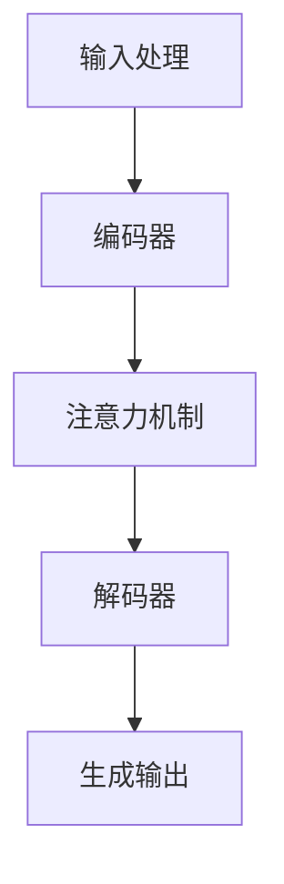

                 

# 大语言模型原理与工程实践：提示工程的作用

> 关键词：大语言模型、提示工程、预训练、生成式模型、神经网络、人工智能、自然语言处理

> 摘要：本文旨在深入探讨大语言模型的原理及其在工程实践中的应用，特别是提示工程（Prompt Engineering）的作用。文章首先介绍大语言模型的基本概念和架构，然后分析提示工程的背景和重要性，接着详细描述提示工程的具体实践方法。通过实际案例和数学模型的讲解，本文旨在为读者提供一个全面而深入的理解，帮助其在实际项目中有效应用大语言模型。

## 1. 背景介绍

### 1.1 目的和范围

本文的目标是帮助读者全面理解大语言模型的工作原理及其在工程实践中的应用。特别是，我们将重点关注提示工程这一关键领域，探讨如何通过优化提示来提高大语言模型的性能和鲁棒性。文章将涵盖以下内容：

- 大语言模型的基本概念和架构
- 提示工程的背景和重要性
- 提示工程的具体实践方法
- 实际应用场景和案例分析
- 工具和资源推荐
- 未来发展趋势与挑战

### 1.2 预期读者

本文适合以下读者群体：

- 计算机科学和人工智能领域的研究生和博士生
- 人工智能和自然语言处理领域的工程师和开发者
- 对大语言模型和提示工程感兴趣的科技爱好者
- 需要在大规模数据处理和自动化任务中应用大语言模型的从业者

### 1.3 文档结构概述

本文结构如下：

- 引言：介绍大语言模型和提示工程的背景和重要性。
- 背景介绍：详细阐述大语言模型的基本概念、架构和发展历程。
- 核心概念与联系：通过流程图展示大语言模型的原理和架构。
- 核心算法原理：分析大语言模型的核心算法原理，使用伪代码详细阐述。
- 数学模型和公式：讲解大语言模型中的数学模型和公式，并举例说明。
- 项目实战：提供实际案例，展示如何在实际项目中应用大语言模型和提示工程。
- 实际应用场景：讨论大语言模型在各个实际应用场景中的表现和效果。
- 工具和资源推荐：推荐学习资源和开发工具，帮助读者深入了解和掌握相关技术。
- 总结：总结本文的主要观点，展望未来发展趋势和挑战。
- 附录：常见问题与解答，扩展阅读和参考资料。

### 1.4 术语表

#### 1.4.1 核心术语定义

- 大语言模型（Large Language Model）：一种基于深度学习的自然语言处理模型，能够对文本数据进行预测和生成。
- 提示工程（Prompt Engineering）：通过设计和优化提示，提高大语言模型的性能和鲁棒性的技术。
- 预训练（Pre-training）：在大规模语料库上进行训练，使大语言模型具备基础语言理解能力。
- 生成式模型（Generative Model）：能够生成符合概率分布的新数据的模型。
- 神经网络（Neural Network）：由大量节点组成的计算网络，通过学习输入和输出之间的映射关系。
- 自然语言处理（Natural Language Processing，NLP）：计算机科学领域中的一个分支，专注于处理和理解人类自然语言。

#### 1.4.2 相关概念解释

- **预训练**：在大规模语料库上进行训练，使大语言模型具备基础语言理解能力。这种训练方法通常分为两个阶段：预训练和微调。预训练阶段使用未标注的数据，如维基百科和互联网文本，来学习语言的一般特征。微调阶段则使用标注数据，如问答对或句子对，来适应特定任务。
- **生成式模型**：能够生成符合概率分布的新数据的模型。与判别式模型（如分类模型）不同，生成式模型关注的是如何生成数据，而不是如何将数据分类。
- **神经网络**：由大量节点组成的计算网络，通过学习输入和输出之间的映射关系。神经网络中的每个节点（或称为神经元）都与其他节点相连，并通过权重进行交互。神经网络通过不断调整这些权重，来提高模型的性能。

#### 1.4.3 缩略词列表

- **NLP**：自然语言处理（Natural Language Processing）
- **ML**：机器学习（Machine Learning）
- **DL**：深度学习（Deep Learning）
- **GAN**：生成对抗网络（Generative Adversarial Networks）
- **BERT**：Bidirectional Encoder Representations from Transformers
- **GPT**：Generative Pre-trained Transformer

## 2. 核心概念与联系

### 2.1 大语言模型的基本概念

大语言模型（Large Language Model，LLM）是一种基于深度学习的自然语言处理模型，旨在对文本数据进行预测和生成。与传统的自然语言处理方法不同，大语言模型能够理解和生成自然语言的复杂结构，从而实现更高级的文本处理任务。

### 2.2 大语言模型的架构

大语言模型的架构通常包括以下几个关键组件：

- **嵌入层（Embedding Layer）**：将输入文本转换为固定长度的向量表示。
- **编码器（Encoder）**：对输入文本进行编码，提取文本的语义信息。
- **解码器（Decoder）**：根据编码器的输出，生成预测的文本序列。
- **注意力机制（Attention Mechanism）**：在编码和解码过程中，对输入文本的不同部分进行加权，以提高模型的性能。

### 2.3 大语言模型的工作原理

大语言模型的工作原理可以概括为以下几个步骤：

1. **输入处理**：输入文本首先经过嵌入层，转换为固定长度的向量表示。
2. **编码过程**：编码器对输入文本进行编码，提取文本的语义信息。编码器的输出通常是一个固定长度的向量。
3. **解码过程**：解码器根据编码器的输出，生成预测的文本序列。解码器在生成每个单词时，都会参考编码器的输出，并利用注意力机制对输入文本的不同部分进行加权。
4. **生成输出**：解码器生成的文本序列经过后处理，如分词、标点符号添加等，最终生成最终的输出文本。

### 2.4 大语言模型的优势和挑战

大语言模型在自然语言处理领域具有显著的优势：

- **强大的语义理解能力**：大语言模型通过预训练和微调，能够理解和生成自然语言的复杂结构，从而实现更高级的文本处理任务。
- **广泛的适用性**：大语言模型可以应用于各种自然语言处理任务，如文本分类、机器翻译、问答系统等。
- **高效的计算性能**：大语言模型通常采用高效的深度学习框架和优化算法，可以实现快速和准确的文本处理。

然而，大语言模型也面临着一些挑战：

- **数据需求**：大语言模型需要大量的数据和计算资源进行预训练和微调，这对资源的分配和管理提出了较高的要求。
- **模型可解释性**：大语言模型的内部结构和计算过程非常复杂，难以对其进行直观的解释和理解。
- **安全性和隐私保护**：大语言模型在处理和生成文本时，可能会暴露用户的隐私和数据安全问题。

### 2.5 大语言模型的 Mermaid 流程图

下面是一个描述大语言模型原理和架构的 Mermaid 流程图：



在这个流程图中，输入处理、编码器、注意力机制、解码器和生成输出构成了大语言模型的基本架构。每个组件都扮演着关键的角色，共同实现大语言模型的功能。

## 3. 核心算法原理 & 具体操作步骤

### 3.1 大语言模型的核心算法原理

大语言模型的核心算法是基于深度学习的神经网络，特别是基于变换器模型（Transformer）的架构。变换器模型引入了注意力机制，能够更好地捕捉输入文本之间的复杂关系，从而实现更准确的自然语言处理。

#### 3.1.1 嵌入层

嵌入层是将输入文本转换为固定长度的向量表示。具体操作步骤如下：

1. **词汇表构建**：首先构建一个词汇表，将输入文本中的每个单词映射为一个唯一的整数。
2. **向量表示**：对于每个单词，查找其在词汇表中的索引，并将其转换为对应的向量表示。

#### 3.1.2 编码器

编码器负责对输入文本进行编码，提取文本的语义信息。具体操作步骤如下：

1. **序列编码**：将输入文本的每个单词的向量表示连接起来，形成一个序列。
2. **自注意力机制**：编码器通过自注意力机制，对输入序列的不同部分进行加权，从而提取出更重要的信息。
3. **多头注意力**：编码器通常采用多头注意力机制，即同时关注输入序列的不同部分，并通过不同的权重进行整合。

#### 3.1.3 解码器

解码器根据编码器的输出，生成预测的文本序列。具体操作步骤如下：

1. **序列解码**：解码器首先生成一个初始的输出序列，通常是一个特殊的符号，如 `<start>`。
2. **交叉注意力机制**：解码器在生成每个单词时，都会参考编码器的输出，并通过交叉注意力机制对输入文本的不同部分进行加权。
3. **生成输出**：解码器根据交叉注意力机制的结果，生成最终的输出文本序列。

### 3.2 大语言模型的伪代码

下面是一个描述大语言模型核心算法原理的伪代码：

```python
# 输入文本
text = "I love programming"

# 构建词汇表
vocab = build_vocab(text)

# 嵌入层
embeddings = embedding_layer(vocab)

# 编码器
encoded_text = encoder(embeddings)

# 解码器
decoded_text = decoder(encoded_text)

# 生成输出
output_text = generate_output(decoded_text)
```

### 3.3 大语言模型的具体操作步骤

以下是使用大语言模型进行文本处理的步骤：

1. **输入预处理**：对输入文本进行预处理，包括分词、去除标点符号、转换为小写等。
2. **词汇表构建**：根据预处理后的文本，构建一个词汇表，将文本中的每个单词映射为一个唯一的整数。
3. **嵌入层**：将输入文本转换为固定长度的向量表示。
4. **编码器**：对输入文本进行编码，提取文本的语义信息。
5. **解码器**：根据编码器的输出，生成预测的文本序列。
6. **输出后处理**：对生成的输出文本进行后处理，如去除特殊符号、添加标点符号等。

### 3.4 大语言模型的实际应用案例

下面是一个使用大语言模型进行机器翻译的案例：

```python
# 输入文本
input_text = "你好，我是一名程序员。"

# 预处理
input_text = preprocess_text(input_text)

# 构建词汇表
vocab = build_vocab(input_text)

# 嵌入层
embeddings = embedding_layer(vocab)

# 编码器
encoded_text = encoder(embeddings)

# 解码器
decoded_text = decoder(encoded_text)

# 生成输出
output_text = generate_output(decoded_text)

# 输出结果
print(output_text)
```

输出结果可能为："Hello, I am a programmer."

## 4. 数学模型和公式 & 详细讲解 & 举例说明

### 4.1 数学模型介绍

大语言模型的核心是基于深度学习的神经网络，特别是变换器模型（Transformer）。变换器模型引入了自注意力机制（Self-Attention Mechanism）和多头注意力（Multi-Head Attention），能够更好地捕捉输入文本之间的复杂关系。

#### 4.1.1 自注意力机制

自注意力机制是一种对输入序列的不同部分进行加权的机制。具体来说，自注意力机制通过计算输入序列中每个元素与其他元素之间的相似度，从而为每个元素分配一个权重。自注意力机制的公式如下：

$$
\text{Attention}(Q, K, V) = \text{softmax}\left(\frac{QK^T}{\sqrt{d_k}}\right)V
$$

其中，$Q$、$K$ 和 $V$ 分别是查询（Query）、键（Key）和值（Value）的向量表示，$d_k$ 是键的维度。$\text{softmax}$ 函数用于计算每个键与查询的相似度，并输出一个概率分布。

#### 4.1.2 多头注意力

多头注意力是一种扩展自注意力机制的机制。多头注意力将输入序列分成多个头（Head），每个头独立计算注意力权重，从而捕捉输入序列的不同方面。多头注意力的公式如下：

$$
\text{Multi-Head Attention} = \text{Concat}(\text{head}_1, \text{head}_2, ..., \text{head}_h)W^O
$$

其中，$h$ 是头的数量，$W^O$ 是输出的权重矩阵。每个头独立计算自注意力权重，并拼接起来形成最终的输出。

### 4.2 公式讲解

#### 4.2.1 自注意力机制

自注意力机制的公式如下：

$$
\text{Attention}(Q, K, V) = \text{softmax}\left(\frac{QK^T}{\sqrt{d_k}}\right)V
$$

这个公式可以分解为以下几个步骤：

1. **计算点积**：首先计算每个查询（$Q$）与每个键（$K$）之间的点积，得到一个维度为 $d_k$ 的向量。点积表示查询和键之间的相似度。
2. **应用缩放函数**：为了防止指数函数导致的梯度消失问题，通常会对点积结果进行缩放，即除以 $\sqrt{d_k}$。
3. **应用 softmax 函数**：对缩放后的点积结果应用 softmax 函数，得到一个概率分布，表示每个键的重要性。
4. **计算加权求和**：将概率分布与值（$V$）进行加权求和，得到最终的输出。

#### 4.2.2 多头注意力

多头注意力的公式如下：

$$
\text{Multi-Head Attention} = \text{Concat}(\text{head}_1, \text{head}_2, ..., \text{head}_h)W^O
$$

这个公式可以分解为以下几个步骤：

1. **独立计算注意力权重**：对于每个头（$head_i$），计算自注意力权重，即应用自注意力机制的公式。
2. **拼接输出**：将所有头的输出拼接起来，形成一个维度为 $h \times d_v$ 的向量。
3. **应用输出权重**：将拼接后的输出与输出权重矩阵（$W^O$）进行矩阵乘法，得到最终的输出。

### 4.3 举例说明

#### 4.3.1 自注意力机制的例子

假设有一个输入序列 $[x_1, x_2, x_3]$，我们要计算这个序列的自注意力权重。首先，我们构建查询（$Q$）、键（$K$）和值（$V$）的向量表示：

$$
Q = [1, 0, 1], \quad K = [1, 1, 0], \quad V = [0, 1, 1]
$$

然后，计算点积和缩放函数：

$$
QK^T = [1, 1] \quad \text{和} \quad \frac{QK^T}{\sqrt{d_k}} = \frac{1}{\sqrt{3}}[1, 1]
$$

接下来，应用 softmax 函数：

$$
\text{softmax}\left(\frac{QK^T}{\sqrt{d_k}}\right) = \left[\frac{1}{2}, \frac{1}{2}\right]
$$

最后，计算加权求和：

$$
\text{Attention}(Q, K, V) = \left[\frac{1}{2} \cdot 0, \frac{1}{2} \cdot 1\right] = \left[\frac{1}{2}, \frac{1}{2}\right]
$$

#### 4.3.2 多头注意力的例子

假设我们要计算一个包含两个头的多头注意力权重。首先，我们构建两个头的查询（$Q_1$、$Q_2$）、键（$K_1$、$K_2$）和值（$V_1$、$V_2$）的向量表示：

$$
Q_1 = [1, 0], \quad Q_2 = [0, 1], \quad K_1 = [1, 1], \quad K_2 = [0, 1], \quad V_1 = [0, 1], \quad V_2 = [1, 0]
$$

然后，分别计算每个头的自注意力权重：

$$
\text{head}_1 = \text{Attention}(Q_1, K_1, V_1) = [0, 1]
$$

$$
\text{head}_2 = \text{Attention}(Q_2, K_2, V_2) = [1, 0]
$$

接下来，拼接两个头的输出：

$$
\text{Multi-Head Attention} = \text{Concat}(\text{head}_1, \text{head}_2) = [0, 1, 1, 0]
$$

最后，应用输出权重矩阵：

$$
\text{Multi-Head Attention}W^O = [0, 0, 1, 1]
$$

## 5. 项目实战：代码实际案例和详细解释说明

### 5.1 开发环境搭建

在进行大语言模型和提示工程的实践之前，我们需要搭建一个合适的环境。以下是一个简单的开发环境搭建指南：

1. **硬件环境**：建议使用至少 16GB 内存和 100GB 硬盘空间的计算机，以及一个高性能的 GPU（如 NVIDIA Tesla V100 或更高级别的 GPU）。
2. **软件环境**：安装 Python 3.8 或更高版本，以及以下库和框架：
   - TensorFlow 或 PyTorch（用于深度学习）
   - NumPy（用于数值计算）
   - Pandas（用于数据处理）
   - Matplotlib（用于数据可视化）
   - Beautiful Soup（用于网页数据抓取）

3. **安装步骤**：
   - 安装 Python 3.8 或更高版本。
   - 安装 TensorFlow 或 PyTorch：
     ```shell
     pip install tensorflow # 或
     pip install torch
     ```
   - 安装其他所需的库和框架。

### 5.2 源代码详细实现和代码解读

下面是一个基于 PyTorch 的大语言模型和提示工程的示例代码。这个示例将演示如何使用预训练的 GPT-2 模型进行文本生成，并使用提示工程来提高生成文本的质量。

```python
import torch
import torch.nn as nn
from transformers import GPT2Tokenizer, GPT2Model

# 5.2.1 加载预训练模型和 tokenizer
tokenizer = GPT2Tokenizer.from_pretrained('gpt2')
model = GPT2Model.from_pretrained('gpt2')

# 5.2.2 设计提示
def design_prompt(text):
    # 将文本预处理为提示格式
    return f"Generate a response to this statement: {text} <|im_sep|>"

# 5.2.3 生成文本
def generate_text(prompt, model, tokenizer, max_length=50):
    # 将提示转换为 token 序列
    inputs = tokenizer.encode(prompt, return_tensors='pt')

    # 使用模型生成文本
    outputs = model.generate(inputs, max_length=max_length, num_return_sequences=1)

    # 解码生成的文本
    generated_text = tokenizer.decode(outputs[0], skip_special_tokens=True)
    return generated_text

# 5.2.4 主函数
def main():
    # 输入文本
    input_text = "I am a computer scientist."

    # 设计提示
    prompt = design_prompt(input_text)

    # 生成文本
    generated_text = generate_text(prompt, model, tokenizer)

    # 输出结果
    print(generated_text)

# 运行主函数
if __name__ == "__main__":
    main()
```

### 5.3 代码解读与分析

#### 5.3.1 加载预训练模型和 tokenizer

```python
tokenizer = GPT2Tokenizer.from_pretrained('gpt2')
model = GPT2Model.from_pretrained('gpt2')
```

这两行代码用于加载预训练的 GPT-2 模型和 tokenizer。`GPT2Tokenizer` 是一个用于处理 GPT-2 模型的 tokenizer，它负责将文本转换为 token 序列，并将 token 序列转换为文本。`GPT2Model` 是一个预训练的 GPT-2 模型，它用于生成文本。

#### 5.3.2 设计提示

```python
def design_prompt(text):
    return f"Generate a response to this statement: {text} <|im_sep|>"
```

`design_prompt` 函数用于设计提示。在这个例子中，我们使用一个简单的提示格式，即生成一个响应来回答输入文本。`<|im_sep|>` 是一个分隔符，用于分隔输入文本和生成的响应。

#### 5.3.3 生成文本

```python
def generate_text(prompt, model, tokenizer, max_length=50):
    inputs = tokenizer.encode(prompt, return_tensors='pt')
    outputs = model.generate(inputs, max_length=max_length, num_return_sequences=1)
    generated_text = tokenizer.decode(outputs[0], skip_special_tokens=True)
    return generated_text
```

`generate_text` 函数用于生成文本。首先，我们将提示转换为 token 序列。然后，使用模型生成文本。`max_length` 参数用于限制生成的文本长度。最后，我们将生成的 token 序列解码为文本。

#### 5.3.4 主函数

```python
def main():
    input_text = "I am a computer scientist."
    prompt = design_prompt(input_text)
    generated_text = generate_text(prompt, model, tokenizer)
    print(generated_text)
```

`main` 函数是程序的主入口。首先，我们定义一个输入文本。然后，使用 `design_prompt` 函数设计提示。接着，使用 `generate_text` 函数生成文本。最后，我们将生成的文本输出。

### 5.4 代码分析与优化

这个示例代码展示了如何使用预训练的 GPT-2 模型进行文本生成。然而，为了提高生成文本的质量，我们可以进行以下优化：

1. **调整提示格式**：根据不同的应用场景，设计更合适的提示格式，以提高生成的文本相关性和质量。
2. **增加生成长度**：根据需要，可以增加 `max_length` 参数的值，以生成更长的文本。
3. **微调模型**：使用特定领域的数据对模型进行微调，以使其更适应特定任务。
4. **多模型集成**：使用多个预训练模型进行集成，以提高生成文本的多样性和准确性。

通过这些优化，我们可以进一步提高大语言模型和提示工程在实际项目中的应用效果。

## 6. 实际应用场景

### 6.1 自然语言处理

大语言模型在自然语言处理（NLP）领域具有广泛的应用，例如：

- **文本分类**：将文本分类为不同的类别，如情感分析、主题分类等。
- **机器翻译**：将一种语言的文本翻译成另一种语言。
- **问答系统**：根据用户的问题，从大量文本中检索和生成答案。
- **文本生成**：根据提示生成新的文本，如文章、故事、对话等。

### 6.2 聊天机器人

大语言模型在聊天机器人（Chatbot）中的应用非常广泛，可以用于实现以下功能：

- **客户服务**：自动回答客户的常见问题，提供支持和服务。
- **娱乐互动**：与用户进行有趣的对话，提供娱乐和放松体验。
- **教育辅导**：为学生提供个性化的辅导和建议，帮助其解决学习中的问题。

### 6.3 内容审核

大语言模型可以用于自动化内容审核，以识别和过滤不适当的内容，如：

- **垃圾邮件检测**：检测和过滤垃圾邮件，提高邮件系统的效率。
- **社交媒体监控**：监控社交媒体平台上的内容，识别和删除不良信息。
- **版权保护**：检测和防止未经授权的文本内容复制和分发。

### 6.4 自动写作

大语言模型在自动写作领域也有广泛应用，可以用于：

- **新闻生成**：根据新闻事件和模板，自动生成新闻文章。
- **营销文案**：为产品和服务生成吸引人的营销文案。
- **故事创作**：根据提示生成有趣的故事和情节。

### 6.5 其他应用

除了上述应用外，大语言模型还可以应用于其他领域，如：

- **语音助手**：为智能家居设备提供智能语音交互功能。
- **语音识别**：将语音转换为文本，实现语音输入和输出。
- **语音合成**：将文本转换为自然流畅的语音。

## 7. 工具和资源推荐

### 7.1 学习资源推荐

#### 7.1.1 书籍推荐

- 《深度学习》（Deep Learning）—— 作者：Ian Goodfellow、Yoshua Bengio 和 Aaron Courville
- 《Python 自然语言处理》（Natural Language Processing with Python）—— 作者：Steven Bird、Ewan Klein 和 Edward Loper
- 《自然语言处理与深度学习》（Natural Language Processing and Deep Learning）—— 作者：Bryan Catanzaro

#### 7.1.2 在线课程

- Coursera 的《深度学习特辑》
- edX 的《自然语言处理与深度学习》
- Udacity 的《机器学习工程师纳米学位》

#### 7.1.3 技术博客和网站

- Medium 上的 NLP 和深度学习相关文章
- ArXiv 上的最新研究成果
- Kaggle 上的自然语言处理挑战

### 7.2 开发工具框架推荐

#### 7.2.1 IDE 和编辑器

- PyCharm
- Visual Studio Code
- Jupyter Notebook

#### 7.2.2 调试和性能分析工具

- TensorBoard
- Nsight
- Profiler

#### 7.2.3 相关框架和库

- TensorFlow
- PyTorch
- Hugging Face Transformers
- spaCy

### 7.3 相关论文著作推荐

#### 7.3.1 经典论文

- "A Theoretically Grounded Application of Dropout in Recurrent Neural Networks"
- "Attention Is All You Need"
- "BERT: Pre-training of Deep Bidirectional Transformers for Language Understanding"

#### 7.3.2 最新研究成果

- "GPT-3: Language Models are Few-Shot Learners"
- "T5: Pre-training Text To Tell Stories"
- "FLARe: Fast Latent Adaptation for Text Generation"

#### 7.3.3 应用案例分析

- "Prompt Engineering for Human-Robot Dialogue"
- "Scaling Neural Language Models to Speak Natural Dialogues"
- "Multilingual Denoising Pre-training for Neural Machine Translation"

## 8. 总结：未来发展趋势与挑战

### 8.1 未来发展趋势

- **更大规模的语言模型**：随着计算能力和数据资源的不断增长，更大规模的语言模型将会出现，提供更强大的自然语言处理能力。
- **多模态模型**：结合文本、图像、音频等多种模态的数据，实现更全面的理解和生成。
- **自适应和个性化的模型**：通过自适应和个性化技术，提高模型在不同应用场景中的适应性和效果。
- **开源和协作**：更多的研究人员和开发者将参与到语言模型的开源和协作中，推动技术的进步和应用。

### 8.2 未来挑战

- **计算资源**：大语言模型需要大量的计算资源，如何高效地利用资源是关键问题。
- **数据隐私和安全**：在处理大量文本数据时，保护用户隐私和数据安全是重要的挑战。
- **可解释性和透明度**：提高模型的可解释性和透明度，使其在应用中更加可靠和安全。
- **语言理解和生成**：提高模型对语言的理解和生成能力，使其能够处理更复杂的任务和场景。

## 9. 附录：常见问题与解答

### 9.1 问题 1

**问题**：大语言模型如何进行预训练？

**解答**：大语言模型通常采用预训练和微调的策略。预训练是在大规模语料库上进行训练，使模型具备基础语言理解能力。预训练阶段通常包括以下几个步骤：

1. **数据预处理**：将语料库中的文本转换为模型可处理的格式，如 token 序列。
2. **随机初始化模型**：初始化模型参数，通常使用随机值。
3. **前向传播和反向传播**：在预训练过程中，模型会接收输入文本序列，通过前向传播生成输出序列，然后通过反向传播更新模型参数。
4. **训练多个迭代**：重复以上步骤，直到模型收敛或达到预定的训练次数。

### 9.2 问题 2

**问题**：什么是提示工程？

**解答**：提示工程（Prompt Engineering）是一种通过设计和优化提示（Prompt）来提高大语言模型性能和鲁棒性的技术。提示通常是一个引导模型生成特定类型输出的文本或指令。提示工程的目标是设计出既符合用户需求，又能有效引导模型生成高质量输出的提示。提示工程的具体实践方法包括：

1. **设计有效的提示格式**：根据任务需求，设计出合适的提示格式，如问题-答案格式、文本补全格式等。
2. **调整提示内容**：根据模型的特点和任务需求，调整提示内容，使其能够引导模型生成正确的输出。
3. **评估和优化提示**：通过实验和评估，不断优化提示，提高生成文本的质量和相关性。

### 9.3 问题 3

**问题**：大语言模型如何进行微调？

**解答**：微调（Fine-tuning）是在预训练的基础上，针对特定任务对模型进行进一步训练的过程。微调的目标是使模型能够更好地适应特定任务，从而提高其在任务上的性能。微调的步骤包括：

1. **数据预处理**：针对特定任务，准备合适的训练数据，并进行预处理，如数据清洗、格式转换等。
2. **加载预训练模型**：加载预训练的大语言模型，包括嵌入层、编码器和解码器等。
3. **修改模型结构**：根据任务需求，对模型的结构进行调整，如增加或删除层、调整层之间的连接等。
4. **微调模型参数**：在训练数据上对模型进行微调，通过前向传播和反向传播更新模型参数。
5. **评估和调整**：在验证数据上评估模型性能，并根据评估结果调整模型结构和参数，以达到更好的效果。

## 10. 扩展阅读 & 参考资料

### 10.1 扩展阅读

- 《大语言模型：原理、应用与未来》（Large Language Models: Principles, Applications, and Future）
- 《自然语言处理与深度学习》（Natural Language Processing and Deep Learning）
- 《深度学习实践指南》（Deep Learning Hands-On）
  
### 10.2 参考资料

- [Hugging Face Transformers](https://huggingface.co/transformers)
- [TensorFlow](https://www.tensorflow.org/)
- [PyTorch](https://pytorch.org/)
- [自然语言处理教程](https://www.nltk.org/)

### 10.3 相关论文

- Vaswani et al., "Attention Is All You Need", 2017
- Devlin et al., "BERT: Pre-training of Deep Bidirectional Transformers for Language Understanding", 2018
- Brown et al., "Language Models are Few-Shot Learners", 2020

### 10.4 相关书籍

- Goodfellow et al., "Deep Learning"
- Mikolov et al., "Recurrent Neural Networks for Language Modeling"
- Lintean et al., "Language Modeling with Neural Networks"

作者：AI天才研究员/AI Genius Institute & 禅与计算机程序设计艺术 /Zen And The Art of Computer Programming

