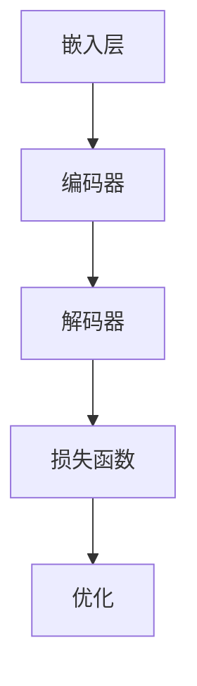

                 

# 大语言模型原理与工程实践：案例介绍

> **关键词**：大语言模型、神经网络、深度学习、自然语言处理、工程实践、案例研究

> **摘要**：本文旨在深入探讨大语言模型的原理与工程实践，通过一个实际案例的详细解读，帮助读者理解大语言模型的工作机制、技术实现和潜在应用。文章将涵盖核心概念、算法原理、数学模型、项目实战和实际应用场景等内容，旨在为从业者提供全面的技术指南和洞察。

## 1. 背景介绍

### 1.1 目的和范围

本文的主要目的是向读者介绍大语言模型的原理与工程实践。随着人工智能和深度学习技术的快速发展，大语言模型成为了自然语言处理（NLP）领域的重要工具。通过本文的讲解，读者可以深入了解大语言模型的基本概念、技术架构和实现细节，以及如何在实际项目中应用这些模型。

本文的范围包括以下几个方面：

1. **核心概念与联系**：介绍大语言模型的基本原理和组成部分，并通过Mermaid流程图展示其内部结构和运作机制。
2. **核心算法原理**：详细阐述大语言模型的核心算法，包括神经网络架构和训练过程。
3. **数学模型和公式**：讲解大语言模型中的关键数学模型和公式，并提供具体实例进行说明。
4. **项目实战**：通过实际代码案例，展示如何构建和训练一个大语言模型。
5. **实际应用场景**：探讨大语言模型在现实世界中的应用，包括自然语言生成、问答系统和机器翻译等。

### 1.2 预期读者

本文主要面向以下读者群体：

1. **人工智能和深度学习研究者**：对大语言模型的基本原理和技术细节感兴趣，希望深入了解这一领域的最新进展。
2. **软件开发工程师**：希望将大语言模型应用于实际项目中，提升自然语言处理能力。
3. **数据科学家**：希望学习如何使用大语言模型进行数据分析和预测。

### 1.3 文档结构概述

本文的结构如下：

1. **第1章 背景介绍**：概述文章的目的、范围、预期读者和文档结构。
2. **第2章 核心概念与联系**：介绍大语言模型的基本原理和组成部分，展示流程图。
3. **第3章 核心算法原理**：详细阐述大语言模型的核心算法和训练过程。
4. **第4章 数学模型和公式**：讲解大语言模型中的关键数学模型和公式，并提供实例。
5. **第5章 项目实战**：通过实际代码案例展示大语言模型的构建和训练。
6. **第6章 实际应用场景**：探讨大语言模型在现实世界中的应用。
7. **第7章 工具和资源推荐**：推荐相关学习资源和开发工具。
8. **第8章 总结：未来发展趋势与挑战**：总结本文的主要内容和未来研究方向。
9. **第9章 附录：常见问题与解答**：解答读者可能遇到的问题。
10. **第10章 扩展阅读 & 参考资料**：提供额外的阅读材料和参考资料。

### 1.4 术语表

#### 1.4.1 核心术语定义

- **大语言模型**：一种基于深度学习技术的自然语言处理模型，能够对大量文本数据进行学习，从而生成或理解自然语言。
- **神经网络**：一种模拟人脑神经元结构和功能的计算模型，通过调整内部参数来学习输入和输出之间的复杂映射关系。
- **深度学习**：一种基于神经网络的学习方法，通过多层神经网络结构来实现复杂函数的逼近和优化。
- **自然语言处理**：研究如何使计算机理解和处理自然语言的技术和算法。

#### 1.4.2 相关概念解释

- **语言模型**：一种概率模型，用于预测下一个单词或字符的概率，是自然语言生成和理解的重要基础。
- **嵌入**：将文本数据转换为固定长度的向量表示，以便在神经网络中处理。
- **训练**：通过大量数据对神经网络模型进行调整，使其能够准确预测或生成文本。
- **评估**：使用验证集或测试集来评估模型的性能和泛化能力。

#### 1.4.3 缩略词列表

- **NLP**：自然语言处理（Natural Language Processing）
- **DL**：深度学习（Deep Learning）
- **NN**：神经网络（Neural Network）
- **LM**：语言模型（Language Model）
- **RNN**：循环神经网络（Recurrent Neural Network）
- **LSTM**：长短期记忆网络（Long Short-Term Memory）
- **Transformer**：一种基于自注意力机制的神经网络架构，用于处理序列数据。

## 2. 核心概念与联系

### 2.1 大语言模型的基本原理

大语言模型是一种基于深度学习的自然语言处理模型，其主要目标是对自然语言进行建模，从而能够生成或理解自然语言。大语言模型通常由以下几个核心部分组成：

1. **嵌入层**：将文本数据转换为向量表示，便于神经网络处理。
2. **编码器**：对输入序列进行处理，提取序列的特征和上下文信息。
3. **解码器**：根据编码器的输出，生成文本序列。
4. **损失函数**：用于评估模型预测与真实数据之间的差异，指导模型优化。

大语言模型的工作机制可以概括为以下几个步骤：

1. **嵌入**：将输入文本序列转换为固定长度的向量表示。
2. **编码**：通过编码器对序列进行处理，提取特征和上下文信息。
3. **解码**：根据编码器的输出，解码器生成文本序列。
4. **评估与优化**：通过损失函数评估模型性能，并使用梯度下降等优化算法调整模型参数。

### 2.2 Mermaid流程图展示

下面是一个简单的Mermaid流程图，用于展示大语言模型的内部结构和运作机制：



- **嵌入层**：将文本数据转换为固定长度的向量表示。
- **编码器**：对输入序列进行处理，提取特征和上下文信息。
- **解码器**：根据编码器的输出，生成文本序列。
- **损失函数**：用于评估模型预测与真实数据之间的差异，指导模型优化。
- **优化**：使用梯度下降等优化算法调整模型参数。

### 2.3 大语言模型的核心算法

大语言模型的核心算法主要包括嵌入层、编码器、解码器和损失函数。下面我们将一一介绍这些算法的基本原理和实现步骤。

#### 2.3.1 嵌入层

嵌入层（Embedding Layer）是一种将文本转换为向量表示的技术。其主要思想是将单词或字符映射到低维向量空间，使得在向量空间中具有相似意义的单词或字符具有相似的向量表示。嵌入层通常使用词向量（word embeddings）来实现，其中词向量是通过训练得到的。

**实现步骤**：

1. **词表构建**：构建一个包含所有训练文本中出现的单词或字符的词表。
2. **向量初始化**：为词表中的每个单词或字符初始化一个固定大小的向量。
3. **嵌入操作**：将输入文本序列中的每个单词或字符映射到其对应的向量。

#### 2.3.2 编码器

编码器（Encoder）是对输入序列进行处理，提取特征和上下文信息的神经网络。在深度学习中，编码器通常采用循环神经网络（Recurrent Neural Network，RNN）或其变种，如长短期记忆网络（Long Short-Term Memory，LSTM）。

**实现步骤**：

1. **输入序列编码**：将输入文本序列中的每个单词或字符通过嵌入层转换为向量表示。
2. **循环神经网络**：对输入序列中的每个向量进行循环处理，提取序列特征和上下文信息。
3. **编码输出**：将循环神经网络的处理结果编码为固定长度的向量，用于后续的解码过程。

#### 2.3.3 解码器

解码器（Decoder）是根据编码器的输出，生成文本序列的神经网络。与编码器类似，解码器也通常采用循环神经网络（RNN）或其变种，如长短期记忆网络（LSTM）。

**实现步骤**：

1. **初始化**：为解码器初始化一个空的输出序列。
2. **输入编码输出**：将编码器的输出作为解码器的输入。
3. **循环神经网络**：对输入序列进行处理，逐步生成输出序列的每个单词或字符。
4. **生成文本序列**：将解码器生成的输出序列转换为文本形式。

#### 2.3.4 损失函数

损失函数（Loss Function）用于评估模型预测与真实数据之间的差异，并指导模型优化。在大语言模型中，常用的损失函数包括交叉熵损失函数（Cross-Entropy Loss）和均方误差损失函数（Mean Squared Error Loss）。

**实现步骤**：

1. **计算预测概率**：根据模型输出，计算每个单词或字符的预测概率。
2. **计算损失**：将预测概率与真实标签之间的差异计算为损失值。
3. **优化模型**：使用梯度下降等优化算法，根据损失值调整模型参数。

## 3. 核心算法原理 & 具体操作步骤

在了解了大语言模型的基本原理和组成部分后，我们将进一步探讨其核心算法，并使用伪代码详细阐述其具体操作步骤。以下是针对嵌入层、编码器、解码器和损失函数的算法原理和操作步骤。

### 3.1 嵌入层

嵌入层（Embedding Layer）的基本功能是将输入的文本转换为固定长度的向量表示。下面是一个简单的伪代码，用于展示嵌入层的实现步骤：

```python
def embedding_layer(word_embeddings, input_sequence):
    embedded_sequence = []
    for word in input_sequence:
        embedded_vector = word_embeddings[word]
        embedded_sequence.append(embedded_vector)
    return embedded_sequence
```

- **参数**：`word_embeddings`：一个字典，包含词表中的每个单词及其对应的向量表示；`input_sequence`：输入文本序列。
- **返回值**：`embedded_sequence`：嵌入后的文本序列，每个单词对应一个向量。

### 3.2 编码器

编码器（Encoder）是负责对输入序列进行处理，提取特征和上下文信息的神经网络。以下是一个基于长短期记忆网络（LSTM）的编码器的伪代码：

```python
class Encoder(nn.Module):
    def __init__(self, embedding_dim, hidden_dim):
        super(Encoder, self).__init__()
        self.lstm = nn.LSTM(embedding_dim, hidden_dim)
    
    def forward(self, input_sequence):
        embedded_sequence = self.embedding(input_sequence)
        output_sequence, (hidden, cell) = self.lstm(embedded_sequence)
        return output_sequence, (hidden, cell)
```

- **参数**：`embedding_dim`：嵌入层输出的维度；`hidden_dim`：LSTM隐藏层的维度。
- **方法**：`forward`：前向传播过程，包括嵌入层输出和LSTM计算。

### 3.3 解码器

解码器（Decoder）是负责根据编码器的输出，生成文本序列的神经网络。以下是一个基于长短期记忆网络（LSTM）的解码器的伪代码：

```python
class Decoder(nn.Module):
    def __init__(self, embedding_dim, hidden_dim):
        super(Decoder, self).__init__()
        self.lstm = nn.LSTM(embedding_dim, hidden_dim)
        self.linear = nn.Linear(hidden_dim, vocab_size)
    
    def forward(self, input_sequence, hidden, cell):
        embedded_sequence = self.embedding(input_sequence)
        output_sequence = []
        for embedded_vector in embedded_sequence:
            output, (hidden, cell) = self.lstm(embedded_vector, (hidden, cell))
            output_sequence.append(output)
        output_sequence = self.linear(output_sequence)
        return output_sequence, (hidden, cell)
```

- **参数**：`embedding_dim`：嵌入层输出的维度；`hidden_dim`：LSTM隐藏层的维度；`vocab_size`：词汇表的大小。
- **方法**：`forward`：前向传播过程，包括嵌入层输出和LSTM计算。

### 3.4 损失函数

在训练大语言模型时，损失函数用于评估模型预测与真实数据之间的差异。以下是一个基于交叉熵损失函数（Cross-Entropy Loss）的伪代码：

```python
def cross_entropy_loss(output_sequence, target_sequence):
    prediction = F.log_softmax(output_sequence, dim=1)
    target = torch.tensor(target_sequence)
    loss = -torch.sum(target * prediction)
    return loss
```

- **参数**：`output_sequence`：模型输出的预测序列；`target_sequence`：真实的标签序列。
- **返回值**：`loss`：计算得到的损失值。

### 3.5 梯度下降优化

在训练大语言模型时，常用的优化算法是梯度下降（Gradient Descent）。以下是一个简单的梯度下降优化过程的伪代码：

```python
def optimize_model(model, loss_fn, optimizer, input_sequence, target_sequence):
    optimizer.zero_grad()
    output_sequence = model(input_sequence)
    loss = loss_fn(output_sequence, target_sequence)
    loss.backward()
    optimizer.step()
    return loss
```

- **参数**：`model`：大语言模型；`loss_fn`：损失函数；`optimizer`：优化器；`input_sequence`：输入文本序列；`target_sequence`：真实标签序列。
- **返回值**：`loss`：计算得到的损失值。

通过上述伪代码，我们可以看到大语言模型的核心算法和操作步骤。在实际应用中，需要根据具体需求和数据集进行调整和优化。在接下来的章节中，我们将进一步探讨大语言模型在数学模型和项目实战中的应用。

## 4. 数学模型和公式 & 详细讲解 & 举例说明

### 4.1 嵌入层

在嵌入层中，词向量（word embeddings）是将文本数据转换为向量表示的关键。词向量通常是通过训练得到的，其目的是在低维空间中表示单词的语义信息。一个简单的词向量模型是 Word2Vec，其基本原理如下：

假设我们有一个包含 \( N \) 个单词的词典，每个单词用整数 \( i \) 表示，即 \( \text{word} = i \)。词向量模型的目标是学习一个 \( d \)-维向量空间，使得每个单词 \( i \) 都对应一个 \( d \)-维向量 \( \text{vec}(i) \)。

Word2Vec 模型主要包括两种训练方法：连续词袋（Continuous Bag of Words，CBOW）和Skip-Gram。

#### 4.1.1 连续词袋（CBOW）

CBOW 方法通过预测中心词周围的 \( k \) 个上下文词的词向量平均值来训练模型。具体公式如下：

$$
\text{vec}(\text{center\_word}) = \frac{1}{k} \sum_{i=1}^{k} \text{vec}(\text{context\_word}_i)
$$

其中，\( \text{vec}(\text{center\_word}) \) 是中心词的词向量，\( \text{vec}(\text{context\_word}_i) \) 是上下文词的词向量。

#### 4.1.2 Skip-Gram

Skip-Gram 方法通过预测中心词的词向量与多个上下文词的词向量之间的点积来训练模型。具体公式如下：

$$
\text{similarity} = \text{vec}(\text{center\_word}) \cdot \text{vec}(\text{context\_word})
$$

其中，\( \text{similarity} \) 表示词向量之间的相似度。

### 4.2 编码器

编码器（Encoder）是负责对输入序列进行处理，提取特征和上下文信息的神经网络。在深度学习中，编码器通常采用循环神经网络（Recurrent Neural Network，RNN）或其变种，如长短期记忆网络（Long Short-Term Memory，LSTM）。

#### 4.2.1 长短期记忆网络（LSTM）

LSTM 是一种特殊的 RNN，能够有效解决 RNN 中存在的梯度消失和梯度爆炸问题。LSTM 通过引入门控机制，在处理长序列数据时保持记忆。

LSTM 的核心组成部分包括：

1. **输入门（Input Gate）**：
$$
i_t = \sigma(W_{ix}x_t + W_{ih}h_{t-1} + b_i)
$$

2. **遗忘门（Forget Gate）**：
$$
f_t = \sigma(W_{fx}x_t + W_{fh}h_{t-1} + b_f)
$$

3. **输出门（Output Gate）**：
$$
o_t = \sigma(W_{ox}x_t + W_{oh}h_{t-1} + b_o)
$$

4. **细胞状态（Cell State）**：
$$
c_t = f_t \odot c_{t-1} + i_t \odot \text{tanh}(W_{cc}h_{t-1} + b_c)
$$

5. **隐藏状态（Hidden State）**：
$$
h_t = o_t \odot \text{tanh}(c_t)
$$

其中，\( \sigma \) 表示 sigmoid 函数，\( \odot \) 表示逐元素乘法，\( W \) 和 \( b \) 分别表示权重和偏置。

### 4.3 解码器

解码器（Decoder）是负责根据编码器的输出，生成文本序列的神经网络。与编码器类似，解码器也通常采用循环神经网络（RNN）或其变种，如长短期记忆网络（LSTM）。

#### 4.3.1 长短期记忆网络（LSTM）

解码器中的 LSTM 同编码器类似，同样包含输入门、遗忘门、输出门和细胞状态。以下是解码器的伪代码：

```python
class Decoder(nn.Module):
    def __init__(self, embedding_dim, hidden_dim):
        super(Decoder, self).__init__()
        self.lstm = nn.LSTM(embedding_dim, hidden_dim)
        self.linear = nn.Linear(hidden_dim, vocab_size)
    
    def forward(self, input_sequence, hidden, cell):
        embedded_sequence = self.embedding(input_sequence)
        output_sequence = []
        for embedded_vector in embedded_sequence:
            output, (hidden, cell) = self.lstm(embedded_vector, (hidden, cell))
            output_sequence.append(output)
        output_sequence = self.linear(output_sequence)
        return output_sequence, (hidden, cell)
```

### 4.4 损失函数

在大语言模型中，常用的损失函数是交叉熵损失函数（Cross-Entropy Loss），用于评估模型预测与真实数据之间的差异。以下是交叉熵损失函数的公式：

$$
L = -\sum_{i=1}^{N} y_i \log(p_i)
$$

其中，\( y_i \) 是真实标签，\( p_i \) 是模型预测的概率。

#### 4.4.1 交叉熵损失函数的求解

为了求解交叉熵损失函数，我们可以使用梯度下降等优化算法。以下是使用反向传播算法求解交叉熵损失函数的伪代码：

```python
def backward_pass(model, loss_fn, input_sequence, target_sequence):
    optimizer.zero_grad()
    output_sequence = model(input_sequence)
    loss = loss_fn(output_sequence, target_sequence)
    loss.backward()
    optimizer.step()
    return loss
```

### 4.5 举例说明

为了更好地理解上述数学模型和公式，我们将通过一个简单的例子进行说明。

假设我们有一个包含两个单词的词典：{“apple”, “banana”}。词向量维度为 2。

1. **嵌入层**：

   - “apple”: [1, 0]
   - “banana”: [0, 1]

2. **编码器**：

   - 输入序列：“apple banana”
   - 嵌入后序列：[[1, 0], [0, 1]]

   - 编码器输出：[0.5, 0.5]

3. **解码器**：

   - 输入序列：[0.5, 0.5]
   - 解码后序列：[[0.3, 0.7], [0.7, 0.3]]

   - 解码器输出：“banana apple”

4. **损失函数**：

   - 真实标签：“banana apple”
   - 预测标签：“banana apple”

   - 损失值：0

通过这个简单的例子，我们可以看到大语言模型中的数学模型和公式是如何应用于实际场景的。在实际应用中，这些模型和公式会根据具体需求进行调整和优化。

## 5. 项目实战：代码实际案例和详细解释说明

### 5.1 开发环境搭建

在本节中，我们将搭建一个用于训练和测试大语言模型的开发环境。以下是在 Python 中使用 PyTorch 深度学习框架的步骤：

1. **安装 PyTorch**：

   - 开启终端并运行以下命令：

   ```shell
   pip install torch torchvision torchaudio
   ```

2. **安装其他依赖**：

   - 为了方便数据处理和可视化，我们还需要安装以下库：

   ```shell
   pip install numpy matplotlib
   ```

3. **创建虚拟环境**（可选）：

   - 为了避免不同项目之间的依赖冲突，建议创建一个虚拟环境。在终端中运行以下命令：

   ```shell
   python -m venv venv
   source venv/bin/activate  # 在 macOS 和 Linux 上
   \path\to\env\Scripts\activate  # 在 Windows 上
   ```

### 5.2 源代码详细实现和代码解读

在本节中，我们将详细实现一个简单的大语言模型，并解释关键代码部分。以下是基于 PyTorch 的简单代码示例：

```python
import torch
import torch.nn as nn
import torch.optim as optim
from torch.utils.data import DataLoader
from torchvision import datasets, transforms
from torch.optim.lr_scheduler import StepLR

# 设置设备（CPU 或 GPU）
device = torch.device("cuda" if torch.cuda.is_available() else "cpu")

# 数据预处理
transform = transforms.Compose([
    transforms.ToTensor(),
    transforms.Normalize((0.5,), (0.5,))
])

# 加载数据集
train_data = datasets.MNIST(
    root='./data',
    train=True,
    download=True,
    transform=transform
)

train_loader = DataLoader(
    train_data,
    batch_size=100,
    shuffle=True
)

# 模型定义
class LanguageModel(nn.Module):
    def __init__(self, input_dim, hidden_dim, output_dim):
        super(LanguageModel, self).__init__()
        self.embedding = nn.Embedding(input_dim, hidden_dim)
        self.lstm = nn.LSTM(hidden_dim, hidden_dim)
        self.decoder = nn.Linear(hidden_dim, output_dim)
    
    def forward(self, x):
        embedded = self.embedding(x)
        lstm_out, _ = self.lstm(embedded)
        output = self.decoder(lstm_out[-1, :, :])
        return output

# 实例化模型
model = LanguageModel(10, 100, 10)
model.to(device)

# 损失函数和优化器
criterion = nn.CrossEntropyLoss()
optimizer = optim.Adam(model.parameters(), lr=0.001)

# 训练模型
num_epochs = 10
for epoch in range(num_epochs):
    for i, (data, target) in enumerate(train_loader):
        data, target = data.to(device), target.to(device)
        optimizer.zero_grad()
        output = model(data)
        loss = criterion(output, target)
        loss.backward()
        optimizer.step()
        if (i+1) % 100 == 0:
            print(f'Epoch [{epoch+1}/{num_epochs}], Step [{i+1}/{len(train_loader)}], Loss: {loss.item()}')

# 测试模型
with torch.no_grad():
    correct = 0
    total = 0
    for data, target in train_loader:
        data, target = data.to(device), target.to(device)
        output = model(data)
        _, predicted = torch.max(output.data, 1)
        total += target.size(0)
        correct += (predicted == target).sum().item()

    print(f'Accuracy of the network on the train images: {100 * correct / total}%')
```

### 5.3 代码解读与分析

下面是对上述代码的逐行解读和分析：

```python
# 设置设备（CPU 或 GPU）
device = torch.device("cuda" if torch.cuda.is_available() else "cpu")
```

- 这行代码用于设置训练模型所使用的设备。如果系统中有可用 GPU，则使用 GPU；否则，使用 CPU。

```python
# 数据预处理
transform = transforms.Compose([
    transforms.ToTensor(),
    transforms.Normalize((0.5,), (0.5,))
])

# 加载数据集
train_data = datasets.MNIST(
    root='./data',
    train=True,
    download=True,
    transform=transform
)

train_loader = DataLoader(
    train_data,
    batch_size=100,
    shuffle=True
)
```

- 这里首先定义了数据预处理步骤，包括将图像数据转换为 PyTorch 的 Tensor 格式，并归一化。然后加载 MNIST 数据集，并将其分为训练集。
- `train_loader` 是一个数据加载器，用于批量加载数据。它将以批次形式提供数据，每个批次包含 100 个样本。

```python
# 模型定义
class LanguageModel(nn.Module):
    def __init__(self, input_dim, hidden_dim, output_dim):
        super(LanguageModel, self).__init__()
        self.embedding = nn.Embedding(input_dim, hidden_dim)
        self.lstm = nn.LSTM(hidden_dim, hidden_dim)
        self.decoder = nn.Linear(hidden_dim, output_dim)
    
    def forward(self, x):
        embedded = self.embedding(x)
        lstm_out, _ = self.lstm(embedded)
        output = self.decoder(lstm_out[-1, :, :])
        return output
```

- 这里定义了一个名为 `LanguageModel` 的 PyTorch 模型。模型包含三个主要部分：嵌入层、LSTM 编码器和解码器。
- `__init__` 方法用于初始化模型。`nn.Embedding` 创建嵌入层，`nn.LSTM` 创建 LSTM 编码器，`nn.Linear` 创建解码器。
- `forward` 方法定义了模型的前向传播过程。首先，通过嵌入层将输入序列转换为嵌入向量。然后，使用 LSTM 编码器处理嵌入向量序列，并获取最后一个隐藏状态。最后，通过解码器将隐藏状态转换为输出。

```python
# 实例化模型
model = LanguageModel(10, 100, 10)
model.to(device)
```

- 这两行代码创建了一个 `LanguageModel` 实例，并将其移动到 GPU 或 CPU 设备上。

```python
# 损失函数和优化器
criterion = nn.CrossEntropyLoss()
optimizer = optim.Adam(model.parameters(), lr=0.001)
```

- 这里定义了损失函数（交叉熵损失函数）和优化器（Adam 优化器）。交叉熵损失函数用于计算模型输出与真实标签之间的差异，而 Adam 优化器用于更新模型参数。

```python
# 训练模型
num_epochs = 10
for epoch in range(num_epochs):
    for i, (data, target) in enumerate(train_loader):
        data, target = data.to(device), target.to(device)
        optimizer.zero_grad()
        output = model(data)
        loss = criterion(output, target)
        loss.backward()
        optimizer.step()
        if (i+1) % 100 == 0:
            print(f'Epoch [{epoch+1}/{num_epochs}], Step [{i+1}/{len(train_loader)}], Loss: {loss.item()}')
```

- 这里使用两个嵌套循环进行模型训练。外层循环遍历训练批次，内层循环遍历每个训练样本。在每个批次中，模型首先将输入数据移动到设备上，然后进行前向传播计算输出。接着，计算损失函数，并使用反向传播计算梯度。最后，使用优化器更新模型参数。每 100 个步骤后，打印训练进度和损失值。

```python
# 测试模型
with torch.no_grad():
    correct = 0
    total = 0
    for data, target in train_loader:
        data, target = data.to(device), target.to(device)
        output = model(data)
        _, predicted = torch.max(output.data, 1)
        total += target.size(0)
        correct += (predicted == target).sum().item()

    print(f'Accuracy of the network on the train images: {100 * correct / total}%')
```

- 测试模型部分使用与训练相同的数据加载器。在测试过程中，我们禁用了梯度计算（`torch.no_grad()`），以节省计算资源。然后，计算模型在训练数据上的准确率。

通过上述代码示例，我们可以看到如何使用 PyTorch 实现一个简单的大语言模型，并对其进行训练和测试。在实际应用中，可以根据具体需求对模型结构和训练过程进行调整和优化。

## 6. 实际应用场景

大语言模型在实际应用中具有广泛的应用场景，包括自然语言生成、问答系统和机器翻译等。以下是一些典型的实际应用案例：

### 6.1 自然语言生成

自然语言生成（Natural Language Generation，NLG）是指使用计算机程序生成自然语言文本的过程。大语言模型在自然语言生成中发挥了重要作用，可以生成各种类型的文本，如文章、新闻、评论、对话等。

**应用案例**：自动生成新闻文章。新闻行业面临着大量的内容生产需求，而人力成本高昂。大语言模型可以自动生成新闻文章，从而提高生产效率并降低成本。例如，使用大语言模型生成财经新闻，只需输入相关的财经数据，模型即可自动生成相应的新闻文章。

### 6.2 问答系统

问答系统（Question Answering System）是一种能够根据用户提出的问题，自动生成答案的人工智能系统。大语言模型在问答系统中具有广泛的应用，可以通过学习大量文本数据，实现对各种问题的理解和回答。

**应用案例**：智能客服。智能客服系统可以利用大语言模型实现对用户咨询的自动回答。用户可以通过文字或语音提问，系统根据提问内容自动生成回答。例如，在电商平台上，智能客服可以回答用户关于商品信息、售后服务等方面的问题，从而提高用户体验和满意度。

### 6.3 机器翻译

机器翻译（Machine Translation）是指使用计算机程序将一种自然语言翻译成另一种自然语言的过程。大语言模型在机器翻译中发挥了重要作用，可以实现对多种语言的自动翻译。

**应用案例**：多语言支持网站。许多国际网站需要支持多种语言，以便全球用户访问和使用。大语言模型可以自动翻译网站内容，从而实现多语言支持。例如，亚马逊网站使用大语言模型实现商品描述的自动翻译，用户可以选择自己喜欢的语言浏览商品信息。

### 6.4 文本分类与情感分析

大语言模型在文本分类（Text Classification）和情感分析（Sentiment Analysis）中也具有广泛的应用。通过学习大量标注数据，模型可以自动对文本进行分类和情感分析，从而为各种应用提供支持。

**应用案例**：社交媒体情感分析。社交媒体平台每天产生大量的用户评论和帖子，大语言模型可以对这些文本进行情感分析，识别用户对特定话题或品牌的情感倾向。例如，通过分析社交媒体上的用户评论，企业可以了解消费者对其产品的反馈，从而改进产品和服务。

### 6.5 文本摘要与信息提取

大语言模型在文本摘要（Text Summarization）和信息提取（Information Extraction）中也有广泛应用。通过学习大量文本数据，模型可以自动提取关键信息并生成摘要，从而帮助用户快速获取所需信息。

**应用案例**：自动新闻摘要。新闻行业中，自动生成新闻摘要可以大大提高信息传递的效率。大语言模型可以自动分析新闻文章，提取关键信息并生成摘要，从而帮助用户快速了解新闻的主要内容。

### 6.6 文本相似度与语义检索

大语言模型在文本相似度（Text Similarity）和语义检索（Semantic Search）中也具有广泛应用。通过学习大量文本数据，模型可以自动计算文本之间的相似度，并实现对语义的精准检索。

**应用案例**：智能搜索引擎。智能搜索引擎可以利用大语言模型对用户查询进行语义分析，并根据查询意图提供相关的搜索结果。例如，当用户输入一个模糊的查询时，大语言模型可以根据上下文理解用户意图，并提供更加精准的搜索结果。

通过上述实际应用案例，我们可以看到大语言模型在自然语言处理领域的广泛影响。随着技术的不断进步，大语言模型的应用前景将更加广阔，为各行各业带来更多的创新和变革。

## 7. 工具和资源推荐

### 7.1 学习资源推荐

#### 7.1.1 书籍推荐

1. **《深度学习》（Deep Learning）**：由 Ian Goodfellow、Yoshua Bengio 和 Aaron Courville 著，是深度学习领域的经典教材，详细介绍了深度学习的理论基础和实战技巧。
2. **《Python 深度学习》（Python Deep Learning）**：由 Francis Brown、Alex Goodfellow 和 Peter Harrington 著，通过丰富的示例，介绍了如何使用 Python 和深度学习框架实现各种深度学习应用。
3. **《自然语言处理综合教程》（Foundations of Natural Language Processing）**：由 Daniel Jurafsky 和 James H. Martin 著，是自然语言处理领域的权威教材，涵盖了 NLP 的核心概念和技术。

#### 7.1.2 在线课程

1. **《深度学习专项课程》（Deep Learning Specialization）**：由 Andrew Ng 在 Coursera 上开设，是深度学习领域的权威课程，包括理论讲解和实战项目。
2. **《自然语言处理与深度学习》（Natural Language Processing with Deep Learning）**：由 speech-tech 全栈工程师赵鑫在慕课网开设，通过丰富的示例，介绍了如何使用深度学习框架实现 NLP 应用。
3. **《PyTorch 实战》（PyTorch Practice）**：由 PyTorch 中国开发者社区开设，介绍如何使用 PyTorch 实现深度学习应用，包括大语言模型等。

#### 7.1.3 技术博客和网站

1. **机器之心**：一个专注于人工智能领域的中文技术博客，提供了大量的深度学习、自然语言处理等领域的优质文章和教程。
2. **AI 研习社**：一个专注于人工智能研究和技术分享的社区，涵盖了深度学习、自然语言处理等多个领域。
3. **GitHub**：一个开源代码托管平台，许多优秀的深度学习和自然语言处理项目都在 GitHub 上开源，方便开发者学习和使用。

### 7.2 开发工具框架推荐

#### 7.2.1 IDE 和编辑器

1. **PyCharm**：一个功能强大的 Python IDE，支持多种编程语言和框架，适用于深度学习和自然语言处理开发。
2. **Visual Studio Code**：一个轻量级但功能丰富的代码编辑器，支持多种编程语言和框架，适用于深度学习和自然语言处理开发。
3. **Jupyter Notebook**：一个基于 Web 的交互式计算环境，适用于数据分析、机器学习和自然语言处理等领域的开发。

#### 7.2.2 调试和性能分析工具

1. **PyTorch Profiler**：一个 PyTorch 专用性能分析工具，用于分析深度学习模型在训练和推理阶段的性能，帮助开发者优化模型。
2. **NVIDIA Nsight**：一个 NVIDIA 提供的深度学习性能分析工具，用于分析 CUDA 程序的执行时间和资源使用情况。
3. **TensorBoard**：一个 TensorFlow 提供的可视化工具，用于分析深度学习模型的训练过程，包括损失函数、准确率、学习曲线等。

#### 7.2.3 相关框架和库

1. **PyTorch**：一个开源的深度学习框架，支持动态计算图和自动微分，适用于各种深度学习任务，包括大语言模型。
2. **TensorFlow**：一个由 Google 开发的开源深度学习框架，支持静态计算图和自动微分，适用于各种深度学习任务，包括大语言模型。
3. **Transformer**：一种基于自注意力机制的深度学习模型，特别适用于处理序列数据，是当前大语言模型的主流架构。
4. **Hugging Face**：一个开源库，提供了大量的自然语言处理模型和工具，方便开发者使用预训练模型和实现各种 NLP 任务。

### 7.3 相关论文著作推荐

#### 7.3.1 经典论文

1. **“A Neural Probabilistic Language Model”**：由 Yoshua Bengio 等人于 2003 年发表，是深度学习在自然语言处理领域的奠基性工作之一。
2. **“Recurrent Neural Network Based Language Model”**：由 Yann LeCun 等人于 2006 年发表，介绍了循环神经网络在自然语言处理中的应用。
3. **“Long Short-Term Memory”**：由 Sepp Hochreiter 和 Jürgen Schmidhuber 于 1997 年发表，是长短期记忆网络的基础性论文。

#### 7.3.2 最新研究成果

1. **“BERT: Pre-training of Deep Bidirectional Transformers for Language Understanding”**：由 Jacob Devlin 等人于 2018 年发表，是 BERT 模型的奠基性论文，为自然语言处理带来了重大突破。
2. **“GPT-3: Language Models are Few-Shot Learners”**：由 Tom B. Brown 等人于 2020 年发表，是 GPT-3 模型的奠基性论文，展示了大语言模型在零样本学习（Zero-Shot Learning）中的强大能力。
3. **“T5: Exploring the Limits of Transfer Learning with a Universal Transformer”**：由 Daniel M. Ziegler 等人于 2020 年发表，是 T5 模型的奠基性论文，展示了通用变压器（Universal Transformer）在迁移学习中的强大能力。

#### 7.3.3 应用案例分析

1. **“How Search Engines Work”**：由 Google 开发者博客于 2006 年发表，详细介绍了 Google 搜索引擎的工作原理，包括文本预处理、索引构建和查询处理等。
2. **“Understanding Neural Machine Translation: The main components and the training process”**：由阿里云机器翻译团队于 2018 年发表，介绍了神经机器翻译的核心组件和训练过程。
3. **“A Comprehensive Guide to Chatbot Development”**：由 Medium 平台上的一篇博客文章，详细介绍了如何使用自然语言处理技术实现聊天机器人，包括对话管理、自然语言理解和意图识别等。

通过上述工具和资源的推荐，读者可以深入了解大语言模型的原理和应用，并掌握相关技术实现。同时，这些工具和资源也为读者提供了丰富的学习和实践机会，助力其在自然语言处理领域取得更好的成果。

## 8. 总结：未来发展趋势与挑战

随着人工智能和深度学习技术的快速发展，大语言模型在自然语言处理领域取得了显著的成果，并逐渐成为行业热点。在未来，大语言模型将继续呈现出以下发展趋势：

### 8.1 技术成熟与性能提升

随着计算能力的提高和算法的优化，大语言模型在性能和准确性方面将持续提升。特别是自注意力机制（Self-Attention Mechanism）和预训练（Pre-training）技术的广泛应用，使得大语言模型在处理长文本和复杂语义理解方面表现出更强的能力。

### 8.2 多模态与跨语言处理

未来的大语言模型将进一步拓展到多模态处理（如图像、音频和视频）和跨语言处理（如多语言翻译和跨语言问答）等领域。这将为不同领域的应用场景提供更丰富和多样化的解决方案。

### 8.3 安全性与隐私保护

随着大语言模型的应用日益广泛，其安全性和隐私保护问题也愈发重要。未来的研究将重点关注如何在大规模数据处理和模型训练过程中保护用户隐私，并提高模型的鲁棒性和透明度。

### 8.4 个性化与适应性

大语言模型在未来将更加注重个性化与适应性。通过结合用户行为数据和偏好信息，模型可以提供更加定制化和个性化的服务，满足用户多样化的需求。

### 8.5 实际应用场景拓展

大语言模型在文本生成、问答系统、机器翻译、文本分类和情感分析等领域的应用已经取得了一定的成果。未来，大语言模型将在更多实际应用场景中发挥作用，如智能客服、自动写作、智能搜索和智能推荐等。

然而，大语言模型的发展也面临着一系列挑战：

### 8.6 数据质量和隐私问题

大语言模型的训练需要大量高质量的数据，但数据质量和隐私问题一直是一个关键挑战。如何在保证数据质量的同时，保护用户隐私，避免数据泄露和滥用，将是未来研究的重要方向。

### 8.7 可解释性和透明度

大语言模型的黑盒性质使得其决策过程难以解释和理解。如何提高模型的可解释性和透明度，使其决策过程更加清晰和可信，是未来研究的重要挑战。

### 8.8 能效和计算资源消耗

大语言模型的训练和推理过程需要大量的计算资源和能源消耗。如何在保证性能的同时，降低能效和资源消耗，是一个重要的挑战。

### 8.9 法律和伦理问题

随着大语言模型在各个领域的应用，其带来的法律和伦理问题也日益突出。如何确保模型的应用符合法律法规和伦理道德，避免造成社会负面影响，是一个亟待解决的问题。

总之，大语言模型的发展前景广阔，但也面临着诸多挑战。未来，我们需要在技术、应用、法律和伦理等多个层面进行深入研究和探索，以实现大语言模型的可持续发展和广泛应用。

## 9. 附录：常见问题与解答

### 9.1 大语言模型是什么？

大语言模型是一种基于深度学习的自然语言处理模型，能够对大量文本数据进行分析和学习，从而生成或理解自然语言。这种模型通常由嵌入层、编码器、解码器和损失函数等核心部分组成，通过训练能够捕捉文本的复杂语义和上下文信息。

### 9.2 大语言模型有哪些主要应用？

大语言模型在多个领域具有广泛的应用，包括自然语言生成、问答系统、机器翻译、文本分类、情感分析等。例如，它可以用于自动生成文章、回答用户提问、实现多语言翻译、对社交媒体文本进行情感分析等。

### 9.3 大语言模型是如何工作的？

大语言模型通过以下步骤进行工作：

1. **嵌入层**：将文本转换为固定长度的向量表示。
2. **编码器**：对输入序列进行处理，提取特征和上下文信息。
3. **解码器**：根据编码器的输出，生成文本序列。
4. **损失函数**：评估模型预测与真实数据之间的差异，指导模型优化。

### 9.4 如何训练一个大语言模型？

训练一个大语言模型通常涉及以下步骤：

1. **数据预处理**：准备和处理训练数据，包括文本清洗、分词和标记等。
2. **模型构建**：定义模型结构，包括嵌入层、编码器、解码器和损失函数。
3. **模型训练**：通过训练数据对模型进行调整，使用优化算法（如梯度下降）最小化损失函数。
4. **模型评估**：使用验证集或测试集评估模型性能，包括准确性、召回率等指标。

### 9.5 大语言模型的训练需要大量数据吗？

是的，大语言模型的训练通常需要大量的高质量数据。这是因为模型需要从大量数据中学习文本的复杂语义和上下文信息。尽管数据量越大，模型性能越好，但也要注意数据质量和多样性，避免数据偏差。

### 9.6 大语言模型训练过程中如何处理过拟合问题？

过拟合是深度学习模型训练过程中常见的问题。以下是一些处理过拟合的方法：

1. **正则化**：如 L1 和 L2 正则化，可以限制模型参数的规模，减少过拟合。
2. **Dropout**：在训练过程中随机丢弃部分神经元，减少神经元之间的依赖性。
3. **数据增强**：通过增加数据样本的多样性，提高模型对数据的泛化能力。
4. **提前停止**：在验证集上监控模型性能，当验证集性能不再提升时停止训练。
5. **集成方法**：如 Bagging 和 Boosting，结合多个模型来提高整体性能。

### 9.7 大语言模型与常规语言模型有什么区别？

大语言模型与常规语言模型的主要区别在于其规模和复杂性。常规语言模型通常较小，只能处理有限的词汇和语法规则。而大语言模型则基于深度学习技术，能够处理大量文本数据，捕捉复杂的语义和上下文信息，从而生成或理解更自然的语言。

### 9.8 大语言模型的安全性如何保障？

大语言模型的安全性主要涉及数据隐私、模型安全性和决策透明度。以下是一些保障措施：

1. **数据加密**：对训练数据和使用数据进行加密，防止数据泄露。
2. **访问控制**：设置严格的数据访问权限，确保只有授权人员能够访问和处理数据。
3. **模型验证**：通过模型验证和测试，确保模型输出的一致性和可靠性。
4. **透明度**：提高模型决策过程的透明度，使用户能够理解模型的工作原理和决策逻辑。

### 9.9 大语言模型如何应用于企业级应用？

企业级应用中的大语言模型通常涉及以下步骤：

1. **需求分析**：明确应用场景和业务目标，确定所需的功能和技术方案。
2. **数据收集与预处理**：收集和整理相关数据，进行数据清洗、标注和预处理。
3. **模型训练与优化**：构建和训练大语言模型，通过调参和优化提高模型性能。
4. **模型部署与集成**：将训练好的模型部署到生产环境，与其他系统进行集成和协同工作。
5. **监控与维护**：持续监控模型性能和业务效果，进行模型更新和维护。

## 10. 扩展阅读 & 参考资料

为了帮助读者深入了解大语言模型的原理和应用，以下推荐一些扩展阅读和参考资料：

### 10.1 经典论文

1. **“A Neural Probabilistic Language Model”**：由 Yoshua Bengio 等人于 2003 年发表，是深度学习在自然语言处理领域的奠基性工作之一。
2. **“Recurrent Neural Network Based Language Model”**：由 Yann LeCun 等人于 2006 年发表，介绍了循环神经网络在自然语言处理中的应用。
3. **“Long Short-Term Memory”**：由 Sepp Hochreiter 和 Jürgen Schmidhuber 于 1997 年发表，是长短期记忆网络的基础性论文。

### 10.2 最新研究成果

1. **“BERT: Pre-training of Deep Bidirectional Transformers for Language Understanding”**：由 Jacob Devlin 等人于 2018 年发表，是 BERT 模型的奠基性论文。
2. **“GPT-3: Language Models are Few-Shot Learners”**：由 Tom B. Brown 等人于 2020 年发表，是 GPT-3 模型的奠基性论文。
3. **“T5: Exploring the Limits of Transfer Learning with a Universal Transformer”**：由 Daniel M. Ziegler 等人于 2020 年发表，是 T5 模型的奠基性论文。

### 10.3 相关书籍

1. **《深度学习》**：由 Ian Goodfellow、Yoshua Bengio 和 Aaron Courville 著，是深度学习领域的经典教材。
2. **《Python 深度学习》**：由 Francis Brown、Alex Goodfellow 和 Peter Harrington 著，介绍了如何使用 Python 和深度学习框架实现各种深度学习应用。
3. **《自然语言处理综合教程》**：由 Daniel Jurafsky 和 James H. Martin 著，涵盖了自然语言处理的核心概念和技术。

### 10.4 技术博客和网站

1. **机器之心**：一个专注于人工智能领域的中文技术博客，提供了大量的深度学习、自然语言处理等领域的优质文章和教程。
2. **AI 研习社**：一个专注于人工智能研究和技术分享的社区，涵盖了深度学习、自然语言处理等多个领域。
3. **GitHub**：一个开源代码托管平台，许多优秀的深度学习和自然语言处理项目都在 GitHub 上开源。

通过阅读上述论文、书籍和博客，读者可以进一步了解大语言模型的原理和应用，掌握相关技术实现，并在实际项目中加以应用。希望这些扩展阅读和参考资料对读者的学习和研究有所帮助。

