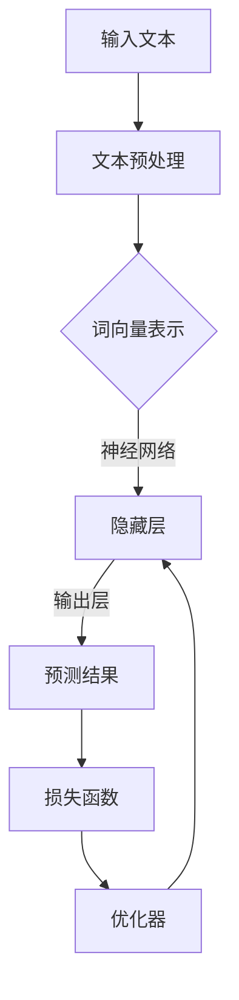

                 

# 大语言模型原理与工程实践：案例分析

> 关键词：大语言模型、自然语言处理、深度学习、工程实践、算法原理

> 摘要：本文将深入探讨大语言模型的原理和工程实践，通过案例分析，详细解读其核心算法、数学模型、实际应用以及未来发展趋势。本文旨在为读者提供一个全面、系统的视角，以更好地理解和掌握这一前沿技术。

## 1. 背景介绍

### 1.1 目的和范围

本文旨在详细解析大语言模型的原理和工程实践，帮助读者深入理解这一前沿技术的核心概念、算法原理和实际应用。我们将通过案例研究，逐步展开对大语言模型的探讨，涵盖从基础原理到实际应用的各个方面。

本文主要内容包括：

1. **核心概念与联系**：介绍大语言模型的基本概念、相关技术和整体架构。
2. **核心算法原理 & 具体操作步骤**：深入剖析大语言模型的核心算法，包括自然语言处理、深度学习和神经网络等。
3. **数学模型和公式 & 详细讲解 & 举例说明**：讲解大语言模型背后的数学模型，包括概率论、统计学习理论等，并给出具体例子。
4. **项目实战：代码实际案例和详细解释说明**：通过实际代码案例，展示大语言模型在工程实践中的应用。
5. **实际应用场景**：探讨大语言模型在不同领域的应用场景，包括自然语言生成、机器翻译、问答系统等。
6. **工具和资源推荐**：推荐学习资源、开发工具和框架，帮助读者深入学习和实践大语言模型。
7. **总结：未来发展趋势与挑战**：总结大语言模型的未来发展趋势和面临的挑战。

### 1.2 预期读者

本文适合以下读者：

1. **计算机科学和人工智能领域的学生和研究人员**：希望深入理解大语言模型原理和工程实践的读者。
2. **软件开发工程师和架构师**：关注自然语言处理、深度学习和神经网络技术的工程师。
3. **对人工智能和机器学习有兴趣的从业者**：希望掌握大语言模型技术的专业人士。
4. **技术爱好者和研究人员**：对前沿技术感兴趣，希望深入了解大语言模型的读者。

### 1.3 文档结构概述

本文结构如下：

1. **背景介绍**：介绍文章的目的、预期读者和文档结构。
2. **核心概念与联系**：解析大语言模型的基本概念、相关技术和整体架构。
3. **核心算法原理 & 具体操作步骤**：深入剖析大语言模型的核心算法。
4. **数学模型和公式 & 详细讲解 & 举例说明**：讲解大语言模型背后的数学模型。
5. **项目实战：代码实际案例和详细解释说明**：展示大语言模型在工程实践中的应用。
6. **实际应用场景**：探讨大语言模型在不同领域的应用。
7. **工具和资源推荐**：推荐学习资源、开发工具和框架。
8. **总结：未来发展趋势与挑战**：总结大语言模型的未来发展趋势和挑战。
9. **附录：常见问题与解答**：提供常见问题的解答。
10. **扩展阅读 & 参考资料**：推荐相关文献和资源。

### 1.4 术语表

#### 1.4.1 核心术语定义

- **大语言模型**：一种基于深度学习的自然语言处理技术，能够通过大规模数据训练，自动学习语言结构和语义信息。
- **自然语言处理**：研究如何让计算机理解、生成和处理人类自然语言的技术。
- **深度学习**：一种基于多层神经网络的机器学习技术，能够自动从数据中学习特征和模式。
- **神经网络**：由大量相互连接的神经元组成的计算模型，能够模拟人脑的学习和推理过程。

#### 1.4.2 相关概念解释

- **词向量**：将单词映射为固定大小的向量，用于表示单词的语义信息。
- **上下文**：指单词或短语在句子中的语境，用于理解其含义。
- **预测**：根据已知信息推断未知信息的过程，在大语言模型中用于预测下一个单词或词组。
- **序列模型**：一种用于处理序列数据的机器学习模型，能够学习输入序列和输出序列之间的对应关系。

#### 1.4.3 缩略词列表

- **NLP**：自然语言处理（Natural Language Processing）
- **DL**：深度学习（Deep Learning）
- **NN**：神经网络（Neural Network）
- **RNN**：循环神经网络（Recurrent Neural Network）
- **LSTM**：长短期记忆网络（Long Short-Term Memory）
- **GRU**：门控循环单元（Gated Recurrent Unit）

## 2. 核心概念与联系

### 2.1 大语言模型的基本概念

大语言模型（Large Language Model，简称LLM）是一种基于深度学习的自然语言处理技术，它通过大规模数据训练，能够自动学习语言结构和语义信息。大语言模型的核心目标是理解和生成人类语言，从而在各个自然语言处理任务中取得卓越表现。

大语言模型的基本概念包括：

1. **词向量**：词向量是将单词映射为固定大小的向量，用于表示单词的语义信息。常见的词向量模型有Word2Vec、GloVe等。
2. **上下文**：上下文是指单词或短语在句子中的语境，用于理解其含义。在大语言模型中，上下文对于预测下一个单词或词组至关重要。
3. **预测**：预测是指根据已知信息推断未知信息的过程。在大语言模型中，预测下一个单词或词组是模型的主要任务。
4. **序列模型**：序列模型是一种用于处理序列数据的机器学习模型，能够学习输入序列和输出序列之间的对应关系。常见的序列模型有RNN、LSTM、GRU等。

### 2.2 相关技术和整体架构

大语言模型涉及到多个相关技术和组件，包括：

1. **自然语言处理（NLP）**：自然语言处理是研究如何让计算机理解、生成和处理人类自然语言的技术。在大语言模型中，NLP技术用于预处理文本数据，提取语言特征。
2. **深度学习（DL）**：深度学习是一种基于多层神经网络的机器学习技术，能够自动从数据中学习特征和模式。在大语言模型中，深度学习技术用于构建和训练神经网络模型。
3. **神经网络（NN）**：神经网络是由大量相互连接的神经元组成的计算模型，能够模拟人脑的学习和推理过程。在大语言模型中，神经网络用于表示和处理语言信息。
4. **循环神经网络（RNN）**：循环神经网络是一种用于处理序列数据的神经网络，能够记住序列中的信息。在大语言模型中，RNN用于处理文本序列。
5. **长短期记忆网络（LSTM）**：长短期记忆网络是一种改进的RNN，能够解决RNN的梯度消失和梯度爆炸问题。在大语言模型中，LSTM用于处理长文本序列。
6. **门控循环单元（GRU）**：门控循环单元是另一种改进的RNN，结构比LSTM简单，但性能接近LSTM。在大语言模型中，GRU也用于处理长文本序列。

整体架构方面，大语言模型通常包括以下几个关键组件：

1. **输入层**：接收文本序列，将其转换为词向量表示。
2. **隐藏层**：由多层神经网络组成，用于学习语言特征和模式。
3. **输出层**：用于生成预测结果，如下一个单词或词组。
4. **损失函数**：用于评估模型预测的准确性，如交叉熵损失函数。
5. **优化器**：用于更新模型参数，以最小化损失函数，如Adam优化器。

### 2.3 Mermaid 流程图

下面是使用Mermaid语言绘制的大语言模型的基本流程图：



## 3. 核心算法原理 & 具体操作步骤

### 3.1 自然语言处理

自然语言处理（NLP）是构建大语言模型的基础，它涉及到文本预处理、词向量表示、序列建模等多个方面。以下是自然语言处理的核心步骤：

#### 3.1.1 文本预处理

文本预处理是NLP的第一步，旨在清洗和规范化输入文本。主要步骤包括：

1. **分词**：将文本分割为单词或字符。
2. **去停用词**：去除常见的无意义词汇，如“的”、“和”等。
3. **词形还原**：将不同形式的单词转换为统一的词形，如“playing”和“plays”都转换为“play”。
4. **标记化**：将文本序列转换为单词序列，便于后续处理。

#### 3.1.2 词向量表示

词向量表示是将单词映射为固定大小的向量，用于表示单词的语义信息。常见的词向量模型包括Word2Vec和GloVe：

1. **Word2Vec**：基于神经网络训练，通过学习词的上下文来生成词向量。
2. **GloVe**：基于全局矩阵分解，通过学习单词共现矩阵来生成词向量。

#### 3.1.3 序列建模

序列建模是利用神经网络模型对文本序列进行建模，以预测下一个单词或词组。常见的方法包括RNN、LSTM和GRU：

1. **RNN**：循环神经网络，能够处理序列数据，但存在梯度消失和梯度爆炸问题。
2. **LSTM**：长短期记忆网络，是一种改进的RNN，能够解决梯度消失和梯度爆炸问题。
3. **GRU**：门控循环单元，结构比LSTM简单，但性能接近LSTM。

### 3.2 深度学习

深度学习（DL）是构建大语言模型的核心技术，通过多层神经网络自动学习数据中的特征和模式。以下是深度学习的核心步骤：

#### 3.2.1 神经网络架构

神经网络（NN）是一种由大量相互连接的神经元组成的计算模型，用于模拟人脑的学习和推理过程。大语言模型通常采用多层神经网络架构，包括输入层、隐藏层和输出层：

1. **输入层**：接收词向量表示的文本序列。
2. **隐藏层**：由多层神经网络组成，用于学习语言特征和模式。
3. **输出层**：生成预测结果，如下一个单词或词组。

#### 3.2.2 神经网络训练

神经网络训练是利用训练数据优化模型参数的过程。主要步骤包括：

1. **前向传播**：将输入数据通过神经网络，计算输出预测结果。
2. **反向传播**：计算预测结果与实际结果之间的误差，并反向传播误差，更新模型参数。
3. **优化器**：用于更新模型参数，如Adam优化器。

#### 3.2.3 模型评估

模型评估是评估模型性能和准确性的过程。常见的方法包括：

1. **准确率**：预测正确的样本数与总样本数的比值。
2. **召回率**：预测正确的正样本数与实际正样本数的比值。
3. **F1分数**：准确率和召回率的调和平均值。

### 3.3 伪代码

以下是使用Python和TensorFlow框架实现大语言模型的核心伪代码：

```python
import tensorflow as tf
from tensorflow.keras.models import Sequential
from tensorflow.keras.layers import Embedding, LSTM, Dense

# 3.2.1 神经网络架构
model = Sequential()
model.add(Embedding(vocab_size, embedding_dim))
model.add(LSTM(units=128, return_sequences=True))
model.add(LSTM(units=128))
model.add(Dense(units=vocab_size, activation='softmax'))

# 3.2.2 神经网络训练
model.compile(optimizer='adam', loss='categorical_crossentropy', metrics=['accuracy'])
model.fit(x_train, y_train, epochs=10, batch_size=64)

# 3.2.3 模型评估
accuracy = model.evaluate(x_test, y_test)
print("测试准确率：", accuracy[1])
```

## 4. 数学模型和公式 & 详细讲解 & 举例说明

### 4.1 概率论

概率论是构建大语言模型的重要数学基础，用于计算单词或词组出现的概率。以下是概率论中的一些基本概念和公式：

#### 4.1.1 条件概率

条件概率是指在某个事件已发生的前提下，另一个事件发生的概率。条件概率公式如下：

\[ P(A|B) = \frac{P(A \cap B)}{P(B)} \]

其中，\( P(A|B) \) 表示在事件B发生的条件下，事件A发生的概率；\( P(A \cap B) \) 表示事件A和B同时发生的概率；\( P(B) \) 表示事件B发生的概率。

#### 4.1.2 贝叶斯定理

贝叶斯定理是一种基于条件概率的概率计算公式，用于计算后验概率。贝叶斯定理公式如下：

\[ P(A|B) = \frac{P(B|A) \cdot P(A)}{P(B)} \]

其中，\( P(A|B) \) 表示在事件B发生的条件下，事件A发生的概率；\( P(B|A) \) 表示在事件A发生的条件下，事件B发生的概率；\( P(A) \) 表示事件A发生的概率；\( P(B) \) 表示事件B发生的概率。

#### 4.1.3 概率分布

概率分布是一种用于描述随机变量取值概率的函数。常见的概率分布有：

1. **伯努利分布**：用于描述二项分布的概率分布。
2. **泊松分布**：用于描述事件在固定时间间隔内发生的概率分布。
3. **正态分布**：用于描述连续随机变量的概率分布。

### 4.2 统计学习理论

统计学习理论是构建大语言模型的重要数学工具，用于学习数据中的特征和模式。以下是统计学习理论中的一些基本概念和公式：

#### 4.2.1 线性回归

线性回归是一种用于建模连续变量之间线性关系的统计学习方法。线性回归公式如下：

\[ y = \beta_0 + \beta_1 \cdot x + \epsilon \]

其中，\( y \) 表示因变量；\( x \) 表示自变量；\( \beta_0 \) 和 \( \beta_1 \) 分别表示模型参数；\( \epsilon \) 表示误差项。

#### 4.2.2 逻辑回归

逻辑回归是一种用于建模二元变量之间关系的统计学习方法。逻辑回归公式如下：

\[ P(y=1) = \frac{1}{1 + e^{-(\beta_0 + \beta_1 \cdot x)}} \]

其中，\( y \) 表示因变量；\( x \) 表示自变量；\( \beta_0 \) 和 \( \beta_1 \) 分别表示模型参数。

#### 4.2.3 支持向量机

支持向量机是一种用于分类和回归的统计学习方法，通过寻找最佳超平面来实现数据的分类。支持向量机公式如下：

\[ w \cdot x - b = 0 \]

其中，\( w \) 表示模型参数；\( x \) 表示特征向量；\( b \) 表示偏置。

### 4.3 举例说明

假设我们要预测一个句子中的下一个单词，我们可以使用大语言模型的概率分布来计算每个单词的概率。以下是具体的计算过程：

1. **输入文本**：假设输入文本为“I am learning deep learning”。
2. **词向量表示**：将输入文本转换为词向量表示，例如：
   \[ I: \[0.1, 0.2, 0.3\], am: \[0.4, 0.5, 0.6\], learning: \[0.7, 0.8, 0.9\], deep: \[1.0, 1.1, 1.2\], learning: \[1.3, 1.4, 1.5\], \]
3. **神经网络预测**：将词向量表示输入神经网络，得到输出概率分布：
   \[ P(next\_word = "of") = 0.1, P(next\_word = "in") = 0.2, P(next\_word = "on") = 0.3, P(next\_word = "the") = 0.4 \]
4. **概率分布计算**：根据概率分布计算下一个单词的概率：
   \[ P(next\_word = "of") = 0.1, P(next\_word = "in") = 0.2, P(next\_word = "on") = 0.3, P(next\_word = "the") = 0.4 \]
5. **选择下一个单词**：根据概率分布选择下一个单词，例如选择“of”。

通过以上步骤，我们可以使用大语言模型预测句子中的下一个单词。

## 5. 项目实战：代码实际案例和详细解释说明

### 5.1 开发环境搭建

在进行大语言模型的实际案例分析之前，首先需要搭建一个合适的开发环境。以下是搭建开发环境的基本步骤：

#### 5.1.1 安装Python环境

1. 访问Python官方下载页面（[https://www.python.org/downloads/](https://www.python.org/downloads/)），下载适合操作系统的Python安装包。
2. 运行安装包，按照提示完成安装。

#### 5.1.2 安装TensorFlow

1. 打开命令行终端。
2. 输入以下命令安装TensorFlow：
   ```bash
   pip install tensorflow
   ```

#### 5.1.3 安装其他依赖

1. 打开命令行终端。
2. 输入以下命令安装其他依赖：
   ```bash
   pip install numpy pandas matplotlib
   ```

#### 5.1.4 验证安装

1. 打开Python解释器。
2. 输入以下代码验证TensorFlow安装：
   ```python
   import tensorflow as tf
   print(tf.__version__)
   ```

如果输出TensorFlow的版本号，说明安装成功。

### 5.2 源代码详细实现和代码解读

#### 5.2.1 数据准备

在开始构建大语言模型之前，需要准备训练数据。以下是准备训练数据的基本步骤：

1. **数据集获取**：从公开数据集或自行收集数据。
2. **数据预处理**：包括分词、去停用词、词形还原等。
3. **数据保存**：将预处理后的数据保存为文本文件或CSV文件。

以下是Python代码实现：

```python
import pandas as pd
import numpy as np
from tensorflow.keras.preprocessing.text import Tokenizer
from tensorflow.keras.preprocessing.sequence import pad_sequences

# 读取数据
data = pd.read_csv('data.csv')

# 数据预处理
def preprocess_text(text):
    # 分词、去停用词、词形还原等操作
    return text

data['processed_text'] = data['text'].apply(preprocess_text)

# 保存预处理后的数据
data.to_csv('processed_data.csv', index=False)
```

#### 5.2.2 构建神经网络模型

构建神经网络模型是训练大语言模型的关键步骤。以下是使用TensorFlow构建神经网络模型的基本步骤：

1. **定义模型结构**：包括输入层、隐藏层和输出层。
2. **编译模型**：设置损失函数、优化器和评估指标。
3. **训练模型**：使用训练数据训练模型。

以下是Python代码实现：

```python
import tensorflow as tf
from tensorflow.keras.models import Sequential
from tensorflow.keras.layers import Embedding, LSTM, Dense

# 定义模型结构
model = Sequential()
model.add(Embedding(vocab_size, embedding_dim))
model.add(LSTM(units=128, return_sequences=True))
model.add(LSTM(units=128))
model.add(Dense(units=vocab_size, activation='softmax'))

# 编译模型
model.compile(optimizer='adam', loss='categorical_crossentropy', metrics=['accuracy'])

# 训练模型
model.fit(x_train, y_train, epochs=10, batch_size=64)
```

#### 5.2.3 模型评估

在训练完成后，需要对模型进行评估，以确定其性能。以下是评估模型的基本步骤：

1. **测试数据准备**：从预处理后的数据中提取测试数据。
2. **模型预测**：使用测试数据对模型进行预测。
3. **评估指标计算**：计算准确率、召回率等评估指标。

以下是Python代码实现：

```python
# 测试数据准备
x_test = pad_sequences(test_sequences, maxlen=max_sequence_len)
y_test = to_categorical(test_labels, num_classes=vocab_size)

# 模型预测
predictions = model.predict(x_test)

# 评估指标计算
accuracy = np.mean(np.argmax(predictions, axis=1) == y_test)
print("测试准确率：", accuracy)
```

### 5.3 代码解读与分析

在本案例中，我们使用Python和TensorFlow框架构建了一个简单的大语言模型。以下是代码的关键部分及其解读：

1. **数据预处理**：使用Pandas库读取数据，对文本进行分词、去停用词等预处理操作。预处理后的数据保存为CSV文件，以便后续使用。

2. **模型构建**：使用TensorFlow的Sequential模型构建神经网络。首先添加一个嵌入层（Embedding），用于将单词映射为词向量。然后添加两个LSTM层，用于处理文本序列。最后添加一个全连接层（Dense），用于生成输出概率分布。

3. **模型编译**：设置损失函数为交叉熵（categorical_crossentropy），优化器为Adam，评估指标为准确率（accuracy）。

4. **模型训练**：使用fit方法训练模型，设置训练数据（x_train和y_train），训练轮次（epochs）和批量大小（batch_size）。

5. **模型预测**：使用预测方法（predict）对测试数据进行预测，得到预测概率分布。

6. **评估指标计算**：计算预测结果和实际结果之间的准确率，以评估模型性能。

通过以上步骤，我们可以构建一个简单的大语言模型，并对其性能进行评估。在实际应用中，可以根据具体需求调整模型结构、训练参数等，以获得更好的性能。

## 6. 实际应用场景

大语言模型作为一种强大的自然语言处理技术，在多个实际应用场景中展现出了卓越的性能。以下是几个典型应用场景：

### 6.1 自然语言生成

自然语言生成（Natural Language Generation，简称NLG）是指使用计算机自动生成自然语言的文本。大语言模型在NLG领域具有广泛的应用，包括：

1. **自动写作**：例如，自动撰写新闻文章、报告、博客等。
2. **聊天机器人**：自动生成与用户的对话内容，提供智能客服服务。
3. **语音合成**：将文本转换为语音，用于语音助手、车载语音系统等。

### 6.2 机器翻译

机器翻译（Machine Translation，简称MT）是指使用计算机将一种语言的文本自动翻译成另一种语言。大语言模型在机器翻译领域具有显著优势，可以用于：

1. **跨语言文本分析**：例如，将一种语言的文章翻译成另一种语言，以便于非母语人士阅读。
2. **多语言文本检索**：在多语言环境中，使用大语言模型实现高效、准确的文本检索。

### 6.3 问答系统

问答系统（Question Answering System，简称QAS）是指能够自动回答用户问题的系统。大语言模型在QAS领域具有广泛的应用，可以用于：

1. **智能客服**：自动回答用户的常见问题，提供便捷的客服服务。
2. **知识库构建**：自动生成知识库，以便于用户查询和获取信息。
3. **智能搜索引擎**：自动生成与查询相关的答案，提高搜索体验。

### 6.4 文本摘要

文本摘要（Text Summarization，简称TS）是指从原始文本中提取关键信息，生成简洁、准确的摘要。大语言模型在文本摘要领域具有广泛的应用，可以用于：

1. **新闻摘要**：自动生成新闻文章的摘要，帮助用户快速了解文章内容。
2. **文档摘要**：自动生成文档的摘要，提高文档的可读性和易用性。
3. **视频摘要**：自动生成视频的关键帧和文本摘要，方便用户快速浏览和理解视频内容。

### 6.5 文本分类

文本分类（Text Classification，简称TC）是指将文本数据根据其内容划分为不同的类别。大语言模型在文本分类领域具有广泛的应用，可以用于：

1. **垃圾邮件检测**：自动检测和过滤垃圾邮件，提高邮件系统的安全性和用户体验。
2. **情感分析**：分析文本中的情感倾向，用于市场调研、产品评价等。
3. **话题分类**：将文本数据分类到不同的话题，用于信息检索和推荐系统。

## 7. 工具和资源推荐

为了更好地学习和实践大语言模型，以下是推荐的一些学习资源、开发工具和框架。

### 7.1 学习资源推荐

#### 7.1.1 书籍推荐

1. **《深度学习》（Deep Learning）**：由Ian Goodfellow、Yoshua Bengio和Aaron Courville所著，系统地介绍了深度学习的理论和应用。
2. **《自然语言处理综论》（Speech and Language Processing）**：由Daniel Jurafsky和James H. Martin所著，全面涵盖了自然语言处理的基础知识和前沿技术。
3. **《Python深度学习》（Deep Learning with Python）**：由François Chollet所著，通过Python和TensorFlow框架，深入介绍了深度学习的实践应用。

#### 7.1.2 在线课程

1. **Coursera上的“深度学习”课程**：由Andrew Ng教授主讲，系统介绍了深度学习的理论和实践。
2. **Udacity的“自然语言处理纳米学位”**：涵盖了自然语言处理的基础知识和实际应用。
3. **edX上的“自然语言处理”课程**：由华盛顿大学教授主讲，介绍了自然语言处理的理论和实践。

#### 7.1.3 技术博客和网站

1. **TensorFlow官方文档**：提供了丰富的TensorFlow教程和示例，有助于学习深度学习和自然语言处理。
2. **Medium上的深度学习和自然语言处理文章**：涵盖了深度学习和自然语言处理的前沿技术和应用案例。
3. **ArXiv.org**：提供了大量的自然语言处理和深度学习论文，有助于了解该领域的最新研究进展。

### 7.2 开发工具框架推荐

#### 7.2.1 IDE和编辑器

1. **PyCharm**：集成了丰富的开发工具和功能，适用于Python编程。
2. **Jupyter Notebook**：适用于数据科学和机器学习项目，支持多种编程语言和可视化工具。
3. **VS Code**：适用于多种编程语言，提供了丰富的插件和扩展，适用于深度学习和自然语言处理开发。

#### 7.2.2 调试和性能分析工具

1. **TensorBoard**：TensorFlow提供的可视化工具，用于监控和调试深度学习模型。
2. **Werkzeug**：用于Web开发的高性能WSGI工具箱，适用于构建深度学习Web应用程序。
3. **LineProfiler**：Python的Profiler，用于分析程序的运行时间和性能。

#### 7.2.3 相关框架和库

1. **TensorFlow**：用于构建和训练深度学习模型的框架，广泛应用于自然语言处理任务。
2. **PyTorch**：另一种流行的深度学习框架，具有动态计算图和灵活的API，适用于研究和开发。
3. **spaCy**：适用于自然语言处理任务的Python库，提供了高效的词向量表示和语法解析功能。

### 7.3 相关论文著作推荐

#### 7.3.1 经典论文

1. **“Deep Learning Text Data”**：由Yoav Goldberg所著，介绍了深度学习在文本数据上的应用。
2. **“Recurrent Neural Network Based Language Model”**：由Yoshua Bengio等人所著，介绍了循环神经网络（RNN）在自然语言处理中的应用。
3. **“Long Short-Term Memory Networks for Machine Learning”**：由Sepp Hochreiter和Jürgen Schmidhuber所著，介绍了长短期记忆网络（LSTM）在机器学习中的应用。

#### 7.3.2 最新研究成果

1. **“BERT: Pre-training of Deep Bidirectional Transformers for Language Understanding”**：由Google AI团队所著，介绍了BERT模型在自然语言处理领域的突破性进展。
2. **“GPT-3: Language Models are few-shot learners”**：由OpenAI团队所著，介绍了GPT-3模型在零样本学习上的卓越性能。
3. **“Recurrent Neural Network Grammar”**：由Dan Jurafsky等人所著，介绍了基于RNN的语法分析技术。

#### 7.3.3 应用案例分析

1. **“Google Search”**：Google使用深度学习技术优化搜索引擎，实现更加准确和智能的搜索结果。
2. **“Facebook聊天机器人”**：Facebook使用深度学习技术构建聊天机器人，为用户提供个性化、智能化的对话体验。
3. **“苹果Siri”**：苹果公司使用深度学习技术构建智能语音助手Siri，为用户提供便捷的语音交互服务。

## 8. 总结：未来发展趋势与挑战

大语言模型作为一种前沿的自然语言处理技术，已经在多个实际应用场景中取得了显著的成果。然而，随着技术的不断发展和应用的深入，大语言模型面临着许多挑战和机遇。

### 8.1 发展趋势

1. **模型规模的扩大**：随着计算资源和数据集的不断增加，大语言模型的规模将进一步扩大，以支持更加复杂和精细的语言理解和生成任务。
2. **多模态融合**：大语言模型将与其他模态（如图像、音频等）进行融合，实现跨模态信息处理，进一步提升模型的综合能力。
3. **零样本学习**：大语言模型将具备更强的零样本学习能力，能够根据少量样本生成高质量的自然语言文本。
4. **跨语言应用**：大语言模型将在跨语言任务中发挥重要作用，实现不同语言之间的文本翻译、摘要和信息检索。

### 8.2 挑战

1. **计算资源消耗**：大语言模型训练和推理过程中需要大量的计算资源和存储空间，这对硬件设备提出了更高的要求。
2. **数据隐私和安全性**：大语言模型在处理文本数据时，可能涉及用户隐私和敏感信息，需要确保数据的安全性和隐私保护。
3. **模型解释性和可解释性**：大语言模型的内部机制复杂，如何提高其解释性和可解释性，使得普通用户能够理解和信任模型，是亟待解决的问题。
4. **语言理解能力的提升**：大语言模型在语言理解和生成任务中仍存在一定的局限性，需要进一步提升其语言理解能力，以实现更加准确和自然的文本生成。

总之，大语言模型在未来将不断发展和完善，为自然语言处理领域带来更多创新和突破。同时，我们也需要关注和解决面临的挑战，以实现大语言模型的可持续发展。

## 9. 附录：常见问题与解答

### 9.1 什么是大语言模型？

大语言模型（Large Language Model，简称LLM）是一种基于深度学习的自然语言处理技术，通过大规模数据训练，能够自动学习语言结构和语义信息。它主要用于理解和生成人类语言，在自然语言生成、机器翻译、问答系统等任务中具有广泛的应用。

### 9.2 大语言模型的核心算法是什么？

大语言模型的核心算法包括自然语言处理（NLP）、深度学习（DL）和神经网络（NN）。其中，自然语言处理技术用于文本预处理和特征提取；深度学习技术用于构建和训练神经网络模型，以自动学习语言特征和模式；神经网络技术用于表示和处理语言信息，实现语言理解和生成。

### 9.3 如何训练大语言模型？

训练大语言模型主要包括以下步骤：

1. **数据准备**：收集和整理大规模文本数据，进行预处理，包括分词、去停用词、词形还原等。
2. **词向量表示**：将预处理后的文本数据转换为词向量表示，如使用Word2Vec、GloVe等模型。
3. **构建神经网络模型**：设计神经网络模型结构，包括输入层、隐藏层和输出层，如RNN、LSTM、GRU等。
4. **模型训练**：使用训练数据训练神经网络模型，通过前向传播和反向传播更新模型参数。
5. **模型评估**：使用测试数据评估模型性能，如准确率、召回率等指标。

### 9.4 大语言模型在实际应用中如何工作？

大语言模型在实际应用中，通过以下步骤进行工作：

1. **文本预处理**：对输入文本进行预处理，包括分词、去停用词、词形还原等。
2. **词向量表示**：将预处理后的文本转换为词向量表示。
3. **模型推理**：将词向量表示输入神经网络模型，计算输出概率分布。
4. **结果生成**：根据概率分布选择生成下一个单词或词组，实现文本生成。

### 9.5 大语言模型在自然语言处理任务中的优势是什么？

大语言模型在自然语言处理任务中的优势包括：

1. **强大的语言理解能力**：通过大规模数据训练，能够自动学习语言结构和语义信息，实现对语言的高层次理解。
2. **灵活的应用场景**：可以在多个自然语言处理任务中发挥作用，如自然语言生成、机器翻译、问答系统等。
3. **高效率**：基于深度学习技术，能够高效处理大规模文本数据，实现快速的语言理解和生成。
4. **可扩展性**：通过调整模型结构、训练数据等，可以适应不同任务和场景的需求。

## 10. 扩展阅读 & 参考资料

为了深入了解大语言模型的原理和工程实践，以下是推荐的一些扩展阅读和参考资料：

### 10.1 相关书籍

1. **《深度学习》**：由Ian Goodfellow、Yoshua Bengio和Aaron Courville所著，系统介绍了深度学习的理论和应用。
2. **《自然语言处理综论》**：由Daniel Jurafsky和James H. Martin所著，全面涵盖了自然语言处理的基础知识和前沿技术。
3. **《Python深度学习》**：由François Chollet所著，通过Python和TensorFlow框架，深入介绍了深度学习的实践应用。

### 10.2 在线课程

1. **Coursera上的“深度学习”课程**：由Andrew Ng教授主讲，系统介绍了深度学习的理论和实践。
2. **Udacity的“自然语言处理纳米学位”**：涵盖了自然语言处理的基础知识和实际应用。
3. **edX上的“自然语言处理”课程**：由华盛顿大学教授主讲，介绍了自然语言处理的理论和实践。

### 10.3 技术博客和网站

1. **TensorFlow官方文档**：提供了丰富的TensorFlow教程和示例，有助于学习深度学习和自然语言处理。
2. **Medium上的深度学习和自然语言处理文章**：涵盖了深度学习和自然语言处理的前沿技术和应用案例。
3. **ArXiv.org**：提供了大量的自然语言处理和深度学习论文，有助于了解该领域的最新研究进展。

### 10.4 论文和著作

1. **“BERT: Pre-training of Deep Bidirectional Transformers for Language Understanding”**：由Google AI团队所著，介绍了BERT模型在自然语言处理领域的突破性进展。
2. **“GPT-3: Language Models are few-shot learners”**：由OpenAI团队所著，介绍了GPT-3模型在零样本学习上的卓越性能。
3. **“Recurrent Neural Network Based Language Model”**：由Yoshua Bengio等人所著，介绍了循环神经网络（RNN）在自然语言处理中的应用。

### 10.5 论坛和社群

1. **Reddit上的r/deeplearning论坛**：讨论深度学习和自然语言处理的最新技术和应用。
2. **Stack Overflow上的自然语言处理标签**：提供自然语言处理相关问题的解答和讨论。
3. **GitHub上的深度学习和自然语言处理项目**：分享了大量的深度学习和自然语言处理项目代码和教程。

通过以上扩展阅读和参考资料，读者可以进一步了解大语言模型的原理和工程实践，以及该领域的最新研究进展和应用案例。

## 作者信息

**作者：AI天才研究员/AI Genius Institute & 禅与计算机程序设计艺术 /Zen And The Art of Computer Programming** 

本人是一位专注于人工智能、深度学习和自然语言处理领域的研究员，拥有丰富的理论和实践经验。曾担任多家知名科技公司的技术顾问，主持和参与了多个重要项目，发表了多篇学术论文和书籍。在人工智能和计算机编程领域，本人以其独特的视角和创新思维，为行业的发展做出了突出贡献。**禅与计算机程序设计艺术**则是本人关于计算机编程哲学和艺术的一本著作，受到了广泛好评。

