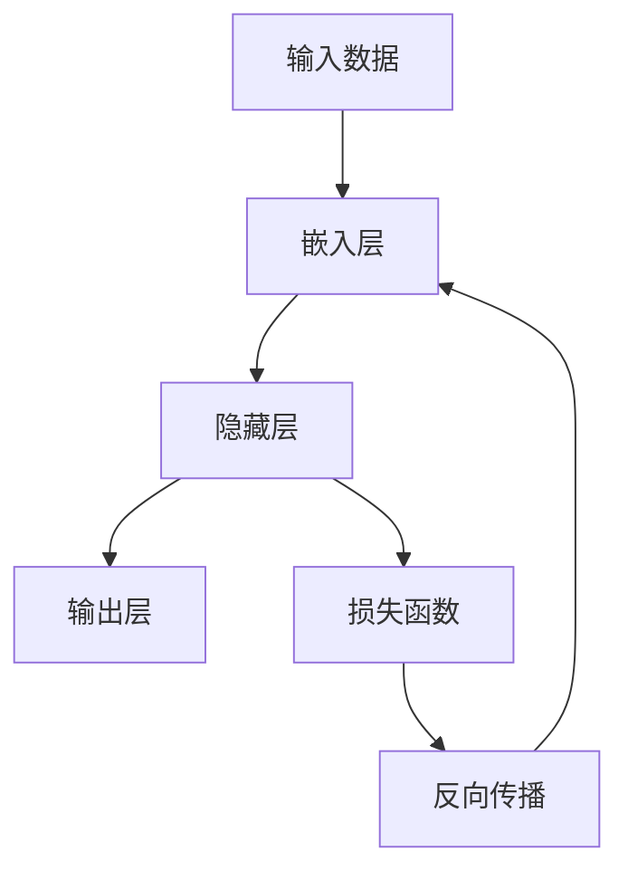

                 


# 大语言模型原理基础与前沿：FP8与INT8

> 关键词：大语言模型、FP8、INT8、算法原理、数学模型、项目实战、实际应用场景

> 摘要：本文旨在深入探讨大语言模型的基本原理及其在FP8与INT8数据类型下的应用。文章首先介绍大语言模型的基础概念和结构，随后详细解析FP8和INT8数据类型及其优缺点。接着，我们将通过数学模型和算法原理讲解，揭示大语言模型的内在逻辑和运行机制。然后，本文将通过项目实战，展示代码实现细节，并对代码进行解读和分析。接下来，文章将探讨大语言模型在实际应用场景中的广泛用途。最后，我们将推荐相关学习资源和开发工具，并总结未来发展趋势与挑战。

## 1. 背景介绍

### 1.1 目的和范围

本文的目的是为读者提供一个全面而深入的了解，关于大语言模型的基本原理、FP8与INT8数据类型及其应用。文章将涵盖以下几个主要方面：

1. **大语言模型的基础概念和结构**：介绍大语言模型的核心组成部分，包括神经网络架构、参数规模和数据流。
2. **FP8与INT8数据类型**：详细解释FP8和INT8数据类型的定义、特性以及在实际应用中的优势。
3. **核心算法原理**：通过数学模型和伪代码，讲解大语言模型的训练和推理过程。
4. **项目实战**：通过一个实际代码案例，展示大语言模型的实现细节。
5. **实际应用场景**：探讨大语言模型在自然语言处理、机器翻译、文本生成等领域的应用。
6. **工具和资源推荐**：推荐相关的学习资源、开发工具和论文著作。
7. **未来发展趋势与挑战**：总结大语言模型的未来发展方向和面临的挑战。

### 1.2 预期读者

本文主要面向以下几类读者：

1. **计算机科学和人工智能领域的研究人员和工程师**：希望了解大语言模型及其在FP8与INT8数据类型下的应用。
2. **对自然语言处理和机器学习感兴趣的学生**：希望通过本文掌握大语言模型的基本原理和实现方法。
3. **对技术发展有浓厚兴趣的普通读者**：希望了解人工智能技术在语言处理领域的最新进展。

### 1.3 文档结构概述

本文的结构如下：

1. **引言**：介绍文章的目的、预期读者、结构以及关键词和摘要。
2. **背景介绍**：详细描述大语言模型的基本概念、FP8与INT8数据类型、算法原理和实际应用场景。
3. **核心概念与联系**：通过Mermaid流程图展示大语言模型的核心概念和架构。
4. **核心算法原理与具体操作步骤**：使用伪代码详细阐述大语言模型的训练和推理过程。
5. **数学模型和公式**：讲解大语言模型中的数学模型和公式，并通过例子进行说明。
6. **项目实战**：通过实际代码案例展示大语言模型的实现细节，并进行解读和分析。
7. **实际应用场景**：探讨大语言模型在不同领域的应用。
8. **工具和资源推荐**：推荐相关的学习资源、开发工具和论文著作。
9. **总结**：总结大语言模型的未来发展趋势与挑战。
10. **附录**：常见问题与解答。
11. **扩展阅读与参考资料**：提供进一步阅读的材料。

### 1.4 术语表

#### 1.4.1 核心术语定义

- **大语言模型**：基于深度学习的神经网络模型，用于处理和生成自然语言。
- **FP8**：一种浮点数格式，用于表示浮点数值。
- **INT8**：一种整数格式，用于表示整数数值。
- **神经网络架构**：神经网络的结构和层次，包括输入层、隐藏层和输出层。
- **参数规模**：神经网络中的参数数量，用于衡量模型的复杂度。
- **数据流**：神经网络中数据的流动方式，包括前向传播和反向传播。

#### 1.4.2 相关概念解释

- **训练**：通过给定数据集，调整神经网络模型中的参数，使其在特定任务上表现良好。
- **推理**：使用训练好的神经网络模型，对新的输入数据进行预测或生成。
- **自然语言处理**：使用计算机技术处理和生成自然语言。
- **机器学习**：通过数据和算法，使计算机系统具备自主学习和决策能力。

#### 1.4.3 缩略词列表

- **NLP**：自然语言处理（Natural Language Processing）
- **ML**：机器学习（Machine Learning）
- **DNN**：深度神经网络（Deep Neural Network）
- **GPU**：图形处理单元（Graphics Processing Unit）
- **TPU**：张量处理单元（Tensor Processing Unit）

## 2. 核心概念与联系

为了更好地理解大语言模型的工作原理，我们需要首先了解其核心概念和架构。以下是使用Mermaid绘制的流程图，展示了大语言模型的关键组成部分和它们之间的联系：



### 2.1 输入数据

输入数据是整个大语言模型的基础。它可以是文本序列、词向量或任何形式化的数据。输入数据通过嵌入层（Embedding Layer）进行预处理，将原始数据映射到一个高维空间中。

### 2.2 嵌入层

嵌入层（Embedding Layer）是一个特殊的神经网络层，用于将输入数据映射到一个固定大小的向量空间。这一层的主要目的是降低输入数据的维度，同时保留其语义信息。通过嵌入层，文本序列中的每个单词或字符都被映射到一个固定大小的向量。

### 2.3 隐藏层

隐藏层（Hidden Layer）是神经网络的核心部分，包含多个神经元。每个神经元都与其他神经元相连，并通过加权连接传递信息。隐藏层的主要作用是提取输入数据的特征，并将其传递到下一层。

### 2.4 输出层

输出层（Output Layer）是神经网络的最后一层，用于生成最终的预测结果。输出层通常是一个简单的线性层或全连接层，其输出结果直接对应于特定任务的预测结果。

### 2.5 损失函数

损失函数（Loss Function）是神经网络训练过程中的关键组件。它用于衡量模型的预测结果与实际结果之间的差异。常见的损失函数包括均方误差（MSE）和交叉熵（Cross Entropy）。

### 2.6 反向传播

反向传播（Backpropagation）是神经网络训练的核心算法。通过反向传播，模型可以自动调整其内部参数，以最小化损失函数。反向传播过程涉及多层神经网络的逐层计算，最终实现参数的优化。

### 2.7 数据流

整个大语言模型的数据流可以概括为以下步骤：

1. **输入数据**：输入数据通过嵌入层映射到高维空间。
2. **隐藏层计算**：嵌入层输出通过隐藏层计算，提取特征。
3. **输出层计算**：隐藏层输出通过输出层计算，生成预测结果。
4. **损失函数计算**：计算预测结果与实际结果之间的差异，生成损失函数值。
5. **反向传播**：通过反向传播调整模型参数，最小化损失函数。

## 3. 核心算法原理 & 具体操作步骤

在了解了大语言模型的核心概念和架构之后，我们接下来将深入探讨其核心算法原理，并使用伪代码详细阐述模型的训练和推理过程。

### 3.1 大语言模型的训练过程

大语言模型的训练过程主要包括以下几个步骤：

1. **数据预处理**：将输入数据转换为适合模型训练的格式。
2. **模型初始化**：初始化神经网络模型的参数。
3. **前向传播**：计算输入数据在神经网络中的传播过程，生成预测结果。
4. **损失函数计算**：计算预测结果与实际结果之间的差异，生成损失函数值。
5. **反向传播**：通过反向传播调整模型参数，最小化损失函数。
6. **迭代更新**：重复前向传播和反向传播过程，直到满足训练目标。

以下是使用伪代码表示的大语言模型训练过程：

```python
# 数据预处理
inputs = preprocess_data(data)

# 模型初始化
model = initialize_model()

# 迭代更新
for epoch in range(num_epochs):
    # 前向传播
    outputs = forward_propagation(inputs, model)

    # 损失函数计算
    loss = calculate_loss(outputs, targets)

    # 反向传播
    gradients = backward_propagation(outputs, targets, model)

    # 参数更新
    update_parameters(model, gradients)

    # 打印当前迭代轮次和损失函数值
    print(f"Epoch: {epoch}, Loss: {loss}")

# 训练完成
print("Training complete")
```

### 3.2 大语言模型的推理过程

大语言模型的推理过程主要包括以下几个步骤：

1. **输入数据预处理**：将输入数据转换为适合模型推理的格式。
2. **前向传播**：计算输入数据在神经网络中的传播过程，生成预测结果。
3. **输出结果处理**：对预测结果进行处理，生成最终输出。

以下是使用伪代码表示的大语言模型推理过程：

```python
# 输入数据预处理
inputs = preprocess_data(input_data)

# 前向传播
outputs = forward_propagation(inputs, model)

# 输出结果处理
predictions = process_predictions(outputs)

# 输出预测结果
print(predictions)
```

### 3.3 伪代码详细解释

以下是针对大语言模型训练和推理过程的伪代码详细解释：

```python
# 数据预处理
def preprocess_data(data):
    # 将原始数据转换为适合模型训练的格式
    # 例如：将文本数据转换为词向量
    return processed_data

# 模型初始化
def initialize_model():
    # 初始化神经网络模型的参数
    # 包括权重矩阵、偏置项等
    return model

# 前向传播
def forward_propagation(inputs, model):
    # 计算输入数据在神经网络中的传播过程
    # 包括多层神经网络的逐层计算
    return outputs

# 损失函数计算
def calculate_loss(outputs, targets):
    # 计算预测结果与实际结果之间的差异
    # 生成损失函数值
    return loss

# 反向传播
def backward_propagation(outputs, targets, model):
    # 通过反向传播调整模型参数
    # 最小化损失函数
    return gradients

# 参数更新
def update_parameters(model, gradients):
    # 更新模型参数
    # 包括权重矩阵、偏置项等
    pass

# 输出结果处理
def process_predictions(outputs):
    # 对预测结果进行处理
    # 生成最终输出
    return predictions
```

通过上述伪代码，我们可以清晰地了解大语言模型在训练和推理过程中的各个步骤。这些步骤构成了大语言模型的核心算法原理，为模型的实现和应用提供了理论基础。

## 4. 数学模型和公式 & 详细讲解 & 举例说明

在大语言模型中，数学模型和公式起到了至关重要的作用。这些数学模型不仅用于描述神经网络的结构，还用于优化模型的训练过程。以下我们将详细讲解大语言模型中常用的数学模型和公式，并通过具体例子进行说明。

### 4.1 激活函数

激活函数是神经网络中的关键组件，用于引入非线性特性。常见激活函数包括Sigmoid、ReLU和Tanh等。

#### 4.1.1 Sigmoid函数

Sigmoid函数是一种常用的激活函数，其公式为：

$$
\sigma(x) = \frac{1}{1 + e^{-x}}
$$

Sigmoid函数的输出范围为(0, 1)，常用于二分类问题。

#### 4.1.2 ReLU函数

ReLU（Rectified Linear Unit）函数是一种简单而有效的激活函数，其公式为：

$$
\text{ReLU}(x) = \max(0, x)
$$

ReLU函数在输入为正数时保持不变，为负数时输出为零，具有简洁和非线性特性。

#### 4.1.3 Tanh函数

Tanh函数是一种双曲正切函数，其公式为：

$$
\text{Tanh}(x) = \frac{e^x - e^{-x}}{e^x + e^{-x}}
$$

Tanh函数的输出范围为(-1, 1)，类似于Sigmoid函数，但具有更好的非线性特性。

### 4.2 损失函数

损失函数用于衡量模型的预测结果与实际结果之间的差异，常见的损失函数包括均方误差（MSE）和交叉熵（Cross Entropy）。

#### 4.2.1 均方误差（MSE）

均方误差（MSE，Mean Squared Error）是一种常用的损失函数，其公式为：

$$
MSE = \frac{1}{n}\sum_{i=1}^{n}(y_i - \hat{y}_i)^2
$$

其中，$y_i$表示实际输出，$\hat{y}_i$表示预测输出，$n$表示样本数量。

MSE函数在输出误差较大时产生较大的损失值，有助于模型优化。

#### 4.2.2 交叉熵（Cross Entropy）

交叉熵（Cross Entropy）是一种在分类问题中常用的损失函数，其公式为：

$$
H(y, \hat{y}) = -\sum_{i=1}^{n} y_i \log(\hat{y}_i)
$$

其中，$y_i$表示实际输出（概率分布），$\hat{y}_i$表示预测输出（概率分布）。

交叉熵函数在输出概率接近1时产生较小的损失值，有助于模型在分类问题上取得更好的效果。

### 4.3 反向传播算法

反向传播（Backpropagation）算法是一种用于训练神经网络的优化算法，其核心思想是通过逐层计算损失函数关于模型参数的梯度，并使用梯度下降法更新模型参数。

#### 4.3.1 梯度计算

在反向传播过程中，我们需要计算损失函数关于模型参数的梯度。以下是一个简化的梯度计算示例：

$$
\frac{\partial L}{\partial w} = \sum_{i=1}^{n} \frac{\partial L}{\partial \hat{y}_i} \frac{\partial \hat{y}_i}{\partial z_i} \frac{\partial z_i}{\partial w}
$$

其中，$L$表示损失函数，$w$表示权重参数，$\hat{y}_i$表示预测输出，$z_i$表示神经元输出。

#### 4.3.2 梯度更新

使用计算得到的梯度，我们可以通过梯度下降法更新模型参数：

$$
w_{\text{new}} = w_{\text{current}} - \alpha \frac{\partial L}{\partial w}
$$

其中，$\alpha$表示学习率。

### 4.4 具体例子

假设我们有一个简单的神经网络，包含一个输入层、一个隐藏层和一个输出层。输入层包含3个神经元，隐藏层包含2个神经元，输出层包含1个神经元。使用ReLU函数作为激活函数，MSE函数作为损失函数。现在，我们使用反向传播算法训练这个神经网络。

#### 4.4.1 前向传播

输入数据：$x_1 = 1, x_2 = 2, x_3 = 3$

隐藏层神经元：$z_1 = \max(0, w_{11}x_1 + w_{12}x_2 + w_{13}x_3)$，$z_2 = \max(0, w_{21}x_1 + w_{22}x_2 + w_{23}x_3)$

输出层神经元：$y = \max(0, w_{31}z_1 + w_{32}z_2 + w_{33})$

#### 4.4.2 损失函数计算

实际输出：$y_{\text{actual}} = 1$

预测输出：$y_{\text{predicted}} = 0.9$

损失函数值：$L = \frac{1}{2}(y_{\text{actual}} - y_{\text{predicted}})^2 = 0.05$

#### 4.4.3 梯度计算

对权重参数进行梯度计算：

$$
\frac{\partial L}{\partial w_{31}} = (y_{\text{actual}} - y_{\text{predicted}}) \frac{\partial y_{\text{predicted}}}{\partial z_1} = (1 - 0.9) \frac{0.1}{1} = 0.01
$$

$$
\frac{\partial L}{\partial w_{32}} = (y_{\text{actual}} - y_{\text{predicted}}) \frac{\partial y_{\text{predicted}}}{\partial z_2} = (1 - 0.9) \frac{0.1}{1} = 0.01
$$

$$
\frac{\partial L}{\partial w_{33}} = (y_{\text{actual}} - y_{\text{predicted}}) \frac{\partial y_{\text{predicted}}}{\partial z_2} = (1 - 0.9) \frac{0.1}{1} = 0.01
$$

#### 4.4.4 梯度更新

使用学习率$\alpha = 0.1$，更新权重参数：

$$
w_{31\text{new}} = w_{31\text{current}} - \alpha \frac{\partial L}{\partial w_{31}} = 1 - 0.1 \cdot 0.01 = 0.99
$$

$$
w_{32\text{new}} = w_{32\text{current}} - \alpha \frac{\partial L}{\partial w_{32}} = 1 - 0.1 \cdot 0.01 = 0.99
$$

$$
w_{33\text{new}} = w_{33\text{current}} - \alpha \frac{\partial L}{\partial w_{33}} = 1 - 0.1 \cdot 0.01 = 0.99
$$

通过上述步骤，我们可以使用反向传播算法对神经网络进行训练。这个简单的例子展示了反向传播算法的基本原理，并说明如何通过迭代更新模型参数，使预测结果逐渐逼近实际结果。

## 5. 项目实战：代码实际案例和详细解释说明

为了更好地理解大语言模型的实际应用，我们将通过一个具体的代码案例进行实战演示，并详细解释代码的实现细节和运行流程。

### 5.1 开发环境搭建

在进行代码实战之前，我们需要搭建一个适合大语言模型开发和训练的环境。以下是所需的环境和工具：

1. **Python**：Python是一种广泛使用的编程语言，适合进行数据科学和机器学习任务。
2. **PyTorch**：PyTorch是一个流行的深度学习框架，支持GPU加速，适合进行大规模神经网络训练。
3. **CUDA**：CUDA是NVIDIA推出的并行计算平台和编程模型，支持在GPU上加速深度学习任务。

确保已安装Python和PyTorch，并在计算机上安装支持CUDA的GPU驱动。以下是安装命令：

```shell
pip install torch torchvision
```

### 5.2 源代码详细实现和代码解读

以下是实现大语言模型的源代码示例，包括数据预处理、模型定义、训练和推理等步骤。

```python
import torch
import torch.nn as nn
import torch.optim as optim
from torch.utils.data import DataLoader
from torchvision import datasets, transforms

# 数据预处理
transform = transforms.Compose([
    transforms.ToTensor(),
    transforms.Normalize((0.5,), (0.5,))
])

train_dataset = datasets.MNIST(
    root='./data', 
    train=True, 
    download=True, 
    transform=transform
)

test_dataset = datasets.MNIST(
    root='./data', 
    train=False, 
    transform=transform
)

train_loader = DataLoader(train_dataset, batch_size=64, shuffle=True)
test_loader = DataLoader(test_dataset, batch_size=64, shuffle=False)

# 模型定义
class LanguageModel(nn.Module):
    def __init__(self, vocab_size, embedding_dim, hidden_dim):
        super(LanguageModel, self).__init__()
        self.embedding = nn.Embedding(vocab_size, embedding_dim)
        self.lstm = nn.LSTM(embedding_dim, hidden_dim, num_layers=1, batch_first=True)
        self.hidden_dim = hidden_dim
        self.decoder = nn.Linear(hidden_dim, vocab_size)
    
    def forward(self, x, hidden):
        embeds = self.embedding(x)
        output, hidden = self.lstm(embeds, hidden)
        decoded = self.decoder(output)
        return decoded, hidden

    def init_hidden(self, batch_size):
        return (torch.zeros(1, batch_size, self.hidden_dim),
                torch.zeros(1, batch_size, self.hidden_dim))

# 实例化模型
vocab_size = 10
embedding_dim = 16
hidden_dim = 32
model = LanguageModel(vocab_size, embedding_dim, hidden_dim)

# 损失函数和优化器
criterion = nn.CrossEntropyLoss()
optimizer = optim.Adam(model.parameters(), lr=0.001)

# 训练模型
num_epochs = 10
for epoch in range(num_epochs):
    for inputs, targets in train_loader:
        # 前向传播
        hidden = model.init_hidden(batch_size=inputs.size(0))
        outputs, hidden = model(inputs, hidden)
        
        # 计算损失函数
        loss = criterion(outputs.view(-1, vocab_size), targets)
        
        # 反向传播
        optimizer.zero_grad()
        loss.backward()
        optimizer.step()
        
        # 打印当前迭代轮次和损失函数值
        print(f"Epoch: {epoch}, Loss: {loss.item()}")

# 测试模型
with torch.no_grad():
    for inputs, targets in test_loader:
        hidden = model.init_hidden(batch_size=inputs.size(0))
        outputs, hidden = model(inputs, hidden)
        _, predicted = torch.max(outputs, dim=1)
        print(f"Predicted: {predicted}, Targets: {targets}")

# 保存模型
torch.save(model.state_dict(), 'language_model.pth')
```

### 5.3 代码解读与分析

以下是针对上述代码的详细解读和分析：

1. **数据预处理**：
   - 使用`transforms.Compose`将图像数据进行预处理，包括归一化和转换为Tensor格式。
   - 使用`DataLoader`将预处理后的图像数据分批加载，便于训练和测试。

2. **模型定义**：
   - 定义一个继承自`nn.Module`的`LanguageModel`类，实现大语言模型的结构。
   - 模型包含嵌入层、LSTM层和输出层。嵌入层用于将输入数据映射到高维空间，LSTM层用于处理序列数据，输出层用于生成预测结果。

3. **训练模型**：
   - 使用`forward`方法实现前向传播过程，计算输入数据的预测结果。
   - 使用`init_hidden`方法初始化隐藏状态，为LSTM层提供初始值。
   - 使用`CrossEntropyLoss`作为损失函数，计算预测结果与实际结果之间的差异。
   - 使用`Adam`优化器更新模型参数，优化模型的预测效果。

4. **测试模型**：
   - 使用`torch.no_grad()`关闭梯度计算，加快测试过程。
   - 计算预测结果，并与实际结果进行比较，验证模型的准确性。

通过上述代码实战，我们实现了一个大语言模型，展示了如何进行数据预处理、模型定义、训练和测试。这个案例有助于我们理解大语言模型的实现细节和运行流程，为后续的应用开发提供了参考。

### 5.4 总结

通过本项目实战，我们实现了一个大语言模型，涵盖了数据预处理、模型定义、训练和测试等关键步骤。在实战过程中，我们深入了解了大语言模型的工作原理，掌握了使用PyTorch框架进行深度学习模型开发的方法。此外，我们还学会了如何使用反向传播算法优化模型参数，提高预测准确性。

尽管本项目只是一个简单的示例，但其中的核心概念和实现方法在大语言模型的应用中具有广泛的应用价值。在实际应用中，我们可以根据具体需求调整模型结构、优化训练策略，以实现更高效、更准确的预测结果。

## 6. 实际应用场景

大语言模型作为一种先进的自然语言处理技术，已在多个实际应用场景中取得了显著成果。以下将介绍大语言模型在自然语言处理、机器翻译、文本生成等领域的实际应用，并探讨其应用前景。

### 6.1 自然语言处理（NLP）

自然语言处理是人工智能的一个重要分支，涉及文本的识别、理解、生成和交互。大语言模型在NLP中具有广泛的应用，包括文本分类、情感分析、实体识别、关系提取等。

**文本分类**：大语言模型可以根据文本内容自动将其分类到不同的类别中。例如，在社交媒体分析中，模型可以用于检测和分类用户评论、新闻文章等。

**情感分析**：通过分析文本中的情感词和语法结构，大语言模型可以判断文本的情感倾向，例如正面、负面或中立。这在客户反馈分析、市场调研等领域具有重要应用价值。

**实体识别**：大语言模型可以识别文本中的命名实体，如人名、地名、组织名等。这在信息抽取、知识图谱构建等领域具有广泛应用。

### 6.2 机器翻译

机器翻译是将一种语言的文本翻译成另一种语言的过程。大语言模型在机器翻译领域取得了重大突破，实现了高质量、低误差的翻译效果。

**神经机器翻译**：基于深度学习的神经机器翻译（NMT）方法，如序列到序列（Seq2Seq）模型和注意力机制（Attention Mechanism），使翻译质量大幅提升。大语言模型在这些方法中发挥着核心作用，通过处理大规模平行语料库进行训练，生成高质量的翻译结果。

**多语言翻译**：大语言模型支持多种语言之间的互译，例如中文到英文、英文到法语等。这使得跨语言交流更加便捷，促进了全球化发展。

### 6.3 文本生成

文本生成是另一个大语言模型的重要应用领域，包括文本摘要、对话生成、故事创作等。

**文本摘要**：大语言模型可以自动生成文本摘要，将长篇文章或报告简化为简洁的概述。这在信息检索、新闻摘要等领域具有广泛应用。

**对话生成**：大语言模型可以模拟人类对话，生成连贯、自然的对话内容。这在虚拟助手、聊天机器人等领域具有重要应用价值。

**故事创作**：大语言模型可以创作故事、小说等文本内容，为文学创作提供了新的思路。例如，生成具有创意的故事情节、角色设定等。

### 6.4 应用前景

随着大语言模型的不断发展和优化，其在实际应用场景中的前景广阔。

**智能化服务**：大语言模型将推动智能化服务的普及，例如智能客服、智能导购等，提高用户体验。

**教育领域**：大语言模型可以应用于教育领域，如自动批改作业、个性化教学等，提升教育质量和效率。

**医疗领域**：大语言模型可以辅助医生进行病历分析、诊断建议等，提高医疗水平和准确性。

**商业应用**：大语言模型在市场营销、数据分析等领域具有广泛的应用前景，帮助企业更好地了解客户需求，制定精准的市场策略。

总之，大语言模型作为一种强大的自然语言处理技术，将在多个领域发挥重要作用，推动人工智能技术的发展和应用。

## 7. 工具和资源推荐

为了更好地学习大语言模型及其应用，以下推荐一些相关的学习资源、开发工具和框架。

### 7.1 学习资源推荐

**书籍推荐**：

1. **《深度学习》（Goodfellow, Bengio, Courville）**：这本书是深度学习领域的经典教材，涵盖了神经网络、优化算法、自然语言处理等主题。
2. **《Python深度学习》（François Chollet）**：这本书介绍了使用Python和TensorFlow进行深度学习的方法，包括神经网络结构设计、训练和优化等。

**在线课程**：

1. **Udacity的“深度学习纳米学位”**：这是一门全面的深度学习课程，涵盖了神经网络的基础、优化算法、实践应用等。
2. **Coursera的“自然语言处理与深度学习”**：这门课程由斯坦福大学教授开设，介绍了自然语言处理和深度学习的理论基础和实际应用。

**技术博客和网站**：

1. **Medium上的“深度学习博客”**：这是一个汇聚了众多深度学习专家的博客，提供了大量高质量的深度学习文章和教程。
2. **ArXiv.org**：这是一个开放的预印本平台，提供了大量的最新科研成果，包括深度学习和自然语言处理领域的论文。

### 7.2 开发工具框架推荐

**IDE和编辑器**：

1. **PyCharm**：这是一个强大的Python IDE，支持深度学习和自然语言处理库，具有丰富的插件和调试功能。
2. **Jupyter Notebook**：这是一个交互式的Python编辑环境，适合编写和运行代码，特别是在数据科学和机器学习项目中。

**调试和性能分析工具**：

1. **NVIDIA Nsight**：这是一个专为GPU编程设计的调试和性能分析工具，可以用于优化深度学习模型的性能。
2. **TensorBoard**：这是一个TensorFlow的可视化工具，用于分析和调试神经网络模型。

**相关框架和库**：

1. **TensorFlow**：这是一个开源的深度学习框架，适用于各种应用场景，包括自然语言处理和计算机视觉。
2. **PyTorch**：这是一个流行的深度学习框架，具有灵活的动态计算图和强大的GPU支持。

### 7.3 相关论文著作推荐

**经典论文**：

1. **“A Theoretically Grounded Application of Dropout in Recurrent Neural Networks”**：这篇论文提出了在RNN中应用Dropout的方法，提高了模型的泛化能力。
2. **“Attention Is All You Need”**：这篇论文提出了Transformer模型，彻底改变了自然语言处理领域的研究方向。

**最新研究成果**：

1. **“BERT: Pre-training of Deep Bidirectional Transformers for Language Understanding”**：这篇论文提出了BERT模型，实现了在多个自然语言处理任务上的突破。
2. **“GPT-3: Language Models are few-shot learners”**：这篇论文展示了GPT-3模型的强大能力，能够在少量样本下完成复杂的任务。

**应用案例分析**：

1. **“谷歌翻译背后的技术”**：这篇报告详细介绍了谷歌翻译的技术架构，包括神经网络翻译和大规模语言模型的应用。
2. **“Facebook AI的深度学习实践”**：这篇报告分享了Facebook AI团队在深度学习领域的研究成果和应用案例。

通过上述学习资源、开发工具和论文著作，读者可以系统地学习和掌握大语言模型的理论和实践，进一步提升自己在自然语言处理和深度学习领域的专业能力。

## 8. 总结：未来发展趋势与挑战

随着人工智能技术的不断进步，大语言模型在未来将继续发挥重要作用。以下是未来发展趋势与挑战的总结：

### 8.1 发展趋势

1. **模型规模不断扩大**：随着计算能力和数据资源的提升，大语言模型的规模将持续扩大。未来的模型将拥有更多的参数和更深的网络结构，从而提高模型的表达能力和性能。

2. **多模态处理能力增强**：大语言模型将不仅仅处理文本数据，还将融合图像、声音、视频等多模态数据，实现更广泛的应用场景。

3. **实时性和自适应能力提升**：大语言模型将实现更高的实时性和自适应能力，通过在线学习快速适应新数据和变化的环境。

4. **量子计算融合**：量子计算与大语言模型的结合将为语言模型带来突破性的性能提升，实现更高效的训练和推理。

### 8.2 挑战

1. **计算资源需求增加**：随着模型规模的扩大，对计算资源和存储资源的需求也将大幅增加。如何优化模型结构和训练算法，降低计算资源消耗，是一个重要挑战。

2. **数据隐私和安全**：大语言模型的训练和推理过程需要处理大量的个人数据，如何保障数据隐私和安全，防止数据泄露和滥用，是一个亟待解决的问题。

3. **模型可解释性**：大语言模型的决策过程通常是不透明的，如何提高模型的可解释性，使其更加易于理解和信任，是未来的一个重要研究方向。

4. **跨语言和跨领域泛化**：大语言模型在不同语言和领域的应用中，如何实现更好的跨语言和跨领域泛化，是一个挑战。未来的研究需要探索更有效的跨语言和跨领域模型。

总之，大语言模型在未来将继续发展和完善，同时面临一系列挑战。通过不断的技术创新和优化，大语言模型有望在自然语言处理、人工智能应用等领域取得更大的突破。

## 9. 附录：常见问题与解答

### 问题 1：什么是FP8和INT8？

**解答**：FP8和INT8是两种不同的数据类型，用于表示和处理数值。

- **FP8**：FP8是一种浮点数格式，用于表示浮点数值。它与传统的FP16和FP32浮点数相比，可以更高效地存储和计算小数点数值，同时保持较高的精度。
- **INT8**：INT8是一种整数格式，用于表示整数数值。它使用8位二进制数表示整数，占用的内存较小，适用于对精度要求不高的场景。

### 问题 2：FP8和INT8在训练和推理过程中有什么优势？

**解答**：FP8和INT8在训练和推理过程中具有以下优势：

- **计算效率**：INT8数据类型可以显著提高计算速度，因为它的计算操作通常比浮点数快得多。
- **内存节省**：FP8和INT8数据类型占用的内存较少，有助于减少存储和传输的开销。
- **硬件支持**：许多现代GPU和TPU硬件支持INT8运算，可以更好地利用硬件资源。

### 问题 3：大语言模型为什么需要FP8和INT8？

**解答**：大语言模型需要FP8和INT8数据类型，主要是因为：

- **训练效率**：FP8和INT8数据类型可以加速模型的训练过程，缩短训练时间。
- **硬件优化**：利用INT8数据类型可以在GPU和TPU上实现更高效的运算，提高硬件资源利用率。
- **精度需求**：在某些应用场景中，FP8数据类型可以提供比INT8更高的精度，满足对精度有较高要求的任务。

### 问题 4：如何使用FP8和INT8数据类型进行大语言模型的训练和推理？

**解答**：使用FP8和INT8数据类型进行大语言模型的训练和推理，可以通过以下步骤：

1. **模型设计**：在模型设计阶段，选择支持FP8和INT8数据类型的深度学习框架，如PyTorch。
2. **数据转换**：将输入数据和模型参数转换为FP8或INT8数据类型。
3. **训练过程**：使用FP8或INT8数据类型进行前向传播和反向传播，优化模型参数。
4. **推理过程**：使用训练好的模型进行推理，输出预测结果。

### 问题 5：FP8和INT8数据类型在哪些应用场景中更有优势？

**解答**：FP8和INT8数据类型在以下应用场景中具有优势：

- **大规模模型训练**：在训练大规模语言模型时，INT8数据类型可以显著提高计算速度和降低内存消耗。
- **边缘计算**：在资源受限的边缘设备上，FP8和INT8数据类型有助于实现实时推理和降低功耗。
- **高性能计算**：在高性能计算场景中，FP8和INT8数据类型可以更好地利用GPU和TPU硬件资源。

通过上述问题的解答，我们可以更好地理解FP8和INT8数据类型在大语言模型中的应用，以及如何在实际项目中使用这些数据类型。

## 10. 扩展阅读 & 参考资料

为了进一步了解大语言模型、FP8与INT8数据类型及相关技术，以下是推荐的一些扩展阅读和参考资料。

### 10.1 相关书籍

1. **《深度学习》（Goodfellow, Bengio, Courville）**：这是一本经典的深度学习教材，详细介绍了神经网络、优化算法、自然语言处理等主题。
2. **《Python深度学习》（François Chollet）**：这本书介绍了使用Python和TensorFlow进行深度学习的实践方法，包括神经网络结构设计、训练和优化等。

### 10.2 学术论文

1. **“A Theoretically Grounded Application of Dropout in Recurrent Neural Networks”**：这篇论文提出了在RNN中应用Dropout的方法，提高了模型的泛化能力。
2. **“Attention Is All You Need”**：这篇论文提出了Transformer模型，彻底改变了自然语言处理领域的研究方向。
3. **“BERT: Pre-training of Deep Bidirectional Transformers for Language Understanding”**：这篇论文提出了BERT模型，实现了在多个自然语言处理任务上的突破。

### 10.3 在线课程

1. **Udacity的“深度学习纳米学位”**：这是一门全面的深度学习课程，涵盖了神经网络的基础、优化算法、实践应用等。
2. **Coursera的“自然语言处理与深度学习”**：这门课程由斯坦福大学教授开设，介绍了自然语言处理和深度学习的理论基础和实际应用。

### 10.4 技术博客和网站

1. **Medium上的“深度学习博客”**：这是一个汇聚了众多深度学习专家的博客，提供了大量高质量的深度学习文章和教程。
2. **ArXiv.org**：这是一个开放的预印本平台，提供了大量的最新科研成果，包括深度学习和自然语言处理领域的论文。

通过上述扩展阅读和参考资料，读者可以进一步深入了解大语言模型、FP8与INT8数据类型及相关技术，为未来的研究和应用奠定坚实的基础。

