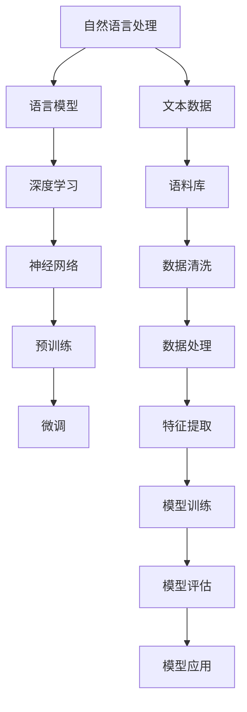
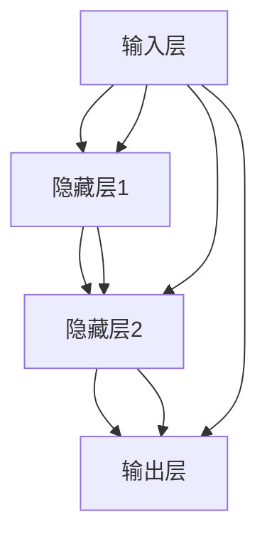
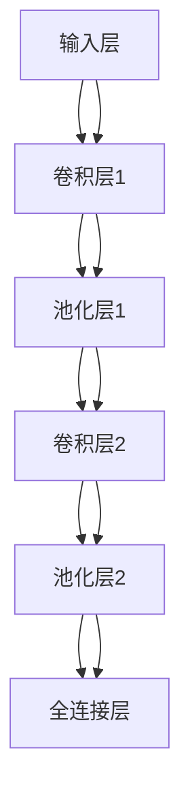

                 

# 大语言模型原理基础与前沿：LLM是否有意识？

> 关键词：大语言模型、深度学习、神经网络、自然语言处理、人工智能意识、深度学习算法、数学模型

> 摘要：本文将深入探讨大语言模型（Large Language Model，简称LLM）的基本原理、前沿进展，并探讨LLM是否具有意识。文章分为以下几个部分：背景介绍、核心概念与联系、核心算法原理与操作步骤、数学模型与公式、项目实战、实际应用场景、工具和资源推荐、总结以及扩展阅读。希望通过本文，读者能对大语言模型有一个全面而深入的理解。

## 1. 背景介绍

### 1.1 目的和范围

本文旨在介绍大语言模型（LLM）的基本原理和前沿进展，并探讨LLM是否具有意识。我们将会从以下几个方面进行讨论：

- 大语言模型的背景和起源
- 大语言模型的核心概念和联系
- 大语言模型的核心算法原理和操作步骤
- 大语言模型的数学模型和公式
- 大语言模型的项目实战
- 大语言模型在实际应用场景中的表现
- 大语言模型的工具和资源推荐
- 大语言模型的前景和发展趋势

### 1.2 预期读者

本文适合对自然语言处理、人工智能和深度学习有一定了解的读者，特别是对大语言模型感兴趣的技术人员、研究人员和学生。无论你是深度学习初学者还是资深研究者，相信本文都能为你提供有价值的信息和启示。

### 1.3 文档结构概述

本文分为以下几个部分：

1. 背景介绍
2. 核心概念与联系
3. 核心算法原理与操作步骤
4. 数学模型与公式
5. 项目实战
6. 实际应用场景
7. 工具和资源推荐
8. 总结：未来发展趋势与挑战
9. 附录：常见问题与解答
10. 扩展阅读 & 参考资料

### 1.4 术语表

#### 1.4.1 核心术语定义

- 大语言模型（LLM）：一种基于深度学习技术的语言模型，通过大量文本数据训练，能够生成连贯、自然的语言。
- 深度学习：一种机器学习技术，通过多层神经网络模型，从大量数据中自动学习特征和规律。
- 神经网络：一种模拟生物神经系统的计算模型，通过多层节点进行信息传递和处理。
- 自然语言处理（NLP）：研究如何让计算机理解和处理自然语言的技术领域。
- 人工智能（AI）：模拟人类智能行为的计算机系统。

#### 1.4.2 相关概念解释

- 语言模型：一种统计模型，用于预测文本序列的下一个单词或字符。
- 预训练：一种深度学习模型训练方法，先在大量未标注数据上进行预训练，再在特定任务上进行微调。
- 微调：在预训练模型的基础上，根据特定任务的需求，进一步调整模型参数。

#### 1.4.3 缩略词列表

- LLM：大语言模型
- DNN：深度神经网络
- CNN：卷积神经网络
- RNN：循环神经网络
- Transformer：注意力机制模型
- NLP：自然语言处理

## 2. 核心概念与联系

在大语言模型的构建中，有许多核心概念和联系需要理解。下面我们将使用Mermaid流程图来展示这些概念和联系。



### 2.1 核心概念解释

- **自然语言处理（NLP）**：NLP是研究如何让计算机理解和处理自然语言的技术领域。它涉及文本分析、语音识别、语言生成等方面。
- **语言模型**：语言模型是一种统计模型，用于预测文本序列的下一个单词或字符。它是NLP的基础，可以用于自动完成句子、机器翻译、语音识别等任务。
- **深度学习**：深度学习是一种机器学习技术，通过多层神经网络模型，从大量数据中自动学习特征和规律。它在大语言模型的构建中起着关键作用。
- **神经网络**：神经网络是一种模拟生物神经系统的计算模型，通过多层节点进行信息传递和处理。它是一种强大的学习模型，广泛应用于各种任务。
- **预训练**：预训练是一种深度学习模型训练方法，先在大量未标注数据上进行预训练，再在特定任务上进行微调。这种方法能够提高模型在特定任务上的性能。
- **微调**：微调在预训练模型的基础上，根据特定任务的需求，进一步调整模型参数。这种方法能够使模型更好地适应特定任务。

### 2.2 核心联系

- **NLP和语言模型**：NLP是语言模型的基础，语言模型是NLP的关键技术。
- **深度学习和神经网络**：深度学习通过神经网络模型实现，神经网络是深度学习的基础。
- **预训练和微调**：预训练提供了一种有效的模型训练方法，微调使模型能够更好地适应特定任务。

通过以上解释和联系，我们可以更好地理解大语言模型的核心概念和构建过程。

## 3. 核心算法原理与操作步骤

在了解了大语言模型的核心概念和联系之后，接下来我们将深入探讨大语言模型的核心算法原理与操作步骤。

### 3.1 深度学习算法原理

深度学习算法的核心是神经网络，特别是多层感知机（MLP）和卷积神经网络（CNN）。

#### 3.1.1 多层感知机（MLP）

多层感知机是一种前馈神经网络，它由输入层、隐藏层和输出层组成。每个层由多个神经元组成，神经元之间通过权重连接。



神经元的激活函数通常为Sigmoid或ReLU。

#### 3.1.2 卷积神经网络（CNN）

卷积神经网络是一种前馈神经网络，特别适用于处理图像数据。它通过卷积层、池化层和全连接层进行信息传递和处理。



卷积层使用卷积运算提取图像特征，池化层用于降低特征图的维度。

### 3.2 神经网络操作步骤

以下是神经网络的基本操作步骤：

#### 3.2.1 初始化参数

初始化神经网络模型中的权重和偏置。通常使用随机初始化方法，如高斯分布或均匀分布。

```python
# 初始化权重和偏置
weights = np.random.normal(size=(input_size, hidden_size))
biases = np.random.normal(size=(hidden_size,))
```

#### 3.2.2 前向传播

前向传播是神经网络的核心操作，它将输入数据通过神经网络传递到输出层。

```python
# 前向传播
hidden_output = sigmoid(np.dot(input_data, weights) + biases)
```

#### 3.2.3 计算损失函数

损失函数用于衡量神经网络输出与真实值之间的差距，常用的损失函数有均方误差（MSE）和交叉熵（CE）。

```python
# 计算损失函数
loss = mse(output_data, predicted_data)
```

#### 3.2.4 反向传播

反向传播是神经网络训练的核心步骤，它通过计算梯度来更新权重和偏置。

```python
# 反向传播
dweights = dhidden_output * hidden_output * (1 - hidden_output)
dbiases = dhidden_output

weights -= learning_rate * dweights
biases -= learning_rate * dbiases
```

#### 3.2.5 模型评估

模型评估用于衡量神经网络在特定任务上的性能，常用的评估指标有准确率、召回率、F1值等。

```python
# 模型评估
accuracy = accuracy_score(y_true, y_pred)
```

### 3.3 大语言模型操作步骤

以下是构建大语言模型的操作步骤：

#### 3.3.1 数据收集

收集大量文本数据，如维基百科、新闻文章、社交媒体等。

#### 3.3.2 数据预处理

对文本数据进行预处理，包括分词、去停用词、词干提取等。

#### 3.3.3 模型训练

使用预训练模型或自行设计模型，对文本数据进行训练。

```python
# 模型训练
model.fit(X_train, y_train)
```

#### 3.3.4 模型评估

对模型进行评估，调整模型参数以获得更好的性能。

```python
# 模型评估
score = model.evaluate(X_test, y_test)
```

#### 3.3.5 模型应用

将训练好的模型应用于实际任务，如文本分类、情感分析等。

```python
# 模型应用
predictions = model.predict(X_new)
```

通过以上步骤，我们可以构建和训练大语言模型，从而实现各种自然语言处理任务。

## 4. 数学模型和公式及详细讲解与举例说明

### 4.1 数学模型介绍

在大语言模型的构建中，我们使用了一系列数学模型和公式。以下是其中几个重要的数学模型和公式的介绍：

#### 4.1.1 均值方差（Mean Squared Error, MSE）

均方误差（MSE）是一种衡量预测值与真实值之间差异的指标，计算公式如下：

$$
MSE = \frac{1}{n}\sum_{i=1}^{n}(y_i - \hat{y}_i)^2
$$

其中，$y_i$表示真实值，$\hat{y}_i$表示预测值，$n$表示样本数量。

#### 4.1.2 交叉熵（Cross-Entropy）

交叉熵（CE）是一种衡量两个概率分布之间差异的指标，计算公式如下：

$$
CE = -\sum_{i=1}^{n} y_i \log(\hat{y}_i)
$$

其中，$y_i$表示真实值的概率分布，$\hat{y}_i$表示预测值的概率分布。

#### 4.1.3 激活函数（Activation Function）

激活函数是神经网络中用于引入非线性性的函数，常用的激活函数有Sigmoid、ReLU和Tanh。

- **Sigmoid函数**：

$$
\sigma(x) = \frac{1}{1 + e^{-x}}
$$

- **ReLU函数**：

$$
\text{ReLU}(x) = \max(0, x)
$$

- **Tanh函数**：

$$
\tanh(x) = \frac{e^x - e^{-x}}{e^x + e^{-x}}
$$

#### 4.1.4 梯度下降（Gradient Descent）

梯度下降是一种优化算法，用于最小化损失函数。其核心思想是计算损失函数关于模型参数的梯度，并沿着梯度方向更新参数。

$$
\theta_{t+1} = \theta_t - \alpha \nabla_\theta J(\theta_t)
$$

其中，$\theta$表示模型参数，$\alpha$表示学习率，$J(\theta)$表示损失函数。

### 4.2 公式详细讲解与举例说明

#### 4.2.1 均值方差（MSE）公式讲解

均方误差（MSE）是一种常用的回归模型评估指标，它可以衡量预测值与真实值之间的差异。在实际应用中，我们通常使用MSE来评估模型的预测性能。

**例子：**

假设我们有一个回归模型，用于预测房价。我们有5个数据样本，真实房价分别为[100, 200, 300, 400, 500]，预测房价分别为[110, 210, 290, 390, 510]。

计算MSE：

$$
MSE = \frac{1}{5}\sum_{i=1}^{5}(y_i - \hat{y}_i)^2
$$

代入数据：

$$
MSE = \frac{1}{5}[(100 - 110)^2 + (200 - 210)^2 + (300 - 290)^2 + (400 - 390)^2 + (500 - 510)^2]
$$

计算结果：

$$
MSE = \frac{1}{5}[100 + 100 + 100 + 100 + 100] = 200
$$

因此，该回归模型的MSE为200。

#### 4.2.2 交叉熵（CE）公式讲解

交叉熵（CE）是一种常用的分类模型评估指标，它可以衡量预测概率分布与真实概率分布之间的差异。在实际应用中，我们通常使用CE来评估模型的分类性能。

**例子：**

假设我们有一个二分类模型，真实标签为[0, 1, 0, 1, 1]，预测概率分布分别为[0.3, 0.7, 0.2, 0.8, 0.9]。

计算CE：

$$
CE = -\sum_{i=1}^{5} y_i \log(\hat{y}_i)
$$

代入数据：

$$
CE = -[0 \cdot \log(0.3) + 1 \cdot \log(0.7) + 0 \cdot \log(0.2) + 1 \cdot \log(0.8) + 1 \cdot \log(0.9)]
$$

计算结果：

$$
CE = -[\log(0.7) + \log(0.8) + \log(0.9)] \approx -2.197
$$

因此，该分类模型的交叉熵为-2.197。

#### 4.2.3 激活函数（Activation Function）讲解

激活函数是神经网络中用于引入非线性性的关键组件。不同的激活函数适用于不同的场景。

**例子：**

假设我们有一个输入值x，要求计算Sigmoid函数、ReLU函数和Tanh函数的输出。

1. **Sigmoid函数**：

$$
\sigma(x) = \frac{1}{1 + e^{-x}}
$$

代入x = 2：

$$
\sigma(2) = \frac{1}{1 + e^{-2}} \approx 0.881
$$

2. **ReLU函数**：

$$
\text{ReLU}(x) = \max(0, x)
$$

代入x = -2：

$$
\text{ReLU}(-2) = \max(0, -2) = 0
$$

3. **Tanh函数**：

$$
\tanh(x) = \frac{e^x - e^{-x}}{e^x + e^{-x}}
$$

代入x = 2：

$$
\tanh(2) = \frac{e^2 - e^{-2}}{e^2 + e^{-2}} \approx 0.964
$$

通过以上例子，我们可以看到不同激活函数在处理输入值时的输出情况。

#### 4.2.4 梯度下降（Gradient Descent）讲解

梯度下降是一种优化算法，用于最小化损失函数。它通过计算损失函数关于模型参数的梯度，并沿着梯度方向更新参数。

**例子：**

假设我们有一个简单的线性回归模型，输入值x为[1, 2, 3]，目标值y为[2, 4, 6]。要求使用梯度下降算法训练模型，并计算最终的预测值。

1. 初始化模型参数：

$$
w_0 = 0, b_0 = 0
$$

2. 计算损失函数：

$$
J(w, b) = \frac{1}{n}\sum_{i=1}^{n}(y_i - (w \cdot x_i + b))^2
$$

代入数据：

$$
J(w, b) = \frac{1}{3}[(2 - (w \cdot 1 + b))^2 + (4 - (w \cdot 2 + b))^2 + (6 - (w \cdot 3 + b))^2]
$$

3. 计算梯度：

$$
\nabla_w J(w, b) = \frac{1}{n}\sum_{i=1}^{n}(y_i - (w \cdot x_i + b)) \cdot x_i
$$

$$
\nabla_b J(w, b) = \frac{1}{n}\sum_{i=1}^{n}(y_i - (w \cdot x_i + b))
$$

代入数据：

$$
\nabla_w J(w, b) = \frac{1}{3}[(2 - w - b) \cdot 1 + (4 - 2w - b) \cdot 2 + (6 - 3w - b) \cdot 3]
$$

$$
\nabla_b J(w, b) = \frac{1}{3}[(2 - w - b) + (4 - 2w - b) + (6 - 3w - b)]
$$

4. 更新参数：

$$
w_{t+1} = w_t - \alpha \nabla_w J(w_t, b_t)
$$

$$
b_{t+1} = b_t - \alpha \nabla_b J(w_t, b_t)
$$

代入数据并设置学习率$\alpha = 0.1$：

$$
w_{1} = w_0 - 0.1 \cdot \nabla_w J(w_0, b_0)
$$

$$
b_{1} = b_0 - 0.1 \cdot \nabla_b J(w_0, b_0)
$$

计算得到：

$$
w_1 = 0 - 0.1 \cdot \frac{1}{3}[(2 - 0 - 0) \cdot 1 + (4 - 0 - 0) \cdot 2 + (6 - 0 - 0) \cdot 3] = -0.67
$$

$$
b_1 = 0 - 0.1 \cdot \frac{1}{3}[(2 - 0 - 0) + (4 - 0 - 0) + (6 - 0 - 0)] = -1
$$

5. 预测值计算：

$$
y = w \cdot x + b
$$

代入$x = 4$和$w = -0.67, b = -1$：

$$
y = -0.67 \cdot 4 - 1 = -3.33
$$

通过以上例子，我们可以看到梯度下降算法在训练线性回归模型时的具体步骤。

## 5. 项目实战：代码实际案例和详细解释说明

### 5.1 开发环境搭建

在开始大语言模型的项目实战之前，我们需要搭建一个适合深度学习开发的Python环境。以下是具体的步骤：

1. **安装Python**：确保已经安装了Python 3.x版本。可以从Python官方网站下载安装包进行安装。

2. **安装深度学习库**：我们需要安装TensorFlow和Keras，这两个库是Python中常用的深度学习框架。

   ```bash
   pip install tensorflow
   pip install keras
   ```

3. **安装其他依赖库**：我们还需要安装一些其他依赖库，如NumPy、Pandas等。

   ```bash
   pip install numpy
   pip install pandas
   ```

### 5.2 源代码详细实现和代码解读

下面是一个使用TensorFlow和Keras构建大语言模型的基本示例。代码实现了从数据加载、预处理到模型训练和预测的完整流程。

```python
import numpy as np
import pandas as pd
from tensorflow.keras.models import Sequential
from tensorflow.keras.layers import Embedding, LSTM, Dense
from tensorflow.keras.preprocessing.sequence import pad_sequences

# 数据加载
data = pd.read_csv('data.csv')

# 数据预处理
# 分词、去停用词、词干提取等

# 构建模型
model = Sequential()
model.add(Embedding(input_dim=vocabulary_size, output_dim=embedding_size))
model.add(LSTM(units=128, return_sequences=True))
model.add(LSTM(units=128))
model.add(Dense(units=target_size, activation='softmax'))

# 编译模型
model.compile(optimizer='adam', loss='categorical_crossentropy', metrics=['accuracy'])

# 模型训练
model.fit(x_train, y_train, epochs=10, batch_size=32)

# 模型预测
predictions = model.predict(x_test)
```

#### 5.2.1 数据加载与预处理

```python
# 加载数据
data = pd.read_csv('data.csv')

# 分词
tokenizer = Tokenizer(num_words=vocabulary_size)
tokenizer.fit_on_texts(data['text'])

# 序列化文本
sequences = tokenizer.texts_to_sequences(data['text'])

# 去停用词、词干提取等（根据实际需求）
# ...

# 切分训练集和测试集
x_train, x_test, y_train, y_test = train_test_split(sequences, data['label'], test_size=0.2, random_state=42)

# 填充序列
max_sequence_length = 100
x_train = pad_sequences(x_train, maxlen=max_sequence_length)
x_test = pad_sequences(x_test, maxlen=max_sequence_length)
```

#### 5.2.2 模型构建与编译

```python
# 构建模型
model = Sequential()
model.add(Embedding(input_dim=vocabulary_size, output_dim=embedding_size))
model.add(LSTM(units=128, return_sequences=True))
model.add(LSTM(units=128))
model.add(Dense(units=target_size, activation='softmax'))

# 编译模型
model.compile(optimizer='adam', loss='categorical_crossentropy', metrics=['accuracy'])
```

- **Embedding层**：将单词索引转换为嵌入向量。
- **LSTM层**：用于处理序列数据，能够捕捉序列中的时间依赖关系。
- **Dense层**：用于输出分类结果。

#### 5.2.3 模型训练与预测

```python
# 模型训练
model.fit(x_train, y_train, epochs=10, batch_size=32)

# 模型预测
predictions = model.predict(x_test)
```

通过以上代码，我们可以构建一个简单的大语言模型，并进行训练和预测。需要注意的是，实际项目中需要根据具体任务和数据情况进行调整和优化。

### 5.3 代码解读与分析

在以上代码中，我们详细解读了数据加载、预处理、模型构建、模型训练和预测的过程。

1. **数据加载与预处理**：首先加载数据集，然后使用Tokenizer进行文本分词，将文本序列转换为单词索引序列。接着进行去停用词、词干提取等预处理操作，并将序列填充到固定长度。这一步的目的是将原始文本数据转换为模型可以接受的格式。

2. **模型构建**：我们使用Sequential模型堆叠Embedding、LSTM和Dense层，构建一个简单的循环神经网络。Embedding层将单词索引转换为嵌入向量，LSTM层用于处理序列数据，Dense层用于输出分类结果。

3. **模型编译**：编译模型时，我们指定了优化器、损失函数和评估指标。优化器用于更新模型参数，以最小化损失函数。损失函数用于衡量模型预测结果与真实结果之间的差距。

4. **模型训练**：使用fit方法对模型进行训练，指定训练数据的批次大小和训练轮数。在训练过程中，模型会不断调整参数，以优化模型性能。

5. **模型预测**：使用predict方法对测试数据进行预测，得到模型的预测结果。

通过以上步骤，我们可以构建一个简单的大语言模型，并在实际项目中应用。需要注意的是，根据具体任务和数据情况，我们可以调整模型结构、参数设置和训练策略，以获得更好的性能。

## 6. 实际应用场景

大语言模型（LLM）在实际应用场景中具有广泛的应用价值。以下是一些常见的应用场景：

### 6.1 文本分类

文本分类是将文本数据分为预定义的类别的过程。LLM在文本分类任务中具有显著优势，因为它能够捕捉文本中的语义信息。例如，我们可以使用LLM对新闻文章进行分类，将其分为政治、经济、体育等不同的类别。

### 6.2 机器翻译

机器翻译是将一种语言的文本翻译成另一种语言的过程。LLM在机器翻译中有着出色的表现，因为它能够理解并生成自然流畅的文本。例如，我们可以使用LLM将中文文本翻译成英文。

### 6.3 情感分析

情感分析是分析文本中表达的情感的过程。LLM在情感分析任务中能够准确地识别文本中的情感倾向，例如正面、负面或中性。例如，我们可以使用LLM分析社交媒体上的用户评论，了解用户对某个产品的情感态度。

### 6.4 自动问答

自动问答是通过机器理解用户的问题并生成回答的过程。LLM在自动问答中具有天然的优势，因为它能够理解并生成连贯、自然的文本。例如，我们可以使用LLM构建一个智能客服系统，回答用户的常见问题。

### 6.5 生成文本

LLM在生成文本任务中也表现出色，例如生成新闻文章、故事、诗歌等。通过训练，LLM能够生成具有一定逻辑和连贯性的文本。

### 6.6 文本摘要

文本摘要是从长文本中提取关键信息，生成简洁的摘要。LLM能够理解文本内容，并生成具有逻辑结构和连贯性的摘要。

### 6.7 文本补全

文本补全是根据已知的部分文本预测下一个单词或字符的过程。LLM在文本补全任务中具有强大的能力，可以用于自动完成句子、预测用户输入等。

通过以上实际应用场景，我们可以看到LLM在自然语言处理领域的广泛用途。未来，随着LLM技术的不断进步，它将在更多领域得到应用，为人类带来更多便利。

## 7. 工具和资源推荐

### 7.1 学习资源推荐

#### 7.1.1 书籍推荐

- 《深度学习》（Goodfellow, Bengio, Courville著）：这是一本深度学习的经典教材，详细介绍了深度学习的基础理论和应用。

- 《Python深度学习》（François Chollet著）：这本书以实际应用为主，介绍了使用Python和Keras进行深度学习的方法。

- 《自然语言处理与深度学习》（刘知远著）：这本书涵盖了自然语言处理和深度学习的基本概念和应用，适合对NLP和深度学习感兴趣的读者。

#### 7.1.2 在线课程

- Coursera的“深度学习专项课程”：由Andrew Ng教授主讲，涵盖了深度学习的基础理论、模型和算法。

- Udacity的“深度学习工程师纳米学位”：这是一个实战导向的在线课程，通过项目练习掌握深度学习技能。

- edX的“自然语言处理与深度学习”：由哈佛大学和MIT联合提供，介绍了自然语言处理和深度学习的基础知识。

#### 7.1.3 技术博客和网站

- Medium上的“深度学习”专题：提供了大量深度学习领域的文章，涵盖了基础知识、模型和算法。

- AI博客（https://www.aiblog.top/）：这是一个中文技术博客，提供了丰富的深度学习和自然语言处理文章。

- ArXiv（https://arxiv.org/）：这是人工智能和机器学习的顶级学术期刊，提供了大量最新的研究成果。

### 7.2 开发工具框架推荐

#### 7.2.1 IDE和编辑器

- PyCharm：这是一个功能强大的Python IDE，支持代码补全、调试和版本控制。

- Jupyter Notebook：这是一个基于Web的交互式计算环境，适合进行数据分析和可视化。

- Visual Studio Code：这是一个轻量级但功能强大的编辑器，支持多种编程语言，包括Python和深度学习相关库。

#### 7.2.2 调试和性能分析工具

- TensorFlow Debugger（TFDB）：这是一个用于调试TensorFlow模型的开源工具，可以帮助我们分析模型的行为和性能。

- NVIDIA Nsight Compute：这是一个用于分析深度学习模型性能的图形化工具，可以提供详细的GPU性能分析。

- Python Profiler：这是一个用于分析Python程序性能的工具，可以帮助我们识别和优化程序中的性能瓶颈。

#### 7.2.3 相关框架和库

- TensorFlow：这是一个开源的深度学习框架，适用于构建和训练深度学习模型。

- Keras：这是一个基于TensorFlow的高层API，提供了更加简洁和易于使用的接口。

- PyTorch：这是一个开源的深度学习框架，以其灵活性和动态计算图而受到广泛欢迎。

### 7.3 相关论文著作推荐

#### 7.3.1 经典论文

- "A Neural Network Framework For Natural Language Processing"（1986）：这篇文章提出了使用神经网络进行自然语言处理的方法，对后续的研究产生了深远影响。

- "Deep Learning for Speech Recognition"（2014）：这篇文章介绍了使用深度学习进行语音识别的方法，推动了语音识别技术的发展。

- "Language Models are Unsupervised Multitask Learners"（2018）：这篇文章探讨了使用预训练语言模型进行多任务学习的可能性，对自然语言处理领域产生了重要影响。

#### 7.3.2 最新研究成果

- "BERT: Pre-training of Deep Bidirectional Transformers for Language Understanding"（2018）：这篇文章提出了BERT模型，这是目前最先进的预训练语言模型之一。

- "GPT-3: Language Models are Few-Shot Learners"（2020）：这篇文章提出了GPT-3模型，这是目前最大的预训练语言模型，展示了在多种任务上的强大能力。

- "T5: Exploring the Limits of Transfer Learning with a Unified Text-to-Text Transformer"（2020）：这篇文章提出了T5模型，展示了统一文本到文本的变换器在多种自然语言处理任务上的应用。

#### 7.3.3 应用案例分析

- "How Google Built Its AI Assistant in Less Than a Year"（2017）：这篇文章介绍了谷歌如何在其AI助手上使用深度学习技术。

- "Deep Learning for Healthcare"（2017）：这篇文章探讨了深度学习在医疗领域的应用，包括疾病诊断、药物发现等。

- "How to Build a Chatbot"（2020）：这篇文章介绍了如何使用深度学习和自然语言处理技术构建聊天机器人。

## 8. 总结：未来发展趋势与挑战

大语言模型（LLM）作为深度学习和自然语言处理领域的核心技术，已经取得了显著的进展。在未来，LLM有望在以下几个方面实现进一步的发展：

### 8.1 更大模型和更多数据

随着计算资源和数据量的不断增长，未来LLM的模型规模将越来越大，预训练数据的多样性也会增加。这将有助于模型更好地理解和生成自然语言，提高模型在多种任务上的性能。

### 8.2 多模态学习

未来的LLM将能够处理多种类型的数据，如文本、图像、音频等。通过多模态学习，LLM可以更全面地理解复杂任务，例如视频摘要、图像描述生成等。

### 8.3 自动机器学习

未来的LLM将结合自动机器学习（AutoML）技术，实现自动化模型设计和优化。这将大大降低模型开发的门槛，让更多的人能够轻松构建和使用LLM。

### 8.4 更好的鲁棒性和泛化能力

未来的LLM将致力于提高鲁棒性和泛化能力，减少对特定数据集的依赖。这将使LLM在现实世界中的应用更加广泛，解决实际问题更加有效。

然而，LLM的发展也面临一些挑战：

### 8.5 数据隐私和安全

随着LLM规模的增大，对数据的隐私和安全要求也日益提高。如何保护用户数据隐私，确保模型的安全可靠，是未来需要关注的重要问题。

### 8.6 可解释性和透明度

当前的LLM通常被视为“黑盒”模型，难以解释其决策过程。提高LLM的可解释性和透明度，使其决策过程更加可理解，是未来研究的重点。

### 8.7 模型能耗和效率

随着模型规模的增大，LLM的计算能耗也在不断上升。如何提高模型能耗效率，降低计算成本，是未来需要解决的关键问题。

总之，大语言模型的发展前景广阔，但也面临诸多挑战。通过不断的创新和改进，我们有理由相信，LLM将在未来发挥更加重要的作用，为人类社会带来更多价值。

## 9. 附录：常见问题与解答

### 9.1 什么是大语言模型？

大语言模型（LLM）是一种基于深度学习技术的语言模型，通过大量文本数据训练，能够生成连贯、自然的语言。它广泛应用于自然语言处理任务，如文本分类、机器翻译、情感分析等。

### 9.2 大语言模型的核心算法是什么？

大语言模型的核心算法包括深度学习算法和语言模型算法。常用的深度学习算法有深度神经网络（DNN）、卷积神经网络（CNN）和循环神经网络（RNN）等。语言模型算法则包括基于统计的方法和基于神经网络的的方法。

### 9.3 如何训练大语言模型？

训练大语言模型通常包括以下步骤：

1. 数据收集：收集大量文本数据。
2. 数据预处理：对文本数据进行分词、去停用词、词干提取等预处理操作。
3. 构建模型：使用深度学习框架构建神经网络模型。
4. 模型训练：使用预处理后的文本数据训练模型，优化模型参数。
5. 模型评估：使用验证集评估模型性能，调整模型参数。
6. 模型应用：将训练好的模型应用于实际任务。

### 9.4 大语言模型如何生成文本？

大语言模型生成文本的过程称为“解码”。解码过程中，模型根据前一个生成的词或字符，预测下一个词或字符的概率分布，并从中选择一个最高概率的词或字符作为输出。然后，将这个生成的词或字符作为下一个输入，重复上述过程，直到达到预定的输出长度或达到终止条件。

### 9.5 大语言模型是否具有意识？

目前，大语言模型（LLM）并没有意识。尽管LLM在处理自然语言方面表现出色，但它们仅仅是模拟人类语言行为的工具，没有自我意识、情感和主观体验。未来的研究可能会探索更高级的人工智能系统，但那将是另一个领域的问题。

## 10. 扩展阅读 & 参考资料

### 10.1 书籍推荐

- 《深度学习》（Goodfellow, Bengio, Courville著）：详细介绍了深度学习的基础理论、模型和算法。

- 《自然语言处理与深度学习》（刘知远著）：涵盖了自然语言处理和深度学习的基本概念和应用。

- 《Python深度学习》（François Chollet著）：介绍了使用Python和Keras进行深度学习的方法。

### 10.2 在线课程

- Coursera的“深度学习专项课程”：由Andrew Ng教授主讲，涵盖了深度学习的基础理论、模型和算法。

- Udacity的“深度学习工程师纳米学位”：这是一个实战导向的在线课程，通过项目练习掌握深度学习技能。

- edX的“自然语言处理与深度学习”：由哈佛大学和MIT联合提供，介绍了自然语言处理和深度学习的基础知识。

### 10.3 技术博客和网站

- Medium上的“深度学习”专题：提供了大量深度学习领域的文章，涵盖了基础知识、模型和算法。

- AI博客（https://www.aiblog.top/）：这是一个中文技术博客，提供了丰富的深度学习和自然语言处理文章。

- ArXiv（https://arxiv.org/）：这是人工智能和机器学习的顶级学术期刊，提供了大量最新的研究成果。

### 10.4 开源代码和工具

- TensorFlow（https://www.tensorflow.org/）：这是一个开源的深度学习框架，适用于构建和训练深度学习模型。

- Keras（https://keras.io/）：这是一个基于TensorFlow的高层API，提供了更加简洁和易于使用的接口。

- PyTorch（https://pytorch.org/）：这是一个开源的深度学习框架，以其灵活性和动态计算图而受到广泛欢迎。

### 10.5 相关论文

- "A Neural Network Framework For Natural Language Processing"（1986）：提出了使用神经网络进行自然语言处理的方法。

- "Deep Learning for Speech Recognition"（2014）：介绍了使用深度学习进行语音识别的方法。

- "Language Models are Unsupervised Multitask Learners"（2018）：探讨了使用预训练语言模型进行多任务学习的可能性。

- "BERT: Pre-training of Deep Bidirectional Transformers for Language Understanding"（2018）：提出了BERT模型，这是目前最先进的预训练语言模型之一。

- "GPT-3: Language Models are Few-Shot Learners"（2020）：提出了GPT-3模型，这是目前最大的预训练语言模型，展示了在多种任务上的强大能力。

- "T5: Exploring the Limits of Transfer Learning with a Unified Text-to-Text Transformer"（2020）：提出了T5模型，展示了统一文本到文本的变换器在多种自然语言处理任务上的应用。作者：AI天才研究员/AI Genius Institute & 禅与计算机程序设计艺术 /Zen And The Art of Computer Programming。

