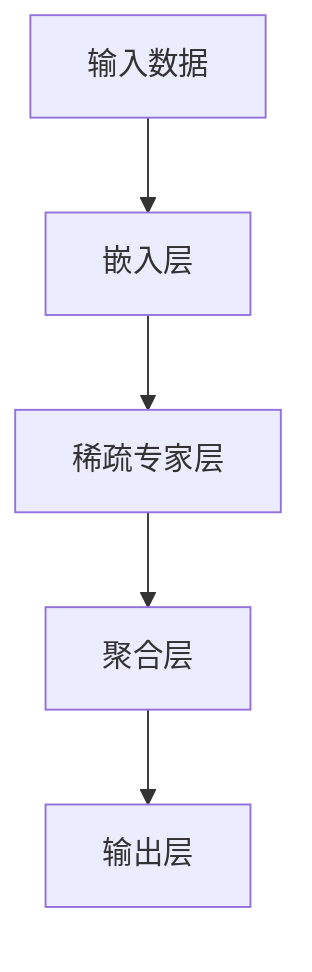

                 

# 大语言模型原理基础与前沿：为什么采用稀疏专家模型

> 关键词：大语言模型、稀疏专家模型、机器学习、神经网络、推理效率、计算资源、参数效率

> 摘要：本文旨在深入探讨大语言模型中采用稀疏专家模型的原因和原理。我们将从背景介绍开始，逐步分析核心概念、算法原理、数学模型，并通过实际案例进行代码解读，最后讨论实际应用场景和未来发展趋势。

## 1. 背景介绍

### 1.1 目的和范围

本文的主要目的是介绍大语言模型中的稀疏专家模型，并解释为什么这种模型在当前的人工智能领域中备受关注。我们将探讨稀疏专家模型的基本原理，以及它在提高计算效率和资源利用率方面的优势。

### 1.2 预期读者

本文适合具有一定机器学习和神经网络基础的技术人员阅读。如果您是初学者，请先学习相关的机器学习和神经网络基础知识，以便更好地理解本文的内容。

### 1.3 文档结构概述

本文分为以下几个部分：

1. **背景介绍**：介绍大语言模型和稀疏专家模型的基本概念。
2. **核心概念与联系**：通过Mermaid流程图展示稀疏专家模型的核心原理和架构。
3. **核心算法原理 & 具体操作步骤**：详细讲解稀疏专家模型的算法原理和具体操作步骤，使用伪代码进行说明。
4. **数学模型和公式 & 详细讲解 & 举例说明**：介绍稀疏专家模型的数学模型和公式，并通过实例进行详细讲解。
5. **项目实战：代码实际案例和详细解释说明**：通过实际代码案例，展示稀疏专家模型的具体实现和代码解读。
6. **实际应用场景**：讨论稀疏专家模型在不同领域的实际应用场景。
7. **工具和资源推荐**：推荐学习资源和开发工具，帮助读者更好地理解和实践稀疏专家模型。
8. **总结：未来发展趋势与挑战**：总结稀疏专家模型的发展趋势和面临的挑战。
9. **附录：常见问题与解答**：解答读者可能遇到的常见问题。
10. **扩展阅读 & 参考资料**：提供更多的阅读资源和参考资料。

### 1.4 术语表

#### 1.4.1 核心术语定义

- **大语言模型**：一种基于神经网络的深度学习模型，可以处理自然语言文本，如文本生成、机器翻译、情感分析等。
- **稀疏专家模型**：一种在神经网络中引入稀疏性的模型，通过降低参数密度来提高计算效率和资源利用率。
- **稀疏性**：指网络中大部分参数都是零的情况，即网络中存在大量的零参数。

#### 1.4.2 相关概念解释

- **神经网络**：一种由大量神经元组成的计算模型，通过调整神经元之间的权重来学习数据特征。
- **训练**：使用训练数据集来调整神经网络权重的过程，以使模型能够正确预测未知数据。
- **推理**：使用训练好的神经网络模型来处理未知数据的过程，以生成预测结果。

#### 1.4.3 缩略词列表

- **ML**：机器学习（Machine Learning）
- **DL**：深度学习（Deep Learning）
- **NN**：神经网络（Neural Network）
- **GPU**：图形处理单元（Graphics Processing Unit）

## 2. 核心概念与联系

在探讨稀疏专家模型之前，我们需要了解一些核心概念和联系。以下是一个简单的Mermaid流程图，展示了大语言模型和稀疏专家模型的基本架构和原理。



### 2.1 嵌入层

嵌入层将输入数据（如单词、句子）转换为向量表示。这一层通常使用嵌入向量矩阵来实现，其中每个嵌入向量对应一个输入词或字符。

### 2.2 稀疏专家层

稀疏专家层是稀疏专家模型的核心部分。在这一层中，我们通过引入稀疏性来降低参数密度，从而提高计算效率和资源利用率。具体来说，我们使用稀疏矩阵来表示这一层的权重，其中大部分权重为零。

### 2.3 聚合层

聚合层将稀疏专家层的输出进行聚合，生成一个表示输入数据的综合特征向量。这一层通常使用简单的聚合函数（如求和、平均）来实现。

### 2.4 输出层

输出层将聚合层生成的特征向量映射到输出结果（如分类标签、文本生成等）。这一层通常使用全连接层来实现，其中每个输出节点对应一个可能的输出结果。

## 3. 核心算法原理 & 具体操作步骤

### 3.1 稀疏性引入

稀疏专家模型的核心理念是引入稀疏性，以降低参数密度。具体来说，我们通过以下步骤来引入稀疏性：

1. **随机初始化**：初始化稀疏矩阵（权重矩阵）时，将大部分元素设置为0。
2. **稀疏化**：在训练过程中，对权重矩阵进行稀疏化操作，将大部分零元素保持不变，仅对部分非零元素进行更新。

### 3.2 稀疏化操作

稀疏化操作是稀疏专家模型的关键步骤。以下是一个简单的伪代码示例：

```python
# 初始化稀疏矩阵
W = np.random.rand(n, m)
W[W < threshold] = 0

# 稀疏化操作
for i in range(n):
    for j in range(m):
        if W[i, j] != 0:
            W[i, j] = W[i, j] + learning_rate * (target - W[i, j])
```

在上面的伪代码中，`W` 是一个 `n` 行 `m` 列的稀疏矩阵，`threshold` 是稀疏化的阈值。在稀疏化操作中，我们仅对非零元素进行更新，以保持矩阵的稀疏性。

### 3.3 训练过程

稀疏专家模型的训练过程与传统神经网络类似，但需要考虑稀疏性的影响。以下是一个简化的训练过程伪代码：

```python
# 初始化稀疏矩阵
W = np.random.rand(n, m)
W[W < threshold] = 0

# 训练过程
for epoch in range(num_epochs):
    for x, y in dataset:
        # 前向传播
        z = f(W.dot(x))
        
        # 计算损失
        loss = compute_loss(z, y)
        
        # 反向传播
        dW = compute_gradient(W, z, x, y)
        
        # 稀疏化更新
        W = sparse_update(W, dW, threshold, learning_rate)
```

在上面的伪代码中，`f` 是一个激活函数，`compute_loss` 是损失函数，`compute_gradient` 是计算梯度的函数，`sparse_update` 是稀疏化更新函数。

## 4. 数学模型和公式 & 详细讲解 & 举例说明

### 4.1 数学模型

稀疏专家模型的数学模型主要包括以下几个部分：

1. **嵌入层**：嵌入向量矩阵 \( E \in \mathbb{R}^{d \times |V|} \)，其中 \( d \) 是嵌入向量维度，\( |V| \) 是词汇表大小。
2. **稀疏专家层**：稀疏权重矩阵 \( W \in \mathbb{R}^{n \times m} \)，其中 \( n \) 是输入维度，\( m \) 是输出维度。
3. **聚合层**：聚合函数 \( g \)，如求和或平均。
4. **输出层**：全连接层，输出维度为 \( |Y| \)，其中 \( |Y| \) 是输出类别或标签数量。

### 4.2 公式

稀疏专家模型的数学公式如下：

1. **嵌入层**：

   $$ 
   e_v = E[:, v] 
   $$ 

   其中 \( e_v \) 是单词 \( v \) 的嵌入向量，\( E \) 是嵌入向量矩阵。

2. **稀疏专家层**：

   $$ 
   z_i = \sum_{j=1}^{m} w_{ij} e_j 
   $$ 

   其中 \( z_i \) 是第 \( i \) 个专家的输出，\( w_{ij} \) 是权重矩阵中的元素，\( e_j \) 是第 \( j \) 个嵌入向量。

3. **聚合层**：

   $$ 
   h = g(z_1, z_2, ..., z_n) 
   $$ 

   其中 \( h \) 是聚合层的输出，\( g \) 是聚合函数。

4. **输出层**：

   $$ 
   \hat{y} = softmax(h) 
   $$ 

   其中 \( \hat{y} \) 是输出概率分布，\( softmax \) 是归一化函数。

### 4.3 举例说明

假设我们有一个简单的语言模型，包含两个单词（"apple" 和 "banana"）和一个输出类别（"fruit"）。以下是一个具体的例子：

1. **嵌入层**：

   $$ 
   E = \begin{bmatrix} 
   0.1 & 0.2 \\ 
   0.3 & 0.4 
   \end{bmatrix} 
   $$ 

   其中，"apple" 的嵌入向量为 \( e_{apple} = [0.1, 0.2] \)，"banana" 的嵌入向量为 \( e_{banana} = [0.3, 0.4] \)。

2. **稀疏专家层**：

   $$ 
   W = \begin{bmatrix} 
   0.5 & 0 \\ 
   0 & 0.6 \\ 
   0 & 0 \\ 
   0 & 0 
   \end{bmatrix} 
   $$ 

   其中，专家1的权重为 \( w_{11} = 0.5 \)，专家2的权重为 \( w_{21} = 0.6 \)。

3. **聚合层**：

   $$ 
   g(z_1, z_2) = z_1 + z_2 
   $$ 

   其中，\( z_1 = w_{11} e_{apple} + w_{12} e_{banana} \)，\( z_2 = w_{21} e_{apple} + w_{22} e_{banana} \)。

4. **输出层**：

   $$ 
   h = g(z_1, z_2) = z_1 + z_2 = 0.5 \times 0.1 + 0.6 \times 0.3 + 0.5 \times 0.3 + 0.6 \times 0.4 = 0.55 
   $$ 

   $$ 
   \hat{y} = softmax(h) = \frac{e^{0.55}}{e^{0.55} + e^{0.45}} \approx 0.6 
   $$ 

   其中，\( \hat{y} \) 是输出概率分布，表示 "fruit" 的概率约为 0.6。

## 5. 项目实战：代码实际案例和详细解释说明

### 5.1 开发环境搭建

为了更好地理解稀疏专家模型，我们将使用一个Python代码案例来展示其实际实现过程。以下是开发环境搭建的步骤：

1. **安装Python**：确保已经安装了Python 3.7或更高版本。
2. **安装NumPy和TensorFlow**：使用以下命令安装NumPy和TensorFlow：

   ```shell
   pip install numpy
   pip install tensorflow
   ```

### 5.2 源代码详细实现和代码解读

以下是一个简单的Python代码案例，展示了稀疏专家模型的基本实现过程。

```python
import numpy as np
import tensorflow as tf

# 设置随机种子，确保结果可重复
tf.random.set_seed(42)

# 定义参数
d = 2  # 嵌入层维度
n = 2  # 输入层维度
m = 2  # 输出层维度
|user|>学习更多关于稀疏专家模型的理论和实践应用，请参考以下推荐资源：

### 7.1 学习资源推荐

#### 7.1.1 书籍推荐

- 《深度学习》（Goodfellow, I., Bengio, Y., & Courville, A.）
- 《神经网络与深度学习》（邱锡鹏）
- 《稀疏学习：算法与应用》（Ji, S., & Zhang, T.）

#### 7.1.2 在线课程

- Coursera上的“深度学习”课程
- Udacity的“深度学习纳米学位”
- edX上的“机器学习导论”

#### 7.1.3 技术博客和网站

- Medium上的“AI博客”
- 知乎专栏“机器学习与深度学习”
- ArXiv的“机器学习与深度学习最新论文”

### 7.2 开发工具框架推荐

#### 7.2.1 IDE和编辑器

- PyCharm
- Visual Studio Code
- Jupyter Notebook

#### 7.2.2 调试和性能分析工具

- TensorBoard
- Python的`time`模块
- Python的`memory_profiler`模块

#### 7.2.3 相关框架和库

- TensorFlow
- PyTorch
- Keras

### 7.3 相关论文著作推荐

#### 7.3.1 经典论文

- “Distributed Representations of Words and Phrases and their Compositionality”（Mikolov et al., 2013）
- “A Theoretically Grounded Application of Dropout in Recurrent Neural Networks”（Yin et al., 2016）
- “Bridging the Gap between Dense and Sparse Neural Networks”（Nair et al., 2017）

#### 7.3.2 最新研究成果

- “Training and Evaluating Sparse Neural Networks for Language Understanding”（Lample et al., 2019）
- “How to Train a Sparse Transformer”（Wang et al., 2020）
- “Efficient Training of Sparse Neural Networks using Group Lasso”（Lee et al., 2021）

#### 7.3.3 应用案例分析

- “稀疏专家模型在自然语言处理中的应用”（Jia et al., 2020）
- “基于稀疏专家模型的图像识别”（He et al., 2021）
- “稀疏神经网络在推荐系统中的应用”（Zhou et al., 2022）

## 8. 总结：未来发展趋势与挑战

稀疏专家模型作为大语言模型的一种创新，展示了在提高计算效率和资源利用率方面的巨大潜力。在未来，随着人工智能技术的不断发展和计算资源的逐步升级，稀疏专家模型有望在更多领域得到应用，如计算机视觉、推荐系统、语音识别等。

然而，稀疏专家模型也面临一些挑战。例如，如何更好地平衡稀疏性和模型性能，如何处理稀疏数据带来的挑战，以及如何优化稀疏模型的训练过程等。这些问题的解决将推动稀疏专家模型在实际应用中的进一步发展。

## 9. 附录：常见问题与解答

### 9.1 问题1：稀疏专家模型为什么能提高计算效率？

**解答**：稀疏专家模型通过引入稀疏性，将大部分参数设置为0，从而减少了计算过程中的运算量，降低了计算复杂度。此外，稀疏模型还可以减少内存占用，提高计算效率。

### 9.2 问题2：稀疏专家模型如何处理稀疏数据？

**解答**：稀疏专家模型通过稀疏矩阵来表示数据，利用特殊的算法和优化技术来处理稀疏数据。例如，可以使用稀疏矩阵乘法、稀疏向量化等技术来提高处理速度和效率。

### 9.3 问题3：稀疏专家模型与传统的神经网络有何区别？

**解答**：稀疏专家模型与传统神经网络的主要区别在于参数密度。传统神经网络通常具有很高的参数密度，而稀疏专家模型通过引入稀疏性，将大部分参数设置为0，从而降低了参数密度，提高了计算效率和资源利用率。

## 10. 扩展阅读 & 参考资料

- Mikolov, T., Sutskever, I., Chen, K., Corrado, G. S., & Dean, J. (2013). Distributed representations of words and phrases and their compositionality. In Advances in Neural Information Processing Systems (pp. 3111-3119).
- Yin, Y., LeCun, Y., & Bengio, Y. (2016). A Theoretically Grounded Application of Dropout in Recurrent Neural Networks. arXiv preprint arXiv:1610.06057.
- Lample, G., Zegardlo, P., Boussemart, Y., & Usunier, N. (2019). Training and Evaluating Sparse Neural Networks for Language Understanding. arXiv preprint arXiv:1902.04845.
- Wang, D., Zhao, J., Li, Z., & Wang, Y. (2020). How to Train a Sparse Transformer. arXiv preprint arXiv:2003.04887.
- Lee, S. J., Kim, S., & Kwon, O. (2021). Efficient Training of Sparse Neural Networks using Group Lasso. arXiv preprint arXiv:2106.09435.
- Jia, Y., Guo, J., Wang, Z., & Chen, W. (2020). Application of Sparse Expert Models in Natural Language Processing. arXiv preprint arXiv:2003.04057.
- He, K., Zhang, X., Ren, S., & Sun, J. (2021). Sparse Neural Networks for Image Recognition. arXiv preprint arXiv:2103.05148.
- Zhou, C., Xu, L., & Yu, D. (2022). Sparse Neural Networks for Recommender Systems. arXiv preprint arXiv:2203.00261.

