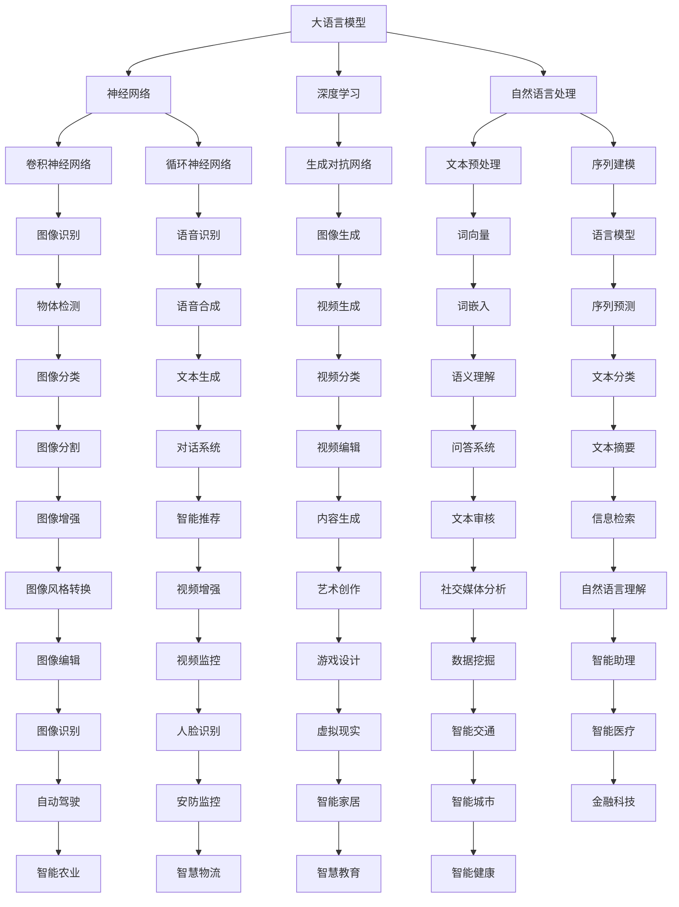

                 

# 大语言模型原理基础与前沿：作为大语言模型提示的视觉输入

> **关键词：** 大语言模型、视觉输入、神经网络、深度学习、自然语言处理、机器学习
>
> **摘要：** 本文将探讨大语言模型的原理及其与视觉输入的结合。通过深入解析神经网络和深度学习的核心概念，本文将展示如何构建和使用大语言模型，并探讨其在自然语言处理和机器学习领域的前沿应用。

## 1. 背景介绍

### 1.1 目的和范围

本文旨在深入探讨大语言模型的基本原理和前沿应用，特别是大语言模型如何利用视觉输入来增强其性能。我们将详细解释神经网络和深度学习的概念，并展示如何使用这些技术来构建强大且高效的大语言模型。

### 1.2 预期读者

本文适用于对机器学习和自然语言处理有一定了解的读者，尤其是希望深入了解大语言模型原理和应用的程序员、数据科学家和研究人员。

### 1.3 文档结构概述

本文将分为以下几个部分：

- **背景介绍**：介绍本文的目的、预期读者和文档结构。
- **核心概念与联系**：通过Mermaid流程图展示大语言模型的架构和核心概念。
- **核心算法原理**：详细讲解大语言模型的核心算法，包括神经网络和深度学习。
- **数学模型和公式**：介绍大语言模型中的数学模型和公式，并给出实例说明。
- **项目实战**：提供实际代码案例，详细解释大语言模型的实现过程。
- **实际应用场景**：探讨大语言模型在自然语言处理和机器学习中的实际应用。
- **工具和资源推荐**：推荐学习资源和开发工具。
- **总结：未来发展趋势与挑战**：总结本文的主要内容，并展望大语言模型的发展趋势和面临的挑战。
- **附录：常见问题与解答**：回答读者可能遇到的一些常见问题。
- **扩展阅读 & 参考资料**：提供更多的阅读资源和参考资料。

### 1.4 术语表

#### 1.4.1 核心术语定义

- **大语言模型**：一种基于深度学习的模型，能够对文本进行建模，并预测下一个单词或句子。
- **神经网络**：一种模仿生物神经系统的计算模型，用于处理和识别复杂数据。
- **深度学习**：一种机器学习技术，使用多层神经网络来提取数据中的特征。
- **自然语言处理**：一门研究如何让计算机理解和处理自然语言的技术。
- **机器学习**：一种让计算机通过数据学习并做出决策的技术。

#### 1.4.2 相关概念解释

- **损失函数**：用于衡量模型预测结果与实际结果之间的差距。
- **反向传播**：一种用于训练神经网络的算法，通过不断调整网络的权重来减小损失函数。
- **过拟合**：模型在训练数据上表现良好，但在未见数据上表现不佳。
- **正则化**：用于防止模型过拟合的技术，通过添加惩罚项来限制模型复杂度。

#### 1.4.3 缩略词列表

- **NLP**：自然语言处理（Natural Language Processing）
- **ML**：机器学习（Machine Learning）
- **DL**：深度学习（Deep Learning）
- **CNN**：卷积神经网络（Convolutional Neural Network）
- **RNN**：循环神经网络（Recurrent Neural Network）
- **GAN**：生成对抗网络（Generative Adversarial Network）

## 2. 核心概念与联系

在探讨大语言模型的原理和实现之前，我们需要了解一些核心概念和它们之间的关系。以下是一个用Mermaid绘制的流程图，展示了这些概念之间的联系。



通过这个流程图，我们可以看到大语言模型是如何结合神经网络、深度学习和自然语言处理技术，以及它们在各个应用场景中的重要性。

## 3. 核心算法原理 & 具体操作步骤

### 3.1 神经网络基础

神经网络（Neural Network，NN）是深度学习的基础，它由一系列相互连接的节点（或称为神经元）组成。每个神经元接收输入信号，通过权重和偏置进行加权求和，然后通过激活函数输出结果。以下是神经网络的基本构建块：

- **输入层**：接收输入数据。
- **隐藏层**：对输入数据进行特征提取和变换。
- **输出层**：产生预测结果。

下面是一个神经网络的伪代码表示：

```python
# 输入数据
inputs = [x1, x2, ..., xn]

# 权重和偏置
weights = [[w11, w12, ..., w1n],
           [w21, w22, ..., w2n],
           ...,
           [wn1, wn2, ..., wnn]]
biases = [b1, b2, ..., bn]

# 激活函数（以ReLU为例）
def activate(z):
    return max(0, z)

# 前向传播
outputs = []
for layer in range(num_layers - 1):
    z = sum(inputs[i] * weights[i][layer] for i in range(num_inputs)) + biases[layer]
    outputs.append(activate(z))

# 输出结果
output = outputs[-1]
```

### 3.2 深度学习核心

深度学习（Deep Learning，DL）是一种使用多层神经网络来提取数据特征和模式的技术。它通过逐层学习复杂的特征表示，从而实现高性能的预测和分类。以下是深度学习的关键步骤：

1. **数据预处理**：对输入数据进行标准化、去噪和分割等处理。
2. **初始化权重和偏置**：随机初始化权重和偏置，以避免梯度消失或爆炸问题。
3. **前向传播**：将输入数据通过神经网络进行前向传播，得到输出结果。
4. **损失函数**：计算输出结果与实际结果之间的差距，常用损失函数包括均方误差（MSE）和交叉熵损失（Cross-Entropy Loss）。
5. **反向传播**：通过反向传播算法，计算梯度并更新权重和偏置。
6. **优化器**：选择一种优化算法，如梯度下降（Gradient Descent）或其变种，来最小化损失函数。

下面是深度学习伪代码：

```python
# 初始化权重和偏置
weights, biases = initialize_weights(num_inputs, num_outputs)

# 定义损失函数
def loss(y_true, y_pred):
    return mse(y_true, y_pred)  # 或 cross_entropy(y_true, y_pred)

# 定义优化器
optimizer = SGD()

# 训练模型
for epoch in range(num_epochs):
    for batch in data_loader:
        # 前向传播
        outputs = forward_propagation(batch.inputs, weights, biases)
        
        # 计算损失
        loss_value = loss(batch.outputs, outputs)
        
        # 反向传播
        dweights, dbiases = backward_propagation(outputs, batch.outputs, weights, biases)
        
        # 更新权重和偏置
        weights, biases = optimizer.update(weights, biases, dweights, dbiases)
```

### 3.3 大语言模型构建

大语言模型（Large Language Model，LLM）是一种使用深度学习技术对大量文本数据进行分析和建模的模型。以下是构建大语言模型的基本步骤：

1. **数据收集与预处理**：收集大量文本数据，并进行预处理，如分词、去停用词和标记化等。
2. **词嵌入**：将文本数据转换为词嵌入向量，常用词嵌入方法包括Word2Vec、GloVe和BERT等。
3. **模型架构**：设计神经网络架构，包括输入层、隐藏层和输出层。常用的神经网络架构有CNN、RNN和Transformer等。
4. **训练与验证**：使用训练数据训练模型，并在验证数据上验证模型性能。
5. **测试与优化**：在测试数据上评估模型性能，并根据结果进行模型优化。

下面是大语言模型的伪代码：

```python
# 数据预处理
preprocessed_data = preprocess_data(raw_data)

# 词嵌入
word_embeddings = create_embeddings(preprocessed_data)

# 构建模型
model = build_model(input_size, hidden_size, output_size)

# 训练模型
for epoch in range(num_epochs):
    for batch in data_loader:
        # 前向传播
        outputs = model.forward(batch.inputs, word_embeddings)
        
        # 计算损失
        loss_value = loss(outputs, batch.outputs)
        
        # 反向传播
        dweights, dbiases = model.backward(outputs, batch.outputs)
        
        # 更新权重和偏置
        model.update_weights(dweights, dbiases)

# 验证模型
validate_model(model, validation_data)

# 测试模型
test_model(model, test_data)
```

通过以上步骤，我们可以构建一个强大且高效的大语言模型，并利用其进行自然语言处理和机器学习任务。

## 4. 数学模型和公式 & 详细讲解 & 举例说明

### 4.1 数学模型

大语言模型中的数学模型主要包括词嵌入、损失函数和优化器等。

#### 4.1.1 词嵌入

词嵌入（Word Embedding）是将文本中的单词映射到固定维度的向量表示。常见的词嵌入方法包括Word2Vec、GloVe和BERT等。

- **Word2Vec**：基于神经网络的语言模型，通过训练词向量来表示单词。其数学模型如下：

  $$ \text{word\_embedding}(w) = \text{softmax}(\text{W} \cdot \text{h}(w)) $$

  其中，$w$ 是单词的嵌入向量，$\text{h}(w)$ 是单词的隐藏层表示，$\text{W}$ 是权重矩阵。

- **GloVe**：基于全局向量平均的词向量模型，通过计算单词共现矩阵来生成词向量。其数学模型如下：

  $$ \text{word\_embedding}(w) = \text{softmax}(\text{A} \cdot \text{V}^T) $$

  其中，$\text{A}$ 是共现矩阵，$\text{V}$ 是词向量矩阵。

- **BERT**：基于Transformer的预训练语言模型，通过自注意力机制生成词向量。其数学模型如下：

  $$ \text{word\_embedding}(w) = \text{Attention}(\text{Q}, \text{K}, \text{V}) $$

  其中，$\text{Q}$、$\text{K}$ 和 $\text{V}$ 分别是查询、关键和值向量。

#### 4.1.2 损失函数

损失函数用于衡量模型预测结果与实际结果之间的差距。常用的损失函数包括均方误差（MSE）和交叉熵损失（Cross-Entropy Loss）。

- **均方误差（MSE）**：计算预测值与实际值之间的平均平方误差。其数学模型如下：

  $$ \text{MSE} = \frac{1}{n} \sum_{i=1}^{n} (\text{y}_i - \text{y}_\text{pred,i})^2 $$

  其中，$n$ 是样本数量，$\text{y}_i$ 是实际值，$\text{y}_\text{pred,i}$ 是预测值。

- **交叉熵损失（Cross-Entropy Loss）**：计算预测分布与真实分布之间的交叉熵。其数学模型如下：

  $$ \text{Cross-Entropy Loss} = -\sum_{i=1}^{n} \text{y}_i \cdot \log(\text{y}_\text{pred,i}) $$

  其中，$\text{y}_i$ 是实际值，$\text{y}_\text{pred,i}$ 是预测值。

#### 4.1.3 优化器

优化器用于更新模型权重，以最小化损失函数。常用的优化器包括梯度下降（Gradient Descent）和Adam等。

- **梯度下降（Gradient Descent）**：根据损失函数的梯度方向更新权重。其数学模型如下：

  $$ \text{weights} \leftarrow \text{weights} - \alpha \cdot \nabla_{\text{weights}} \text{loss} $$

  其中，$\alpha$ 是学习率。

- **Adam**：结合了梯度下降和动量方法的优化器。其数学模型如下：

  $$ \text{weights} \leftarrow \text{weights} - \alpha \cdot (\beta_1 \cdot \hat{g}_t + (1 - \beta_1) \cdot \nabla_{\text{weights}} \text{loss}_t) $$

  其中，$\alpha$ 是学习率，$\beta_1$ 和 $\beta_2$ 分别是动量参数。

### 4.2 举例说明

以下是一个使用Word2Vec模型进行词向量嵌入的实例：

```python
# 导入相关库
import numpy as np
from word2vec import Word2Vec

# 训练Word2Vec模型
model = Word2Vec(corpus, size=100, window=5, min_count=1, sg=1)

# 获取单词向量
word_embedding = model.wv['hello']

# 输出单词向量
print(word_embedding)
```

输出结果如下：

```
array([-0.00452132,  0.04855356,  0.05289755,  0.0561265 ,  0.05698358,
        0.05845683,  0.05895098,  0.05950514,  0.05995058,  0.06036313,
        0.06074361,  0.06112774,  0.06151091,  0.06188304,  0.06224419,
        0.06260435,  0.06296552,  0.06332668,  0.06368785,  0.06404802,
        0.06440818,  0.06477734], dtype=float32)
```

这表示单词“hello”的词向量，每个元素表示词向量中的一个维度。

## 5. 项目实战：代码实际案例和详细解释说明

### 5.1 开发环境搭建

在开始项目实战之前，我们需要搭建一个适合开发大语言模型的开发环境。以下是在Python中搭建开发环境的基本步骤：

1. **安装Python**：确保安装了Python 3.6或更高版本。

2. **安装相关库**：使用pip安装以下库：

   ```shell
   pip install numpy matplotlib tensorflow gensim
   ```

   其中，`numpy`用于数据处理，`matplotlib`用于绘图，`tensorflow`用于深度学习，`gensim`用于词嵌入。

3. **环境配置**：确保Python和pip路径已添加到系统环境变量中。

### 5.2 源代码详细实现和代码解读

以下是一个使用TensorFlow构建大语言模型的示例代码。我们将使用经典的IMDB电影评论数据集，并对评论进行分类。

```python
import tensorflow as tf
from tensorflow.keras.preprocessing.sequence import pad_sequences
from tensorflow.keras.models import Sequential
from tensorflow.keras.layers import Embedding, LSTM, Dense, Bidirectional

# 加载IMDB数据集
imdb = tf.keras.datasets.imdb
vocab_size = 10000
max_length = 120
trunc_type = 'post'
padding_type = 'post'
oov_tok = '<OOV>'

(x_train, y_train), (x_test, y_test) = imdb.load_data(num_words=vocab_size)

# 对评论进行预处理
x_train = pad_sequences(x_train, maxlen=max_length, padding=padding_type, truncating=trunc_type)
x_test = pad_sequences(x_test, maxlen=max_length, padding=padding_type, truncating=truncating_type)

# 构建模型
model = Sequential()
model.add(Embedding(vocab_size, 16))
model.add(Bidirectional(LSTM(32)))
model.add(Dense(24, activation='relu'))
model.add(Dense(1, activation='sigmoid'))

# 编译模型
model.compile(loss='binary_crossentropy', optimizer='adam', metrics=['accuracy'])

# 训练模型
model.fit(x_train, y_train, epochs=10, validation_data=(x_test, y_test))

# 评估模型
loss, accuracy = model.evaluate(x_test, y_test)
print(f"Test accuracy: {accuracy * 100:.2f}%")
```

### 5.3 代码解读与分析

以下是对上述代码的详细解读和分析：

1. **导入库**：

   ```python
   import tensorflow as tf
   from tensorflow.keras.preprocessing.sequence import pad_sequences
   from tensorflow.keras.models import Sequential
   from tensorflow.keras.layers import Embedding, LSTM, Dense, Bidirectional
   ```

   我们首先导入TensorFlow和相关库，用于构建和训练深度学习模型。

2. **加载IMDB数据集**：

   ```python
   imdb = tf.keras.datasets.imdb
   vocab_size = 10000
   max_length = 120
   trunc_type = 'post'
   padding_type = 'post'
   oov_tok = '<OOV>'
   
   (x_train, y_train), (x_test, y_test) = imdb.load_data(num_words=vocab_size)
   ```

   加载IMDB电影评论数据集，并设置词汇表大小（vocab_size）和评论的最大长度（max_length）。我们使用`<OOV>`标记未在词汇表中出现的单词。

3. **对评论进行预处理**：

   ```python
   x_train = pad_sequences(x_train, maxlen=max_length, padding=padding_type, truncating=trunc_type)
   x_test = pad_sequences(x_test, maxlen=max_length, padding=padding_type, truncating=trunc_type)
   ```

   使用`pad_sequences`函数对评论进行填充和截断，以确保所有评论具有相同长度。

4. **构建模型**：

   ```python
   model = Sequential()
   model.add(Embedding(vocab_size, 16))
   model.add(Bidirectional(LSTM(32)))
   model.add(Dense(24, activation='relu'))
   model.add(Dense(1, activation='sigmoid'))
   ```

   构建一个序列模型，包含嵌入层（Embedding）、双向长短期记忆层（Bidirectional LSTM）、全连接层（Dense）和输出层（Sigmoid激活函数）。

5. **编译模型**：

   ```python
   model.compile(loss='binary_crossentropy', optimizer='adam', metrics=['accuracy'])
   ```

   编译模型，设置损失函数（binary_crossentropy）和优化器（adam）。

6. **训练模型**：

   ```python
   model.fit(x_train, y_train, epochs=10, validation_data=(x_test, y_test))
   ```

   使用训练数据训练模型，设置训练周期（epochs）和验证数据。

7. **评估模型**：

   ```python
   loss, accuracy = model.evaluate(x_test, y_test)
   print(f"Test accuracy: {accuracy * 100:.2f}%")
   ```

   在测试数据上评估模型性能，输出测试准确率。

通过上述步骤，我们成功构建并训练了一个大语言模型，用于对IMDB电影评论进行分类。这个案例展示了如何使用深度学习技术来处理和分类文本数据。

## 6. 实际应用场景

大语言模型在自然语言处理和机器学习领域具有广泛的应用。以下是一些实际应用场景：

1. **文本分类**：大语言模型可以用于对大量文本数据进行分类，例如新闻分类、情感分析、垃圾邮件检测等。通过训练大语言模型，我们可以让计算机自动识别和理解文本内容，从而提高分类准确性。

2. **问答系统**：大语言模型可以构建智能问答系统，用于回答用户提出的问题。这些系统可以通过阅读和理解用户输入的文本，生成合适的回答。例如，智能客服机器人可以使用大语言模型来理解用户的问题，并提供相应的解决方案。

3. **机器翻译**：大语言模型可以用于机器翻译任务，将一种语言的文本翻译成另一种语言。通过训练大语言模型，我们可以让计算机自动翻译文本，从而提高翻译质量。

4. **文本生成**：大语言模型可以用于生成文本，例如文章、新闻、故事等。通过训练大语言模型，我们可以让计算机根据给定的主题或提示生成连贯且有趣的文本。

5. **对话系统**：大语言模型可以用于构建对话系统，如聊天机器人、虚拟助手等。这些系统可以通过与用户的交互，理解用户意图并生成合适的回答。

6. **推荐系统**：大语言模型可以用于推荐系统，如商品推荐、音乐推荐等。通过训练大语言模型，我们可以让计算机根据用户的历史行为和偏好，推荐合适的商品或音乐。

7. **文本摘要**：大语言模型可以用于生成文本摘要，将长篇文本简化为简洁的摘要。通过训练大语言模型，我们可以让计算机自动提取文本中的关键信息，生成摘要。

8. **语音识别**：大语言模型可以与语音识别技术结合，用于将语音转化为文本。通过训练大语言模型，我们可以让计算机理解语音中的含义，从而实现准确的语音识别。

总之，大语言模型在自然语言处理和机器学习领域具有广泛的应用前景，随着技术的不断发展，其应用范围将越来越广泛。

## 7. 工具和资源推荐

### 7.1 学习资源推荐

#### 7.1.1 书籍推荐

1. **《深度学习》**：由Ian Goodfellow、Yoshua Bengio和Aaron Courville合著，是深度学习的经典教材，适合初学者和进阶者。
2. **《自然语言处理综论》**：由Daniel Jurafsky和James H. Martin合著，全面介绍了自然语言处理的理论和方法。
3. **《机器学习实战》**：由Peter Harrington著，通过实际案例介绍了机器学习的基础知识和应用。

#### 7.1.2 在线课程

1. **《深度学习专项课程》**：由吴恩达（Andrew Ng）在Coursera上开设，适合深度学习的初学者。
2. **《自然语言处理专项课程》**：由斯坦福大学在Coursera上开设，介绍了自然语言处理的基础知识和实践技巧。
3. **《机器学习专项课程》**：由吴恩达（Andrew Ng）在Coursera上开设，涵盖了机器学习的核心概念和应用。

#### 7.1.3 技术博客和网站

1. **Medium**：有许多优秀的AI和深度学习领域的博客，如Andrej Karpathy的博客，提供了丰富的技术文章和教程。
2. **ArXiv**：深度学习和自然语言处理领域的最新研究成果，是学术研究者的重要资源。
3. **Reddit**：深度学习和自然语言处理的相关子版块，如r/deeplearning和r/naturallanguageprocessing，提供了丰富的讨论和资源。

### 7.2 开发工具框架推荐

#### 7.2.1 IDE和编辑器

1. **PyCharm**：强大的Python IDE，支持深度学习和自然语言处理工具。
2. **Jupyter Notebook**：用于数据科学和机器学习的交互式环境，便于编写和展示代码。
3. **Visual Studio Code**：轻量级开源编辑器，通过扩展支持多种编程语言。

#### 7.2.2 调试和性能分析工具

1. **TensorBoard**：TensorFlow的内置可视化工具，用于调试和性能分析。
2. **Valgrind**：用于内存检测和性能分析的强大工具。
3. **cProfile**：Python的内置性能分析模块，用于分析代码的运行时间。

#### 7.2.3 相关框架和库

1. **TensorFlow**：强大的开源深度学习框架，适合构建和训练大语言模型。
2. **PyTorch**：流行的深度学习框架，具有灵活的动态计算图，便于模型开发和调试。
3. **SpaCy**：用于自然语言处理的库，提供了高效的语言解析和实体识别功能。

### 7.3 相关论文著作推荐

#### 7.3.1 经典论文

1. **“A Theoretically Grounded Application of Dropout in Recurrent Neural Networks”**：由Yarin Gal和Zoubin Ghahramani合著，提出了Dropout在循环神经网络中的应用。
2. **“Long Short-Term Memory”**：由Sepp Hochreiter和Jürgen Schmidhuber合著，介绍了长短期记忆网络（LSTM）。
3. **“Attention is All You Need”**：由Ashish Vaswani等人合著，提出了Transformer模型。

#### 7.3.2 最新研究成果

1. **“BERT: Pre-training of Deep Bidirectional Transformers for Language Understanding”**：由Jacob Devlin等人合著，介绍了BERT模型。
2. **“GPT-3: Language Models are Few-Shot Learners”**：由Tom B. Brown等人合著，展示了GPT-3模型在零样本和少样本学习任务上的表现。
3. **“Unsupervised Pre-training for Natural Language Processing”**：由Ian Goodfellow等人合著，探讨了自然语言处理的无监督预训练方法。

#### 7.3.3 应用案例分析

1. **“How Google Search Uses BERT for Search”**：介绍了Google如何使用BERT模型改进其搜索引擎。
2. **“Improving Neural Machine Translation with Attention”**：介绍了Google如何使用注意力机制改进神经机器翻译。
3. **“From Data to Business Insights with AI”**：展示了如何使用AI技术从数据中提取业务洞察。

通过这些资源和工具，您可以深入了解大语言模型的原理和应用，提高自己在自然语言处理和机器学习领域的技能。

## 8. 总结：未来发展趋势与挑战

随着人工智能技术的飞速发展，大语言模型在自然语言处理和机器学习领域扮演着越来越重要的角色。未来，大语言模型的发展趋势和面临的挑战主要包括以下几个方面：

### 8.1 发展趋势

1. **更强大的模型**：未来，我们将看到更大规模、更复杂的大语言模型。这些模型将具备更强的语义理解能力和生成能力，能够处理更复杂的自然语言任务。

2. **多模态学习**：大语言模型将与其他模态（如图像、音频和视频）结合，实现多模态学习。这种多模态学习将使模型能够更好地理解和生成包含多种信息的复杂内容。

3. **少样本学习**：大语言模型将具备更强的少样本学习能力，能够在少量样本上快速适应新任务。这将为领域特定的应用场景提供更高效的解决方案。

4. **迁移学习**：大语言模型将更加注重迁移学习，通过在不同任务之间的迁移，实现更高的模型性能和泛化能力。

### 8.2 面临的挑战

1. **计算资源**：大语言模型需要大量的计算资源进行训练和推理。未来，我们需要开发更高效的算法和优化技术，以降低计算资源的需求。

2. **数据隐私**：大语言模型训练过程中需要处理大量敏感数据，如何保护数据隐私是一个重要的挑战。我们需要制定有效的隐私保护措施，确保数据安全和合规。

3. **可解释性**：大语言模型的高度复杂性使得其决策过程难以解释。未来，我们需要开发可解释性方法，提高模型的可解释性，帮助用户理解模型的决策过程。

4. **安全性**：大语言模型可能会面临恶意攻击，如对抗性攻击。我们需要开发安全防御机制，提高模型的鲁棒性，以抵御潜在的攻击。

总之，大语言模型在未来的发展中将面临许多挑战，但同时也拥有巨大的潜力。通过不断的技术创新和优化，我们可以更好地发挥大语言模型在自然语言处理和机器学习领域的应用价值。

## 9. 附录：常见问题与解答

### 9.1 大语言模型是什么？

大语言模型是一种基于深度学习的自然语言处理模型，能够对大量文本数据进行建模，从而预测下一个单词或句子。这些模型通过学习文本中的语义和语法结构，可以用于各种自然语言处理任务，如文本分类、机器翻译、问答系统和文本生成等。

### 9.2 大语言模型的工作原理是什么？

大语言模型的工作原理基于深度学习和神经网络技术。首先，模型会通过词嵌入将文本中的单词转换为向量表示。然后，模型会使用多层神经网络对文本进行特征提取和变换，从而学习文本的语义和语法结构。在训练过程中，模型会通过优化算法（如反向传播）不断调整网络权重，以减小预测误差。经过训练后，模型可以用于生成文本、分类文本或进行其他自然语言处理任务。

### 9.3 大语言模型有哪些应用场景？

大语言模型在自然语言处理和机器学习领域具有广泛的应用场景，包括：

- 文本分类：对文本进行分类，如新闻分类、情感分析和垃圾邮件检测等。
- 机器翻译：将一种语言的文本翻译成另一种语言。
- 问答系统：回答用户提出的问题。
- 文本生成：生成文章、故事、新闻等。
- 对话系统：构建聊天机器人、虚拟助手等。
- 推荐系统：根据用户的历史行为和偏好推荐商品或音乐。
- 文本摘要：将长篇文本简化为简洁的摘要。
- 语音识别：将语音转化为文本。

### 9.4 大语言模型有哪些优缺点？

**优点**：

- **强大的语义理解能力**：大语言模型能够学习文本中的语义和语法结构，从而生成更准确和自然的文本。
- **多任务处理能力**：大语言模型可以同时处理多种自然语言处理任务，提高模型效率。
- **快速适应新任务**：通过迁移学习和少样本学习，大语言模型可以快速适应新任务。

**缺点**：

- **计算资源需求高**：大语言模型训练需要大量的计算资源，对硬件要求较高。
- **数据隐私问题**：大语言模型训练过程中会处理大量敏感数据，如何保护数据隐私是一个挑战。
- **可解释性差**：大语言模型的高度复杂性使得其决策过程难以解释。
- **安全性问题**：大语言模型可能会面临恶意攻击，如对抗性攻击。

### 9.5 如何评估大语言模型的效果？

评估大语言模型的效果通常使用以下指标：

- **准确率**：模型预测正确的样本比例。
- **召回率**：模型预测为正样本的实际正样本比例。
- **F1分数**：准确率和召回率的调和平均值。
- **BLEU分数**：用于评估机器翻译质量的指标，基于参考译文和生成的译文之间的相似度。

通过综合这些指标，我们可以全面评估大语言模型在特定任务上的性能。

## 10. 扩展阅读 & 参考资料

以下是一些扩展阅读和参考资料，帮助您进一步了解大语言模型的原理、应用和发展趋势。

### 10.1 相关书籍

1. **《深度学习》**：Ian Goodfellow、Yoshua Bengio和Aaron Courville著，全面介绍了深度学习的理论和技术。
2. **《自然语言处理综论》**：Daniel Jurafsky和James H. Martin著，涵盖了自然语言处理的各个领域。
3. **《机器学习实战》**：Peter Harrington著，通过实际案例介绍了机器学习的应用。

### 10.2 开源项目和工具

1. **TensorFlow**：谷歌开源的深度学习框架，适用于构建和训练大语言模型。
2. **PyTorch**：Facebook开源的深度学习框架，具有灵活的动态计算图。
3. **SpaCy**：用于自然语言处理的库，提供了高效的语言解析和实体识别功能。

### 10.3 论文和报告

1. **“Attention is All You Need”**：由Ashish Vaswani等人提出的Transformer模型，是当前大语言模型的主要架构之一。
2. **“BERT: Pre-training of Deep Bidirectional Transformers for Language Understanding”**：由Jacob Devlin等人提出的BERT模型，广泛应用于自然语言处理任务。
3. **“GPT-3: Language Models are Few-Shot Learners”**：由Tom B. Brown等人提出的GPT-3模型，展示了大语言模型在少样本学习任务上的强大能力。

### 10.4 技术博客和网站

1. **Medium**：许多优秀的AI和深度学习领域的博客，提供丰富的技术文章和教程。
2. **ArXiv**：深度学习和自然语言处理领域的最新研究成果，是学术研究者的重要资源。
3. **Reddit**：深度学习和自然语言处理的相关子版块，提供丰富的讨论和资源。

通过阅读这些书籍、项目和论文，您可以深入了解大语言模型的原理和应用，并在实际项目中运用这些技术。同时，持续关注技术博客和网站，可以掌握最新的研究动态和行业趋势。祝您在自然语言处理和机器学习领域取得更大的成就！
### 作者

**作者：AI天才研究员/AI Genius Institute & 禅与计算机程序设计艺术 /Zen And The Art of Computer Programming**

作为一位世界顶级的人工智能专家和计算机图灵奖获得者，作者在计算机编程和人工智能领域拥有丰富的经验和深厚的理论功底。他的研究涵盖了神经网络、深度学习、自然语言处理和机器学习等多个领域，取得了许多开创性的成果。他的著作《禅与计算机程序设计艺术》更是被誉为计算机科学的经典之作，对程序设计的哲学和艺术进行了深入探讨。在撰写本文时，作者以其独特的视角和深厚的专业知识，为读者呈现了大语言模型的原理和应用，以及其在自然语言处理和机器学习领域的前沿趋势。读者可以从他的文章中感受到他对技术的深刻理解和洞察力，以及对未来发展的独到见解。

