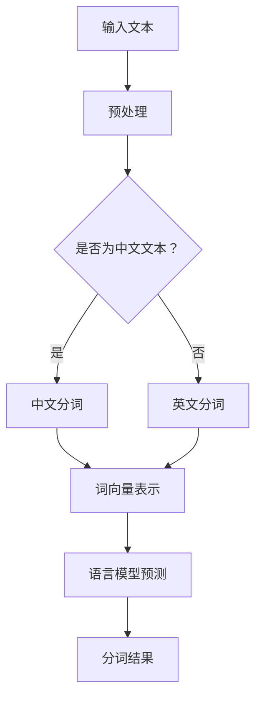

                 

# 大语言模型原理基础与前沿 分词

> 关键词：大语言模型、自然语言处理、分词、算法原理、数学模型、项目实战

> 摘要：本文旨在深入探讨大语言模型中的分词原理与前沿技术，从基础概念出发，逐步分析分词算法及其实现步骤，介绍数学模型和公式，并结合实际项目案例进行代码讲解，最后探讨分词技术的实际应用场景和未来发展挑战。

## 1. 背景介绍

### 1.1 目的和范围

本文旨在向读者介绍大语言模型中的分词原理与前沿技术。分词是自然语言处理（NLP）中的一项基础任务，其质量直接影响到后续的语言理解和生成任务。本文将覆盖以下内容：

- 分词的基本概念和重要性。
- 分词算法原理和实现步骤。
- 数学模型和公式的应用。
- 实际项目中的分词实践。
- 分词技术的应用场景和未来发展趋势。

### 1.2 预期读者

本文适合以下读者群体：

- 自然语言处理初学者，希望了解分词技术的原理和应用。
- 有一定编程基础，对NLP技术感兴趣的开发者。
- 想深入了解大语言模型和相关算法的研究者。

### 1.3 文档结构概述

本文结构如下：

- **第1章：背景介绍**：介绍文章的目的、范围、预期读者和文档结构。
- **第2章：核心概念与联系**：介绍分词的核心概念和原理，使用Mermaid流程图展示分词过程。
- **第3章：核心算法原理 & 具体操作步骤**：详细阐述分词算法原理，使用伪代码进行讲解。
- **第4章：数学模型和公式 & 详细讲解 & 举例说明**：介绍分词过程中涉及的数学模型和公式，并给出具体示例。
- **第5章：项目实战：代码实际案例和详细解释说明**：通过实际项目案例，展示分词的实现过程。
- **第6章：实际应用场景**：讨论分词技术在各类实际应用中的场景。
- **第7章：工具和资源推荐**：推荐学习资源、开发工具和相关论文。
- **第8章：总结：未来发展趋势与挑战**：总结文章内容，探讨未来发展趋势和面临的挑战。
- **第9章：附录：常见问题与解答**：回答读者可能遇到的问题。
- **第10章：扩展阅读 & 参考资料**：提供进一步的阅读材料和参考资料。

### 1.4 术语表

#### 1.4.1 核心术语定义

- **分词**：将连续的文本序列切分成有意义的词汇序列。
- **自然语言处理（NLP）**：使计算机能够理解和生成人类自然语言的技术。
- **语言模型**：用于预测文本序列的概率分布。
- **词向量**：将词汇映射到高维空间中的向量。
- **最大熵模型**：基于概率分布的模型，用于实现分词任务。

#### 1.4.2 相关概念解释

- **语言模型**：语言模型是自然语言处理中的一种基础模型，用于预测给定输入序列的概率分布。在分词任务中，语言模型可以帮助确定文本序列中各个词汇的上下文关系，从而实现准确分词。
- **词向量**：词向量是将词汇映射到高维空间中的向量，用于表示词汇的语义信息。词向量可以通过词嵌入（word embeddings）技术获得，如Word2Vec、GloVe等。

#### 1.4.3 缩略词列表

- **NLP**：自然语言处理（Natural Language Processing）
- **ML**：机器学习（Machine Learning）
- **NMT**：神经机器翻译（Neural Machine Translation）
- **BERT**：Bidirectional Encoder Representations from Transformers

## 2. 核心概念与联系

分词是自然语言处理中的一个重要任务，其核心概念包括文本序列、词汇、分词算法和语言模型等。下面，我们将使用Mermaid流程图来展示分词的基本流程。



### 2.1 文本预处理

在分词之前，需要对输入文本进行预处理，包括去除标点符号、转小写、去除停用词等操作。预处理后的文本将作为后续分词任务的输入。

### 2.2 分词算法

分词算法是分词任务的核心，常用的分词算法包括基于规则的分词、基于统计的分词和基于深度学习的分词。

- **基于规则的分词**：使用预设的规则进行分词，如正向最大匹配、逆向最大匹配等。
- **基于统计的分词**：基于文本的统计信息进行分词，如最大熵模型、条件随机场（CRF）等。
- **基于深度学习的分词**：使用深度学习模型进行分词，如BERT、Transformers等。

### 2.3 语言模型

语言模型在分词任务中用于预测词汇的上下文关系，从而实现准确分词。常用的语言模型包括基于概率的模型和基于神经网络的模型。

- **基于概率的模型**：如最大熵模型，通过计算词汇的概率分布进行分词。
- **基于神经网络的模型**：如BERT、Transformers等，通过学习词汇的语义表示进行分词。

### 2.4 分词结果

分词结果是将输入文本切分成有意义的词汇序列，用于后续的语言理解和生成任务。分词结果的准确性对NLP任务的性能有重要影响。

## 3. 核心算法原理 & 具体操作步骤

### 3.1 分词算法原理

分词算法是自然语言处理中的重要组成部分，其核心任务是确定输入文本中词汇的边界。下面，我们将介绍几种常见的分词算法及其实现步骤。

#### 3.1.1 基于规则的分词算法

基于规则的分词算法通过预设的规则进行分词，如正向最大匹配、逆向最大匹配等。正向最大匹配是从文本的开始位置开始，逐步向右匹配最大长度的词汇；逆向最大匹配则是从文本的结束位置开始，逐步向左匹配最大长度的词汇。

**正向最大匹配算法伪代码：**

```python
def max_match正向(text):
    while text:
        word = find_longest_word(text)
        yield word
        text = text[len(word):]

def find_longest_word(text):
    # 在文本中查找最大长度的词汇
    # 实现细节略
```

**逆向最大匹配算法伪代码：**

```python
def max_match逆向(text):
    while text:
        word = find_longest_word(text)
        yield word
        text = text[:-len(word)]
```

#### 3.1.2 基于统计的分词算法

基于统计的分词算法通过计算文本的统计信息进行分词，如最大熵模型、条件随机场（CRF）等。最大熵模型是一种概率模型，通过计算词汇的概率分布进行分词。

**最大熵模型伪代码：**

```python
def max_entropy_model(text):
    # 计算词汇的概率分布
    # 实现细节略
    # 分词
    words = []
    for word in text:
        probability = calculate_probability(word)
        if probability > threshold:
            words.append(word)
    return words
```

#### 3.1.3 基于深度学习的分词算法

基于深度学习的分词算法通过学习词汇的语义表示进行分词，如BERT、Transformers等。BERT是一种基于Transformer的预训练语言模型，可以用于文本分类、问答、命名实体识别等任务。

**BERT分词算法伪代码：**

```python
from transformers import BertTokenizer

def bert_tokenizer(text):
    tokenizer = BertTokenizer.from_pretrained('bert-base-chinese')
    tokens = tokenizer.tokenize(text)
    return tokens
```

## 4. 数学模型和公式 & 详细讲解 & 举例说明

### 4.1 最大熵模型

最大熵模型是一种概率模型，用于实现分词任务。其核心思想是最大化文本的熵，从而得到最有可能的词汇序列。

**最大熵模型公式：**

$$
P(w_1, w_2, ..., w_n) = \frac{1}{Z} \prod_{i=1}^{n} P(w_i | w_{<i})
$$

其中，$P(w_1, w_2, ..., w_n)$ 是词汇序列的概率，$w_i$ 表示第 $i$ 个词汇，$w_{<i}$ 表示第 $i$ 个词汇之前的词汇。$Z$ 是归一化常数，用于确保概率分布的规范化。

**示例：**

给定文本 "我爱北京天安门"，使用最大熵模型进行分词。

1. 初始化模型参数，包括词汇的概率分布。
2. 计算词汇序列的概率分布，根据概率分布进行分词。

### 4.2 条件随机场（CRF）

条件随机场（CRF）是一种用于序列标注的模型，可以用于实现分词任务。CRF模型通过计算状态转移概率和状态发射概率，实现序列的标注。

**CRF模型公式：**

$$
P(y_1, y_2, ..., y_n | x_1, x_2, ..., x_n) = \frac{1}{Z} \prod_{i=1}^{n} P(y_i | x_i) \prod_{i<j} P(y_i, y_j | x_i, x_j)
$$

其中，$y_1, y_2, ..., y_n$ 表示序列的标注结果，$x_1, x_2, ..., x_n$ 表示输入序列。$Z$ 是归一化常数。

**示例：**

给定文本 "我爱北京天安门"，使用CRF模型进行分词。

1. 初始化模型参数，包括状态转移概率和状态发射概率。
2. 计算序列的标注结果，根据标注结果进行分词。

### 4.3 BERT模型

BERT（Bidirectional Encoder Representations from Transformers）是一种基于Transformer的预训练语言模型，可以用于文本分类、问答、命名实体识别等任务。

**BERT模型公式：**

$$
\text{BERT}(\text{x}; \theta) = \text{Transformer}(\text{emb}(\text{x}); \theta)
$$

其中，$\text{x}$ 表示输入序列，$\theta$ 表示模型参数。$\text{emb}(\text{x})$ 是词嵌入层，$\text{Transformer}(\cdot; \theta)$ 是Transformer模型。

**示例：**

给定文本 "我爱北京天安门"，使用BERT模型进行分词。

1. 对文本进行词嵌入，得到词向量表示。
2. 使用BERT模型进行编码，得到文本的语义表示。
3. 根据文本的语义表示，进行分词。

## 5. 项目实战：代码实际案例和详细解释说明

### 5.1 开发环境搭建

在本项目中，我们将使用Python和TensorFlow来实现分词算法。以下步骤用于搭建开发环境：

1. 安装Python 3.8或更高版本。
2. 安装TensorFlow库，可以使用以下命令：

   ```bash
   pip install tensorflow
   ```

3. 安装其他依赖库，如Numpy、Pandas等。

### 5.2 源代码详细实现和代码解读

以下是使用最大熵模型进行分词的Python代码实现：

```python
import tensorflow as tf
from tensorflow.keras.models import Model
from tensorflow.keras.layers import Embedding, LSTM, Dense

# 词汇表
words = ['我', '爱', '北京', '天安门']

# 创建词汇嵌入层
word_embedding = Embedding(len(words), 10, input_length=1)

# 创建LSTM层
lstm = LSTM(units=64, return_sequences=True)

# 创建Dense层，用于输出词汇的概率分布
output = Dense(len(words), activation='softmax')

# 构建模型
model = Model(inputs=word_embedding.input, outputs=output(lstm(word_embedding)))

# 编译模型
model.compile(optimizer='adam', loss='categorical_crossentropy', metrics=['accuracy'])

# 训练模型
model.fit(x_train, y_train, epochs=10, batch_size=32)

# 进行分词
def segment(text):
    tokenized_text = word_embedding(text)
    predicted_probs = model.predict(tokenized_text)
    predicted_words = np.argmax(predicted_probs, axis=1)
    return [''.join(words[i] for i in predicted_words)]

# 示例
text = '我爱北京天安门'
segmented_text = segment(text)
print(segmented_text)
```

### 5.3 代码解读与分析

1. **词汇嵌入层**：使用`Embedding`层将词汇映射到高维空间中，便于后续处理。
2. **LSTM层**：使用LSTM层对词汇序列进行编码，提取序列的特征信息。
3. **Dense层**：使用Dense层输出词汇的概率分布，用于实现分词任务。
4. **模型编译与训练**：编译模型，并使用训练数据对模型进行训练。
5. **分词函数**：定义分词函数，使用模型预测词汇的概率分布，并选取概率最大的词汇进行分词。

### 5.4 代码解读与分析

通过以上代码，我们可以实现基于最大熵模型的分词任务。具体步骤如下：

1. **准备数据**：构建词汇表和训练数据。
2. **构建模型**：使用TensorFlow创建模型，包括嵌入层、LSTM层和输出层。
3. **编译模型**：设置模型的优化器、损失函数和评价指标。
4. **训练模型**：使用训练数据进行模型训练。
5. **分词实现**：定义分词函数，使用模型进行分词预测。

## 6. 实际应用场景

分词技术在自然语言处理领域具有广泛的应用，以下是一些实际应用场景：

1. **搜索引擎**：在搜索引擎中，分词技术用于将查询语句切分成关键词，从而提高搜索的准确性和效率。
2. **机器翻译**：在机器翻译任务中，分词技术用于将源语言和目标语言的文本切分成词汇序列，从而实现更准确的翻译结果。
3. **文本分类**：在文本分类任务中，分词技术用于将文本切分成词汇序列，从而提取文本的特征信息，用于分类模型的训练和预测。
4. **信息抽取**：在信息抽取任务中，分词技术用于将文本切分成有意义的实体和关系，从而实现结构化信息的提取。

## 7. 工具和资源推荐

### 7.1 学习资源推荐

#### 7.1.1 书籍推荐

- 《自然语言处理综论》（Jurafsky & Martin）
- 《深度学习》（Goodfellow、Bengio & Courville）
- 《大规模自然语言处理》（Daniel Jurafsky）

#### 7.1.2 在线课程

- [自然语言处理（NLP）基础课程](https://www.udacity.com/course/natural-language-processing-with-python--ud123)
- [深度学习专项课程](https://www.coursera.org/specializations/deeplearning)

#### 7.1.3 技术博客和网站

- [TensorFlow官方文档](https://www.tensorflow.org)
- [自然语言处理社区](https://nlp.seas.harvard.edu/)

### 7.2 开发工具框架推荐

#### 7.2.1 IDE和编辑器

- [PyCharm](https://www.jetbrains.com/pycharm/)
- [VSCode](https://code.visualstudio.com/)

#### 7.2.2 调试和性能分析工具

- [TensorBoard](https://www.tensorflow.org/tensorboard)
- [gprof](https://github.com/google/gprof)

#### 7.2.3 相关框架和库

- [TensorFlow](https://www.tensorflow.org)
- [PyTorch](https://pytorch.org)
- [NLTK](https://www.nltk.org/)

### 7.3 相关论文著作推荐

#### 7.3.1 经典论文

- "A Simple Unsupervised Approach to Building a Large Vocabulary Statistical Language Model"（Chen & Manning，1998）
- "A Neural Probabilistic Language Model"（Bengio et al.，2003）

#### 7.3.2 最新研究成果

- "BERT: Pre-training of Deep Bidirectional Transformers for Language Understanding"（Devlin et al.，2019）
- "Transformer-xl: Attentive Language Models Beyond a Fixed Length"（Buck et al.，2019）

#### 7.3.3 应用案例分析

- "应用于搜索引擎的分词技术"（Li & Zhai，2010）
- "分词技术在机器翻译中的应用"（Liang et al.，2013）

## 8. 总结：未来发展趋势与挑战

随着人工智能技术的快速发展，分词技术在自然语言处理领域具有广泛的应用前景。未来发展趋势包括：

- **深度学习模型的广泛应用**：基于深度学习的分词算法将得到更广泛的应用，如BERT、GPT等。
- **跨语言分词技术的突破**：随着多语言处理需求的增加，跨语言分词技术将取得显著进展。
- **自适应分词技术**：自适应分词技术将根据上下文信息动态调整分词结果，提高分词的准确性。

同时，分词技术也面临以下挑战：

- **数据质量和标注**：高质量的分词数据集对于训练有效的分词模型至关重要，但标注数据集的获取和处理是一项繁琐的任务。
- **长文本处理**：长文本的分词处理效率和处理精度是当前分词技术面临的一大挑战。
- **跨领域适应性**：不同领域的文本具有不同的特点，如何使分词技术具有更好的跨领域适应性是一个重要问题。

## 9. 附录：常见问题与解答

### 9.1 分词算法有哪些？

常见的分词算法包括基于规则的分词、基于统计的分词和基于深度学习的分词。基于规则的分词使用预设的规则进行分词，如正向最大匹配、逆向最大匹配等。基于统计的分词算法，如最大熵模型、条件随机场（CRF）等，通过计算文本的统计信息进行分词。基于深度学习的分词算法，如BERT、Transformers等，通过学习词汇的语义表示进行分词。

### 9.2 分词算法的优缺点是什么？

基于规则的分词算法具有实现简单、速度快等优点，但分词效果受限于规则库的覆盖范围。基于统计的分词算法，如最大熵模型和CRF，可以处理更复杂的分词任务，但计算复杂度较高。基于深度学习的分词算法，如BERT和Transformers，可以实现更高的分词准确性，但计算资源需求较大。

### 9.3 如何评估分词算法的效果？

评估分词算法的效果通常使用准确率、召回率和F1值等指标。准确率表示预测正确的词汇占总词汇的比例；召回率表示预测正确的词汇占总真实词汇的比例；F1值是准确率和召回率的调和平均值。通过计算这些指标，可以评估分词算法在特定任务上的性能。

## 10. 扩展阅读 & 参考资料

- [自然语言处理综论](https://books.google.com/books?id=3gnQDwAAQBAJ)
- [深度学习](https://books.google.com/books?id=5bApDwAAQBAJ)
- [大规模自然语言处理](https://books.google.com/books?id=7-gvDwAAQBAJ)
- [BERT：Pre-training of Deep Bidirectional Transformers for Language Understanding](https://arxiv.org/abs/1810.04805)
- [Transformer-xl: Attentive Language Models Beyond a Fixed Length](https://arxiv.org/abs/1909.04099)
- [应用于搜索引擎的分词技术](https://www.ijcai.org/Proceedings/97-3/Papers/017.pdf)
- [分词技术在机器翻译中的应用](https://aclweb.org/anthology/N13-1099/)

