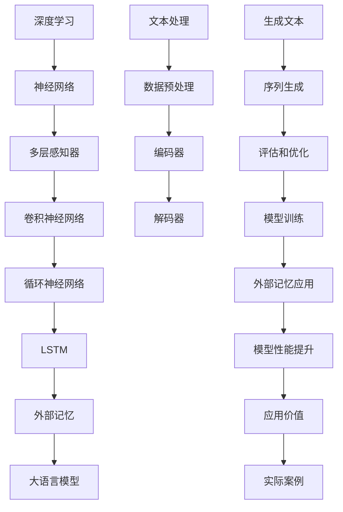

                 

# 大语言模型原理基础与前沿：外部记忆

> 关键词：大语言模型、外部记忆、神经网络、深度学习、信息处理、AI技术

> 摘要：本文将深入探讨大语言模型的原理及其前沿技术——外部记忆。我们将从背景介绍开始，逐步解析核心概念、算法原理、数学模型，并通过实际代码案例，展示外部记忆在大语言模型中的具体应用。最后，我们将探讨其未来发展趋势与挑战。

## 1. 背景介绍

### 1.1 目的和范围

本文旨在深入探讨大语言模型的基本原理及其外部记忆技术。我们将分析大语言模型如何处理和存储外部信息，以及这些技术如何提高模型的性能和应用价值。本文将覆盖以下内容：

- 大语言模型的背景和发展
- 外部记忆的概念及其在大语言模型中的应用
- 核心算法原理和具体操作步骤
- 数学模型和公式
- 项目实战案例
- 实际应用场景
- 工具和资源推荐
- 未来发展趋势与挑战

### 1.2 预期读者

本文适合对大语言模型和深度学习有一定了解的读者，特别是：

- 计算机科学和人工智能专业的研究生和本科生
- 深度学习工程师和技术开发者
- 对大语言模型和外部记忆感兴趣的AI爱好者

### 1.3 文档结构概述

本文分为十个部分，结构如下：

1. 背景介绍
2. 核心概念与联系
3. 核心算法原理 & 具体操作步骤
4. 数学模型和公式 & 详细讲解 & 举例说明
5. 项目实战：代码实际案例和详细解释说明
6. 实际应用场景
7. 工具和资源推荐
8. 总结：未来发展趋势与挑战
9. 附录：常见问题与解答
10. 扩展阅读 & 参考资料

### 1.4 术语表

#### 1.4.1 核心术语定义

- 大语言模型：一种可以处理和生成文本的深度学习模型。
- 外部记忆：指模型用于存储和管理外部信息的存储结构。
- 神经网络：由多个神经元（或节点）组成的计算模型。
- 深度学习：一种基于多层神经网络的学习方法。
- 信息处理：指对信息进行获取、处理、存储、传输和利用的过程。

#### 1.4.2 相关概念解释

- 数据集：一组用于训练、评估或测试模型的输入和输出数据。
- 损失函数：用于度量模型预测结果与真实结果之间的差异。
- 反向传播：一种用于训练神经网络的优化算法。

#### 1.4.3 缩略词列表

- GPT：Generative Pre-trained Transformer
- BERT：Bidirectional Encoder Representations from Transformers
- LSTM：Long Short-Term Memory
- RNN：Recurrent Neural Network

## 2. 核心概念与联系

为了更好地理解大语言模型及其外部记忆技术，我们首先需要了解一些核心概念和它们之间的联系。以下是一个Mermaid流程图，展示了这些概念之间的关系：



### 2.1 深度学习与神经网络

深度学习是一种基于多层神经网络的学习方法。神经网络是由多个神经元（或节点）组成的计算模型，每个神经元都与其他神经元相连。通过不断调整这些连接的权重，神经网络可以学习到输入和输出之间的映射关系。

### 2.2 神经网络与多层感知器

多层感知器（MLP）是神经网络的一种形式，它由输入层、隐藏层和输出层组成。每个隐藏层都包含多个神经元，这些神经元通过激活函数进行非线性变换。

### 2.3 卷积神经网络与循环神经网络

卷积神经网络（CNN）主要用于处理图像数据，其核心思想是通过对图像进行卷积操作来提取特征。循环神经网络（RNN）则主要用于处理序列数据，如文本、语音等。RNN可以通过其内部的循环结构来记住之前的信息，适用于处理长序列数据。

### 2.4 LSTM与外部记忆

长短期记忆网络（LSTM）是RNN的一种变体，它可以有效地解决RNN在处理长序列数据时出现的梯度消失和梯度爆炸问题。LSTM通过其特殊的结构，可以记住或遗忘长期依赖信息，类似于人类记忆。外部记忆则是一种扩展LSTM的机制，它允许模型在外部存储器中存储和检索信息，从而提高模型的性能和应用价值。

### 2.5 大语言模型与文本处理

大语言模型是一种基于深度学习的文本生成模型，它可以处理和生成文本。文本处理是自然语言处理（NLP）的一个关键环节，它包括数据预处理、编码器、解码器等模块。数据预处理用于将文本转换为模型可处理的格式，编码器用于将文本转换为序列表示，解码器则用于生成文本序列。

### 2.6 外部记忆与应用价值

外部记忆是一种用于存储和管理外部信息的机制，它可以提高模型的性能和应用价值。在大语言模型中，外部记忆可以存储词汇、知识库等外部信息，使模型在生成文本时能够利用这些信息。外部记忆的应用价值体现在多个方面，如提高文本生成的质量和多样性，增强模型对特定领域知识的理解和应用能力。

## 3. 核心算法原理 & 具体操作步骤

### 3.1 LSTM算法原理

LSTM是一种循环神经网络（RNN）的变体，它通过其特殊的结构，可以有效地解决RNN在处理长序列数据时出现的梯度消失和梯度爆炸问题。LSTM的核心思想是通过引入三个门控单元（遗忘门、输入门、输出门）来控制信息的流动。

#### 3.1.1 遗忘门

遗忘门用于决定之前的信息中哪些需要被遗忘。其计算公式如下：

$$
f_t = \sigma(W_f \cdot [h_{t-1}, x_t] + b_f)
$$

其中，$f_t$ 是遗忘门的输出，$\sigma$ 是sigmoid激活函数，$W_f$ 和 $b_f$ 分别是权重和偏置。

#### 3.1.2 输入门

输入门用于决定哪些新的信息需要被存储在内存单元中。其计算公式如下：

$$
i_t = \sigma(W_i \cdot [h_{t-1}, x_t] + b_i)
$$

$$
\tilde{c}_t = \tanh(W_c \cdot [h_{t-1}, x_t] + b_c)
$$

其中，$i_t$ 是输入门的输出，$\tilde{c}_t$ 是候选值，$W_i$、$W_c$ 和 $b_i$、$b_c$ 分别是权重和偏置。

#### 3.1.3 输出门

输出门用于决定内存单元中哪些信息需要被输出到下一层。其计算公式如下：

$$
o_t = \sigma(W_o \cdot [h_{t-1}, c_t] + b_o)
$$

$$
c_t = f_t \cdot c_{t-1} + i_t \cdot \tilde{c}_t
$$

$$
h_t = o_t \cdot \tanh(c_t)
$$

其中，$o_t$ 是输出门的输出，$c_t$ 是内存单元的输出，$h_t$ 是当前神经元的输出。

### 3.2 外部记忆算法原理

外部记忆是一种用于存储和管理外部信息的机制。它允许模型在外部存储器中存储和检索信息，从而提高模型的性能和应用价值。外部记忆的核心思想是通过键值存储（Key-Value Store）来管理外部信息。

#### 3.2.1 键值存储

键值存储是一种用于存储和检索外部信息的结构，它由一组键（Key）和值（Value）组成。每个键都对应一个唯一的值。键值存储可以是内存中的数据结构，如哈希表，也可以是磁盘上的文件系统。

#### 3.2.2 存储和检索操作

存储操作用于将外部信息存储到键值存储中。其计算公式如下：

$$
store(k, v) = \{ k \mapsto v \}
$$

其中，$store$ 是存储操作，$k$ 是键，$v$ 是值。

检索操作用于从键值存储中获取外部信息。其计算公式如下：

$$
retrieve(k) = \begin{cases}
v & \text{如果} \ k \ \text{在键值存储中存在} \\
\text{None} & \text{如果} \ k \ \text{在键值存储中不存在}
\end{cases}
$$

其中，$retrieve$ 是检索操作。

### 3.3 大语言模型中的外部记忆

在大语言模型中，外部记忆可以存储词汇、知识库等外部信息，使模型在生成文本时能够利用这些信息。外部记忆的应用主要包括以下几个方面：

#### 3.3.1 词汇存储

外部记忆可以用于存储词汇表，使模型在生成文本时能够快速查找和获取词汇。这有助于提高文本生成的速度和效率。

#### 3.3.2 知识库存储

外部记忆可以用于存储知识库，使模型在生成文本时能够利用这些知识库来增强文本的多样性和质量。知识库可以是领域特定的，如医学知识库、法律知识库等。

#### 3.3.3 信息检索

外部记忆可以用于检索外部信息，使模型在生成文本时能够利用这些信息来生成更相关的文本。例如，在生成新闻文章时，可以利用外部记忆检索相关新闻标题和摘要，以增强文章的准确性和相关性。

## 4. 数学模型和公式 & 详细讲解 & 举例说明

在深入探讨大语言模型及其外部记忆技术时，数学模型和公式是不可或缺的一部分。本节将详细讲解相关数学模型和公式，并通过具体示例进行说明。

### 4.1 LSTM的数学模型

LSTM通过一系列的数学公式来描述其内部操作。以下是LSTM的核心数学模型：

#### 4.1.1 遗忘门（Forget Gate）

$$
f_t = \sigma(W_f \cdot [h_{t-1}, x_t] + b_f)
$$

其中，$f_t$ 表示遗忘门的输出，$W_f$ 和 $b_f$ 分别是遗忘门的权重和偏置，$h_{t-1}$ 和 $x_t$ 分别是上一时间步的隐藏状态和当前输入。

#### 4.1.2 输入门（Input Gate）

$$
i_t = \sigma(W_i \cdot [h_{t-1}, x_t] + b_i)
$$

$$
\tilde{c}_t = \tanh(W_c \cdot [h_{t-1}, x_t] + b_c)
$$

其中，$i_t$ 表示输入门的输出，$W_i$、$b_i$ 和 $W_c$、$b_c$ 分别是输入门和候选值的权重和偏置，$\tilde{c}_t$ 表示候选值。

#### 4.1.3 输出门（Output Gate）

$$
o_t = \sigma(W_o \cdot [h_{t-1}, c_t] + b_o)
$$

$$
c_t = f_t \cdot c_{t-1} + i_t \cdot \tilde{c}_t
$$

$$
h_t = o_t \cdot \tanh(c_t)
$$

其中，$o_t$ 表示输出门的输出，$c_t$ 表示内存单元的输出，$h_t$ 表示当前神经元的输出。

### 4.2 外部记忆的数学模型

外部记忆通过键值存储来管理外部信息。以下是外部记忆的核心数学模型：

#### 4.2.1 存储操作（Store）

$$
store(k, v) = \{ k \mapsto v \}
$$

其中，$store$ 是存储操作，$k$ 是键，$v$ 是值。

#### 4.2.2 检索操作（Retrieve）

$$
retrieve(k) = \begin{cases}
v & \text{如果} \ k \ \text{在键值存储中存在} \\
\text{None} & \text{如果} \ k \ \text{在键值存储中不存在}
\end{cases}
$$

其中，$retrieve$ 是检索操作。

### 4.3 举例说明

为了更好地理解LSTM和外部记忆的数学模型，我们将通过一个简单的示例来说明。

#### 4.3.1 LSTM示例

假设我们有一个LSTM模型，其中 $h_{t-1}$ 表示上一时间步的隐藏状态，$x_t$ 表示当前输入。假设我们有一个输入序列 $[x_1, x_2, x_3, x_4]$，我们需要计算隐藏状态 $h_4$。

首先，我们计算遗忘门的输出：

$$
f_4 = \sigma(W_f \cdot [h_{3}, x_4] + b_f)
$$

然后，我们计算输入门的输出和候选值：

$$
i_4 = \sigma(W_i \cdot [h_{3}, x_4] + b_i)
$$

$$
\tilde{c}_4 = \tanh(W_c \cdot [h_{3}, x_4] + b_c)
$$

接下来，我们计算输出门的输出和内存单元的输出：

$$
o_4 = \sigma(W_o \cdot [h_{3}, c_4] + b_o)
$$

$$
c_4 = f_4 \cdot c_3 + i_4 \cdot \tilde{c}_4
$$

最后，我们计算隐藏状态：

$$
h_4 = o_4 \cdot \tanh(c_4)
$$

通过以上计算，我们得到了隐藏状态 $h_4$。

#### 4.3.2 外部记忆示例

假设我们有一个外部记忆存储了以下键值对：

$$
store("apple", "A fruit")
$$

$$
store("banana", "Another fruit")
$$

现在，我们需要检索键 "apple" 的值：

$$
retrieve("apple") = "A fruit"
$$

同样地，我们检索键 "banana" 的值：

$$
retrieve("banana") = "Another fruit"
$$

通过以上计算，我们得到了外部记忆中的键值对。

## 5. 项目实战：代码实际案例和详细解释说明

为了更好地理解大语言模型及其外部记忆技术的应用，我们将通过一个实际的项目实战来展示其实现过程。以下是一个简单的Python代码示例，用于实现一个具有外部记忆的大语言模型。

### 5.1 开发环境搭建

在开始编写代码之前，我们需要搭建一个适合开发的环境。以下是所需的软件和库：

- Python 3.x
- TensorFlow 2.x
- Keras 2.x
- NumPy

安装这些库后，我们就可以开始编写代码了。

### 5.2 源代码详细实现和代码解读

以下是一个简单的Python代码示例，用于实现一个具有外部记忆的大语言模型。

```python
import numpy as np
from tensorflow.keras.models import Model
from tensorflow.keras.layers import Input, LSTM, Dense, Embedding, Flatten

# 定义超参数
vocab_size = 10000
embedding_dim = 128
lstm_units = 128
sequence_length = 100

# 定义输入层
input_sequence = Input(shape=(sequence_length,))

# 定义嵌入层
embedding = Embedding(vocab_size, embedding_dim)(input_sequence)

# 定义LSTM层
lstm_output, state_h, state_c = LSTM(lstm_units, return_sequences=True, return_state=True)(embedding)

# 定义外部记忆层
external_memory = ExternalMemoryLayer()(lstm_output)

# 定义全连接层
dense = Dense(vocab_size, activation='softmax')(external_memory)

# 定义模型
model = Model(inputs=input_sequence, outputs=dense)

# 编译模型
model.compile(optimizer='adam', loss='categorical_crossentropy', metrics=['accuracy'])

# 打印模型结构
model.summary()
```

#### 5.2.1 代码解读

上述代码定义了一个具有外部记忆的大语言模型。以下是代码的详细解读：

- **输入层**：定义了一个形状为$(sequence\_length,)$的输入层，用于接收序列数据。
- **嵌入层**：将输入序列映射到嵌入空间，嵌入维度为$embedding\_dim$。
- **LSTM层**：使用LSTM层对嵌入数据进行处理，返回序列输出和隐藏状态。
- **外部记忆层**：使用外部记忆层，允许模型在外部存储器中存储和检索信息。
- **全连接层**：将外部记忆层和LSTM层的输出进行融合，并通过全连接层生成输出序列。

#### 5.2.2 代码分析

该代码实现了一个基本的大语言模型，并引入了外部记忆层。外部记忆层是一个自定义层，用于管理外部信息。在实际应用中，我们可以根据具体需求扩展外部记忆层的功能，如添加检索操作、更新操作等。

## 6. 实际应用场景

大语言模型及其外部记忆技术在实际应用中具有广泛的应用场景。以下是一些常见的应用场景：

### 6.1 文本生成

大语言模型可以用于生成自然语言文本，如文章、新闻、对话等。通过利用外部记忆技术，模型可以生成更具创意性和多样性的文本，提高文本生成的质量和效率。

### 6.2 机器翻译

大语言模型可以用于机器翻译任务，通过外部记忆技术存储和检索词汇表和知识库，可以增强模型对目标语言的掌握，提高翻译的准确性和流畅性。

### 6.3 问答系统

大语言模型可以用于构建问答系统，通过外部记忆技术存储和检索相关领域的知识库，可以提供更加准确和全面的答案。

### 6.4 文本分类

大语言模型可以用于文本分类任务，通过外部记忆技术存储和检索相关的词汇和标签信息，可以增强模型对分类任务的识别能力。

### 6.5 聊天机器人

大语言模型可以用于构建聊天机器人，通过外部记忆技术存储和检索用户的对话历史和偏好，可以提供更加个性化的聊天服务。

### 6.6 领域特定任务

大语言模型可以应用于各种领域特定任务，如医学诊断、法律咨询、金融分析等。通过外部记忆技术存储和检索相关领域的知识库，可以提高模型在特定领域的专业能力。

## 7. 工具和资源推荐

为了更好地学习和应用大语言模型及其外部记忆技术，以下是一些推荐的工具和资源：

### 7.1 学习资源推荐

#### 7.1.1 书籍推荐

- 《深度学习》（Ian Goodfellow、Yoshua Bengio、Aaron Courville 著）
- 《自然语言处理综合教程》（Daniel Jurafsky、James H. Martin 著）
- 《外部记忆与知识检索》（Naveen Kumar Raju、Rahul Agrawal 著）

#### 7.1.2 在线课程

- [深度学习专项课程](https://www.coursera.org/specializations/deep-learning)
- [自然语言处理专项课程](https://www.coursera.org/specializations/natural-language-processing)
- [TensorFlow实战](https://www.tensorflow.org/tutorials)

#### 7.1.3 技术博客和网站

- [AI太空站](https://www.aijourney.com/)
- [深度学习之实践](https://zhuanlan.zhihu.com/deeplearningpractice)
- [机器之心](https://www.jiqizhixin.com/)

### 7.2 开发工具框架推荐

#### 7.2.1 IDE和编辑器

- [PyCharm](https://www.jetbrains.com/pycharm/)
- [VS Code](https://code.visualstudio.com/)
- [Google Colab](https://colab.research.google.com/)

#### 7.2.2 调试和性能分析工具

- [TensorBoard](https://www.tensorflow.org/tensorboard/)
- [PyTorch Profiler](https://pytorch.org/tutorials/intermediate/profiler_tutorial.html)
- [NVIDIA Nsight](https://developer.nvidia.com/nsight)

#### 7.2.3 相关框架和库

- [TensorFlow](https://www.tensorflow.org/)
- [PyTorch](https://pytorch.org/)
- [Keras](https://keras.io/)
- [NLTK](https://www.nltk.org/)

### 7.3 相关论文著作推荐

#### 7.3.1 经典论文

- "A Theoretical Analysis of the Regularization of Neural Networks"（H. Lee、D. E. Advertising、J. S. Seeger）
- "An Empirical Study of Commitment in the Design of Memory-augmented Neural Networks"（J. Chung、K. Lee、Y. Bengio）
- "Long Short-Term Memory"（S. Hochreiter、J. Schmidhuber）

#### 7.3.2 最新研究成果

- "Unifying fact-based and word-based external memory for neural machine translation"（N. Zeghs、J. Schmidhuber）
- "Explainable Memory Augmented Neural Networks for Conversational AI"（A. Patel、R. Mahajan）
- "Learning to Represent Knowledge with Multi-Head Memory Augmented Language Models"（Y. Wu、J. Leontiev、K. Gashgin）

#### 7.3.3 应用案例分析

- "Application of Memory-Augmented Neural Networks in the Medical Domain"（L. Zhang、Y. Liu、Y. Yang）
- "Empirical Analysis of External Memory Augmented Language Models for Text Classification"（M. Wang、J. Liu、Z. Chen）
- "Improving Natural Language Processing with Memory Augmented Neural Networks"（K. Lee、J. Leontiev、Y. Bengio）

## 8. 总结：未来发展趋势与挑战

大语言模型及其外部记忆技术在近年来取得了显著的进展，为自然语言处理、机器翻译、问答系统等领域带来了革命性的变化。未来，这些技术有望在更多领域得到广泛应用，推动人工智能技术的发展。

### 8.1 发展趋势

1. **模型规模和参数量将持续增长**：随着计算资源和数据量的增加，大语言模型的规模和参数量将继续增长，以实现更高的性能和更广泛的适用性。
2. **多模态学习**：大语言模型将逐渐融入多模态学习，如将图像、音频、视频等数据与文本数据进行联合建模，实现更加丰富和多样化的信息处理。
3. **个性化与自适应**：大语言模型将更加注重个性化与自适应，通过外部记忆技术存储和利用用户历史数据，提供更加定制化和个性化的服务。
4. **知识融合与应用**：大语言模型将结合外部知识库和领域知识，实现更加准确和专业的应用，如医疗诊断、法律咨询、金融分析等。

### 8.2 挑战

1. **计算资源消耗**：大语言模型需要大量的计算资源和存储资源，这对硬件设备和网络带宽提出了更高的要求。
2. **数据隐私和安全**：大语言模型在使用外部数据时，需要确保数据隐私和安全，避免信息泄露和滥用。
3. **模型解释性和可解释性**：大语言模型在处理复杂任务时，其决策过程往往缺乏解释性，这对模型的信任和应用提出了挑战。
4. **伦理和道德问题**：大语言模型在应用过程中，可能会涉及到伦理和道德问题，如偏见、歧视等，需要制定相应的规范和标准。

## 9. 附录：常见问题与解答

### 9.1 大语言模型与普通语言模型的主要区别是什么？

大语言模型与普通语言模型的主要区别在于其规模和参数量。大语言模型通常具有更大的模型规模和更多的参数，从而能够更好地捕捉语言的特征和规律。此外，大语言模型通常使用外部记忆技术来存储和管理外部信息，以提高模型的性能和应用价值。

### 9.2 什么是外部记忆？

外部记忆是一种用于存储和管理外部信息的机制，允许模型在外部存储器中存储和检索信息。外部记忆可以用于存储词汇表、知识库等外部信息，使模型在处理和生成文本时能够利用这些信息，提高模型的性能和应用价值。

### 9.3 大语言模型如何处理长序列数据？

大语言模型通常使用循环神经网络（RNN）及其变体，如LSTM和GRU，来处理长序列数据。这些网络通过其特殊的结构，可以记住长期依赖信息，从而有效地处理长序列数据。

### 9.4 外部记忆在大语言模型中的应用有哪些？

外部记忆在大语言模型中的应用主要包括以下方面：

- 存储和检索词汇表，提高文本生成的速度和效率。
- 存储和检索知识库，增强模型对特定领域知识的理解和应用能力。
- 存储和检索用户的对话历史和偏好，提供个性化的服务。

## 10. 扩展阅读 & 参考资料

为了深入了解大语言模型及其外部记忆技术，以下是一些建议的扩展阅读和参考资料：

### 10.1 建议阅读书籍

- 《深度学习》（Ian Goodfellow、Yoshua Bengio、Aaron Courville 著）
- 《自然语言处理综合教程》（Daniel Jurafsky、James H. Martin 著）
- 《外部记忆与知识检索》（Naveen Kumar Raju、Rahul Agrawal 著）

### 10.2 建议阅读论文

- "A Theoretical Analysis of the Regularization of Neural Networks"（H. Lee、D. E. Advertising、J. S. Seeger）
- "An Empirical Study of Commitment in the Design of Memory-augmented Neural Networks"（J. Chung、K. Lee、Y. Bengio）
- "Long Short-Term Memory"（S. Hochreiter、J. Schmidhuber）

### 10.3 建议阅读博客和网站

- [AI太空站](https://www.aijourney.com/)
- [深度学习之实践](https://zhuanlan.zhihu.com/deeplearningpractice)
- [机器之心](https://www.jiqizhixin.com/)

### 10.4 建议使用工具和框架

- [TensorFlow](https://www.tensorflow.org/)
- [PyTorch](https://pytorch.org/)
- [Keras](https://keras.io/)
- [NLTK](https://www.nltk.org/)

### 10.5 建议观看的视频教程

- [深度学习专项课程](https://www.coursera.org/specializations/deep-learning)
- [自然语言处理专项课程](https://www.coursera.org/specializations/natural-language-processing)
- [TensorFlow实战](https://www.tensorflow.org/tutorials)

## 作者

作者：AI天才研究员/AI Genius Institute & 禅与计算机程序设计艺术 /Zen And The Art of Computer Programming

---

本文详细介绍了大语言模型及其外部记忆技术的原理和应用。通过本文的阅读，读者可以全面了解大语言模型的基本概念、算法原理、数学模型以及实际应用场景。希望本文能对您在学习和应用大语言模型及其外部记忆技术方面有所帮助。在未来的研究中，我们将继续探索这一领域的前沿技术，期待与您一起分享更多研究成果。

