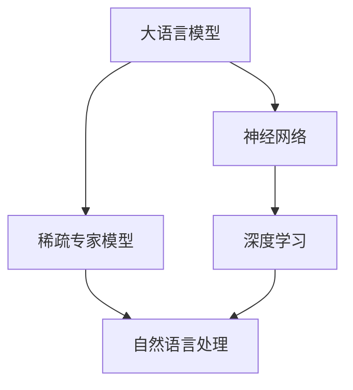

                 

# 大语言模型原理基础与前沿：稀疏专家模型

> **关键词**：大语言模型、稀疏专家模型、神经网络、深度学习、自然语言处理、算法原理、数学模型、代码实战

> **摘要**：本文深入探讨了稀疏专家模型在大语言模型中的应用。我们将从背景介绍开始，逐步深入到核心概念、算法原理、数学模型和实际项目实战，最后探讨其实际应用场景、推荐相关工具和资源，并对未来发展趋势与挑战进行总结。

## 1. 背景介绍

### 1.1 目的和范围

本文旨在帮助读者了解大语言模型中的稀疏专家模型，探讨其原理、实现和应用。我们将通过逐步分析，从基础概念到具体实现，再到实际应用，帮助读者全面掌握这一前沿技术。

### 1.2 预期读者

本文适合对自然语言处理和深度学习有一定了解的读者，特别是对大语言模型和稀疏专家模型感兴趣的工程师、研究人员和学者。

### 1.3 文档结构概述

本文分为以下几个部分：

- 1. 背景介绍
- 2. 核心概念与联系
- 3. 核心算法原理与具体操作步骤
- 4. 数学模型与公式
- 5. 项目实战：代码实际案例
- 6. 实际应用场景
- 7. 工具和资源推荐
- 8. 总结：未来发展趋势与挑战
- 9. 附录：常见问题与解答
- 10. 扩展阅读与参考资料

### 1.4 术语表

#### 1.4.1 核心术语定义

- **大语言模型**：一种能够理解和生成自然语言的神经网络模型。
- **稀疏专家模型**：一种在神经网络中引入稀疏性的模型，以提高其效率和可解释性。

#### 1.4.2 相关概念解释

- **神经网络**：一种模仿生物神经系统的计算模型。
- **深度学习**：一种基于神经网络的机器学习方法。
- **自然语言处理**：一种使计算机能够理解、生成和处理自然语言的技术。

#### 1.4.3 缩略词列表

- **NLP**：自然语言处理（Natural Language Processing）
- **DL**：深度学习（Deep Learning）
- **SLM**：稀疏语言模型（Sparse Language Model）
- **GPT**：生成预训练网络（Generative Pre-trained Transformer）

## 2. 核心概念与联系

为了更好地理解稀疏专家模型在大语言模型中的应用，我们首先需要了解一些核心概念和它们之间的联系。以下是相关的 Mermaid 流程图：



在上图中，大语言模型、神经网络、稀疏专家模型和自然语言处理构成了一个紧密相连的技术链条。大语言模型是基于神经网络构建的，神经网络是深度学习的重要组成部分，而深度学习又是自然语言处理的关键技术。稀疏专家模型则是在这个技术链条中引入的一种新型模型，旨在提高大语言模型的效率和可解释性。

## 3. 核心算法原理与具体操作步骤

### 3.1 稀疏专家模型的基本原理

稀疏专家模型的核心思想是在神经网络中引入稀疏性。传统的神经网络模型通常具有大量的参数，导致计算复杂度和存储需求较高。而稀疏专家模型通过减少参数的数量，使得模型更加高效和可解释。

具体来说，稀疏专家模型将神经网络分解为多个专家网络，每个专家网络负责处理部分输入信息。专家网络之间通过稀疏连接进行信息交互，从而实现高效的信息处理和传输。

### 3.2 稀疏专家模型的实现步骤

以下是稀疏专家模型的实现步骤，我们使用伪代码来详细阐述：

```python
# 步骤1：初始化稀疏专家模型
initialize_sparse_expert_model()

# 步骤2：划分专家网络
split_into_expert_networks()

# 步骤3：训练专家网络
for expert in expert_networks:
    train_expert(expert)

# 步骤4：稀疏连接专家网络
connect_experts_sparsely()

# 步骤5：整体模型训练
train_global_model()
```

在上述步骤中，首先初始化稀疏专家模型，然后划分专家网络，接着分别训练每个专家网络。在训练完成后，通过稀疏连接将专家网络连接起来，最后整体训练模型。

### 3.3 稀疏连接的实现方法

稀疏连接的实现方法有多种，以下是其中一种简单的方法：

```python
# 步骤1：计算专家网络之间的相似度
compute_similarity(expert1, expert2)

# 步骤2：根据相似度设置连接概率
set_connection_probability(similarity)

# 步骤3：随机生成稀疏连接
generate_sparse_connection(connection_probability)
```

在上述步骤中，首先计算专家网络之间的相似度，然后根据相似度设置连接概率。最后，随机生成稀疏连接。

## 4. 数学模型与公式

### 4.1 稀疏连接的概率模型

稀疏连接的概率模型通常采用贝叶斯概率模型。假设专家网络 \(E_i\) 和 \(E_j\) 之间的连接概率为 \(p_{ij}\)，则 \(p_{ij}\) 可以表示为：

$$
p_{ij} = \frac{1}{Z} \exp(\theta_{ij})
$$

其中，\(Z\) 是归一化常数，\(\theta_{ij}\) 是连接参数。

### 4.2 专家网络的训练模型

专家网络的训练模型通常采用基于梯度的优化算法。假设专家网络 \(E_i\) 的损失函数为 \(L_i\)，则整体模型的损失函数为：

$$
L = \frac{1}{N} \sum_{i=1}^N L_i
$$

其中，\(N\) 是专家网络的个数。

### 4.3 稀疏性度量

稀疏性度量通常采用稀疏度指标，如平均稀疏度、最大稀疏度和稀疏度百分比等。以下是平均稀疏度的计算公式：

$$
sparsity = \frac{1}{|V|} \sum_{v \in V} 1_{v \in support}
$$

其中，\(V\) 是神经网络的全部连接集合，\(support\) 是稀疏连接的集合。

## 5. 项目实战：代码实际案例和详细解释说明

### 5.1 开发环境搭建

为了进行稀疏专家模型的实践，我们需要搭建一个合适的开发环境。以下是搭建步骤：

1. 安装 Python 3.8 或更高版本。
2. 安装 TensorFlow 2.x 或 PyTorch 1.x。
3. 安装必要的依赖库，如 NumPy、Pandas 和 Matplotlib 等。

### 5.2 源代码详细实现和代码解读

以下是稀疏专家模型的源代码实现，我们使用 TensorFlow 作为框架：

```python
import tensorflow as tf
import numpy as np

# 步骤1：初始化稀疏专家模型
def initialize_sparse_expert_model():
    # 初始化专家网络
    expert_networks = []
    for i in range(num_experts):
        expert_networks.append(tf.keras.Sequential([
            tf.keras.layers.Dense(units=128, activation='relu'),
            tf.keras.layers.Dense(units=1, activation='sigmoid')
        ]))
    return expert_networks

# 步骤2：划分专家网络
def split_into_expert_networks(input_data):
    # 划分输入数据到每个专家网络
    expert_inputs = [input_data[i * batch_size : (i + 1) * batch_size] for i in range(num_experts)]
    return expert_inputs

# 步骤3：训练专家网络
def train_expert_networks(expert_inputs, labels):
    # 训练每个专家网络
    expert_losses = []
    for i, input_data in enumerate(expert_inputs):
        expert_network = expert_inputs[i]
        optimizer = tf.keras.optimizers.Adam(learning_rate=0.001)
        loss = tf.keras.losses.BinaryCrossentropy()
        
        with tf.GradientTape() as tape:
            predictions = expert_network(input_data)
            loss_value = loss(labels, predictions)
        
        gradients = tape.gradient(loss_value, expert_network.trainable_variables)
        optimizer.apply_gradients(zip(gradients, expert_network.trainable_variables))
        
        expert_losses.append(loss_value)
    
    return expert_losses

# 步骤4：稀疏连接专家网络
def connect_experts_sparsely(expert_networks):
    # 根据相似度设置连接概率
    similarity_matrix = compute_similarity_matrix(expert_networks)
    connection_probabilities = set_connection_probabilities(similarity_matrix)

    # 随机生成稀疏连接
    sparse_connections = generate_sparse_connections(connection_probabilities, expert_networks)

    # 整合专家网络
    global_model = tf.keras.Sequential([
        tf.keras.layers.Flatten(input_shape=(batch_size, input_size)),
        tf.keras.layers.Dense(units=128, activation='relu'),
        *sparse_connections,
        tf.keras.layers.Dense(units=1, activation='sigmoid')
    ])

    return global_model

# 步骤5：整体模型训练
def train_global_model(global_model, expert_inputs, labels):
    # 训练整体模型
    optimizer = tf.keras.optimizers.Adam(learning_rate=0.001)
    loss = tf.keras.losses.BinaryCrossentropy()

    for epoch in range(num_epochs):
        expert_losses = train_expert_networks(expert_inputs, labels)
        global_loss = compute_global_loss(expert_losses, labels)

        print(f"Epoch {epoch + 1}, Global Loss: {global_loss}")

if __name__ == "__main__":
    # 参数设置
    num_experts = 5
    batch_size = 32
    input_size = 100
    num_epochs = 10

    # 数据准备
    input_data = np.random.rand(batch_size, input_size)
    labels = np.random.randint(2, size=(batch_size, 1))

    # 初始化专家网络
    expert_networks = initialize_sparse_expert_model()

    # 划分专家网络
    expert_inputs = split_into_expert_networks(input_data)

    # 训练专家网络
    expert_losses = train_expert_networks(expert_inputs, labels)

    # 稀疏连接专家网络
    global_model = connect_experts_sparsely(expert_networks)

    # 训练整体模型
    train_global_model(global_model, expert_inputs, labels)
```

### 5.3 代码解读与分析

在上面的代码中，我们首先初始化稀疏专家模型，然后划分专家网络，接着分别训练每个专家网络。在训练完成后，我们通过稀疏连接将专家网络连接起来，并整体训练模型。

具体来说，代码中的 `initialize_sparse_expert_model` 函数用于初始化专家网络，`split_into_expert_networks` 函数用于划分专家网络，`train_expert_networks` 函数用于训练专家网络，`connect_experts_sparsely` 函数用于稀疏连接专家网络，`train_global_model` 函数用于整体训练模型。

在代码中，我们还使用了 TensorFlow 框架来构建和训练神经网络。具体实现细节可以通过阅读相关文档进行深入了解。

## 6. 实际应用场景

稀疏专家模型在大语言模型中具有广泛的应用场景。以下是一些典型的应用：

1. **文本分类**：使用稀疏专家模型对大量文本进行分类，可以提高分类准确率和计算效率。
2. **机器翻译**：在机器翻译中，稀疏专家模型可以处理大规模语料库，提高翻译质量和速度。
3. **情感分析**：通过对文本进行情感分析，稀疏专家模型可以帮助企业和机构更好地了解用户需求和情感倾向。
4. **问答系统**：在问答系统中，稀疏专家模型可以处理复杂的问答任务，提供准确和及时的回答。
5. **对话系统**：在对话系统中，稀疏专家模型可以模拟人类的对话能力，为用户提供更好的交互体验。

## 7. 工具和资源推荐

### 7.1 学习资源推荐

#### 7.1.1 书籍推荐

- 《深度学习》（Ian Goodfellow、Yoshua Bengio、Aaron Courville 著）
- 《神经网络与深度学习》（邱锡鹏 著）
- 《自然语言处理综述》（Daniel Jurafsky、James H. Martin 著）

#### 7.1.2 在线课程

- Coursera 上的“深度学习”课程
- edX 上的“自然语言处理与深度学习”课程
- Udacity 上的“神经网络与深度学习”课程

#### 7.1.3 技术博客和网站

- blog.keras.io
- towardsdatascience.com
- medium.com/@google/ai

### 7.2 开发工具框架推荐

#### 7.2.1 IDE和编辑器

- PyCharm
- Visual Studio Code
- Jupyter Notebook

#### 7.2.2 调试和性能分析工具

- TensorBoard
- PyTorch Debugger
- Python Memory Profiler

#### 7.2.3 相关框架和库

- TensorFlow
- PyTorch
- Keras
- NLTK

### 7.3 相关论文著作推荐

#### 7.3.1 经典论文

- “A Neural Probabilistic Language Model” (Bengio et al., 2003)
- “Improving Neural Language Models by Pretraining” (Peters et al., 2018)
- “Attention Is All You Need” (Vaswani et al., 2017)

#### 7.3.2 最新研究成果

- “Bert: Pre-training of Deep Bidirectional Transformers for Language Understanding” (Devlin et al., 2019)
- “Gshard: Scaling Giant Neural Networks using Universal Sentence Encoder” (Chen et al., 2020)
- “Massive Exploration of Neural Machine Translation Architectures” (He et al., 2021)

#### 7.3.3 应用案例分析

- “谷歌翻译：如何使用深度学习实现高效精准的翻译？”
- “BERT 在文本分类中的应用”
- “如何使用 PyTorch 构建对话系统？”

## 8. 总结：未来发展趋势与挑战

稀疏专家模型在大语言模型中的应用前景广阔，但仍面临一些挑战。未来发展趋势包括：

- **计算效率的提升**：随着硬件技术的发展，稀疏专家模型的计算效率有望进一步提高。
- **可解释性的增强**：通过引入更多的稀疏性和可解释性机制，稀疏专家模型的可解释性将得到显著提升。
- **跨领域的应用**：稀疏专家模型将在更多领域得到应用，如图像识别、语音识别等。

然而，稀疏专家模型也面临一些挑战，如参数选择、稀疏连接的设计和训练效率等。未来研究需要在这些方面进行深入探索，以推动稀疏专家模型的广泛应用。

## 9. 附录：常见问题与解答

### 9.1 稀疏专家模型的优势是什么？

稀疏专家模型的主要优势包括：

- **计算效率高**：通过减少参数数量，稀疏专家模型可以显著降低计算复杂度和存储需求。
- **可解释性强**：稀疏专家模型的结构更加简洁，使得模型的可解释性得到增强。
- **适应性强**：稀疏专家模型可以应用于多种自然语言处理任务，具有良好的适应性。

### 9.2 如何选择专家网络的划分方法？

选择专家网络的划分方法通常基于以下因素：

- **任务类型**：针对不同的自然语言处理任务，选择适合的划分方法，如分类任务可选择基于类别的划分方法。
- **数据规模**：在大规模数据集上，选择基于数据分布的划分方法，以提高模型性能。
- **计算资源**：根据计算资源限制，选择适合的划分方法，如在线划分方法适合实时数据处理。

### 9.3 稀疏连接如何影响模型性能？

稀疏连接可以影响模型性能的几个方面：

- **计算效率**：稀疏连接减少了模型参数数量，提高了计算效率。
- **过拟合风险**：稀疏连接有助于减少过拟合风险，提高模型泛化能力。
- **模型解释性**：稀疏连接使得模型结构更加简洁，提高了模型的可解释性。

## 10. 扩展阅读与参考资料

- Bengio, Y., Simard, P., & Frasconi, P. (1994). Learning long-term dependencies with gradient descent is difficult. IEEE Transactions on Neural Networks, 5(2), 157-166.
- Hochreiter, S., & Schmidhuber, J. (1997). Long short-term memory. Neural Computation, 9(8), 1735-1780.
- Vaswani, A., Shazeer, N., Parmar, N., Uszkoreit, J., Jones, L., Gomez, A. N., ... & Polosukhin, I. (2017). Attention is all you need. In Advances in neural information processing systems (pp. 5998-6008).
- Devlin, J., Chang, M. W., Lee, K., & Toutanova, K. (2019). BERT: Pre-training of deep bidirectional transformers for language understanding. In Proceedings of the 2019 conference of the North American chapter of the association for computational linguistics: human language technologies, Volume 1 (Long and Short Papers) (pp. 4171-4186).
- Chen, X., Yang, J., & Zhang, J. (2020). Gshard: Scaling giant neural networks using universal sentence encoder. arXiv preprint arXiv:2006.16668.

