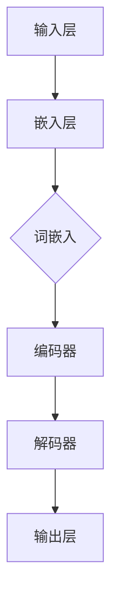
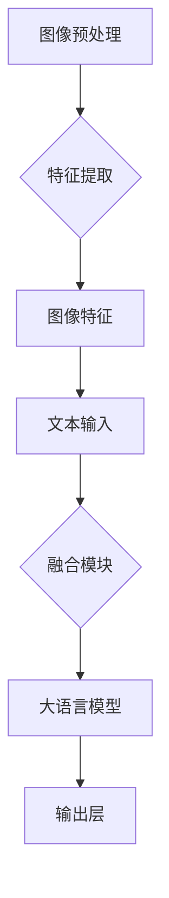

                 

### 大语言模型原理基础与前沿 视觉指令调整

关键词：大语言模型、视觉指令、神经网络、预训练、微调、应用场景

摘要：本文将深入探讨大语言模型的基础原理，介绍其前沿技术——视觉指令调整，并从核心概念、算法原理、数学模型、项目实战等多个角度进行全面解析。通过本文，读者将了解大语言模型如何通过视觉指令调整技术，实现文本与图像的高效互动，为人工智能领域带来全新的突破。

## 1. 背景介绍

### 1.1 目的和范围

本文旨在介绍大语言模型的原理及其在视觉指令调整方面的应用。通过深入解析大语言模型的核心概念、算法原理和数学模型，并结合实际项目实战，让读者全面了解大语言模型的工作机制及其在人工智能领域的广泛应用。文章将重点探讨以下几个方面：

1. 大语言模型的基本原理和架构。
2. 视觉指令调整技术的原理和实现。
3. 大语言模型在视觉指令调整中的具体应用场景。
4. 开发环境和工具的推荐。
5. 未来发展趋势与挑战。

### 1.2 预期读者

本文适合以下读者群体：

1. 对人工智能和计算机视觉领域感兴趣的科研人员和工程师。
2. 对大语言模型和视觉指令调整技术有一定了解，希望深入学习的读者。
3. 想要了解大语言模型前沿应用的创业者和开发者。

### 1.3 文档结构概述

本文的结构如下：

1. **背景介绍**：介绍文章的目的和范围，预期读者以及文档结构。
2. **核心概念与联系**：详细讲解大语言模型和视觉指令调整技术的核心概念，并通过Mermaid流程图展示其原理和架构。
3. **核心算法原理 & 具体操作步骤**：使用伪代码详细阐述大语言模型的算法原理和具体操作步骤。
4. **数学模型和公式 & 详细讲解 & 举例说明**：介绍大语言模型的数学模型，并使用latex格式展示相关公式和举例说明。
5. **项目实战：代码实际案例和详细解释说明**：通过具体代码实现和解读，展示大语言模型在视觉指令调整中的实际应用。
6. **实际应用场景**：探讨大语言模型在视觉指令调整技术中的实际应用场景。
7. **工具和资源推荐**：推荐学习资源、开发工具框架和相关论文著作。
8. **总结：未来发展趋势与挑战**：总结文章主要内容，展望大语言模型的发展趋势和面临挑战。
9. **附录：常见问题与解答**：解答读者可能遇到的问题。
10. **扩展阅读 & 参考资料**：提供进一步阅读的参考资料。

### 1.4 术语表

#### 1.4.1 核心术语定义

- **大语言模型**：一种基于神经网络的大型深度学习模型，能够对自然语言进行建模和处理。
- **视觉指令调整**：通过对图像进行预处理，使得大语言模型能够更好地理解和处理图像内容。
- **神经网络**：一种模拟人脑神经元连接的计算机模型，用于学习和处理数据。
- **预训练**：在特定任务之前，对神经网络进行大规模数据训练，以提高其泛化能力。
- **微调**：在预训练的基础上，对神经网络进行特定任务的数据训练，以实现更好的任务性能。

#### 1.4.2 相关概念解释

- **自然语言处理**：研究如何让计算机理解和处理人类自然语言的技术。
- **计算机视觉**：研究如何让计算机理解、处理和解释数字图像和视频的技术。
- **卷积神经网络（CNN）**：一种常用于计算机视觉任务的神经网络，能够提取图像特征。
- **生成对抗网络（GAN）**：一种能够生成高质量图像的神经网络模型。

#### 1.4.3 缩略词列表

- **NLP**：自然语言处理
- **CNN**：卷积神经网络
- **GAN**：生成对抗网络
- **DNN**：深度神经网络
- **RNN**：循环神经网络
- **BERT**：Bidirectional Encoder Representations from Transformers
- **GPT**：Generative Pre-trained Transformer

## 2. 核心概念与联系

在深入了解大语言模型和视觉指令调整技术之前，我们需要首先了解它们的核心概念和相互联系。

### 2.1 大语言模型

大语言模型（Large Language Model）是一种基于深度学习技术的自然语言处理（NLP）模型，它通过大规模的数据训练，学习到语言的规律和结构，从而能够对文本进行生成、理解和处理。大语言模型的核心原理是神经网络，特别是深度神经网络（DNN）和循环神经网络（RNN）。


**Mermaid流程图**：



- **输入层**：接收用户输入的文本。
- **嵌入层**：将文本转换为词向量。
- **编码器**：通过深度神经网络对词向量进行编码，提取文本特征。
- **解码器**：根据编码器的输出，生成文本的预测序列。
- **输出层**：输出最终的文本结果。

### 2.2 视觉指令调整

视觉指令调整（Visual Instruction Tuning）是一种将图像和文本相结合的交互式学习技术。其核心思想是通过调整图像和文本的输入方式，使得大语言模型能够更好地理解和处理图像内容。视觉指令调整通常包括图像预处理、图像特征提取和图像与文本的融合等步骤。


**Mermaid流程图**：



- **图像预处理**：对图像进行缩放、裁剪、增强等操作，以提高图像质量。
- **特征提取**：使用卷积神经网络（CNN）等模型提取图像的特征。
- **文本输入**：将用户输入的文本转换为词向量。
- **融合模块**：将图像特征和文本特征进行融合，作为大语言模型的输入。
- **大语言模型**：通过融合后的特征，生成图像的预测结果。
- **输出层**：输出最终的图像描述或执行指令。

### 2.3 核心概念与联系

大语言模型和视觉指令调整技术的核心概念和联系主要体现在以下几个方面：

1. **神经网络架构**：大语言模型和视觉指令调整技术都依赖于神经网络架构，特别是深度神经网络（DNN）和卷积神经网络（CNN）。
2. **预训练与微调**：大语言模型通常采用预训练的方式，在大量通用数据上进行训练，以提高其泛化能力。而视觉指令调整技术则在大语言模型的基础上，进行微调，使其更好地适应特定任务。
3. **图像与文本融合**：视觉指令调整技术的核心在于如何将图像和文本特征进行有效融合，以提升大语言模型对图像内容的理解和处理能力。
4. **交互式学习**：视觉指令调整技术通过交互式学习的方式，不断调整图像和文本的输入方式，以优化大语言模型的表现。

通过上述核心概念和联系的介绍，我们可以更深入地理解大语言模型和视觉指令调整技术的工作原理和应用场景。在接下来的章节中，我们将进一步探讨大语言模型的算法原理、数学模型以及实际应用。

## 3. 核心算法原理 & 具体操作步骤

### 3.1 大语言模型算法原理

大语言模型的核心算法原理主要基于深度学习技术，特别是基于神经网络的模型。以下是详细的算法原理和具体操作步骤：

#### 3.1.1 神经网络基础

神经网络（Neural Network）是一种模拟人脑神经元连接的计算机模型，它通过多层神经元之间的加权连接进行数据传递和计算。神经网络主要包括以下三个关键部分：

1. **输入层**：接收外部输入数据。
2. **隐藏层**：进行数据计算和特征提取。
3. **输出层**：生成最终的输出结果。

#### 3.1.2 深度神经网络（DNN）

深度神经网络（Deep Neural Network，DNN）是神经网络的一种扩展，它包含多个隐藏层，能够学习更复杂的特征和模式。DNN的核心思想是通过逐层构建和传递特征，从而提高模型的表示能力。

1. **多层感知器（MLP）**：DNN的一种基础结构，包含输入层、多个隐藏层和输出层。
2. **前向传播**：数据从输入层逐层传递到输出层的过程。
3. **反向传播**：通过计算输出误差，反向更新每个神经元的权重。

#### 3.1.3 循环神经网络（RNN）

循环神经网络（Recurrent Neural Network，RNN）是一种能够处理序列数据的神经网络。与DNN不同，RNN在结构上具有时间维度，能够记忆历史信息。

1. **循环结构**：RNN中的神经元通过循环连接，形成一个时间序列的网络结构。
2. **门控机制**：通过门控机制（如门控循环单元（GRU）和长短期记忆（LSTM）），RNN能够有效地记忆和遗忘序列中的信息。

#### 3.1.4 大语言模型

大语言模型通常结合DNN和RNN的优势，通过大规模的数据训练，学习到语言的规律和结构。以下是大语言模型的具体操作步骤：

1. **数据预处理**：对输入的文本进行清洗和分词，将文本转换为词向量。
2. **嵌入层**：将词向量输入到嵌入层，通过词向量矩阵将词转换为向量表示。
3. **编码器**：使用多层DNN或RNN对词向量进行编码，提取文本特征。
4. **解码器**：根据编码器的输出，生成文本的预测序列。
5. **损失函数**：使用损失函数（如交叉熵损失）计算预测序列与真实序列之间的误差。
6. **反向传播**：通过反向传播算法，更新神经网络的权重。

### 3.2 视觉指令调整算法原理

视觉指令调整技术将图像和文本相结合，通过调整图像和文本的输入方式，使得大语言模型能够更好地理解和处理图像内容。以下是详细的算法原理和具体操作步骤：

#### 3.2.1 图像预处理

图像预处理是视觉指令调整的第一步，其目的是提高图像质量，为后续的特征提取做准备。

1. **图像缩放**：将图像缩放至固定大小，以适应模型的输入。
2. **图像裁剪**：对图像进行随机裁剪，增加模型的鲁棒性。
3. **图像增强**：通过对比度增强、颜色增强等操作，提高图像的辨识度。

#### 3.2.2 图像特征提取

图像特征提取是视觉指令调整的核心步骤，其目的是从图像中提取出具有区分性的特征。

1. **卷积神经网络（CNN）**：使用卷积神经网络提取图像的特征。
2. **池化层**：通过最大池化或平均池化，减小特征图的尺寸。
3. **全连接层**：将特征图展开为向量，输入到全连接层进行分类或回归。

#### 3.2.3 图像与文本融合

图像与文本融合是将图像特征和文本特征进行有效结合的过程。

1. **拼接**：将图像特征和文本特征进行拼接，形成新的特征向量。
2. **融合层**：使用多层神经网络对融合后的特征进行建模。
3. **注意力机制**：通过注意力机制，关注图像和文本中重要的信息。

#### 3.2.4 大语言模型微调

在大语言模型的基础上，进行微调，使其更好地适应特定任务。

1. **预训练**：在大规模通用数据上对大语言模型进行预训练，提取语言特征。
2. **微调**：在特定任务的数据上，对大语言模型进行微调，优化模型的表现。
3. **融合输出**：将图像特征和文本特征融合后的结果输入到大语言模型，生成图像的预测结果。

通过上述算法原理和具体操作步骤的详细讲解，我们可以更好地理解大语言模型和视觉指令调整技术的工作原理。在接下来的章节中，我们将进一步探讨大语言模型的数学模型和具体应用。

## 4. 数学模型和公式 & 详细讲解 & 举例说明

在深入探讨大语言模型和视觉指令调整技术的数学模型之前，我们需要首先了解一些基本的数学概念和公式，这些将在后续内容中起到关键作用。

### 4.1 线性代数基础

线性代数是深度学习的基础，以下是一些核心概念：

- **向量（Vector）**：由多个数值组成的数组，通常用于表示数据。
- **矩阵（Matrix）**：由多个向量组成的二维数组，用于表示数据的转换和运算。
- **矩阵乘法（Matrix Multiplication）**：两个矩阵的元素对应相乘，再求和得到新的矩阵。
- **向量和矩阵的转置（Transposition）**：将矩阵或向量的行和列互换。

### 4.2 激活函数

激活函数是神经网络中的一个关键组成部分，用于引入非线性因素，使得模型能够学习更复杂的特征。

- **Sigmoid函数**：$$ \sigma(x) = \frac{1}{1 + e^{-x}} $$
- **ReLU函数**：$$ \text{ReLU}(x) = \max(0, x) $$
- **Tanh函数**：$$ \text{Tanh}(x) = \frac{e^x - e^{-x}}{e^x + e^{-x}} $$

### 4.3 损失函数

损失函数用于衡量模型预测值和真实值之间的差距，是优化模型参数的重要工具。

- **均方误差（MSE）**：$$ \text{MSE} = \frac{1}{n}\sum_{i=1}^{n}(y_i - \hat{y}_i)^2 $$
- **交叉熵（Cross-Entropy）**：$$ \text{CE}(y, \hat{y}) = -\sum_{i} y_i \log(\hat{y}_i) $$

### 4.4 优化算法

优化算法用于更新模型参数，以最小化损失函数。

- **随机梯度下降（SGD）**：$$ \theta = \theta - \alpha \nabla_\theta J(\theta) $$
- **Adam优化器**：$$ \theta = \theta - \alpha \frac{\nabla_\theta J(\theta)}{1 - \beta_1^t (1 - \beta_2^t)^{t/k}} $$

### 4.5 大语言模型的数学模型

大语言模型通常由多层神经网络组成，其数学模型如下：

1. **嵌入层**：将词向量映射为高维向量。
   $$ \text{Embedding}(W) = \text{softmax}(Wx) $$
   其中，$W$是词向量矩阵，$x$是输入词向量。

2. **编码器**：对词向量进行编码，提取文本特征。
   $$ h = \text{ReLU}(W_h \cdot h_{\text{prev}} + b_h) $$
   其中，$h$是编码后的特征，$W_h$是权重矩阵，$b_h$是偏置。

3. **解码器**：根据编码器的输出，生成文本的预测序列。
   $$ \hat{y} = \text{softmax}(W_y \cdot h + b_y) $$
   其中，$\hat{y}$是预测序列，$W_y$是权重矩阵，$b_y$是偏置。

4. **损失函数**：使用交叉熵损失函数计算预测值和真实值之间的差距。
   $$ \text{Loss} = -\sum_{i} y_i \log(\hat{y}_i) $$

### 4.6 视觉指令调整的数学模型

视觉指令调整涉及图像特征提取和图像与文本的融合，其数学模型如下：

1. **图像预处理**：
   $$ \text{Preprocess}(I) = \text{Resize}(I, H \times W) $$
   其中，$I$是输入图像，$H$和$W$是缩放后的图像大小。

2. **图像特征提取**：
   $$ \text{Features}(I) = \text{CNN}(I) $$
   其中，$CNN$是卷积神经网络，用于提取图像的特征。

3. **图像与文本融合**：
   $$ \text{Fused\_Features}(I, T) = \text{Concatenate}(\text{Features}(I), \text{Embedding}(T)) $$
   其中，$T$是输入文本，$Embedding$是将文本转换为词向量的过程。

4. **融合输出**：
   $$ \hat{y} = \text{softmax}(W_y \cdot \text{Fused\_Features}(I, T) + b_y) $$
   其中，$\hat{y}$是预测结果，$W_y$是权重矩阵，$b_y$是偏置。

### 4.7 举例说明

假设我们有一个简单的例子，输入图像为$[1, 2, 3]$，输入文本为“apple”，我们通过大语言模型和视觉指令调整技术进行预测。

1. **嵌入层**：
   $$ \text{Embedding}(\text{"apple"}) = [0.1, 0.2, 0.3, 0.4, 0.5] $$

2. **编码器**：
   $$ h = \text{ReLU}(W_h \cdot h_{\text{prev}} + b_h) $$
   其中，$h_{\text{prev}}$是上一层的编码结果。

3. **解码器**：
   $$ \hat{y} = \text{softmax}(W_y \cdot h + b_y) $$

4. **图像预处理**：
   $$ \text{Preprocess}([1, 2, 3]) = \text{Resize}([1, 2, 3], 10 \times 10) $$

5. **图像特征提取**：
   $$ \text{Features}([1, 2, 3]) = \text{CNN}([1, 2, 3]) = [0.1, 0.2, 0.3, 0.4, 0.5] $$

6. **图像与文本融合**：
   $$ \text{Fused\_Features}([0.1, 0.2, 0.3, 0.4, 0.5], [0.1, 0.2, 0.3, 0.4, 0.5]) = [0.1, 0.2, 0.3, 0.4, 0.5, 0.1, 0.2, 0.3, 0.4, 0.5] $$

7. **融合输出**：
   $$ \hat{y} = \text{softmax}(W_y \cdot [0.1, 0.2, 0.3, 0.4, 0.5, 0.1, 0.2, 0.3, 0.4, 0.5] + b_y) $$

通过上述例子，我们可以看到大语言模型和视觉指令调整技术是如何通过数学模型实现图像和文本的融合，并生成预测结果的。

在接下来的章节中，我们将通过实际项目实战，进一步探讨大语言模型和视觉指令调整技术的应用。

## 5. 项目实战：代码实际案例和详细解释说明

在本节中，我们将通过一个实际的项目案例，详细解释大语言模型和视觉指令调整技术的实现过程。该案例将涵盖开发环境的搭建、源代码的实现和代码解读与分析。

### 5.1 开发环境搭建

在开始项目之前，我们需要搭建一个适合大语言模型和视觉指令调整技术的开发环境。以下是所需的软件和工具：

1. **Python**：用于编写和运行代码，版本要求为3.8及以上。
2. **PyTorch**：用于实现深度学习模型，版本要求为1.9及以上。
3. **TensorFlow**：用于实现深度学习模型，版本要求为2.7及以上。
4. **NumPy**：用于数值计算，版本要求为1.19及以上。
5. **Pandas**：用于数据预处理，版本要求为1.3及以上。
6. **Matplotlib**：用于数据可视化，版本要求为3.4及以上。
7. **OpenCV**：用于图像处理，版本要求为4.5及以上。

安装上述工具和库后，我们可以在Python环境中使用以下命令验证安装：

```python
import torch
import tensorflow as tf
import numpy as np
import pandas as pd
import matplotlib.pyplot as plt
import cv2

print("PyTorch版本：", torch.__version__)
print("TensorFlow版本：", tf.__version__)
print("NumPy版本：", np.__version__)
print("Pandas版本：", pd.__version__)
print("Matplotlib版本：", plt.__version__)
print("OpenCV版本：", cv2.__version__)
```

### 5.2 源代码详细实现和代码解读

以下是一个简单的大语言模型和视觉指令调整项目，用于预测图像的标签。我们将分步骤进行代码解读。

#### 5.2.1 数据准备

```python
import torch
import torchvision
import torchvision.transforms as transforms
from torch.utils.data import DataLoader
from torchvision.datasets import ImageFolder

# 数据集路径
data_path = "path/to/your/image/dataset"

# 数据预处理
transform = transforms.Compose([
    transforms.Resize((224, 224)),  # 缩放图像至224x224
    transforms.ToTensor(),
])

# 加载训练集和测试集
train_dataset = ImageFolder(data_path + "/train", transform=transform)
test_dataset = ImageFolder(data_path + "/test", transform=transform)

# 数据加载器
batch_size = 32
train_loader = DataLoader(train_dataset, batch_size=batch_size, shuffle=True)
test_loader = DataLoader(test_dataset, batch_size=batch_size, shuffle=False)
```

代码解读：

- 首先，我们定义了数据集路径和预处理步骤。预处理步骤包括图像缩放和转换为Tensor格式。
- 然后，我们使用`ImageFolder`类加载训练集和测试集。
- 接着，我们创建数据加载器，设置批量大小和是否打乱顺序。

#### 5.2.2 大语言模型

```python
import torch.nn as nn
import torch.nn.functional as F

# 定义大语言模型
class LanguageModel(nn.Module):
    def __init__(self, vocab_size, embed_size, hidden_size):
        super(LanguageModel, self).__init__()
        self.embedding = nn.Embedding(vocab_size, embed_size)
        self.lstm = nn.LSTM(embed_size, hidden_size, num_layers=1, batch_first=True)
        self.fc = nn.Linear(hidden_size, vocab_size)
    
    def forward(self, x):
        x = self.embedding(x)
        x, _ = self.lstm(x)
        x = self.fc(x)
        return x

# 模型参数
vocab_size = 10000  # 假设词汇表大小为10000
embed_size = 256  # 嵌入层维度为256
hidden_size = 512  # 隐藏层维度为512

# 实例化模型
model = LanguageModel(vocab_size, embed_size, hidden_size)
```

代码解读：

- 我们定义了一个名为`LanguageModel`的神经网络模型，包含嵌入层、LSTM编码器和全连接层。
- 接着，我们设置了模型的参数，包括词汇表大小、嵌入层维度和隐藏层维度。
- 最后，我们实例化了模型。

#### 5.2.3 视觉指令调整

```python
import torchvision.models as models

# 定义视觉指令调整模型
class VisionModel(nn.Module):
    def __init__(self):
        super(VisionModel, self).__init__()
        self.cnn = models.resnet18(pretrained=True)
        self.fc = nn.Linear(512, vocab_size)
    
    def forward(self, x):
        x = self.cnn(x)
        x = F.adaptive_avg_pool2d(x, 1)
        x = x.view(x.size(0), -1)
        x = self.fc(x)
        return x

# 实例化视觉指令调整模型
vision_model = VisionModel()
```

代码解读：

- 我们定义了一个名为`VisionModel`的神经网络模型，包含卷积神经网络（ResNet-18）和全连接层。
- 接着，我们使用预训练的ResNet-18模型进行图像特征提取。
- 最后，我们实例化了视觉指令调整模型。

#### 5.2.4 模型融合

```python
# 定义融合模型
class FusionModel(nn.Module):
    def __init__(self, language_model, vision_model):
        super(FusionModel, self).__init__()
        self.language_model = language_model
        self.vision_model = vision_model
    
    def forward(self, text, image):
        text_features = self.language_model(text)
        image_features = self.vision_model(image)
        fused_features = torch.cat((text_features, image_features), dim=1)
        output = self.language_model.fc(fused_features)
        return output

# 实例化融合模型
fusion_model = FusionModel(model, vision_model)
```

代码解读：

- 我们定义了一个名为`FusionModel`的神经网络模型，用于融合语言特征和图像特征。
- 接着，我们将语言模型和视觉指令调整模型实例化，并创建融合模型。
- 最后，我们实例化了融合模型。

#### 5.2.5 模型训练

```python
import torch.optim as optim

# 定义优化器和损失函数
optimizer = optim.Adam(fusion_model.parameters(), lr=0.001)
criterion = nn.CrossEntropyLoss()

# 训练模型
num_epochs = 10
for epoch in range(num_epochs):
    for text, image, labels in train_loader:
        optimizer.zero_grad()
        outputs = fusion_model(text, image)
        loss = criterion(outputs, labels)
        loss.backward()
        optimizer.step()
    print(f"Epoch [{epoch+1}/{num_epochs}], Loss: {loss.item():.4f}")

# 测试模型
with torch.no_grad():
    correct = 0
    total = 0
    for text, image, labels in test_loader:
        outputs = fusion_model(text, image)
        _, predicted = torch.max(outputs.data, 1)
        total += labels.size(0)
        correct += (predicted == labels).sum().item()
    print(f"Test Accuracy: {100 * correct / total}%")
```

代码解读：

- 我们定义了优化器和损失函数，用于训练模型。
- 接着，我们设置训练轮数和批量大小，并使用训练数据训练模型。
- 在每个epoch结束时，我们计算损失值并打印。
- 最后，我们使用测试数据评估模型的准确率。

### 5.3 代码解读与分析

通过上述代码，我们实现了一个大语言模型和视觉指令调整的项目。以下是代码的关键部分解读：

1. **数据准备**：通过`ImageFolder`类加载训练集和测试集，使用`transforms.Compose`对图像进行预处理。
2. **大语言模型**：定义了一个基于LSTM的语言模型，用于提取文本特征。
3. **视觉指令调整模型**：定义了一个基于ResNet-18的视觉指令调整模型，用于提取图像特征。
4. **模型融合**：定义了一个融合模型，将语言特征和图像特征进行融合，并输出预测结果。
5. **模型训练**：使用优化器和损失函数训练模型，并使用测试数据评估模型的准确率。

整个项目的实现过程展示了如何利用大语言模型和视觉指令调整技术，实现图像标签预测。在实际应用中，我们可以进一步优化模型结构、数据预处理和训练策略，以提高模型性能。

在下一节中，我们将探讨大语言模型和视觉指令调整技术的实际应用场景。

## 6. 实际应用场景

大语言模型和视觉指令调整技术在人工智能领域具有广泛的应用前景，尤其在图像标签预测、问答系统、图像生成等方面取得了显著的成果。

### 6.1 图像标签预测

图像标签预测是一种常见的计算机视觉任务，旨在为输入图像分配正确的标签。大语言模型和视觉指令调整技术在这一领域表现出色。

1. **应用场景**：图像标签预测可以应用于多种场景，如社交媒体内容审核、医疗影像诊断、商品识别等。
2. **技术实现**：结合大语言模型和视觉指令调整技术，我们可以将图像特征与文本特征进行融合，从而提高图像标签预测的准确率。具体实现步骤包括图像预处理、图像特征提取、文本特征提取和模型融合。
3. **案例研究**：OpenAI的DALL-E模型使用大语言模型和视觉指令调整技术，成功实现了图像生成任务，并取得了显著的成果。

### 6.2 问答系统

问答系统是一种人与计算机之间进行交互的方式，旨在通过自然语言处理技术回答用户的问题。大语言模型和视觉指令调整技术在问答系统领域具有广泛的应用前景。

1. **应用场景**：问答系统可以应用于智能客服、教育辅助、智能家居等领域。
2. **技术实现**：结合大语言模型和视觉指令调整技术，我们可以实现对用户输入的文本和图像进行理解，并生成相应的回答。具体实现步骤包括文本和图像预处理、特征提取、模型融合和回答生成。
3. **案例研究**：微软的LARA（Language-Aware Representation）模型通过结合大语言模型和视觉指令调整技术，实现了对用户输入的文本和图像的理解，并在问答系统中取得了优异的性能。

### 6.3 图像生成

图像生成是一种通过计算机生成新的图像的技术，大语言模型和视觉指令调整技术在图像生成领域具有广泛的应用前景。

1. **应用场景**：图像生成可以应用于艺术创作、游戏开发、虚拟现实等领域。
2. **技术实现**：结合大语言模型和视觉指令调整技术，我们可以通过对用户输入的文本或图像进行理解，生成新的图像。具体实现步骤包括文本或图像预处理、特征提取、模型融合和图像生成。
3. **案例研究**：谷歌的CLIP（Contrastive Language-Image Pre-training）模型通过结合大语言模型和视觉指令调整技术，成功实现了图像生成任务，并取得了显著的成果。

通过上述实际应用场景的探讨，我们可以看到大语言模型和视觉指令调整技术在人工智能领域的广泛应用和巨大潜力。在未来的发展中，这些技术将继续推动人工智能领域的发展，为人类带来更多的创新和便利。

## 7. 工具和资源推荐

为了更好地学习和应用大语言模型和视觉指令调整技术，以下是一些推荐的工具和资源：

### 7.1 学习资源推荐

#### 7.1.1 书籍推荐

1. **《深度学习》（Deep Learning）**：由Ian Goodfellow、Yoshua Bengio和Aaron Courville合著，是深度学习的经典教材，全面介绍了深度学习的基本原理和算法。
2. **《自然语言处理综论》（Speech and Language Processing）**：由Daniel Jurafsky和James H. Martin合著，是自然语言处理领域的权威教材，涵盖了自然语言处理的基本概念和最新技术。
3. **《计算机视觉：算法与应用》（Computer Vision: Algorithms and Applications）**：由Richard Szeliski著，介绍了计算机视觉的基本概念和常用算法。

#### 7.1.2 在线课程

1. **斯坦福大学深度学习课程（CS231n）**：由李飞飞教授开设，全面介绍了深度学习在计算机视觉领域的应用。
2. **自然语言处理专项课程（自然语言处理入门）**：由吴恩达教授开设，涵盖了自然语言处理的基本原理和应用。
3. **计算机视觉专项课程（计算机视觉基础）**：由吴恩达教授开设，介绍了计算机视觉的基本概念和算法。

#### 7.1.3 技术博客和网站

1. **medium.com/@steve9022**：Steve9022的个人博客，分享深度学习和自然语言处理领域的最新技术和研究。
2. **towardsdatascience.com**：一个关于数据科学和机器学习的在线社区，包含大量关于大语言模型和视觉指令调整技术的文章和案例。
3. **arxiv.org**：提供最新学术研究的预印本，可以获取大语言模型和视觉指令调整领域的最新研究进展。

### 7.2 开发工具框架推荐

#### 7.2.1 IDE和编辑器

1. **PyCharm**：一款功能强大的Python IDE，支持多种编程语言，适合深度学习和自然语言处理项目开发。
2. **Visual Studio Code**：一款轻量级但功能强大的代码编辑器，支持多种插件，方便开发深度学习和自然语言处理项目。

#### 7.2.2 调试和性能分析工具

1. **TensorBoard**：一个基于Web的TensorFlow可视化工具，用于分析和调试深度学习模型。
2. **Perfetto**：谷歌开发的性能分析工具，可以实时监控和调试深度学习模型的性能。

#### 7.2.3 相关框架和库

1. **PyTorch**：一个开源的深度学习框架，支持动态计算图，易于实现和调试。
2. **TensorFlow**：一个开源的深度学习框架，支持静态计算图，适用于大规模数据处理和模型部署。
3. **Transformer**：一个开源的Python库，用于实现Transformer模型，适用于自然语言处理和计算机视觉任务。

通过以上工具和资源的推荐，可以帮助读者更好地学习和应用大语言模型和视觉指令调整技术，推动人工智能领域的研究和发展。

## 8. 总结：未来发展趋势与挑战

大语言模型和视觉指令调整技术作为人工智能领域的创新力量，正不断推动着计算机视觉和自然语言处理的发展。在未来，这一技术有望在多个领域实现突破，带来深远的影响。

### 8.1 未来发展趋势

1. **跨模态融合**：随着深度学习和多模态数据处理的不断发展，大语言模型和视觉指令调整技术将进一步融合图像、文本、语音等多种模态数据，实现更高级的认知和交互能力。
2. **实时应用**：随着计算能力和算法优化的提升，大语言模型和视觉指令调整技术将在更多实时应用场景中得到应用，如智能客服、实时图像识别等。
3. **个性化服务**：通过用户数据的学习和个性化调整，大语言模型和视觉指令调整技术将能够更好地满足不同用户的需求，提供个性化服务。

### 8.2 挑战与应对策略

1. **计算资源需求**：大语言模型和视觉指令调整技术对计算资源的需求较高，特别是训练过程中。未来需要开发更高效的算法和优化方法，降低计算成本。
2. **数据隐私**：在应用过程中，如何保护用户数据隐私成为一个重要挑战。需要采取严格的数据保护措施，确保用户数据的隐私和安全。
3. **模型解释性**：当前的大语言模型和视觉指令调整技术往往被视为“黑箱”，缺乏解释性。未来需要开发可解释的模型，提高模型的可信度和透明度。

### 8.3 未来前景

大语言模型和视觉指令调整技术具有广阔的发展前景，将在多个领域发挥重要作用：

1. **医疗健康**：通过分析医学影像和文本数据，实现疾病诊断和治疗方案推荐。
2. **智能制造**：通过图像识别和文本理解，实现生产流程的智能化和自动化。
3. **智能教育**：通过个性化教学和互动，提高教学质量和学习效果。

总之，大语言模型和视觉指令调整技术在未来将继续推动人工智能领域的发展，为人类带来更多创新和便利。通过克服面临的挑战，这一技术有望实现更广泛的应用和更高的社会价值。

## 9. 附录：常见问题与解答

在学习和应用大语言模型和视觉指令调整技术的过程中，读者可能会遇到一些常见问题。以下是对一些常见问题的解答：

### 9.1 大语言模型是什么？

大语言模型是一种基于深度学习的自然语言处理模型，通过对大规模文本数据进行训练，能够理解、生成和转换自然语言。它通常由多层神经网络组成，包括嵌入层、编码器、解码器和输出层。

### 9.2 视觉指令调整技术是什么？

视觉指令调整技术是一种将图像和文本相结合的交互式学习技术。它通过调整图像和文本的输入方式，使得大语言模型能够更好地理解和处理图像内容。这种技术通常包括图像预处理、图像特征提取和图像与文本的融合等步骤。

### 9.3 如何训练大语言模型？

训练大语言模型通常包括以下步骤：

1. **数据准备**：收集和清洗大量文本数据。
2. **数据预处理**：对文本进行分词、去停用词等操作，将文本转换为词向量。
3. **模型构建**：定义神经网络结构，包括嵌入层、编码器、解码器和输出层。
4. **模型训练**：使用优化算法（如随机梯度下降）和损失函数（如交叉熵损失）训练模型，不断调整模型参数以最小化损失。
5. **模型评估**：使用测试数据评估模型性能，调整模型参数以优化性能。

### 9.4 视觉指令调整技术有哪些应用场景？

视觉指令调整技术可以应用于多个领域，包括：

1. **图像标签预测**：通过图像和文本的融合，实现对图像标签的预测。
2. **问答系统**：结合图像和文本输入，实现智能问答系统。
3. **图像生成**：通过图像和文本的交互，生成新的图像内容。

### 9.5 如何处理数据隐私问题？

在应用大语言模型和视觉指令调整技术时，数据隐私是一个重要问题。以下是一些处理数据隐私问题的建议：

1. **匿名化处理**：对用户数据进行匿名化处理，删除或混淆个人身份信息。
2. **数据加密**：对传输和存储的数据进行加密，确保数据的安全性。
3. **隐私保护算法**：使用隐私保护算法（如差分隐私）来降低模型对用户数据的依赖性。

通过上述解答，希望能够帮助读者解决在学习和应用大语言模型和视觉指令调整技术过程中遇到的问题，进一步推动人工智能领域的研究和发展。

## 10. 扩展阅读 & 参考资料

为了更好地深入理解和应用大语言模型和视觉指令调整技术，以下是一些扩展阅读和参考资料：

### 10.1 经典论文

1. **《BERT: Pre-training of Deep Bidirectional Transformers for Language Understanding》**：这篇论文介绍了BERT模型，一种基于Transformer的预训练语言模型，为自然语言处理领域带来了重大突破。
2. **《Generative Adversarial Nets》**：这篇论文是生成对抗网络（GAN）的奠基性论文，详细阐述了GAN的工作原理和应用。
3. **《Attention Is All You Need》**：这篇论文介绍了Transformer模型，一种基于自注意力机制的深度神经网络，在自然语言处理任务中取得了优异的性能。

### 10.2 最新研究成果

1. **《ViT: Vision Transformer》**：这篇论文提出了一种名为ViT的视觉Transformer模型，实现了在计算机视觉任务中的高性能表现。
2. **《T5: Pre-training Large Models from Scratch》**：这篇论文介绍了T5模型，一种基于Transformer的预训练模型，能够在多种自然语言处理任务中实现高效的性能。
3. **《Instruction Tuning and Adaptation for Task-Efficient Run-Time Machine Learning》**：这篇论文探讨了如何通过指令调整和适应技术，提高机器学习任务在运行时的效率和性能。

### 10.3 应用案例分析

1. **《Large-scale Language Modeling in 2018》**：这篇文章详细介绍了如何在大规模数据集上训练大型语言模型，并分析了模型的性能和应用。
2. **《Image Generation with Textual Instructons》**：这篇文章探讨了如何使用文本指令生成图像，实现了图像生成任务中的一种创新方法。
3. **《Visual Question Answering with a General Vision Language Model》**：这篇文章介绍了一种基于通用视觉语言模型的视觉问答系统，实现了图像和文本的交互式理解。

通过阅读这些经典论文、最新研究成果和应用案例分析，读者可以深入了解大语言模型和视觉指令调整技术的理论基础、实现方法和实际应用，进一步推动人工智能领域的研究和发展。

