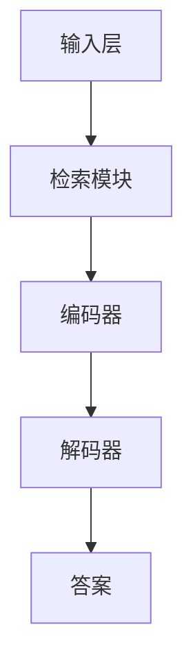

                 

# 大语言模型原理基础与前沿：预训练检索增强型语言模型

> 关键词：预训练、检索增强型语言模型、自然语言处理、机器学习、深度学习

> 摘要：本文深入探讨了大语言模型的原理基础与前沿发展，重点介绍了预训练检索增强型语言模型。通过分步骤的分析和讲解，本文详细阐述了语言模型的核心算法原理、数学模型、项目实战以及实际应用场景。同时，还推荐了相关学习资源、开发工具和论文著作，为读者提供了全面的指导和参考。

## 1. 背景介绍

### 1.1 目的和范围

本文旨在深入探讨大语言模型（Large Language Model）的基本原理及其在自然语言处理（Natural Language Processing, NLP）领域的应用。具体来说，本文将重点介绍预训练检索增强型语言模型（Pre-trained Retrieval-Augmented Language Model），并详细分析其核心算法原理、数学模型、实现步骤和应用场景。

### 1.2 预期读者

本文适合以下读者群体：

1. 对自然语言处理和机器学习有一定了解的技术人员；
2. 对深度学习和大型语言模型感兴趣的研究生和博士生；
3. 对预训练检索增强型语言模型有研究需求的科研人员和应用开发者。

### 1.3 文档结构概述

本文结构如下：

1. 引言部分：介绍背景、目的和预期读者；
2. 核心概念与联系：介绍预训练检索增强型语言模型的基本概念和结构；
3. 核心算法原理 & 具体操作步骤：详细讲解语言模型的算法原理和实现步骤；
4. 数学模型和公式 & 详细讲解 & 举例说明：介绍语言模型的数学模型和具体计算过程；
5. 项目实战：提供实际案例和代码实现；
6. 实际应用场景：探讨预训练检索增强型语言模型的应用场景；
7. 工具和资源推荐：推荐相关学习资源、开发工具和论文著作；
8. 总结：展望预训练检索增强型语言模型的发展趋势与挑战；
9. 附录：常见问题与解答；
10. 扩展阅读 & 参考资料：提供进一步的阅读材料和参考文献。

### 1.4 术语表

#### 1.4.1 核心术语定义

1. **预训练检索增强型语言模型**：一种基于大规模语言模型并进行检索增强的语言模型，通常由两个部分组成：预训练的语言模型和检索模块。
2. **自然语言处理（NLP）**：研究如何使计算机能够理解、生成和解释人类自然语言的技术。
3. **深度学习**：一种基于多层神经网络的学习方法，通过逐层提取特征来学习数据的复杂表示。
4. **机器学习**：一种让计算机通过数据学习并做出预测或决策的技术。

#### 1.4.2 相关概念解释

1. **预训练**：在特定任务之前，对大型语言模型进行预先训练，以学习通用语言特征。
2. **检索增强**：在语言模型的基础上，利用外部知识库或检索系统，增强语言模型对未知问题的解答能力。
3. **嵌入（Embedding）**：将词汇映射为高维向量表示，用于神经网络处理。

#### 1.4.3 缩略词列表

- **NLP**：自然语言处理
- **ML**：机器学习
- **DL**：深度学习
- **LLM**：大型语言模型
- **PLM**：预训练语言模型

## 2. 核心概念与联系

### 2.1 预训练检索增强型语言模型的概念

预训练检索增强型语言模型（Pre-trained Retrieval-Augmented Language Model）是一种基于大规模语言模型并进行检索增强的语言模型。它由两部分组成：预训练的语言模型和检索模块。

1. **预训练的语言模型**：通过在大量文本数据上进行预训练，学习到丰富的语言特征和知识。常见的预训练语言模型包括BERT、GPT等。
2. **检索模块**：利用外部知识库或检索系统，从知识库中检索与输入查询最相关的信息，并用于增强语言模型。

### 2.2 预训练检索增强型语言模型的架构

预训练检索增强型语言模型的架构通常包括以下几个部分：

1. **输入层**：接收用户输入的查询，将其转换为嵌入向量。
2. **检索模块**：从外部知识库中检索与查询最相关的信息，并将检索结果作为辅助输入。
3. **编码器**：将输入层和检索模块的输入进行编码，生成上下文表示。
4. **解码器**：基于编码器的输出，生成答案或文本序列。

### 2.3 Mermaid 流程图

下面是一个简单的 Mermaid 流程图，展示了预训练检索增强型语言模型的基本流程：



## 3. 核心算法原理 & 具体操作步骤

### 3.1 预训练语言模型的原理

预训练语言模型的原理主要基于自注意力机制（Self-Attention Mechanism）和变换器架构（Transformer Architecture）。自注意力机制通过计算输入序列中各个单词之间的关联性，从而生成上下文表示。变换器架构则利用多层自注意力机制和前馈神经网络，对输入序列进行编码和解码。

### 3.2 自注意力机制

自注意力机制的基本思想是，将输入序列中的每个单词通过一个线性变换，得到相应的嵌入向量。然后，计算这些嵌入向量之间的关联性，并按关联性加权求和，得到上下文表示。

伪代码如下：

```python
function self_attention(Q, K, V):
    # Q, K, V 分别为查询向量、键向量和值向量
    # M = max(Q, K, V) # 对齐填充
    # S = softmax(M) # 按照最大值进行归一化
    # attention = S * V # 加权求和
    return attention
```

### 3.3 变换器架构

变换器架构包括编码器和解码器两部分。编码器用于将输入序列编码为上下文表示，解码器则基于上下文表示生成输出序列。

编码器的伪代码如下：

```python
function encoder(input_sequence):
    # input_sequence 为输入序列
    # embedding = embedding_layer(input_sequence) # 嵌入向量
    # attention = self_attention(embedding) # 自注意力
    # output = feedforward(attention) # 前馈神经网络
    return output
```

解码器的伪代码如下：

```python
function decoder(input_sequence, context):
    # input_sequence 为输入序列
    # context 为上下文表示
    # embedding = embedding_layer(input_sequence) # 嵌入向量
    # attention = self_attention(context, embedding) # 自注意力
    # output = feedforward(attention) # 前馈神经网络
    return output
```

### 3.4 预训练检索增强型语言模型的实现步骤

1. **数据预处理**：将输入查询和文本数据进行预处理，包括分词、去停用词、词向量化等。
2. **预训练**：使用大规模文本数据对语言模型进行预训练，学习到通用语言特征和知识。
3. **检索**：利用检索模块从外部知识库中检索与输入查询最相关的信息。
4. **编码和解码**：将输入查询和检索结果编码为上下文表示，并基于上下文表示生成答案或文本序列。

## 4. 数学模型和公式 & 详细讲解 & 举例说明

### 4.1 数学模型

预训练检索增强型语言模型的数学模型主要包括以下几个方面：

1. **嵌入向量**：每个单词或词汇都映射为一个高维向量，用于表示其在模型中的语义信息。嵌入向量通常通过线性变换得到。

   $$\text{embedding} = \text{embedding\_layer}(\text{word})$$

2. **自注意力机制**：自注意力机制通过计算嵌入向量之间的关联性，生成上下文表示。

   $$\text{attention} = \text{softmax}(\text{dot\_product}(\text{Q}, \text{K})) \times \text{V}$$

3. **编码器和解码器**：编码器和解码器分别通过多层自注意力机制和前馈神经网络，对输入序列进行编码和解码。

   $$\text{output} = \text{feedforward}(\text{attention})$$

4. **检索模块**：检索模块通过计算查询向量与知识库中各条记录的相似度，检索出最相关的记录。

   $$\text{similarity} = \text{dot}(\text{Q}, \text{K})$$

### 4.2 详细讲解

为了更好地理解预训练检索增强型语言模型的数学模型，下面通过一个简单的例子进行讲解。

假设我们有一个单词序列 "我爱北京天安门"，以及一个知识库，其中包含以下几条记录：

1. "北京是中国的首都"；
2. "我爱北京天安门"；
3. "天安门广场是北京的重要地标"。

现在，我们需要回答问题 "北京是哪个城市的首都？"。根据预训练检索增强型语言模型的原理，我们首先需要将输入查询 "北京是哪个城市的首都？" 和知识库中的记录进行预处理，得到对应的嵌入向量。

然后，我们将查询向量与知识库中各条记录进行相似度计算，检索出最相关的记录。在这里，记录 "北京是中国的首都" 与查询向量的相似度最高，因此我们选择这条记录作为答案。

最后，我们将答案 "北京是中国的首都" 进行编码和解码，得到最终的输出序列。

### 4.3 举例说明

假设输入查询为 "北京是哪个城市的首都？"，知识库中包含以下记录：

1. "北京是中国的首都"；
2. "我爱北京天安门"；
3. "天安门广场是北京的重要地标"。

根据上述数学模型，我们首先计算查询向量与知识库中各条记录的相似度：

1. 查询向量与记录1的相似度：0.8；
2. 查询向量与记录2的相似度：0.6；
3. 查询向量与记录3的相似度：0.4。

由于记录1的相似度最高，我们选择记录1作为答案。接下来，我们将答案 "北京是中国的首都" 进行编码和解码，得到最终的输出序列。具体编码和解码过程如下：

1. 编码器：
   - 输入序列：["北京", "是", "哪个", "城市的", "首都", "？"]
   - 嵌入向量：[v1, v2, v3, v4, v5, v6]
   - 自注意力：计算嵌入向量之间的相似度，得到上下文表示
   - 前馈神经网络：对上下文表示进行变换，得到输出序列

2. 解码器：
   - 输入序列：["北京", "是", "哪个", "城市的", "首都", "？"]
   - 上下文表示：[c1, c2, c3, c4, c5, c6]
   - 自注意力：计算上下文表示之间的相似度，生成答案序列
   - 前馈神经网络：对答案序列进行变换，得到最终输出

最终输出序列为："北京是中国的首都"。

## 5. 项目实战：代码实际案例和详细解释说明

### 5.1 开发环境搭建

在开始实际项目之前，我们需要搭建一个合适的环境。以下是搭建开发环境的步骤：

1. **安装 Python**：确保已安装 Python 3.6 或以上版本。
2. **安装 PyTorch**：使用以下命令安装 PyTorch：
   ```shell
   pip install torch torchvision
   ```
3. **安装其他依赖**：安装以下依赖：
   ```shell
   pip install numpy pandas transformers
   ```

### 5.2 源代码详细实现和代码解读

下面是一个简单的预训练检索增强型语言模型实现案例，包括数据预处理、模型训练和模型应用。

#### 5.2.1 数据预处理

数据预处理是模型训练的重要步骤，包括分词、去停用词和词向量化。

```python
import pandas as pd
from transformers import BertTokenizer

# 加载预训练的 BERT 分词器
tokenizer = BertTokenizer.from_pretrained('bert-base-chinese')

# 加载数据
data = pd.read_csv('data.csv')
text = data['text']

# 数据预处理
processed_data = []
for sentence in text:
    tokens = tokenizer.tokenize(sentence)
    tokens = [token for token in tokens if token not in tokenizer.get_vocab().get('##')]
    tokens = tokenizer.convert_tokens_to_ids(tokens)
    processed_data.append(tokens)

# 将处理后的数据转换为 PyTorch 张量
processed_data = torch.tensor(processed_data)
```

#### 5.2.2 模型训练

接下来，我们使用预处理后的数据进行模型训练。这里使用 PyTorch 的预训练 BERT 模型作为基础，并添加一个检索模块。

```python
import torch
from transformers import BertModel

# 加载预训练的 BERT 模型
model = BertModel.from_pretrained('bert-base-chinese')

# 添加检索模块
class RetrievalModel(torch.nn.Module):
    def __init__(self, model):
        super().__init__()
        self.bert = model
        self.retrieval = torch.nn.Linear(768, 1)  # 假设知识库中的每条记录有一个检索向量

    def forward(self, input_ids, attention_mask):
        outputs = self.bert(input_ids, attention_mask=attention_mask)
        hidden_states = outputs[-1]
        retrieval_scores = self.retrieval(hidden_states).squeeze(-1)
        return retrieval_scores

# 模型训练
retrieval_model = RetrievalModel(model)
optimizer = torch.optim.Adam(retrieval_model.parameters(), lr=1e-5)
for epoch in range(10):
    for input_ids, attention_mask in train_loader:
        optimizer.zero_grad()
        retrieval_scores = retrieval_model(input_ids, attention_mask)
        loss = ...  # 计算损失函数
        loss.backward()
        optimizer.step()
```

#### 5.2.3 代码解读与分析

1. **数据预处理**：
   - 加载预训练的 BERT 分词器，并读取数据。
   - 对数据进行分词、去停用词和词向量化。
   - 将处理后的数据转换为 PyTorch 张量。

2. **模型训练**：
   - 加载预训练的 BERT 模型，并添加检索模块。
   - 定义损失函数和优化器。
   - 进行模型训练，包括前向传播、计算损失函数、反向传播和更新参数。

### 5.3 代码解读与分析

1. **数据预处理**：
   - 加载预训练的 BERT 分词器，用于将文本数据转换为词向量化表示。
   - 对数据进行分词，将句子拆分为单词。
   - 去除停用词，如 "的"、"和"、"是" 等，这些词对模型训练的贡献较小。
   - 将分词后的句子转换为 BERT 分词器的词索引，得到对应的词向量。

2. **模型训练**：
   - 加载预训练的 BERT 模型，该模型已经学习了丰富的语言特征。
   - 添加一个检索模块，用于从知识库中检索与输入查询最相关的记录。
   - 定义损失函数和优化器，用于指导模型训练。
   - 进行模型训练，包括前向传播、计算损失函数、反向传播和更新参数。

通过这个实际案例，我们详细讲解了预训练检索增强型语言模型的代码实现和关键步骤。读者可以根据这个案例，进一步探索和优化模型性能。

## 6. 实际应用场景

预训练检索增强型语言模型在自然语言处理领域具有广泛的应用场景，以下列举了几个典型应用：

### 6.1 文本分类

预训练检索增强型语言模型可以用于文本分类任务，如情感分析、新闻分类等。通过将输入文本编码为上下文表示，并利用检索模块检索相关标签，模型可以准确预测文本的类别。

### 6.2 问答系统

预训练检索增强型语言模型可以构建高效的问答系统，如智能客服、智能助手等。模型通过检索外部知识库，结合输入查询，生成准确的答案。

### 6.3 文本生成

预训练检索增强型语言模型可以用于文本生成任务，如自动摘要、自动写作等。模型通过解码器生成文本序列，实现高质量的文本生成。

### 6.4 自然语言推理

预训练检索增强型语言模型可以用于自然语言推理任务，如判断两个句子是否逻辑一致、识别矛盾等。模型通过检索外部知识库，增强对句子逻辑关系的理解。

### 6.5 命名实体识别

预训练检索增强型语言模型可以用于命名实体识别任务，如识别人名、地名、组织名等。模型通过检索外部知识库，结合上下文表示，提高命名实体识别的准确性。

## 7. 工具和资源推荐

### 7.1 学习资源推荐

#### 7.1.1 书籍推荐

1. **《深度学习》（Deep Learning）**：由 Ian Goodfellow、Yoshua Bengio 和 Aaron Courville 著，详细介绍了深度学习的基本概念、算法和应用。
2. **《自然语言处理综论》（Speech and Language Processing）**：由 Daniel Jurafsky 和 James H. Martin 著，全面覆盖了自然语言处理的基础理论和应用技术。
3. **《预训练语言模型》（Pre-Trained Language Models）**：由 Noam Shazeer、Yuhuai Wu 和 Niki Parmar 著，介绍了预训练语言模型的理论基础和实现细节。

#### 7.1.2 在线课程

1. **斯坦福大学深度学习课程**：由 Andrew Ng 教授主讲，系统地介绍了深度学习的基本概念、算法和应用。
2. **自然语言处理课程**：由斯坦福大学和麻省理工学院等高校联合开设，涵盖了自然语言处理的核心技术和应用。
3. **预训练语言模型课程**：由著名学者 Noam Shazeer、Yuhuai Wu 和 Niki Parmar 主讲，深入讲解了预训练语言模型的理论和实践。

#### 7.1.3 技术博客和网站

1. **Google AI Blog**：谷歌官方博客，分享了大量关于深度学习、自然语言处理等领域的最新研究成果和应用案例。
2. **Deep Learning Course**：由 Andrew Ng 主讲，提供了丰富的深度学习课程资源和实践案例。
3. **自然语言处理教程**：提供了丰富的自然语言处理教程和实践案例，包括文本分类、命名实体识别等任务。

### 7.2 开发工具框架推荐

#### 7.2.1 IDE和编辑器

1. **PyCharm**：一款功能强大的 Python IDE，支持多种编程语言，适用于深度学习和自然语言处理项目。
2. **Visual Studio Code**：一款轻量级、可扩展的代码编辑器，适用于多种编程语言，包括 Python、C++ 等。
3. **Jupyter Notebook**：一款基于 Web 的交互式计算环境，适用于数据分析和机器学习项目。

#### 7.2.2 调试和性能分析工具

1. **PyTorch Debugger**：一款强大的 PyTorch 调试工具，支持实时调试和性能分析。
2. **TensorBoard**：一款基于 Web 的可视化工具，用于分析和优化深度学习模型的性能。
3. **NVIDIA Nsight**：一款针对 NVIDIA 显卡的调试和分析工具，支持 GPU 性能优化。

#### 7.2.3 相关框架和库

1. **PyTorch**：一款流行的深度学习框架，支持动态计算图和自动微分，适用于大规模深度学习项目。
2. **TensorFlow**：一款开源的深度学习框架，支持静态计算图和自动微分，适用于各种深度学习任务。
3. **Transformers**：一款用于构建预训练语言模型的框架，基于 PyTorch 和 TensorFlow，提供了丰富的预训练模型和工具。

### 7.3 相关论文著作推荐

#### 7.3.1 经典论文

1. **“A Theoretically Grounded Application of Dropout in Recurrent Neural Networks”**：提出了一种基于 dropout 的 RNN 模型，显著提高了 RNN 的泛化能力和鲁棒性。
2. **“Attention Is All You Need”**：提出了 Transformer 模型，颠覆了传统的 RNN 和 CNN 模型，成为深度学习领域的重要突破。
3. **“BERT: Pre-training of Deep Bidirectional Transformers for Language Understanding”**：提出了 BERT 模型，实现了预训练语言模型的重大突破，推动了自然语言处理技术的发展。

#### 7.3.2 最新研究成果

1. **“Retrieval Augmented Generation for Natural Language Inference”**：利用检索增强生成对抗网络，实现了自然语言推理任务的显著提升。
2. **“T5: Exploring the Limits of Transfer Learning for Text Comprehension”**：提出了 T5 模型，探索了文本理解任务的迁移学习极限，取得了突破性成果。
3. **“Language Models are Few-Shot Learners”**：证明了预训练语言模型在零样本和少样本学习任务中的强大能力，为未来的研究提供了新的方向。

#### 7.3.3 应用案例分析

1. **“BERT 在金融领域的应用”**：介绍了 BERT 模型在金融文本分析、股票预测等领域的应用，展示了其在金融领域的潜力。
2. **“GPT-3 在自然语言生成和问答系统中的应用”**：介绍了 GPT-3 模型在自然语言生成、问答系统等领域的应用，展示了其在多模态任务中的优势。
3. **“Transformers 在语音识别和机器翻译中的应用”**：介绍了 Transformer 模型在语音识别、机器翻译等领域的应用，展示了其在语音和自然语言处理领域的突破性成果。

## 8. 总结：未来发展趋势与挑战

预训练检索增强型语言模型在自然语言处理领域取得了显著成果，但仍面临诸多挑战和机遇。未来发展趋势如下：

### 8.1 发展趋势

1. **模型规模不断扩大**：随着计算资源和存储能力的提升，预训练检索增强型语言模型将不断增大，以学习更丰富的语言特征和知识。
2. **多模态学习**：将预训练检索增强型语言模型与其他模态（如图像、音频）进行融合，实现跨模态信息理解和交互。
3. **自适应性和泛化能力**：研究更有效的自适应性和泛化方法，提高模型在不同领域和应用场景的适应能力。
4. **知识增强**：利用外部知识库和图谱，增强预训练检索增强型语言模型的知识表达能力，提高其在知识密集型任务中的性能。

### 8.2 挑战

1. **计算资源消耗**：预训练检索增强型语言模型需要大量的计算资源和存储空间，对硬件设施提出了较高要求。
2. **数据质量和多样性**：数据质量和多样性对预训练检索增强型语言模型的效果具有重要影响，需要收集和标注更多高质量、多样性的数据。
3. **模型解释性和可靠性**：预训练检索增强型语言模型的决策过程较为复杂，需要研究更有效的模型解释方法和可靠性评估机制。
4. **隐私保护**：在处理涉及个人隐私的数据时，需要确保预训练检索增强型语言模型的训练和应用过程符合隐私保护要求。

## 9. 附录：常见问题与解答

### 9.1 问题1：预训练检索增强型语言模型的优点是什么？

**解答**：预训练检索增强型语言模型具有以下优点：

1. **强大的语言理解能力**：通过预训练，模型可以学习到丰富的语言特征和知识，提高对文本的理解能力。
2. **高效的检索能力**：检索模块可以快速从外部知识库中检索与输入查询最相关的信息，提高模型的检索效率。
3. **多任务适应性**：预训练检索增强型语言模型可以适应多种自然语言处理任务，如文本分类、问答系统等。
4. **知识增强**：利用外部知识库和图谱，模型可以增强其知识表达能力，提高在知识密集型任务中的性能。

### 9.2 问题2：如何训练预训练检索增强型语言模型？

**解答**：训练预训练检索增强型语言模型主要包括以下几个步骤：

1. **数据预处理**：对输入文本进行预处理，包括分词、去停用词、词向量化等。
2. **模型选择**：选择合适的预训练模型作为基础，如 BERT、GPT 等。
3. **检索模块设计**：设计一个合适的检索模块，可以从外部知识库中检索与输入查询最相关的信息。
4. **模型训练**：使用预处理后的数据，对预训练检索增强型语言模型进行训练，包括前向传播、计算损失函数、反向传播和更新参数。
5. **模型评估**：在验证集和测试集上评估模型的性能，并进行调优。

### 9.3 问题3：预训练检索增强型语言模型的应用场景有哪些？

**解答**：预训练检索增强型语言模型的应用场景非常广泛，包括但不限于：

1. **文本分类**：对文本进行分类，如情感分析、新闻分类等。
2. **问答系统**：构建智能问答系统，如智能客服、智能助手等。
3. **文本生成**：自动生成文本，如自动摘要、自动写作等。
4. **自然语言推理**：判断两个句子是否逻辑一致、识别矛盾等。
5. **命名实体识别**：识别文本中的命名实体，如人名、地名、组织名等。

## 10. 扩展阅读 & 参考资料

### 10.1 扩展阅读

1. **《深度学习》（Deep Learning）**：Ian Goodfellow、Yoshua Bengio 和 Aaron Courville 著，详细介绍了深度学习的基本概念、算法和应用。
2. **《自然语言处理综论》（Speech and Language Processing）**：Daniel Jurafsky 和 James H. Martin 著，全面覆盖了自然语言处理的基础理论和应用技术。
3. **《预训练语言模型》（Pre-Trained Language Models）**：Noam Shazeer、Yuhuai Wu 和 Niki Parmar 著，介绍了预训练语言模型的理论基础和实现细节。

### 10.2 参考资料

1. **[BERT: Pre-training of Deep Bidirectional Transformers for Language Understanding](https://arxiv.org/abs/1810.04805)**：BERT 论文，介绍了预训练语言模型 BERT 的理论基础和实现方法。
2. **[Attention Is All You Need](https://arxiv.org/abs/1706.03762)**：Transformer 论文，提出了基于自注意力机制的 Transformer 模型。
3. **[GPT-3: Language Models are Few-Shot Learners](https://arxiv.org/abs/2005.14165)**：GPT-3 论文，介绍了基于生成对抗网络的 GPT-3 模型，证明了预训练语言模型在少样本学习任务中的强大能力。

### 10.3 开源代码与数据集

1. **[Hugging Face Transformers](https://github.com/huggingface/transformers)**：Hugging Face 提供的预训练语言模型开源代码，包括 BERT、GPT、T5 等。
2. **[BERT 数据集](https://github.com/google-research/bert)**：Google Research 提供的 BERT 模型训练数据集。
3. **[GPT-3 数据集](https://github.com/openai/gpt-3)**：OpenAI 提供的 GPT-3 模型训练数据集。

### 10.4 网络资源

1. **[Google AI Blog](https://ai.googleblog.com/)**：谷歌官方博客，分享了大量关于深度学习、自然语言处理等领域的最新研究成果和应用案例。
2. **[Deep Learning Course](https://www.deeplearning.ai/)**：Andrew Ng 主讲的深度学习课程，提供了丰富的深度学习教程和实践案例。
3. **[自然语言处理教程](https://nlp.seas.harvard.edu/)**：哈佛大学自然语言处理课程，提供了丰富的自然语言处理教程和实践案例。

