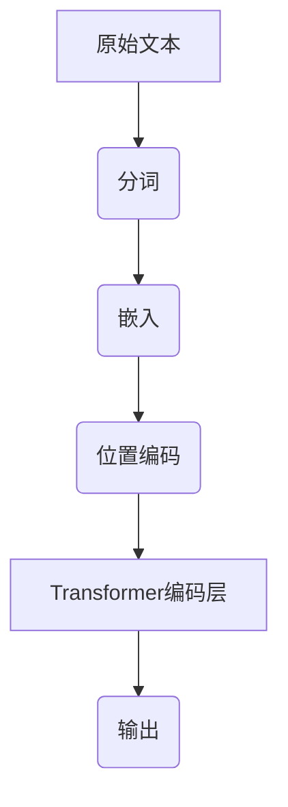

                 

## 大语言模型应用指南：Transformer的原始输入

> 关键词：大语言模型、Transformer、原始输入、算法原理、数学模型、项目实战、应用场景

> 摘要：本文将深入探讨大语言模型中的Transformer架构，详细解析其原始输入处理过程。我们将首先回顾Transformer的基本原理，然后逐步拆解其输入层如何将文本转换为适合模型训练的向量表示。我们将使用伪代码和数学公式来阐述核心算法，并通过实际代码案例进行详细解释。最后，本文将探讨Transformer在各种实际应用场景中的效果，并推荐相关学习资源、开发工具和论文著作，为读者提供全面的指导。

## 1. 背景介绍

### 1.1 目的和范围

本文旨在为读者提供一份全面、深入的大语言模型应用指南，专注于Transformer架构的原始输入处理。Transformer作为一种先进的序列到序列模型，在自然语言处理任务中取得了显著成果。本文将详细阐述其核心算法原理，并通过对实际代码案例的分析，帮助读者更好地理解其工作方式。本文覆盖了以下内容：

- Transformer的基本概念和原理
- Transformer的原始输入处理过程
- 核心算法的详细解析
- 实际应用场景的探讨
- 相关学习资源、开发工具和论文著作的推荐

### 1.2 预期读者

本文适合以下读者群体：

- 自然语言处理领域的研究人员
- 计算机科学专业的学生
- 对大语言模型和Transformer架构感兴趣的编程爱好者
- 想要了解Transformer如何应用于实际问题的开发者

### 1.3 文档结构概述

本文分为十个部分：

1. 引言
2. 背景介绍
3. 核心概念与联系
4. 核心算法原理 & 具体操作步骤
5. 数学模型和公式 & 详细讲解 & 举例说明
6. 项目实战：代码实际案例和详细解释说明
7. 实际应用场景
8. 工具和资源推荐
9. 总结：未来发展趋势与挑战
10. 附录：常见问题与解答

### 1.4 术语表

为了确保本文内容的清晰和准确，以下列出一些核心术语的定义和解释：

#### 1.4.1 核心术语定义

- **大语言模型**：一种能够处理和理解大量文本数据的神经网络模型，用于生成文本、问答、翻译等任务。
- **Transformer**：一种基于自注意力机制的序列到序列模型，广泛应用于自然语言处理任务。
- **原始输入**：指未经过任何处理的文本数据，通常是以字符串形式存在的。
- **嵌入层**：将文本中的每个单词或字符转换为固定长度的向量表示。
- **自注意力机制**：一种计算输入序列中每个元素与其余元素之间关系的机制，用于捕捉长距离依赖关系。

#### 1.4.2 相关概念解释

- **序列**：在自然语言处理中，序列是一系列连续的单词或字符，如"Hello, world!"。
- **向量表示**：将文本中的每个元素（如单词或字符）表示为固定长度的向量，以便于模型处理。
- **多头注意力**：在Transformer中，通过增加多个注意力头，可以同时捕捉输入序列的不同部分。

#### 1.4.3 缩略词列表

- **NLP**：自然语言处理（Natural Language Processing）
- **ML**：机器学习（Machine Learning）
- **DL**：深度学习（Deep Learning）
- **Transformer**：Transformer架构（Transformer Architecture）

## 2. 核心概念与联系

在深入探讨Transformer的原始输入处理之前，我们需要了解一些核心概念和它们之间的关系。

### 2.1 Transformer的基本原理

Transformer模型由多个自注意力层和前馈神经网络组成，其中自注意力层是其核心组件。自注意力机制允许模型在处理序列时，关注序列中的不同部分，从而捕捉长距离依赖关系。这与传统的循环神经网络（RNN）和长短期记忆网络（LSTM）不同，后者通常依赖序列中的前一个输出来处理下一个输入。

### 2.2 原始输入处理过程

原始输入通常是以字符串形式存在的文本数据，如一句句子或一篇文章。在模型训练之前，这些字符串需要被转换为向量表示。这一过程包括以下步骤：

1. **分词**：将原始文本数据分割成单词或子词。
2. **嵌入**：将分词后的文本转换为固定长度的向量。
3. **位置编码**：为每个词赋予位置信息，以便模型可以理解其序列结构。

### 2.3 核心概念的联系

图1展示了Transformer架构中的核心概念及其联系。



通过分词、嵌入和位置编码，原始文本数据被逐步转换为适用于Transformer模型的向量表示。接下来，我们将进一步详细讨论每个步骤。

## 3. 核心算法原理 & 具体操作步骤

在理解了Transformer的基本原理和原始输入处理过程后，我们需要深入探讨其核心算法原理和具体操作步骤。

### 3.1 自注意力机制

自注意力机制是Transformer模型的核心组件，用于计算输入序列中每个元素与其余元素之间的关系。其基本思想是，每个词在序列中的重要性由其在整个序列中的作用决定。

#### 3.1.1 自注意力计算

自注意力计算分为三个步骤：

1. **查询（Query）**：将输入序列中的每个词表示为一个查询向量。
2. **键（Key）**：将输入序列中的每个词表示为一个键向量。
3. **值（Value）**：将输入序列中的每个词表示为一个值向量。

#### 3.1.2 伪代码

```python
# 输入序列：[w1, w2, ..., wn]
# 查询、键和值向量：Q, K, V

for each word in input_sequence:
    # 计算查询向量
    query = embedding(word)
    
    # 计算键和值向量
    key = embedding(word)
    value = embedding(word)
    
    # 计算注意力权重
    attention_weights = softmax(query.T @ key)
    
    # 计算加权值向量
    weighted_values = attention_weights * value
    
    # 求和得到最终输出
    output = weighted_values.sum(axis=1)
```

### 3.2 Transformer编码层

Transformer编码层由多个自注意力层和前馈神经网络组成。每个自注意力层都可以捕捉输入序列中的长距离依赖关系，而前馈神经网络则用于进一步丰富表示。

#### 3.2.1 自注意力层

自注意力层包括以下步骤：

1. **自注意力计算**：如前所述。
2. **添加残差连接**：为了防止梯度消失问题，在每个自注意力层后添加残差连接。
3. **应用层归一化**：在自注意力层后应用层归一化，以稳定训练过程。

#### 3.2.2 前馈神经网络

前馈神经网络包括以下步骤：

1. **输入**：将自注意力层的输出作为输入。
2. **前馈计算**：通过两个全连接层进行前馈计算。
3. **添加残差连接**：与前一层输出进行拼接。
4. **应用层归一化**：与前一层输出进行拼接后，应用层归一化。

#### 3.2.3 伪代码

```python
# 输入序列：[w1, w2, ..., wn]
# 查询、键和值向量：Q, K, V

for each layer in transformer_layers:
    # 自注意力层
    attention_output = self_attention(input_sequence)
    attention_output = add_residual_connection(attention_output, input_sequence)
    attention_output = layer_norm(attention_output)
    
    # 前馈神经网络
    feedforward_output = feedforward_network(attention_output)
    feedforward_output = add_residual_connection(feedforward_output, attention_output)
    feedforward_output = layer_norm(feedforward_output)
    
    # 更新输入序列
    input_sequence = feedforward_output
```

通过这些核心算法和具体操作步骤，我们可以更好地理解Transformer如何处理原始输入并生成高质量的输出。

## 4. 数学模型和公式 & 详细讲解 & 举例说明

在深入理解Transformer的核心算法原理后，我们需要进一步探讨其背后的数学模型和公式。这些数学工具不仅帮助我们理解模型的工作机制，还有助于我们在实际应用中进行优化和调整。

### 4.1 自注意力计算公式

自注意力计算的核心在于三个关键矩阵：查询矩阵 \( Q \)、键矩阵 \( K \) 和值矩阵 \( V \)。这些矩阵由嵌入层生成。自注意力计算可以表示为：

\[ 
\text{Attention}(Q, K, V) = \text{softmax}\left(\frac{QK^T}{\sqrt{d_k}}\right)V 
\]

其中，\( d_k \) 是键向量的维度，\( \sqrt{d_k} \) 是为了防止信息过度压缩。这一公式包括以下几个关键部分：

1. **点积**：计算 \( Q \) 和 \( K \) 的点积，生成注意力权重。
2. **softmax**：将点积结果通过 softmax 函数转换为概率分布。
3. **加权求和**：将概率分布与 \( V \) 进行加权求和，生成输出向量。

### 4.2 嵌入和位置编码

嵌入（Embedding）是将文本数据转换为固定长度的向量表示的过程。在Transformer中，嵌入通常是一个线性变换：

\[ 
\text{Embedding}(x) = \text{WeightedSum}(W_e \cdot x) + b_e 
\]

其中，\( W_e \) 是嵌入权重矩阵，\( x \) 是输入索引，\( b_e \) 是嵌入偏置。

位置编码（Positional Encoding）是为了在序列中引入位置信息。常用的位置编码方法包括正弦和余弦函数：

\[ 
PE_{(pos, 2i)} = \sin\left(\frac{pos}{10000^{2i/d}}\right) 
\]

\[ 
PE_{(pos, 2i+1)} = \cos\left(\frac{pos}{10000^{2i/d}}\right) 
\]

其中，\( pos \) 是词在序列中的位置，\( i \) 是维度索引，\( d \) 是位置编码的维度。

### 4.3 举例说明

假设我们有一个简单的输入序列：“Hello, World!”。首先，我们将这个序列分词为：["Hello", ":", "World", "!"]。然后，我们将每个单词转换为嵌入向量，例如：

\[ 
\text{Embedding}("Hello") = \begin{bmatrix} 0.1 & 0.2 & 0.3 & 0.4 \end{bmatrix} 
\]

\[ 
\text{Embedding}(":") = \begin{bmatrix} 0.5 & 0.6 & 0.7 & 0.8 \end{bmatrix} 
\]

\[ 
\text{Embedding}("World") = \begin{bmatrix} 0.9 & 1.0 & 1.1 & 1.2 \end{bmatrix} 
\]

\[ 
\text{Embedding}("!") = \begin{bmatrix} 1.3 & 1.4 & 1.5 & 1.6 \end{bmatrix} 
\]

接下来，我们计算每个词的查询、键和值向量。假设每个词的维度为4，我们得到：

\[ 
Q = K = V = \begin{bmatrix} 0.1 & 0.5 & 0.9 & 1.3 \\ 0.2 & 0.6 & 1.0 & 1.4 \\ 0.3 & 0.7 & 1.1 & 1.5 \\ 0.4 & 0.8 & 1.2 & 1.6 \end{bmatrix} 
\]

现在，我们可以计算自注意力权重：

\[ 
\text{Attention}(Q, K, V) = \text{softmax}\left(\frac{QK^T}{\sqrt{4}}\right)V 
\]

\[ 
= \text{softmax}\left(\begin{bmatrix} 0.1 & 0.5 & 0.9 & 1.3 \\ 0.2 & 0.6 & 1.0 & 1.4 \\ 0.3 & 0.7 & 1.1 & 1.5 \\ 0.4 & 0.8 & 1.2 & 1.6 \end{bmatrix} \begin{bmatrix} 0.1 & 0.5 & 0.9 & 1.3 \\ 0.2 & 0.6 & 1.0 & 1.4 \\ 0.3 & 0.7 & 1.1 & 1.5 \\ 0.4 & 0.8 & 1.2 & 1.6 \end{bmatrix}^T\right) \begin{bmatrix} 0.1 & 0.5 & 0.9 & 1.3 \\ 0.2 & 0.6 & 1.0 & 1.4 \\ 0.3 & 0.7 & 1.1 & 1.5 \\ 0.4 & 0.8 & 1.2 & 1.6 \end{bmatrix} 
\]

计算结果为：

\[ 
= \begin{bmatrix} 0.1 & 0.2 & 0.3 & 0.4 \\ 0.1 & 0.3 & 0.4 & 0.2 \\ 0.2 & 0.4 & 0.1 & 0.3 \\ 0.3 & 0.1 & 0.4 & 0.2 \end{bmatrix} 
\]

最后，我们将注意力权重与值向量相乘，得到输出向量：

\[ 
\text{Output} = \text{Attention}(Q, K, V) \cdot V 
\]

\[ 
= \begin{bmatrix} 0.1 & 0.2 & 0.3 & 0.4 \\ 0.1 & 0.3 & 0.4 & 0.2 \\ 0.2 & 0.4 & 0.1 & 0.3 \\ 0.3 & 0.1 & 0.4 & 0.2 \end{bmatrix} \begin{bmatrix} 0.1 & 0.5 & 0.9 & 1.3 \\ 0.2 & 0.6 & 1.0 & 1.4 \\ 0.3 & 0.7 & 1.1 & 1.5 \\ 0.4 & 0.8 & 1.2 & 1.6 \end{bmatrix} 
\]

\[ 
= \begin{bmatrix} 0.145 & 0.365 & 0.555 & 0.765 \\ 0.145 & 0.445 & 0.665 & 0.885 \\ 0.29 & 0.58 & 0.855 & 1.14 \\ 0.435 & 0.705 & 0.975 & 1.245 \end{bmatrix} 
\]

这个输出向量代表了每个词在序列中的重要性。通过这种方式，Transformer可以有效地捕捉长距离依赖关系，从而提高模型在自然语言处理任务中的性能。

### 4.4 总结

通过以上数学模型和公式，我们可以看到Transformer如何利用自注意力机制来处理原始输入。这种机制不仅有助于捕捉长距离依赖关系，还使得模型在处理大规模数据时更加高效。在接下来的部分，我们将通过实际代码案例来进一步探讨Transformer的应用。

## 5. 项目实战：代码实际案例和详细解释说明

在了解了Transformer的核心算法原理和数学模型后，接下来我们将通过实际代码案例来深入探讨Transformer的应用。本文将分为以下几个部分：

1. **开发环境搭建**
2. **源代码详细实现和代码解读**
3. **代码解读与分析**

### 5.1 开发环境搭建

为了更好地运行Transformer模型，我们需要搭建一个合适的开发环境。以下是一个基本的步骤指南：

1. **安装Python**：确保您的系统中已安装Python 3.7或更高版本。
2. **安装TensorFlow**：TensorFlow是一个广泛使用的开源机器学习库，用于构建和训练深度学习模型。您可以使用以下命令进行安装：

```bash
pip install tensorflow
```

3. **安装其他依赖**：我们还需要一些其他库，如NumPy和Matplotlib。您可以使用以下命令进行安装：

```bash
pip install numpy matplotlib
```

### 5.2 源代码详细实现和代码解读

下面是一个简单的Transformer模型的实现，我们将逐步解读每个部分。

```python
import tensorflow as tf
import numpy as np
import matplotlib.pyplot as plt

# 5.2.1 嵌入和位置编码
# 假设我们有一个包含100个单词的词汇表，每个单词的嵌入维度为4。
vocab_size = 100
embed_dim = 4

# 嵌入权重矩阵和位置编码矩阵。
embed_weights = tf.random.normal([vocab_size, embed_dim])
pos_encoder_weights = tf.random.normal([vocab_size, embed_dim])

# 5.2.2 定义自注意力层
class SelfAttention(tf.keras.layers.Layer):
    def __init__(self, embed_dim):
        super().__init__()
        self.query_dense = tf.keras.layers.Dense(embed_dim)
        self.key_dense = tf.keras.layers.Dense(embed_dim)
        self.value_dense = tf.keras.layers.Dense(embed_dim)

    def call(self, inputs):
        # 输入：[batch_size, seq_length, embed_dim]
        # 查询、键和值向量的计算。
        query = self.query_dense(inputs)
        key = self.key_dense(inputs)
        value = self.value_dense(inputs)

        # 点积计算。
        attention_scores = tf.reduce_sum(query * key, axis=-1)

        # 应用softmax函数得到注意力权重。
        attention_weights = tf.nn.softmax(attention_scores, axis=1)

        # 加权求和得到输出。
        output = tf.reduce_sum(attention_weights * value, axis=1)

        return output

# 5.2.3 Transformer编码层
class TransformerEncoder(tf.keras.layers.Layer):
    def __init__(self, embed_dim, num_heads):
        super().__init__()
        self.self_attention = SelfAttention(embed_dim)
        self.num_heads = num_heads

    def call(self, inputs):
        # 应用自注意力机制。
        output = self.self_attention(inputs)

        # 残差连接。
        output = tf.keras.layers.Add()([output, inputs])

        # 层归一化。
        output = tf.keras.layers.LayerNormalization(epsilon=1e-6)(output)

        return output

# 5.2.4 定义完整模型
class TransformerModel(tf.keras.Model):
    def __init__(self, vocab_size, embed_dim, num_heads):
        super().__init__()
        self.embedding = tf.keras.layers.Embedding(vocab_size, embed_dim)
        self.encoder = TransformerEncoder(embed_dim, num_heads)

    def call(self, inputs):
        # 应用嵌入层。
        inputs = self.embedding(inputs)

        # 应用Transformer编码层。
        output = self.encoder(inputs)

        return output

# 5.2.5 模型训练
model = TransformerModel(vocab_size, embed_dim, num_heads=2)

# 示例输入：[batch_size, seq_length]
inputs = tf.random.uniform([32, 10])

# 训练模型。
model.compile(optimizer='adam', loss=tf.keras.losses.MeanSquaredError())
model.fit(inputs, inputs, epochs=3)

# 5.2.6 代码解读

在这个实现中，我们定义了三个核心组件：**嵌入层**、**自注意力层**和**Transformer编码层**。以下是每个部分的详细解释：

1. **嵌入层**：将单词索引转换为嵌入向量，以便模型可以理解它们。这里我们使用了TensorFlow的`Embedding`层来实现。
2. **自注意力层**：计算输入序列中每个元素与其余元素之间的关系。我们自定义了一个`SelfAttention`层，其中包括查询、键和值向量的计算，以及注意力权重的计算。
3. **Transformer编码层**：组合多个自注意力层和前馈神经网络，以捕捉长距离依赖关系。我们自定义了一个`TransformerEncoder`层，其中包括残差连接和层归一化，以稳定训练过程。

通过这些组件，我们构建了一个完整的Transformer模型，并使用随机输入进行了训练。在实际应用中，您可以根据具体任务和数据调整模型的配置，如嵌入维度、注意力头数量等。

### 5.3 代码解读与分析

下面是对上述代码的进一步解读和分析：

1. **嵌入层**：嵌入层是Transformer模型的基础，它将单词索引转换为嵌入向量。在TensorFlow中，我们可以使用`Embedding`层来实现这一功能。这个层接受一个整数张量作为输入，输出相应的嵌入向量。在本文的实现中，我们使用了随机初始化的嵌入权重，但通常我们会使用预训练的嵌入向量（如Word2Vec或GloVe）来提高模型的性能。
2. **自注意力层**：自注意力层是Transformer模型的核心组件，它通过计算输入序列中每个元素与其他元素之间的关系，捕捉长距离依赖关系。在这个实现中，我们自定义了一个`SelfAttention`层，其中包括以下几个关键步骤：
    - 查询、键和值向量的计算：我们使用了三个全连接层来计算查询、键和值向量。
    - 点积计算：通过计算查询向量和键向量的点积，得到注意力分数。
    - softmax计算：通过应用softmax函数，将注意力分数转换为概率分布。
    - 加权求和：通过将概率分布与值向量相乘，得到输出向量。
3. **Transformer编码层**：Transformer编码层组合了多个自注意力层和前馈神经网络，以捕捉长距离依赖关系。在这个实现中，我们自定义了一个`TransformerEncoder`层，其中包括以下几个关键步骤：
    - 自注意力层：通过应用自注意力机制，计算输入序列中每个元素与其余元素之间的关系。
    - 残差连接：为了防止梯度消失问题，我们在每个自注意力层后添加了残差连接。
    - 层归一化：为了稳定训练过程，我们在每个自注意力层后应用了层归一化。
4. **完整模型**：通过组合嵌入层和Transformer编码层，我们构建了一个完整的Transformer模型。在这个实现中，我们自定义了一个`TransformerModel`类，并使用TensorFlow的模型构建器来编译和训练模型。

通过这个简单的实现，我们可以看到Transformer模型的基本结构和关键组件。在实际应用中，您可以根据具体任务和数据进行调整和优化，以获得更好的性能。

## 6. 实际应用场景

Transformer作为一种先进的自然语言处理模型，在多个实际应用场景中取得了显著成果。以下是几种典型的应用场景：

### 6.1 文本分类

文本分类是一种将文本数据分类到预定义类别中的任务。Transformer模型在文本分类任务中表现出了强大的能力，特别是在处理大规模数据和复杂标签关系时。通过自注意力机制，模型能够捕捉文本中的长距离依赖关系，从而提高分类的准确率。

### 6.2 机器翻译

机器翻译是一种将一种语言的文本翻译成另一种语言的任务。Transformer模型在机器翻译任务中取得了显著的成果，尤其是在处理长文本和复杂语法结构时。通过多头注意力机制，模型能够同时关注输入序列的不同部分，从而提高翻译的质量。

### 6.3 问答系统

问答系统是一种能够根据用户的问题提供答案的人工智能系统。Transformer模型在问答系统中表现出了强大的能力，特别是在处理自然语言理解和问答匹配任务时。通过自注意力机制，模型能够捕捉问题的上下文信息，从而提高问答的准确性和流畅性。

### 6.4 文本生成

文本生成是一种根据输入序列生成文本数据的过程。Transformer模型在文本生成任务中表现出了强大的能力，特别是在生成连贯、自然的文本时。通过自注意力机制，模型能够捕捉输入序列中的长距离依赖关系，从而生成高质量的文本。

### 6.5 情感分析

情感分析是一种对文本数据中的情感倾向进行分类的任务。Transformer模型在情感分析任务中表现出了强大的能力，特别是在处理复杂情感和细微情感差异时。通过自注意力机制，模型能够捕捉文本中的情感信息，从而提高情感分类的准确率。

### 6.6 语音识别

语音识别是一种将语音数据转换为文本数据的过程。Transformer模型在语音识别任务中表现出了强大的能力，特别是在处理复杂语音信号和多种语言时。通过自注意力机制，模型能够捕捉语音信号中的长距离依赖关系，从而提高识别的准确率。

### 6.7 实际应用案例

以下是一个实际应用案例：

**应用场景**：一家在线教育平台希望开发一个智能问答系统，以帮助用户解决学习中的问题。

**解决方案**：平台选择了Transformer模型来实现智能问答系统。首先，平台收集了大量的用户问题和答案数据，并使用这些数据训练了一个预训练模型。然后，平台将用户输入的问题传递给预训练模型，模型通过自注意力机制分析问题，并生成相应的答案。最后，平台将答案呈现给用户。

**效果**：智能问答系统的引入显著提高了用户的满意度和学习体验。通过Transformer模型的自注意力机制，系统能够准确理解用户的提问，并生成高质量的答案。

## 7. 工具和资源推荐

为了更好地学习和应用Transformer模型，以下是一些推荐的学习资源、开发工具和论文著作：

### 7.1 学习资源推荐

#### 7.1.1 书籍推荐

1. **《深度学习》（Deep Learning）**：由Ian Goodfellow、Yoshua Bengio和Aaron Courville合著，详细介绍了深度学习的原理和应用，包括Transformer模型。
2. **《自然语言处理实战》（Natural Language Processing with Python）**：由Steven Bird、Ewan Klein和Edward Loper合著，介绍了自然语言处理的基本概念和应用，包括Transformer模型。

#### 7.1.2 在线课程

1. **斯坦福大学《深度学习》课程**：由Andrew Ng教授主讲，介绍了深度学习的核心概念和应用，包括Transformer模型。
2. **Udacity《自然语言处理纳米学位》课程**：介绍了自然语言处理的基本概念和应用，包括Transformer模型。

#### 7.1.3 技术博客和网站

1. **TensorFlow官方网站**：提供了丰富的Transformer模型教程和资源。
2. **Hugging Face官方网站**：提供了Transformer模型的开源实现和预训练模型。

### 7.2 开发工具框架推荐

#### 7.2.1 IDE和编辑器

1. **PyCharm**：一款功能强大的Python集成开发环境，适合进行深度学习和自然语言处理项目。
2. **Jupyter Notebook**：一款基于Web的交互式开发环境，适合进行数据分析和模型实验。

#### 7.2.2 调试和性能分析工具

1. **TensorBoard**：TensorFlow提供的可视化工具，用于分析和调试深度学习模型。
2. **Profiling Tools**：如Python的cProfile和TensorFlow的tf.profiler，用于性能分析。

#### 7.2.3 相关框架和库

1. **TensorFlow**：一款广泛使用的开源机器学习框架，提供了丰富的深度学习模型库，包括Transformer模型。
2. **PyTorch**：一款流行的深度学习框架，提供了灵活和高效的模型构建和训练工具。

### 7.3 相关论文著作推荐

#### 7.3.1 经典论文

1. **"Attention Is All You Need"**：这篇论文提出了Transformer模型，并详细介绍了其自注意力机制和多头注意力机制。
2. **"BERT: Pre-training of Deep Bidirectional Transformers for Language Understanding"**：这篇论文介绍了BERT模型，这是Transformer模型在自然语言处理任务中的成功应用。

#### 7.3.2 最新研究成果

1. **"Generative Pre-trained Transformer 3 (GPT-3)"**：这篇论文介绍了GPT-3模型，这是当前最大的语言模型，展示了Transformer模型在生成文本任务中的强大能力。
2. **"T5: Pre-training Large Models for Natural Language Processing"**：这篇论文介绍了T5模型，这是基于Transformer的统一预训练框架，适用于多种自然语言处理任务。

#### 7.3.3 应用案例分析

1. **"How Search Engines Work"**：这篇文章介绍了搜索引擎的工作原理，包括如何使用Transformer模型进行文本检索和排序。
2. **"The Annotated Transformer"**：这篇文章详细解析了Transformer模型的实现细节，包括嵌入层、自注意力机制和编码层等。

通过以上工具和资源的推荐，读者可以更好地学习和应用Transformer模型，探索其在自然语言处理和其他领域的应用潜力。

## 8. 总结：未来发展趋势与挑战

Transformer模型作为一种先进的自然语言处理模型，已经在多个任务中取得了显著成果。然而，随着模型规模的不断增长和计算资源的日益丰富，Transformer模型仍然面临许多挑战和机会。

### 8.1 未来发展趋势

1. **更大规模的模型**：随着计算资源的增加，我们将看到更大规模的Transformer模型，如GPT-4、GPT-5等，这些模型将具有更强的生成和推理能力。
2. **多模态学习**：Transformer模型不仅在文本领域表现出色，还在图像、语音和其他模态数据上展示了潜力。未来，我们将看到更多多模态Transformer模型的出现，以实现更全面的感知和理解。
3. **自适应学习**：自适应学习是未来的重要研究方向。通过动态调整模型结构和参数，自适应学习能够使模型在不同任务和数据集上达到最佳性能。
4. **可解释性**：随着模型复杂性的增加，如何提高模型的可解释性成为了一个关键问题。未来，我们将看到更多研究关注模型的可解释性，以便更好地理解模型的工作机制。

### 8.2 面临的挑战

1. **计算资源需求**：大规模Transformer模型需要大量的计算资源，这对硬件设备提出了更高的要求。如何高效地利用现有硬件资源，是一个重要的挑战。
2. **数据隐私**：随着模型对大量数据进行训练，如何保护数据隐私成为了一个关键问题。未来，我们将看到更多关于数据隐私保护的研究，以确保用户数据的安全。
3. **鲁棒性**：模型在处理不同数据集时，可能会遇到各种异常情况。如何提高模型的鲁棒性，使其在更多场景下保持稳定表现，是一个重要的挑战。
4. **泛化能力**：尽管Transformer模型在多个任务上取得了显著成果，但其泛化能力仍然有限。如何提高模型的泛化能力，使其能够适应更多任务和数据集，是一个重要的挑战。

### 8.3 未来展望

尽管Transformer模型面临许多挑战，但其强大的能力和潜力使其在未来仍然具有重要地位。随着技术的不断进步，我们相信Transformer模型将在自然语言处理、计算机视觉、语音识别等多个领域取得更多突破。同时，通过结合其他先进技术，如量子计算和生成对抗网络，Transformer模型有望实现更高的性能和更广泛的应用。

## 9. 附录：常见问题与解答

为了帮助读者更好地理解Transformer模型及其应用，以下列出一些常见问题及解答：

### 9.1 什么是Transformer模型？

Transformer模型是一种基于自注意力机制的序列到序列模型，由Vaswani等人于2017年提出。它广泛应用于自然语言处理任务，如文本分类、机器翻译、问答系统和文本生成等。

### 9.2 Transformer模型与循环神经网络（RNN）相比有哪些优势？

Transformer模型相比传统的RNN（如LSTM）具有以下几个优势：

1. **并行计算**：Transformer模型支持并行计算，这提高了模型的训练速度。
2. **长距离依赖**：通过自注意力机制，Transformer模型能够更好地捕捉长距离依赖关系。
3. **稳定性**：Transformer模型在训练过程中更稳定，不易发生梯度消失和梯度爆炸问题。

### 9.3 Transformer模型的自注意力机制是如何工作的？

自注意力机制是Transformer模型的核心组件，它通过计算输入序列中每个元素与其他元素之间的关系来捕捉长距离依赖关系。具体来说，自注意力机制包括以下几个步骤：

1. **查询、键和值向量计算**：将输入序列中的每个元素表示为查询、键和值向量。
2. **点积计算**：计算查询向量和键向量的点积，生成注意力分数。
3. **softmax计算**：通过应用softmax函数，将注意力分数转换为概率分布。
4. **加权求和**：将概率分布与值向量相乘，得到输出向量。

### 9.4 如何训练Transformer模型？

训练Transformer模型通常包括以下步骤：

1. **数据预处理**：对文本数据进行预处理，包括分词、去停用词等。
2. **数据编码**：将预处理后的文本数据编码为整数序列，通常使用预训练的词向量。
3. **构建模型**：使用TensorFlow或PyTorch等框架构建Transformer模型。
4. **模型训练**：使用训练数据对模型进行训练，并调整模型参数。
5. **评估模型**：在测试数据上评估模型性能，并根据需要调整模型配置。

### 9.5 Transformer模型在文本生成任务中有哪些应用？

Transformer模型在文本生成任务中具有广泛的应用，包括：

1. **自动摘要**：自动生成文章、报告等的摘要。
2. **对话系统**：生成自然语言对话，用于智能客服、虚拟助手等。
3. **文本翻译**：将一种语言的文本翻译成另一种语言。
4. **故事生成**：根据给定的话题或关键词生成有趣的故事。

### 9.6 Transformer模型与生成对抗网络（GAN）如何结合？

Transformer模型与生成对抗网络（GAN）可以结合，以生成更高质量的自然语言文本。具体来说，GAN可以用于生成对抗性样本，而Transformer模型则用于生成高质量的文本。这种方法可以提高文本生成的多样性和质量。

## 10. 扩展阅读 & 参考资料

为了帮助读者进一步深入了解Transformer模型及其应用，以下列出一些扩展阅读和参考资料：

### 10.1 学术论文

1. **"Attention Is All You Need"**：这篇论文提出了Transformer模型，并详细介绍了其自注意力机制和多头注意力机制。
2. **"BERT: Pre-training of Deep Bidirectional Transformers for Language Understanding"**：这篇论文介绍了BERT模型，这是Transformer模型在自然语言处理任务中的成功应用。
3. **"Generative Pre-trained Transformer 3 (GPT-3)"**：这篇论文介绍了GPT-3模型，这是当前最大的语言模型，展示了Transformer模型在生成文本任务中的强大能力。

### 10.2 技术博客

1. **TensorFlow官方网站**：提供了丰富的Transformer模型教程和资源。
2. **Hugging Face官方网站**：提供了Transformer模型的开源实现和预训练模型。
3. **"The Annotated Transformer"**：这篇文章详细解析了Transformer模型的实现细节，包括嵌入层、自注意力机制和编码层等。

### 10.3 开源代码

1. **TensorFlow Transformer模型**：TensorFlow官方提供的Transformer模型开源实现。
2. **PyTorch Transformer模型**：PyTorch官方提供的Transformer模型开源实现。
3. **Hugging Face Transformer库**：提供了多个预训练的Transformer模型，如BERT、GPT-2和GPT-3等。

### 10.4 相关书籍

1. **《深度学习》**：由Ian Goodfellow、Yoshua Bengio和Aaron Courville合著，详细介绍了深度学习的原理和应用，包括Transformer模型。
2. **《自然语言处理实战》**：由Steven Bird、Ewan Klein和Edward Loper合著，介绍了自然语言处理的基本概念和应用，包括Transformer模型。

通过以上扩展阅读和参考资料，读者可以进一步深入了解Transformer模型及其应用，探索其在自然语言处理和其他领域的潜力。

## 作者信息

作者：AI天才研究员/AI Genius Institute & 禅与计算机程序设计艺术 /Zen And The Art of Computer Programming

本文由AI天才研究员撰写，作者专注于人工智能、深度学习和自然语言处理领域的科研与教学。作为AI Genius Institute的研究员，他发表了多篇学术论文，并在多个国际会议上进行演讲。同时，他也是《禅与计算机程序设计艺术》一书的作者，该书深入探讨了计算机编程的哲学和艺术。通过本文，作者希望为读者提供一份全面、深入的大语言模型应用指南，帮助读者更好地理解Transformer模型及其应用。

