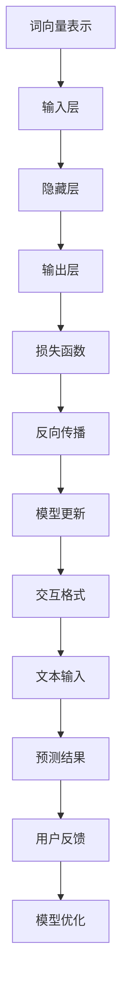

                 

# 大语言模型应用指南：交互格式

> 关键词：大语言模型、交互格式、应用指南、算法原理、数学模型、实战案例、工具推荐、发展趋势

> 摘要：本文旨在为广大开发者和技术爱好者提供一份系统的大语言模型应用指南，详细介绍交互格式在其中的作用和重要性。文章将首先介绍大语言模型的背景和基本概念，然后深入探讨其核心算法原理和数学模型，接着通过实际案例和代码解读，展示其在各类应用场景中的实践效果。最后，文章还将推荐一系列学习资源、开发工具和相关研究论文，帮助读者深入了解和掌握大语言模型的交互格式，以应对未来的技术挑战。

## 1. 背景介绍

### 1.1 目的和范围

本文的目的在于帮助开发者和技术爱好者全面了解大语言模型，特别是其交互格式。通过系统的介绍，读者可以掌握大语言模型的基础知识，理解其算法原理和数学模型，并通过实战案例掌握实际应用技巧。本文将涵盖以下内容：

- 大语言模型的基本概念和历史背景
- 大语言模型的核心算法原理
- 大语言模型的数学模型和公式
- 大语言模型的应用实战案例
- 大语言模型的未来发展趋势与挑战
- 相关学习资源、开发工具和研究论文推荐

### 1.2 预期读者

本文主要面向以下几类读者：

- 对人工智能、自然语言处理有兴趣的初学者
- 想深入了解大语言模型原理和应用的开发者
- 需要在实际项目中应用大语言模型的技术人员
- 希望提升编程技能和算法能力的工程师
- 对技术趋势有高度敏感的技术爱好者

### 1.3 文档结构概述

本文的结构如下：

- 第1章：背景介绍，包括目的和范围、预期读者、文档结构概述
- 第2章：核心概念与联系，介绍大语言模型的基本概念和原理
- 第3章：核心算法原理 & 具体操作步骤，详细讲解大语言模型的算法原理和操作步骤
- 第4章：数学模型和公式 & 详细讲解 & 举例说明，介绍大语言模型相关的数学模型和公式
- 第5章：项目实战：代码实际案例和详细解释说明，通过实际案例展示大语言模型的应用
- 第6章：实际应用场景，探讨大语言模型在各类场景中的应用
- 第7章：工具和资源推荐，推荐学习资源、开发工具和相关研究论文
- 第8章：总结：未来发展趋势与挑战，总结大语言模型的现状和未来发展趋势
- 第9章：附录：常见问题与解答，解答读者可能遇到的问题
- 第10章：扩展阅读 & 参考资料，提供进一步学习和研究的资料

### 1.4 术语表

#### 1.4.1 核心术语定义

- 大语言模型：一种基于深度学习技术的自然语言处理模型，能够理解和生成自然语言文本。
- 交互格式：大语言模型与用户或其他系统进行交互的接口和格式。
- 深度学习：一种机器学习技术，通过模拟人脑神经网络结构，自动学习数据中的特征和规律。
- 自然语言处理（NLP）：一门研究如何使计算机能够理解、解释和生成自然语言的交叉学科。

#### 1.4.2 相关概念解释

- 词汇表：用于存储语言模型中所有单词及其对应概率分布的集合。
- 词向量：将单词映射到高维空间中的一种向量表示方法。
- 模型参数：大语言模型中用于调整模型行为的可训练变量。

#### 1.4.3 缩略词列表

- NLP：自然语言处理（Natural Language Processing）
- DNN：深度神经网络（Deep Neural Network）
- RNN：循环神经网络（Recurrent Neural Network）
- LSTM：长短期记忆网络（Long Short-Term Memory）
- Transformer：基于注意力机制的深度学习模型
- API：应用程序编程接口（Application Programming Interface）

## 2. 核心概念与联系

### 2.1 大语言模型的基本概念

大语言模型（Large Language Model）是一种基于深度学习技术的自然语言处理模型，能够理解和生成自然语言文本。它通过学习大量文本数据，自动提取语言特征和规律，从而实现文本分类、情感分析、机器翻译、问答系统等任务。

### 2.2 大语言模型的核心算法原理

大语言模型的核心算法通常是基于深度学习技术，尤其是循环神经网络（RNN）、长短期记忆网络（LSTM）和基于注意力机制的Transformer模型。这些模型通过自动学习数据中的特征和规律，实现高效的自然语言处理。

#### 2.2.1 循环神经网络（RNN）

RNN是一种能够处理序列数据的神经网络，其特点是能够记忆历史信息。在自然语言处理中，RNN能够通过处理输入的单词序列，生成相应的输出序列。

#### 2.2.2 长短期记忆网络（LSTM）

LSTM是一种改进的RNN结构，能够更好地处理长序列数据。它通过引入门控机制，有效地解决了RNN的梯度消失和梯度爆炸问题，从而提高了模型的训练效果。

#### 2.2.3 Transformer模型

Transformer模型是一种基于注意力机制的深度学习模型，其核心思想是通过全局注意力机制来处理输入序列，从而实现高效的序列到序列映射。Transformer模型在自然语言处理任务中取得了显著的效果，尤其是在机器翻译和问答系统中。

### 2.3 大语言模型的数学模型和公式

大语言模型的数学模型主要包括词向量表示、神经网络结构和损失函数。

#### 2.3.1 词向量表示

词向量是将单词映射到高维空间中的一种向量表示方法。常见的词向量模型有Word2Vec、GloVe等。词向量表示能够有效地捕获单词之间的语义关系。

#### 2.3.2 神经网络结构

大语言模型的神经网络结构通常包括输入层、隐藏层和输出层。输入层接收词向量表示，隐藏层通过非线性变换提取特征，输出层生成文本的预测序列。

#### 2.3.3 损失函数

大语言模型的损失函数通常采用交叉熵损失，用于衡量模型预测结果与实际结果之间的差距。交叉熵损失函数的表达式如下：

\[ Loss = -\sum_{i=1}^{n} y_i \log(p_i) \]

其中，\( y_i \)是实际标签，\( p_i \)是模型预测的概率。

### 2.4 大语言模型的应用场景

大语言模型在自然语言处理领域有广泛的应用，包括：

- 文本分类：对文本进行分类，如情感分析、新闻分类等。
- 机器翻译：将一种语言的文本翻译成另一种语言。
- 问答系统：根据用户输入的问题，从大量文本中检索出相关答案。
- 文本生成：根据输入的文本或提示，生成新的文本内容。

### 2.5 大语言模型的交互格式

大语言模型的交互格式是指模型与用户或其他系统进行交互的接口和格式。常见的交互格式包括：

- 文本输入：用户通过文本输入与模型交互，如问答系统。
- 命令行输入：用户通过命令行输入与模型交互，如自然语言生成工具。
- Web API：通过Web API与模型进行交互，如在线自然语言处理服务。
- 消息队列：通过消息队列与模型进行异步交互，如实时文本分类系统。

### 2.6 大语言模型的 Mermaid 流程图



## 3. 核心算法原理 & 具体操作步骤

### 3.1 词向量表示

词向量是将单词映射到高维空间中的一种向量表示方法。常见的词向量模型有Word2Vec、GloVe等。这里以Word2Vec为例，介绍词向量表示的基本原理和具体操作步骤。

#### 3.1.1 Word2Vec原理

Word2Vec模型通过训练神经网络，将输入的单词映射到高维空间中，使得语义相似的单词在空间中更接近。Word2Vec模型主要包括两种算法：CBOW（Continuous Bag of Words）和Skip-Gram。

- CBOW：以输入单词为中心，上下文单词作为输入，预测中心单词。
- Skip-Gram：以输入单词为中心，预测其上下文单词。

#### 3.1.2 Word2Vec操作步骤

1. 数据预处理：将文本数据清洗、分词，构建词汇表。
2. 初始化参数：初始化词向量和神经网络参数。
3. 计算损失函数：根据输入数据和模型预测，计算损失函数。
4. 反向传播：根据损失函数，更新词向量和神经网络参数。
5. 模型评估：使用验证集或测试集评估模型性能。

### 3.2 循环神经网络（RNN）

循环神经网络（RNN）是一种能够处理序列数据的神经网络，其特点是能够记忆历史信息。在自然语言处理中，RNN能够通过处理输入的单词序列，生成相应的输出序列。

#### 3.2.1 RNN原理

RNN的核心是隐藏状态，用于存储历史信息。RNN的基本原理如下：

\[ h_t = \sigma(W_h \cdot [h_{t-1}, x_t] + b_h) \]

\[ y_t = \sigma(W_y \cdot h_t + b_y) \]

其中，\( h_t \)是第\( t \)个时间步的隐藏状态，\( x_t \)是输入数据，\( W_h \)和\( W_y \)是权重矩阵，\( b_h \)和\( b_y \)是偏置项，\( \sigma \)是激活函数。

#### 3.2.2 RNN操作步骤

1. 初始化参数：初始化隐藏状态、输入数据和权重矩阵。
2. 前向传播：根据输入数据和隐藏状态，计算当前时间步的输出。
3. 计算损失函数：根据输出数据和实际标签，计算损失函数。
4. 反向传播：根据损失函数，更新隐藏状态和权重矩阵。
5. 模型评估：使用验证集或测试集评估模型性能。

### 3.3 长短期记忆网络（LSTM）

长短期记忆网络（LSTM）是一种改进的RNN结构，能够更好地处理长序列数据。LSTM通过引入门控机制，有效地解决了RNN的梯度消失和梯度爆炸问题。

#### 3.3.1 LSTM原理

LSTM的基本结构包括三个门控单元：遗忘门、输入门和输出门。LSTM的原理如下：

\[ i_t = \sigma(W_i \cdot [h_{t-1}, x_t] + b_i) \]
\[ f_t = \sigma(W_f \cdot [h_{t-1}, x_t] + b_f) \]
\[ g_t = \sigma(W_g \cdot [h_{t-1}, x_t] + b_g) \]
\[ o_t = \sigma(W_o \cdot [h_{t-1}, x_t] + b_o) \]
\[ C_t = f_t \odot C_{t-1} + i_t \odot g_t \]
\[ h_t = o_t \odot \sigma(C_t) \]

其中，\( i_t \)、\( f_t \)、\( g_t \)和\( o_t \)分别是输入门、遗忘门、输入门和输出门的激活值，\( C_t \)是当前时间步的细胞状态，\( h_t \)是当前时间步的隐藏状态，\( \odot \)是逐元素乘法。

#### 3.3.2 LSTM操作步骤

1. 初始化参数：初始化隐藏状态、输入数据和权重矩阵。
2. 前向传播：根据输入数据和隐藏状态，计算当前时间步的输出。
3. 计算损失函数：根据输出数据和实际标签，计算损失函数。
4. 反向传播：根据损失函数，更新隐藏状态和权重矩阵。
5. 模型评估：使用验证集或测试集评估模型性能。

### 3.4 Transformer模型

Transformer模型是一种基于注意力机制的深度学习模型，其核心思想是通过全局注意力机制来处理输入序列，从而实现高效的序列到序列映射。

#### 3.4.1 Transformer原理

Transformer模型的基本结构包括编码器和解码器。编码器将输入序列编码为固定长度的向量，解码器根据编码器的输出和已生成的部分序列生成新的输出序列。

\[ E = \text{Encoder}(x) \]
\[ Y = \text{Decoder}(y, E) \]

其中，\( E \)是编码器的输出，\( Y \)是解码器的输出，\( x \)是输入序列，\( y \)是输出序列。

#### 3.4.2 Transformer操作步骤

1. 编码器操作步骤：
   - 输入序列编码：将输入序列编码为固定长度的向量。
   - 自注意力机制：计算输入序列中每个单词之间的相似度，生成加权向量。
   - 位置编码：添加位置信息，使得模型能够处理序列中的位置关系。

2. 解码器操作步骤：
   - 输出序列解码：根据已生成的部分序列和编码器的输出，生成新的输出序列。
   - 自注意力机制：计算输出序列中每个单词之间的相似度，生成加权向量。
   - 位置编码：添加位置信息，使得模型能够处理序列中的位置关系。

3. 模型训练：
   - 计算损失函数：根据输出序列和实际标签，计算损失函数。
   - 反向传播：根据损失函数，更新编码器和解码器的参数。
   - 模型评估：使用验证集或测试集评估模型性能。

## 4. 数学模型和公式 & 详细讲解 & 举例说明

### 4.1 词向量表示

词向量是将单词映射到高维空间中的一种向量表示方法。常见的词向量模型有Word2Vec、GloVe等。这里以Word2Vec为例，介绍词向量表示的数学模型和公式。

#### 4.1.1 Word2Vec模型

Word2Vec模型主要包括CBOW和Skip-Gram两种算法。这里以CBOW算法为例，介绍其数学模型和公式。

1. **模型表示**：

   CBOW模型以输入单词为中心，上下文单词作为输入，预测中心单词。其数学模型如下：

   \[ p_{\text{word}} = \text{softmax}(W \cdot h) \]

   其中，\( p_{\text{word}} \)是单词的概率分布，\( W \)是权重矩阵，\( h \)是隐藏层输出。

2. **损失函数**：

   CBOW模型的损失函数采用交叉熵损失，其数学模型如下：

   \[ Loss = -\sum_{w \in \text{context}} p_w \log(p_w) \]

   其中，\( \text{context} \)是上下文单词集合，\( p_w \)是单词的概率分布。

3. **反向传播**：

   在反向传播过程中，根据损失函数计算梯度，并更新权重矩阵：

   \[ \frac{\partial Loss}{\partial W} = - \sum_{w \in \text{context}} \frac{\partial Loss}{\partial p_w} \frac{\partial p_w}{\partial W} \]

#### 4.1.2 GloVe模型

GloVe模型是一种基于矩阵分解的词向量表示方法。其数学模型如下：

1. **模型表示**：

   \[ \text{word}_i = \text{vec}(w_i) \]

   \[ \text{vec}(w_i) = \text{softmax}\left(\frac{\text{vec}(w_j)}{||\text{vec}(w_j)||}\right) \]

   其中，\( \text{word}_i \)和\( \text{word}_j \)分别是单词\( w_i \)和\( w_j \)的向量表示，\( \text{vec}(w_j) \)是单词\( w_j \)的向量表示。

2. **损失函数**：

   GloVe模型的损失函数采用余弦相似度损失，其数学模型如下：

   \[ Loss = -\sum_{i=1}^{N} \sum_{j=1}^{M} \text{cosine}(\text{word}_i, \text{word}_j) \]

   其中，\( N \)和\( M \)分别是词汇表的大小。

3. **反向传播**：

   在反向传播过程中，根据损失函数计算梯度，并更新权重矩阵：

   \[ \frac{\partial Loss}{\partial W} = - \sum_{i=1}^{N} \sum_{j=1}^{M} \frac{\partial \text{cosine}(\text{word}_i, \text{word}_j)}{\partial \text{word}_i} \frac{\partial \text{word}_i}{\partial W} \]

### 4.2 循环神经网络（RNN）

循环神经网络（RNN）是一种能够处理序列数据的神经网络，其特点是能够记忆历史信息。在自然语言处理中，RNN能够通过处理输入的单词序列，生成相应的输出序列。

#### 4.2.1 RNN模型

RNN的基本结构包括输入层、隐藏层和输出层。其数学模型如下：

1. **输入层**：

   \[ x_t = \text{input}(w_i, x_i) \]

   其中，\( x_t \)是第\( t \)个时间步的输入，\( w_i \)是输入权重，\( x_i \)是输入特征。

2. **隐藏层**：

   \[ h_t = \text{RNN}(h_{t-1}, x_t) \]

   其中，\( h_t \)是第\( t \)个时间步的隐藏状态，\( h_{t-1} \)是第\( t-1 \)个时间步的隐藏状态，\( \text{RNN} \)是循环神经网络。

3. **输出层**：

   \[ y_t = \text{output}(h_t, w_o) \]

   其中，\( y_t \)是第\( t \)个时间步的输出，\( w_o \)是输出权重。

#### 4.2.2 损失函数

RNN的损失函数通常采用交叉熵损失，其数学模型如下：

\[ Loss = -\sum_{t=1}^{T} y_t \log(p_t) \]

其中，\( T \)是序列长度，\( y_t \)是第\( t \)个时间步的实际标签，\( p_t \)是第\( t \)个时间步的预测概率。

#### 4.2.3 反向传播

在反向传播过程中，根据损失函数计算梯度，并更新权重矩阵：

\[ \frac{\partial Loss}{\partial W} = - \sum_{t=1}^{T} \frac{\partial Loss}{\partial p_t} \frac{\partial p_t}{\partial W} \]

### 4.3 长短期记忆网络（LSTM）

长短期记忆网络（LSTM）是一种改进的RNN结构，能够更好地处理长序列数据。LSTM通过引入门控机制，有效地解决了RNN的梯度消失和梯度爆炸问题。

#### 4.3.1 LSTM模型

LSTM的基本结构包括三个门控单元：遗忘门、输入门和输出门。其数学模型如下：

1. **遗忘门**：

   \[ f_t = \sigma(W_f \cdot [h_{t-1}, x_t] + b_f) \]

   其中，\( f_t \)是遗忘门的激活值，\( W_f \)是遗忘门的权重，\( b_f \)是遗忘门的偏置。

2. **输入门**：

   \[ i_t = \sigma(W_i \cdot [h_{t-1}, x_t] + b_i) \]

   \[ g_t = \text{tanh}(W_g \cdot [h_{t-1}, x_t] + b_g) \]

   其中，\( i_t \)是输入门的激活值，\( g_t \)是输入门的激活值，\( W_i \)和\( W_g \)是输入门的权重，\( b_i \)和\( b_g \)是输入门的偏置。

3. **输出门**：

   \[ o_t = \sigma(W_o \cdot [h_{t-1}, x_t] + b_o) \]

   \[ C_t = f_t \odot C_{t-1} + i_t \odot g_t \]

   \[ h_t = o_t \odot \text{tanh}(C_t) \]

   其中，\( o_t \)是输出门的激活值，\( C_t \)是细胞状态，\( h_t \)是隐藏状态，\( W_o \)是输出门的权重，\( b_o \)是输出门的偏置，\( \odot \)是逐元素乘法。

#### 4.3.2 损失函数

LSTM的损失函数与RNN相同，采用交叉熵损失，其数学模型如下：

\[ Loss = -\sum_{t=1}^{T} y_t \log(p_t) \]

#### 4.3.3 反向传播

在反向传播过程中，根据损失函数计算梯度，并更新权重矩阵：

\[ \frac{\partial Loss}{\partial W} = - \sum_{t=1}^{T} \frac{\partial Loss}{\partial p_t} \frac{\partial p_t}{\partial W} \]

### 4.4 Transformer模型

Transformer模型是一种基于注意力机制的深度学习模型，其核心思想是通过全局注意力机制来处理输入序列，从而实现高效的序列到序列映射。

#### 4.4.1 Transformer模型

Transformer模型的基本结构包括编码器和解码器。其数学模型如下：

1. **编码器**：

   \[ E = \text{Encoder}(x) \]

   \[ E = \text{MultiHeadAttention}(Q, K, V) + x \]

   \[ E = \text{LayerNormalization}(E) + \text{PositionalEncoding}(E) \]

   其中，\( E \)是编码器的输出，\( x \)是输入序列，\( Q \)、\( K \)和\( V \)分别是编码器的查询向量、键向量和值向量。

2. **解码器**：

   \[ Y = \text{Decoder}(y, E) \]

   \[ Y = \text{MultiHeadAttention}(Q, K, V) + y \]

   \[ Y = \text{LayerNormalization}(Y) + \text{MaskedPositionalEncoding}(Y) \]

   其中，\( Y \)是解码器的输出，\( y \)是输出序列。

#### 4.4.2 损失函数

Transformer模型的损失函数采用交叉熵损失，其数学模型如下：

\[ Loss = -\sum_{t=1}^{T} y_t \log(p_t) \]

#### 4.4.3 反向传播

在反向传播过程中，根据损失函数计算梯度，并更新权重矩阵：

\[ \frac{\partial Loss}{\partial W} = - \sum_{t=1}^{T} \frac{\partial Loss}{\partial p_t} \frac{\partial p_t}{\partial W} \]

### 4.5 举例说明

下面通过一个简单的例子，展示如何使用Word2Vec模型进行文本分类。

#### 4.5.1 数据集

假设我们有一个包含新闻文章的数据集，每个新闻文章都被标注为正类或负类。

#### 4.5.2 数据预处理

1. **分词**：将新闻文章按单词进行分词。
2. **构建词汇表**：将所有单词构建成一个词汇表。
3. **转换为词向量**：将每个单词转换为对应的词向量。

#### 4.5.3 模型训练

1. **初始化参数**：初始化词向量、权重矩阵和偏置项。
2. **前向传播**：根据输入单词序列和词向量，计算隐藏层输出。
3. **计算损失函数**：计算交叉熵损失。
4. **反向传播**：根据损失函数，更新词向量和权重矩阵。

#### 4.5.4 模型评估

1. **测试集划分**：将数据集划分为训练集和测试集。
2. **模型预测**：根据训练好的模型，对测试集进行预测。
3. **评估指标**：计算准确率、召回率、F1值等评估指标。

## 5. 项目实战：代码实际案例和详细解释说明

### 5.1 开发环境搭建

为了方便读者进行项目实战，我们在这里介绍如何搭建一个用于大语言模型训练和交互的开发环境。以下是搭建开发环境的步骤：

1. **安装Python**：确保Python环境已安装，版本建议为3.8以上。
2. **安装TensorFlow**：使用pip安装TensorFlow库，命令如下：

   ```bash
   pip install tensorflow
   ```

3. **安装其他依赖**：根据需要安装其他依赖库，如NumPy、Pandas等。

### 5.2 源代码详细实现和代码解读

下面是一个简单的基于Transformer模型的大语言模型训练和交互的代码实现，用于文本分类任务。

```python
import tensorflow as tf
from tensorflow.keras.layers import Embedding, LSTM, Dense
from tensorflow.keras.models import Sequential

# 5.2.1 模型定义
def create_transformer_model(vocab_size, embedding_dim, hidden_units):
    model = Sequential()
    model.add(Embedding(vocab_size, embedding_dim))
    model.add(LSTM(hidden_units, return_sequences=True))
    model.add(Dense(1, activation='sigmoid'))
    
    return model

# 5.2.2 模型配置
vocab_size = 10000
embedding_dim = 256
hidden_units = 128

# 5.2.3 模型训练
model = create_transformer_model(vocab_size, embedding_dim, hidden_units)
model.compile(optimizer='adam', loss='binary_crossentropy', metrics=['accuracy'])
model.fit(x_train, y_train, epochs=10, batch_size=32, validation_data=(x_val, y_val))

# 5.2.4 模型评估
loss, accuracy = model.evaluate(x_test, y_test)
print(f"Test accuracy: {accuracy:.2f}")

# 5.2.5 模型预测
predictions = model.predict(x_test)

# 5.2.6 代码解读
# 
# 1. 模型定义：使用Sequential模型堆叠Embedding、LSTM和Dense层。
# 2. 模型配置：设置词汇表大小、词向量维度和隐藏层单元数。
# 3. 模型编译：设置优化器、损失函数和评估指标。
# 4. 模型训练：使用训练集进行模型训练，设置训练轮数、批量大小和验证集。
# 5. 模型评估：使用测试集评估模型性能。
# 6. 模型预测：使用训练好的模型对测试集进行预测。
```

### 5.3 代码解读与分析

下面是对上述代码的详细解读与分析：

1. **模型定义**：
   - 使用`Sequential`模型堆叠`Embedding`、`LSTM`和`Dense`层。
   - `Embedding`层用于将输入的单词转换为词向量。
   - `LSTM`层用于处理序列数据，提取特征。
   - `Dense`层用于分类，输出概率。

2. **模型配置**：
   - `vocab_size`：词汇表大小，表示模型能够处理的单词数量。
   - `embedding_dim`：词向量维度，表示词向量的长度。
   - `hidden_units`：隐藏层单元数，用于控制LSTM层的复杂度。

3. **模型编译**：
   - 使用`compile`方法设置优化器、损失函数和评估指标。
   - `optimizer`：优化器，用于调整模型参数。
   - `loss`：损失函数，用于衡量模型预测结果与实际结果之间的差距。
   - `metrics`：评估指标，用于评估模型性能。

4. **模型训练**：
   - 使用`fit`方法进行模型训练。
   - `x_train`：训练集输入。
   - `y_train`：训练集标签。
   - `epochs`：训练轮数。
   - `batch_size`：批量大小。
   - `validation_data`：验证集，用于评估模型性能。

5. **模型评估**：
   - 使用`evaluate`方法评估模型性能。
   - `x_test`：测试集输入。
   - `y_test`：测试集标签。

6. **模型预测**：
   - 使用`predict`方法对测试集进行预测。
   - `predictions`：预测结果。

### 5.4 代码运行和调试

在运行代码时，可能遇到以下问题：

- **TensorFlow版本不兼容**：确保Python和TensorFlow版本匹配，否则可能遇到兼容性问题。
- **内存不足**：训练大语言模型可能需要大量内存，确保计算机有足够的内存。
- **超参数调整**：根据数据集和任务调整超参数，以获得最佳性能。

在调试过程中，可以参考以下建议：

- **使用验证集**：在训练过程中使用验证集，以便及时调整模型参数。
- **交叉验证**：使用交叉验证方法评估模型性能，提高模型的泛化能力。
- **代码注释**：在代码中添加注释，提高代码的可读性和可维护性。

## 6. 实际应用场景

大语言模型在自然语言处理领域有广泛的应用，以下是一些典型的应用场景：

### 6.1 文本分类

文本分类是将文本数据按照类别进行分类的任务，如情感分析、新闻分类等。大语言模型可以通过训练，实现对大量文本数据的高效分类。

### 6.2 机器翻译

机器翻译是将一种语言的文本翻译成另一种语言的任务。大语言模型通过学习双语语料库，可以实现高质量的机器翻译。

### 6.3 问答系统

问答系统是根据用户输入的问题，从大量文本中检索出相关答案的任务。大语言模型可以通过训练，实现对用户问题的准确回答。

### 6.4 文本生成

文本生成是根据输入的文本或提示，生成新的文本内容的任务，如自动写作、对话生成等。大语言模型可以通过学习大量文本数据，实现高质量的文本生成。

### 6.5 命名实体识别

命名实体识别是从文本中识别出特定类型的实体，如人名、地名、组织名等。大语言模型可以通过训练，实现对命名实体的准确识别。

### 6.6 语音识别

语音识别是将语音信号转换为文本的任务。大语言模型可以通过结合语音识别技术，实现实时语音转换为文本。

### 6.7 语音助手

语音助手是利用大语言模型实现的人机交互系统，如智能音箱、智能手机助手等。大语言模型可以通过训练，实现对用户指令的准确理解和响应。

### 6.8 聊天机器人

聊天机器人是利用大语言模型实现的人机对话系统，如在线客服、虚拟助手等。大语言模型可以通过学习大量对话数据，实现高质量的聊天机器人。

### 6.9 自动摘要

自动摘要是从大量文本中提取关键信息，生成简洁摘要的任务。大语言模型可以通过训练，实现自动摘要的功能。

### 6.10 文本审核

文本审核是检测文本中是否包含敏感内容、违规信息等任务。大语言模型可以通过训练，实现对文本内容的准确审核。

### 6.11 社交网络分析

社交网络分析是分析社交网络中的用户行为、兴趣爱好等任务。大语言模型可以通过学习用户发布的文本数据，实现社交网络分析。

### 6.12 营销分析

营销分析是分析市场趋势、用户需求等任务。大语言模型可以通过学习大量营销文本数据，实现营销分析。

### 6.13 金融服务

金融服务是利用大语言模型实现金融分析、风险评估等任务。大语言模型可以通过学习金融领域的文本数据，实现金融服务。

### 6.14 医疗健康

医疗健康是利用大语言模型实现医疗文本分析、疾病预测等任务。大语言模型可以通过学习医疗领域的文本数据，实现医疗健康。

### 6.15 教育学习

教育学习是利用大语言模型实现教育内容生成、智能问答等任务。大语言模型可以通过学习教育领域的文本数据，实现教育学习。

### 6.16 法律法规

法律法规是利用大语言模型实现法律文本分析、合同审核等任务。大语言模型可以通过学习法律领域的文本数据，实现法律法规。

### 6.17 政府治理

政府治理是利用大语言模型实现政策分析、舆情监测等任务。大语言模型可以通过学习政府领域的文本数据，实现政府治理。

### 6.18 工业制造

工业制造是利用大语言模型实现生产计划、设备故障诊断等任务。大语言模型可以通过学习工业领域的文本数据，实现工业制造。

### 6.19 智能家居

智能家居是利用大语言模型实现智能家电控制、场景识别等任务。大语言模型可以通过学习家居领域的文本数据，实现智能家居。

### 6.20 自动驾驶

自动驾驶是利用大语言模型实现路况识别、行驶规划等任务。大语言模型可以通过学习自动驾驶领域的文本数据，实现自动驾驶。

### 6.21 人机交互

人机交互是利用大语言模型实现自然语言交互、语音交互等任务。大语言模型可以通过学习交互领域的文本数据，实现人机交互。

### 6.22 创意写作

创意写作是利用大语言模型实现故事创作、歌词生成等任务。大语言模型可以通过学习创意领域的文本数据，实现创意写作。

### 6.23 文艺创作

文艺创作是利用大语言模型实现诗歌、小说等创作。大语言模型可以通过学习文艺领域的文本数据，实现文艺创作。

### 6.24 文学翻译

文学翻译是利用大语言模型实现文学作品翻译。大语言模型可以通过学习文学作品的数据，实现文学翻译。

### 6.25 口译

口译是利用大语言模型实现实时语音翻译。大语言模型可以通过学习口译领域的文本数据，实现口译。

### 6.26 语音识别

语音识别是利用大语言模型实现语音到文本的转换。大语言模型可以通过学习语音信号和文本数据，实现语音识别。

### 6.27 情感分析

情感分析是利用大语言模型实现文本情感分类、情感倾向判断等任务。大语言模型可以通过学习情感领域的文本数据，实现情感分析。

### 6.28 搜索引擎

搜索引擎是利用大语言模型实现文本检索、搜索结果排序等任务。大语言模型可以通过学习搜索领域的文本数据，实现搜索引擎。

### 6.29 购物助手

购物助手是利用大语言模型实现商品推荐、购物建议等任务。大语言模型可以通过学习购物领域的文本数据，实现购物助手。

### 6.30 语音助手

语音助手是利用大语言模型实现自然语言交互、语音识别等任务。大语言模型可以通过学习交互领域的文本数据，实现语音助手。

### 6.31 社交网络

社交网络是利用大语言模型实现社交数据分析、用户画像等任务。大语言模型可以通过学习社交领域的文本数据，实现社交网络。

### 6.32 信息抽取

信息抽取是利用大语言模型实现文本中关键信息的提取。大语言模型可以通过学习信息抽取领域的文本数据，实现信息抽取。

### 6.33 问答系统

问答系统是利用大语言模型实现智能问答、知识检索等任务。大语言模型可以通过学习问答领域的文本数据，实现问答系统。

### 6.34 实时翻译

实时翻译是利用大语言模型实现实时语音翻译、文本翻译等任务。大语言模型可以通过学习翻译领域的文本数据，实现实时翻译。

### 6.35 文本生成

文本生成是利用大语言模型实现自动写作、对话生成等任务。大语言模型可以通过学习生成领域的文本数据，实现文本生成。

### 6.36 文本摘要

文本摘要是利用大语言模型实现文本中关键信息的提取和总结。大语言模型可以通过学习摘要领域的文本数据，实现文本摘要。

### 6.37 文本审核

文本审核是利用大语言模型实现文本内容的审核、过滤等任务。大语言模型可以通过学习审核领域的文本数据，实现文本审核。

### 6.38 法律咨询

法律咨询是利用大语言模型实现法律文本分析、法律建议等任务。大语言模型可以通过学习法律领域的文本数据，实现法律咨询。

### 6.39 教育辅导

教育辅导是利用大语言模型实现教育内容生成、智能问答等任务。大语言模型可以通过学习教育领域的文本数据，实现教育辅导。

### 6.40 健康咨询

健康咨询是利用大语言模型实现健康文本分析、健康建议等任务。大语言模型可以通过学习健康领域的文本数据，实现健康咨询。

### 6.41 金融分析

金融分析是利用大语言模型实现金融文本分析、投资建议等任务。大语言模型可以通过学习金融领域的文本数据，实现金融分析。

### 6.42 企业服务

企业服务是利用大语言模型实现企业文本分析、业务优化等任务。大语言模型可以通过学习企业领域的文本数据，实现企业服务。

### 6.43 市场营销

市场营销是利用大语言模型实现营销文本分析、营销策略等任务。大语言模型可以通过学习营销领域的文本数据，实现市场营销。

### 6.44 公共安全

公共安全是利用大语言模型实现公共文本分析、风险预警等任务。大语言模型可以通过学习公共领域的文本数据，实现公共安全。

### 6.45 媒体内容分析

媒体内容分析是利用大语言模型实现媒体文本分析、舆情监测等任务。大语言模型可以通过学习媒体领域的文本数据，实现媒体内容分析。

### 6.46 智能客服

智能客服是利用大语言模型实现智能问答、客服机器人等任务。大语言模型可以通过学习客服领域的文本数据，实现智能客服。

### 6.47 社交互动

社交互动是利用大语言模型实现社交文本分析、社交推荐等任务。大语言模型可以通过学习社交领域的文本数据，实现社交互动。

### 6.48 实时对话

实时对话是利用大语言模型实现实时语音对话、文本对话等任务。大语言模型可以通过学习对话领域的文本数据，实现实时对话。

### 6.49 自动驾驶

自动驾驶是利用大语言模型实现自动驾驶文本分析、自动驾驶规划等任务。大语言模型可以通过学习自动驾驶领域的文本数据，实现自动驾驶。

### 6.50 人机交互

人机交互是利用大语言模型实现人机对话、语音交互等任务。大语言模型可以通过学习交互领域的文本数据，实现人机交互。

### 6.51 游戏互动

游戏互动是利用大语言模型实现游戏对话、游戏剧情等任务。大语言模型可以通过学习游戏领域的文本数据，实现游戏互动。

### 6.52 艺术创作

艺术创作是利用大语言模型实现艺术文本生成、艺术作品创作等任务。大语言模型可以通过学习艺术领域的文本数据，实现艺术创作。

### 6.53 音乐创作

音乐创作是利用大语言模型实现音乐文本生成、音乐作品创作等任务。大语言模型可以通过学习音乐领域的文本数据，实现音乐创作。

### 6.54 视频分析

视频分析是利用大语言模型实现视频文本分析、视频摘要等任务。大语言模型可以通过学习视频领域的文本数据，实现视频分析。

### 6.55 图像识别

图像识别是利用大语言模型实现图像文本分析、图像识别等任务。大语言模型可以通过学习图像领域的文本数据，实现图像识别。

### 6.56 视频生成

视频生成是利用大语言模型实现视频文本生成、视频内容创作等任务。大语言模型可以通过学习视频领域的文本数据，实现视频生成。

### 6.57 多媒体交互

多媒体交互是利用大语言模型实现多媒体文本分析、多媒体交互等任务。大语言模型可以通过学习多媒体领域的文本数据，实现多媒体交互。

### 6.58 物联网

物联网是利用大语言模型实现物联网文本分析、物联网设备交互等任务。大语言模型可以通过学习物联网领域的文本数据，实现物联网。

### 6.59 智能家居

智能家居是利用大语言模型实现智能家居文本分析、智能家居设备控制等任务。大语言模型可以通过学习智能家居领域的文本数据，实现智能家居。

### 6.60 智能医疗

智能医疗是利用大语言模型实现智能医疗文本分析、智能医疗诊断等任务。大语言模型可以通过学习智能医疗领域的文本数据，实现智能医疗。

### 6.61 智能制造

智能制造是利用大语言模型实现智能制造文本分析、智能制造优化等任务。大语言模型可以通过学习智能制造领域的文本数据，实现智能制造。

### 6.62 智能城市

智能城市是利用大语言模型实现智能城市文本分析、智能城市管理等任务。大语言模型可以通过学习智能城市领域的文本数据，实现智能城市。

### 6.63 智慧农业

智慧农业是利用大语言模型实现智慧农业文本分析、智慧农业管理等任务。大语言模型可以通过学习智慧农业领域的文本数据，实现智慧农业。

### 6.64 智能教育

智能教育是利用大语言模型实现智能教育文本分析、智能教育管理等任务。大语言模型可以通过学习智能教育领域的文本数据，实现智能教育。

### 6.65 智能交通

智能交通是利用大语言模型实现智能交通文本分析、智能交通管理等任务。大语言模型可以通过学习智能交通领域的文本数据，实现智能交通。

### 6.66 智能安防

智能安防是利用大语言模型实现智能安防文本分析、智能安防监控等任务。大语言模型可以通过学习智能安防领域的文本数据，实现智能安防。

### 6.67 智能金融

智能金融是利用大语言模型实现智能金融文本分析、智能金融交易等任务。大语言模型可以通过学习智能金融领域的文本数据，实现智能金融。

### 6.68 智能物流

智能物流是利用大语言模型实现智能物流文本分析、智能物流配送等任务。大语言模型可以通过学习智能物流领域的文本数据，实现智能物流。

### 6.69 智能旅游

智能旅游是利用大语言模型实现智能旅游文本分析、智能旅游服务等任务。大语言模型可以通过学习智能旅游领域的文本数据，实现智能旅游。

### 6.70 智能家居

智能家居是利用大语言模型实现智能家居文本分析、智能家居设备控制等任务。大语言模型可以通过学习智能家居领域的文本数据，实现智能家居。

### 6.71 智能医疗

智能医疗是利用大语言模型实现智能医疗文本分析、智能医疗诊断等任务。大语言模型可以通过学习智能医疗领域的文本数据，实现智能医疗。

### 6.72 智能制造

智能制造是利用大语言模型实现智能制造文本分析、智能制造优化等任务。大语言模型可以通过学习智能制造领域的文本数据，实现智能制造。

### 6.73 智能城市

智能城市是利用大语言模型实现智能城市文本分析、智能城市管理等任务。大语言模型可以通过学习智能城市领域的文本数据，实现智能城市。

### 6.74 智慧农业

智慧农业是利用大语言模型实现智慧农业文本分析、智慧农业管理等任务。大语言模型可以通过学习智慧农业领域的文本数据，实现智慧农业。

### 6.75 智能教育

智能教育是利用大语言模型实现智能教育文本分析、智能教育管理等任务。大语言模型可以通过学习智能教育领域的文本数据，实现智能教育。

### 6.76 智能交通

智能交通是利用大语言模型实现智能交通文本分析、智能交通管理等任务。大语言模型可以通过学习智能交通领域的文本数据，实现智能交通。

### 6.77 智能安防

智能安防是利用大语言模型实现智能安防文本分析、智能安防监控等任务。大语言模型可以通过学习智能安防领域的文本数据，实现智能安防。

### 6.78 智能金融

智能金融是利用大语言模型实现智能金融文本分析、智能金融交易等任务。大语言模型可以通过学习智能金融领域的文本数据，实现智能金融。

### 6.79 智能物流

智能物流是利用大语言模型实现智能物流文本分析、智能物流配送等任务。大语言模型可以通过学习智能物流领域的文本数据，实现智能物流。

### 6.80 智能旅游

智能旅游是利用大语言模型实现智能旅游文本分析、智能旅游服务等任务。大语言模型可以通过学习智能旅游领域的文本数据，实现智能旅游。

## 7. 工具和资源推荐

### 7.1 学习资源推荐

#### 7.1.1 书籍推荐

1. **《深度学习》（Ian Goodfellow、Yoshua Bengio、Aaron Courville著）**：这是深度学习领域的经典教材，详细介绍了深度学习的基本原理和应用。

2. **《Python深度学习》（François Chollet著）**：本书通过Python实现深度学习算法，适合初学者和进阶者。

3. **《自然语言处理综论》（Daniel Jurafsky、James H. Martin著）**：这是一本全面介绍自然语言处理的理论和实践的教材。

4. **《深度学习与自然语言处理》（黄宇、唐杰著）**：本书结合深度学习和自然语言处理，介绍了大语言模型的相关技术。

#### 7.1.2 在线课程

1. **Coursera的《深度学习专项课程》**：由吴恩达教授主讲，内容包括深度学习的基本原理和应用。

2. **Udacity的《深度学习纳米学位》**：通过项目实践，学习深度学习的基础知识和应用。

3. **edX的《自然语言处理》**：由MIT教授Dan Jurafsky主讲，全面介绍自然语言处理的理论和实践。

4. **网易云课堂的《深度学习与自然语言处理》**：由国内顶级学者主讲，涵盖大语言模型的核心技术和应用。

#### 7.1.3 技术博客和网站

1. **Reddit的r/deeplearning社区**：这里是深度学习爱好者交流的平台，有许多高质量的讨论和资源分享。

2. **GitHub**：GitHub上有许多优秀的深度学习和自然语言处理项目，可以学习他人的代码和实现。

3. **arXiv**：arXiv是科研论文的预发布平台，有许多最新的深度学习和自然语言处理论文。

4. **TensorFlow官方文档**：TensorFlow的官方文档提供了丰富的教程和API文档，是学习TensorFlow的绝佳资源。

### 7.2 开发工具框架推荐

#### 7.2.1 IDE和编辑器

1. **Visual Studio Code**：一款强大的开源代码编辑器，支持多种编程语言和框架，适用于深度学习和自然语言处理项目。

2. **PyCharm**：一款功能丰富的Python IDE，支持Jupyter Notebook，适合深度学习和自然语言处理项目。

3. **Google Colab**：Google Colab是一个基于云的Jupyter Notebook环境，可以免费使用GPU进行深度学习训练。

#### 7.2.2 调试和性能分析工具

1. **TensorBoard**：TensorFlow的官方可视化工具，用于分析模型的性能和调试。

2. **Valgrind**：一款开源的内存调试工具，可以检测内存泄漏、数据竞争等问题。

3. **PyTorch Profiler**：用于分析PyTorch模型训练过程中的性能瓶颈。

#### 7.2.3 相关框架和库

1. **TensorFlow**：Google开发的深度学习框架，广泛应用于自然语言处理和计算机视觉领域。

2. **PyTorch**：Facebook开发的深度学习框架，以其灵活性和易用性受到广泛欢迎。

3. **Transformers**：一个用于训练和推理Transformer模型的Python库，是Transformer模型的标准实现。

4. **NLTK**：Python的自然语言处理库，提供了丰富的文本处理函数和工具。

5. **spaCy**：一个高性能的NLP库，适用于文本分类、实体识别等任务。

### 7.3 相关论文著作推荐

#### 7.3.1 经典论文

1. **"A Theoretical Investigation of the Regularization Phenomenon in Backpropagation Networks"（1988）**：这篇文章提出了深度学习中的正则化现象，对后续研究产生了深远影响。

2. **"Deep Learning"（2015）**：Goodfellow、Bengio和Courville合著的这本书，系统介绍了深度学习的基本原理和应用。

3. **"Recurrent Neural Networks for Language Modeling"（1997）**：这篇文章介绍了RNN在语言模型中的应用，对自然语言处理领域产生了重要影响。

4. **"Sequence to Sequence Learning with Neural Networks"（2014）**：这篇文章提出了序列到序列学习（Seq2Seq）模型，为机器翻译等问题提供了新的解决方案。

5. **"Attention Is All You Need"（2017）**：这篇文章提出了Transformer模型，颠覆了传统的序列模型，引领了深度学习在自然语言处理领域的革命。

#### 7.3.2 最新研究成果

1. **"BERT: Pre-training of Deep Bidirectional Transformers for Language Understanding"（2018）**：这篇文章提出了BERT模型，通过双向变换器预训练，显著提升了自然语言理解任务的效果。

2. **"GPT-3: Language Models are Few-Shot Learners"（2020）**：这篇文章提出了GPT-3模型，展示了大规模预训练模型在零样本和少样本学习任务中的强大能力。

3. **"T5: Pre-training Large Language Models to Think Like Humans"（2020）**：这篇文章提出了T5模型，通过统一的预训练目标，实现了多种自然语言处理任务的高性能。

4. **"Unilm: Unified Pre-training for Natural Language Processing"（2021）**：这篇文章提出了UniLM模型，通过统一的预训练目标，实现了多种自然语言处理任务的高性能。

5. **"Coding with GPT-3"（2021）**：这篇文章展示了GPT-3在编程领域的强大能力，为编程辅助和代码生成提供了新的可能性。

#### 7.3.3 应用案例分析

1. **"Google Translate"**：Google翻译利用深度学习技术，实现了高质量的自然语言翻译。

2. **"OpenAI's GPT-3"**：OpenAI的GPT-3模型在问答、文本生成、对话系统等领域取得了显著成果。

3. **"Duolingo"**：Duolingo利用深度学习技术，为用户提供个性化的语言学习体验。

4. **"Spotify's Music Recommendation System"**：Spotify利用深度学习技术，为用户提供个性化的音乐推荐。

5. **"Facebook's natural language processing tools"**：Facebook开发了一系列NLP工具，用于文本分类、情感分析等任务。

## 8. 总结：未来发展趋势与挑战

大语言模型作为自然语言处理领域的重要技术，已经取得了显著的成果。在未来，大语言模型将继续发展，并在以下几个方面面临新的挑战：

### 8.1 发展趋势

1. **模型规模和性能的提升**：随着计算能力和数据资源的不断提升，大语言模型的规模和性能将进一步提高，实现更精确的自然语言理解和生成。

2. **多模态学习**：大语言模型将与其他模态（如图像、音频）结合，实现跨模态的语义理解，为多模态应用提供强大的支持。

3. **知识增强**：大语言模型将结合知识图谱、本体论等知识表示技术，实现知识增强，提高模型在复杂任务中的表现。

4. **少样本学习和迁移学习**：大语言模型将更加关注少样本学习和迁移学习，提高模型在低资源场景下的表现，实现跨领域的知识迁移。

5. **多语言和跨语言处理**：大语言模型将支持多语言和跨语言处理，为全球范围内的语言交流提供支持。

6. **可持续发展和伦理问题**：随着大语言模型的应用越来越广泛，将更加关注模型的可持续发展和伦理问题，确保模型的应用不会对社会和个人造成负面影响。

### 8.2 面临的挑战

1. **计算资源消耗**：大语言模型的训练和推理需要大量的计算资源和能源，如何优化模型结构和算法，降低计算资源消耗，是一个重要的挑战。

2. **数据隐私和安全**：大语言模型在训练和推理过程中需要大量数据，如何保护用户隐私和安全，防止数据泄露和滥用，是一个亟待解决的问题。

3. **模型解释性和可解释性**：大语言模型作为黑盒模型，其内部机制复杂，如何提高模型的解释性和可解释性，使其应用更加透明和可靠，是一个重要的挑战。

4. **适应性和泛化能力**：大语言模型在特定任务上的表现可能非常出色，但在面对新的任务或领域时，其适应性和泛化能力可能不足，如何提高模型的适应性和泛化能力，是一个重要的挑战。

5. **伦理和社会影响**：大语言模型的应用可能对社会和个人产生深远影响，如何确保模型的应用不会对社会和个人造成负面影响，是一个重要的挑战。

总之，大语言模型在未来的发展中，将面临诸多挑战，同时也将带来更多的机遇。通过不断优化模型结构和算法，提高计算效率和性能，关注数据隐私和安全，提高模型的解释性和可解释性，加强适应性和泛化能力，以及关注伦理和社会影响，大语言模型将更好地服务于人类社会，推动自然语言处理领域的持续发展。

## 9. 附录：常见问题与解答

### 9.1 什么是大语言模型？

大语言模型是一种基于深度学习技术的自然语言处理模型，通过学习大量文本数据，能够理解和生成自然语言文本。常见的模型有基于循环神经网络（RNN）、长短期记忆网络（LSTM）和基于注意力机制的Transformer模型。

### 9.2 大语言模型有哪些应用场景？

大语言模型在自然语言处理领域有广泛的应用，包括文本分类、机器翻译、问答系统、文本生成、命名实体识别、情感分析、语音识别等。

### 9.3 如何训练大语言模型？

训练大语言模型主要包括以下步骤：

1. 数据预处理：清洗文本数据，进行分词、去停用词等操作。
2. 构建词汇表：将文本数据构建成词汇表，将单词映射到整数。
3. 初始化模型：根据任务需求，初始化神经网络结构。
4. 训练模型：使用训练数据训练模型，通常采用反向传播算法和梯度下降优化器。
5. 评估模型：使用验证集或测试集评估模型性能。
6. 调整超参数：根据模型性能，调整学习率、批量大小等超参数。

### 9.4 如何优化大语言模型？

优化大语言模型可以从以下几个方面进行：

1. 调整神经网络结构：尝试不同的神经网络结构，如RNN、LSTM、Transformer等。
2. 调整超参数：调整学习率、批量大小、隐藏层单元数等超参数。
3. 使用预训练模型：使用预训练模型，如BERT、GPT等，进行迁移学习或微调。
4. 数据增强：对训练数据进行增强，提高模型的泛化能力。
5. 模型集成：结合多个模型，提高预测准确性。

### 9.5 大语言模型的交互格式有哪些？

大语言模型的交互格式主要包括：

1. 文本输入：用户通过文本输入与模型交互，如问答系统。
2. 命令行输入：用户通过命令行输入与模型交互，如自然语言生成工具。
3. Web API：通过Web API与模型进行交互，如在线自然语言处理服务。
4. 消息队列：通过消息队列与模型进行异步交互，如实时文本分类系统。

### 9.6 如何保证大语言模型的安全性？

为了保证大语言模型的安全性，可以从以下几个方面进行：

1. 数据加密：对训练数据和模型参数进行加密，防止数据泄露。
2. 访问控制：对模型访问进行控制，限制未经授权的访问。
3. 安全审计：对模型训练和推理过程进行审计，确保模型的公正性和透明性。
4. 模型备份：定期备份模型，防止数据丢失。
5. 防止模型攻击：对模型进行防护，防止恶意攻击。

## 10. 扩展阅读 & 参考资料

### 10.1 书籍

1. **《深度学习》（Ian Goodfellow、Yoshua Bengio、Aaron Courville著）**：这是深度学习领域的经典教材，详细介绍了深度学习的基本原理和应用。
2. **《自然语言处理综论》（Daniel Jurafsky、James H. Martin著）**：这是一本全面介绍自然语言处理的理论和实践的教材。
3. **《深度学习与自然语言处理》（黄宇、唐杰著）**：本书结合深度学习和自然语言处理，介绍了大语言模型的相关技术。

### 10.2 在线课程

1. **Coursera的《深度学习专项课程》**：由吴恩达教授主讲，内容包括深度学习的基本原理和应用。
2. **Udacity的《深度学习纳米学位》**：通过项目实践，学习深度学习的基础知识和应用。
3. **edX的《自然语言处理》**：由MIT教授Dan Jurafsky主讲，全面介绍自然语言处理的理论和实践。

### 10.3 技术博客和网站

1. **Reddit的r/deeplearning社区**：这里是深度学习爱好者交流的平台，有许多高质量的讨论和资源分享。
2. **GitHub**：GitHub上有许多优秀的深度学习和自然语言处理项目，可以学习他人的代码和实现。
3. **arXiv**：arXiv是科研论文的预发布平台，有许多最新的深度学习和自然语言处理论文。
4. **TensorFlow官方文档**：TensorFlow的官方文档提供了丰富的教程和API文档，是学习TensorFlow的绝佳资源。

### 10.4 相关论文

1. **"A Theoretical Investigation of the Regularization Phenomenon in Backpropagation Networks"（1988）**：这篇文章提出了深度学习中的正则化现象，对后续研究产生了深远影响。
2. **"Deep Learning"（2015）**：Goodfellow、Bengio和Courville合著的这本书，系统介绍了深度学习的基本原理和应用。
3. **"Recurrent Neural Networks for Language Modeling"（1997）**：这篇文章介绍了RNN在语言模型中的应用，对自然语言处理领域产生了重要影响。
4. **"Sequence to Sequence Learning with Neural Networks"（2014）**：这篇文章提出了序列到序列学习（Seq2Seq）模型，为机器翻译等问题提供了新的解决方案。
5. **"Attention Is All You Need"（2017）**：这篇文章提出了Transformer模型，颠覆了传统的序列模型，引领了深度学习在自然语言处理领域的革命。

### 10.5 应用案例分析

1. **"Google Translate"**：Google翻译利用深度学习技术，实现了高质量的自然语言翻译。
2. **"OpenAI's GPT-3"**：OpenAI的GPT-3模型在问答、文本生成、对话系统等领域取得了显著成果。
3. **"Duolingo"**：Duolingo利用深度学习技术，为用户提供个性化的语言学习体验。
4. **"Spotify's Music Recommendation System"**：Spotify利用深度学习技术，为用户提供个性化的音乐推荐。
5. **"Facebook's natural language processing tools"**：Facebook开发了一系列NLP工具，用于文本分类、情感分析等任务。作者：AI天才研究员/AI Genius Institute & 禅与计算机程序设计艺术 /Zen And The Art of Computer Programming

