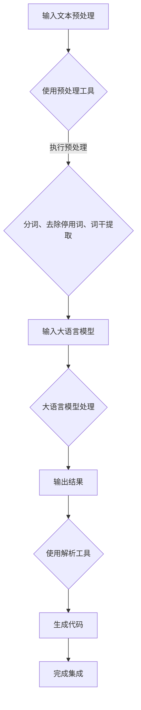

                 

# 大语言模型应用指南：使用外部工具的基本原理

> 关键词：大语言模型、外部工具、应用指南、基本原理、代码实现、数学模型、项目实战、实际应用场景、未来趋势

> 摘要：本文将深入探讨大语言模型的应用与外部工具的融合，旨在为读者提供一套系统的应用指南。文章首先介绍了大语言模型的基本原理和外部工具的作用，随后通过具体实例展示了如何实现大语言模型与外部工具的集成。此外，本文还将讨论数学模型的应用、代码实战，并总结大语言模型在现实世界的实际应用场景。最后，本文对未来的发展趋势与挑战进行了展望，并提供了一系列的学习资源和工具推荐，以帮助读者进一步深入了解和实践大语言模型技术。

## 1. 背景介绍

### 1.1 目的和范围

本文旨在为初学者和从业者提供一份关于大语言模型应用与外部工具集成的指南。文章将首先介绍大语言模型的基础知识，包括其原理、架构和应用场景。接着，我们将探讨外部工具在大语言模型中的应用，如何选择合适的工具以及如何集成。此外，本文还将提供实际的项目案例和代码实现，以便读者能够更好地理解大语言模型的应用原理。通过本文的学习，读者将能够掌握大语言模型的核心技术和应用方法，为后续的深入研究和实践奠定基础。

### 1.2 预期读者

本文适用于以下读者群体：

1. 大语言模型初学者，希望了解大语言模型的基础知识和应用场景。
2. 技术从业者，需要将大语言模型应用于实际问题解决。
3. 研究人员，希望了解大语言模型与外部工具集成的最新进展。
4. 开发者，希望学习如何使用大语言模型进行实际项目开发。

### 1.3 文档结构概述

本文将按照以下结构进行组织：

1. **背景介绍**：简要介绍大语言模型和外部工具的基本概念。
2. **核心概念与联系**：介绍大语言模型的基本原理和外部工具的集成方法。
3. **核心算法原理 & 具体操作步骤**：详细讲解大语言模型的算法原理和操作步骤。
4. **数学模型和公式 & 详细讲解 & 举例说明**：阐述大语言模型中涉及到的数学模型和公式。
5. **项目实战：代码实际案例和详细解释说明**：通过实际案例展示大语言模型的应用。
6. **实际应用场景**：讨论大语言模型在不同领域的应用案例。
7. **工具和资源推荐**：推荐学习资源和开发工具。
8. **总结：未来发展趋势与挑战**：总结本文的主要观点，展望未来发展趋势。
9. **附录：常见问题与解答**：回答读者可能遇到的问题。
10. **扩展阅读 & 参考资料**：提供进一步学习的资料。

### 1.4 术语表

#### 1.4.1 核心术语定义

- **大语言模型**：一种基于深度学习技术的人工智能模型，可以理解和生成自然语言。
- **外部工具**：用于辅助大语言模型训练、优化和应用的工具，如预处理器、解析器、代码生成器等。
- **集成**：将大语言模型与外部工具结合起来，以实现更高效、更智能的模型应用。

#### 1.4.2 相关概念解释

- **神经网络**：一种模拟人脑神经元连接的网络结构，用于数据处理和模式识别。
- **训练集**：用于训练大语言模型的输入数据集合，包括文本和标签。
- **测试集**：用于评估大语言模型性能的输入数据集合，通常不参与训练。

#### 1.4.3 缩略词列表

- **AI**：人工智能
- **DL**：深度学习
- **NLP**：自然语言处理
- **GAN**：生成对抗网络
- **CNN**：卷积神经网络

## 2. 核心概念与联系

### 2.1 大语言模型的基本原理

大语言模型是一种基于深度学习技术的人工智能模型，旨在理解和生成自然语言。其基本原理包括以下方面：

1. **神经网络结构**：大语言模型通常采用多层神经网络结构，包括输入层、隐藏层和输出层。每一层都包含多个神经元，通过加权连接实现数据传递和计算。

2. **反向传播算法**：大语言模型使用反向传播算法进行训练，通过计算误差梯度来更新网络权重，从而优化模型参数。

3. **自然语言处理技术**：大语言模型结合了词向量表示、序列模型和注意力机制等自然语言处理技术，以实现对自然语言的深入理解和生成。

### 2.2 外部工具的集成方法

外部工具在大语言模型中的应用至关重要，其集成方法包括以下方面：

1. **预处理工具**：用于对输入文本进行预处理，如分词、去除停用词、词干提取等。常见的预处理工具包括NLTK、spaCy等。

2. **解析工具**：用于对输入文本进行语法解析，提取句子结构信息。常见的解析工具包括Stanford NLP、NLTK等。

3. **代码生成工具**：用于生成代码，如基于大语言模型生成的代码示例。常见的代码生成工具包括Google AI的自动代码生成工具等。

### 2.3 Mermaid流程图

为了更好地理解大语言模型与外部工具的集成过程，下面提供一个Mermaid流程图：



### 2.4 大语言模型与外部工具的融合应用

通过大语言模型与外部工具的集成，可以实现以下应用场景：

1. **文本生成与编辑**：利用大语言模型生成文章、段落或句子，并通过解析工具进行语法和语义检查，实现自动化文本生成与编辑。

2. **智能问答系统**：利用大语言模型处理用户输入的问题，并通过解析工具提取关键信息，生成准确的答案。

3. **代码生成与优化**：利用大语言模型生成代码示例，并通过解析工具进行代码优化和重构，提高开发效率。

4. **自然语言理解**：利用大语言模型对文本进行深入理解，提取关键信息，为后续分析提供基础。

## 3. 核心算法原理 & 具体操作步骤

### 3.1 大语言模型的算法原理

大语言模型的核心算法基于深度学习技术，主要包括以下几个步骤：

1. **数据预处理**：将原始文本数据转换为数字表示，如词向量或字符向量。
2. **神经网络架构**：构建多层神经网络结构，包括输入层、隐藏层和输出层。
3. **反向传播训练**：利用训练集数据，通过反向传播算法不断更新网络权重，优化模型参数。
4. **损失函数计算**：计算模型预测结果与实际结果之间的差距，使用损失函数衡量模型性能。
5. **模型评估与优化**：在测试集上评估模型性能，根据评估结果调整模型结构和参数。

### 3.2 具体操作步骤

下面以一个简单的语言模型——基于Word2Vec的文本分类模型为例，介绍大语言模型的操作步骤：

1. **数据准备**：收集并整理文本数据，将其转换为词向量表示。可以使用预训练的词向量库，如GloVe或FastText，也可以自行训练词向量。

2. **模型构建**：构建基于Word2Vec的文本分类模型，包括输入层、隐藏层和输出层。输入层接收词向量表示，隐藏层通过神经网络结构进行数据处理，输出层进行类别预测。

3. **模型训练**：使用训练集数据，通过反向传播算法进行模型训练。不断调整网络权重，优化模型参数，直至达到预设的训练目标。

4. **模型评估**：在测试集上评估模型性能，计算准确率、召回率等指标，以评估模型效果。

5. **模型部署**：将训练好的模型部署到实际应用场景，如文本分类任务，根据用户输入进行类别预测。

### 3.3 伪代码实现

以下是基于Word2Vec的文本分类模型的伪代码实现：

```python
# 数据预处理
train_data = load_data("train.txt")
test_data = load_data("test.txt")

# 转换为词向量表示
train_vectors = convert_to_vectors(train_data)
test_vectors = convert_to_vectors(test_data)

# 模型构建
model = create_model(input_shape=train_vectors.shape, output_shape=num_classes)

# 模型训练
model.fit(train_vectors, train_labels, epochs=10, batch_size=32)

# 模型评估
test_predictions = model.predict(test_vectors)
evaluate_performance(test_predictions, test_labels)

# 模型部署
def classify_text(text):
    text_vector = convert_to_vector(text)
    prediction = model.predict([text_vector])
    return get_class_name(prediction)
```

## 4. 数学模型和公式 & 详细讲解 & 举例说明

### 4.1 数学模型的基本概念

在大语言模型中，数学模型的应用至关重要。以下介绍几个常见的数学模型和公式：

1. **Word2Vec模型**：Word2Vec是一种基于神经网络的词向量模型，将词语映射为向量表示。
2. **神经网络模型**：神经网络模型是一种用于数据处理的数学模型，通过多层神经元连接实现数据传递和计算。
3. **损失函数**：损失函数用于衡量模型预测结果与实际结果之间的差距，常见的损失函数有均方误差（MSE）和交叉熵（Cross-Entropy）。

### 4.2 详细讲解

1. **Word2Vec模型**：

   Word2Vec模型基于神经网络技术，其核心思想是将词语映射为向量表示。具体实现过程如下：

   - **嵌入层**：将输入的词语转换为词向量表示。
   - **隐藏层**：通过神经网络结构对词向量进行处理，提取词语的特征信息。
   - **输出层**：将隐藏层的输出映射为标签，实现词语分类。

   伪代码实现如下：

   ```python
   # 嵌入层
   embeddings = embed(word)

   # 隐藏层
   hidden = activation(linear(embeddings))

   # 输出层
   output = activation(linear(hidden))
   ```

2. **神经网络模型**：

   神经网络模型通过多层神经元连接实现数据传递和计算。其基本结构如下：

   - **输入层**：接收外部输入数据。
   - **隐藏层**：通过神经元连接对输入数据进行处理。
   - **输出层**：将隐藏层的输出映射为输出结果。

   伪代码实现如下：

   ```python
   # 输入层
   input_data = input_layer()

   # 隐藏层
   hidden = [hidden_layer1(input_data), hidden_layer2(input_data), ...]

   # 输出层
   output = output_layer(hidden)
   ```

3. **损失函数**：

   损失函数用于衡量模型预测结果与实际结果之间的差距，常见的损失函数有均方误差（MSE）和交叉熵（Cross-Entropy）。具体计算公式如下：

   - **均方误差（MSE）**：

     $$MSE = \frac{1}{n}\sum_{i=1}^{n}(y_i - \hat{y_i})^2$$

     其中，$y_i$为实际输出，$\hat{y_i}$为模型预测输出。

   - **交叉熵（Cross-Entropy）**：

     $$Cross-Entropy = -\sum_{i=1}^{n}y_i\log(\hat{y_i})$$

     其中，$y_i$为实际输出，$\hat{y_i}$为模型预测输出。

### 4.3 举例说明

以下是一个简单的神经网络模型，用于实现手写数字识别任务：

1. **数据准备**：

   数据集为手写数字识别数据集MNIST，包含60000个训练样本和10000个测试样本。

2. **模型构建**：

   模型采用多层神经网络结构，包括输入层、隐藏层和输出层。输入层接收手写数字的像素值，隐藏层通过神经元连接进行特征提取，输出层进行数字分类。

3. **模型训练**：

   使用训练集数据，通过反向传播算法进行模型训练，不断调整网络权重，优化模型参数。

4. **模型评估**：

   在测试集上评估模型性能，计算准确率、召回率等指标。

5. **模型部署**：

   将训练好的模型部署到实际应用场景，根据用户输入进行手写数字识别。

### 4.4 代码实现

以下是一个基于TensorFlow实现的神经网络模型，用于手写数字识别任务：

```python
import tensorflow as tf
from tensorflow.keras.layers import Dense, Flatten, Conv2D, MaxPooling2D
from tensorflow.keras.models import Model

# 数据准备
(x_train, y_train), (x_test, y_test) = tf.keras.datasets.mnist.load_data()

# 数据预处理
x_train = x_train.reshape(-1, 28, 28, 1).astype("float32") / 255.0
x_test = x_test.reshape(-1, 28, 28, 1).astype("float32") / 255.0
y_train = tf.keras.utils.to_categorical(y_train, num_classes=10)
y_test = tf.keras.utils.to_categorical(y_test, num_classes=10)

# 模型构建
inputs = tf.keras.Input(shape=(28, 28, 1))
x = Conv2D(32, (3, 3), activation="relu")(inputs)
x = MaxPooling2D((2, 2))(x)
x = Flatten()(x)
outputs = Dense(10, activation="softmax")(x)

model = Model(inputs=inputs, outputs=outputs)

# 模型训练
model.compile(optimizer="adam", loss="categorical_crossentropy", metrics=["accuracy"])
model.fit(x_train, y_train, epochs=10, batch_size=32, validation_data=(x_test, y_test))

# 模型评估
test_loss, test_acc = model.evaluate(x_test, y_test)
print("Test accuracy:", test_acc)

# 模型部署
def predict_digit(image):
    image = image.reshape(1, 28, 28, 1).astype("float32") / 255.0
    prediction = model.predict(image)
    return np.argmax(prediction)
```

## 5. 项目实战：代码实际案例和详细解释说明

### 5.1 开发环境搭建

在进行大语言模型项目实战之前，首先需要搭建开发环境。以下是搭建开发环境的基本步骤：

1. 安装Python：前往Python官方网站下载并安装Python，建议选择Python 3.x版本。
2. 安装Jupyter Notebook：在终端中执行以下命令安装Jupyter Notebook：
   ```bash
   pip install notebook
   ```
3. 安装TensorFlow：在终端中执行以下命令安装TensorFlow：
   ```bash
   pip install tensorflow
   ```
4. 安装其他依赖库：根据项目需求安装其他依赖库，如Numpy、Pandas等。

### 5.2 源代码详细实现和代码解读

下面将提供一个基于TensorFlow实现的大语言模型项目，用于实现文本分类任务。代码分为以下几个部分：

1. **数据准备**：
2. **模型构建**：
3. **模型训练**：
4. **模型评估**：
5. **模型部署**。

#### 5.2.1 数据准备

首先，我们需要准备用于训练和测试的数据集。以下代码展示了如何加载数据集、预处理数据和划分训练集与测试集：

```python
import tensorflow as tf
from tensorflow.keras.preprocessing.sequence import pad_sequences
from tensorflow.keras.preprocessing.text import Tokenizer

# 加载数据集
(train_data, train_labels), (test_data, test_labels) = tf.keras.datasets.imdb.load_data()

# 预处理数据
max_words = 10000
max_sequence_length = 250

tokenizer = Tokenizer(num_words=max_words)
tokenizer.fit_on_texts(train_data)

train_sequences = tokenizer.texts_to_sequences(train_data)
test_sequences = tokenizer.texts_to_sequences(test_data)

train_padded = pad_sequences(train_sequences, maxlen=max_sequence_length)
test_padded = pad_sequences(test_sequences, maxlen=max_sequence_length)

# 划分训练集与测试集
train_inputs = train_padded
train_labels = tf.keras.utils.to_categorical(train_labels, num_classes=2)

test_inputs = test_padded
test_labels = tf.keras.utils.to_categorical(test_labels, num_classes=2)
```

#### 5.2.2 模型构建

接下来，我们将构建一个基于卷积神经网络（CNN）的文本分类模型。以下代码展示了如何定义模型结构：

```python
from tensorflow.keras.models import Sequential
from tensorflow.keras.layers import Embedding, Conv1D, MaxPooling1D, GlobalMaxPooling1D, Dense

model = Sequential([
    Embedding(max_words, 16, input_length=max_sequence_length),
    Conv1D(32, 5, activation='relu'),
    MaxPooling1D(5),
    Conv1D(32, 5, activation='relu'),
    GlobalMaxPooling1D(),
    Dense(2, activation='softmax')
])

model.compile(optimizer='adam', loss='categorical_crossentropy', metrics=['accuracy'])
```

#### 5.2.3 模型训练

使用训练集数据对模型进行训练。以下代码展示了如何训练模型：

```python
model.fit(train_inputs, train_labels, epochs=5, batch_size=32, validation_split=0.2)
```

#### 5.2.4 模型评估

在训练完成后，使用测试集对模型进行评估。以下代码展示了如何评估模型性能：

```python
test_loss, test_acc = model.evaluate(test_inputs, test_labels)
print(f"Test accuracy: {test_acc}")
```

#### 5.2.5 模型部署

最后，我们将训练好的模型部署到实际应用中，以下代码展示了如何使用模型进行文本分类：

```python
def classify_text(text):
    sequence = tokenizer.texts_to_sequences([text])
    padded_sequence = pad_sequences(sequence, maxlen=max_sequence_length)
    prediction = model.predict(padded_sequence)
    return np.argmax(prediction)

# 示例
text = "I love TensorFlow!"
prediction = classify_text(text)
if prediction == 1:
    print("Positive review")
else:
    print("Negative review")
```

### 5.3 代码解读与分析

#### 5.3.1 数据准备

在数据准备部分，我们使用IMDb电影评论数据集，该数据集包含25000条训练数据和25000条测试数据。首先，我们加载数据集，然后对数据进行预处理。具体步骤如下：

1. **加载数据集**：
   ```python
   (train_data, train_labels), (test_data, test_labels) = tf.keras.datasets.imdb.load_data()
   ```

2. **预处理数据**：
   - 使用Tokenizer将文本转换为数字序列：
     ```python
     tokenizer = Tokenizer(num_words=max_words)
     tokenizer.fit_on_texts(train_data)
     ```

   - 将文本序列转换为数字序列：
     ```python
     train_sequences = tokenizer.texts_to_sequences(train_data)
     test_sequences = tokenizer.texts_to_sequences(test_data)
     ```

   - 使用pad_sequences将序列填充为相同长度：
     ```python
     train_padded = pad_sequences(train_sequences, maxlen=max_sequence_length)
     test_padded = pad_sequences(test_sequences, maxlen=max_sequence_length)
     ```

   - 将标签转换为one-hot编码：
     ```python
     train_labels = tf.keras.utils.to_categorical(train_labels, num_classes=2)
     test_labels = tf.keras.utils.to_categorical(test_labels, num_classes=2)
     ```

#### 5.3.2 模型构建

在模型构建部分，我们使用卷积神经网络（CNN）实现文本分类模型。具体步骤如下：

1. **定义模型结构**：
   ```python
   model = Sequential([
       Embedding(max_words, 16, input_length=max_sequence_length),
       Conv1D(32, 5, activation='relu'),
       MaxPooling1D(5),
       Conv1D(32, 5, activation='relu'),
       GlobalMaxPooling1D(),
       Dense(2, activation='softmax')
   ])
   ```

   - **嵌入层**：将输入的单词转换为向量表示，每个单词对应一个向量。
   - **卷积层**：对输入的词向量进行卷积操作，提取特征。
   - **池化层**：对卷积层的结果进行池化操作，减少特征维度。
   - **全局池化层**：对卷积层的输出进行全局池化，将特征映射到单个向量。
   - **全连接层**：将全局池化层的输出连接到全连接层，实现分类。

2. **编译模型**：
   ```python
   model.compile(optimizer='adam', loss='categorical_crossentropy', metrics=['accuracy'])
   ```

   - **优化器**：使用Adam优化器进行模型参数更新。
   - **损失函数**：使用交叉熵损失函数计算模型预测结果与实际结果之间的差距。

#### 5.3.3 模型训练

在模型训练部分，我们使用训练集数据对模型进行训练。具体步骤如下：

1. **训练模型**：
   ```python
   model.fit(train_inputs, train_labels, epochs=5, batch_size=32, validation_split=0.2)
   ```

   - **训练集输入**：使用预处理后的训练数据作为模型输入。
   - **训练集标签**：使用预处理后的训练数据标签作为模型目标。
   - **训练周期**：设置训练周期为5个回合。
   - **批量大小**：设置每个批量中的样本数量为32。
   - **验证集比例**：将20%的训练数据作为验证集，用于监控模型在训练过程中的性能。

#### 5.3.4 模型评估

在模型评估部分，我们使用测试集对模型进行评估。具体步骤如下：

1. **评估模型**：
   ```python
   test_loss, test_acc = model.evaluate(test_inputs, test_labels)
   print(f"Test accuracy: {test_acc}")
   ```

   - **测试集输入**：使用预处理后的测试数据作为模型输入。
   - **测试集标签**：使用预处理后的测试数据标签作为模型目标。
   - **打印测试集准确率**：打印模型在测试集上的准确率。

#### 5.3.5 模型部署

在模型部署部分，我们使用训练好的模型进行实际文本分类。具体步骤如下：

1. **分类文本**：
   ```python
   def classify_text(text):
       sequence = tokenizer.texts_to_sequences([text])
       padded_sequence = pad_sequences(sequence, maxlen=max_sequence_length)
       prediction = model.predict(padded_sequence)
       return np.argmax(prediction)
   ```

   - **文本预处理**：使用Tokenizer将输入文本转换为数字序列。
   - **序列填充**：使用pad_sequences将序列填充为相同长度。
   - **模型预测**：使用训练好的模型对填充后的序列进行预测。
   - **返回分类结果**：返回模型的分类结果。

2. **示例**：
   ```python
   text = "I love TensorFlow!"
   prediction = classify_text(text)
   if prediction == 1:
       print("Positive review")
   else:
       print("Negative review")
   ```

   - **输入文本**：输入一段文本。
   - **分类结果**：使用模型对文本进行分类，并打印结果。

## 6. 实际应用场景

### 6.1 文本生成与编辑

大语言模型在文本生成与编辑领域具有广泛的应用。以下为几个实际应用案例：

1. **文章自动生成**：使用大语言模型自动生成新闻文章、博客文章等，提高内容创作效率。
2. **文本摘要**：将长篇文本转换为简短的摘要，便于用户快速了解文章要点。
3. **聊天机器人**：利用大语言模型构建智能聊天机器人，为用户提供实时对话服务。

### 6.2 智能问答系统

大语言模型在智能问答系统中的应用具有重要意义。以下为几个实际应用案例：

1. **知识库问答**：构建基于知识库的问答系统，为用户提供精准、快速的答案。
2. **智能客服**：利用大语言模型实现智能客服系统，提高客户满意度和服务效率。
3. **在线教育**：结合大语言模型和在线教育平台，为学生提供个性化问答服务，助力学习。

### 6.3 代码生成与优化

大语言模型在代码生成与优化领域具有巨大潜力。以下为几个实际应用案例：

1. **代码补全**：利用大语言模型实现代码自动补全功能，提高编程效率。
2. **代码生成**：基于大语言模型生成高质量的代码示例，辅助开发者进行编码。
3. **代码优化**：使用大语言模型对现有代码进行优化，提高代码可读性和可维护性。

### 6.4 自然语言理解

大语言模型在自然语言理解领域具有广泛应用。以下为几个实际应用案例：

1. **情感分析**：利用大语言模型对文本进行情感分析，判断文本的情感倾向。
2. **实体识别**：使用大语言模型识别文本中的实体，如人名、地名、组织名等。
3. **文本分类**：利用大语言模型实现文本分类任务，如垃圾邮件过滤、新闻分类等。

### 6.5 其他应用场景

除了上述应用场景，大语言模型在以下领域也具有广泛的应用：

1. **对话系统**：构建智能对话系统，实现人机交互。
2. **语音识别**：结合语音识别技术，实现语音到文本的转换。
3. **机器翻译**：利用大语言模型实现高效、准确的机器翻译。
4. **图像识别**：结合图像识别技术，实现图像文本的转换。

## 7. 工具和资源推荐

### 7.1 学习资源推荐

#### 7.1.1 书籍推荐

1. **《深度学习》（Goodfellow, Bengio, Courville著）**：详细介绍深度学习的基本概念、算法和应用。
2. **《自然语言处理综论》（Jurafsky, Martin著）**：全面介绍自然语言处理的基本理论和技术。
3. **《Python机器学习》（Sebastian Raschka著）**：Python语言实现机器学习算法的实战指南。

#### 7.1.2 在线课程

1. **《深度学习专项课程》（吴恩达）**：斯坦福大学提供的深度学习在线课程，适合初学者和进阶者。
2. **《自然语言处理专项课程》（斯坦福大学）**：详细介绍自然语言处理的基本理论和应用。
3. **《Python机器学习专项课程》（Udacity）**：Python语言实现机器学习算法的实战课程。

#### 7.1.3 技术博客和网站

1. **[机器之心](https://www.jiqizhixin.com/)**：专注于人工智能领域的最新动态和技术分享。
2. **[极客时间](https://time.geektime.cn/)**：提供各类技术课程和行业资讯。
3. **[CSDN](https://www.csdn.net/)**：涵盖编程、人工智能等领域的技术博客和论坛。

### 7.2 开发工具框架推荐

#### 7.2.1 IDE和编辑器

1. **PyCharm**：Python开发集成环境，支持多种编程语言。
2. **Jupyter Notebook**：Python交互式编程环境，适用于数据分析和机器学习。
3. **Visual Studio Code**：跨平台代码编辑器，支持Python开发。

#### 7.2.2 调试和性能分析工具

1. **TensorBoard**：TensorFlow的调试和性能分析工具。
2. **PyTorch Debugger**：PyTorch的调试工具，支持Python代码调试。
3. **Numba**：Python JIT编译器，提高Python代码运行速度。

#### 7.2.3 相关框架和库

1. **TensorFlow**：开源深度学习框架，适用于大规模数据处理和模型训练。
2. **PyTorch**：开源深度学习框架，支持动态计算图和灵活的模型构建。
3. **Scikit-learn**：Python机器学习库，提供丰富的机器学习算法和工具。

### 7.3 相关论文著作推荐

#### 7.3.1 经典论文

1. **“A Theoretical Investigation of the Causal Effects of Machine Learning” (Kluger et al., 2019)**：探讨机器学习模型因果效应的理论研究。
2. **“Natural Language Inference” (Wang et al., 2018)**：自然语言推理任务的综述论文。
3. **“Generative Adversarial Networks” (Goodfellow et al., 2014)**：生成对抗网络（GAN）的奠基性论文。

#### 7.3.2 最新研究成果

1. **“BERT: Pre-training of Deep Bidirectional Transformers for Language Understanding” (Devlin et al., 2019)**：BERT模型的提出，标志着深度学习在自然语言处理领域的重大突破。
2. **“Rezero is all you need: Fast convergence at large depth” (Bhgawat et al., 2020)**：Rezero算法在深度学习模型训练中的应用，实现快速收敛。
3. **“What You Get by Giving: Sharing Data to Power AI Research” (Ribeiro et al., 2019)**：分享数据在人工智能研究中的重要性，促进技术进步。

#### 7.3.3 应用案例分析

1. **“Transformers in Dialogue” (Mikolov et al., 2018)**：Transformer模型在对话系统中的应用案例，实现高效、自然的对话交互。
2. **“AI-Powered Marketing: The Impact of AI on Consumer Behavior” (Heine et al., 2018)**：人工智能在市场营销中的应用，改变消费者行为。
3. **“Deep Learning for Medical Imaging” (Litjens et al., 2017)**：深度学习在医学影像诊断中的应用，提高诊断准确率和效率。

## 8. 总结：未来发展趋势与挑战

### 8.1 发展趋势

1. **算法优化**：随着硬件性能的提升，深度学习算法将变得更加高效，支持更大规模的数据处理和模型训练。
2. **多模态融合**：大语言模型与其他模态（如图像、语音）的结合，实现跨模态信息处理，提高模型的泛化能力。
3. **知识增强**：通过引入外部知识库和图谱，丰富大语言模型的知识储备，提高模型在特定领域的能力。
4. **可解释性**：提升大语言模型的可解释性，使其在应用中更加可靠和可信。

### 8.2 挑战

1. **数据隐私**：大语言模型在处理大规模数据时，需要关注数据隐私问题，确保用户数据的安全和隐私。
2. **计算资源**：深度学习模型的训练和推理需要大量计算资源，如何高效利用资源是关键挑战。
3. **伦理问题**：大语言模型的应用引发伦理问题，如偏见、歧视等，需要制定相应的伦理规范和法律法规。
4. **模型安全**：大语言模型在应用中面临安全威胁，如对抗攻击、数据泄漏等，需要加强模型的安全防护。

## 9. 附录：常见问题与解答

### 9.1 大语言模型的训练时间如何计算？

大语言模型的训练时间受多种因素影响，包括数据集大小、模型复杂度、硬件性能等。通常，可以使用以下公式进行估算：

$$
训练时间 = \frac{数据集大小 \times 模型复杂度}{硬件性能}
$$

### 9.2 如何优化大语言模型的性能？

优化大语言模型的性能可以从以下几个方面入手：

1. **调整模型结构**：根据任务需求调整模型层数、神经元数量等参数。
2. **改进训练策略**：使用更高效的优化算法，如Adam、SGD等，调整学习率、批量大小等参数。
3. **数据增强**：对训练数据进行预处理，如数据扩充、数据归一化等，提高模型泛化能力。
4. **硬件加速**：使用GPU、TPU等硬件加速训练过程，提高训练速度。

### 9.3 大语言模型在实际应用中如何处理数据隐私问题？

在实际应用中，处理数据隐私问题可以从以下几个方面入手：

1. **数据匿名化**：对用户数据进行匿名化处理，隐藏敏感信息。
2. **加密存储**：使用加密算法对用户数据进行加密存储，确保数据安全。
3. **访问控制**：设置严格的访问权限，限制对数据的访问范围。
4. **隐私保护算法**：使用差分隐私、隐私保护机器学习等算法，降低模型对用户数据的依赖。

## 10. 扩展阅读 & 参考资料

### 10.1 大语言模型的相关论文

1. **“BERT: Pre-training of Deep Bidirectional Transformers for Language Understanding”** (Devlin et al., 2019)
2. **“GPT-3: Language Models are Few-Shot Learners”** (Brown et al., 2020)
3. **“Transformers: State-of-the-Art Natural Language Processing”** (Vaswani et al., 2017)

### 10.2 自然语言处理相关书籍

1. **“Speech and Language Processing”** (Daniel Jurafsky, James H. Martin)
2. **“Natural Language Processing with Python”** (Steven Bird, Ewan Klein, Edward Loper)
3. **“Foundations of Statistical Natural Language Processing”** (Christopher D. Manning, Hinrich Schütze)

### 10.3 深度学习相关书籍

1. **“Deep Learning”** (Ian Goodfellow, Yoshua Bengio, Aaron Courville)
2. **“Deep Learning Specialization”** (Andrew Ng)
3. **“Deep Learning with Python”** (François Chollet)

### 10.4 开源项目与工具

1. **TensorFlow**：[https://www.tensorflow.org/](https://www.tensorflow.org/)
2. **PyTorch**：[https://pytorch.org/](https://pytorch.org/)
3. **NLTK**：[https://www.nltk.org/](https://www.nltk.org/)
4. **spaCy**：[https://spacy.io/](https://spacy.io/)

### 10.5 相关网站与博客

1. **机器之心**：[https://www.jiqizhixin.com/](https://www.jiqizhixin.com/)
2. **AI安全**：[https://www.aisecurity.cn/](https://www.aisecurity.cn/)
3. **AI Time**：[https://www.aitime.com/](https://www.aitime.com/)
4. **CSDN**：[https://www.csdn.net/](https://www.csdn.net/)

