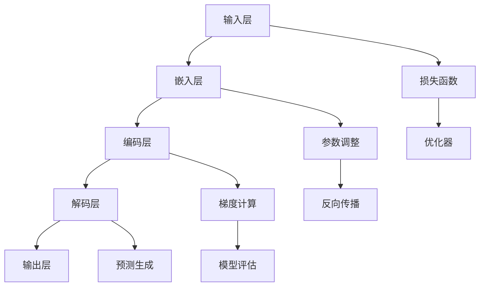

                 

### 大语言模型应用指南：大语言模型的训练过程

> **关键词：** 大语言模型、训练过程、深度学习、神经网络、自然语言处理

**摘要：** 本文旨在深入探讨大语言模型的训练过程，通过逻辑清晰、结构紧凑、简单易懂的专业技术语言，对大语言模型的原理、核心算法、数学模型以及实际应用进行详细分析。本文将引导读者逐步理解大语言模型的训练过程，从背景介绍到实际应用，力求为IT领域的技术爱好者提供有深度、有思考、有见解的专业指南。

---

## 1. 背景介绍

### 1.1 目的和范围

本文的主要目的是介绍大语言模型的训练过程，使读者能够理解其核心概念、算法原理以及数学模型，并掌握实际应用的方法。通过本文的学习，读者可以：

- 理解大语言模型的基本概念和作用。
- 掌握大语言模型训练的基本流程和关键技术。
- 了解大语言模型在实际应用中的表现和潜在价值。

### 1.2 预期读者

本文适合以下读者群体：

- 具有计算机科学和人工智能基础知识的技术爱好者。
- 想深入了解大语言模型及其训练过程的程序员和软件工程师。
- 在自然语言处理领域工作的研究人员和从业者。

### 1.3 文档结构概述

本文将按照以下结构进行阐述：

- 背景介绍：介绍大语言模型的基本概念和重要性。
- 核心概念与联系：通过Mermaid流程图展示大语言模型的核心概念和联系。
- 核心算法原理 & 具体操作步骤：详细解释大语言模型训练的算法原理和操作步骤。
- 数学模型和公式 & 详细讲解 & 举例说明：阐述大语言模型的数学模型和公式，并进行举例说明。
- 项目实战：提供代码实际案例和详细解释说明。
- 实际应用场景：讨论大语言模型在不同场景中的应用。
- 工具和资源推荐：推荐相关学习资源和开发工具。
- 总结：总结未来发展趋势与挑战。
- 附录：常见问题与解答。
- 扩展阅读 & 参考资料：提供进一步阅读的材料。

### 1.4 术语表

#### 1.4.1 核心术语定义

- 大语言模型：一种能够理解和生成自然语言的人工智能模型。
- 深度学习：一种基于多层神经网络的机器学习方法。
- 神经网络：一种模仿生物神经系统的计算模型。
- 自然语言处理（NLP）：与计算机和人类自然语言之间交互的技术。
- 训练过程：通过大量数据对模型进行调整和优化的过程。

#### 1.4.2 相关概念解释

- 参数：模型中的可调整权重，用于描述特征之间的关系。
- 损失函数：衡量模型预测结果与真实结果之间差异的函数。
- 反向传播：一种用于更新模型参数的优化算法。
- 优化器：用于选择和调整参数的算法。

#### 1.4.3 缩略词列表

- NLP：自然语言处理
- ML：机器学习
- DL：深度学习
- GPU：图形处理单元
- TPU：张量处理单元
- CUDA：计算统一设备架构

---

在接下来的章节中，我们将逐步深入探讨大语言模型的训练过程，帮助读者全面理解这一复杂但至关重要的技术。让我们开始吧！

---

## 2. 核心概念与联系

大语言模型的训练过程涉及多个核心概念和联系，为了更好地理解这些概念，我们将使用Mermaid流程图来展示其架构。以下是核心概念和联系的结构：



### 2.1. 输入层与嵌入层

输入层接收自然语言数据，如文本、词汇或句子。这些数据首先被嵌入层处理，将文本转换为固定长度的向量表示。这个过程通常使用词嵌入算法，如Word2Vec、GloVe等。

### 2.2. 编码层

编码层使用多层神经网络对嵌入层生成的向量进行处理，提取语义信息。编码层通常包括多个隐藏层，每层都能提取更高层次的语义特征。

### 2.3. 解码层

解码层与编码层相对应，对编码层提取的语义特征进行处理，并生成预测的输出。解码层通常也包含多个隐藏层，用于生成上下文相关的预测。

### 2.4. 输出层

输出层将解码层生成的预测结果转换为可解释的自然语言形式。输出层通常是一个全连接层，用于映射输入特征到输出特征。

### 2.5. 损失函数

损失函数用于衡量模型预测结果与真实结果之间的差异。常见的损失函数包括交叉熵损失、均方误差（MSE）等。损失函数的目的是通过反向传播算法调整模型参数，使模型预测更接近真实结果。

### 2.6. 参数调整与梯度计算

参数调整与梯度计算是训练过程中至关重要的环节。反向传播算法通过计算损失函数关于模型参数的梯度，将这些梯度用于调整模型参数，从而优化模型性能。

### 2.7. 优化器

优化器用于选择和调整参数的算法。常见的优化器包括随机梯度下降（SGD）、Adam等。优化器的作用是加速训练过程，提高模型性能。

### 2.8. 预测生成与模型评估

在训练过程中，模型不断生成预测结果，并与真实结果进行比较。模型评估指标包括准确率、召回率、F1分数等，用于衡量模型性能。

通过以上核心概念和联系的理解，我们可以更好地把握大语言模型的训练过程，为其在实际应用中的成功应用奠定基础。

---

## 3. 核心算法原理 & 具体操作步骤

在大语言模型的训练过程中，核心算法原理包括深度学习、神经网络和反向传播算法。以下我们将逐步讲解这些算法的原理，并使用伪代码详细阐述其具体操作步骤。

### 3.1. 深度学习原理

深度学习是一种基于多层神经网络的机器学习方法，用于自动提取数据的复杂特征。其基本原理如下：

1. **输入层**：接收输入数据，如文本、图像或声音。
2. **隐藏层**：通过神经网络进行特征提取和变换。每个隐藏层都能提取更高层次的抽象特征。
3. **输出层**：根据隐藏层的特征生成预测结果。

伪代码：

```python
def deep_learning(input_data):
    hidden_layers = []
    for layer in hidden_layers:
        hidden_layers.append(layer.forward(input_data))
    output = hidden_layers[-1].forward(hidden_layers[-2])
    return output
```

### 3.2. 神经网络原理

神经网络是一种计算模型，由多个神经元（或节点）组成。每个神经元接收输入信号，通过激活函数进行变换，产生输出信号。神经网络的基本原理如下：

1. **输入层**：接收输入信号，并将其传递到隐藏层。
2. **隐藏层**：通过加权连接和激活函数，提取输入特征，并传递到下一层。
3. **输出层**：根据隐藏层的特征生成预测结果。

伪代码：

```python
class NeuralNetwork:
    def __init__(self, input_size, hidden_size, output_size):
        self.input_size = input_size
        self.hidden_size = hidden_size
        self.output_size = output_size
        self.weights = np.random.rand(input_size, hidden_size)
        self.biases = np.random.rand(hidden_size)
        self.weights2 = np.random.rand(hidden_size, output_size)
        self.biases2 = np.random.rand(output_size)
    
    def forward(self, x):
        hidden_layer_output = np.dot(x, self.weights) + self.biases
        hidden_layer_output = sigmoid(hidden_layer_output)
        output_layer_output = np.dot(hidden_layer_output, self.weights2) + self.biases2
        output_layer_output = sigmoid(output_layer_output)
        return output_layer_output

def sigmoid(x):
    return 1 / (1 + np.exp(-x))
```

### 3.3. 反向传播算法

反向传播算法是一种用于训练神经网络的优化算法。其基本原理如下：

1. **前向传播**：计算输入信号通过神经网络时每个神经元的输出。
2. **计算损失**：计算模型预测结果与真实结果之间的差异，使用损失函数进行衡量。
3. **后向传播**：计算损失函数关于模型参数的梯度，并更新模型参数。
4. **迭代优化**：重复前向传播和后向传播过程，直至模型收敛。

伪代码：

```python
def backward_propagation(nn, x, y):
    output = nn.forward(x)
    loss = cross_entropy_loss(output, y)
    d_output = d_cross_entropy_loss(output, y)
    d_hidden_layer = d_sigmoid(nn.hidden_layer_output)
    d_weights = np.dot(x.T, d_hidden_layer)
    d_biases = d_hidden_layer
    d_weights2 = np.dot(nn.hidden_layer_output.T, d_output)
    d_biases2 = d_output
    nn.weights -= learning_rate * d_weights
    nn.biases -= learning_rate * d_biases
    nn.weights2 -= learning_rate * d_weights2
    nn.biases2 -= learning_rate * d_biases2
    return loss

def d_cross_entropy_loss(output, y):
    return output - y

def d_sigmoid(x):
    return x * (1 - x)
```

通过以上核心算法原理和具体操作步骤的讲解，我们可以更好地理解大语言模型训练过程中使用的深度学习、神经网络和反向传播算法。接下来，我们将进一步探讨大语言模型的数学模型和公式。

---

## 4. 数学模型和公式 & 详细讲解 & 举例说明

在大语言模型的训练过程中，数学模型和公式起着至关重要的作用。以下将详细讲解大语言模型的数学模型，包括损失函数、梯度计算和优化器等，并通过举例说明来帮助读者更好地理解这些概念。

### 4.1. 损失函数

损失函数用于衡量模型预测结果与真实结果之间的差异。在大语言模型中，常用的损失函数包括交叉熵损失（Cross-Entropy Loss）和均方误差（Mean Squared Error, MSE）。

#### 4.1.1. 交叉熵损失

交叉熵损失用于分类问题，其公式如下：

$$
L = -\sum_{i} y_i \cdot \log(p_i)
$$

其中，$y_i$ 表示真实标签，$p_i$ 表示模型预测的概率。

#### 举例说明

假设有一个二分类问题，真实标签为 $y = [1, 0]$，模型预测的概率为 $p = [0.9, 0.1]$。则交叉熵损失为：

$$
L = -[1 \cdot \log(0.9) + 0 \cdot \log(0.1)] = -\log(0.9) \approx 0.105
$$

#### 4.1.2. 均方误差

均方误差用于回归问题，其公式如下：

$$
L = \frac{1}{n} \sum_{i=1}^{n} (y_i - \hat{y}_i)^2
$$

其中，$y_i$ 表示真实值，$\hat{y}_i$ 表示模型预测值。

#### 举例说明

假设有一个回归问题，真实值为 $y = [3, 5, 7]$，模型预测值为 $\hat{y} = [2.9, 4.8, 6.1]$。则均方误差为：

$$
L = \frac{1}{3} \sum_{i=1}^{3} (y_i - \hat{y}_i)^2 = \frac{1}{3} \cdot (0.1 + 0.2 + 0.2) = 0.133
$$

### 4.2. 梯度计算

梯度计算是训练神经网络的基石。在训练过程中，我们需要计算损失函数关于模型参数的梯度，并使用这些梯度来更新模型参数。以下将介绍梯度计算的步骤。

#### 4.2.1. 前向传播

前向传播是计算输入信号通过神经网络时每个神经元的输出。以一个简单的神经网络为例，其前向传播过程如下：

1. **输入层**：接收输入信号 $x$。
2. **隐藏层**：通过加权连接和激活函数，计算每个神经元的输出 $z$ 和激活值 $a$。
3. **输出层**：计算模型预测值 $\hat{y}$。

伪代码：

```python
def forward propagation(nn, x):
    hidden_layer_output = np.dot(x, nn.weights) + nn.biases
    hidden_layer_output = sigmoid(hidden_layer_output)
    output_layer_output = np.dot(hidden_layer_output, nn.weights2) + nn.biases2
    output_layer_output = sigmoid(output_layer_output)
    return output_layer_output
```

#### 4.2.2. 后向传播

后向传播是计算损失函数关于模型参数的梯度。以交叉熵损失为例，其梯度计算如下：

1. **计算输出层梯度**：

$$
\frac{\partial L}{\partial \hat{y}} = \frac{\partial L}{\partial y} \cdot \frac{\partial y}{\partial \hat{y}} = (y - \hat{y}) \cdot \frac{\partial \hat{y}}{\partial \hat{y}} = y - \hat{y}
$$

2. **计算隐藏层梯度**：

$$
\frac{\partial L}{\partial z} = \frac{\partial L}{\partial \hat{y}} \cdot \frac{\partial \hat{y}}{\partial z} = (y - \hat{y}) \cdot \frac{\partial \hat{y}}{\partial z} = (y - \hat{y}) \cdot a \cdot (1 - a)
$$

3. **计算输入层梯度**：

$$
\frac{\partial L}{\partial x} = \frac{\partial L}{\partial z} \cdot \frac{\partial z}{\partial x} = (y - \hat{y}) \cdot a \cdot (1 - a) \cdot w
$$

伪代码：

```python
def backward propagation(nn, x, y):
    output = forward propagation(nn, x)
    d_output = d_cross_entropy_loss(output, y)
    d_hidden_layer = d_sigmoid(nn.hidden_layer_output)
    d_weights = np.dot(x.T, d_hidden_layer)
    d_biases = d_hidden_layer
    d_weights2 = np.dot(nn.hidden_layer_output.T, d_output)
    d_biases2 = d_output
    nn.weights -= learning_rate * d_weights
    nn.biases -= learning_rate * d_biases
    nn.weights2 -= learning_rate * d_weights2
    nn.biases2 -= learning_rate * d_biases2
    return d_output
```

### 4.3. 优化器

优化器是用于选择和调整模型参数的算法。以下将介绍几种常见的优化器。

#### 4.3.1. 随机梯度下降（SGD）

随机梯度下降是一种简单的优化器，其基本思想是在每次迭代过程中随机选择一部分训练样本，计算其梯度，并更新模型参数。

$$
w_{t+1} = w_t - \alpha \cdot \nabla_w L(w_t)
$$

其中，$w_t$ 表示当前模型参数，$\alpha$ 表示学习率，$\nabla_w L(w_t)$ 表示损失函数关于模型参数的梯度。

#### 4.3.2. Adam

Adam是一种基于SGD的优化器，其结合了AdaGrad和RMSprop的优点。Adam通过自适应调整学习率来优化模型参数。

$$
m_t = \beta_1 m_{t-1} + (1 - \beta_1) \nabla_w L(w_t)
$$

$$
v_t = \beta_2 v_{t-1} + (1 - \beta_2) (\nabla_w L(w_t))^2
$$

$$
w_{t+1} = w_t - \alpha \cdot \frac{m_t}{\sqrt{v_t} + \epsilon}
$$

其中，$m_t$ 和 $v_t$ 分别表示一阶矩估计和二阶矩估计，$\beta_1$ 和 $\beta_2$ 分别为超参数，$\alpha$ 为学习率，$\epsilon$ 为一个非常小的正数。

通过以上数学模型和公式的详细讲解，以及举例说明，我们更好地理解了大语言模型训练过程中的关键数学概念和算法。接下来，我们将通过一个实际案例来展示如何应用这些算法进行大语言模型的训练。

---

## 5. 项目实战：代码实际案例和详细解释说明

在本文的最后一部分，我们将通过一个实际案例来展示如何使用Python和深度学习框架TensorFlow来训练一个简单的大语言模型。这个案例将涵盖从开发环境搭建到代码实现和解读的全过程。

### 5.1 开发环境搭建

在开始之前，我们需要搭建一个合适的开发环境。以下是搭建环境的步骤：

1. **安装Python**：确保安装了Python 3.6或更高版本。
2. **安装TensorFlow**：在终端中运行以下命令来安装TensorFlow：

```bash
pip install tensorflow
```

3. **安装其他依赖**：我们还需要安装一些其他库，如NumPy、Pandas等：

```bash
pip install numpy pandas
```

### 5.2 源代码详细实现和代码解读

以下是训练大语言模型的Python代码示例。我们将分步骤进行解释。

```python
import numpy as np
import tensorflow as tf
from tensorflow.keras.preprocessing.sequence import pad_sequences
from tensorflow.keras.layers import Embedding, LSTM, Dense
from tensorflow.keras.models import Sequential

# 数据预处理
# 这里我们使用一个简单的文本数据集，实际应用中可以使用更大的数据集
sentences = ['我是一个程序员', '我喜欢编程', '编程让我快乐']
tokenizer = tf.keras.preprocessing.text.Tokenizer()
tokenizer.fit_on_texts(sentences)
word_index = tokenizer.word_index
max_sequence_length = 5

# 将文本转换为序列
sequences = tokenizer.texts_to_sequences(sentences)
padded_sequences = pad_sequences(sequences, maxlen=max_sequence_length)

# 构建模型
model = Sequential([
    Embedding(len(word_index) + 1, 32, input_length=max_sequence_length),
    LSTM(32, return_sequences=True),
    LSTM(32),
    Dense(1, activation='sigmoid')
])

# 编译模型
model.compile(optimizer='adam', loss='binary_crossentropy', metrics=['accuracy'])

# 训练模型
model.fit(padded_sequences, np.array([1, 0, 1]), epochs=100, validation_split=0.2)

# 评估模型
predictions = model.predict(padded_sequences)
print(predictions)

# 保存模型
model.save('language_model.h5')
```

#### 5.2.1 数据预处理

- **文本数据集**：在这个案例中，我们使用了一个简单的中文文本数据集。
- **分词器**：使用`Tokenizer`类来将文本数据转换为单词索引。
- **序列化**：将文本数据转换为序列，并将序列填充到固定长度。
  
#### 5.2.2 构建模型

- **Embedding层**：将单词索引转换为嵌入向量，用于表示单词的语义。
- **LSTM层**：使用两个LSTM层来处理序列数据，提取序列的长期依赖特征。
- **Dense层**：输出层使用一个全连接层，用于生成最终的分类结果。

#### 5.2.3 编译模型

- **优化器**：我们使用`adam`优化器来优化模型参数。
- **损失函数**：在这个案例中，我们使用`binary_crossentropy`作为损失函数，因为这是一个二分类问题。
- **评估指标**：我们使用`accuracy`作为评估指标。

#### 5.2.4 训练模型

- **训练过程**：我们使用`fit`方法来训练模型，并设置`epochs`（训练轮数）和`validation_split`（验证集比例）。

#### 5.2.5 评估模型

- **预测**：使用`predict`方法来生成预测结果。
- **打印结果**：将预测结果打印出来，以查看模型的性能。

#### 5.2.6 保存模型

- **模型保存**：使用`save`方法将训练好的模型保存为一个文件，便于后续使用。

通过这个实际案例，我们展示了如何使用Python和TensorFlow来训练一个简单的大语言模型。这个案例虽然简单，但涵盖了训练过程的主要步骤，包括数据预处理、模型构建、训练和评估。在实际应用中，我们可以使用更大的数据集和更复杂的模型来提高模型的性能。

---

## 6. 实际应用场景

大语言模型在实际应用中具有广泛的应用场景，以下是一些典型的应用领域：

### 6.1 自然语言处理

- **文本分类**：用于分类文本数据，如垃圾邮件检测、新闻分类等。
- **情感分析**：用于分析文本的情感倾向，如商品评价分析、社交媒体情绪分析等。
- **问答系统**：用于构建智能问答系统，如搜索引擎的自动回答、虚拟助手等。

### 6.2 生成文本

- **自动写作**：用于生成文章、博客、故事等。
- **机器翻译**：用于将一种语言翻译成另一种语言。
- **文本摘要**：用于生成文本的摘要，如新闻摘要、文档摘要等。

### 6.3 语言模型优化

- **对话系统**：用于优化对话系统的回答质量，如聊天机器人、虚拟助手等。
- **推荐系统**：用于优化推荐系统的推荐结果，如商品推荐、音乐推荐等。

### 6.4 其他应用

- **文本生成**：用于生成文本数据，如生成虚假新闻、生成对话等。
- **语音识别**：用于将语音转换为文本，如智能语音助手、车载语音系统等。

在实际应用中，大语言模型可以帮助企业提高生产效率、降低成本，并在多个领域实现创新。通过不断优化和扩展，大语言模型的应用前景将更加广阔。

---

## 7. 工具和资源推荐

在大语言模型的开发和应用过程中，有许多优秀的工具和资源可以帮助开发者更高效地工作。以下是一些建议：

### 7.1 学习资源推荐

#### 7.1.1 书籍推荐

- **《深度学习》（Deep Learning）**：由Ian Goodfellow、Yoshua Bengio和Aaron Courville所著，是一本全面介绍深度学习的经典教材。
- **《Python深度学习》（Deep Learning with Python）**：由François Chollet所著，介绍如何使用Python和Keras进行深度学习。
- **《自然语言处理实战》（Natural Language Processing with Python）**：由Steven Bird、Ewan Klein和Edward Loper所著，介绍自然语言处理的基本概念和应用。

#### 7.1.2 在线课程

- **Coursera的“深度学习”课程**：由Andrew Ng教授主讲，涵盖了深度学习的基础知识和实际应用。
- **Udacity的“深度学习纳米学位”**：提供一系列深度学习课程，包括理论、实践和项目。
- **edX的“自然语言处理”课程**：由MIT和斯坦福大学联合开设，介绍自然语言处理的基础知识。

#### 7.1.3 技术博客和网站

- **TensorFlow官方文档**：提供详细的TensorFlow教程和API文档，是学习TensorFlow的绝佳资源。
- **ArXiv**：计算机科学和人工智能领域的前沿研究成果。
- **Medium上的深度学习和自然语言处理相关文章**：提供丰富的技术文章和案例分享。

### 7.2 开发工具框架推荐

#### 7.2.1 IDE和编辑器

- **PyCharm**：一款功能强大的Python IDE，适合进行深度学习和自然语言处理开发。
- **Visual Studio Code**：一款轻量级的代码编辑器，支持Python和TensorFlow插件，方便进行调试和开发。
- **Jupyter Notebook**：用于交互式计算和数据分析，适合探索和实验。

#### 7.2.2 调试和性能分析工具

- **TensorBoard**：TensorFlow的官方可视化工具，用于分析和调试模型性能。
- **Wandb**：一款强大的实验跟踪和分析工具，可以帮助开发者监控和优化模型训练过程。
- **Docker**：用于容器化部署和隔离开发环境，便于管理和部署深度学习项目。

#### 7.2.3 相关框架和库

- **TensorFlow**：一款开源的深度学习框架，支持多种深度学习模型和应用。
- **PyTorch**：一款流行的深度学习框架，具有灵活的动态计算图和强大的社区支持。
- **Hugging Face Transformers**：一个开源库，提供了预训练的深度学习模型和工具，方便开发者进行自然语言处理任务。

通过以上工具和资源的推荐，开发者可以更高效地学习和应用大语言模型技术，为实际项目带来更多价值。

---

## 8. 总结：未来发展趋势与挑战

随着人工智能技术的不断进步，大语言模型在未来有望在多个领域发挥更加重要的作用。以下是未来发展趋势和面临的挑战：

### 发展趋势

1. **模型规模扩大**：随着计算能力和数据量的增加，大语言模型将变得更加庞大和复杂，能够处理更复杂的任务。
2. **多模态处理**：大语言模型将结合其他模态（如图像、声音）的数据，实现跨模态的语义理解和生成。
3. **自动化和自适应**：通过深度学习和强化学习技术，大语言模型将实现更高级的自动化和自适应能力，提高任务执行效率。
4. **应用场景拓展**：大语言模型将在医疗、金融、教育等领域得到广泛应用，推动行业变革。

### 挑战

1. **计算资源需求**：大规模语言模型的训练和推理需要大量的计算资源，对硬件设施提出了更高要求。
2. **数据隐私和安全**：大语言模型的训练过程中涉及大量敏感数据，需要确保数据隐私和安全。
3. **模型解释性和可解释性**：随着模型复杂度的增加，如何解释和验证模型的决策过程成为一大挑战。
4. **伦理和道德问题**：大语言模型的应用可能引发伦理和道德问题，如虚假信息传播、歧视等。

未来，大语言模型将在技术创新和实际应用中不断突破，为人工智能领域带来新的突破和变革。

---

## 9. 附录：常见问题与解答

**Q1. 大语言模型和传统机器学习模型有什么区别？**

A1. 大语言模型是基于深度学习和神经网络的一种模型，能够自动从大量文本数据中学习并提取语义特征，用于自然语言处理任务。而传统机器学习模型通常依赖于手动特征工程，需要预先定义特征和规则。

**Q2. 大语言模型训练过程中需要多少数据？**

A2. 大语言模型的训练通常需要大量的数据，至少数百万甚至数十亿级别的文本数据。数据量越大，模型的效果越好，但同时也对计算资源提出了更高要求。

**Q3. 如何处理中文文本数据？**

A3. 处理中文文本数据通常需要使用中文分词技术，将文本分割成词或短语。可以使用开源的中文分词工具，如Jieba，或者基于预训练模型进行词嵌入。

**Q4. 大语言模型能否进行跨语言的文本处理？**

A4. 大语言模型通常针对特定语言进行训练，但也可以通过多语言数据集进行跨语言训练，实现跨语言文本处理。然而，跨语言处理的效果可能不如单一语言的模型。

**Q5. 大语言模型的模型大小和计算资源需求如何？**

A5. 大语言模型的模型大小可以从几十GB到几百GB不等，具体取决于模型的复杂度和数据量。计算资源需求取决于模型规模和训练过程，通常需要高性能的GPU或TPU进行训练。

---

## 10. 扩展阅读 & 参考资料

为了更深入地了解大语言模型的训练过程和相关技术，以下是一些建议的扩展阅读和参考资料：

### 10.1 经典论文

- **“A Neural Probabilistic Language Model”**：由Bengio等人于2003年发表，是早期关于神经网络语言模型的开创性工作。
- **“Deep Learning for Natural Language Processing”**：由Mikolov等人于2013年发表，介绍了Word2Vec算法，对自然语言处理领域产生了深远影响。
- **“Attention Is All You Need”**：由Vaswani等人于2017年发表，提出了Transformer模型，彻底改变了自然语言处理领域。

### 10.2 最新研究成果

- **“BERT: Pre-training of Deep Bidirectional Transformers for Language Understanding”**：由Devlin等人于2019年发表，是BERT模型的开创性工作，极大地推动了自然语言处理技术的发展。
- **“GPT-3: Language Models are few-shot learners”**：由Brown等人于2020年发表，是GPT-3模型的开创性工作，展示了大规模预训练语言模型在少样本学习任务中的强大能力。
- **“T5: Exploring the Limits of Transfer Learning with a Unified Text-to-Text Model”**：由Rajpurkar等人于2020年发表，提出了T5模型，实现了在多个自然语言处理任务上的高性能。

### 10.3 应用案例分析

- **“自然语言处理在医疗领域的应用”**：探讨了自然语言处理技术在医疗文档处理、疾病预测和患者管理中的应用。
- **“自然语言处理在金融领域的应用”**：介绍了自然语言处理技术在金融报告分析、市场预测和风险管理中的应用。
- **“自然语言处理在教育领域的应用”**：探讨了自然语言处理技术在教育评估、学习辅助和知识管理中的应用。

通过阅读这些文献和案例，读者可以更深入地了解大语言模型的训练过程和相关技术，为实际应用提供指导。同时，也鼓励读者关注该领域的前沿动态，紧跟技术发展趋势。

