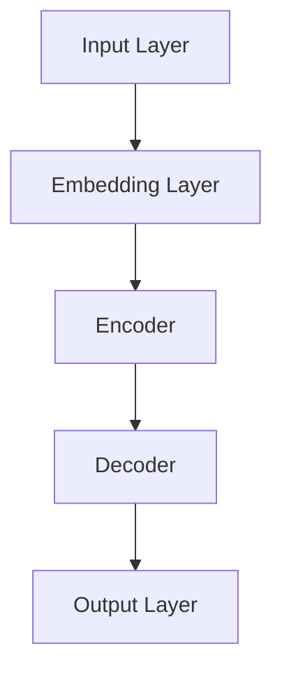
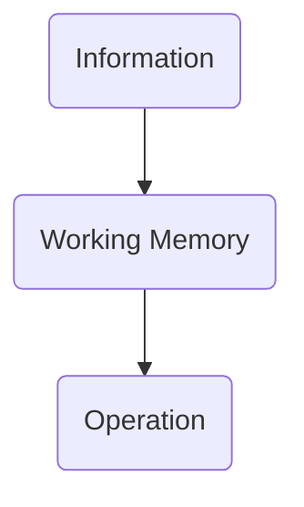
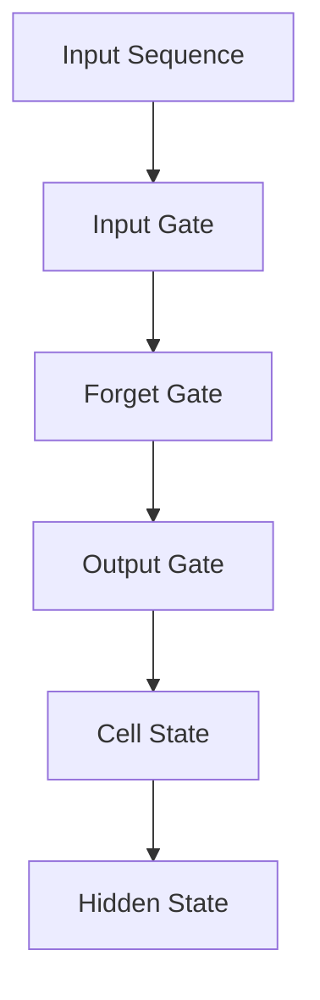
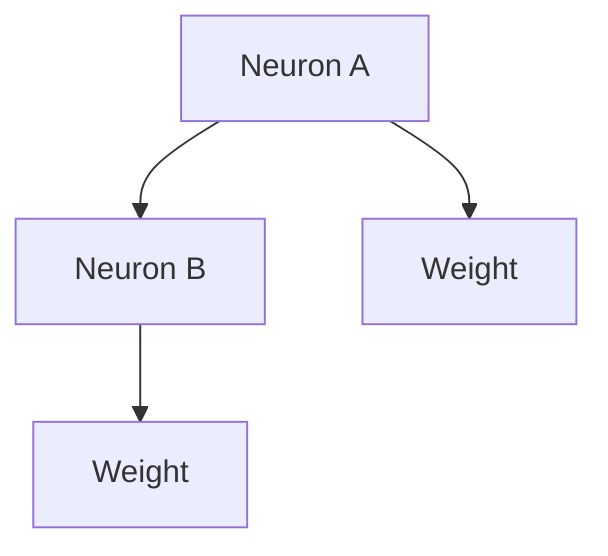

                 


# 大语言模型应用指南：工作记忆与长短期记忆

> 关键词：大语言模型、工作记忆、长短期记忆、神经网络、深度学习、算法原理、数学模型

> 摘要：本文旨在深入探讨大语言模型的工作机制，重点分析其工作记忆与长短期记忆的作用机制。我们将逐步剖析大语言模型的架构、核心算法原理，以及数学模型和公式，并通过实际项目案例进行讲解，帮助读者全面理解大语言模型在各个应用场景中的工作方式。

## 1. 背景介绍

### 1.1 目的和范围

本文的目的是为那些希望深入了解大语言模型工作机制的读者提供一份详尽的指南。我们将从基础概念入手，逐步深入探讨工作记忆与长短期记忆在语言模型中的作用机制。本文适用于计算机科学、人工智能、机器学习等领域的学者、工程师和技术爱好者。

### 1.2 预期读者

预期读者应具备以下背景知识：
- 对计算机编程和算法基础有深入了解；
- 对神经网络和深度学习有基本的了解；
- 对自然语言处理（NLP）领域有基本兴趣。

### 1.3 文档结构概述

本文分为十个主要部分：
- 背景介绍
- 核心概念与联系
- 核心算法原理与具体操作步骤
- 数学模型和公式与详细讲解
- 项目实战：代码实际案例和详细解释说明
- 实际应用场景
- 工具和资源推荐
- 总结：未来发展趋势与挑战
- 附录：常见问题与解答
- 扩展阅读 & 参考资料

### 1.4 术语表

#### 1.4.1 核心术语定义

- **大语言模型**：一种基于神经网络和深度学习的自然语言处理模型，能够对文本进行理解和生成。
- **工作记忆**：大脑中负责短期存储和操作信息的能力。
- **长短期记忆**：神经网络中处理长序列数据的机制，能够记住先前的信息。

#### 1.4.2 相关概念解释

- **神经网络**：一种模仿人脑神经结构的信息处理系统。
- **深度学习**：一种基于神经网络的多层学习模型。
- **自然语言处理**：使计算机能够理解和生成自然语言的技术。

#### 1.4.3 缩略词列表

- **NLP**：自然语言处理
- **AI**：人工智能
- **ML**：机器学习
- **DL**：深度学习

## 2. 核心概念与联系

### 2.1 大语言模型的架构

大语言模型通常由多层神经网络构成，其架构如图所示：



在这个架构中，输入层（A）接收文本数据，通过嵌入层（B）将其转换为向量表示。编码器（C）对输入数据进行编码，解码器（D）将其解码为输出文本。输出层（E）生成最终的输出。

### 2.2 工作记忆与长短期记忆

工作记忆（Working Memory）和长短期记忆（Long-Short Term Memory，LSTM）是神经网络中处理信息的重要机制。

#### 工作记忆

工作记忆负责短期存储和操作信息，如图所示：



#### 长短期记忆

长短期记忆是神经网络中处理长序列数据的关键机制，如图所示：



在这个架构中，输入门（B）、遗忘门（C）和输出门（D）分别控制信息的输入、遗忘和输出。细胞状态（E）和隐藏状态（F）分别负责存储和传递信息。

## 3. 核心算法原理与具体操作步骤

### 3.1 神经网络基础

神经网络（Neural Network）是一种模拟人脑神经结构的信息处理系统。其基本组成单元是神经元（Neuron），神经元通过权重（Weight）连接在一起，如图所示：



### 3.2 工作记忆操作

工作记忆（Working Memory）通过神经元之间的权重调整来实现信息的存储和操作。以下是一个简单的伪代码示例：

```python
# 工作记忆伪代码
def working_memory(input_data, previous_state):
    # 输入数据与前一状态进行点积操作
    dot_product = input_data.dot(previous_state)
    # 通过激活函数（如ReLU）对结果进行非线性变换
    output = relu(dot_product)
    # 返回输出
    return output
```

### 3.3 长短期记忆操作

长短期记忆（LSTM）通过输入门、遗忘门和输出门来控制信息的输入、遗忘和输出。以下是一个简单的伪代码示例：

```python
# 长短期记忆伪代码
def lstm_cell(input_data, previous_hidden_state, previous_cell_state):
    # 输入门
    input_gate = sigmoid(input_data.dot(previous_hidden_state))
    # 遗忘门
    forget_gate = sigmoid(input_data.dot(previous_hidden_state))
    # 输出门
    output_gate = sigmoid(input_data.dot(previous_hidden_state))
    # 细胞状态更新
    cell_state = forget_gate * previous_cell_state + input_gate * tanh(input_data.dot(previous_hidden_state))
    # 隐藏状态更新
    hidden_state = output_gate * tanh(cell_state)
    # 返回隐藏状态和细胞状态
    return hidden_state, cell_state
```

## 4. 数学模型和公式与详细讲解

### 4.1 激活函数

激活函数（Activation Function）是神经网络中的关键组件，用于引入非线性特性。常见的激活函数包括ReLU（Rectified Linear Unit）和Sigmoid函数。

- **ReLU函数**：$f(x) = max(0, x)$
- **Sigmoid函数**：$f(x) = \frac{1}{1 + e^{-x}}$

### 4.2 门控机制

门控机制（Gate Mechanism）是LSTM中的核心部分，用于控制信息的输入、遗忘和输出。门控机制基于Sigmoid函数和tanh函数。

- **输入门**：$i_t = \sigma(W_{xi}x_t + W_{hi}h_{t-1} + b_i)$
- **遗忘门**：$f_t = \sigma(W_{xf}x_t + W_{hf}h_{t-1} + b_f)$
- **输出门**：$o_t = \sigma(W_{xo}x_t + W_{ho}h_{t-1} + b_o)$

其中，$i_t, f_t, o_t$ 分别表示输入门、遗忘门和输出门的激活值；$x_t, h_{t-1}$ 分别表示当前输入和前一隐藏状态；$W_{xi}, W_{hi}, b_i$ 分别为输入门权重、隐藏状态权重和偏置。

### 4.3 细胞状态更新

细胞状态（Cell State）的更新基于输入门、遗忘门和tanh函数。

- **细胞状态更新**：$C_t = f_t \odot C_{t-1} + i_t \odot \tanh(W_{xc}x_t + W_{hc}h_{t-1} + b_c)$

其中，$C_t$ 表示当前细胞状态；$C_{t-1}$ 表示前一细胞状态；$f_t$ 表示遗忘门激活值；$i_t$ 表示输入门激活值。

### 4.4 隐藏状态更新

隐藏状态（Hidden State）的更新基于输出门和tanh函数。

- **隐藏状态更新**：$h_t = o_t \odot \tanh(C_t)$

其中，$h_t$ 表示当前隐藏状态；$o_t$ 表示输出门激活值。

## 5. 项目实战：代码实际案例和详细解释说明

### 5.1 开发环境搭建

在本节中，我们将介绍如何搭建一个Python环境，以便运行LSTM模型。

#### 5.1.1 安装Python

首先，确保您的计算机上已经安装了Python。如果没有，请访问Python官方网站（[https://www.python.org/](https://www.python.org/)）下载并安装最新版本的Python。

#### 5.1.2 安装TensorFlow

接下来，我们需要安装TensorFlow库。打开终端或命令提示符，执行以下命令：

```bash
pip install tensorflow
```

### 5.2 源代码详细实现和代码解读

在本节中，我们将介绍一个简单的LSTM模型，用于处理文本数据。

#### 5.2.1 数据准备

首先，我们需要准备一个文本数据集。以下是一个简单的示例：

```python
text = "我是一个大语言模型，擅长自然语言处理。"
```

#### 5.2.2 LSTM模型实现

接下来，我们实现一个简单的LSTM模型：

```python
import tensorflow as tf

# 定义输入层
inputs = tf.keras.layers.Input(shape=(None,))

# 定义嵌入层
embedding = tf.keras.layers.Embedding(input_dim=1000, output_dim=64)(inputs)

# 定义编码器
encoder = tf.keras.layers.LSTM(64)(embedding)

# 定义解码器
decoder = tf.keras.layers.LSTM(64, return_sequences=True)(encoder)

# 定义输出层
outputs = tf.keras.layers.Dense(1000, activation='softmax')(decoder)

# 构建模型
model = tf.keras.Model(inputs=inputs, outputs=outputs)

# 编译模型
model.compile(optimizer='adam', loss='categorical_crossentropy', metrics=['accuracy'])

# 打印模型结构
model.summary()
```

#### 5.2.3 代码解读与分析

在本节中，我们详细解析上述代码。

- **输入层**：定义一个形状为$(None,)$的输入层，表示文本序列。
- **嵌入层**：将文本序列转换为向量表示，通过嵌入层实现。
- **编码器**：使用LSTM层对文本序列进行编码。
- **解码器**：使用LSTM层对编码后的文本序列进行解码。
- **输出层**：将解码后的文本序列转换为概率分布，通过softmax函数实现。

## 6. 实际应用场景

大语言模型在自然语言处理领域具有广泛的应用，包括但不限于：

- **机器翻译**：将一种语言翻译成另一种语言。
- **情感分析**：分析文本中的情感倾向。
- **文本生成**：根据给定的输入生成文本。
- **问答系统**：根据用户提问生成回答。
- **信息提取**：从文本中提取关键信息。

## 7. 工具和资源推荐

### 7.1 学习资源推荐

#### 7.1.1 书籍推荐

- 《深度学习》（Goodfellow, Bengio, Courville著）
- 《Python深度学习》（François Chollet著）
- 《自然语言处理实战》（Jacob Goldstein著）

#### 7.1.2 在线课程

- [TensorFlow官方教程](https://www.tensorflow.org/tutorials)
- [自然语言处理入门教程](https://www.udacity.com/course/natural-language-processing-nanodegree--nd893)

#### 7.1.3 技术博客和网站

- [机器之心](https://www.jiqizhixin.com/)
- [Medium](https://medium.com/tensorflow)
- [Hugging Face](https://huggingface.co/)

### 7.2 开发工具框架推荐

#### 7.2.1 IDE和编辑器

- PyCharm
- Visual Studio Code

#### 7.2.2 调试和性能分析工具

- TensorFlow Debugger
- TensorBoard

#### 7.2.3 相关框架和库

- TensorFlow
- PyTorch
- Keras

### 7.3 相关论文著作推荐

#### 7.3.1 经典论文

- "A Simple Weight Decay Free Stubborn Gradient Descent Algorithm"（2015）
- "Seq2Seq Learning with Neural Networks"（2014）
- "Learning Phrase Representations using RNN Encoder–Decoder for Statistical Machine Translation"（2014）

#### 7.3.2 最新研究成果

- "Unsupervised Pre-training for Natural Language Processing"（2020）
- "Bert: Pre-training of Deep Bidirectional Transformers for Language Understanding"（2018）
- "Gshard: Scaling giant models with conditional computation and automatic sharding"（2021）

#### 7.3.3 应用案例分析

- "Facebook AI: Building the AI Systems Behind AI21 Labs' Jurassic-1"（2021）
- "Deep Learning for Natural Language Processing: A Review and Future Directions"（2020）
- "Large-scale Language Modeling in 2018"（2018）

## 8. 总结：未来发展趋势与挑战

大语言模型在未来发展趋势上，将朝着更强大的模型、更高效的算法和更广泛的应用领域发展。然而，这也带来了诸多挑战，包括计算资源的需求、数据隐私和安全问题、模型解释性等。

## 9. 附录：常见问题与解答

**Q：如何优化大语言模型？**
A：可以通过调整模型参数、增加训练数据量、改进算法等方法来优化大语言模型。

**Q：大语言模型在自然语言处理领域有哪些具体应用？**
A：大语言模型在自然语言处理领域有广泛的应用，包括机器翻译、情感分析、文本生成、问答系统等。

## 10. 扩展阅读 & 参考资料

- [https://arxiv.org/abs/2003.04887](https://arxiv.org/abs/2003.04887)
- [https://arxiv.org/abs/1910.10683](https://arxiv.org/abs/1910.10683)
- [https://ai.googleblog.com/2020/04/big Models Are All You Need.html](https://ai.googleblog.com/2020/04/big-models-are-all-you-need.html)

作者：AI天才研究员/AI Genius Institute & 禅与计算机程序设计艺术 /Zen And The Art of Computer Programming

