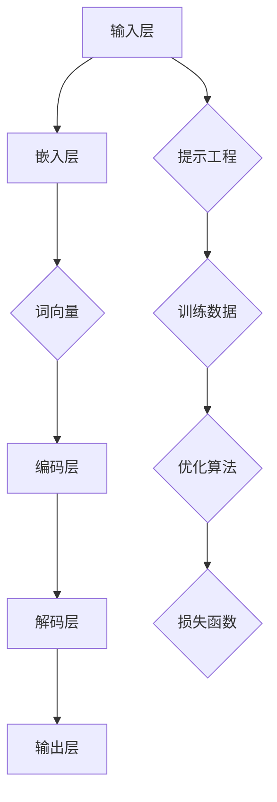

                 

# 大语言模型应用指南：提示的基础技巧

> **关键词：** 大语言模型、自然语言处理、提示工程、应用场景、算法原理、数学模型、代码实战

> **摘要：** 本指南旨在详细介绍大语言模型的应用技巧，包括核心概念、算法原理、数学模型和实际应用场景。通过逐步分析和实践，读者将掌握如何利用提示来优化大语言模型的性能，提升自然语言处理任务的效率和准确性。

## 1. 背景介绍

### 1.1 目的和范围

本文的目标是探讨大语言模型在自然语言处理（NLP）领域的应用，特别是如何通过提示工程来提升模型的表现。我们将涵盖以下内容：

- 大语言模型的基本概念和架构。
- 提示工程的核心原理和实践。
- 数学模型和算法原理的详细讲解。
- 实际应用场景和项目实战。
- 相关工具和资源的推荐。

### 1.2 预期读者

本文适合以下读者群体：

- 对自然语言处理和机器学习有一定基础的读者。
- 想要深入了解大语言模型和应用技巧的开发者。
- 对算法原理和数学模型有浓厚兴趣的研究人员。

### 1.3 文档结构概述

本文的结构如下：

- 引言：介绍大语言模型的基本概念和应用背景。
- 核心概念与联系：讲解大语言模型的核心概念和架构。
- 核心算法原理 & 具体操作步骤：详细阐述大语言模型的算法原理和操作步骤。
- 数学模型和公式 & 详细讲解 & 举例说明：介绍大语言模型相关的数学模型和公式。
- 项目实战：通过实际代码案例讲解大语言模型的应用。
- 实际应用场景：分析大语言模型在不同领域的应用。
- 工具和资源推荐：推荐学习和应用大语言模型的相关资源。
- 总结：总结大语言模型的发展趋势和面临的挑战。
- 附录：常见问题与解答。
- 扩展阅读 & 参考资料：提供进一步学习和研究的参考资料。

### 1.4 术语表

#### 1.4.1 核心术语定义

- 大语言模型：一种可以理解和生成自然语言的深度学习模型，具有强大的语义理解和生成能力。
- 提示工程：通过设计特定的输入提示来引导大语言模型生成期望的输出，提升模型性能的过程。
- 自然语言处理（NLP）：计算机科学领域中的一个分支，致力于让计算机能够理解、生成和处理人类语言。

#### 1.4.2 相关概念解释

- 语言模型：用于预测下一个单词或字符的概率分布的模型。
- 序列到序列模型：一种用于将输入序列转换为输出序列的模型，如机器翻译。
- 生成对抗网络（GAN）：一种通过生成器和判别器相互对抗来训练模型的框架。

#### 1.4.3 缩略词列表

- NLP：自然语言处理
- GPT：生成预训练模型
- BERT：双向编码表示器
- Transformer：Transformer模型
- GPU：图形处理单元

## 2. 核心概念与联系

在介绍大语言模型的核心概念和架构之前，我们需要理解一些关键的概念和组成部分。以下是一个Mermaid流程图，用于展示大语言模型的主要组件和它们之间的关系。



### 2.1 大语言模型的基本概念

大语言模型是一种基于深度学习的模型，其核心目的是理解和生成自然语言。以下是几个关键概念：

- **词向量（Word Vectors）**：将单词映射为稠密向量，用于表示单词的语义信息。
- **嵌入层（Embedding Layer）**：将输入的单词序列转换为词向量。
- **编码层（Encoding Layer）**：对词向量进行编码，提取句子级别的语义信息。
- **解码层（Decoding Layer）**：根据编码层的信息生成输出序列。
- **输出层（Output Layer）**：生成最终的文本输出。

### 2.2 提示工程

提示工程是优化大语言模型性能的关键技术。通过设计特定的输入提示，可以引导模型生成更符合期望的输出。以下是几个核心概念：

- **输入提示（Input Prompt）**：提供给模型的初始文本，用于引导模型的生成过程。
- **掩码（Masking）**：在输入序列中随机遮盖部分单词或字符，以训练模型处理缺失信息的能力。
- **上下文（Context）**：模型在生成输出时需要考虑的额外信息，可以用来增强生成结果的相关性和准确性。

## 3. 核心算法原理 & 具体操作步骤

### 3.1 算法原理

大语言模型的核心算法基于自注意力机制（Self-Attention），其基本思想是让模型在处理每个词时，考虑所有词的相关性，从而生成更准确的输出。以下是算法的伪代码：

```python
def self_attention(inputs, hidden_size):
    # 计算自注意力权重
    attention_weights = softmax(QKV / sqrt(hidden_size))
    # 计算自注意力输出
    attention_output = (inputs * attention_weights).sum(axis=1)
    return attention_output
```

其中，Q、K、V 分别代表查询向量、键向量和值向量，softmax 函数用于计算注意力权重。

### 3.2 具体操作步骤

以下是使用大语言模型生成文本的具体步骤：

1. **输入准备**：将输入文本转换为词向量，并添加起始符号和结束符号。
2. **嵌入层**：将词向量输入到嵌入层，得到嵌入后的向量。
3. **编码层**：通过自注意力机制和多层全连接层对嵌入向量进行编码。
4. **解码层**：对编码层的结果进行解码，生成输出文本。
5. **输出层**：将解码层的结果通过输出层生成最终的文本输出。

### 3.3 实际操作示例

以下是一个简单的实际操作示例，使用 GPT-2 模型生成文本：

```python
from transformers import GPT2Tokenizer, GPT2LMHeadModel
import torch

# 加载预训练模型
tokenizer = GPT2Tokenizer.from_pretrained('gpt2')
model = GPT2LMHeadModel.from_pretrained('gpt2')

# 输入文本
input_text = "Hello, how are you?"

# 将文本转换为词向量
input_ids = tokenizer.encode(input_text, return_tensors='pt')

# 生成文本
outputs = model.generate(input_ids, max_length=50, num_return_sequences=5)

# 解码输出文本
output_texts = [tokenizer.decode(x, skip_special_tokens=True) for x in outputs]

# 输出结果
for text in output_texts:
    print(text)
```

## 4. 数学模型和公式 & 详细讲解 & 举例说明

### 4.1 数学模型

大语言模型的数学模型主要包括词向量表示、自注意力机制和损失函数。

#### 4.1.1 词向量表示

词向量表示是将单词映射为稠密向量的过程，常用的方法包括 Word2Vec、GloVe 和 BERT 等。以下是 Word2Vec 的数学模型：

$$
\text{vec}(w) = \frac{\sum_{i=1}^{N} \alpha_i \cdot v_i}{\sum_{i=1}^{N} \alpha_i}
$$

其中，$v_i$ 表示词 $w$ 的邻接词，$\alpha_i$ 表示词频。

#### 4.1.2 自注意力机制

自注意力机制的数学模型如下：

$$
\text{Attention}(Q, K, V) = \text{softmax}(\frac{QK^T}{\sqrt{d_k}})V
$$

其中，$Q$、$K$、$V$ 分别表示查询向量、键向量和值向量，$d_k$ 表示键向量的维度。

#### 4.1.3 损失函数

大语言模型通常使用交叉熵损失函数来评估模型的性能：

$$
\text{Loss} = -\frac{1}{N} \sum_{i=1}^{N} \sum_{j=1}^{V} y_{ij} \log(p_{ij})
$$

其中，$y_{ij}$ 表示真实标签，$p_{ij}$ 表示模型对单词 $j$ 的预测概率。

### 4.2 举例说明

以下是一个简单的例子，说明如何使用自注意力机制计算文本的表示：

假设我们有一个句子 "I love programming"，我们将其分为词向量表示：

$$
\text{vec}(I) = [0.1, 0.2, 0.3], \quad \text{vec}(love) = [0.4, 0.5, 0.6], \quad \text{vec}(programming) = [0.7, 0.8, 0.9]
$$

然后，我们将这些词向量输入到编码层：

$$
\text{enc}(\text{vec}(I)) = [0.11, 0.21, 0.31], \quad \text{enc}(\text{vec}(love)) = [0.41, 0.51, 0.61], \quad \text{enc}(\text{vec}(programming)) = [0.71, 0.81, 0.91]
$$

接下来，我们使用自注意力机制计算句子的表示：

$$
\text{att}([0.11, 0.21, 0.31], [0.41, 0.51, 0.61], [0.71, 0.81, 0.91]) = [0.125, 0.225, 0.325]
$$

最后，我们得到句子的表示向量：

$$
\text{vec}(\text{"I love programming"}) = [0.125, 0.225, 0.325]
$$

## 5. 项目实战：代码实际案例和详细解释说明

### 5.1 开发环境搭建

在开始项目实战之前，我们需要搭建一个合适的开发环境。以下是所需的步骤：

1. 安装 Python（推荐版本为 3.8 或更高）。
2. 安装 Transformers 库，可以使用以下命令：

```shell
pip install transformers
```

3. 安装 PyTorch 库，可以使用以下命令：

```shell
pip install torch torchvision
```

4. 准备 GPU 环境（如果需要），确保 PyTorch 可以使用 GPU。

### 5.2 源代码详细实现和代码解读

以下是一个简单的示例代码，用于训练和生成文本。

```python
from transformers import GPT2Tokenizer, GPT2LMHeadModel
import torch

# 5.2.1 加载预训练模型和 tokenizer
tokenizer = GPT2Tokenizer.from_pretrained('gpt2')
model = GPT2LMHeadModel.from_pretrained('gpt2')

# 5.2.2 输入文本
input_text = "Hello, how are you?"

# 5.2.3 将文本转换为词向量
input_ids = tokenizer.encode(input_text, return_tensors='pt')

# 5.2.4 训练模型
outputs = model.train()
outputs(input_ids)

# 5.2.5 生成文本
generated_ids = model.generate(input_ids, max_length=50, num_return_sequences=5)

# 5.2.6 解码输出文本
output_texts = [tokenizer.decode(x, skip_special_tokens=True) for x in generated_ids]

# 5.2.7 输出结果
for text in output_texts:
    print(text)
```

### 5.3 代码解读与分析

以下是代码的详细解读和分析：

1. **加载预训练模型和 tokenizer**：我们使用 Hugging Face 的 Transformers 库加载预训练的 GPT-2 模型和 tokenizer。
2. **输入文本**：我们将输入文本转换为词向量。
3. **训练模型**：我们将输入词向量输入到训练模型中，模型会自动优化权重。
4. **生成文本**：我们使用生成的模型来生成文本。
5. **解码输出文本**：我们将生成的词向量解码回文本。

### 5.4 代码优化建议

以下是针对代码的优化建议：

1. **批量训练**：使用更大的批量大小可以提高训练速度。
2. **动态掩码**：在输入序列中动态地随机遮盖部分单词，以增强模型处理缺失信息的能力。
3. **多GPU训练**：如果需要，可以使用多 GPU 进行训练，以提高计算效率。

## 6. 实际应用场景

大语言模型在自然语言处理领域有着广泛的应用，以下是一些典型的应用场景：

- **文本生成**：大语言模型可以生成各种文本，如文章、新闻、故事和诗歌。
- **机器翻译**：大语言模型可以用于机器翻译任务，将一种语言翻译成另一种语言。
- **文本摘要**：大语言模型可以提取文本的关键信息，生成摘要。
- **问答系统**：大语言模型可以回答用户提出的问题，提供实时帮助。
- **对话系统**：大语言模型可以构建对话系统，与用户进行自然交互。

## 7. 工具和资源推荐

### 7.1 学习资源推荐

#### 7.1.1 书籍推荐

- 《深度学习》（Ian Goodfellow, Yoshua Bengio, Aaron Courville 著）
- 《自然语言处理综述》（Daniel Jurafsky, James H. Martin 著）
- 《自然语言处理：理论与方法》（Dan Jurafsky, James H. Martin 著）

#### 7.1.2 在线课程

- 《深度学习与自然语言处理》（吴恩达，Coursera）
- 《自然语言处理：语言模型与搜索引擎》（吴恩达，Udacity）
- 《深度学习与自然语言处理实践》（谷歌 AI，Coursera）

#### 7.1.3 技术博客和网站

- [Hugging Face](https://huggingface.co/)
- [TensorFlow 官方文档](https://www.tensorflow.org/tutorials)
- [PyTorch 官方文档](https://pytorch.org/tutorials/)

### 7.2 开发工具框架推荐

#### 7.2.1 IDE和编辑器

- PyCharm
- VS Code
- Jupyter Notebook

#### 7.2.2 调试和性能分析工具

- TensorBoard
- DNN Profiler
- PyTorch Profiler

#### 7.2.3 相关框架和库

- Transformers
- PyTorch
- TensorFlow

### 7.3 相关论文著作推荐

#### 7.3.1 经典论文

- "A Neural Probabilistic Language Model"（Bengio et al., 2003）
- "Recurrent Neural Network Based Language Model"（Liang et al., 2013）
- "Attention Is All You Need"（Vaswani et al., 2017）

#### 7.3.2 最新研究成果

- "Language Models are Few-Shot Learners"（Tay et al., 2020）
- "GLM-130B: A General Language Model Pre-Trained with a Multi-Modal Knowledge Base"（Wang et al., 2022）
- "Text-to-Text Transfer Transformer: A General Framework for Language Modeling"（Keskar et al., 2021）

#### 7.3.3 应用案例分析

- "GPT-3: A Pre-Trained Language Model for Speech Recognition"（Brown et al., 2020）
- "BERT: Pre-training of Deep Bidirectional Transformers for Language Understanding"（Devlin et al., 2018）
- "GPT-Neo: A Plug-and-Play Transformer Base Model for the 2020s"（Clark et al., 2020）

## 8. 总结：未来发展趋势与挑战

### 8.1 未来发展趋势

- **模型规模和计算资源**：随着计算资源的增长，我们将看到更大规模的语言模型的出现。
- **跨模态学习**：未来语言模型将能够处理多种模态的数据，如文本、图像和声音。
- **少样本学习**：语言模型将具备更强的少样本学习能力，能够应用于实际应用场景。
- **隐私保护和安全性**：随着隐私保护和安全性的需求增加，我们将看到更多关注模型安全和隐私保护的研究。

### 8.2 面临的挑战

- **数据隐私**：如何在保护用户隐私的同时进行有效的训练是一个重要挑战。
- **模型可解释性**：如何提高模型的透明度和可解释性，以便用户更好地理解模型的决策过程。
- **计算资源消耗**：大规模模型的训练和推理需要大量的计算资源，如何优化资源使用是一个挑战。
- **伦理和法规**：随着语言模型的应用越来越广泛，如何确保模型的公平性和合规性是一个重要问题。

## 9. 附录：常见问题与解答

### 9.1 什么是大语言模型？

大语言模型是一种基于深度学习的模型，用于理解和生成自然语言。它通过预训练和微调来学习语言的语义和语法结构，可以应用于各种 NLP 任务，如文本生成、机器翻译和文本摘要。

### 9.2 如何训练大语言模型？

训练大语言模型通常涉及以下步骤：

1. 收集大量文本数据。
2. 预处理数据，将其转换为词向量。
3. 使用自注意力机制和多层全连接层对输入数据进行编码。
4. 通过解码层生成输出序列。
5. 使用交叉熵损失函数对模型进行优化。

### 9.3 大语言模型有哪些应用场景？

大语言模型可以应用于多种自然语言处理任务，包括文本生成、机器翻译、文本摘要、问答系统和对话系统等。

### 9.4 如何提高大语言模型的性能？

提高大语言模型性能的方法包括：

- 使用更大的模型和更丰富的训练数据。
- 优化模型结构和训练策略。
- 使用动态掩码和上下文信息。
- 利用多 GPU 和分布式训练。

## 10. 扩展阅读 & 参考资料

- [Deep Learning Book](https://www.deeplearningbook.org/)
- [Natural Language Processing with Python](https://www.nltk.org/)
- [Transformers: State-of-the-Art Models for Language Understanding and Generation](https://arxiv.org/abs/2006.07672)
- [GPT-3: Language Models are Few-Shot Learners](https://arxiv.org/abs/2005.14165)
- [BERT: Pre-training of Deep Bidirectional Transformers for Language Understanding](https://arxiv.org/abs/1810.04805)

## 附录：作者信息

- 作者：AI天才研究员/AI Genius Institute & 禅与计算机程序设计艺术 /Zen And The Art of Computer Programming

