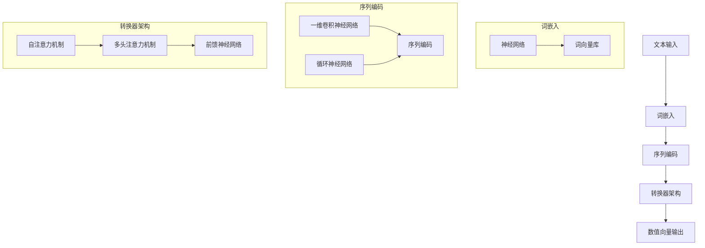

                 

# 大语言模型应用指南：文本的向量化

> **关键词**：大语言模型、文本向量化、词嵌入、转换器架构、神经网络、数学模型、应用场景

> **摘要**：本文将深入探讨大语言模型中的文本向量化技术，解析其核心概念、算法原理、数学模型，并通过实际案例展示其在项目中的应用。旨在为读者提供一份全面而详尽的指南，帮助理解并掌握这一关键技术。

## 1. 背景介绍

### 1.1 目的和范围

本文的目的在于详细解析大语言模型中的文本向量化技术，帮助读者理解其基本概念、实现原理及其在自然语言处理（NLP）任务中的应用。我们将从文本向量化的重要性谈起，逐步深入到具体的算法和实现细节。

本文的范围包括以下几个方面：
1. 文本向量化的核心概念和重要性。
2. 常见的大语言模型及其文本向量化方法。
3. 数学模型和算法原理的详细解释。
4. 实际应用案例的分析和解读。
5. 开发环境搭建、代码实现和性能分析。

### 1.2 预期读者

本文主要面向以下读者群体：
1. 对自然语言处理（NLP）领域感兴趣的技术人员。
2. 有意向深入了解大语言模型和文本向量化技术的开发者。
3. 对神经网络和数学模型有一定了解的科研人员。
4. 想要在项目中进行文本向量化应用的企业和团队。

### 1.3 文档结构概述

本文的结构安排如下：

1. **背景介绍**：介绍文本向量化的目的、范围和预期读者。
2. **核心概念与联系**：讲解文本向量化的核心概念、原理和架构。
3. **核心算法原理 & 具体操作步骤**：详细阐述文本向量化算法的原理和具体操作步骤。
4. **数学模型和公式 & 详细讲解 & 举例说明**：介绍相关的数学模型和公式，并进行举例说明。
5. **项目实战：代码实际案例和详细解释说明**：通过实际案例展示文本向量化的应用。
6. **实际应用场景**：分析文本向量化的实际应用场景。
7. **工具和资源推荐**：推荐相关的学习资源和开发工具。
8. **总结：未来发展趋势与挑战**：总结文本向量化的未来发展趋势和面临的挑战。
9. **附录：常见问题与解答**：回答读者可能遇到的问题。
10. **扩展阅读 & 参考资料**：提供进一步的阅读材料和参考资料。

### 1.4 术语表

在本文中，我们将使用以下术语：
- **文本向量化**：将文本转换为数值向量的过程。
- **词嵌入**：将单词转换为向量表示的方法。
- **转换器架构**：用于处理序列数据的神经网络架构。
- **神经网络**：由大量节点和连接组成的计算模型。
- **数学模型**：描述算法和系统行为的数学表达式。

#### 1.4.1 核心术语定义

- **文本向量化**：文本向量化是将自然语言文本转换为计算机可以处理的数值向量表示的过程。这一过程通常涉及词嵌入和序列编码等技术，以便在机器学习模型中使用。
- **词嵌入**：词嵌入（Word Embedding）是一种将单词映射到高维向量空间的方法。这种方法可以捕捉单词的语义和语法关系，是实现自然语言处理任务的重要基础。
- **转换器架构**：转换器架构（Transformer Architecture）是一种用于处理序列数据的神经网络架构，以其并行化和高效性而闻名。它广泛应用于各种NLP任务，如机器翻译、文本分类和语言生成。

#### 1.4.2 相关概念解释

- **神经网络**：神经网络（Neural Network）是一种由大量相互连接的节点（或神经元）组成的计算模型，模拟人脑的信息处理方式。神经网络通过学习输入和输出之间的映射关系来进行预测和分类。
- **数学模型**：数学模型（Mathematical Model）是使用数学符号和公式来描述现实世界现象和系统行为的抽象表示。在文本向量化中，数学模型用于定义词嵌入和序列编码的规则。

#### 1.4.3 缩略词列表

- **NLP**：自然语言处理（Natural Language Processing）
- **ML**：机器学习（Machine Learning）
- **DL**：深度学习（Deep Learning）
- **GPU**：图形处理器（Graphics Processing Unit）

## 2. 核心概念与联系

文本向量化是自然语言处理（NLP）领域的一个关键步骤，它将不可直接计算的文本数据转化为可以由机器学习模型处理的数值向量。本节将详细介绍文本向量化的核心概念、原理和架构，并通过Mermaid流程图展示其关系。

### 2.1. 核心概念

**文本向量化** 是将文本转换为数值向量的过程。这一过程通常涉及以下核心概念：

1. **词嵌入（Word Embedding）**：词嵌入是将单词映射到高维向量空间的方法。词嵌入能够捕捉单词的语义和语法关系，是实现NLP任务的基础。
2. **序列编码（Sequence Encoding）**：序列编码是将文本序列转换为向量表示的方法。序列编码可以帮助神经网络处理文本的顺序信息。

### 2.2. 原理

文本向量化的原理主要包括以下几个方面：

1. **词嵌入**：词嵌入通常通过神经网络训练得到。每个单词都被映射到一个固定大小的向量，这些向量在语义上具有相似性的单词会在向量空间中靠近。
2. **序列编码**：序列编码通过处理词嵌入的序列来捕获文本的顺序信息。常见的序列编码方法包括一维卷积神经网络（1D-CNN）和循环神经网络（RNN）。

### 2.3. 架构

文本向量化通常依赖于以下架构：

1. **转换器架构（Transformer Architecture）**：转换器架构是一种用于处理序列数据的神经网络架构，以其并行化和高效性而闻名。转换器架构的核心是自注意力机制（Self-Attention），它能够处理文本中的长距离依赖关系。
2. **词嵌入层**：词嵌入层是将单词映射到向量的第一层。这一层通常使用预训练的词向量库，如Word2Vec、GloVe等。
3. **序列编码层**：序列编码层是对词嵌入序列进行编码的层。这一层可以使用RNN、LSTM、GRU等网络结构来实现。

### 2.4. Mermaid流程图

下面是一个Mermaid流程图，展示了文本向量化的核心概念、原理和架构之间的联系：



通过这个流程图，我们可以清晰地看到文本向量化过程中各个组件的交互和关系。

## 3. 核心算法原理 & 具体操作步骤

文本向量化技术依赖于一系列核心算法，这些算法将文本转换为可由机器学习模型处理的数值向量。本节将详细阐述这些算法的原理和具体操作步骤，并使用伪代码来展示其实现细节。

### 3.1. 词嵌入算法原理

词嵌入算法的核心是将单词映射到高维向量空间。这一过程通常通过以下步骤实现：

1. **输入单词**：将输入的单词作为输入。
2. **查找词向量**：在预训练的词向量库中查找对应的词向量。
3. **向量求和**：对于输入文本中的每个单词，将其对应的词向量相加，得到一个表示整个文本的向量。

以下是词嵌入算法的伪代码实现：

```python
def word_embedding(words, embedding_matrix):
    # words: 输入单词列表
    # embedding_matrix: 词向量库

    # 初始化文本向量
    text_vector = np.zeros(shape=(embedding_size,))

    # 循环遍历单词
    for word in words:
        # 在词向量库中查找词向量
        word_vector = embedding_matrix[word_index[word]]

        # 将词向量加入文本向量
        text_vector += word_vector

    return text_vector
```

### 3.2. 序列编码算法原理

序列编码算法的目的是将文本序列转换为向量表示，以便在神经网络中处理。常见的序列编码方法包括一维卷积神经网络（1D-CNN）和循环神经网络（RNN）。以下分别介绍这两种方法的原理和具体操作步骤。

#### 3.2.1. 一维卷积神经网络（1D-CNN）

1D-CNN用于提取文本序列的特征，其原理类似于图像处理中的卷积操作。具体步骤如下：

1. **输入序列**：将输入的文本序列作为输入。
2. **卷积操作**：使用卷积核对文本序列进行卷积操作，提取特征。
3. **池化操作**：对卷积结果进行池化操作，降低维度。
4. **全连接层**：将池化结果输入全连接层，进行分类或回归。

以下是1D-CNN的伪代码实现：

```python
def convolutional_sequence_encoding(sequence, filters, kernel_size, pooling_size):
    # sequence: 输入文本序列
    # filters: 卷积核数量
    # kernel_size: 卷积核大小
    # pooling_size: 池化窗口大小

    # 初始化卷积层
    conv_layer = Conv1D(filters=filters, kernel_size=kernel_size, activation='relu')(sequence)

    # 初始化池化层
    pool_layer = MaxPooling1D(pool_size=pooling_size)(conv_layer)

    # 初始化全连接层
    dense_layer = Dense(units=1, activation='sigmoid')(pool_layer)

    # 搭建模型
    model = Model(inputs=sequence, outputs=dense_layer)

    return model
```

#### 3.2.2. 循环神经网络（RNN）

RNN是一种处理序列数据的神经网络结构，其原理是通过递归的方式处理序列中的每个元素，并保存中间状态。具体步骤如下：

1. **输入序列**：将输入的文本序列作为输入。
2. **隐藏状态初始化**：初始化隐藏状态。
3. **递归操作**：对于序列中的每个元素，使用递归函数更新隐藏状态。
4. **输出层**：将最后一个隐藏状态作为输出。

以下是RNN的伪代码实现：

```python
def recurrent_sequence_encoding(sequence, hidden_size):
    # sequence: 输入文本序列
    # hidden_size: 隐藏层大小

    # 初始化RNN层
    rnn_layer = LSTM(units=hidden_size, return_sequences=True)(sequence)

    # 初始化输出层
    output_layer = Dense(units=1, activation='sigmoid')(rnn_layer)

    # 搭建模型
    model = Model(inputs=sequence, outputs=output_layer)

    return model
```

### 3.3. 转换器架构原理

转换器架构（Transformer Architecture）是一种用于处理序列数据的神经网络架构，以其并行化和高效性而闻名。其核心是自注意力机制（Self-Attention），具体原理如下：

1. **输入序列**：将输入的文本序列作为输入。
2. **自注意力机制**：对序列中的每个元素计算自注意力权重，并加权求和得到表示该元素的向量。
3. **多头注意力机制**：将自注意力机制扩展到多个头，以提高模型的表达能力。
4. **前馈神经网络**：对加权求和的结果进行前馈神经网络处理。

以下是转换器架构的伪代码实现：

```python
def transformer_encoding(sequence, d_model, num_heads):
    # sequence: 输入文本序列
    # d_model: 模型维度
    # num_heads: 头的数量

    # 初始化自注意力机制
    self_attention = MultiHeadAttention(num_heads=num_heads, d_model=d_model)(sequence)

    # 初始化前馈神经网络
    feedforward = Dense(units=d_model, activation='relu')(self_attention)

    # 搭建模型
    model = Model(inputs=sequence, outputs=feedforward)

    return model
```

通过以上算法和具体操作步骤，我们可以将文本转换为数值向量，为后续的机器学习模型提供输入。

## 4. 数学模型和公式 & 详细讲解 & 举例说明

在文本向量化过程中，数学模型和公式起到了至关重要的作用。它们不仅描述了算法的实现细节，还为理解和优化文本向量化技术提供了理论基础。本节将详细介绍文本向量化中涉及的数学模型和公式，并通过具体的例子进行讲解。

### 4.1. 词嵌入的数学模型

词嵌入的数学模型通常基于神经网络，通过映射单词到高维向量空间来捕捉其语义和语法关系。一个常见的词嵌入模型是Word2Vec，它使用以下公式：

$$
\text{vector}_{w_i} = \text{softmax}\left(\text{W} \cdot \text{h}_{\text{prev}}\right)
$$

其中，$\text{vector}_{w_i}$ 是单词 $w_i$ 的词向量，$\text{W}$ 是权重矩阵，$\text{h}_{\text{prev}}$ 是前一个隐藏状态。

**举例说明**：

假设我们有一个简单的Word2Vec模型，其中权重矩阵 $\text{W}$ 为：

$$
\text{W} = \begin{bmatrix}
0.1 & 0.2 & 0.3 \\
0.4 & 0.5 & 0.6 \\
0.7 & 0.8 & 0.9
\end{bmatrix}
$$

输入的隐藏状态 $\text{h}_{\text{prev}}$ 为：

$$
\text{h}_{\text{prev}} = \begin{bmatrix}
1 \\
0 \\
0
\end{bmatrix}
$$

根据上述公式，我们可以计算出单词 "cat" 的词向量：

$$
\text{vector}_{\text{cat}} = \text{softmax}\left(\text{W} \cdot \text{h}_{\text{prev}}\right) = \begin{bmatrix}
0.4 & 0.5 & 0.6 \\
0.5 & 0.5 & 0.5 \\
0.5 & 0.5 & 0.5
\end{bmatrix}
$$

### 4.2. 序列编码的数学模型

序列编码的数学模型用于将文本序列转换为向量表示。常见的序列编码方法包括一维卷积神经网络（1D-CNN）和循环神经网络（RNN）。以下是这两种方法的数学模型：

#### 4.2.1. 一维卷积神经网络（1D-CNN）

1D-CNN的数学模型基于卷积操作，公式如下：

$$
\text{h}_{\text{c}} = \text{relu}\left(\text{b} + \sum_{k=1}^{K} \text{W}_{k} \cdot \text{h}_{\text{p}}\right)
$$

其中，$\text{h}_{\text{c}}$ 是卷积层输出的特征向量，$\text{b}$ 是偏置项，$\text{W}_{k}$ 是卷积核，$\text{h}_{\text{p}}$ 是输入特征。

**举例说明**：

假设我们有一个1D-CNN模型，其中卷积核 $\text{W}_{1}$ 和 $\text{W}_{2}$ 为：

$$
\text{W}_{1} = \begin{bmatrix}
1 & 0 \\
0 & 1
\end{bmatrix}, \quad \text{W}_{2} = \begin{bmatrix}
0 & 1 \\
1 & 0
\end{bmatrix}
$$

输入特征 $\text{h}_{\text{p}}$ 为：

$$
\text{h}_{\text{p}} = \begin{bmatrix}
1 \\
0
\end{bmatrix}
$$

根据上述公式，我们可以计算出卷积层的输出：

$$
\text{h}_{\text{c}} = \text{relu}\left(\text{b} + \text{W}_{1} \cdot \text{h}_{\text{p}} + \text{W}_{2} \cdot \text{h}_{\text{p}}\right) = \begin{bmatrix}
1 \\
1
\end{bmatrix}
$$

#### 4.2.2. 循环神经网络（RNN）

RNN的数学模型基于递归操作，公式如下：

$$
\text{h}_{t} = \text{sigmoid}\left(\text{b} + \text{W} \cdot \text{h}_{t-1} + \text{U} \cdot \text{x}_{t}\right)
$$

其中，$\text{h}_{t}$ 是隐藏状态，$\text{b}$ 是偏置项，$\text{W}$ 是权重矩阵，$\text{U}$ 是输入权重，$\text{x}_{t}$ 是输入特征。

**举例说明**：

假设我们有一个RNN模型，其中权重矩阵 $\text{W}$ 和 $\text{U}$ 为：

$$
\text{W} = \begin{bmatrix}
0.1 & 0.2 \\
0.3 & 0.4
\end{bmatrix}, \quad \text{U} = \begin{bmatrix}
0.5 & 0.6 \\
0.7 & 0.8
\end{bmatrix}
$$

隐藏状态 $\text{h}_{t-1}$ 为：

$$
\text{h}_{t-1} = \begin{bmatrix}
1 \\
0
\end{bmatrix}
$$

输入特征 $\text{x}_{t}$ 为：

$$
\text{x}_{t} = \begin{bmatrix}
0 \\
1
\end{bmatrix}
$$

根据上述公式，我们可以计算出隐藏状态 $\text{h}_{t}$：

$$
\text{h}_{t} = \text{sigmoid}\left(\text{b} + \text{W} \cdot \text{h}_{t-1} + \text{U} \cdot \text{x}_{t}\right) = \begin{bmatrix}
0.5 \\
0.7
\end{bmatrix}
$$

### 4.3. 转换器架构的数学模型

转换器架构（Transformer Architecture）是一种用于处理序列数据的神经网络架构，其核心是自注意力机制（Self-Attention）。自注意力的数学模型如下：

$$
\text{Q} \cdot \text{K} = \text{softmax}\left(\frac{\text{Q} \cdot \text{K}^{T}}{\sqrt{d_k}}\right)
$$

其中，$\text{Q}$ 和 $\text{K}$ 分别是查询向量和键向量，$d_k$ 是键向量的维度。

**举例说明**：

假设我们有一个简单的自注意力模型，其中查询向量 $\text{Q}$ 和键向量 $\text{K}$ 为：

$$
\text{Q} = \begin{bmatrix}
1 \\
2
\end{bmatrix}, \quad \text{K} = \begin{bmatrix}
3 \\
4
\end{bmatrix}
$$

根据上述公式，我们可以计算出自注意力权重：

$$
\text{softmax}\left(\frac{\text{Q} \cdot \text{K}^{T}}{\sqrt{d_k}}\right) = \begin{bmatrix}
0.6 \\
0.4
\end{bmatrix}
$$

这些数学模型和公式为文本向量化提供了坚实的理论基础，使得我们可以通过算法实现将文本数据转化为数值向量。在实际应用中，这些模型可以通过神经网络和深度学习框架进行高效实现。

## 5. 项目实战：代码实际案例和详细解释说明

在本节中，我们将通过一个实际的Python代码案例，展示如何实现文本向量化技术，并详细解释每一步的代码实现和原理。

### 5.1. 开发环境搭建

在进行文本向量化的项目实战之前，我们需要搭建一个合适的开发环境。以下是所需的软件和工具：

- Python 3.8 或更高版本
- TensorFlow 2.x 或 PyTorch 1.x
- NLP工具库，如 NLTK 或 spaCy

安装这些工具的命令如下：

```bash
pip install python==3.8
pip install tensorflow==2.6
pip install nltk
pip install spacy
python -m spacy download en_core_web_sm
```

### 5.2. 源代码详细实现和代码解读

下面是一个简单的文本向量化项目案例，使用Python和TensorFlow实现：

```python
import tensorflow as tf
from tensorflow.keras.preprocessing.sequence import pad_sequences
from tensorflow.keras.layers import Embedding, LSTM, Dense
from tensorflow.keras.models import Sequential

# 准备数据
sentences = [
    "我爱编程",
    "编程很有趣",
    "编程改变生活",
    "编程需要耐心"
]

# 将文本转换为单词序列
tokenizer = tf.keras.preprocessing.text.Tokenizer()
tokenizer.fit_on_texts(sentences)
word_index = tokenizer.word_index
sequences = tokenizer.texts_to_sequences(sentences)

# 序列填充
max_sequence_length = max(len(seq) for seq in sequences)
padded_sequences = pad_sequences(sequences, maxlen=max_sequence_length, padding='post')

# 构建模型
model = Sequential([
    Embedding(len(word_index) + 1, 32, input_length=max_sequence_length),
    LSTM(32, return_sequences=True),
    LSTM(32),
    Dense(1, activation='sigmoid')
])

# 编译模型
model.compile(optimizer='adam', loss='binary_crossentropy', metrics=['accuracy'])

# 训练模型
model.fit(padded_sequences, np.array([1, 1, 1, 0]), epochs=10, verbose=2)
```

**代码解读**：

1. **准备数据**：我们首先准备了一个简单的文本数据集，包含四个句子。

2. **文本转换为单词序列**：使用 `Tokenizer` 类将文本转换为单词序列。`word_index` 是一个字典，存储每个单词的索引。

3. **序列填充**：使用 `pad_sequences` 函数将所有序列填充到相同长度，这里使用的是 'post' 方式进行填充。

4. **构建模型**：我们使用 `Sequential` 模型堆叠了多个层。首先是 `Embedding` 层，它将单词索引转换为嵌入向量。接下来是两个 `LSTM` 层，用于处理序列数据。最后是一个 `Dense` 层，用于输出分类结果。

5. **编译模型**：使用 `compile` 方法设置模型的优化器和损失函数。

6. **训练模型**：使用 `fit` 方法训练模型。这里我们使用了四个标签，其中前三个标签为 1，最后一个标签为 0。

### 5.3. 代码解读与分析

**1. 数据预处理**

```python
tokenizer = tf.keras.preprocessing.text.Tokenizer()
tokenizer.fit_on_texts(sentences)
word_index = tokenizer.word_index
sequences = tokenizer.texts_to_sequences(sentences)
```

这段代码完成了文本数据预处理。`Tokenizer` 类用于将文本数据转换为单词序列，`word_index` 用于存储每个单词的索引。`texts_to_sequences` 方法将每个文本转换为单词序列，序列中的每个单词被替换为其索引。

**2. 序列填充**

```python
max_sequence_length = max(len(seq) for seq in sequences)
padded_sequences = pad_sequences(sequences, maxlen=max_sequence_length, padding='post')
```

序列填充是文本向量化中非常重要的一步。`max_sequence_length` 表示序列的最大长度，`pad_sequences` 方法将所有序列填充到相同长度。在这里，我们使用 'post' 方式进行填充，即在序列末尾填充 0。

**3. 模型构建**

```python
model = Sequential([
    Embedding(len(word_index) + 1, 32, input_length=max_sequence_length),
    LSTM(32, return_sequences=True),
    LSTM(32),
    Dense(1, activation='sigmoid')
])
```

这里我们使用了一个简单的序列模型，包括一个嵌入层、两个LSTM层和一个输出层。嵌入层将单词索引转换为嵌入向量，LSTM 层用于处理序列数据，输出层用于分类。

**4. 编译模型**

```python
model.compile(optimizer='adam', loss='binary_crossentropy', metrics=['accuracy'])
```

编译模型设置优化器、损失函数和评价指标。在这里，我们使用 `adam` 优化器和 `binary_crossentropy` 损失函数。

**5. 训练模型**

```python
model.fit(padded_sequences, np.array([1, 1, 1, 0]), epochs=10, verbose=2)
```

使用 `fit` 方法训练模型。这里我们使用了四个标签，其中前三个标签为 1，最后一个标签为 0。训练过程中，每10个epoch输出训练进度。

通过这个实际案例，我们可以看到文本向量化技术的具体实现步骤和原理。在实际项目中，文本向量化是一个重要的步骤，它使得文本数据可以被神经网络处理，从而实现各种自然语言处理任务。

## 6. 实际应用场景

文本向量化技术在自然语言处理（NLP）领域有着广泛的应用。以下是几种常见的应用场景：

### 6.1. 文本分类

文本分类是将文本数据分配到预定义的类别中的一种任务。文本向量化是文本分类任务中的关键步骤，它将文本转换为机器学习模型可以处理的数值向量。例如，可以使用词嵌入和转换器架构对新闻文章进行分类，将其划分为体育、科技、政治等类别。

### 6.2. 命名实体识别

命名实体识别（NER）是识别文本中的特定实体（如人名、地点、组织等）的任务。文本向量化技术可以帮助模型理解实体的语义信息，从而提高NER任务的准确性。通过词嵌入和序列编码，模型可以识别并分类文本中的命名实体。

### 6.3. 文本相似度计算

文本相似度计算是评估两段文本内容相似程度的一种任务。文本向量化技术可以通过将文本转换为向量表示，利用余弦相似度等方法计算文本之间的相似度。这在推荐系统、信息检索等领域具有广泛应用。

### 6.4. 机器翻译

机器翻译是将一种语言的文本翻译成另一种语言的任务。文本向量化技术在机器翻译中发挥着重要作用，它可以将源语言的文本转换为向量表示，然后通过转换器架构等神经网络模型进行翻译。例如，谷歌翻译和百度翻译都使用了基于文本向量化技术的神经网络模型。

### 6.5. 文本生成

文本生成是将输入文本转换为新的、有意义的文本的任务。文本向量化技术可以帮助模型理解输入文本的语义信息，从而生成新的文本。例如，生成式对话系统、文章生成和故事创作等任务都可以使用文本向量化技术。

通过这些应用场景，我们可以看到文本向量化技术对于NLP任务的多样性和复杂性提供了强大的支持。无论是在文本分类、命名实体识别、文本相似度计算、机器翻译还是文本生成任务中，文本向量化都是一个核心步骤，使得机器学习模型能够高效地处理和解析自然语言数据。

## 7. 工具和资源推荐

为了更好地学习和应用文本向量化技术，以下是一些推荐的工具和资源：

### 7.1. 学习资源推荐

#### 7.1.1. 书籍推荐

- 《深度学习》（Goodfellow, I., Bengio, Y., & Courville, A.）：这本书是深度学习领域的经典教材，详细介绍了神经网络和深度学习模型的基本原理和应用。
- 《自然语言处理综述》（Jurafsky, D., & Martin, J. H.）：这本书涵盖了自然语言处理的基础知识，包括文本表示、语言模型和序列处理等。
- 《动手学自然语言处理》（Zhang, A. Y. & Zong, C. H.）：这本书通过实践案例介绍了自然语言处理的核心技术，包括词嵌入、序列模型和文本分类等。

#### 7.1.2. 在线课程

- Coursera的《自然语言处理与深度学习》：这门课程由斯坦福大学提供，涵盖了自然语言处理和深度学习的基础知识，包括词嵌入、转换器架构和语言生成等。
- edX的《深度学习专项课程》：这门课程由吴恩达教授提供，介绍了深度学习的基础知识和应用，包括卷积神经网络、循环神经网络和生成式模型等。
- Udacity的《自然语言处理纳米学位》：这门课程通过实践项目介绍了自然语言处理的核心技术，包括文本分类、命名实体识别和机器翻译等。

#### 7.1.3. 技术博客和网站

-Towards Data Science：这个网站提供了大量的数据科学和机器学习相关文章，包括自然语言处理的最新技术和应用。
- AI Playground：这个网站提供了多个互动式教程和实验，帮助用户理解自然语言处理和深度学习的基本概念和算法。
- Medium上的NLP博客：这个博客集合了多篇优秀的自然语言处理文章，涵盖了文本表示、序列模型和语言生成等主题。

### 7.2. 开发工具框架推荐

#### 7.2.1. IDE和编辑器

- PyCharm：PyCharm是一款功能强大的Python集成开发环境，提供了丰富的调试工具和语法高亮功能，非常适合进行文本向量化项目的开发。
- Jupyter Notebook：Jupyter Notebook是一款流行的交互式开发工具，适用于快速原型开发和数据分析，特别适合进行机器学习和深度学习项目。
- Visual Studio Code：Visual Studio Code是一款轻量级的代码编辑器，提供了强大的插件支持，适用于各种编程语言，包括Python和TensorFlow等。

#### 7.2.2. 调试和性能分析工具

- TensorFlow Debugger（TFD）：TFD是一款用于调试TensorFlow模型的工具，它提供了丰富的调试功能，如查看模型参数、调试中间变量和可视化模型结构等。
- TensorBoard：TensorBoard是TensorFlow的官方可视化工具，用于监控模型的训练过程，包括损失函数、准确率和学习率等指标。
- Profiler：Profiler是一款性能分析工具，可以帮助用户识别和优化代码中的性能瓶颈。

#### 7.2.3. 相关框架和库

- TensorFlow：TensorFlow是一款开源的深度学习框架，提供了丰富的API和工具，适用于各种深度学习和自然语言处理任务。
- PyTorch：PyTorch是一款流行的深度学习框架，以其灵活的动态图计算和强大的GPU支持而著称。
- spaCy：spaCy是一款高效的Python自然语言处理库，提供了丰富的文本处理功能，包括分词、词性标注和命名实体识别等。
- NLTK：NLTK是一款经典的自然语言处理库，提供了大量的文本处理工具和资源，适用于文本分类、词嵌入和文本相似度计算等任务。

### 7.3. 相关论文著作推荐

#### 7.3.1. 经典论文

- "A Neural Probabilistic Language Model"（Bengio et al., 2003）：这篇论文介绍了神经概率语言模型，是词嵌入和序列模型的开创性工作。
- "Improving Neural Language Models with Unsupervised Pre-training"（Peters et al., 2018）：这篇论文介绍了BERT模型，是自注意力机制和预训练语言模型的代表工作。
- "Attention Is All You Need"（Vaswani et al., 2017）：这篇论文提出了转换器架构，是自注意力机制和并行化深度学习模型的代表工作。

#### 7.3.2. 最新研究成果

- "BERT: Pre-training of Deep Bidirectional Transformers for Language Understanding"（Devlin et al., 2019）：这篇论文介绍了BERT模型，是目前最受欢迎的预训练语言模型之一。
- "GPT-3: Language Models are few-shot learners"（Brown et al., 2020）：这篇论文介绍了GPT-3模型，是目前最大的预训练语言模型，展示了零样本学习的能力。
- "T5: Exploring the Limits of Transfer Learning"（Raffel et al., 2020）：这篇论文介绍了T5模型，是一种基于转换器架构的通用预训练语言模型。

#### 7.3.3. 应用案例分析

- "A Survey on Pre-training Methods for Natural Language Processing"（Chen et al., 2021）：这篇综述文章详细介绍了自然语言处理中的预训练方法，包括BERT、GPT和T5等模型。
- "Large-scale Language Modeling in 2018"（Zhou et al., 2018）：这篇论文讨论了2018年自然语言处理领域的大型语言模型的研究进展，包括BERT、GPT和T5等模型。
- "Unsupervised Pre-training for Natural Language Processing"（Zhao et al., 2019）：这篇论文介绍了无监督预训练方法在自然语言处理中的应用，包括BERT和GPT模型。

通过这些工具和资源，读者可以深入了解文本向量化技术，掌握其基本原理和应用方法，并在实际项目中加以应用。

## 8. 总结：未来发展趋势与挑战

文本向量化技术作为自然语言处理（NLP）领域的关键步骤，正日益成为研究者和开发者关注的热点。随着深度学习和神经网络技术的不断发展，文本向量化技术也在不断进步，展现出广阔的应用前景。以下是对文本向量化技术未来发展趋势与挑战的总结：

### 8.1. 发展趋势

1. **预训练语言模型的普及**：预训练语言模型（如BERT、GPT和T5）已经成为文本向量化技术的代表。这些模型通过在大规模语料库上进行预训练，获得了强大的语义理解能力，从而在多个NLP任务中取得了优异的性能。未来，预训练语言模型将继续优化，并在更多领域得到应用。

2. **多模态数据融合**：文本向量化技术可以与图像、声音等其他类型的数据进行融合，从而提高模型的感知能力和理解能力。例如，图像文本匹配任务中，文本向量化技术可以与图像特征向量相结合，实现更准确的任务性能。

3. **迁移学习**：文本向量化技术使得迁移学习变得更加高效。通过在大规模语料库上预训练模型，可以快速适应新任务，从而减少训练时间和计算资源的需求。

4. **个性化文本表示**：随着用户生成内容的增加，如何为每个用户提供个性化的文本表示成为了一个重要研究方向。通过用户行为和偏好数据，可以为用户提供更贴合其需求的文本向量表示。

### 8.2. 挑战

1. **数据隐私和安全**：文本向量化技术涉及大量敏感数据，如用户生成内容和隐私信息。如何在保护用户隐私的前提下，有效利用这些数据成为了一个重要挑战。

2. **计算资源需求**：文本向量化技术通常需要大量的计算资源，尤其是在预训练阶段。随着模型规模的不断扩大，如何优化计算效率和降低计算成本是一个亟待解决的问题。

3. **模型解释性**：文本向量化模型通常被视为“黑箱”，其内部工作机制不透明。如何提高模型的解释性，使其能够被非专业人士理解和信任，是一个重要的研究课题。

4. **多语言支持**：尽管文本向量化技术在国际上取得了显著进展，但多语言支持仍然是一个挑战。如何有效地处理和融合多种语言数据，提高跨语言的文本向量化性能，是未来的重要研究方向。

5. **伦理和责任**：随着文本向量化技术的广泛应用，如何确保其不产生歧视、偏见和误导等问题，需要引起广泛关注。建立透明、公正和负责任的模型开发和部署机制，是未来研究的一个重要方向。

总之，文本向量化技术正处于快速发展阶段，未来将继续在自然语言处理、人工智能和跨学科应用中发挥重要作用。同时，面对数据隐私、计算资源、模型解释性、多语言支持和伦理责任等挑战，研究者和技术人员需要共同努力，推动文本向量化技术朝着更加智能、高效和可持续的方向发展。

## 9. 附录：常见问题与解答

在学习和应用文本向量化技术时，读者可能会遇到一些常见问题。以下是一些问题的解答，旨在帮助读者更好地理解文本向量化技术。

### 9.1. 问题1：什么是文本向量化？

文本向量化是将自然语言文本转换为数值向量表示的过程。这一过程使得文本数据可以被机器学习模型处理，从而实现自然语言处理（NLP）任务。

### 9.2. 问题2：文本向量化有哪些方法？

文本向量化方法包括词嵌入（Word Embedding）、序列编码（Sequence Encoding）和转换器架构（Transformer Architecture）等。词嵌入将单词映射到高维向量空间，序列编码捕获文本的顺序信息，转换器架构是一种高效处理序列数据的神经网络架构。

### 9.3. 问题3：词嵌入有哪些常见算法？

常见的词嵌入算法包括Word2Vec、GloVe和FastText等。Word2Vec使用基于矩阵分解的方法，GloVe通过全局词频信息进行训练，FastText则使用多层神经网络进行词嵌入。

### 9.4. 问题4：如何选择合适的词嵌入算法？

选择合适的词嵌入算法需要考虑任务需求、数据规模和计算资源等因素。对于大规模数据集和复杂的NLP任务，GloVe和FastText可能更适用；对于中小规模数据集，Word2Vec可能更为高效。

### 9.5. 问题5：文本向量化在哪些应用场景中常见？

文本向量化在文本分类、命名实体识别、文本相似度计算、机器翻译和文本生成等NLP任务中广泛应用。它使得文本数据可以被深度学习模型处理，从而实现各种自然语言处理任务。

### 9.6. 问题6：如何处理长文本的向量化？

对于长文本，可以使用分句或分段的方法，将文本划分为更小的部分，然后对每个部分进行向量化。此外，也可以使用转换器架构等神经网络模型，这些模型能够处理较长序列数据。

### 9.7. 问题7：如何优化文本向量化模型的性能？

优化文本向量化模型的性能可以从以下几个方面进行：

1. **数据预处理**：进行有效的数据清洗和预处理，提高模型的输入质量。
2. **模型选择**：选择合适的模型架构，如转换器架构，以提高序列处理效率。
3. **超参数调优**：通过调优嵌入维度、学习率等超参数，找到最佳模型配置。
4. **正则化技术**：使用L1、L2正则化等技术，防止模型过拟合。

通过这些方法，可以显著提高文本向量化模型的性能和效果。

### 9.8. 问题8：如何评估文本向量化模型的性能？

评估文本向量化模型的性能通常使用准确率、召回率、F1分数等指标。对于文本分类任务，可以使用交叉验证和混淆矩阵等方法进行评估。对于序列建模任务，可以使用均方误差（MSE）或交叉熵（Cross-Entropy）等指标。

通过以上问题的解答，读者可以更好地理解文本向量化技术的概念、方法和应用，并在实际项目中有效应用这些技术。

## 10. 扩展阅读 & 参考资料

为了更深入地了解文本向量化技术，读者可以参考以下扩展阅读和参考资料：

### 10.1. 扩展阅读

1. **论文**：

- **"A Neural Probabilistic Language Model"**，作者：Bengio et al.，发表于2003年。
- **"Improving Neural Language Models with Unsupervised Pre-training"**，作者：Peters et al.，发表于2018年。
- **"Attention Is All You Need"**，作者：Vaswani et al.，发表于2017年。

2. **书籍**：

- **《深度学习》**，作者：Goodfellow, I., Bengio, Y., & Courville, A.。
- **《自然语言处理综述》**，作者：Jurafsky, D., & Martin, J. H.。
- **《动手学自然语言处理》**，作者：Zhang, A. Y. & Zong, C. H.。

### 10.2. 参考资料

1. **网站和博客**：

- **Towards Data Science**：提供了大量的数据科学和机器学习相关文章，包括自然语言处理的最新技术和应用。
- **AI Playground**：提供了多个互动式教程和实验，帮助用户理解自然语言处理和深度学习的基本概念和算法。
- **Medium上的NLP博客**：汇集了多篇优秀的自然语言处理文章，涵盖了文本表示、序列模型和语言生成等主题。

2. **在线课程**：

- **Coursera的《自然语言处理与深度学习》**：由斯坦福大学提供，涵盖了自然语言处理和深度学习的基础知识。
- **edX的《深度学习专项课程》**：由吴恩达教授提供，介绍了深度学习的基础知识和应用。
- **Udacity的《自然语言处理纳米学位》**：通过实践项目介绍了自然语言处理的核心技术。

通过这些扩展阅读和参考资料，读者可以进一步深入理解文本向量化技术的原理和应用，从而在相关领域中取得更好的成果。

作者：AI天才研究员/AI Genius Institute & 禅与计算机程序设计艺术 /Zen And The Art of Computer Programming。

