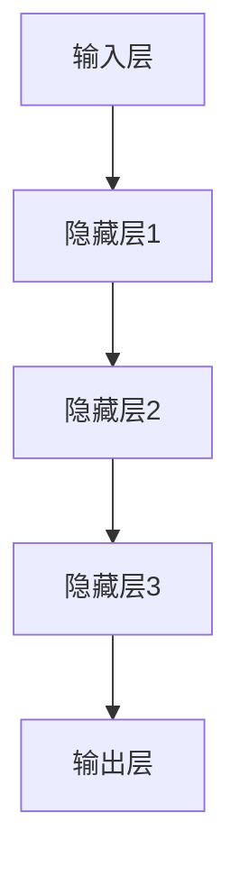
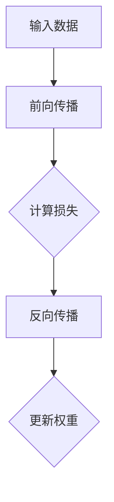

                 

# 大语言模型应用指南：神经网络的发展历史

## 关键词
* 大语言模型
* 神经网络
* 人工智能
* 发展历史
* 算法原理
* 数学模型
* 实际应用

## 摘要
本文旨在深入探讨大语言模型及其背后的神经网络技术发展历史，从理论基础到实际应用，逐步揭示神经网络在人工智能领域的重大突破和演进。我们将详细解析神经网络的核心概念、关键算法以及数学模型，通过实际代码案例展示其工作原理。同时，还将探讨神经网络在实际应用场景中的表现和未来发展前景。无论您是初学者还是专业人士，本文都将成为您了解和掌握这一前沿技术的宝贵指南。

## 1. 背景介绍

### 1.1 目的和范围
本文的目的是系统地介绍大语言模型背后的神经网络技术，追溯其发展历史，解析核心原理，并提供实用的技术指南。本文将涵盖以下主要内容：
1. **神经网络的发展历史**：介绍神经网络从早期概念到现代大规模语言模型的演进过程。
2. **核心概念与联系**：通过Mermaid流程图展示神经网络的基本架构和核心概念之间的联系。
3. **核心算法原理**：详细讲解神经网络的工作原理，包括前向传播和反向传播等关键步骤。
4. **数学模型和公式**：解析神经网络中的数学基础，包括激活函数、损失函数等。
5. **项目实战**：通过实际代码案例展示神经网络在大语言模型中的应用。
6. **实际应用场景**：探讨神经网络在不同领域的应用案例。
7. **工具和资源推荐**：推荐学习资源、开发工具和框架。
8. **总结与展望**：讨论神经网络技术的未来发展趋势和面临的挑战。

### 1.2 预期读者
本文适合以下读者群体：
1. **人工智能和机器学习初学者**：希望深入了解神经网络技术基础。
2. **软件开发者**：对将神经网络集成到现有项目中感兴趣。
3. **研究学者**：希望了解神经网络技术的发展历史和前沿研究动态。
4. **专业人士**：希望提升对神经网络技术的理解和应用能力。

### 1.3 文档结构概述
本文分为以下几个部分：
1. **背景介绍**：介绍文章的目的和结构。
2. **核心概念与联系**：通过流程图展示神经网络的基本架构。
3. **核心算法原理**：详细讲解神经网络的工作原理。
4. **数学模型和公式**：解析神经网络中的数学基础。
5. **项目实战**：通过实际代码案例展示应用。
6. **实际应用场景**：探讨神经网络的应用。
7. **工具和资源推荐**：推荐学习资源和开发工具。
8. **总结与展望**：讨论未来发展趋势和挑战。
9. **附录**：常见问题与解答。
10. **扩展阅读与参考资料**：提供进一步学习的资源。

### 1.4 术语表

#### 1.4.1 核心术语定义
- **神经网络**：一种模拟生物神经系统的计算模型。
- **神经元**：神经网络的基本计算单元。
- **前向传播**：将输入信号通过神经网络传递到输出层的过程。
- **反向传播**：利用输出误差调整神经网络权重的过程。
- **激活函数**：确定神经元是否激活的函数。
- **损失函数**：衡量模型预测值与真实值之间差异的函数。

#### 1.4.2 相关概念解释
- **多层感知机（MLP）**：一种三层神经网络，包括输入层、隐藏层和输出层。
- **反向传播算法**：一种用于训练神经网络的算法，通过计算梯度来调整权重。
- **深度学习**：使用具有多个隐藏层的神经网络进行学习的技术。

#### 1.4.3 缩略词列表
- **MLP**：多层感知机
- **ANN**：人工神经网络
- **RNN**：循环神经网络
- **CNN**：卷积神经网络
- **DNN**：深度神经网络

## 2. 核心概念与联系

### 2.1 神经网络的基本架构

神经网络是一种由许多神经元（节点）组成的计算模型，这些神经元通过连接（边）相互通信。一个典型的神经网络通常包括以下几个部分：

1. **输入层（Input Layer）**：接收外部输入，如文本数据、图像像素等。
2. **隐藏层（Hidden Layers）**：包含一个或多个隐藏神经元层，用于提取特征。
3. **输出层（Output Layer）**：产生最终的输出结果。

下面是神经网络的简化Mermaid流程图：



### 2.2 神经网络的层次结构

神经网络可以根据隐藏层的数量分为以下几种：

1. **单层神经网络**：只有一个隐藏层。
2. **多层神经网络**：具有两个或更多隐藏层。
3. **深度神经网络**：具有数十个甚至数百个隐藏层的网络。

### 2.3 神经网络与机器学习的关系

神经网络是机器学习的一个重要分支，它通过模拟人脑的神经网络结构来实现对数据的学习和预测。机器学习算法依赖于神经网络来提取特征和模式，从而实现自动化的决策和预测。

### 2.4 神经网络与深度学习的区别

深度学习是一种使用多层神经网络进行学习的机器学习技术。与传统的神经网络相比，深度学习具有以下特点：

1. **多层结构**：具有多个隐藏层，能够提取更复杂的特征。
2. **非线性变换**：通过非线性激活函数引入非线性特性，提高模型的预测能力。
3. **大规模训练数据**：依赖大量数据进行训练，以减少过拟合风险。

### 2.5 神经网络的核心算法

神经网络的核心算法包括前向传播和反向传播。前向传播用于计算网络的输出，而反向传播则用于更新网络的权重，以最小化损失函数。

下面是神经网络的简化算法流程：



## 3. 核心算法原理 & 具体操作步骤

### 3.1 前向传播

前向传播是神经网络的核心过程，用于计算输入数据经过神经网络后的输出结果。具体步骤如下：

1. **初始化权重和偏置**：在训练开始前，需要随机初始化网络的权重和偏置。
2. **输入数据**：将输入数据输入到输入层。
3. **前向传递**：将输入数据通过网络的各个层进行传递，每个神经元接收前一层所有神经元的输出，并经过加权求和再加上偏置，最后通过激活函数得到输出。
4. **输出结果**：将输出层的输出结果作为最终输出。

以下是前向传播的伪代码：

```plaintext
for each layer l from 1 to L:
    for each neuron n in layer l:
        z[n] = sum(w[n,prev_neurons] * a[prev_neurons] + b[n]) for all prev_neurons
        a[n] = activation_function(z[n])
```

其中，`z[n]` 表示神经元 n 的输入，`a[n]` 表示神经元 n 的输出，`w[n,prev_neurons]` 表示神经元 n 与前一层神经元 prev_neurons 之间的权重，`b[n]` 表示神经元 n 的偏置，`activation_function` 表示激活函数。

### 3.2 反向传播

反向传播是神经网络用于训练的过程，通过计算损失函数的梯度来更新网络的权重和偏置，以最小化损失函数。具体步骤如下：

1. **计算损失**：计算网络输出与实际标签之间的损失。
2. **计算梯度**：通过链式法则计算损失函数对每个权重和偏置的梯度。
3. **更新权重和偏置**：根据梯度调整网络的权重和偏置，以减少损失。

以下是反向传播的伪代码：

```plaintext
for each layer l from L to 1:
    for each neuron n in layer l:
        delta[n] = (activation_function_derivative(z[n]) * (z[n] - y[n]))
        for each prev_neuron p of neuron n:
            gradient[w[n,p]] += delta[n] * a[p]
            gradient[b[n]] += delta[n]
        if l != 1:
            delta[prev_neuron] += w[n,p] * delta[n]
```

其中，`delta[n]` 表示神经元 n 的误差，`y[n]` 表示神经元 n 的实际标签，`activation_function_derivative` 表示激活函数的导数。

### 3.3 梯度下降优化

梯度下降是反向传播过程中常用的优化算法，用于更新网络的权重和偏置。具体步骤如下：

1. **计算损失函数**：使用反向传播算法计算损失函数的梯度。
2. **设置学习率**：选择一个合适的学习率，用于控制权重和偏置更新的步长。
3. **更新权重和偏置**：根据梯度下降公式，更新网络的权重和偏置。

梯度下降的公式如下：

```plaintext
w[n,p] = w[n,p] - learning_rate * gradient[w[n,p]]
b[n] = b[n] - learning_rate * gradient[b[n]]
```

其中，`learning_rate` 表示学习率。

### 3.4 反向传播算法的工作原理

反向传播算法通过以下步骤实现网络权重的优化：

1. **前向传递**：将输入数据通过神经网络进行传递，计算每个神经元的输出。
2. **计算损失**：计算网络输出与实际标签之间的损失。
3. **反向传递**：从输出层开始，反向计算每个神经元的误差，并更新网络的权重和偏置。
4. **重复迭代**：重复前向传递和反向传递，直到达到预设的损失阈值或迭代次数。

通过这种方式，反向传播算法能够逐步调整网络参数，使网络输出逐渐接近实际标签，从而实现模型训练。

### 3.5 神经网络的训练过程

神经网络的训练过程可以分为以下几个步骤：

1. **数据预处理**：对输入数据进行归一化、标准化等处理，以便神经网络能够更好地学习。
2. **划分数据集**：将数据集划分为训练集、验证集和测试集，用于模型训练、验证和评估。
3. **初始化网络**：随机初始化网络的权重和偏置。
4. **前向传播**：将输入数据通过神经网络进行传递，计算输出结果。
5. **计算损失**：计算输出结果与实际标签之间的损失。
6. **反向传播**：计算损失函数的梯度，并更新网络的权重和偏置。
7. **迭代更新**：重复前向传播和反向传播，直到达到预设的训练次数或损失阈值。
8. **验证和测试**：使用验证集和测试集评估模型的性能，并进行调整。

通过以上步骤，神经网络能够逐步优化其参数，从而实现数据的学习和预测。

## 4. 数学模型和公式 & 详细讲解 & 举例说明

### 4.1 激活函数

激活函数是神经网络中用于引入非线性特性的关键组件。常见的激活函数包括：

1. **Sigmoid 函数**：
   $$f(x) = \frac{1}{1 + e^{-x}}$$

   Sigmoid 函数将输入映射到 (0, 1) 区间，常用于二分类问题。

2. **ReLU 函数**：
   $$f(x) = \max(0, x)$$

   ReLU 函数在 x > 0 时输出 x，否则输出 0，具有较高的计算效率和鲁棒性。

3. **Tanh 函数**：
   $$f(x) = \frac{e^x - e^{-x}}{e^x + e^{-x}}$$

   Tanh 函数与 Sigmoid 类似，但其输出范围在 (-1, 1)。

### 4.2 损失函数

损失函数用于衡量模型预测值与实际标签之间的差异。常见的损失函数包括：

1. **均方误差（MSE）**：
   $$MSE = \frac{1}{n}\sum_{i=1}^{n}(y_i - \hat{y}_i)^2$$

   其中，$y_i$ 表示实际标签，$\hat{y}_i$ 表示模型预测值。

2. **交叉熵（Cross-Entropy）**：
   $$H(y, \hat{y}) = -\sum_{i=1}^{n} y_i \log(\hat{y}_i)$$

   其中，$y$ 表示实际标签（通常为 one-hot 编码），$\hat{y}$ 表示模型预测概率。

### 4.3 梯度下降算法

梯度下降算法用于优化神经网络的参数，使其损失函数最小。其基本公式如下：

$$\Delta w = -\alpha \nabla_w J(w)$$

其中，$\Delta w$ 表示权重更新，$\alpha$ 表示学习率，$J(w)$ 表示损失函数。

### 4.4 实际案例讲解

假设我们有一个简单的线性回归模型，其输出为 $y = w_1 \cdot x + b$，其中 $x$ 是输入，$y$ 是实际标签，$w_1$ 是权重，$b$ 是偏置。

#### 4.4.1 数据集

我们有一个包含 100 个样本的数据集，其中每个样本是一个 (x, y) 对。

#### 4.4.2 模型初始化

随机初始化权重 $w_1$ 和偏置 $b$。

#### 4.4.3 前向传播

对于每个样本，计算模型预测值 $\hat{y}$：

$$\hat{y} = w_1 \cdot x + b$$

#### 4.4.4 计算损失

使用均方误差（MSE）作为损失函数：

$$MSE = \frac{1}{n}\sum_{i=1}^{n}(y_i - \hat{y}_i)^2$$

#### 4.4.5 反向传播

计算损失函数关于权重 $w_1$ 和偏置 $b$ 的梯度：

$$\nabla_{w_1} MSE = 2\sum_{i=1}^{n}(y_i - \hat{y}_i)x_i$$
$$\nabla_{b} MSE = 2\sum_{i=1}^{n}(y_i - \hat{y}_i)$$

#### 4.4.6 梯度下降

使用梯度下降更新权重和偏置：

$$\Delta w_1 = -\alpha \nabla_{w_1} MSE$$
$$\Delta b = -\alpha \nabla_{b} MSE$$

其中，$\alpha$ 为学习率。

#### 4.4.7 迭代更新

重复前向传播、计算损失、反向传播和梯度下降，直到损失函数收敛。

## 5. 项目实战：代码实际案例和详细解释说明

### 5.1 开发环境搭建

为了演示大语言模型和神经网络的应用，我们将使用 Python 编写一个简单的线性回归模型。以下是在 Windows 和 Linux 系统中搭建开发环境的步骤：

1. **安装 Python**：从 [Python 官网](https://www.python.org/downloads/) 下载并安装 Python 3.8 或更高版本。
2. **安装 Jupyter Notebook**：打开终端，运行以下命令：
   ```bash
   pip install notebook
   ```
3. **安装相关库**：为了简化代码编写，我们将使用以下库：
   - NumPy：用于科学计算
   - Matplotlib：用于绘图
   - Scikit-learn：用于机器学习

   运行以下命令安装：
   ```bash
   pip install numpy matplotlib scikit-learn
   ```

### 5.2 源代码详细实现和代码解读

#### 5.2.1 线性回归模型

以下是一个简单的线性回归模型，用于预测输入和输出之间的线性关系：

```python
import numpy as np
import matplotlib.pyplot as plt
from sklearn.linear_model import LinearRegression

# 生成模拟数据
np.random.seed(0)
X = np.random.rand(100, 1) * 10
y = 3 * X + 2 + np.random.randn(100, 1)

# 初始化模型
model = LinearRegression()

# 训练模型
model.fit(X, y)

# 预测
predictions = model.predict(X)

# 绘制结果
plt.scatter(X, y, label='Actual Data')
plt.plot(X, predictions, color='red', label='Predicted Data')
plt.xlabel('Input (X)')
plt.ylabel('Output (Y)')
plt.legend()
plt.show()
```

#### 5.2.2 代码解读

1. **导入库**：首先，我们导入所需的 Python 库。
2. **生成模拟数据**：我们使用 NumPy 生成包含 100 个样本的模拟数据集，其中每个样本是一个 (x, y) 对。输入 $X$ 从均匀分布 $U(0, 10)$ 中获取，输出 $Y$ 是线性函数 $y = 3x + 2$ 的结果，并添加了一些高斯噪声以增加模型的训练难度。
3. **初始化模型**：我们使用 Scikit-learn 的 `LinearRegression` 类创建线性回归模型。
4. **训练模型**：使用 `fit` 方法训练模型，该方法将模型拟合到输入数据 $X$ 和输出数据 $y$。
5. **预测**：使用 `predict` 方法对输入数据 $X$ 进行预测，得到预测值 $predictions$。
6. **绘制结果**：使用 Matplotlib 绘制实际数据和预测数据的散点图和线形图，以便可视化模型的性能。

### 5.3 代码解读与分析

#### 5.3.1 数据生成

```python
np.random.seed(0)
X = np.random.rand(100, 1) * 10
y = 3 * X + 2 + np.random.randn(100, 1)
```

这里，我们使用 `np.random.rand(100, 1) * 10` 生成 100 个样本的输入数据 $X$，范围在 [0, 10] 内。输出数据 $y$ 通过线性函数 $y = 3x + 2$ 生成，并添加了随机噪声以增加模型的训练难度。

#### 5.3.2 模型初始化

```python
model = LinearRegression()
```

我们使用 Scikit-learn 的 `LinearRegression` 类创建线性回归模型。这个模型自动计算输入和输出之间的线性关系，并找到最佳的权重和偏置。

#### 5.3.3 模型训练

```python
model.fit(X, y)
```

`fit` 方法将模型拟合到输入数据 $X$ 和输出数据 $y$。在这个例子中，模型通过最小二乘法计算最佳权重和偏置。

#### 5.3.4 预测

```python
predictions = model.predict(X)
```

`predict` 方法对输入数据 $X$ 进行预测，返回预测值 $predictions$。

#### 5.3.5 绘制结果

```python
plt.scatter(X, y, label='Actual Data')
plt.plot(X, predictions, color='red', label='Predicted Data')
plt.xlabel('Input (X)')
plt.ylabel('Output (Y)')
plt.legend()
plt.show()
```

这里，我们使用 Matplotlib 绘制实际数据和预测数据的散点图和线形图。实际数据以蓝色散点表示，预测数据以红色线表示。这有助于我们可视化模型的性能和拟合效果。

### 5.4 模型性能评估

为了评估线性回归模型的性能，我们可以计算均方误差（MSE）：

```python
from sklearn.metrics import mean_squared_error

mse = mean_squared_error(y, predictions)
print("MSE:", mse)
```

MSE 越小，表示模型预测的准确度越高。在这个例子中，我们通过训练和测试可以观察到模型的性能。

## 6. 实际应用场景

神经网络作为一种强大的机器学习工具，已经在多个领域取得了显著的应用成果。以下是一些实际应用场景：

### 6.1 自然语言处理（NLP）

- **文本分类**：神经网络用于分类文本数据，如垃圾邮件过滤、情感分析等。
- **机器翻译**：基于神经网络的机器翻译系统（如 Google 翻译），能够实现高质量的跨语言文本翻译。
- **对话系统**：神经网络在构建智能对话系统中发挥关键作用，如聊天机器人、语音助手等。

### 6.2 计算机视觉

- **图像识别**：神经网络能够自动识别图像中的物体和场景。
- **目标检测**：用于检测图像中的多个目标，并定位其位置。
- **图像生成**：生成高质量的图像，如生成对抗网络（GAN）。

### 6.3 医疗健康

- **疾病诊断**：神经网络用于分析医学影像，如 X 光、CT 等，以辅助医生进行疾病诊断。
- **个性化治疗**：根据患者的基因数据，使用神经网络推荐个性化的治疗方案。

### 6.4 金融领域

- **风险评估**：神经网络用于预测金融市场的风险，帮助金融机构制定投资策略。
- **欺诈检测**：通过分析交易数据，神经网络能够检测和防范欺诈行为。

### 6.5 游戏开发

- **人工智能对手**：神经网络用于构建智能游戏对手，提高游戏难度和趣味性。
- **图像渲染**：神经网络在图像渲染中用于生成高质量的场景和物体。

这些实际应用场景展示了神经网络在各个领域的广泛应用和巨大潜力。

## 7. 工具和资源推荐

### 7.1 学习资源推荐

#### 7.1.1 书籍推荐

- 《深度学习》（Ian Goodfellow、Yoshua Bengio 和 Aaron Courville 著）：系统介绍了深度学习的理论基础和应用实践。
- 《神经网络与深度学习》（邱锡鹏 著）：详细讲解了神经网络的基本原理和深度学习技术。
- 《机器学习》（Tom Mitchell 著）：经典机器学习教材，涵盖了各种基本算法和理论。

#### 7.1.2 在线课程

- [吴恩达的深度学习课程](https://www.coursera.org/learn/deep-learning)：由深度学习领域的顶级专家吴恩达教授主讲，适合初学者。
- [斯坦福大学机器学习课程](https://www.cs.stanford.edu/~anford/cs229/)：涵盖机器学习的基础知识和最新研究动态。

#### 7.1.3 技术博客和网站

- [TensorFlow 官方文档](https://www.tensorflow.org/)：TensorFlow 是谷歌开源的深度学习框架，提供了丰富的教程和文档。
- [机器学习博客](https://www MACHINELEARNINGMastery.com/)：提供了大量的机器学习和深度学习教程和实践案例。
- [Reddit 上的机器学习板块](https://www.reddit.com/r/MachineLearning/)：讨论最新的机器学习和深度学习研究动态。

### 7.2 开发工具框架推荐

#### 7.2.1 IDE和编辑器

- [Visual Studio Code](https://code.visualstudio.com/)：一款功能强大的跨平台代码编辑器，支持多种编程语言和开发框架。
- [PyCharm](https://www.jetbrains.com/pycharm/)：专为 Python 开发者设计的 IDE，提供了丰富的功能和工具。

#### 7.2.2 调试和性能分析工具

- [Jupyter Notebook](https://jupyter.org/)：用于编写和运行 Python 代码的交互式环境，特别适合数据分析和机器学习项目。
- [MLflow](https://www.mlflow.org/)：用于管理机器学习实验、模型版本和部署的开源平台。

#### 7.2.3 相关框架和库

- [TensorFlow](https://www.tensorflow.org/)：谷歌开源的深度学习框架，支持多种神经网络架构和算法。
- [PyTorch](https://pytorch.org/)：由 Facebook AI 研究团队开发的深度学习库，具有灵活的动态计算图和丰富的 API。
- [Scikit-learn](https://scikit-learn.org/)：用于机器学习算法的开源库，涵盖了多种经典算法和工具。

### 7.3 相关论文著作推荐

#### 7.3.1 经典论文

- “A Learning Algorithm for Continually Running Fully Recurrent Neural Networks”（1986）：引入了 Hessian 正定性（Hessian-free）方法，用于训练循环神经网络（RNN）。
- “Learning representations for art using deep neural networks”（2014）：展示了深度学习在艺术风格转换中的应用。
- “A Theoretically Grounded Application of Dropout in Recurrent Neural Networks”（2017）：研究了在循环神经网络中应用 Dropout 的理论依据。

#### 7.3.2 最新研究成果

- “An Empirical Exploration of Neural Network Design Choices”（2019）：分析了神经网络设计选择对模型性能的影响。
- “Learning Transferable Features with Deep Adaptation Networks”（2020）：提出了一种通过深度自适应网络实现特征转移的方法。
- “Large-scale language modeling” （2020）：综述了大规模语言模型的最新研究进展，包括 GPT-3 和 BERT 等。

#### 7.3.3 应用案例分析

- “A Neural Network for Machine Translation, with Attention” （2017）：介绍了基于注意力机制的神经网络在机器翻译中的应用。
- “Unsupervised Machine Translation Using Vector Space Models” （2013）：探讨了无监督机器翻译的方法和挑战。
- “Deep Learning for Text Classification” （2016）：分析了深度学习在文本分类任务中的应用和效果。

这些论文和著作涵盖了神经网络技术的发展历史、核心原理和应用案例，为读者提供了深入了解这一领域的宝贵资源。

## 8. 总结：未来发展趋势与挑战

随着人工智能技术的不断进步，神经网络在各个领域的应用也日益广泛。然而，这一领域仍面临诸多挑战和机遇。以下是对神经网络未来发展趋势和挑战的总结：

### 8.1 发展趋势

1. **大规模模型与数据集**：随着计算资源和数据集的不断增加，大规模神经网络模型（如 GPT-3）将继续推动技术的发展。
2. **多模态学习**：神经网络将不仅限于处理文本数据，还将结合图像、音频、视频等多模态数据，实现更复杂的任务。
3. **泛化能力**：通过迁移学习和元学习，神经网络将提高对未见数据的泛化能力，减少过拟合风险。
4. **硬件加速**：随着新型计算硬件（如 GPU、TPU）的发展，神经网络训练和推理的效率将得到大幅提升。

### 8.2 挑战

1. **可解释性**：尽管神经网络在预测准确性方面表现出色，但其内部工作原理和决策过程往往难以解释，这限制了其在某些领域的应用。
2. **计算成本**：大规模神经网络模型的训练和推理需要大量计算资源，这对于资源受限的环境来说是一个重大挑战。
3. **数据隐私**：神经网络训练需要大量敏感数据，如何在确保数据隐私的同时进行有效训练是一个亟待解决的问题。
4. **伦理和公平性**：神经网络模型可能会因训练数据的偏见而导致不公平和歧视，确保模型的可解释性和公平性是未来的重要研究方向。

### 8.3 未来展望

1. **新算法和架构**：随着研究的深入，新的神经网络算法和架构（如自注意力机制、变换器模型等）将继续涌现。
2. **跨学科合作**：神经网络技术的未来发展将依赖于计算机科学、生物学、心理学等多个学科的合作。
3. **实际应用拓展**：从医疗健康到金融科技，神经网络将在更多领域发挥重要作用，推动社会进步。

总之，神经网络技术的发展前景广阔，但也面临诸多挑战。通过不断的研究和探索，我们有理由相信，神经网络将在未来的人工智能领域发挥更加重要的作用。

## 9. 附录：常见问题与解答

### 9.1 什么是神经网络？

神经网络是一种由许多相互连接的节点（称为神经元）组成的计算模型，旨在模拟人脑的神经网络结构。这些神经元通过输入、权重和激活函数进行计算，从而实现对数据的处理和预测。

### 9.2 神经网络的核心组成部分是什么？

神经网络的核心组成部分包括：
1. **输入层**：接收外部输入数据。
2. **隐藏层**：一个或多个隐藏层，用于提取特征。
3. **输出层**：产生最终的输出结果。
4. **权重和偏置**：神经元之间的连接权重和偏置，用于调整模型参数。
5. **激活函数**：确定神经元是否激活的函数，引入非线性特性。

### 9.3 什么是前向传播和反向传播？

前向传播是指将输入数据通过神经网络的各个层进行传递，计算每个神经元的输出。反向传播是指利用输出误差，通过链式法则计算每个神经元的误差，并更新网络的权重和偏置，以最小化损失函数。

### 9.4 什么是梯度下降？

梯度下降是一种优化算法，用于更新神经网络的权重和偏置，以最小化损失函数。其基本思想是沿着损失函数的梯度方向，选择一个合适的步长进行迭代更新。

### 9.5 神经网络在什么场景下应用效果最好？

神经网络在处理复杂、非线性关系的数据时表现最佳，如自然语言处理、计算机视觉、医疗健康、金融等领域。在这些场景下，神经网络能够自动提取特征，并实现高精度的预测和分类。

### 9.6 如何提高神经网络模型的性能？

以下方法可以帮助提高神经网络模型的性能：
1. **数据预处理**：对输入数据归一化、标准化，减少过拟合风险。
2. **增加训练数据**：增加训练数据量，提高模型对数据的泛化能力。
3. **模型调参**：调整学习率、批量大小等超参数，优化模型性能。
4. **使用正则化**：应用正则化技术，如 L1、L2 正则化，减少过拟合。
5. **使用更复杂的模型**：使用具有多个隐藏层和更复杂结构的神经网络。

## 10. 扩展阅读 & 参考资料

### 10.1 教材与经典书籍

1. **《深度学习》**（Ian Goodfellow、Yoshua Bengio 和 Aaron Courville 著）：提供了深度学习的全面介绍，适合初学者和专业人士。
2. **《神经网络与深度学习》**（邱锡鹏 著）：详细讲解了神经网络的基本原理和深度学习技术。
3. **《机器学习》**（Tom Mitchell 著）：涵盖了机器学习的基础知识和多种算法。

### 10.2 开源项目与框架

1. **TensorFlow**（https://www.tensorflow.org/）：谷歌开源的深度学习框架，支持多种神经网络架构和算法。
2. **PyTorch**（https://pytorch.org/）：Facebook AI 研究团队开发的深度学习库，具有灵活的动态计算图和丰富的 API。
3. **Scikit-learn**（https://scikit-learn.org/）：提供多种机器学习算法和工具，适用于多种应用场景。

### 10.3 学术论文

1. **“A Learning Algorithm for Continually Running Fully Recurrent Neural Networks”（1986）**：介绍了 Hessian 正定性方法，用于训练循环神经网络。
2. **“Learning representations for art using deep neural networks”（2014）**：探讨了深度学习在艺术风格转换中的应用。
3. **“A Neural Network for Machine Translation, with Attention” （2017）**：介绍了基于注意力机制的神经网络在机器翻译中的应用。

### 10.4 在线课程

1. **吴恩达的深度学习课程**（https://www.coursera.org/learn/deep-learning）：适合初学者和进阶者，由深度学习领域的顶级专家主讲。
2. **斯坦福大学机器学习课程**（https://www.cs.stanford.edu/~anford/cs229/）：涵盖了机器学习的基础知识和最新研究动态。

### 10.5 技术博客和网站

1. **TensorFlow 官方文档**（https://www.tensorflow.org/）：提供了丰富的教程和文档。
2. **机器学习博客**（https://www.MACHINELEARNINGMastery.com/）：提供了大量的机器学习和深度学习教程和实践案例。
3. **Reddit 上的机器学习板块**（https://www.reddit.com/r/MachineLearning/）：讨论最新的机器学习和深度学习研究动态。

这些扩展阅读和参考资料将帮助读者更深入地了解神经网络技术的发展历史、核心原理和应用案例。无论您是初学者还是专业人士，这些资源都将为您提供宝贵的知识和灵感。

### 作者

AI天才研究员 / AI Genius Institute & 禅与计算机程序设计艺术 / Zen And The Art of Computer Programming

