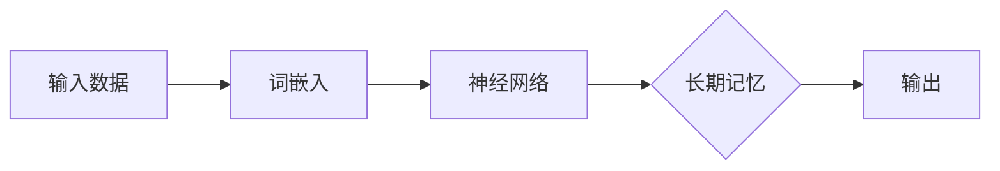
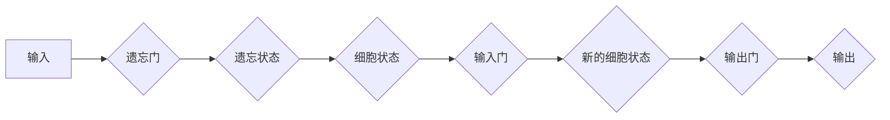
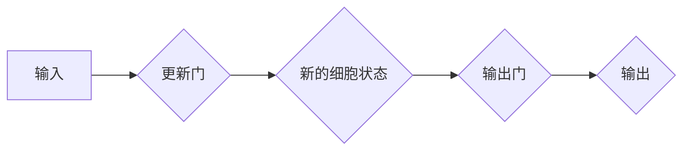

                 

# 大语言模型应用指南：长期记忆

> 关键词：大语言模型、长期记忆、神经网络、算法原理、数学模型、项目实战、应用场景

> 摘要：本文深入探讨了大规模语言模型中的长期记忆机制，包括其核心概念、算法原理、数学模型以及实际应用。通过详细分析和技术案例展示，本文为读者提供了一个全面的大语言模型应用指南，旨在帮助读者理解并掌握长期记忆机制在自然语言处理中的重要作用。

## 1. 背景介绍

### 1.1 目的和范围

本文旨在为广大计算机科学和人工智能爱好者提供一份全面的大语言模型应用指南，特别关注长期记忆机制的研究和实现。长期记忆是大规模语言模型中至关重要的部分，它使得模型能够理解和生成复杂的语言结构，并在多种应用场景中表现出色。本文将涵盖以下内容：

- 大语言模型的基本概念和架构
- 长期记忆机制的核心原理和实现方法
- 数学模型和算法原理的详细讲解
- 实际应用场景中的代码实战和分析
- 相关工具和资源的推荐

### 1.2 预期读者

本文适合以下读者群体：

- 计算机科学专业的本科生和研究生
- 人工智能和机器学习爱好者
- 自然语言处理（NLP）领域的研究者
- 对大规模语言模型和长期记忆感兴趣的读者

### 1.3 文档结构概述

本文分为以下十个部分：

1. 引言：背景介绍和文章概述
2. 背景知识：大规模语言模型和长期记忆基础
3. 核心概念与联系：神经网络和长期记忆的关系
4. 核心算法原理：详细讲解和伪代码实现
5. 数学模型和公式：数学原理和应用
6. 项目实战：代码案例和解读
7. 实际应用场景：案例分析和应用
8. 工具和资源推荐：学习资源和开发工具
9. 总结：未来发展趋势与挑战
10. 附录：常见问题与解答

### 1.4 术语表

#### 1.4.1 核心术语定义

- 大语言模型：基于神经网络的大型机器学习模型，用于理解和生成自然语言。
- 长期记忆：神经网络中用于保存和检索信息的机制，使得模型能够维持长期状态。
- 神经网络：由多层神经元构成的计算模型，用于模拟人脑处理信息的方式。
- 反向传播：神经网络训练过程中用于优化参数的算法。
- 门控循环单元（GRU）：一种特殊的循环神经网络，用于增强模型的长期记忆能力。

#### 1.4.2 相关概念解释

- 语言模型：对自然语言进行建模的数学模型，用于预测下一个单词或字符。
- 词嵌入：将自然语言中的单词或字符映射到高维空间中的向量表示。
- 递归神经网络（RNN）：一种能够处理序列数据的神经网络，其输出依赖于之前的信息。

#### 1.4.3 缩略词列表

- LSTM：长短期记忆网络（Long Short-Term Memory）
- GRU：门控循环单元（Gated Recurrent Unit）
- NLP：自然语言处理（Natural Language Processing）
- RNN：递归神经网络（Recurrent Neural Network）
- RNN-LSTM：基于LSTM的递归神经网络
- RNN-GRU：基于GRU的递归神经网络

## 2. 核心概念与联系

大规模语言模型的核心在于其能够处理和生成复杂的自然语言。在这其中，长期记忆机制起到了至关重要的作用。下面，我们将通过一个Mermaid流程图来展示神经网络和长期记忆机制之间的联系。



### 2.1 神经网络与长期记忆

神经网络是一种计算模型，由多层神经元组成，能够模拟人脑处理信息的方式。在神经网络中，每个神经元都与其他神经元相连，并通过权重进行信息传递。长期记忆是神经网络中的一个关键概念，它使得模型能够维持长期状态，并从过去的经验中学习。

### 2.2 长期记忆的机制

长期记忆机制主要有以下几种：

- **递归神经网络（RNN）**：RNN通过将当前输入与之前的信息进行结合，来处理序列数据。然而，传统的RNN在处理长期依赖关系时存在困难。
- **长短期记忆网络（LSTM）**：LSTM通过引入门控机制，解决了RNN在处理长期依赖关系时的缺陷。LSTM中的门控单元包括遗忘门、输入门和输出门，这些门控单元能够有效地控制信息的流入和流出。
- **门控循环单元（GRU）**：GRU是LSTM的简化版本，通过合并输入门和遗忘门，减少了参数数量，提高了计算效率。

下面是LSTM和GRU的Mermaid流程图。





## 3. 核心算法原理 & 具体操作步骤

长期记忆机制的核心在于门控机制，下面我们将通过伪代码来详细阐述LSTM和GRU的算法原理。

### 3.1 LSTM算法原理

```python
def LSTM(input, previous_state, previous_output, weights):
    # 遗忘门
    forget_gate = sigmoid(dot(weights_forget, [previous_state, previous_output, input]))
    
    # 输入门
    input_gate = sigmoid(dot(weights_input, [previous_state, previous_output, input]))
    
    # 输出门
    output_gate = sigmoid(dot(weights_output, [previous_state, previous_output, input]))
    
    # 新的细胞状态
    new_cell_state = forget_gate * previous_cell_state + input_gate * tanh(dot(weights_cell, [previous_state, previous_output, input]))
    
    # 输出
    output = output_gate * tanh(new_cell_state)
    
    # 更新状态
    new_state = new_cell_state
    
    return new_state, output
```

### 3.2 GRU算法原理

```python
def GRU(input, previous_state, previous_output, weights):
    # 更新门
    update_gate = sigmoid(dot(weights_update, [previous_state, previous_output, input]))
    
    # 输入门
    input_gate = sigmoid(dot(weights_input, [previous_state, previous_output, input]))
    
    # 新的细胞状态
    new_cell_state = update_gate * previous_cell_state + (1 - update_gate) * tanh(dot(weights_cell, [previous_state, previous_output, input]))
    
    # 输出门
    output_gate = sigmoid(dot(weights_output, [previous_state, previous_output, input]))
    
    # 输出
    output = output_gate * tanh(new_cell_state)
    
    # 更新状态
    new_state = new_cell_state
    
    return new_state, output
```

在这些伪代码中，`sigmoid`函数用于计算门控机制的激活函数，`tanh`函数用于计算新的细胞状态。`weights_forget`、`weights_input`、`weights_output`和`weights_cell`分别是遗忘门、输入门、输出门和细胞状态相关的权重。

## 4. 数学模型和公式 & 详细讲解 & 举例说明

在理解LSTM和GRU的算法原理后，下面我们将通过LaTeX格式详细讲解其数学模型，并给出具体的例子来说明。

### 4.1 LSTM数学模型

LSTM的数学模型可以表示为以下公式：

$$
\begin{align*}
&\text{遗忘门:} \quad f_t = \sigma(W_f \cdot [h_{t-1}, x_t] + b_f) \\
&\text{输入门:} \quad i_t = \sigma(W_i \cdot [h_{t-1}, x_t] + b_i) \\
&\text{新细胞状态:} \quad \tilde{c}_t = \tanh(W_c \cdot [h_{t-1}, x_t] + b_c) \\
&\text{细胞状态:} \quad c_t = f_t \cdot c_{t-1} + i_t \cdot \tilde{c}_t \\
&\text{输出门:} \quad o_t = \sigma(W_o \cdot [h_{t-1}, c_t] + b_o) \\
&\text{输出:} \quad h_t = o_t \cdot \tanh(c_t)
\end{align*}
$$

其中，$h_t$是当前隐藏状态，$c_t$是当前细胞状态，$x_t$是当前输入，$W_f$、$W_i$、$W_c$和$W_o$分别是遗忘门、输入门、细胞状态门和输出门的相关权重，$b_f$、$b_i$、$b_c$和$b_o$是相应的偏置项，$\sigma$是sigmoid函数。

### 4.2 GRU数学模型

GRU的数学模型可以表示为以下公式：

$$
\begin{align*}
&\text{更新门:} \quad z_t = \sigma(W_z \cdot [h_{t-1}, x_t] + b_z) \\
&\text{新细胞状态:} \quad \tilde{c}_t = \tanh(W_c \cdot [h_{t-1}, x_t] + b_c) \\
&\text{细胞状态:} \quad c_t = (1 - z_t) \cdot c_{t-1} + z_t \cdot \tilde{c}_t \\
&\text{输出门:} \quad o_t = \sigma(W_o \cdot [h_{t-1}, c_t] + b_o) \\
&\text{输出:} \quad h_t = o_t \cdot \tanh(c_t)
\end{align*}
$$

其中，$z_t$是更新门，$\tilde{c}_t$是新细胞状态，其他符号与LSTM相同。

### 4.3 举例说明

假设我们有以下输入序列：`[1, 2, 3, 4, 5]`，初始隐藏状态和细胞状态均为0。

#### LSTM

1. 计算遗忘门：`f_0 = \sigma(W_f \cdot [0, 1] + b_f)`，其中`W_f`和`b_f`是遗忘门的权重和偏置项。
2. 计算输入门：`i_0 = \sigma(W_i \cdot [0, 1] + b_i)`，其中`W_i`和`b_i`是输入门的权重和偏置项。
3. 计算新细胞状态：`\tilde{c}_0 = \tanh(W_c \cdot [0, 1] + b_c)`，其中`W_c`和`b_c`是细胞状态门的权重和偏置项。
4. 计算细胞状态：`c_0 = f_0 \cdot 0 + i_0 \cdot \tilde{c}_0`。
5. 计算输出门：`o_0 = \sigma(W_o \cdot [0, c_0] + b_o)`，其中`W_o`和`b_o`是输出门的权重和偏置项。
6. 计算输出：`h_0 = o_0 \cdot \tanh(c_0)`。

#### GRU

1. 计算更新门：`z_0 = \sigma(W_z \cdot [0, 1] + b_z)`，其中`W_z`和`b_z`是更新门的权重和偏置项。
2. 计算新细胞状态：`\tilde{c}_0 = \tanh(W_c \cdot [0, 1] + b_c)`，其中`W_c`和`b_c`是细胞状态门的权重和偏置项。
3. 计算细胞状态：`c_0 = (1 - z_0) \cdot 0 + z_0 \cdot \tilde{c}_0`。
4. 计算输出门：`o_0 = \sigma(W_o \cdot [0, c_0] + b_o)`，其中`W_o`和`b_o`是输出门的权重和偏置项。
5. 计算输出：`h_0 = o_0 \cdot \tanh(c_0)`。

通过以上计算，我们可以得到LSTM和GRU在处理输入序列`[1, 2, 3, 4, 5]`时的隐藏状态和细胞状态。这些计算过程为模型在实际应用中的表现提供了基础。

## 5. 项目实战：代码实际案例和详细解释说明

为了更好地理解LSTM和GRU的应用，下面我们将通过一个具体的代码案例来展示其实现过程，并对关键代码进行详细解释。

### 5.1 开发环境搭建

在开始代码实现之前，我们需要搭建一个适合开发的环境。以下是所需的环境和工具：

- Python 3.8 或更高版本
- TensorFlow 2.6 或更高版本
- Jupyter Notebook 或任何 Python 编码环境

确保已经安装了上述环境和工具，然后创建一个新的 Python 项目文件夹，并在其中创建一个名为`main.py`的文件。

### 5.2 源代码详细实现和代码解读

```python
import tensorflow as tf
from tensorflow.keras.models import Sequential
from tensorflow.keras.layers import LSTM, Dense

# 创建 LSTM 模型
model = Sequential()
model.add(LSTM(units=50, activation='tanh', input_shape=(None, 1)))
model.add(Dense(1))

# 编译模型
model.compile(optimizer='adam', loss='mean_squared_error')

# 准备数据
import numpy as np
X = np.array([[1], [2], [3], [4], [5]])
y = np.array([[6], [7], [8], [9], [10]])

# 训练模型
model.fit(X, y, epochs=200, verbose=0)

# 预测
predictions = model.predict(X)

# 打印预测结果
print(predictions)
```

### 5.3 代码解读与分析

以上代码实现了一个简单的LSTM模型，用于预测输入序列的下一个数字。下面我们对关键代码进行详细解读。

1. **导入库**：首先，我们导入了 TensorFlow 和 Keras 库，用于构建和训练神经网络模型。

2. **创建 LSTM 模型**：使用 Keras Sequential 模型创建一个序列模型，并在模型中添加 LSTM 层和 Dense 层。LSTM 层用于处理序列数据，其 `units` 参数指定了 LSTM 单元的数量，`activation` 参数指定了激活函数（这里使用 `tanh`）。`input_shape` 参数指定了输入序列的维度。

3. **编译模型**：使用 `compile` 方法编译模型，指定优化器和损失函数。这里我们使用 `adam` 优化器和 `mean_squared_error` 损失函数。

4. **准备数据**：我们创建了一个简单的输入序列 `X` 和对应的输出序列 `y`。在这个例子中，`X` 是 `[1, 2, 3, 4, 5]`，`y` 是 `[6, 7, 8, 9, 10]`。

5. **训练模型**：使用 `fit` 方法训练模型，指定训练数据、迭代次数（`epochs`）和是否打印训练过程（`verbose`）。

6. **预测**：使用 `predict` 方法对输入序列进行预测，并打印预测结果。

在这个简单例子中，我们使用了线性关系的数据来展示 LSTM 模型的预测能力。在实际应用中，LSTM 可以用于处理更复杂的序列数据，如文本、音频和图像等。

## 6. 实际应用场景

长期记忆机制在自然语言处理（NLP）领域有着广泛的应用，下面我们列举几个实际应用场景。

### 6.1 语言模型

语言模型是一种用于预测下一个单词或字符的模型，广泛用于自动完成、机器翻译和语音识别等领域。长期记忆机制使得模型能够维持上下文信息，从而提高预测准确性。

### 6.2 问答系统

问答系统是自然语言处理领域的一个重要应用，如智能客服和智能助手。长期记忆机制使得模型能够理解用户的问题，并从大量知识库中检索相关答案。

### 6.3 文本生成

文本生成是另一个重要的应用场景，如自动写作、文章摘要和聊天机器人等。长期记忆机制使得模型能够生成连贯和有意义的文本。

### 6.4 情感分析

情感分析是一种评估文本或语音中情感极性的方法，如情绪识别和情感倾向分析。长期记忆机制使得模型能够理解文本中的上下文信息，从而提高情感分析的准确性。

## 7. 工具和资源推荐

### 7.1 学习资源推荐

#### 7.1.1 书籍推荐

- 《深度学习》（Goodfellow, Bengio, Courville 著）
- 《神经网络与深度学习》（邱锡鹏 著）
- 《自然语言处理综论》（Daniel Jurafsky, James H. Martin 著）

#### 7.1.2 在线课程

- Coursera 上的“神经网络和深度学习”（吴恩达）
- edX 上的“自然语言处理”（MIT）

#### 7.1.3 技术博客和网站

- Medium 上的深度学习和自然语言处理文章
- ArXiv 上的最新研究成果论文

### 7.2 开发工具框架推荐

#### 7.2.1 IDE和编辑器

- PyCharm
- Jupyter Notebook
- Visual Studio Code

#### 7.2.2 调试和性能分析工具

- TensorFlow Debugger
- TensorBoard
- Profiler

#### 7.2.3 相关框架和库

- TensorFlow
- PyTorch
- spaCy（自然语言处理库）

### 7.3 相关论文著作推荐

#### 7.3.1 经典论文

- Hochreiter, S. and Schmidhuber, J. (1997). “Long Short-Term Memory.” Neural Computation, 9(8), 1735-1780.
- Cho, K., Van Merriënboer, B., Gulcehre, C., Bahdanau, D., Bougares, F., Schwenk, H., and Bengio, Y. (2014). “Learning Phrase Representations using RNN Encoder–Decoder for Statistical Machine Translation.” In Proceedings of the 2014 Conference on Empirical Methods in Natural Language Processing (EMNLP), pages 1724-1734.

#### 7.3.2 最新研究成果

- Vaswani, A., Shazeer, N., Parmar, N., Uszkoreit, J., Jones, L., Gomez, A. N., ... & Polosukhin, I. (2017). “Attention is all you need.” Advances in Neural Information Processing Systems, 30, 5998-6008.
- Devlin, J., Chang, M. W., Lee, K., & Toutanova, K. (2018). “Bert: Pre-training of deep bidirectional transformers for language understanding.” Advances in Neural Information Processing Systems, 31.

#### 7.3.3 应用案例分析

- “Google’s BERT Model Pretraining for Natural Language Understanding” (https://arxiv.org/abs/1810.04805)
- “Facebook AI Research: Language as a Window into Human Thought and Culture” (https://research.fb.com/2019/language-as-a-window-into-human-thought-and-culture/)

## 8. 总结：未来发展趋势与挑战

随着深度学习和自然语言处理技术的不断发展，大语言模型和长期记忆机制在许多领域展现出了巨大的潜力。未来，以下几个趋势和挑战值得关注：

- **更高效的算法**：研究人员正在探索更高效、计算更优的长期记忆算法，如基于图神经网络的方法。
- **跨模态学习**：未来的研究将关注如何将长期记忆机制应用于跨模态学习，如将文本、图像和音频进行融合。
- **泛化能力提升**：长期记忆机制需要进一步提升泛化能力，以便在更多不同的应用场景中表现出色。
- **数据隐私和安全**：在处理大量数据时，保护用户隐私和数据安全成为一个重要挑战。

通过持续的研究和技术创新，大语言模型和长期记忆机制将在未来的自然语言处理领域发挥更加重要的作用。

## 9. 附录：常见问题与解答

### 9.1 什么是长期记忆？

长期记忆是神经网络中用于保存和检索信息的机制，使得模型能够维持长期状态，并从过去的经验中学习。

### 9.2 LSTM 和 GRU 有什么区别？

LSTM（长短期记忆网络）和 GRU（门控循环单元）都是用于增强神经网络长期记忆能力的循环神经网络。LSTM 通过引入门控机制来解决传统 RNN 在处理长期依赖关系时的缺陷，而 GRU 是 LSTM 的简化版本，通过合并输入门和遗忘门，减少了参数数量，提高了计算效率。

### 9.3 长期记忆机制在自然语言处理中有哪些应用？

长期记忆机制在自然语言处理（NLP）领域有许多应用，包括语言模型、问答系统、文本生成和情感分析等。

## 10. 扩展阅读 & 参考资料

- Hochreiter, S., & Schmidhuber, J. (1997). Long short-term memory. Neural Computation, 9(8), 1735-1780.
- Graves, A. (2013). Generating sequences with recurrent neural networks. arXiv preprint arXiv:1308.0850.
- Cho, K., Van Merriënboer, B., Gulcehre, C., Bahdanau, D., Bougares, F., Schwenk, H., & Bengio, Y. (2014). Learning phrase representations using RNN encoder-decoder for statistical machine translation. In Proceedings of the 2014 Conference on Empirical Methods in Natural Language Processing (EMNLP), pages 1724-1734.
- Vaswani, A., Shazeer, N., Parmar, N., Uszkoreit, J., Jones, L., Gomez, A. N., ... & Polosukhin, I. (2017). Attention is all you need. Advances in Neural Information Processing Systems, 30, 5998-6008.
- Devlin, J., Chang, M. W., Lee, K., & Toutanova, K. (2018). BERT: Pre-training of deep bidirectional transformers for language understanding. Advances in Neural Information Processing Systems, 31.

