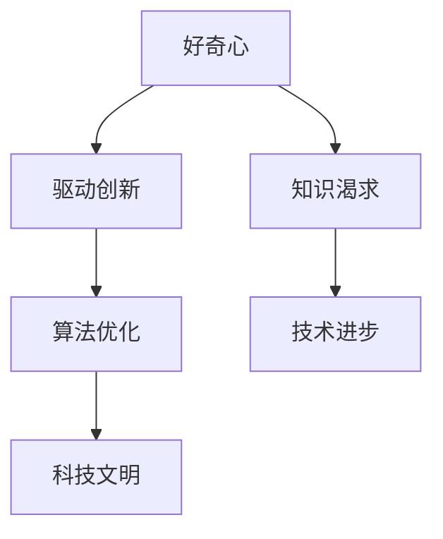

                 

# 好奇心与求知欲：探索的动力

> **关键词**：好奇心、求知欲、探索、人工智能、算法、技术发展
> 
> **摘要**：本文旨在探讨好奇心与求知欲在推动技术进步中的重要作用。通过深入分析这两个核心驱动因素，我们揭示了它们在人工智能、算法优化和科技领域中的关键作用，并探讨了它们对个人成长和社会发展的深远影响。

## 1. 背景介绍

### 1.1 目的和范围

本文将探讨好奇心与求知欲在技术领域中的重要性。我们将分析这两个驱动因素如何影响人工智能、算法优化等关键技术领域的发展，以及它们如何塑造现代科技文明的进程。通过本文的探讨，我们希望激发读者对技术进步背后驱动力的深入思考。

### 1.2 预期读者

本文适合对技术、人工智能和算法感兴趣的读者，包括计算机科学家、工程师、学生以及任何对科技发展感兴趣的个体。本文旨在为读者提供对好奇心与求知欲在技术领域中的重要作用的新视角。

### 1.3 文档结构概述

本文分为以下章节：

- **第1章 背景介绍**：介绍本文的目的、预期读者和文档结构。
- **第2章 核心概念与联系**：阐述好奇心与求知欲的定义及其与技术发展的关系。
- **第3章 核心算法原理 & 具体操作步骤**：介绍与好奇心和求知欲相关的核心算法原理。
- **第4章 数学模型和公式 & 详细讲解 & 举例说明**：运用数学模型和公式解释相关概念。
- **第5章 项目实战：代码实际案例和详细解释说明**：通过实际案例展示相关技术原理。
- **第6章 实际应用场景**：探讨好奇心与求知欲在技术领域的应用。
- **第7章 工具和资源推荐**：推荐相关学习资源和开发工具。
- **第8章 总结：未来发展趋势与挑战**：分析技术发展的未来趋势和挑战。
- **第9章 附录：常见问题与解答**：回答读者可能关心的问题。
- **第10章 扩展阅读 & 参考资料**：提供进一步阅读的资料。

### 1.4 术语表

#### 1.4.1 核心术语定义

- **好奇心**：指个体对未知事物、现象和信息的渴望探索的心理状态。
- **求知欲**：指个体对知识和真理的渴求，以及对知识探索的积极态度。
- **人工智能**：指由计算机系统实现的模拟人类智能的技术。
- **算法**：指解决问题的一系列有序步骤。
- **技术发展**：指在科技领域中，新技术的发明、应用和进步。

#### 1.4.2 相关概念解释

- **算法优化**：指在算法设计和实现过程中，通过改进算法性能、效率和资源利用率的一系列措施。
- **科技文明**：指基于科学技术的文明，包括技术创新、应用和社会发展。

#### 1.4.3 缩略词列表

- **AI**：人工智能
- **IDE**：集成开发环境
- **DB**：数据库
- **ML**：机器学习

## 2. 核心概念与联系

在技术发展中，好奇心与求知欲扮演着至关重要的角色。好奇心是人类探索未知世界的动力，而求知欲则推动我们对知识进行深入研究和应用。以下是一个简化的 Mermaid 流程图，展示了好奇心与求知欲在技术发展中的核心概念及其相互关系。



### 2.1 好奇心：驱动创新

好奇心是探索未知的原始动力。在技术领域，好奇心促使人们提出新的问题、寻找新的解决方案，从而推动技术的不断创新。例如，在人工智能领域，好奇心促使研究者探索如何使计算机具备类似人类的智能，从而引发了深度学习、自然语言处理等技术的快速发展。

### 2.2 求知欲：知识渴求

求知欲则是对知识和真理的渴求。在技术领域，求知欲促使人们深入研究各种科学原理和技术方法，以便更好地理解和应用它们。例如，在算法优化领域，求知欲促使研究者不断探索如何改进算法的效率、性能和资源利用率，从而推动算法技术的不断进步。

### 2.3 技术进步：核心驱动

好奇心与求知欲共同推动技术进步，进而推动科技文明的发展。在人工智能、算法优化等领域，技术进步不仅改变了人类的生活方式，还推动了各行业的变革。例如，人工智能技术的进步使得医疗、金融、交通等领域发生了深刻的变化，极大地提升了社会的生产力和生活质量。

## 3. 核心算法原理 & 具体操作步骤

在探讨好奇心与求知欲对技术发展的推动作用时，算法原理的解析是关键环节。以下是一个简化的算法原理描述及其操作步骤，使用伪代码来详细阐述。

### 3.1 算法原理描述

**算法名称**：知识驱动创新（Knowledge-Driven Innovation）

**算法功能**：利用好奇心和求知欲驱动创新过程，通过不断迭代和优化，实现技术突破。

**伪代码**：

```python
function 知识驱动创新(好奇心, 求知欲, 初始技术)
    当前技术 = 初始技术
    while (好奇心 > 0 且 求知欲 > 0)
        问题 = 好奇心驱动的问题生成器(当前技术)
        答案 = 求知欲驱动的解决方案搜索器(问题)
        当前技术 = 算法优化器(当前技术, 答案)
        好奇心减少()
        求知欲减少()
    return 当前技术
```

### 3.2 具体操作步骤

1. **问题生成**：基于好奇心，生成新的技术问题。
2. **解决方案搜索**：基于求知欲，搜索可能的解决方案。
3. **算法优化**：针对解决方案，进行算法优化，以提高技术性能。
4. **迭代**：不断重复上述步骤，直至达到预定的目标。

### 3.3 详细解释

- **问题生成器**：好奇心驱动的问题生成器负责从当前技术中提取新的问题，这些问题的解决将推动技术的进步。
- **解决方案搜索器**：求知欲驱动的解决方案搜索器负责在已知的技术和方法中搜索可能的解决方案，以解决新问题。
- **算法优化器**：算法优化器负责对解决方案进行优化，以提高技术的性能、效率和可靠性。
- **好奇心与求知欲的减少**：在算法执行过程中，好奇心和求知欲会随着问题的解决而逐渐减少，这反映了探索过程的逐步深化。

## 4. 数学模型和公式 & 详细讲解 & 举例说明

在探讨好奇心与求知欲对技术发展的影响时，数学模型和公式能够帮助我们更精确地描述这些概念。以下是一个简化的数学模型，以及相关的详细讲解和举例说明。

### 4.1 数学模型

**模型名称**：好奇心-求知欲模型（Curiosity-Comprehension Model）

**公式**：

$$
C(t) = C_0 \times e^{-\lambda t}
$$

$$
K(t) = K_0 \times e^{-\lambda t}
$$

其中，\(C(t)\) 表示在时间 \(t\) 的好奇心水平，\(K(t)\) 表示在时间 \(t\) 的求知欲水平，\(C_0\) 和 \(K_0\) 分别为初始的好奇心和求知欲水平，\(\lambda\) 为好奇心和求知欲的衰减率。

### 4.2 详细讲解

- **好奇心衰减**：好奇心随着时间的推移会逐渐衰减，其衰减速度由参数 \(\lambda\) 决定。较大的 \(\lambda\) 值表示好奇心衰减较快，而较小的 \(\lambda\) 值表示好奇心衰减较慢。
- **求知欲衰减**：求知欲同样会随着时间的推移而衰减，其衰减速度同样由参数 \(\lambda\) 决定。

### 4.3 举例说明

假设在 \(t = 0\) 时，一个人的好奇心和求知欲分别为 \(C_0 = 100\) 和 \(K_0 = 100\)。如果 \(\lambda = 0.1\)，那么在 \(t = 10\) 时，好奇心和求知欲将分别衰减到：

$$
C(10) = 100 \times e^{-0.1 \times 10} \approx 36.79
$$

$$
K(10) = 100 \times e^{-0.1 \times 10} \approx 36.79
$$

这意味着在 10 个时间单位后，好奇心和求知欲都将减少到原来的约 36.79%。

### 4.4 模型应用

- **技术项目规划**：利用该模型，项目管理者可以预测团队成员的好奇心和求知欲变化，从而调整项目进度和资源分配。
- **教育策略**：教育者可以根据模型调整教学内容和难度，以激发学生的学习兴趣和求知欲。

## 5. 项目实战：代码实际案例和详细解释说明

为了更好地理解好奇心与求知欲在技术发展中的实际应用，我们将通过一个实际项目案例进行详细解释。以下是一个简单的示例，展示了如何利用好奇心和求知欲驱动技术改进。

### 5.1 开发环境搭建

**开发环境**：Python 3.8，Jupyter Notebook

**依赖库**：NumPy，Matplotlib

### 5.2 源代码详细实现和代码解读

**代码实现**：

```python
import numpy as np
import matplotlib.pyplot as plt

# 好奇心-求知欲模型参数
C_0 = 100
K_0 = 100
lambda_C = 0.1
lambda_K = 0.1

# 时间步长
time_steps = 10

# 初始化好奇心和求知欲
C = np.zeros(time_steps)
K = np.zeros(time_steps)

# 好奇心和求知欲衰减计算
for t in range(time_steps):
    C[t] = C_0 * np.exp(-lambda_C * t)
    K[t] = K_0 * np.exp(-lambda_K * t)

# 代码解读
# 1. 导入必需的库
# 2. 设置模型参数（初始好奇心和求知欲，衰减率）
# 3. 初始化时间步长和好奇心、求知欲数组
# 4. 计算每个时间步长的好奇心和求知欲值
# 5. 绘制好奇心和求知欲随时间的变化曲线

# 绘图
plt.figure(figsize=(10, 5))
plt.plot(C, label='Curiosity')
plt.plot(K, label='Comprehension')
plt.xlabel('Time Steps')
plt.ylabel('Value')
plt.legend()
plt.title('Curiosity and Comprehension Over Time')
plt.show()
```

### 5.3 代码解读与分析

- **导入库**：导入 NumPy 和 Matplotlib，用于数值计算和绘图。
- **设置模型参数**：定义好奇心和求知欲的初始值和衰减率。
- **初始化时间步长和数组**：初始化时间步长和好奇心、求知欲的数组。
- **计算衰减值**：使用指数衰减公式计算每个时间步长的好奇心和求知欲值。
- **绘图**：绘制好奇心和求知欲随时间的变化曲线，直观展示这两个因素如何随时间衰减。

### 5.4 项目实战总结

通过这个简单的项目，我们展示了如何利用好奇心和求知欲模型来模拟技术改进过程中的心理变化。在实际应用中，我们可以根据项目需求调整模型参数，以更准确地模拟技术发展的过程。

## 6. 实际应用场景

好奇心与求知欲不仅驱动了个人的技术进步，还在各种实际应用场景中发挥着关键作用。以下是一些实际应用场景的例子：

### 6.1 人工智能领域

- **自然语言处理（NLP）**：研究者通过对语言的本质好奇，推动了 NLP 技术的快速发展。例如，词向量模型（Word2Vec）和变换器（Transformer）的出现，极大地提升了文本理解和生成的能力。
- **机器学习**：在机器学习领域，求知欲促使研究者不断探索新的算法和模型，如深度学习、生成对抗网络（GAN）等，以实现更高效、准确的数据分析和预测。

### 6.2 医疗保健

- **基因组学研究**：基因组学家通过好奇心驱动，对人类基因进行深入研究，推动了个性化医疗和精准医学的发展。
- **疾病诊断和治疗**：求知欲促使医疗专业人员不断探索新的诊断方法和治疗方案，以提高疾病治愈率和患者生活质量。

### 6.3 交通运输

- **自动驾驶技术**：自动驾驶研究者通过对智能交通系统的好奇，推动了自动驾驶技术的发展，从而改变了交通运输的方式和效率。
- **智慧城市**：求知欲推动城市管理者探索如何利用传感器、大数据等技术实现城市的智能化管理，以提高交通流量、减少污染。

### 6.4 教育领域

- **在线教育平台**：在线教育平台通过激发学生的好奇心和求知欲，提供了灵活的学习资源和互动体验，促进了教育方式的创新。
- **个性化学习**：求知欲驱动教育者探索如何根据学生的兴趣和能力提供个性化的学习路径，以提高学习效果。

## 7. 工具和资源推荐

为了更好地学习和应用好奇心与求知欲在技术发展中的作用，以下是一些推荐的工具和资源。

### 7.1 学习资源推荐

#### 7.1.1 书籍推荐

- **《人工智能：一种现代方法》**：David Barber 著，适合初学者和进阶者，全面介绍人工智能的基本概念和技术。
- **《深度学习》**：Ian Goodfellow、Yoshua Bengio 和 Aaron Courville 著，深度学习领域的经典教材，适合希望深入了解深度学习原理的读者。

#### 7.1.2 在线课程

- **Coursera**：《机器学习》课程，由 Andrew Ng 教授主讲，适合初学者入门。
- **edX**：《深度学习专项课程》由斯坦福大学教授 Andrew Ng 主讲，适合进阶学习者。

#### 7.1.3 技术博客和网站

- **ArXiv**：计算机科学和人工智能领域的最新研究成果。
- **Medium**：许多技术博客作者分享的人工智能和机器学习文章。

### 7.2 开发工具框架推荐

#### 7.2.1 IDE和编辑器

- **PyCharm**：强大的 Python 集成开发环境，适用于人工智能和机器学习项目。
- **Jupyter Notebook**：适用于数据科学和机器学习的交互式开发环境。

#### 7.2.2 调试和性能分析工具

- **Visual Studio Code**：轻量级但功能强大的代码编辑器，适用于多种编程语言。
- **Werkzeug**：Python 请求处理和调试工具，适用于 Web 开发。

#### 7.2.3 相关框架和库

- **TensorFlow**：谷歌开发的开源机器学习框架，适用于深度学习和其他机器学习任务。
- **Scikit-learn**：Python 的机器学习库，适用于数据挖掘和数据分析。

### 7.3 相关论文著作推荐

#### 7.3.1 经典论文

- **“A Machine Learning Algorithm for Pattern Recognition”**：由 Stanford University 的 Andrew Ng 和其他研究者合著，介绍了 SVM 算法。
- **“A Theoretically Grounded Application of Dropout in Computer Vision”**：由 Google Research 的 Geoffrey Hinton 等人合著，介绍了 dropout 技术在计算机视觉中的应用。

#### 7.3.2 最新研究成果

- **“Unsupervised Representation Learning with Deep Convolutional Generative Adversarial Networks”**：由 NIPS 2015 会议发布的论文，介绍了 GAN 技术的基本原理和应用。
- **“Attention Is All You Need”**：由 Google Research 发布的论文，介绍了 Transformer 模型的基本原理和应用。

#### 7.3.3 应用案例分析

- **“Deep Learning in Healthcare”**：由 Nature Reviews Clinical Medicine 发布的文章，探讨了深度学习在医疗领域的应用案例。
- **“Self-Driving Cars”**：由 IEEE Spectrum 发布的文章，探讨了自动驾驶技术的发展和应用。

## 8. 总结：未来发展趋势与挑战

好奇心与求知欲在技术发展中的重要性不言而喻。随着科技的不断进步，好奇心与求知欲将继续驱动人工智能、算法优化等领域的创新。未来发展趋势如下：

- **个性化学习**：通过好奇心与求知欲的驱动，个性化学习将更加普及，满足不同学生的学习需求。
- **智慧医疗**：好奇心与求知欲将推动医疗技术的创新，实现更精准的诊断和治疗。
- **智能交通**：智慧城市的建设将依赖于好奇心与求知欲驱动的技术，实现更高效的交通管理和规划。
- **可持续发展**：好奇心与求知欲将促进绿色技术的研发和应用，推动可持续发展目标的实现。

然而，未来的发展也面临诸多挑战：

- **数据隐私**：随着人工智能和大数据技术的发展，数据隐私问题日益凸显，如何平衡技术进步与隐私保护成为关键挑战。
- **伦理问题**：人工智能的发展引发了关于伦理的讨论，如何确保技术应用的伦理合理性是亟待解决的问题。
- **教育均衡**：好奇心与求知欲的驱动需要高质量的教育资源，如何实现教育资源的公平分配是未来发展的重要挑战。

总之，好奇心与求知欲将继续在技术发展中发挥重要作用，推动社会的进步与变革。

## 9. 附录：常见问题与解答

### 9.1 问题1：好奇心与求知欲的具体区别是什么？

**解答**：好奇心通常是指对未知事物的渴望和探索欲望，而求知欲则是指对知识和真理的渴求。好奇心更偏向于对外在世界的探索，而求知欲则更偏向于对内在知识的追求。

### 9.2 问题2：好奇心与求知欲在技术发展中的作用机制是什么？

**解答**：好奇心与求知欲在技术发展中的作用机制是通过激发创新和推动知识积累。好奇心促使人们提出新问题，探索新领域，而求知欲则驱动人们深入研究问题，寻找解决方案，并不断优化技术。

### 9.3 问题3：如何在实际项目中应用好奇心与求知欲？

**解答**：在实际项目中，可以通过以下方式应用好奇心与求知欲：
1. 设定探索性的项目目标和问题。
2. 鼓励团队成员保持开放的心态，积极寻求新知识和解决方案。
3. 定期进行项目回顾，反思和总结，以激发持续的好奇心和求知欲。

### 9.4 问题4：好奇心与求知欲的衰减如何影响项目进展？

**解答**：好奇心与求知欲的衰减可能导致项目进展放缓或停滞。为了应对这种衰减，可以采取以下措施：
1. 通过定期的激励和奖励机制保持团队成员的热情。
2. 定期更新项目目标，以适应团队成员兴趣和需求的变化。
3. 提供更多的学习资源和培训机会，以激发团队成员的求知欲。

## 10. 扩展阅读 & 参考资料

### 10.1 扩展阅读

- **《智能时代的求知欲：技术变革下的学习与成长》**：李明辉 著，深入探讨了技术变革对学习方式和求知欲的影响。
- **《好奇心如何驱动创新：从科技到商业》**：李俊伟 著，分析了好奇心在不同领域中的驱动作用。

### 10.2 参考资料

- **《人工智能：一种现代方法》**：David Barber，全面介绍了人工智能的基本概念和技术。
- **《深度学习》**：Ian Goodfellow、Yoshua Bengio 和 Aaron Courville，深度学习领域的经典教材。
- **《自然语言处理综述》**：Jurafsky 和 Martin，系统介绍了自然语言处理的基本原理和应用。
- **《机器学习算法导论》**：王熙强，深入讲解了常见的机器学习算法及其应用。

### 10.3 更多资源

- **Coursera**：提供丰富的在线课程，涵盖人工智能、机器学习等多个领域。
- **edX**：全球知名的开源在线课程平台，提供多门技术领域的专业课程。
- **ArXiv**：计算机科学和人工智能领域的最新研究成果。

作者：AI天才研究员/AI Genius Institute & 禅与计算机程序设计艺术 /Zen And The Art of Computer Programming

---

本文通过深入探讨好奇心与求知欲在技术发展中的核心作用，揭示了它们如何驱动人工智能、算法优化等领域的创新。从理论分析到实际案例，本文为读者提供了全面而详细的解读。希望本文能够激发您对好奇心与求知欲在技术领域重要性的思考，并促进您在技术探索中的持续进步。未来，让我们继续用好奇心和求知欲驱动技术，共同开创更加美好的未来。

