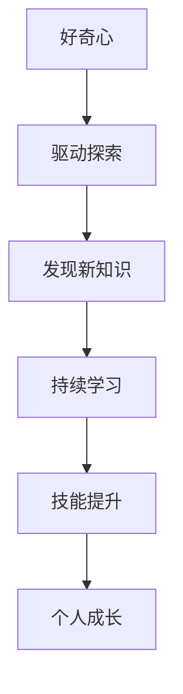
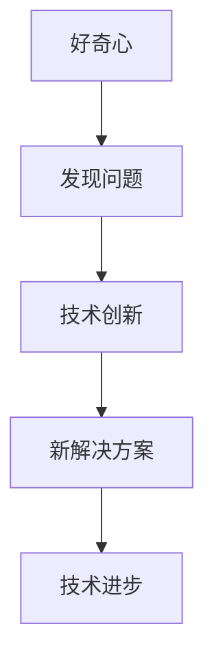
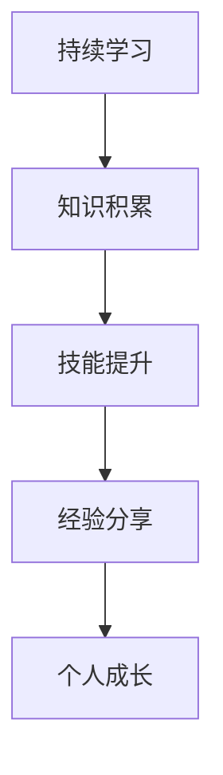

                 

# 好奇心与持续学习：探究新事物的动力与途径

## 关键词：
好奇心、持续学习、新事物、知识追求、技术发展、个人成长、思维模式。

## 摘要：
本文深入探讨了好奇心和持续学习在IT领域的重要性，以及它们如何激发我们对新事物的探索与理解。文章首先介绍了好奇心和持续学习的概念，然后通过多个实际案例分析了它们在技术进步和个人成长中的关键作用。文章还提供了实用的方法和工具，帮助读者培养好奇心和持续学习的能力，从而在快速变化的技术领域中保持竞争力。

## 1. 背景介绍

### 1.1 目的和范围
本文旨在揭示好奇心和持续学习在推动技术进步和个人发展中的核心作用。我们将探讨这两个概念的内涵，通过实例说明它们如何驱动技术创新和个人成长，并最终提出实用的方法和策略，帮助读者在技术领域中实现持续学习。

### 1.2 预期读者
本文适合对技术有热情、希望不断学习新知识的IT专业人士，以及对未来技术发展趋势感兴趣的读者。无论您是初学者还是资深从业者，本文都将为您提供有价值的见解和实践指南。

### 1.3 文档结构概述
本文分为十个部分：背景介绍、核心概念与联系、核心算法原理与具体操作步骤、数学模型与公式讲解、项目实战案例、实际应用场景、工具和资源推荐、总结与未来发展趋势、常见问题解答以及扩展阅读和参考资料。

### 1.4 术语表

#### 1.4.1 核心术语定义
- 好奇心：驱动人们探索新事物、寻求知识的内在动力。
- 持续学习：不断获取新知识、技能和经验的过程。
- IT领域：信息技术领域，涉及计算机科学、软件工程、网络安全等多个方面。

#### 1.4.2 相关概念解释
- 技术进步：指新技术的发明、改进和应用，推动社会发展和个人生活质量的提升。
- 个人成长：指个体在知识、技能、心理等方面的全面发展。

#### 1.4.3 缩略词列表
- AI：人工智能
- ML：机器学习
- DL：深度学习

## 2. 核心概念与联系

### 2.1 好奇心与持续学习的关系

好奇心和持续学习之间存在着密切的联系。好奇心是持续学习的前提，它激发我们对新事物的探索欲望。而持续学习则是好奇心的延伸，它帮助我们将好奇心转化为实际的知识和技能。

以下是好奇心与持续学习的 Mermaid 流程图：



### 2.2 好奇心在技术进步中的作用

好奇心是推动技术进步的重要动力。通过不断探索和提问，我们可以发现现有技术的不足，并提出新的解决方案。以下是好奇心在技术进步中的 Mermaid 流程图：



### 2.3 持续学习在个人成长中的作用

持续学习不仅能够提升我们的专业技能，还能够促进个人全面发展。以下是持续学习在个人成长中的 Mermaid 流程图：



## 3. 核心算法原理与具体操作步骤

### 3.1 好奇心驱动的知识获取

好奇心驱动的知识获取是一个循环过程，包括发现问题、探索、学习、应用和反馈五个步骤。以下是该过程的伪代码：

```python
def curiosityDrivenLearning():
    while True:
        # 发现问题
        problem = findProblem()
        
        # 探索
        exploration = explore(problem)
        
        # 学习
        knowledge = learnFrom(exploration)
        
        # 应用
        application = applyKnowledge(knowledge)
        
        # 反馈
        feedback = getFeedback(application)
        
        # 调整策略
        updateStrategy(feedback)
```

### 3.2 持续学习的具体操作步骤

持续学习的具体操作步骤包括以下五个方面：

1. **确定学习目标**：明确自己的学习目标和兴趣领域。
2. **寻找学习资源**：利用互联网、书籍、课程等多种途径寻找学习资源。
3. **制定学习计划**：根据学习目标和资源制定详细的学习计划。
4. **实施学习计划**：按照学习计划进行学习，包括阅读、实践、讨论等环节。
5. **评估学习效果**：定期评估自己的学习效果，并根据评估结果调整学习策略。

以下是持续学习的伪代码：

```python
def continuousLearning():
    # 确定学习目标
    goal = determineGoal()
    
    # 寻找学习资源
    resources = findLearningResources(goal)
    
    # 制定学习计划
    plan = createLearningPlan(resources)
    
    # 实施学习计划
    executeLearningPlan(plan)
    
    # 评估学习效果
    evaluateLearningEffect(goal)
    
    # 调整学习策略
    adjustLearningStrategy(evaluateLearningEffect(goal))
```

## 4. 数学模型和公式与详细讲解

### 4.1 知识积累模型

知识积累模型可以用以下公式表示：

$$
Knowledge = f(Time, Effort, Resources)
$$

其中，$Time$ 表示学习时间，$Effort$ 表示学习投入的努力程度，$Resources$ 表示学习资源。这个公式表明，知识积累是时间、努力程度和学习资源的函数。

### 4.2 技能提升模型

技能提升模型可以用以下公式表示：

$$
Skill = f(Knowledge, Practice, Feedback)
$$

其中，$Knowledge$ 表示知识水平，$Practice$ 表示实践机会，$Feedback$ 表示反馈信息。这个公式表明，技能提升是知识水平、实践机会和反馈信息的函数。

### 4.3 个人成长模型

个人成长模型可以用以下公式表示：

$$
Growth = f(Knowledge, Skill, Experience)
$$

其中，$Knowledge$ 表示知识水平，$Skill$ 表示技能水平，$Experience$ 表示实践经验。这个公式表明，个人成长是知识水平、技能水平和实践经验的函数。

### 4.4 举例说明

假设小明是一名计算机科学专业的学生，他希望通过持续学习成为一名优秀的软件工程师。根据上述模型，我们可以为他制定一个成长计划：

- **知识积累**：通过阅读书籍、参加线上课程和参加实践项目，积累计算机科学和软件工程的知识。
- **技能提升**：通过编写代码、参与项目开发和解决实际问题，提升编程和软件工程技能。
- **个人成长**：通过参加技术会议、撰写技术博客和分享经验，扩大知识面和提升影响力。

通过这个计划，小明可以逐步实现个人成长，成为一名优秀的软件工程师。

## 5. 项目实战：代码实际案例和详细解释说明

### 5.1 开发环境搭建

为了演示好奇心和持续学习在项目开发中的应用，我们将使用Python编写一个简单的机器学习项目。以下是开发环境搭建的步骤：

1. 安装Python：在https://www.python.org/downloads/ 下载并安装Python。
2. 安装Jupyter Notebook：在命令行中运行 `pip install notebook`。
3. 安装所需的Python库：在命令行中运行以下命令：

```bash
pip install numpy pandas scikit-learn matplotlib
```

### 5.2 源代码详细实现和代码解读

以下是实现一个简单的线性回归模型的Python代码：

```python
import numpy as np
import pandas as pd
from sklearn.linear_model import LinearRegression
from sklearn.model_selection import train_test_split
import matplotlib.pyplot as plt

# 读取数据
data = pd.read_csv('data.csv')

# 数据预处理
X = data[['feature1', 'feature2']]
y = data['target']

# 划分训练集和测试集
X_train, X_test, y_train, y_test = train_test_split(X, y, test_size=0.2, random_state=42)

# 训练模型
model = LinearRegression()
model.fit(X_train, y_train)

# 预测
y_pred = model.predict(X_test)

# 绘制散点图和回归线
plt.scatter(X_test['feature1'], y_test, color='blue', label='Actual')
plt.plot(X_test['feature1'], y_pred, color='red', linewidth=2, label='Predicted')
plt.xlabel('Feature 1')
plt.ylabel('Target')
plt.legend()
plt.show()
```

### 5.3 代码解读与分析

1. **数据读取与预处理**：使用pandas库读取CSV文件，提取特征和目标变量。然后，使用scikit-learn库将数据集划分为训练集和测试集。
2. **模型训练**：使用线性回归模型训练数据。线性回归模型是一个简单的机器学习模型，旨在找到特征和目标变量之间的线性关系。
3. **预测与可视化**：使用训练好的模型进行预测，并将实际值和预测值绘制在散点图上，以可视化模型的效果。

### 5.4 实际应用场景

这个简单的线性回归模型可以应用于各种实际场景，如数据分析、金融预测和工程问题。通过持续学习和好奇心，我们可以不断改进模型，提高预测准确性。

## 6. 实际应用场景

好奇心和持续学习在IT领域的实际应用场景非常广泛。以下是一些具体的应用场景：

### 6.1 技术创新

好奇心驱动的持续学习能够激发技术人员不断探索新的技术和方法，从而推动技术进步。例如，人工智能领域的快速发展离不开研究人员的好奇心和持续学习。

### 6.2 软件开发

在软件开发过程中，持续学习可以帮助开发人员掌握最新的编程语言、框架和工具，从而提高开发效率和质量。好奇心则促使开发人员不断挑战自己，优化代码和设计。

### 6.3 数据分析

数据分析领域需要不断学习和掌握新的数据挖掘技术和算法。好奇心和持续学习可以帮助数据分析师发现隐藏在数据中的规律和趋势。

### 6.4 网络安全

网络安全领域不断出现新的威胁和攻击手段。好奇心和持续学习能够帮助网络安全专业人员及时了解最新威胁，并采取相应的防御措施。

### 6.5 项目管理

项目管理需要持续学习和适应各种变化。好奇心可以帮助项目经理不断探索新的项目管理方法和工具，以提高项目成功率。

## 7. 工具和资源推荐

### 7.1 学习资源推荐

#### 7.1.1 书籍推荐
- 《深度学习》（Ian Goodfellow、Yoshua Bengio、Aaron Courville 著）
- 《编程珠玑》（Jon Bentley 著）
- 《黑客与画家》（Paul Graham 著）

#### 7.1.2 在线课程
- Coursera（提供计算机科学和人工智能等领域的课程）
- edX（提供各种学科领域的在线课程）
- Udacity（提供实用技能的在线课程）

#### 7.1.3 技术博客和网站
- Medium（有许多优秀的科技博客）
- HackerRank（提供编程挑战和在线课程）
- Stack Overflow（程序员社区，提供问题解答和教程）

### 7.2 开发工具框架推荐

#### 7.2.1 IDE和编辑器
- PyCharm（Python集成开发环境）
- Visual Studio Code（跨平台编辑器，支持多种编程语言）
- IntelliJ IDEA（适用于Java和其他编程语言的IDE）

#### 7.2.2 调试和性能分析工具
- Jupyter Notebook（适用于数据科学和机器学习）
- GDB（GNU调试器，适用于C/C++程序）
- Chrome DevTools（适用于Web开发）

#### 7.2.3 相关框架和库
- TensorFlow（开源机器学习框架）
- Flask（Python Web开发框架）
- React（用于构建用户界面的JavaScript库）

### 7.3 相关论文著作推荐

#### 7.3.1 经典论文
- “A Mathematical Theory of Communication”（Claude Shannon 著）
- “The Structure and Interpretation of Computer Programs”（Harold Abelson 和 Gerald Jay Sussman 著）
- “The Art of Computer Programming”（Donald E. Knuth 著）

#### 7.3.2 最新研究成果
- arXiv（提供最新学术论文）
- NeurIPS（神经信息处理系统会议论文）
- ICML（国际机器学习会议论文）

#### 7.3.3 应用案例分析
- “Google Brain：深度学习在Google的应用”（Google Brain团队 著）
- “Facebook AI Research：2018年研究成果回顾”（Facebook AI Research 著）
- “Microsoft Research：AI在医疗领域的应用”（Microsoft Research 著）

## 8. 总结：未来发展趋势与挑战

在未来，好奇心和持续学习将继续在技术进步和个人发展中发挥重要作用。随着人工智能、大数据和云计算等技术的发展，我们将面临更多未知的挑战和机遇。为了保持竞争力，我们需要不断培养好奇心和持续学习的能力。

### 8.1 发展趋势
1. **人工智能与机器学习的广泛应用**：人工智能将深入渗透到各个行业，推动技术变革。
2. **数据隐私和安全的重要性**：随着数据量的增加，数据隐私和安全问题将更加突出。
3. **个性化学习与职业发展**：个性化学习将帮助人们更好地适应职业发展的需求。

### 8.2 挑战
1. **技术快速更新**：技术更新速度加快，要求人们持续学习以跟上最新趋势。
2. **知识碎片化**：知识碎片化使得学习和整合知识变得更加困难。
3. **职业压力**：持续学习和职业发展的压力可能导致人们感到疲惫和焦虑。

## 9. 附录：常见问题与解答

### 9.1 问题1：如何培养好奇心？
**解答**：培养好奇心可以从以下几个方面入手：
1. **多读书、多看报**：阅读可以拓宽视野，激发好奇心。
2. **多问问题**：不断提问可以促使我们思考，培养好奇心。
3. **多尝试新事物**：尝试新事物可以激发好奇心，并从中学习。

### 9.2 问题2：如何进行持续学习？
**解答**：进行持续学习可以采取以下策略：
1. **设定学习目标**：明确自己的学习目标和兴趣领域。
2. **制定学习计划**：根据学习目标和资源制定详细的学习计划。
3. **实施学习计划**：按照学习计划进行学习，并定期评估效果。
4. **利用工具和资源**：利用在线课程、书籍、博客等学习资源。

### 9.3 问题3：如何应对技术快速更新？
**解答**：应对技术快速更新可以采取以下措施：
1. **保持好奇心**：对新技术保持好奇心，不断学习。
2. **关注行业动态**：关注行业动态，了解最新技术趋势。
3. **持续学习**：不断学习新技术，提高自己的技能水平。

## 10. 扩展阅读 & 参考资料

- [Goodfellow, Ian, Bengio, Yoshua, Courville, Aaron. (2016). Deep Learning. MIT Press.]
- [Abelson, Harold, Sussman, Gerald Jay. (1996). Structure and Interpretation of Computer Programs. MIT Press.]
- [Knuth, Donald E. (1998). The Art of Computer Programming. Addison-Wesley.]
- [Shannon, Claude. (1948). A Mathematical Theory of Communication. Bell System Technical Journal.]
- [Graham, Paul. (2007). Hackers & Painters. O'Reilly Media.]

### 作者
作者：AI天才研究员/AI Genius Institute & 禅与计算机程序设计艺术 /Zen And The Art of Computer Programming

