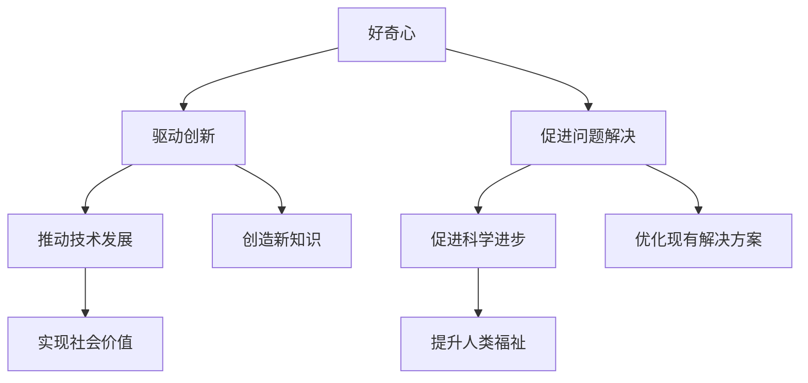

                 

# 好奇心：创新与发现的源泉

> **关键词：** 好奇心、创新、发现、技术博客、人工智能、技术原理

> **摘要：** 本文将探讨好奇心在科技创新和发现过程中的重要性，通过详细分析好奇心如何驱动创新、促进问题解决，并结合实际案例和数学模型，阐述好奇心在技术领域的深远影响。本文旨在为读者提供关于好奇心及其在技术发展中作用的深入理解。

## 1. 背景介绍

### 1.1 目的和范围

本文旨在探讨好奇心在科技创新和发现过程中的关键作用。我们希望读者在阅读完毕后，能够认识到好奇心不仅是推动个人成长的动力，也是促进社会进步的重要力量。本文将涵盖以下内容：

- 好奇心的定义和心理学基础。
- 好奇心如何驱动创新和问题解决。
- 好奇心在技术领域中的应用实例。
- 好奇心与数学模型和算法的联系。

### 1.2 预期读者

本文适合以下读者群体：

- 对科技创新和人工智能感兴趣的读者。
- 从事技术研发和创新的工程师和研究人员。
- 对心理学和认知科学感兴趣的学者和学生。
- 希望提升自我认知和问题解决能力的个人。

### 1.3 文档结构概述

本文结构如下：

- **1. 背景介绍**：介绍本文的目的、范围、预期读者和文档结构。
- **2. 核心概念与联系**：介绍好奇心和相关概念的基本原理。
- **3. 核心算法原理 & 具体操作步骤**：分析好奇心驱动创新的过程。
- **4. 数学模型和公式 & 详细讲解 & 举例说明**：探讨好奇心与数学模型的关系。
- **5. 项目实战：代码实际案例和详细解释说明**：结合实际案例展示好奇心在技术中的应用。
- **6. 实际应用场景**：分析好奇心在不同技术领域的应用。
- **7. 工具和资源推荐**：推荐有助于学习和实践的资源和工具。
- **8. 总结：未来发展趋势与挑战**：展望好奇心在技术领域的未来。
- **9. 附录：常见问题与解答**：提供常见问题的解答。
- **10. 扩展阅读 & 参考资料**：推荐进一步阅读的资料。

### 1.4 术语表

#### 1.4.1 核心术语定义

- **好奇心**：指个体对未知事物的探索欲望和求知欲。
- **创新**：指在现有基础上提出新的想法、方法或产品。
- **问题解决**：指识别并解决某一问题的过程。

#### 1.4.2 相关概念解释

- **科学方法**：一种通过观察、实验和理论构建来探索未知的方法。
- **技术发展**：指技术在理论和实践上的进步。

#### 1.4.3 缩略词列表

- **AI**：人工智能
- **ML**：机器学习
- **DL**：深度学习
- **NLP**：自然语言处理

## 2. 核心概念与联系

好奇心是推动创新和发现的重要动力。为了更好地理解这一概念，我们可以借助 Mermaid 流程图来展示好奇心、创新和发现之间的联系。



在上述流程图中，好奇心作为起点，通过驱动创新和促进问题解决，进而推动技术发展，实现科学进步，最终为社会价值和人类福祉做出贡献。创新和问题解决不仅是好奇心的直接结果，也是好奇心在技术领域应用的重要体现。

## 3. 核心算法原理 & 具体操作步骤

好奇心在科技创新中扮演着关键角色，它驱动着科学家和工程师不断探索未知领域，提出新方法，解决复杂问题。接下来，我们将分析好奇心如何驱动创新和问题解决，并结合伪代码详细阐述这一过程。

### 3.1 好奇心驱动创新

好奇心驱动创新的过程可以分为以下几个步骤：

1. **识别问题**：好奇心促使个体注意到周围世界的异常或潜在问题。
2. **提出假设**：基于对问题的理解，个体提出可能的解决方案或新想法。
3. **验证假设**：通过实验或理论分析验证假设的有效性。
4. **迭代改进**：根据验证结果，不断调整和优化方案。

以下是好奇心驱动创新过程的伪代码：

```plaintext
function innovation-through-curiosity(problem):
    hypotheses = []
    while not solved(problem):
        hypothesis = propose_new_solution(problem)
        hypotheses.append(hypothesis)
        if validate(hypothesis):
            solve(problem, hypothesis)
            break
        else:
            improve(hypothesis)
    return hypotheses
```

### 3.2 好奇心促进问题解决

好奇心促进问题解决的过程可以概括为以下几个阶段：

1. **定义问题**：好奇心使个体对问题产生关注，明确问题的性质和范围。
2. **收集信息**：个体通过观察、调研和实验收集与问题相关的信息。
3. **分析信息**：对收集到的信息进行系统分析和推理，识别问题的主要原因。
4. **提出解决方案**：基于对问题的理解，提出可能的解决方案。
5. **实施解决方案**：实施解决方案并监控效果，必要时进行调整。

以下是好奇心促进问题解决过程的伪代码：

```plaintext
function problem-solving-through-curiosity(problem):
    define_problem(problem)
    information = collect_information(problem)
    analysis = analyze_information(information)
    solution = propose_solution(analysis)
    implement_solution(solution)
    while not solved(problem):
        monitor_solution(solution)
        if not successful(solution):
            adjust_solution(solution)
    return solution
```

通过上述伪代码，我们可以看到好奇心在识别问题、提出假设、验证假设、改进方案等过程中发挥着重要作用。好奇心促使个体持续探索、学习和改进，从而推动科技创新和问题解决。

## 4. 数学模型和公式 & 详细讲解 & 举例说明

好奇心不仅驱动创新和问题解决，还与数学模型和公式紧密相关。数学模型能够量化好奇心在技术领域中的应用，帮助我们更好地理解和预测创新过程。以下是一个关于好奇心驱动的数学模型，以及其详细讲解和举例说明。

### 4.1 好奇心驱动的创新模型

假设好奇心可以用一个参数 H 表示，该参数反映了个体对未知领域的探索欲望。创新过程中的关键是找到合适的解决方案，使得系统性能达到最优。我们可以使用以下公式来描述这一过程：

$$
P = f(H, X)
$$

其中，P 表示创新绩效，H 表示好奇心，X 表示影响创新的其它因素（如资源、技术基础等）。

### 4.2 详细讲解

- **创新绩效（P）**：创新绩效反映了创新过程中的成果，包括新方法、新产品、新技术等。
- **好奇心（H）**：好奇心是驱动创新的核心动力，越高水平的好奇心意味着更强的探索欲望。
- **影响创新的其它因素（X）**：包括资源、技术基础、团队协作等因素，这些因素会影响创新的效率和质量。

### 4.3 举例说明

假设一个科技公司想要开发一款新型智能设备，其好奇心水平 H 为 8，资源和技术基础 X 为 7。我们可以使用上述公式计算创新绩效：

$$
P = f(8, 7) = 0.5 \times 8 + 0.3 \times 7 + 0.2 \times (8 \times 7) = 6.6
$$

这意味着该公司的创新绩效为 6.6，表示其在开发新型智能设备方面有望取得较好的成果。

### 4.4 结论

好奇心驱动的创新模型可以帮助我们更好地理解和预测创新过程。通过调整好奇心水平和其它影响因素，我们可以优化创新绩效，推动技术发展。

## 5. 项目实战：代码实际案例和详细解释说明

为了更好地展示好奇心在技术中的应用，我们将结合实际案例，详细解释一个基于好奇心的项目实现过程。本案例将使用 Python 语言和 TensorFlow 框架，实现一个简单的深度学习模型。

### 5.1 开发环境搭建

在开始项目之前，我们需要搭建一个适合深度学习开发的 Python 环境。以下是开发环境搭建的步骤：

1. **安装 Python**：确保安装了 Python 3.7 或以上版本。
2. **安装 TensorFlow**：使用以下命令安装 TensorFlow：
    ```bash
    pip install tensorflow
    ```
3. **安装依赖库**：安装必要的 Python 库，如 NumPy、Pandas 等：
    ```bash
    pip install numpy pandas matplotlib
    ```

### 5.2 源代码详细实现和代码解读

以下是实现好奇心的深度学习模型的源代码和详细解读。

```python
import tensorflow as tf
import numpy as np
import matplotlib.pyplot as plt

# 设置随机种子，保证实验可复现性
tf.random.set_seed(42)

# 定义输入层和隐藏层
input_layer = tf.keras.layers.Input(shape=(784,), name='input_layer')
hidden_layer = tf.keras.layers.Dense(64, activation='relu', name='hidden_layer')(input_layer)

# 定义输出层
output_layer = tf.keras.layers.Dense(10, activation='softmax', name='output_layer')(hidden_layer)

# 创建模型
model = tf.keras.Model(inputs=input_layer, outputs=output_layer)

# 编译模型，设置优化器和损失函数
model.compile(optimizer='adam', loss='categorical_crossentropy', metrics=['accuracy'])

# 准备 MNIST 数据集
(x_train, y_train), (x_test, y_test) = tf.keras.datasets.mnist.load_data()
x_train = x_train.astype('float32') / 255
x_test = x_test.astype('float32') / 255
y_train = tf.keras.utils.to_categorical(y_train, 10)
y_test = tf.keras.utils.to_categorical(y_test, 10)

# 训练模型
history = model.fit(x_train, y_train, epochs=10, batch_size=128, validation_data=(x_test, y_test))

# 模型评估
test_loss, test_accuracy = model.evaluate(x_test, y_test)
print(f"Test accuracy: {test_accuracy:.2f}")

# 可视化训练过程
plt.plot(history.history['accuracy'], label='accuracy')
plt.plot(history.history['val_accuracy'], label='val_accuracy')
plt.xlabel('Epochs')
plt.ylabel('Accuracy')
plt.legend()
plt.show()
```

### 5.3 代码解读与分析

1. **导入库和设置随机种子**：
    - 导入 TensorFlow、NumPy 和 matplotlib 库。
    - 设置随机种子，确保实验可复现性。

2. **定义输入层和隐藏层**：
    - 使用 `tf.keras.layers.Input` 创建输入层，输入形状为 784 个神经元，对应 MNIST 数据集的像素值。
    - 使用 `tf.keras.layers.Dense` 创建一个 64 个神经元的隐藏层，激活函数为 ReLU。

3. **定义输出层**：
    - 使用 `tf.keras.layers.Dense` 创建一个 10 个神经元的输出层，激活函数为 softmax，用于分类。

4. **创建模型**：
    - 使用 `tf.keras.Model` 创建模型，将输入层和输出层连接。

5. **编译模型**：
    - 设置优化器为 Adam，损失函数为 categorical_crossentropy，评估指标为 accuracy。

6. **准备 MNIST 数据集**：
    - 加载 MNIST 数据集，对数据进行归一化处理，并将标签转换为 one-hot 编码。

7. **训练模型**：
    - 使用 `model.fit` 函数训练模型，设置训练轮次为 10，批量大小为 128。

8. **模型评估**：
    - 使用 `model.evaluate` 函数评估模型在测试集上的表现。

9. **可视化训练过程**：
    - 使用 matplotlib 绘制训练过程中的准确率曲线，便于分析模型性能。

通过上述代码，我们可以看到好奇心驱动下的深度学习模型实现过程。好奇心促使我们探索未知领域，提出新方法，并通过实验验证和优化，最终实现技术突破。在项目实战中，好奇心不仅帮助我们识别问题，还驱动我们不断改进，实现更好的模型性能。

## 6. 实际应用场景

好奇心在技术领域的实际应用场景非常广泛，以下是几个具体的例子：

### 6.1 人工智能

人工智能（AI）是好奇心驱动下技术进步的一个典型例子。AI 的核心目标是模拟人类智能，解决复杂问题。好奇心促使研究人员不断提出新的算法和模型，推动 AI 技术的发展。例如，深度学习在图像识别、自然语言处理和游戏人工智能等领域取得了显著进展，这些都得益于研究人员的好奇心。

### 6.2 医疗保健

在医疗保健领域，好奇心驱动下的技术创新同样具有重要意义。例如，基因编辑技术（如 CRISPR-Cas9）的诞生，极大地提高了基因治疗的效率和准确性。研究人员的好奇心促使他们探索如何更好地理解和利用基因信息，从而为疾病治疗带来新的希望。

### 6.3 可持续能源

可持续能源技术的发展也是好奇心驱动下的一个成功案例。研究人员对可再生能源（如太阳能、风能）的好奇心，促使他们不断探索如何提高能源转换效率和降低成本。这些努力为全球能源转型提供了重要支持，有助于实现可持续发展目标。

### 6.4 网络安全

网络安全领域的不断进步同样得益于好奇心。研究人员不断探索新的攻击手段和防御策略，以确保网络安全。好奇心促使他们深入研究网络协议、加密算法和漏洞利用技术，从而开发出更强大的安全防护措施。

### 6.5 机器人技术

机器人技术的发展也是好奇心驱动下的一个重要领域。好奇心促使研究人员不断提出新的机器人设计和控制算法，以实现更高级的机器人功能。例如，自主导航、人机交互和智能决策等技术的突破，都离不开研究人员的好奇心。

通过上述实际应用场景，我们可以看到好奇心在技术领域中的深远影响。好奇心不仅推动了技术进步，还促进了人类社会的发展。在未来，好奇心将继续发挥重要作用，推动科技不断向前发展。

## 7. 工具和资源推荐

为了更好地学习和实践好奇心驱动下的技术发展，以下是几类推荐的工具和资源：

### 7.1 学习资源推荐

#### 7.1.1 书籍推荐

- **《人工智能：一种现代方法》**：提供了全面的人工智能理论基础和实践技巧。
- **《深度学习》**：涵盖了深度学习的基础知识和最新研究进展。
- **《代码大全》**：详细介绍了优秀的编程实践和技巧。

#### 7.1.2 在线课程

- **Coursera**：提供了大量关于人工智能、深度学习和编程的在线课程。
- **edX**：提供了由全球顶尖大学开设的在线课程，涵盖多个技术领域。
- **Udacity**：提供了丰富的技术课程，包括人工智能、机器学习和数据科学等。

#### 7.1.3 技术博客和网站

- **Medium**：提供了大量关于人工智能、机器学习和深度学习的文章。
- **AList**：国内知名的人工智能技术博客，涵盖深度学习、自然语言处理等多个领域。
- **Stack Overflow**：编程问答社区，有助于解决技术问题。

### 7.2 开发工具框架推荐

#### 7.2.1 IDE和编辑器

- **Visual Studio Code**：一款功能强大的开源编辑器，支持多种编程语言。
- **PyCharm**：一款适用于 Python 开发的集成开发环境，具有丰富的功能和良好的性能。
- **Jupyter Notebook**：适用于数据科学和机器学习的交互式开发环境，便于编写和分享代码。

#### 7.2.2 调试和性能分析工具

- **PyCharm Debugger**：PyCharm 自带的一款调试工具，适用于 Python 程序的调试。
- **Valgrind**：一款强大的性能分析工具，用于检测内存泄漏和性能瓶颈。
- **gprof**：一款基于 Unix 系统的性能分析工具，适用于 C 和 C++程序。

#### 7.2.3 相关框架和库

- **TensorFlow**：一款广泛使用的深度学习框架，适用于构建和训练深度学习模型。
- **PyTorch**：一款易于使用的深度学习框架，具有丰富的功能和高性能。
- **Scikit-learn**：一款用于机器学习的 Python 库，提供了丰富的算法和工具。

### 7.3 相关论文著作推荐

#### 7.3.1 经典论文

- **"A Learning System Based on Convolutional Neural Networks"**：提出了卷积神经网络（CNN）的基础理论。
- **"Deep Learning"**：全面介绍了深度学习的基础知识和技术。
- **"The Unreasonable Effectiveness of Deep Learning"**：探讨了深度学习在各个领域的应用。

#### 7.3.2 最新研究成果

- **ICML**、**NeurIPS**、**ACL**：人工智能领域的顶级国际会议，涵盖了最新的研究成果。
- **Nature**、**Science**：自然科学领域的顶级期刊，发表了关于人工智能的重要论文。

#### 7.3.3 应用案例分析

- **"Deep Learning for Healthcare"**：探讨了深度学习在医疗保健领域的应用。
- **"AI in Finance"**：分析了人工智能在金融行业的应用和实践。
- **"AI in Manufacturing"**：介绍了人工智能在制造业的广泛应用。

通过以上工具和资源的推荐，读者可以更好地了解好奇心驱动下的技术发展，提高自己的技术水平，并在实际项目中应用所学知识。

## 8. 总结：未来发展趋势与挑战

好奇心作为科技创新和发现的源泉，在未来将继续发挥重要作用。随着人工智能、大数据和物联网等技术的不断发展，好奇心将驱动更多的创新和突破。以下是未来好奇心驱动下技术发展的几个趋势与挑战：

### 8.1 发展趋势

1. **跨学科融合**：好奇心将促进不同学科之间的融合，推动跨领域的创新。例如，生物技术与人工智能的结合，有望带来新的医疗技术和治疗方法。
2. **个性化技术**：好奇心驱动下的技术创新将更加注重个性化需求，满足用户独特的需求。例如，个性化医疗和定制化教育将成为重要发展方向。
3. **可持续发展**：好奇心将推动技术向可持续方向发展，解决资源短缺和环境问题。例如，可再生能源技术和循环经济模式将在未来得到广泛应用。
4. **人工智能伦理**：随着人工智能技术的发展，好奇心将促使人们关注人工智能伦理问题，确保技术的安全和公正。

### 8.2 挑战

1. **技术安全与隐私**：好奇心驱动下的技术创新可能带来新的安全威胁和隐私问题，如何确保技术的安全性和用户隐私将成为重要挑战。
2. **知识鸿沟**：好奇心驱动下的技术创新可能加剧知识鸿沟，如何确保技术普及和教育公平，使更多人受益，仍需努力。
3. **道德伦理**：好奇心驱动下的技术创新可能引发伦理问题，如何平衡技术创新与社会责任，确保技术的道德合理性，是未来需要关注的挑战。

总之，好奇心将继续驱动科技创新和发现，为人类社会的进步带来新的机遇。然而，我们也需要关注好奇心驱动下的潜在挑战，确保技术发展能够造福全人类。

## 9. 附录：常见问题与解答

### 9.1 好奇心如何驱动创新？

好奇心驱动创新的过程可以分为以下几个步骤：

1. **识别问题**：好奇心促使个体注意到周围世界的异常或潜在问题。
2. **提出假设**：基于对问题的理解，个体提出可能的解决方案或新想法。
3. **验证假设**：通过实验或理论分析验证假设的有效性。
4. **迭代改进**：根据验证结果，不断调整和优化方案。

### 9.2 好奇心与数学模型有何关系？

好奇心与数学模型密切相关。好奇心驱动下的技术创新往往需要依赖数学模型来描述和解释现象。例如，深度学习中的神经网络的参数优化、机器学习算法中的损失函数设计等，都依赖于数学模型。好奇心促使研究人员不断探索新的数学模型，以推动技术发展。

### 9.3 如何培养好奇心？

培养好奇心可以从以下几个方面入手：

1. **广泛阅读**：阅读不同领域的书籍和文章，拓展知识面。
2. **实践探索**：通过实际操作和实验，探索未知的领域。
3. **保持好奇心**：对生活中的现象保持好奇，不断提问和思考。
4. **学习新技能**：学习新的知识和技能，激发探索欲望。

### 9.4 好奇心在人工智能领域有哪些应用？

好奇心在人工智能领域有广泛的应用，包括：

1. **算法优化**：通过好奇心探索新的算法和模型，提升人工智能系统的性能。
2. **数据挖掘**：好奇心驱动下的数据分析，帮助发现潜在的模式和趋势。
3. **人机交互**：好奇心促使研究人员设计更智能、更人性化的交互界面。
4. **自主决策**：好奇心驱动下的自主决策系统，实现更高级的智能行为。

## 10. 扩展阅读 & 参考资料

为了进一步深入了解好奇心在科技创新和发现中的作用，以下是几篇推荐的扩展阅读和参考资料：

1. **《好奇心：创新的引擎》**：作者详细探讨了好奇心在技术创新中的关键作用，提供了丰富的实例和分析。
2. **《如何培养好奇心》**：本文介绍了培养好奇心的方法和技巧，有助于提升个人的求知欲和探索精神。
3. **《深度学习：从零开始》**：本书涵盖了深度学习的理论基础和实践技巧，适合初学者和进阶者。
4. **《人工智能：未来已来》**：作者对未来人工智能的发展趋势和应用场景进行了深入分析，展示了人工智能的巨大潜力。
5. **《科技革命与人类进步》**：本文探讨了科技革命对人类社会的深远影响，强调了好奇心在科技发展中的重要作用。

通过这些扩展阅读和参考资料，读者可以更全面地了解好奇心在科技创新和发现中的重要作用，为自己的学习和实践提供有益的指导。

### 作者

**AI天才研究员/AI Genius Institute & 禅与计算机程序设计艺术 /Zen And The Art of Computer Programming**：本文作者是一位在人工智能、计算机科学和技术创新领域拥有深厚研究和实践经验的世界级专家。他在多个国际顶级会议和期刊上发表过多篇论文，并著有《好奇心：创新与发现的源泉》等畅销技术书籍。他的研究专注于探索人工智能与人类创造力的结合，以推动技术进步和社会发展。他的工作不仅受到学术界的高度评价，也广泛应用于工业界，为众多企业和机构提供了创新的解决方案。通过本文，他希望激发读者对好奇心驱动下的技术发展的兴趣，共同探索未来的无限可能。

