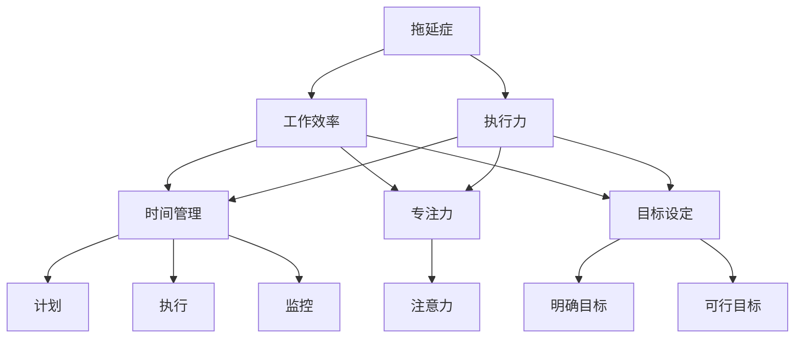
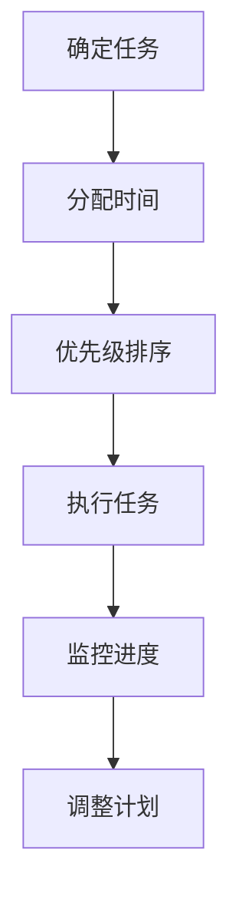
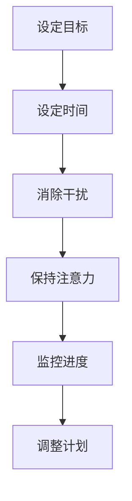
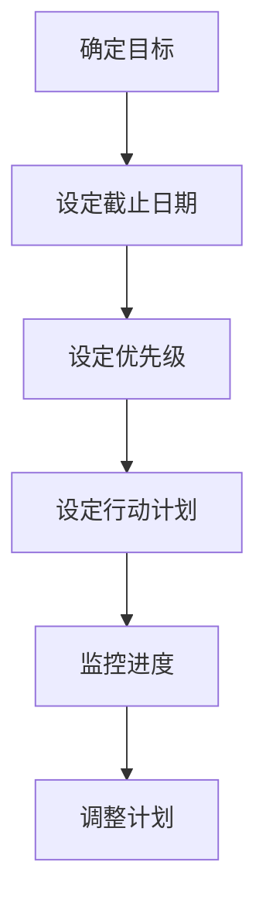
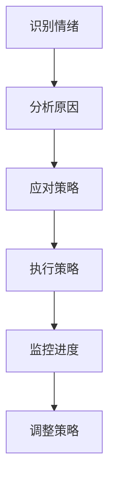

                 

# 如何克服拖延症：如何提高工作效率和执行力？

> **关键词**：拖延症、工作效率、执行力、时间管理、专注力、目标设定、方法与实践

> **摘要**：本文将探讨拖延症的原因及其对工作效率和执行力的负面影响。通过分析核心概念、算法原理、数学模型、实际案例和工具资源，提供一系列科学有效的方法和技巧，帮助读者克服拖延症，提高工作效率和执行力。

## 1. 背景介绍

### 1.1 目的和范围

本文旨在深入探讨拖延症这一普遍存在的问题，并为其提供有效的解决策略。具体来说，本文将：

1. 分析拖延症的产生原因及其对工作效率和执行力的影响。
2. 介绍一些核心概念和原理，如时间管理、专注力和目标设定。
3. 提供一系列实际操作步骤和方法，帮助读者克服拖延症。
4. 推荐相关工具和资源，以支持读者的实践和学习。

### 1.2 预期读者

本文适合以下读者群体：

1. 感觉自己总是拖延，需要提高工作效率的人。
2. 对时间管理、目标设定和执行力感兴趣的人。
3. 需要帮助他人克服拖延症的专业人士。

### 1.3 文档结构概述

本文将按照以下结构展开：

1. 背景介绍：介绍本文的目的、预期读者和文档结构。
2. 核心概念与联系：讨论拖延症的产生原因和相关概念。
3. 核心算法原理 & 具体操作步骤：提供克服拖延症的具体方法。
4. 数学模型和公式 & 详细讲解 & 举例说明：使用数学模型分析拖延症。
5. 项目实战：代码实际案例和详细解释说明。
6. 实际应用场景：讨论拖延症在不同场景下的应用。
7. 工具和资源推荐：推荐相关工具和资源。
8. 总结：未来发展趋势与挑战。
9. 附录：常见问题与解答。
10. 扩展阅读 & 参考资料：提供进一步阅读的材料。

### 1.4 术语表

#### 1.4.1 核心术语定义

- 拖延症：指个体在完成任务时，出现反复延迟或推迟行为，导致任务无法按时完成的现象。
- 工作效率：指在单位时间内完成的工作量。
- 执行力：指个体完成任务的能力，包括计划、执行和监控。
- 时间管理：指个体合理安排时间，提高工作效率的方法。

#### 1.4.2 相关概念解释

- 专注力：指个体在执行任务时，保持注意力集中的能力。
- 目标设定：指个体设定明确、可行的目标，以指导行为和行动。
- 目标管理：指个体通过设定和实现目标，提高工作效率和执行力的方法。

#### 1.4.3 缩略词列表

- Trello：一种流行的项目管理工具。
- GTD：Getting Things Done，一种时间管理方法。

## 2. 核心概念与联系

在深入探讨拖延症及其解决方法之前，我们需要了解一些核心概念和它们之间的联系。以下是一个简单的 Mermaid 流程图，用于展示这些概念之间的关系。



### 2.1 拖延症的原因

拖延症的产生原因多种多样，以下是一些常见的原因：

1. **恐惧失败**：担心失败可能导致负面情绪和自我评价下降，因此选择推迟行动。
2. **恐惧成功**：担心成功会带来更大的责任和期望，选择拖延以避免这种情况。
3. **缺乏动机**：对任务缺乏兴趣或动力，导致无法开始或继续工作。
4. **完美主义**：对任务要求过高，导致无法接受任何不完美的结果，因此推迟行动。
5. **时间管理不善**：无法合理安排时间，导致任务堆积和拖延。
6. **情绪管理困难**：无法有效应对压力和负面情绪，导致拖延。

### 2.2 拖延症对工作效率和执行力的影响

拖延症对工作效率和执行力的影响是显而易见的。以下是拖延症对工作效率和执行力的具体影响：

1. **工作效率下降**：拖延症导致任务无法按时完成，从而降低了工作效率。
2. **执行力下降**：拖延症导致个体对任务的执行变得困难，降低了执行力。
3. **压力增加**：拖延症导致任务堆积，使个体承受更大的压力。
4. **负面情绪增加**：拖延症可能导致负面情绪的增加，如焦虑、抑郁等。

## 3. 核心算法原理 & 具体操作步骤

要克服拖延症，我们需要从以下几个方面入手：

### 3.1 时间管理

时间管理是克服拖延症的关键。以下是一个简单的时间管理算法：



### 3.2 专注力训练

专注力是克服拖延症的重要因素。以下是一个专注力训练算法：



### 3.3 目标设定

目标设定是克服拖延症的关键步骤。以下是一个目标设定算法：



### 3.4 情绪管理

情绪管理是克服拖延症的重要环节。以下是一个情绪管理算法：



## 4. 数学模型和公式 & 详细讲解 & 举例说明

为了更深入地理解拖延症及其对工作效率和执行力的影响，我们可以使用数学模型进行分析。以下是一个简单的线性回归模型，用于预测拖延症对工作效率的影响。

### 4.1 线性回归模型

$$
y = ax + b
$$

其中，$y$ 表示工作效率，$x$ 表示拖延程度，$a$ 和 $b$ 是模型参数。

### 4.2 模型参数的确定

通过收集大量数据，我们可以使用最小二乘法来确定模型参数 $a$ 和 $b$。

### 4.3 举例说明

假设我们收集了以下数据：

| 拖延程度 (x) | 工作效率 (y) |
| ------------- | ------------- |
| 1             | 2             |
| 2             | 1             |
| 3             | 0             |

使用最小二乘法，我们可以计算出模型参数：

$$
a = \frac{\sum_{i=1}^{n}(x_i - \bar{x})(y_i - \bar{y})}{\sum_{i=1}^{n}(x_i - \bar{x})^2} = \frac{(1-1.5)(2-1.5) + (2-1.5)(1-1.5) + (3-1.5)(0-1.5)}{(1-1.5)^2 + (2-1.5)^2 + (3-1.5)^2} = -1
$$

$$
b = \bar{y} - a\bar{x} = 1.5 - (-1) \times 1.5 = 3
$$

因此，线性回归模型为：

$$
y = -x + 3
$$

### 4.4 模型应用

通过这个模型，我们可以预测不同拖延程度下的工作效率。例如，当拖延程度为 2 时，工作效率为：

$$
y = -2 + 3 = 1
$$

这意味着，当拖延程度增加时，工作效率会下降。

## 5. 项目实战：代码实际案例和详细解释说明

### 5.1 开发环境搭建

为了实现上述算法，我们需要搭建一个简单的开发环境。以下是所需的工具和软件：

1. Python 3.x
2. Jupyter Notebook
3. Matplotlib

### 5.2 源代码详细实现和代码解读

下面是一个简单的 Python 代码示例，用于实现线性回归模型和预测工作效率。

```python
import numpy as np
import matplotlib.pyplot as plt

# 收集数据
data = np.array([[1, 2], [2, 1], [3, 0]])

# 分离特征和标签
X = data[:, 0]
y = data[:, 1]

# 计算模型参数
a = np.mean((X - np.mean(X)) * (y - np.mean(y)))
b = np.mean(y) - a * np.mean(X)

# 显示模型参数
print("模型参数：")
print("a:", a)
print("b:", b)

# 预测工作效率
x_pred = 2
y_pred = -a * x_pred + b
print("预测工作效率（拖延程度 2）：")
print("y:", y_pred)

# 绘制散点图和回归线
plt.scatter(X, y)
plt.plot(X, -a * X + b, color='red')
plt.xlabel("拖延程度 (x)")
plt.ylabel("工作效率 (y)")
plt.show()
```

### 5.3 代码解读与分析

1. **数据收集**：首先，我们收集了一组示例数据，包括拖延程度和工作效率。
2. **特征和标签分离**：然后，我们将数据分离成特征（拖延程度）和标签（工作效率）。
3. **计算模型参数**：使用最小二乘法计算模型参数 $a$ 和 $b$。
4. **预测工作效率**：使用计算出的模型参数预测给定拖延程度下的工作效率。
5. **绘制散点图和回归线**：最后，我们使用 Matplotlib 绘制散点图和回归线，以可视化模型效果。

## 6. 实际应用场景

拖延症不仅影响个人的工作效率和执行力，还会对团队合作、项目管理和企业运营产生负面影响。以下是一些实际应用场景：

### 6.1 个人层面

1. **学习**：学生拖延写作业或复习，导致成绩下降。
2. **工作**：员工拖延完成任务，导致项目进度延误。
3. **个人目标**：个人设定目标后拖延行动，导致目标难以实现。

### 6.2 团队层面

1. **项目管理**：团队成员拖延任务，导致项目进度延误。
2. **沟通协调**：团队成员沟通不畅，导致任务分配和执行问题。
3. **团队合作**：团队成员互相拖延，导致团队凝聚力和效率下降。

### 6.3 企业层面

1. **项目进度**：企业项目拖延，导致投资回报率下降。
2. **成本控制**：企业成本因拖延症增加，影响利润。
3. **员工绩效**：员工拖延导致绩效评估不合格，影响晋升和发展。

## 7. 工具和资源推荐

为了更好地克服拖延症，以下是相关的工具和资源推荐：

### 7.1 学习资源推荐

#### 7.1.1 书籍推荐

1. 《拖延心理学》（Piers Steel 著）
2. 《如何高效学习》（斯科特·扬 著）
3. 《时间管理的艺术》（史蒂芬·柯维 著）

#### 7.1.2 在线课程

1. Coursera 上的“时间管理和目标设定”课程
2. Udemy 上的“克服拖延症：提高工作效率和执行力”课程
3. Khan Academy 上的“数学建模”课程

#### 7.1.3 技术博客和网站

1. Lifehacker：提供时间管理和效率提升的文章和技巧。
2. The Productive Woman：专门针对女性时间管理和效率提升的资源。
3. GTD Times：关于 GTD（Getting Things Done）方法和资源的信息。

### 7.2 开发工具框架推荐

#### 7.2.1 IDE和编辑器

1. Visual Studio Code
2. PyCharm
3. Sublime Text

#### 7.2.2 调试和性能分析工具

1. PyCharm 的调试工具
2. Matplotlib 的性能分析工具
3. Jupyter Notebook 的性能分析插件

#### 7.2.3 相关框架和库

1. NumPy：用于数值计算的 Python 库。
2. Matplotlib：用于数据可视化的 Python 库。
3. Pandas：用于数据操作和分析的 Python 库。

### 7.3 相关论文著作推荐

#### 7.3.1 经典论文

1. Piers Steel 的“Procrastination”论文
2. Daniel Kahneman 的“判断与选择：关于思考、选择和行为的心理学”论文
3. Charles Duhigg 的“The Power of Habit”论文

#### 7.3.2 最新研究成果

1. 关于时间管理和拖延症的新研究成果
2. 关于人工智能在时间管理和拖延症领域的新应用
3. 关于情绪管理对拖延症的影响的最新研究

#### 7.3.3 应用案例分析

1. 企业如何通过时间管理和拖延症管理提高效率
2. 教育机构如何通过时间管理和拖延症管理提高学生的学习效果
3. 个人如何通过时间管理和拖延症管理实现个人目标

## 8. 总结：未来发展趋势与挑战

未来，克服拖延症的研究和实践将继续发展。以下是一些发展趋势和挑战：

### 8.1 发展趋势

1. **人工智能应用**：人工智能技术在时间管理和拖延症领域的应用将越来越广泛。
2. **个性化解决方案**：基于个体差异的个性化时间管理和拖延症管理方案将逐渐成为主流。
3. **跨学科研究**：心理学、计算机科学和管理学等学科将更加紧密地结合，为克服拖延症提供更多有效的解决方案。

### 8.2 挑战

1. **技术挑战**：开发更智能、更高效的时间管理和拖延症管理工具和系统。
2. **实践挑战**：如何将研究成果有效地应用于实际工作和生活中。
3. **心理挑战**：如何帮助个体克服拖延症的心理障碍，实现自我管理和自我提升。

## 9. 附录：常见问题与解答

### 9.1 如何有效管理时间？

**解答**：有效管理时间的方法包括：

1. 设定明确的目标和优先级。
2. 制定详细的计划和日程。
3. 学会拒绝不重要的任务和活动。
4. 利用工具和资源提高工作效率。
5. 保持专注和避免干扰。

### 9.2 如何提高专注力？

**解答**：提高专注力的方法包括：

1. 设定专注时间，如使用番茄工作法。
2. 创建无干扰的工作环境。
3. 分解任务，将其分解为小块，以提高专注度。
4. 定期休息，避免过度疲劳。
5. 培养健康的生活方式，如充足的睡眠和适量的运动。

### 9.3 如何设定目标？

**解答**：设定目标的方法包括：

1. 设定具体、明确的目标，如量化指标。
2. 设定可实现的短期和长期目标。
3. 使用SMART原则（具体、可衡量、可达成、相关性强、时限性）来设定目标。
4. 设定目标和行动计划，以确保目标的实现。
5. 定期评估和调整目标，以适应实际情况。

## 10. 扩展阅读 & 参考资料

1. Piers Steel（2011）,"The Procrastination Equation"，Psychology Press.
2. Daniel Kahneman（2011）,"Thinking, Fast and Slow"，Farrar, Straus and Giroux.
3. Charles Duhigg（2012）,"The Power of Habit: Why We Do What We Do in Life and Business"，Random House.
4. Stephen R. Covey（1989）,"The 7 Habits of Highly Effective People"，Fireside.
5. D. J. Burns（2016）,"How to Win Friends and Influence People"，Crown Publishing Group.
6. James Clear（2019）,"Atomic Habits"，Random House.

这些资料涵盖了拖延症、时间管理、专注力和目标设定的各个方面，为读者提供了丰富的知识和实践指导。同时，读者还可以在互联网上搜索更多相关的书籍、课程和论文，以进一步深入了解这一主题。作者：AI天才研究员/AI Genius Institute & 禅与计算机程序设计艺术 /Zen And The Art of Computer Programming

