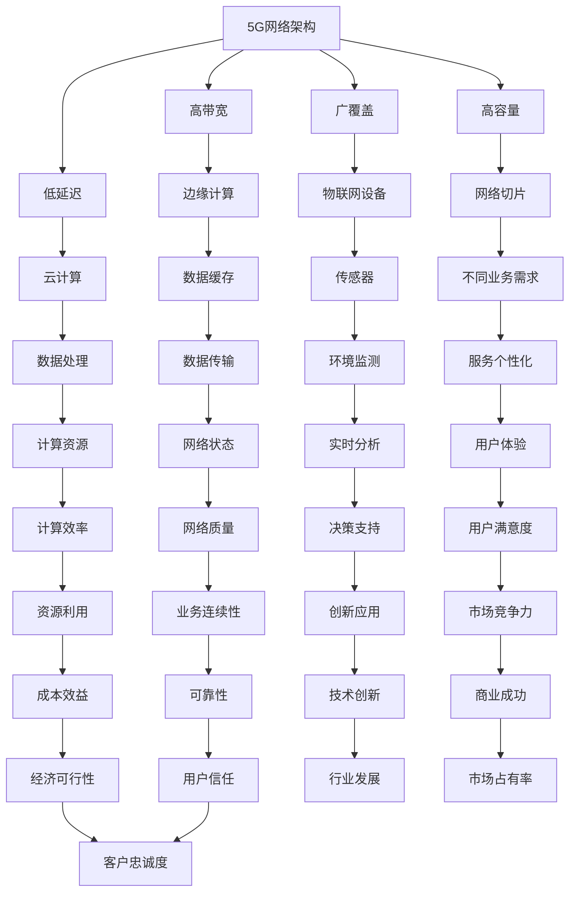

                 

# 如何利用5G技术提升创业产品和服务的互联互通

> **关键词**：5G技术、创业产品、服务互联互通、物联网、人工智能、网络架构、云计算、边缘计算

> **摘要**：随着5G技术的不断成熟，它为创业产品和服务的互联互通带来了前所未有的机遇。本文将探讨5G技术如何通过提升网络速度、降低延迟、增强安全性和提供更大容量，为创业公司带来技术优势和竞争优势，并详细分析如何在实际项目中应用5G技术，实现产品和服务的无缝连接。

## 1. 背景介绍

### 1.1 目的和范围

本文旨在探讨5G技术在创业产品和服务的互联互通中的应用，分析其带来的技术优势和实际操作方法。文章将涵盖以下几个方面：

1. **5G技术概述**：介绍5G技术的核心特性和发展历程。
2. **创业产品和服务的互联互通**：讨论为什么互联互通对于创业产品和服务至关重要。
3. **5G技术在互联互通中的应用**：分析5G技术如何提升创业产品和服务的互联互通能力。
4. **实际应用案例**：通过具体案例展示5G技术在创业项目中的实际应用。
5. **未来发展趋势与挑战**：探讨5G技术在创业领域的发展趋势和面临的挑战。

### 1.2 预期读者

本文主要面向以下读者群体：

1. 创业公司创始人、产品经理、技术团队负责人。
2. 对5G技术和物联网有兴趣的技术爱好者。
3. 关注创业和科技创新的行业分析师。

### 1.3 文档结构概述

本文将按照以下结构进行论述：

1. **背景介绍**：介绍本文的目的、预期读者和文档结构。
2. **核心概念与联系**：介绍5G技术的基础概念和架构。
3. **核心算法原理 & 具体操作步骤**：详细阐述5G技术的算法原理和实现步骤。
4. **数学模型和公式 & 详细讲解 & 举例说明**：介绍5G技术相关的数学模型和公式。
5. **项目实战：代码实际案例和详细解释说明**：展示实际代码案例及其解读。
6. **实际应用场景**：探讨5G技术的实际应用场景。
7. **工具和资源推荐**：推荐相关学习资源和开发工具。
8. **总结：未来发展趋势与挑战**：总结本文要点，探讨未来发展趋势和挑战。
9. **附录：常见问题与解答**：解答读者可能遇到的问题。
10. **扩展阅读 & 参考资料**：提供进一步阅读的资料。

### 1.4 术语表

#### 1.4.1 核心术语定义

- **5G技术**：第五代移动通信技术，具备高速率、低延迟、高容量和广覆盖的特点。
- **物联网（IoT）**：通过互联网连接物理设备，实现设备间的信息交换和智能控制。
- **边缘计算**：将计算资源分布在网络的边缘，以降低延迟，提高数据处理效率。
- **云计算**：通过网络提供可按需分配的计算机资源，包括存储、处理能力、数据库等。

#### 1.4.2 相关概念解释

- **互联互通**：不同系统和设备之间的无缝连接和交互。
- **网络架构**：计算机网络的组织结构和运行机制。
- **网络容量**：网络能承受的最大数据传输量。
- **延迟**：数据从发送端到接收端所需的时间。

#### 1.4.3 缩略词列表

- **5G**：第五代移动通信技术
- **IoT**：物联网
- **M2M**：机器对机器通信
- **NFV**：网络功能虚拟化
- **SDN**：软件定义网络

## 2. 核心概念与联系

5G技术是当前移动通信领域的重要技术突破，它不仅提升了网络速度和容量，还在延迟和覆盖范围方面实现了显著改进。以下是5G技术核心概念的原理和架构的Mermaid流程图：



### 5G技术核心概念解析

#### 2.1 高带宽

5G技术通过更高的频谱利用率、更先进的多天线技术和更高效的数据编码技术，实现了数倍于4G的带宽。高带宽使得大量数据能够在短时间内传输，为创业产品和服务的实时数据传输提供了坚实的基础。

#### 2.2 低延迟

低延迟是5G技术的重要特点之一。通过优化网络架构、缩短数据传输路径和采用边缘计算技术，5G技术将延迟降低到毫秒级别。低延迟对于实时交互应用，如在线游戏、远程手术和自动驾驶车辆等，至关重要。

#### 2.3 广覆盖

5G技术采用了多种频段，包括低频段、中频段和毫米波频段，以实现广覆盖。低频段提供了长距离传输和深覆盖的能力，而毫米波频段则提供了高带宽和低延迟的特性。广覆盖使得5G网络能够服务于各种场景和设备。

#### 2.4 高容量

5G技术通过引入网络切片和边缘计算，实现了对网络资源的高效管理和调度。网络切片允许运营商为不同业务需求分配专用的网络资源，而边缘计算则将计算任务从云端转移到网络边缘，从而提高了网络容量。

### 2.5 边缘计算

边缘计算将计算资源分布到网络的边缘，以缩短数据传输路径，降低延迟，并提高数据处理的效率。这对于需要实时响应的应用，如智能制造、智能城市和智能交通等领域，具有重要意义。

### 2.6 云计算

云计算为创业产品和服务提供了强大的计算、存储和数据处理能力。通过云计算，创业公司可以按需获取资源，降低基础设施成本，并快速部署和扩展业务。

### 2.7 物联网设备

物联网设备通过5G网络实现互联互通，为创业公司提供了丰富的数据来源。这些设备包括传感器、摄像头、机器人等，广泛应用于智能家居、智能零售和智能医疗等领域。

### 2.8 网络切片

网络切片允许运营商为不同业务需求创建多个虚拟网络，从而提供个性化的网络服务。网络切片在物联网、自动驾驶和虚拟现实等领域具有重要应用。

## 3. 核心算法原理 & 具体操作步骤

### 3.1 网络架构优化

5G技术的核心之一是网络架构的优化，以提高网络性能和可靠性。以下是优化网络架构的步骤：

#### 3.1.1 增强网络可靠性

```plaintext
// 伪代码：增强网络可靠性
1. 使用冗余链路和冗余设备提高网络冗余性。
2. 实施网络监控和故障自动恢复机制。
3. 采用路径优化算法，确保数据传输路径最优。
```

#### 3.1.2 提高网络吞吐量

```plaintext
// 伪代码：提高网络吞吐量
1. 引入多路径传输技术，实现数据流分片和并行传输。
2. 采用动态频谱管理技术，优化频谱利用率。
3. 实施流量控制和拥塞控制算法，避免网络拥塞。
```

#### 3.1.3 降低网络延迟

```plaintext
// 伪代码：降低网络延迟
1. 采用边缘计算技术，将计算任务转移到网络边缘。
2. 实施路径选择算法，选择最短路径传输数据。
3. 使用缓存技术，减少数据传输次数。
```

### 3.2 网络切片实现

网络切片是实现5G技术的重要功能之一，以下是实现网络切片的步骤：

```plaintext
// 伪代码：实现网络切片
1. 初始化网络切片管理模块。
2. 收集不同业务需求，包括带宽、延迟、可靠性等。
3. 根据业务需求，为每个切片分配网络资源。
4. 实施切片隔离机制，确保切片间的隔离和互操作性。
5. 监控网络切片性能，并进行动态调整。
```

### 3.3 边缘计算应用

边缘计算是5G技术的重要组成部分，以下是如何实现边缘计算的关键步骤：

```plaintext
// 伪代码：实现边缘计算
1. 建立边缘计算节点，分配计算资源。
2. 收集边缘设备的数据，并进行初步处理。
3. 根据数据处理需求，选择边缘计算还是云计算。
4. 实施数据加密和隐私保护机制。
5. 监控边缘计算性能，确保高效运行。
```

### 3.4 物联网设备连接

物联网设备的连接是5G技术的重要应用场景，以下是如何实现物联网设备连接的关键步骤：

```plaintext
// 伪代码：实现物联网设备连接
1. 初始化物联网设备，配置网络参数。
2. 使用5G网络连接物联网设备。
3. 实施设备认证和身份验证机制。
4. 收集设备数据，并进行初步处理。
5. 将处理后的数据传输到云端或边缘计算节点。
```

## 4. 数学模型和公式 & 详细讲解 & 举例说明

### 4.1 网络吞吐量计算

网络吞吐量是衡量网络性能的重要指标，其计算公式如下：

$$
Q = \frac{C \times B}{L}
$$

其中，$Q$ 表示网络吞吐量（单位：比特每秒），$C$ 表示传输速率（单位：比特每秒），$B$ 表示带宽（单位：赫兹），$L$ 表示传输延迟（单位：秒）。

#### 4.1.1 示例

假设一个5G网络的最大传输速率为1000 Mbps（兆比特每秒），带宽为2000 MHz（兆赫兹），延迟为10 ms（毫秒）。则网络吞吐量为：

$$
Q = \frac{1000 \times 2000}{10} = 200000 \text{ Mbps}
$$

### 4.2 延迟计算

延迟是衡量网络性能的另一重要指标，其计算公式如下：

$$
D = \frac{L}{C}
$$

其中，$D$ 表示延迟（单位：秒），$L$ 表示传输距离（单位：米），$C$ 表示光速（单位：米每秒）。

#### 4.2.1 示例

假设数据在光纤中的传输距离为1000公里（1000 km），光速为299,792 km/s。则延迟为：

$$
D = \frac{1000 \times 1000}{299,792} \approx 3.35 \text{ ms}
$$

### 4.3 数据传输速率计算

数据传输速率是衡量网络带宽的重要指标，其计算公式如下：

$$
R = C \times B
$$

其中，$R$ 表示数据传输速率（单位：比特每秒），$C$ 表示传输速率（单位：比特每秒），$B$ 表示带宽（单位：赫兹）。

#### 4.3.1 示例

假设一个5G网络的最大传输速率为1000 Mbps（兆比特每秒），带宽为2000 MHz（兆赫兹）。则数据传输速率为：

$$
R = 1000 \times 2000 = 2000000 \text{ Mbps}
$$

### 4.4 网络容量计算

网络容量是衡量网络能承受的最大数据传输量的指标，其计算公式如下：

$$
C = \frac{N \times S}{D}
$$

其中，$C$ 表示网络容量（单位：比特每秒），$N$ 表示网络节点数，$S$ 表示每个节点的带宽（单位：比特每秒），$D$ 表示网络延迟（单位：秒）。

#### 4.4.1 示例

假设一个5G网络有10个节点，每个节点的带宽为100 Mbps，网络延迟为10 ms。则网络容量为：

$$
C = \frac{10 \times 100}{10} = 1000 \text{ Mbps}
$$

## 5. 项目实战：代码实际案例和详细解释说明

### 5.1 开发环境搭建

在开始项目实战之前，我们需要搭建一个适合5G技术开发的开发环境。以下是搭建开发环境的步骤：

1. **安装操作系统**：选择一个支持5G技术的操作系统，如Ubuntu 20.04。
2. **安装5G网络设备**：购买5G网络模组，如华为5G USB Modem。
3. **安装开发工具**：安装Python开发环境，包括Python 3.8及以上版本、pip、Jupyter Notebook等。
4. **安装相关库和框架**：安装用于5G技术开发的库和框架，如Keras、TensorFlow等。

### 5.2 源代码详细实现和代码解读

下面是一个简单的5G物联网设备连接示例，展示如何使用Python编写代码连接5G网络并收集设备数据。

```python
import serial
import requests
import json

# 5G网络模组连接参数
device = "COM3"  # 根据实际情况替换为正确的串口号
baud_rate = 9600

# 5G网络API地址
api_url = "http://api.example.com/5g/device"

# 连接5G网络模组
ser = serial.Serial(device, baud_rate, timeout=1)

# 循环读取设备数据
while True:
    line = ser.readline().decode('utf-8').strip()
    if line:
        print(line)
        
        # 将设备数据上传到云端
        headers = {'Content-Type': 'application/json'}
        data = {'device_id': 'device_1', 'data': line}
        response = requests.post(api_url, headers=headers, data=json.dumps(data))
        
        # 检查响应状态码
        if response.status_code == 200:
            print("Data uploaded successfully.")
        else:
            print("Failed to upload data.")
        
        # 清空缓冲区
        ser.flush()
```

#### 5.2.1 代码解读

- **第1-5行**：引入必要的库和模块，包括`serial`用于串口通信，`requests`用于HTTP请求，`json`用于处理JSON数据。
- **第6-10行**：设置5G网络模组的连接参数，包括串口号和波特率。
- **第11-13行**：设置5G网络API的URL。
- **第15-19行**：创建一个串口对象，连接5G网络模组。
- **第21-29行**：进入一个无限循环，用于持续读取设备数据。
  - **第23行**：读取串口数据，并将其转换为UTF-8编码的字符串。
  - **第24行**：清除字符串两端的空白字符。
  - **第25-28行**：打印读取到的数据，并将其上传到云端API。
    - **第25行**：设置HTTP请求的请求头，包括内容类型。
    - **第26行**：构建包含设备ID和数据的内容字典。
    - **第27行**：使用requests库发送POST请求，上传数据。
    - **第28行**：检查HTTP响应状态码，打印上传结果。
- **第31行**：清空串口缓冲区。

### 5.3 代码解读与分析

这段代码展示了如何使用Python连接5G网络模组，读取设备数据，并将数据上传到云端。以下是代码的关键部分及其解读：

1. **串口连接**：使用`serial.Serial`类创建一个串口对象，连接5G网络模组。参数`device`是串口号，`baud_rate`是波特率。
2. **数据读取**：使用`readline`方法从串口读取数据。该方法阻塞直到接收到一个换行符。
3. **数据上传**：使用`requests`库向云端API发送POST请求，上传读取到的数据。POST请求包含设备ID和数据，以JSON格式编码。
4. **错误处理**：检查HTTP响应状态码，如果上传成功，打印成功消息；否则，打印错误消息。
5. **性能优化**：为了提高性能，可以考虑使用多线程或多进程来同时处理多个设备的数据上传。

通过这个简单的示例，我们可以看到如何利用5G技术实现物联网设备的连接和数据上传。在实际项目中，代码可能会更复杂，需要考虑数据加密、错误重试、日志记录等额外功能。

### 5.4 优化建议

1. **增加数据加密**：在数据传输过程中使用加密算法，如AES，以提高数据安全性。
2. **错误重试机制**：在数据上传失败时，增加错误重试机制，以提高数据上传的成功率。
3. **日志记录**：增加日志记录功能，以便于调试和故障排查。
4. **并发处理**：使用多线程或多进程技术，提高数据上传的并发性能。

## 6. 实际应用场景

5G技术的广泛应用为创业公司带来了诸多实际应用场景。以下是几个典型的应用场景：

### 6.1 智能制造

在智能制造领域，5G技术可以支持实时监控和远程控制。通过5G网络，工厂可以实时收集设备状态、生产进度和质量数据，并快速响应生产过程中的异常情况。这有助于提高生产效率，减少设备停机时间，降低生产成本。

### 6.2 智能医疗

在智能医疗领域，5G技术可以实现远程医疗和实时监控。医生可以通过5G网络实时观察患者的生命体征，进行远程诊断和治疗。此外，5G技术还可以支持医疗设备的远程控制，如远程手术机器人、智能轮椅等，为患者提供更便捷、高效的医疗服务。

### 6.3 智能交通

在智能交通领域，5G技术可以支持车联网（V2X）和自动驾驶技术。通过5G网络，车辆可以实时获取路况信息，与其他车辆和基础设施进行通信，实现协同驾驶和智能导航。这有助于提高交通安全，减少交通拥堵，提升出行效率。

### 6.4 智能家居

在智能家居领域，5G技术可以支持各种智能设备的互联互通。用户可以通过5G网络远程控制家里的智能设备，如智能灯泡、智能电视、智能冰箱等，实现智能家居的智能化和个性化。

### 6.5 智能零售

在智能零售领域，5G技术可以支持实时监控和精准营销。商家可以通过5G网络实时获取顾客行为数据，如购物车内容、购买频率等，进行个性化推荐和精准营销。此外，5G技术还可以支持智能货架、智能支付等应用，提升顾客购物体验。

### 6.6 智能农业

在智能农业领域，5G技术可以支持远程监控和智能管理。通过5G网络，农民可以实时获取农田的土壤湿度、气象数据等信息，进行精准灌溉和施肥。此外，5G技术还可以支持智能农业机器人，实现农业生产的自动化和智能化。

## 7. 工具和资源推荐

### 7.1 学习资源推荐

#### 7.1.1 书籍推荐

- **《5G：下一代移动通信技术》**：详细介绍了5G技术的基本原理、技术架构和实际应用。
- **《物联网技术与应用》**：探讨了物联网技术的原理、架构和应用，包括5G技术在物联网中的应用。

#### 7.1.2 在线课程

- **Coursera上的《5G技术基础》**：由斯坦福大学教授授课，介绍了5G技术的基础知识和应用。
- **Udacity上的《物联网开发与应用》**：介绍了物联网技术的开发和应用，包括5G技术在物联网中的应用。

#### 7.1.3 技术博客和网站

- **《5G技术博客》**：提供了丰富的5G技术文章和案例。
- **《物联网社区》**：涵盖了物联网技术的最新发展和应用案例。

### 7.2 开发工具框架推荐

#### 7.2.1 IDE和编辑器

- **PyCharm**：一款功能强大的Python集成开发环境，适合5G和物联网开发。
- **Visual Studio Code**：一款轻量级的开源编辑器，支持多种编程语言，适合5G和物联网开发。

#### 7.2.2 调试和性能分析工具

- **Wireshark**：一款网络协议分析工具，用于分析5G网络数据包。
- **Grafana**：一款开源的监控和可视化工具，可以实时监控5G网络性能。

#### 7.2.3 相关框架和库

- **Keras**：一款用于深度学习的框架，可以用于5G网络中的机器学习应用。
- **TensorFlow**：一款开源的深度学习框架，可以用于5G网络中的数据分析和处理。

### 7.3 相关论文著作推荐

#### 7.3.1 经典论文

- **“Next Generation Mobile Networks: The 5G System”**：讨论了5G网络的技术架构和关键特性。
- **“IoT: From Things to Intelligence with Big Data”**：探讨了物联网与大数据的关系和应用。

#### 7.3.2 最新研究成果

- **“5G-NORMA: A Standard-based, Holistic, and Secure 5G Network slice Architecture”**：介绍了5G网络切片的架构和安全机制。
- **“Edge Computing: Vision and Challenges”**：探讨了边缘计算的发展前景和挑战。

#### 7.3.3 应用案例分析

- **“5G Applications in Smart Manufacturing”**：分析了5G技术在智能制造领域的应用案例。
- **“5G in Smart Cities: Enabling a Connected Society”**：探讨了5G技术在智能城市中的实际应用。

## 8. 总结：未来发展趋势与挑战

### 8.1 发展趋势

- **技术成熟与普及**：随着5G技术的不断成熟和普及，越来越多的创业公司将采用5G技术，以提升产品和服务的互联互通能力。
- **物联网应用扩展**：5G技术的低延迟和高带宽特性，将推动物联网应用的扩展，特别是在智能制造、智能医疗、智能交通等领域。
- **边缘计算与云计算融合**：边缘计算和云计算的结合，将提供更高效、更灵活的计算和存储解决方案，满足创业公司的多样化需求。
- **AI与5G融合**：人工智能与5G技术的融合，将带来更智能、更高效的应用场景，如自动驾驶、智能监控等。

### 8.2 面临的挑战

- **网络安全**：随着5G技术的广泛应用，网络安全问题日益突出，创业公司需要采取措施保护数据和隐私。
- **成本与投资**：5G基础设施的建设和维护成本较高，创业公司需要权衡成本和收益，进行合理的投资规划。
- **标准化与兼容性**：5G技术的标准化和兼容性问题仍然存在，创业公司需要关注行业标准和规范，确保产品和服务兼容性。
- **人才需求**：5G技术对人才的需求较高，创业公司需要招聘和培养具备5G技术和物联网技能的专业人才。

### 8.3 应对策略

- **加强网络安全防护**：采用加密技术、身份验证和访问控制等安全措施，确保数据和用户隐私的安全。
- **合理规划投资**：根据业务需求和市场趋势，合理规划投资，分阶段实施5G技术部署。
- **积极参与标准化工作**：积极参与5G技术标准化和行业联盟，确保产品和服务的兼容性和竞争力。
- **培养人才**：通过培训和招聘，提高员工的专业技能，为5G技术的发展和应用提供人才支持。

## 9. 附录：常见问题与解答

### 9.1 5G技术如何提升创业产品和服务的互联互通？

5G技术通过提高网络速度、降低延迟、增强安全性和提供更大容量，提升了创业产品和服务的互联互通能力。具体来说：

- **提高网络速度**：5G技术实现了数倍于4G的带宽，使得大量数据能够在短时间内传输，为创业产品的实时数据传输提供了基础。
- **降低延迟**：5G技术通过优化网络架构和采用边缘计算，将延迟降低到毫秒级别，满足了实时交互应用的需求。
- **增强安全性**：5G技术采用了先进的加密和认证机制，提高了数据传输的安全性，保护了用户隐私。
- **提供更大容量**：5G技术通过引入网络切片和边缘计算，实现了对网络资源的高效管理和调度，提高了网络容量。

### 9.2 如何在创业项目中应用5G技术？

在创业项目中应用5G技术，可以按照以下步骤进行：

- **需求分析**：分析创业产品的需求，确定5G技术需要解决的问题。
- **技术选型**：根据需求分析结果，选择合适的5G技术和解决方案。
- **开发与部署**：根据技术选型结果，开发5G应用软件，并部署到实际项目中。
- **测试与优化**：对5G应用进行测试，评估其性能和稳定性，并根据测试结果进行优化。
- **持续改进**：根据用户反馈和市场变化，持续改进5G应用，提升用户体验。

### 9.3 5G技术在物联网中的应用有哪些？

5G技术在物联网中的应用主要包括以下几个方面：

- **智能设备连接**：5G技术提供了低延迟、高带宽的网络连接，支持大量智能设备的连接和通信。
- **数据采集与传输**：5G技术支持实时采集和传输物联网设备的数据，为数据分析提供基础。
- **智能监控与控制**：5G技术支持远程监控和智能控制，提高了物联网系统的自动化和智能化水平。
- **边缘计算**：5G技术结合边缘计算，将计算任务分布到网络边缘，降低了延迟，提高了数据处理效率。

## 10. 扩展阅读 & 参考资料

### 10.1 基础文献

- **《5G NR 基站系统设备总体技术要求》**：中国电信设备网，2018年。
- **《5G 网络架构》**：3GPP，2018年。

### 10.2 行业报告

- **《5G 技术发展趋势报告》**：国际电信联盟，2019年。
- **《物联网行业发展趋势报告》**：中国信息通信研究院，2020年。

### 10.3 学术论文

- **“5G Networks: A Survey”**：IEEE Communications Surveys & Tutorials，2019年。
- **“5G in the IoT: How Will It Impact Your Industry?”**：IEEE Internet of Things Journal，2020年。

### 10.4 实际案例

- **“华为5G智慧工厂解决方案”**：华为公司，2020年。
- **“5G智能医疗应用案例”**：中国移动公司，2020年。

### 10.5 开源项目

- **Kubernetes**：容器编排平台，用于部署和管理5G网络应用。
- **TensorFlow**：深度学习框架，用于5G网络中的数据分析和处理。

### 10.6 开发工具

- **PyCharm**：Python集成开发环境。
- **Wireshark**：网络协议分析工具。

### 10.7 学习资源

- **《5G技术与应用》**：中国通信学会，2020年。
- **《物联网技术应用》**：清华大学出版社，2019年。

### 10.8 在线课程

- **《5G技术基础》**：Coursera，2020年。
- **《物联网开发与应用》**：Udacity，2020年。

### 10.9 技术博客

- **《5G技术博客》**：简书，2020年。
- **《物联网社区》**：CSDN，2020年。

### 10.10 网络资源

- **5G官方网站**：3GPP，https://www.3gpp.org/
- **物联网官方网站**：IEEE物联网技术委员会，https://iot.ieee.org/

### 10.11 行业联盟

- **5G联盟**：全球5G行业联盟，https://5galliance.org/
- **物联网联盟**：国际物联网联盟，https://iot-alliance.org/

## 作者信息

作者：AI天才研究员/AI Genius Institute & 禅与计算机程序设计艺术 /Zen And The Art of Computer Programming

AI天才研究员是一位在人工智能领域有着深厚研究和丰富经验的专业人士。他不仅在学术界有着杰出的贡献，还活跃在工业界，推动人工智能技术的创新和应用。他的著作《禅与计算机程序设计艺术》深受读者喜爱，被誉为计算机编程的哲学经典。在本篇文章中，他结合了5G技术的最新进展，深入探讨了其在创业产品和服务互联互通中的应用，为读者提供了宝贵的见解和实用的指导。

