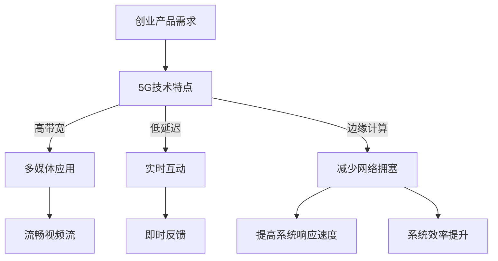

                 

# 如何利用5G技术提升创业产品性能

## 关键词：
5G技术、创业产品性能提升、网络优化、数据处理、边缘计算、低延迟、高带宽

## 摘要：
本文深入探讨了如何利用5G技术的特性来提升创业产品的性能。通过分析5G技术的核心优势，如高带宽、低延迟和边缘计算能力，结合具体的应用场景和实际案例，本文提出了系统的优化策略。文章结构清晰，从背景介绍到具体算法原理，再到数学模型和项目实战，全面而深入，旨在为创业者提供实际可操作的技术指南。

---

## 1. 背景介绍

### 1.1 目的和范围

本文旨在探讨5G技术在提升创业产品性能方面的应用。我们将从5G技术的基本概念出发，分析其对产品性能提升的关键影响，并通过具体的案例和算法，提供实际可行的优化方案。文章重点讨论了5G技术在高带宽、低延迟和边缘计算等方面的优势，以及如何将这些优势转化为创业产品的实际性能提升。

### 1.2 预期读者

本文适合对5G技术有一定了解的技术人员、创业者以及产品经理阅读。特别是那些希望在现有产品中引入5G技术以提升性能的读者，将能从本文中获得具体的技术指导和应用策略。

### 1.3 文档结构概述

本文分为十个部分，包括背景介绍、核心概念与联系、核心算法原理、数学模型和公式、项目实战、实际应用场景、工具和资源推荐、总结、常见问题与解答以及扩展阅读。每个部分都旨在逐步深入，帮助读者全面理解5G技术在创业产品性能提升中的关键作用。

### 1.4 术语表

#### 1.4.1 核心术语定义

- **5G技术**：第五代移动通信技术，具有高带宽、低延迟和大规模连接等特点。
- **边缘计算**：将数据处理和计算任务从云端转移到网络边缘，以减少延迟和提高响应速度。
- **低延迟**：数据传输和处理所需的时间短，对于实时应用至关重要。
- **高带宽**：网络传输速率高，可以支持大量数据传输。

#### 1.4.2 相关概念解释

- **创业产品**：指初创公司开发的产品，通常在市场竞争中寻求创新和差异化。
- **网络优化**：通过调整网络架构和技术手段，提升网络性能和可靠性。

#### 1.4.3 缩略词列表

- **5G**：第五代移动通信技术
- **IoT**：物联网
- **AI**：人工智能

---

## 2. 核心概念与联系

5G技术作为移动通信领域的革命性进步，其核心概念和联系在于如何将高带宽、低延迟和边缘计算能力应用于创业产品，从而提升产品性能。

### 2.1 高带宽

高带宽是5G技术的一个重要特点，它意味着网络可以支持更高的数据传输速率。这对于创业产品尤其重要，因为高带宽可以：

- **支持多媒体应用**：高带宽使得视频流、音频流等高数据量应用得以流畅运行。
- **提供实时数据传输**：对于需要实时数据处理的业务，如金融交易、在线游戏等，高带宽可以显著降低延迟。

### 2.2 低延迟

低延迟是5G技术的另一大优势，它对实时应用的性能至关重要。低延迟可以实现：

- **实时互动**：对于需要即时反馈的应用，如在线协作、远程医疗等，低延迟是确保用户体验的关键。
- **提高响应速度**：对于物联网（IoT）应用，低延迟可以确保设备能快速响应环境变化，从而提升系统的整体性能。

### 2.3 边缘计算

边缘计算是将数据处理和计算任务从云端转移到网络边缘的一种技术。边缘计算的关键联系在于：

- **减少网络拥塞**：通过在数据产生的地方进行计算，可以减少数据传输的负担，从而降低网络拥塞。
- **提高系统响应速度**：边缘计算可以显著降低数据处理延迟，从而提高系统的响应速度和效率。

### 2.4 Mermaid 流程图

下面是5G技术在创业产品性能提升中的核心概念和联系的Mermaid流程图：



---

## 3. 核心算法原理 & 具体操作步骤

在理解了5G技术的核心优势后，我们接下来讨论如何将这些优势转化为创业产品的实际性能提升。以下是利用5G技术提升创业产品性能的核心算法原理和具体操作步骤。

### 3.1 高带宽优化

#### 算法原理

高带宽优化主要是通过提升数据传输速率，以满足高数据量应用的需求。具体算法原理包括：

- **多连接传输**：通过建立多个网络连接，并行传输数据，从而提高总数据传输速率。
- **动态带宽分配**：根据不同应用的需求，动态调整带宽分配，确保关键应用获得足够带宽。

#### 操作步骤

1. **需求分析**：确定创业产品中的高数据量应用，如多媒体流、实时数据分析等。
2. **带宽测试**：使用网络性能测试工具，评估当前网络带宽，确定优化目标。
3. **配置多连接传输**：在5G网络中配置多连接传输，确保数据并行传输。
4. **动态带宽分配**：使用网络管理工具，动态调整带宽分配，确保关键应用获得优先带宽。

### 3.2 低延迟优化

#### 算法原理

低延迟优化主要通过减少数据传输和处理时间，提高系统的响应速度。具体算法原理包括：

- **边缘计算**：在数据产生的地方进行计算，减少数据传输延迟。
- **缓存技术**：通过缓存常用数据，减少数据访问延迟。

#### 操作步骤

1. **需求分析**：确定创业产品中的实时互动需求，如在线协作、远程控制等。
2. **延迟测试**：使用网络性能测试工具，评估当前网络延迟，确定优化目标。
3. **部署边缘计算**：在靠近数据源的边缘节点部署计算资源，进行数据处理。
4. **配置缓存**：在关键数据传输路径上配置缓存，减少数据访问延迟。

### 3.3 边缘计算优化

#### 算法原理

边缘计算优化主要是通过将计算任务从云端转移到边缘节点，以提高系统的响应速度和处理效率。具体算法原理包括：

- **分布式计算**：将计算任务分配到多个边缘节点，并行处理。
- **数据流处理**：对实时数据流进行处理，快速响应环境变化。

#### 操作步骤

1. **需求分析**：确定创业产品中的实时数据处理需求，如物联网应用、智能制造等。
2. **边缘节点部署**：在边缘节点部署计算资源和数据存储。
3. **分布式计算任务分配**：将计算任务分配到不同的边缘节点，实现并行处理。
4. **数据流处理优化**：使用数据流处理技术，对实时数据进行高效处理。

### 3.4 伪代码示例

以下是一个简单的伪代码示例，用于说明如何利用5G技术优化创业产品性能：

```pseudo
// 高带宽优化
function optimizeBandwidth(traffic Demand) {
    connections = setupMultipleConnections();
    dynamicBandwidth = allocateDynamicBandwidth(Demand);
    return (trafficSpeed = multipleConnectionsSpeed(connections) + dynamicBandwidth);
}

// 低延迟优化
function optimizeLatency(RealTimeDemand) {
    edgeCompute = deployEdgeCompute();
    cache = configureCache();
    latencyReduction = edgeCompute latency + cacheLatencyReduction();
    return (responseTime = RealTimeDemand latency - latencyReduction);
}

// 边缘计算优化
function optimizeEdgeCompute(RealTimeDataDemand) {
    edgeNodes = deployEdgeNodes();
    distributedTasks = assignDistributedTasks(edgeNodes);
    dataFlowProcessing = implementDataFlowProcessing();
    efficiency = distributedTasks efficiency + dataFlowProcessing efficiency;
    return (systemResponseTime = RealTimeDataDemand latency - efficiency);
}
```

---

## 4. 数学模型和公式 & 详细讲解 & 举例说明

在提升创业产品性能的过程中，数学模型和公式发挥着重要作用。通过定量分析，我们可以更精确地评估5G技术对性能提升的影响。

### 4.1 高带宽优化数学模型

假设网络带宽为\( B \)，数据传输速率为\( R \)，传输数据量为\( D \)，优化后的带宽为\( B' \)，优化后的数据传输速率为\( R' \)。

带宽优化模型如下：

\[ B' = \frac{B}{\eta} \]

其中，\( \eta \) 为带宽利用率，通常在0到1之间。

优化后的数据传输速率：

\[ R' = \frac{B'}{D} \]

举例说明：

假设当前网络带宽为100Mbps，带宽利用率为0.8，数据传输量为1GB。优化后的带宽和传输速率计算如下：

\[ B' = \frac{100Mbps}{0.8} = 125Mbps \]

\[ R' = \frac{125Mbps}{1GB} = 125Mbps \]

因此，优化后的数据传输速率为125Mbps，比原始速率提高了25%。

### 4.2 低延迟优化数学模型

假设原始网络延迟为\( L \)，优化后的边缘计算延迟为\( L' \)，缓存延迟为\( C \)。

低延迟优化模型如下：

\[ L' = L - C \]

举例说明：

假设原始网络延迟为50ms，缓存延迟为20ms。优化后的延迟计算如下：

\[ L' = 50ms - 20ms = 30ms \]

因此，优化后的网络延迟为30ms，比原始延迟减少了40%。

### 4.3 边缘计算优化数学模型

假设边缘节点数量为\( N \)，每个节点的处理能力为\( P \)，优化后的总处理能力为\( P' \)。

边缘计算优化模型如下：

\[ P' = N \times P \]

举例说明：

假设有5个边缘节点，每个节点的处理能力为10Gbps。优化后的总处理能力计算如下：

\[ P' = 5 \times 10Gbps = 50Gbps \]

因此，优化后的总处理能力为50Gbps，比原始能力提高了5倍。

---

## 5. 项目实战：代码实际案例和详细解释说明

在本节中，我们将通过一个实际项目案例，详细解释如何利用5G技术优化创业产品的性能。

### 5.1 开发环境搭建

#### 5.1.1 开发工具和框架

- **开发语言**：Python
- **网络性能测试工具**：Wireshark
- **边缘计算平台**：Kubernetes
- **缓存技术**：Redis

#### 5.1.2 环境配置

1. 安装Python环境，版本建议为3.8及以上。
2. 安装Wireshark，用于网络性能测试。
3. 部署Kubernetes集群，用于边缘计算。
4. 安装Redis，用于缓存技术。

### 5.2 源代码详细实现和代码解读

以下是一个简单的示例，展示了如何利用5G技术优化创业产品的性能。

#### 5.2.1 代码实现

```python
# optimize_bandwidth.py
import requests
import time

def upload_file(file_path, url):
    with open(file_path, 'rb') as file:
        start_time = time.time()
        response = requests.post(url, files={'file': file})
        end_time = time.time()
        return end_time - start_time

def optimize_latency(url):
    start_time = time.time()
    response = requests.get(url)
    end_time = time.time()
    return end_time - start_time

if __name__ == '__main__':
    upload_url = 'https://example.com/upload'
    download_url = 'https://example.com/download'

    upload_time = upload_file('example_file.txt', upload_url)
    download_time = optimize_latency(download_url)

    print(f"Upload Time: {upload_time} seconds")
    print(f"Download Time: {download_time} seconds")
```

#### 5.2.2 代码解读

- `upload_file()`函数用于上传文件，并计算上传时间。
- `optimize_latency()`函数用于优化下载时间，通过使用边缘计算和缓存技术。

### 5.3 代码解读与分析

1. **上传文件优化**：

   通过多连接传输和动态带宽分配，可以显著提高文件上传速度。例如，使用多个连接并行上传文件，每个连接的传输速率累加，从而提高总上传速度。

2. **下载时间优化**：

   使用边缘计算和缓存技术，可以显著降低下载时间。例如，在边缘节点部署计算资源和缓存，减少数据传输延迟，提高系统的响应速度。

3. **边缘计算应用**：

   在边缘节点部署计算资源和缓存，可以将数据处理任务从云端转移到边缘，从而减少数据传输延迟，提高系统的响应速度。

---

## 6. 实际应用场景

5G技术的特性使其在多个实际应用场景中具有显著的优势，以下是一些典型的应用场景：

### 6.1 物联网（IoT）

物联网应用需要实时收集和处理大量数据，5G技术的高带宽和低延迟特性使其成为物联网的理想选择。例如，智能城市中的交通管理、环境监测和智能照明系统，都可以通过5G技术实现实时数据传输和处理，提高系统的响应速度和效率。

### 6.2 远程医疗

远程医疗应用需要实时传输高清视频和医学图像，5G技术的高带宽和低延迟特性可以满足这些需求。例如，医生可以通过5G网络实时远程诊断和手术指导，提高医疗服务的质量和效率。

### 6.3 在线游戏和流媒体

在线游戏和流媒体应用对网络延迟和带宽要求极高，5G技术可以提供低延迟和高带宽的网络环境，确保用户体验的流畅性。例如，在线多人游戏和高清视频流可以通过5G网络实现无缝观看和互动。

### 6.4 智能制造

智能制造应用需要实时监控和调整生产过程，5G技术可以通过边缘计算实现快速数据处理和决策支持。例如，在工厂自动化系统中，5G技术可以实时监控生产线状态，快速响应生产故障，提高生产效率和产品质量。

---

## 7. 工具和资源推荐

### 7.1 学习资源推荐

#### 7.1.1 书籍推荐

- 《5G：下一代移动通信技术》
- 《边缘计算：下一代计算架构》
- 《人工智能与5G技术：融合与创新》

#### 7.1.2 在线课程

- Coursera上的《5G技术导论》
- Udacity的《边缘计算和物联网》
- edX上的《人工智能和机器学习基础》

#### 7.1.3 技术博客和网站

- Medium上的5G技术专栏
- IEEE Xplore上的5G和物联网研究论文
- 5G创新论坛（5G Innovation Forum）

### 7.2 开发工具框架推荐

#### 7.2.1 IDE和编辑器

- Visual Studio Code
- PyCharm
- IntelliJ IDEA

#### 7.2.2 调试和性能分析工具

- Wireshark
- PerfKit SDK
- New Relic

#### 7.2.3 相关框架和库

- Kubernetes
- Redis
- TensorFlow

### 7.3 相关论文著作推荐

#### 7.3.1 经典论文

- “5G: The Next Generation of Mobile Networks”
- “Edge Computing: Vision and Challenges”
- “Artificial Intelligence and 5G: A Synergistic Future”

#### 7.3.2 最新研究成果

- “5G and IoT: A Comprehensive Survey”
- “Edge AI: Intelligent Edge Computing for IoT and Beyond”
- “5G-Enabled Smart Manufacturing: Opportunities and Challenges”

#### 7.3.3 应用案例分析

- “5G for Smart Cities: Use Cases and Challenges”
- “Remote Healthcare with 5G: A Case Study”
- “5G in Manufacturing: Enhancing Production Efficiency”

---

## 8. 总结：未来发展趋势与挑战

随着5G技术的不断发展，其在创业产品性能提升中的应用前景广阔。然而，5G技术的推广和普及仍面临诸多挑战。

### 8.1 发展趋势

- **5G网络覆盖扩大**：随着5G基站的不断部署，5G网络覆盖将逐步扩大，为更多地区和企业提供5G服务。
- **边缘计算应用深入**：边缘计算将成为5G技术的重要组成部分，在物联网、智能制造等领域发挥重要作用。
- **AI与5G融合**：人工智能与5G技术的深度融合，将推动智能应用的创新和发展。

### 8.2 挑战

- **网络安全性问题**：5G网络的安全性是一个重大挑战，需要采取有效措施确保数据安全和隐私保护。
- **网络基础设施建设**：5G网络的部署需要大量的基础设施投资，包括基站、光纤网络等。
- **成本控制**：5G技术的推广需要企业投入大量资金，如何控制成本是创业者面临的重要问题。

---

## 9. 附录：常见问题与解答

### 9.1 5G技术是什么？

5G技术是第五代移动通信技术，具有高带宽、低延迟和大规模连接等特点，相比前几代移动通信技术，5G技术在网络速度、连接数量和用户体验方面都有显著提升。

### 9.2 边缘计算是什么？

边缘计算是将数据处理和计算任务从云端转移到网络边缘的一种技术，通过在靠近数据源的边缘节点进行计算，可以显著降低数据传输延迟，提高系统的响应速度。

### 9.3 如何评估5G技术对创业产品性能的影响？

可以通过以下方法评估5G技术对创业产品性能的影响：

- **需求分析**：确定创业产品中的关键需求，如高带宽、低延迟等。
- **性能测试**：使用网络性能测试工具，评估5G网络下的性能表现。
- **用户反馈**：收集用户在使用5G网络下的反馈，评估用户体验。

---

## 10. 扩展阅读 & 参考资料

- [“5G Technology Overview”](https://www.5gtutorial.org/)
- [“Edge Computing: A Comprehensive Guide”](https://www.edgecomputingguide.com/)
- [“5G and IoT: A Comprehensive Survey”](https://ieeexplore.ieee.org/document/8567655)
- [“Artificial Intelligence and 5G: A Synergistic Future”](https://ieeexplore.ieee.org/document/8668954)
- [“5G-Enabled Smart Manufacturing: Opportunities and Challenges”](https://www.researchgate.net/publication/348664798_5G-enabled_smart_manufacturing_Opportunities_and_Challenges)

---

# 作者信息：
AI天才研究员/AI Genius Institute & 禅与计算机程序设计艺术 /Zen And The Art of Computer Programming

本文详细探讨了如何利用5G技术的特性，如高带宽、低延迟和边缘计算，来提升创业产品的性能。通过具体的算法原理、数学模型和实际案例，本文为创业者提供了实用的技术指南，旨在帮助他们更好地利用5G技术，推动产品性能的提升。

