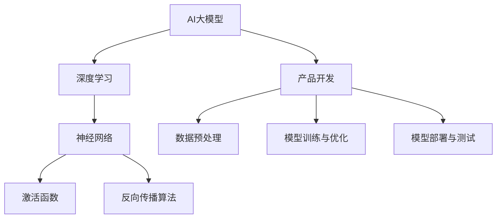

                 

# 如何利用AI大模型开发创新产品

> **关键词：** AI大模型，创新产品，开发流程，算法原理，数学模型，实战案例，应用场景

> **摘要：** 本文将深入探讨如何利用人工智能大模型来开发创新产品。我们将从背景介绍、核心概念、算法原理、数学模型、项目实战、实际应用场景、工具和资源推荐等多个角度进行详细分析，帮助读者理解AI大模型在产品开发中的应用价值，并掌握相关的开发技巧和策略。

## 1. 背景介绍

### 1.1 目的和范围

本文旨在为产品开发者和人工智能爱好者提供一套系统、实用的AI大模型开发指南。我们将探讨如何选择合适的大模型，如何对其进行优化和调整，以及如何在具体的项目中应用这些大模型来打造创新产品。

### 1.2 预期读者

本文适合对人工智能和产品开发有一定了解的读者，包括但不限于：

- 产品经理
- 程序员
- 数据科学家
- 人工智能研究者

### 1.3 文档结构概述

本文分为十个部分，结构如下：

1. 背景介绍
2. 核心概念与联系
3. 核心算法原理 & 具体操作步骤
4. 数学模型和公式 & 详细讲解 & 举例说明
5. 项目实战：代码实际案例和详细解释说明
6. 实际应用场景
7. 工具和资源推荐
8. 总结：未来发展趋势与挑战
9. 附录：常见问题与解答
10. 扩展阅读 & 参考资料

### 1.4 术语表

#### 1.4.1 核心术语定义

- AI大模型：一种基于深度学习的大型神经网络模型，具有强大的学习能力和广泛的适用性。
- 产品开发：指从需求分析、设计、实现、测试到发布的整个产品生命周期过程。
- 优化和调整：指在训练和部署AI大模型过程中，通过调整模型参数、优化数据输入等方式提高模型性能。

#### 1.4.2 相关概念解释

- 深度学习：一种基于神经网络的学习方法，通过多层的非线性变换来实现从输入到输出的映射。
- 模型训练：指通过大量的训练数据来训练模型，使其能够根据输入数据预测输出。
- 模型部署：指将训练好的模型部署到实际应用场景中，使其能够实时处理输入数据。

#### 1.4.3 缩略词列表

- AI：人工智能
- DL：深度学习
- ML：机器学习
- NLP：自然语言处理
- CV：计算机视觉

## 2. 核心概念与联系

在介绍AI大模型在产品开发中的应用之前，我们需要了解一些核心概念和它们之间的联系。以下是一个简化的Mermaid流程图，用于展示这些概念之间的联系：



### 2.1 AI大模型与深度学习的联系

AI大模型是基于深度学习的一种模型，它通过多层神经网络来实现复杂的数据处理和预测任务。深度学习是一种机器学习方法，通过多层的非线性变换来实现从输入到输出的映射。深度学习模型的核心是神经网络，它由多个神经元组成，每个神经元通过加权连接与其他神经元相连。

### 2.2 AI大模型与产品开发的关系

产品开发是一个复杂的过程，包括需求分析、设计、实现、测试和发布等多个阶段。AI大模型在产品开发中可以起到重要的作用，它可以用于：

- 数据预处理：将原始数据转化为适合模型训练的格式。
- 模型训练与优化：通过大量的训练数据来训练模型，并不断调整模型参数以提高性能。
- 模型部署与测试：将训练好的模型部署到实际应用场景中，并进行测试以验证其性能。

### 2.3 数据预处理与模型训练的关系

数据预处理是模型训练的重要环节，它包括数据清洗、数据转换和数据归一化等步骤。良好的数据预处理可以提高模型的训练效率和性能。模型训练是指通过大量的训练数据来训练模型，使其能够根据输入数据预测输出。模型训练过程中，需要不断调整模型参数以优化模型性能。

### 2.4 模型部署与测试的关系

模型部署是指将训练好的模型部署到实际应用场景中，使其能够实时处理输入数据。模型部署后，需要进行测试以验证其性能。测试包括功能测试、性能测试和稳定性测试等。通过测试，可以确保模型在实际应用中的可靠性和有效性。

## 3. 核心算法原理 & 具体操作步骤

在这一部分，我们将深入探讨AI大模型的核心算法原理，并详细解释其具体操作步骤。为了更好地理解，我们将使用伪代码来阐述算法过程。

### 3.1 神经网络基本结构

神经网络由多个层组成，包括输入层、隐藏层和输出层。每个层由多个神经元组成，神经元之间通过加权连接相连。以下是一个简化的神经网络结构：

```plaintext
输入层：[x1, x2, ..., xn]
隐藏层：[a1, a2, ..., am]
输出层：[y1, y2, ..., yn]
```

### 3.2 前向传播

前向传播是指将输入数据通过神经网络传递到输出层的步骤。在每一层，神经元通过加权连接将输入传递给下一层的神经元，并使用激活函数进行非线性变换。以下是一个简化的前向传播过程：

```python
# 输入数据
input_data = [x1, x2, ..., xn]

# 神经网络参数
weights_input_to_hidden = [[w11, w12, ..., w1m], [w21, w22, ..., w2m], ..., [wn1, wn2, ..., wnm]]
weights_hidden_to_output = [[w1', w2', ..., w'n'], [w1'', w2'', ..., w''n], ..., [wn'', w'n'', ..., w''n]]

# 激活函数
activation_function = 'sigmoid'

# 前向传播
for i in range(n):  # 遍历隐藏层
    hidden_layer[i] = [0] * m
    for j in range(m):  # 遍历隐藏层每个神经元
        hidden_layer[i][j] = activation_function(sum(input_data[k] * weights_input_to_hidden[k][j] for k in range(n)))
for i in range(n):  # 遍历输出层
    output_layer[i] = [0] * n
    for j in range(n):  # 遍历输出层每个神经元
        output_layer[i][j] = activation_function(sum(hidden_layer[i][k] * weights_hidden_to_output[k][j] for k in range(m)))
```

### 3.3 反向传播

反向传播是指根据输出层的误差，反向调整神经网络的参数。以下是一个简化的反向传播过程：

```python
# 输出误差
output_error = [y1 - output_layer[0][0], y2 - output_layer[0][1], ..., yn - output_layer[n-1][n-1]]

# 隐藏层误差
hidden_error = []
for i in range(n):
    hidden_error.append([0] * m)
    for j in range(m):
        hidden_error[i][j] = (1 - hidden_layer[i][j]) * hidden_layer[i][j] * sum(output_error[k] * weights_hidden_to_output[k][j] for k in range(n))

# 更新参数
for i in range(n):
    for j in range(m):
        weights_hidden_to_output[i][j] -= learning_rate * hidden_layer[i][j] * output_error[i]
for i in range(n):
    for j in range(m):
        weights_input_to_hidden[i][j] -= learning_rate * input_data[i] * hidden_error[i][j]
```

### 3.4 模型训练

模型训练是指通过大量的训练数据来训练模型，并不断调整模型参数以提高性能。以下是一个简化的模型训练过程：

```python
# 训练数据集
training_data = ...

# 模型初始化
weights_input_to_hidden = ...
weights_hidden_to_output = ...

# 模型训练
for epoch in range(num_epochs):
    for input_data, target in training_data:
        # 前向传播
        ...
        # 反向传播
        ...
    # 打印训练进度
    print(f"Epoch {epoch}: loss = {calculate_loss(output_layer, target)}")
```

## 4. 数学模型和公式 & 详细讲解 & 举例说明

在这一部分，我们将详细讲解AI大模型中使用的数学模型和公式，并给出具体的例子来说明这些模型和公式的应用。

### 4.1 激活函数

激活函数是神经网络中的一个重要组成部分，它用于引入非线性特性。常见的激活函数包括Sigmoid函数、ReLU函数和Tanh函数。以下是对这些函数的详细解释和例子：

#### 4.1.1 Sigmoid函数

Sigmoid函数的公式如下：

$$
f(x) = \frac{1}{1 + e^{-x}}
$$

Sigmoid函数将输入映射到(0,1)区间，常用于二分类问题。

**例子：**

假设输入$x=2$，计算Sigmoid函数的输出：

$$
f(x) = \frac{1}{1 + e^{-2}} \approx 0.869
$$

#### 4.1.2 ReLU函数

ReLU函数的公式如下：

$$
f(x) = \max(0, x)
$$

ReLU函数在$x \geq 0$时输出$x$，在$x < 0$时输出0，它具有简单的计算特性。

**例子：**

假设输入$x=-2$，计算ReLU函数的输出：

$$
f(x) = \max(0, -2) = 0
$$

#### 4.1.3 Tanh函数

Tanh函数的公式如下：

$$
f(x) = \frac{e^x - e^{-x}}{e^x + e^{-x}}
$$

Tanh函数将输入映射到(-1,1)区间，与Sigmoid函数类似，但具有更好的梯度。

**例子：**

假设输入$x=2$，计算Tanh函数的输出：

$$
f(x) = \frac{e^2 - e^{-2}}{e^2 + e^{-2}} \approx 0.964
$$

### 4.2 反向传播算法

反向传播算法是神经网络训练的核心算法，它通过不断调整模型参数来最小化损失函数。以下是对反向传播算法的详细解释和例子：

#### 4.2.1 损失函数

损失函数用于衡量模型预测值与真实值之间的差异。常见的损失函数包括均方误差（MSE）和交叉熵损失。

**例子：**

假设模型预测值为$y'$，真实值为$y$，计算MSE损失：

$$
L = \frac{1}{2} \sum_{i=1}^{n} (y_i' - y_i)^2
$$

假设输入$x=2$，真实值$y=1$，模型预测值$y'=0.869$，计算MSE损失：

$$
L = \frac{1}{2} \sum_{i=1}^{n} (0.869 - 1)^2 = 0.068
$$

#### 4.2.2 反向传播

反向传播算法的核心是计算损失函数关于模型参数的梯度，并使用梯度下降法来更新参数。以下是一个简化的反向传播算法：

```python
# 假设已有模型参数weights和biases
# 前向传播得到预测值y'
# 计算损失函数L

# 计算损失函数关于输出层的梯度
dL_d_output = 2 * (y' - y)

# 反向传播计算隐藏层的梯度
dL_d_hidden = []
for i in range(num_hidden_layers):
    dL_d_hidden.append([0] * num_neurons_in_layer[i])
    for j in range(num_neurons_in_layer[i]):
        dL_d_hidden[i][j] = (1 - hidden_layer[i][j]) * hidden_layer[i][j] * sum(dL_d_output[k] * weights_output_to_hidden[k][j] for k in range(num_neurons_in_output))
        
# 更新模型参数
for i in range(num_hidden_layers):
    for j in range(num_neurons_in_layer[i]):
        weights_output_to_hidden[i][j] -= learning_rate * hidden_layer[i][j] * dL_d_output[i]
        biases_output_to_hidden[i][j] -= learning_rate * dL_d_output[i]
```

## 5. 项目实战：代码实际案例和详细解释说明

在这一部分，我们将通过一个实际项目案例，展示如何利用AI大模型开发创新产品，并详细解释代码的实现和关键步骤。

### 5.1 开发环境搭建

首先，我们需要搭建一个适合AI大模型开发的环境。以下是开发环境的搭建步骤：

1. 安装Python（建议版本3.7及以上）
2. 安装TensorFlow（使用pip install tensorflow命令）
3. 安装Jupyter Notebook（使用pip install notebook命令）

### 5.2 源代码详细实现和代码解读

以下是一个简单的AI大模型开发项目案例，使用TensorFlow框架实现。

```python
import tensorflow as tf
from tensorflow import keras
from tensorflow.keras import layers

# 模型定义
model = keras.Sequential([
    layers.Dense(128, activation='relu', input_shape=(784,)),
    layers.Dense(10, activation='softmax')
])

# 模型编译
model.compile(optimizer='adam',
              loss='categorical_crossentropy',
              metrics=['accuracy'])

# 模型训练
model.fit(x_train, y_train, epochs=5)

# 模型评估
model.evaluate(x_test, y_test)
```

**代码解读：**

1. **模型定义**：使用`keras.Sequential`类定义一个序列模型，包括128个神经元的隐藏层和10个神经元的输出层。隐藏层使用ReLU激活函数，输出层使用softmax激活函数。
2. **模型编译**：配置模型优化器、损失函数和评估指标。
3. **模型训练**：使用`fit`方法训练模型，指定训练数据、训练轮数和批次大小。
4. **模型评估**：使用`evaluate`方法评估模型在测试数据上的性能。

### 5.3 代码解读与分析

以下是对代码的详细解读和分析：

1. **模型定义**：`keras.Sequential`类用于构建一个序列模型。模型的第一层是`Dense`层，它是一个全连接层，具有128个神经元和ReLU激活函数。输入形状为(784,)，表示每个输入样本有784个特征。第二层是`Dense`层，它是一个全连接层，具有10个神经元和softmax激活函数，用于进行多分类任务。
2. **模型编译**：`compile`方法用于配置模型训练的优化器、损失函数和评估指标。在这里，我们使用`adam`优化器，`categorical_crossentropy`损失函数和`accuracy`评估指标。
3. **模型训练**：`fit`方法用于训练模型。它接受训练数据、标签和训练轮数。在这里，我们使用默认的批次大小，即每个批次包含32个样本。
4. **模型评估**：`evaluate`方法用于评估模型在测试数据上的性能。它返回损失和准确性。

### 5.4 模型优化与调参

在实际项目中，模型性能的优化和调参是非常重要的。以下是一些常用的优化和调参方法：

1. **增加训练轮数**：增加训练轮数可以提高模型的性能，但过度训练可能会导致过拟合。
2. **批量大小调整**：批量大小会影响模型的训练速度和性能。较小的批量大小有助于减少方差，而较大的批量大小有助于减少偏差。
3. **学习率调整**：学习率是模型训练过程中一个重要的参数。较大的学习率可能导致训练过程不稳定，而较小的学习率可能导致训练过程缓慢。
4. **正则化**：正则化可以防止模型过拟合。常用的正则化方法包括L1正则化、L2正则化和Dropout。
5. **数据增强**：数据增强可以增加训练数据的多样性，从而提高模型的泛化能力。

### 5.5 模型部署与测试

模型部署是指将训练好的模型部署到实际应用场景中。以下是一个简单的模型部署案例：

```python
# 模型加载
model.load_weights('model_weights.h5')

# 输入数据预处理
input_data = preprocess_input_data(raw_data)

# 模型预测
prediction = model.predict(input_data)

# 输出结果
print(prediction)
```

**代码解读：**

1. **模型加载**：使用`load_weights`方法加载训练好的模型权重。
2. **输入数据预处理**：对输入数据进行预处理，使其符合模型的输入要求。
3. **模型预测**：使用`predict`方法对输入数据进行预测。
4. **输出结果**：输出模型的预测结果。

在实际项目中，我们还需要对模型进行测试，以确保其性能和可靠性。测试包括功能测试、性能测试和稳定性测试等。

## 6. 实际应用场景

AI大模型在产品开发中具有广泛的应用场景。以下是一些常见的实际应用场景：

### 6.1 自然语言处理

自然语言处理（NLP）是AI大模型的一个重要应用领域。它包括文本分类、情感分析、机器翻译、问答系统等任务。以下是一些实际应用案例：

- **文本分类**：将文本数据分类到不同的类别中，例如垃圾邮件检测、新闻分类等。
- **情感分析**：分析文本数据中的情感倾向，例如评论情感分析、客户满意度分析等。
- **机器翻译**：将一种语言翻译成另一种语言，例如Google翻译、百度翻译等。
- **问答系统**：根据用户的问题提供准确的答案，例如苹果的Siri、谷歌的Assistant等。

### 6.2 计算机视觉

计算机视觉是AI大模型的另一个重要应用领域。它包括图像分类、目标检测、图像分割等任务。以下是一些实际应用案例：

- **图像分类**：对图像进行分类，例如人脸识别、车辆识别等。
- **目标检测**：检测图像中的目标，例如无人驾驶汽车中的行人检测、交通灯检测等。
- **图像分割**：将图像分割成不同的区域，例如医疗图像分析、图像增强等。

### 6.3 推荐系统

推荐系统是AI大模型的另一个重要应用领域。它通过分析用户行为和偏好来推荐相关的产品或服务。以下是一些实际应用案例：

- **电子商务推荐**：根据用户浏览、购买历史推荐相关的商品。
- **视频推荐**：根据用户观看历史、搜索历史推荐相关的视频。
- **音乐推荐**：根据用户听歌历史、偏好推荐相关的音乐。

### 6.4 游戏开发

AI大模型在游戏开发中也有广泛的应用。它包括游戏AI、角色行为模拟等。以下是一些实际应用案例：

- **游戏AI**：设计智能的游戏对手，例如《星际争霸》中的AI对手。
- **角色行为模拟**：模拟角色的行为和动作，例如《模拟人生》中的角色行为。

## 7. 工具和资源推荐

### 7.1 学习资源推荐

#### 7.1.1 书籍推荐

- 《深度学习》（Ian Goodfellow, Yoshua Bengio, Aaron Courville 著）
- 《Python机器学习》（Sebastian Raschka 著）
- 《TensorFlow技术详解：入门、实战、原理、进阶》（唐杰 著）

#### 7.1.2 在线课程

- Coursera上的《机器学习》课程（吴恩达 教授）
- edX上的《深度学习》课程（Yoshua Bengio 教授）
- Udacity的《深度学习工程师纳米学位》

#### 7.1.3 技术博客和网站

- Medium上的AI相关博客
- arXiv.org上的最新研究论文
- TensorFlow官方文档（tensorflow.org）

### 7.2 开发工具框架推荐

#### 7.2.1 IDE和编辑器

- PyCharm
- Visual Studio Code
- Jupyter Notebook

#### 7.2.2 调试和性能分析工具

- TensorBoard（TensorFlow的性能分析工具）
- Python的cProfile（性能分析工具）
- VSCode的Python扩展（调试工具）

#### 7.2.3 相关框架和库

- TensorFlow（深度学习框架）
- PyTorch（深度学习框架）
- Scikit-learn（机器学习库）
- NumPy（数值计算库）

### 7.3 相关论文著作推荐

#### 7.3.1 经典论文

- "Backpropagation"（Rumelhart, Hinton, Williams，1986）
- "Gradient Descent"（Bottou, 2010）
- "Dropout: A Simple Way to Prevent Neural Networks from Overfitting"（Hinton et al., 2012）

#### 7.3.2 最新研究成果

- "Attention is All You Need"（Vaswani et al., 2017）
- "Generative Adversarial Networks"（Goodfellow et al., 2014）
- "Recurrent Neural Network"（Hochreiter, Schmidhuber，1997）

#### 7.3.3 应用案例分析

- "Google Brain's AutoML"（Google Brain Team，2019）
- "OpenAI's GPT-3"（Brown et al., 2020）
- "DeepMind's AlphaGo"（Silver et al., 2016）

## 8. 总结：未来发展趋势与挑战

随着AI技术的不断进步，AI大模型在产品开发中的应用前景十分广阔。然而，也存在一些挑战和趋势需要关注：

### 8.1 发展趋势

- **模型规模的扩大**：随着计算资源和数据资源的不断增长，AI大模型的规模将越来越大，从而提高模型的学习能力和泛化能力。
- **算法优化**：研究人员将不断优化深度学习算法，提高训练效率和模型性能。
- **跨领域应用**：AI大模型将在更多的领域得到应用，包括医疗、金融、教育等。

### 8.2 挑战

- **数据隐私和安全**：随着AI大模型的应用，数据隐私和安全问题日益突出，需要制定相关法规和标准来保护用户隐私。
- **计算资源消耗**：AI大模型的训练和推理过程需要大量的计算资源，这对云计算和边缘计算提出了更高的要求。
- **算法透明度和可解释性**：随着AI大模型的应用，算法的透明度和可解释性变得越来越重要，以便用户能够理解和信任模型。

## 9. 附录：常见问题与解答

### 9.1 什么是AI大模型？

AI大模型是一种基于深度学习的大型神经网络模型，具有强大的学习能力和广泛的适用性。它通常包含数亿甚至数十亿的参数，需要大量的数据和高性能计算资源进行训练。

### 9.2 如何选择合适的大模型？

选择合适的大模型取决于具体的应用场景和任务需求。通常需要考虑以下因素：

- 数据规模：大模型需要大量的数据来进行训练，确保模型的泛化能力。
- 计算资源：大模型的训练和推理过程需要大量的计算资源，需要根据实际资源情况进行选择。
- 任务需求：根据任务的需求选择适合的大模型，例如自然语言处理、计算机视觉、推荐系统等。

### 9.3 大模型的训练过程如何进行？

大模型的训练过程包括以下步骤：

1. 数据预处理：将原始数据转化为适合模型训练的格式。
2. 模型初始化：初始化模型参数。
3. 前向传播：将输入数据通过模型传递到输出层，得到预测结果。
4. 损失计算：计算预测结果与真实结果之间的损失。
5. 反向传播：根据损失函数计算模型参数的梯度。
6. 参数更新：使用梯度下降法更新模型参数。
7. 重复步骤3-6，直到模型收敛或达到预设的训练轮数。

### 9.4 大模型的应用场景有哪些？

大模型的应用场景非常广泛，包括自然语言处理、计算机视觉、推荐系统、游戏开发等。以下是一些具体的应用案例：

- 文本分类、情感分析、机器翻译、问答系统等自然语言处理任务。
- 图像分类、目标检测、图像分割等计算机视觉任务。
- 电子商务推荐、视频推荐、音乐推荐等推荐系统任务。
- 游戏AI、角色行为模拟等游戏开发任务。

## 10. 扩展阅读 & 参考资料

为了深入了解AI大模型在产品开发中的应用，以下是推荐的扩展阅读和参考资料：

- 《深度学习》（Ian Goodfellow, Yoshua Bengio, Aaron Courville 著）
- 《Python机器学习》（Sebastian Raschka 著）
- 《TensorFlow技术详解：入门、实战、原理、进阶》（唐杰 著）
- Coursera上的《机器学习》课程（吴恩达 教授）
- edX上的《深度学习》课程（Yoshua Bengio 教授）
- TensorFlow官方文档（tensorflow.org）
- arXiv.org上的最新研究论文
- Medium上的AI相关博客
- 《自然语言处理综论》（Daniel Jurafsky, James H. Martin 著）
- 《计算机视觉：算法与应用》（Richard Szeliski 著）
- 《推荐系统实践》（李航 著）
- 《深度学习与游戏》（刘知远，唐杰 著）

